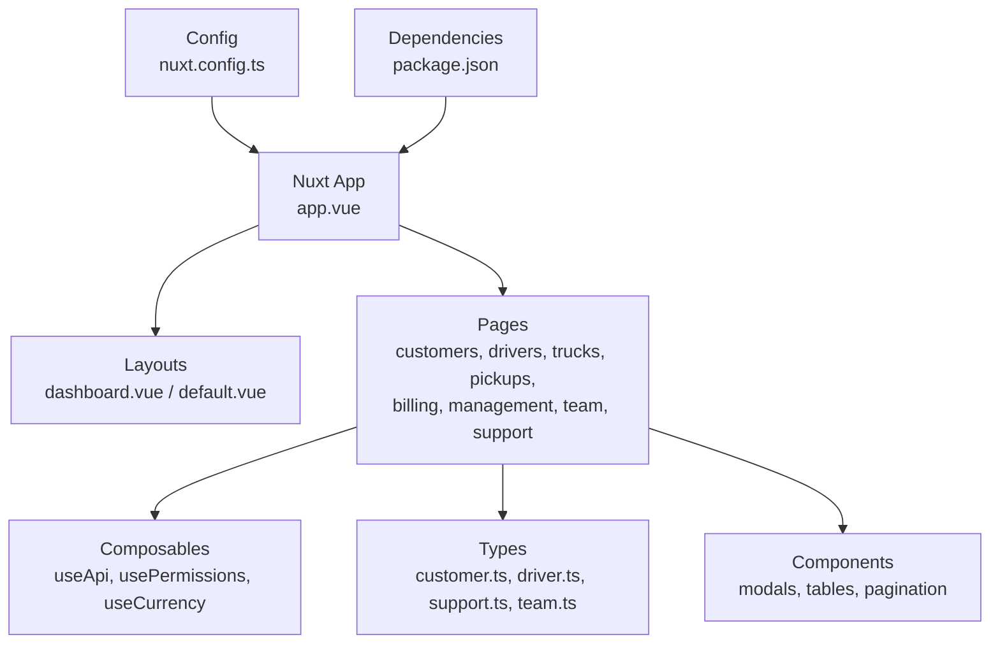
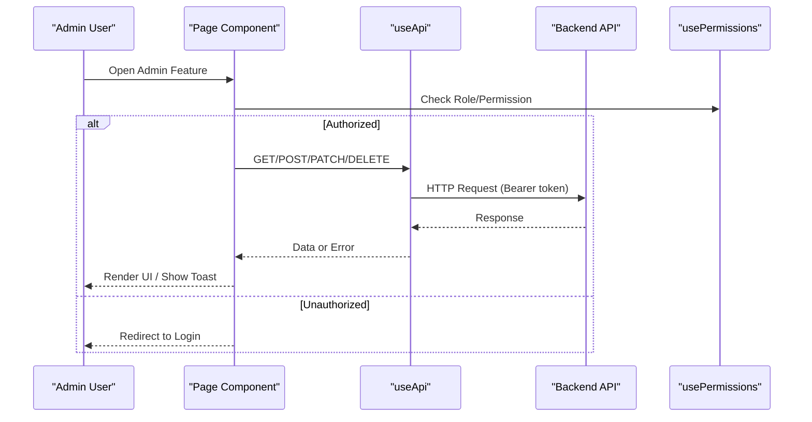
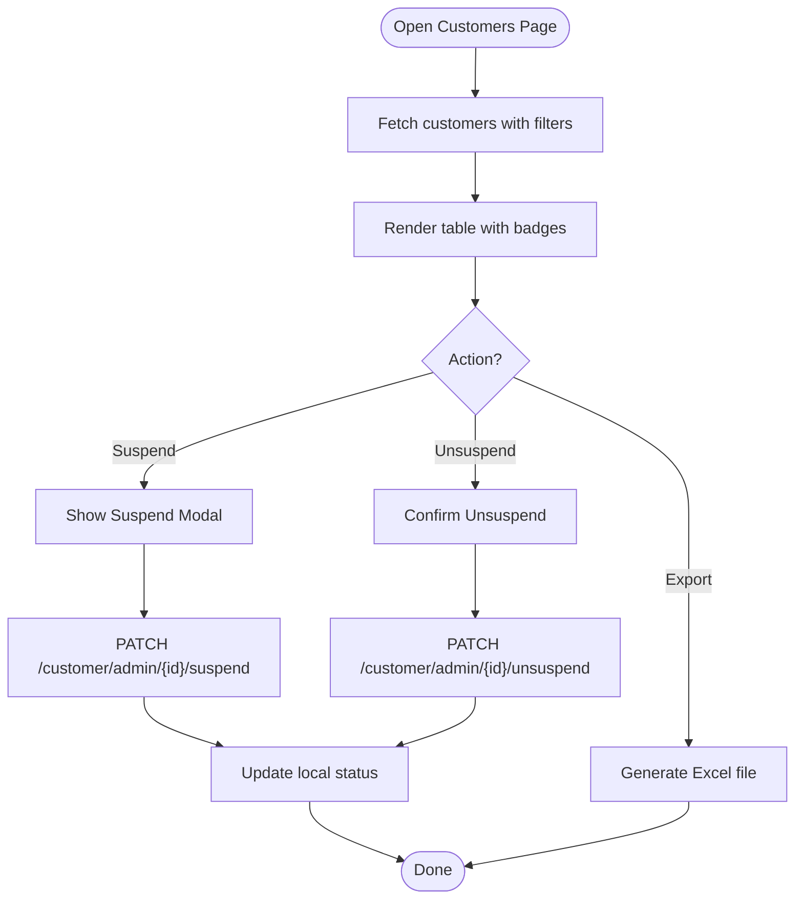
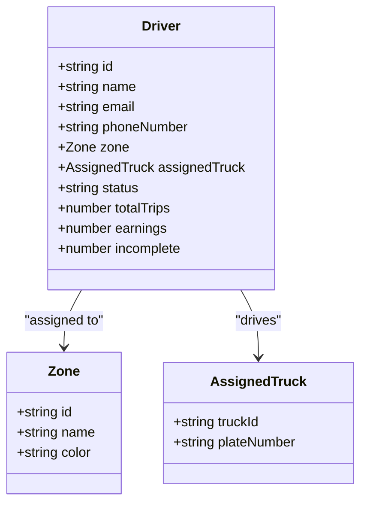
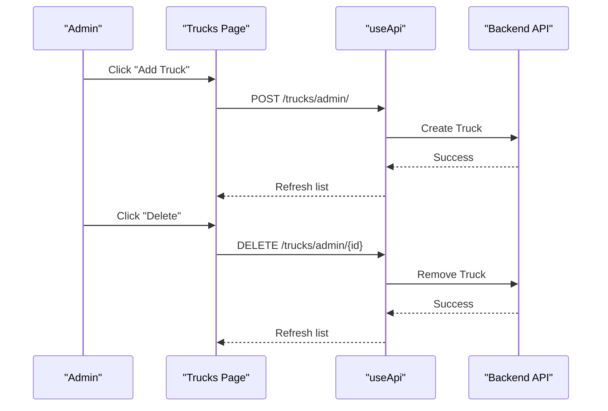
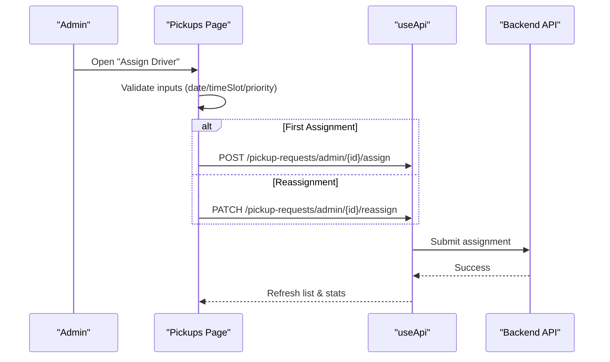
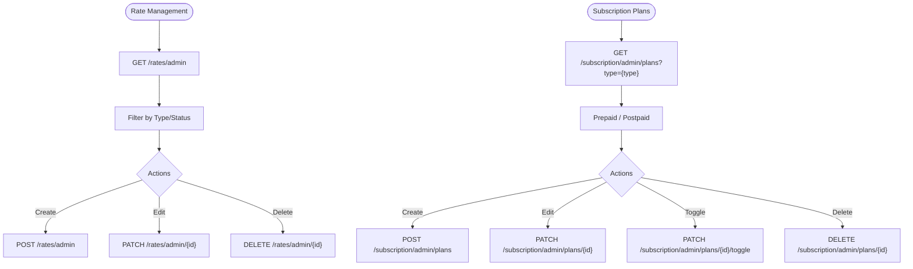
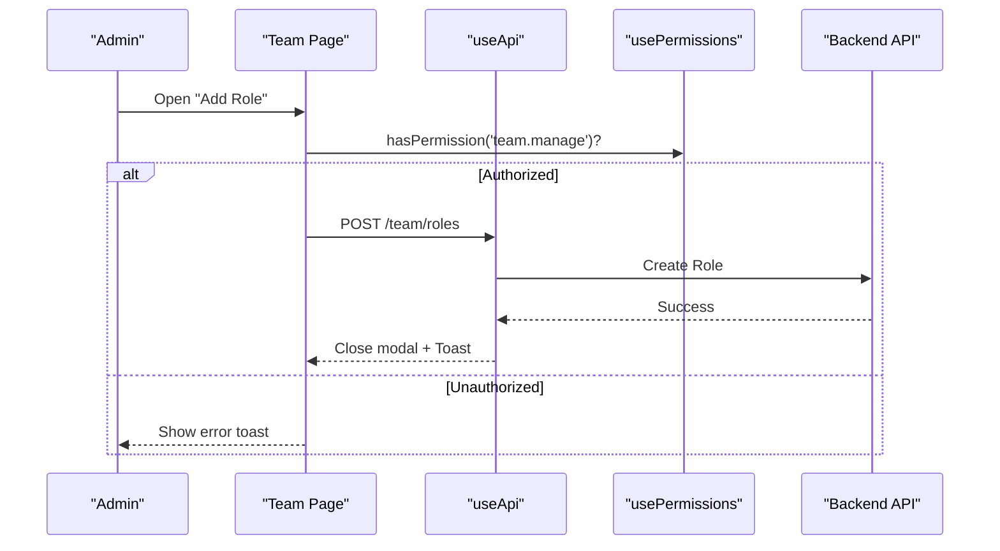
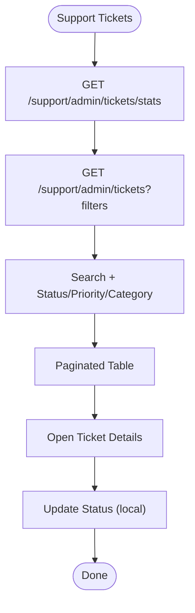
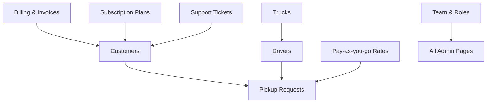

# Business Modules

<cite>
**Referenced Files in This Document**
- [README.md](file://README.md)
- [package.json](file://package.json)
- [nuxt.config.ts](file://nuxt.config.ts)
- [app.vue](file://app/app.vue)
- [useApi.ts](file://app/composables/useApi.ts)
- [usePermissions.ts](file://app/composables/usePermissions.ts)
- [customer.ts](file://app/types/customer.ts)
- [driver.ts](file://app/types/driver.ts)
- [support.ts](file://app/types/support.ts)
- [team.ts](file://app/types/team.ts)
- [customers/index.vue](file://app/pages/customers/index.vue)
- [drivers/index.vue](file://app/pages/drivers/index.vue)
- [trucks/index.vue](file://app/pages/trucks/index.vue)
- [pickups/index.vue](file://app/pages/pickups/index.vue)
- [billing/index.vue](file://app/pages/billing/index.vue)
- [management/rates.vue](file://app/pages/management/rates.vue)
- [management/subscriptions.vue](file://app/pages/management/subscriptions.vue)
- [team/index.vue](file://app/pages/team/index.vue)
- [support/index.vue](file://app/pages/support/index.vue)
</cite>

## Table of Contents
1. [Introduction](#introduction)
2. [Project Structure](#project-structure)
3. [Core Components](#core-components)
4. [Architecture Overview](#architecture-overview)
5. [Detailed Component Analysis](#detailed-component-analysis)
6. [Dependency Analysis](#dependency-analysis)
7. [Performance Considerations](#performance-considerations)
8. [Troubleshooting Guide](#troubleshooting-guide)
9. [Conclusion](#conclusion)
10. [Appendices](#appendices)

## Introduction
This document provides comprehensive documentation for the business modules in the Lacarte Atlas Console, covering customer management, fleet management (drivers and trucks), pickup operations, billing and subscriptions, team administration, and support systems. It explains user stories, feature descriptions, data models, CRUD operations, workflows, and integration patterns between modules. The console is a Nuxt 3 application that communicates with a backend API via a centralized HTTP client and uses role-based permissions to control access.

## Project Structure
The application follows a page-driven structure under app/pages, with shared composables, types, components, and middleware. Key configuration includes runtime API base URL and module setup.

**Diagram sources**
- [app.vue:1-33](file://app/app.vue#L1-L33)
- [nuxt.config.ts:1-46](file://nuxt.config.ts#L1-L46)
- [package.json:1-33](file://package.json#L1-L33)

**Section sources**
- [README.md:1-76](file://README.md#L1-L76)
- [package.json:1-33](file://package.json#L1-L33)
- [nuxt.config.ts:1-46](file://nuxt.config.ts#L1-L46)
- [app.vue:1-33](file://app/app.vue#L1-L33)

## Core Components
- Centralized API client: useApi composable handles authentication headers, error handling, redirects on 401, and typed wrappers for GET/POST/PATCH/DELETE.
- Permission utilities: usePermissions composable exposes helpers for permission and role checks used across admin pages.
- Shared UI: modals, pagination, toasts, and skeletons are reused across pages.

Key responsibilities:
- Authentication and session handling integrated into the root layout and auth store.
- Consistent error handling and toast notifications via useErrorHandler.
- Runtime configuration for API base URL and third-party keys.

**Section sources**
- [useApi.ts:1-91](file://app/composables/useApi.ts#L1-L91)
- [usePermissions.ts:1-43](file://app/composables/usePermissions.ts#L1-L43)
- [app.vue:1-33](file://app/app.vue#L1-L33)

## Architecture Overview
The console is a client-side SPA built with Nuxt 3. Pages call the backend through useApi, which injects Authorization tokens and centralizes error handling. Admin features enforce permissions using usePermissions. Data models are defined in TypeScript files under app/types.

**Diagram sources**
- [useApi.ts:1-91](file://app/composables/useApi.ts#L1-L91)
- [usePermissions.ts:1-43](file://app/composables/usePermissions.ts#L1-L43)

## Detailed Component Analysis

### Customer Management
Purpose:
- Admin users can list, search, filter, suspend/unsuspend customers, and export customer data to Excel.

User stories:
- As an admin, I want to view all customers with filters by status and plan type so I can manage accounts efficiently.
- As an admin, I want to suspend or unsuspend a customer account with a reason so I can enforce compliance.
- As an admin, I want to export the current filtered list to Excel for reporting.

CRUD and workflows:
- List customers with pagination and filters (search, status, plan).
- Suspend/Unsuspend via PATCH endpoints; local state updates reflect immediately.
- Export to Excel using xlsx library.

Data model highlights:
- Customer entity includes user details, phone number, address, customer type, zone, location, and timestamps.

Integration points:
- Uses useApi for requests and useAppToast for feedback.
- Integrates with billing and pickup modules via customer identifiers.

**Diagram sources**
- [customers/index.vue:1-352](file://app/pages/customers/index.vue#L1-L352)

**Section sources**
- [customers/index.vue:1-352](file://app/pages/customers/index.vue#L1-L352)
- [customer.ts:1-103](file://app/types/customer.ts#L1-L103)

### Fleet Management: Drivers
Purpose:
- Admin users can add drivers, view their assignments, earnings, and trip stats.

User stories:
- As an admin, I want to add a new driver and assign them to a zone and truck so they can start operations.
- As an admin, I want to see each driver’s assigned truck, zone, and performance metrics.

CRUD and workflows:
- Add Driver via POST /drivers/admin/.
- List drivers via GET /drivers/admin/.
- View details per driver via route /drivers/[id].

Data model highlights:
- Driver includes contact info, license details, zone assignment, status, assigned truck, and earnings/incomplete tasks.

Integration points:
- Links to trucks via assignedTruck.
- Used by pickup assignment logic to allocate work.

**Diagram sources**
- [driver.ts:1-106](file://app/types/driver.ts#L1-L106)

**Section sources**
- [drivers/index.vue:1-149](file://app/pages/drivers/index.vue#L1-L149)
- [driver.ts:1-106](file://app/types/driver.ts#L1-L106)

### Fleet Management: Trucks
Purpose:
- Admin users can add, view, and delete trucks, and see last GPS update and assigned driver.

User stories:
- As an admin, I want to register a new truck with capacity and registration details.
- As an admin, I want to delete a truck after confirming the action.

CRUD and workflows:
- Add Truck via POST /trucks/admin/.
- List trucks via GET /trucks/admin/.
- Delete Truck via DELETE /trucks/admin/{id}.

Data model highlights:
- Truck includes truckId, plateNumber, capacity, status, assignedDriver, gpsDeviceId, and registration expiry.

Integration points:
- Drivers reference assignedTruck; trucks show assignedDriver.

**Diagram sources**
- [trucks/index.vue:1-205](file://app/pages/trucks/index.vue#L1-L205)
- [useApi.ts:1-91](file://app/composables/useApi.ts#L1-L91)

**Section sources**
- [trucks/index.vue:1-205](file://app/pages/trucks/index.vue#L1-L205)
- [driver.ts:1-106](file://app/types/driver.ts#L1-L106)

### Pickup Operations
Purpose:
- Admin users can create pickup requests, assign/reassign drivers, and track statuses and payment states.

User stories:
- As an admin, I want to create a pickup request for a customer with preferred date and quantity tier.
- As an admin, I want to assign or reassign a driver with time slot and priority, then track progress.

CRUD and workflows:
- Create Pickup via modal submission.
- Assign/Reassign via POST /pickup-requests/admin/{id}/assign or PATCH /pickup-requests/admin/{id}/reassign.
- List with filters (status, paymentStatus) and pagination.
- Stats dashboard via GET /pickup-requests/admin/stats.

Data model highlights:
- PickupRequest includes customer, disposable item type, estimated quantity, payment type/status, and timestamps.

Integration points:
- References customer and driver entities; integrates with billing (payment status) and fleet (driver assignment).

**Diagram sources**
- [pickups/index.vue:1-567](file://app/pages/pickups/index.vue#L1-L567)
- [useApi.ts:1-91](file://app/composables/useApi.ts#L1-L91)

**Section sources**
- [pickups/index.vue:1-567](file://app/pages/pickups/index.vue#L1-L567)
- [customer.ts:1-103](file://app/types/customer.ts#L1-L103)

### Billing and Subscriptions
Purpose:
- Admin users can manage pay-as-you-go rates and subscription plans, view invoices, and handle pending bank transfers.

User stories:
- As an admin, I want to set pay-as-you-go rates per customer type and quantity tier.
- As an admin, I want to create, edit, toggle, and delete subscription plans (prepaid/postpaid).
- As an admin, I want to review and approve/decline pending bank transfers and view recent invoices.

CRUD and workflows:
- Rates:
  - Create via POST /rates/admin.
  - Read via GET /rates/admin and stats via GET /rates/admin/stats.
  - Edit via PATCH /rates/admin/{id}.
  - Delete via DELETE /rates/admin/{id}.
- Subscriptions:
  - Plans: GET /subscription/admin/plans?type=prepaid|postpaid; POST /subscription/admin/plans; PATCH /subscription/admin/plans/{id}; DELETE /subscription/admin/plans/{id}; Toggle via PATCH /subscription/admin/plans/{id}/toggle.
  - Stats: GET /subscription/admin/stats?type=prepaid|postpaid.
- Billing overview:
  - Pending transfers and invoices displayed with search and pagination.

Data model highlights:
- Rate includes customerTypeId, estimatedQuantityId, rate value, effectiveDate, note, isActive.
- Plan includes billingType, billingCycle, pickupCount, binCount, price, badgeColor, isActive.

Integration points:
- Rates influence pay-as-you-go pricing for pickups.
- Subscription plans affect customer billing cycles and eligibility.

**Diagram sources**
- [management/rates.vue:1-800](file://app/pages/management/rates.vue#L1-L800)
- [management/subscriptions.vue:1-800](file://app/pages/management/subscriptions.vue#L1-L800)

**Section sources**
- [management/rates.vue:1-800](file://app/pages/management/rates.vue#L1-L800)
- [management/subscriptions.vue:1-800](file://app/pages/management/subscriptions.vue#L1-L800)
- [billing/index.vue:1-430](file://app/pages/billing/index.vue#L1-L430)

### Team Administration
Purpose:
- Admin users can manage team members and roles, including creating roles and deleting members.

User stories:
- As an admin, I want to create roles with permissions so I can assign appropriate access levels.
- As an admin, I want to add/remove team members and view their roles and last login.

CRUD and workflows:
- Roles: Create via POST /team/roles.
- Members: List via GET /team/, delete via DELETE /team/{id}.
- Stats: GET /team/stats.

Authorization:
- Checks performed before sensitive actions (create roles, delete members).

Data model highlights:
- TeamMember includes firstName, lastName, email, phone, role, roleDetails, status, permissions, lastLogin.
- Role includes name, displayName, description, permissions, color, isSystem.

**Diagram sources**
- [team/index.vue:1-605](file://app/pages/team/index.vue#L1-L605)
- [usePermissions.ts:1-43](file://app/composables/usePermissions.ts#L1-L43)
- [useApi.ts:1-91](file://app/composables/useApi.ts#L1-L91)

**Section sources**
- [team/index.vue:1-605](file://app/pages/team/index.vue#L1-L605)
- [team.ts:1-65](file://app/types/team.ts#L1-L65)

### Support Systems
Purpose:
- Admin users can view, filter, and manage support tickets, including status transitions and viewing details.

User stories:
- As a support agent, I want to filter tickets by status, priority, category, and search terms.
- As a support agent, I want to open ticket details and update status to resolve issues faster.

CRUD and workflows:
- List tickets with pagination and filters via GET /support/admin/tickets.
- Stats via GET /support/admin/tickets/stats.
- Open detail modal and update status locally (future integration may persist changes).

Data model highlights:
- SupportTicket includes subject, category, priority, status, customer info, and timestamps.
- TicketStats includes openTickets, inProgressTickets, resolvedToday, avgResponseHours.

**Diagram sources**
- [support/index.vue:1-422](file://app/pages/support/index.vue#L1-L422)

**Section sources**
- [support/index.vue:1-422](file://app/pages/support/index.vue#L1-L422)
- [support.ts:1-81](file://app/types/support.ts#L1-L81)

## Dependency Analysis
Module interactions:
- Customers link to zones and customer types; pickups reference customers and drivers; billing references customers and plans; team manages roles and permissions affecting access to these modules.
- Fleet management (drivers/trucks) supports pickup assignment and tracking.

[No sources needed since this diagram shows conceptual relationships]

## Performance Considerations
- Use pagination and server-side filtering where available to reduce payload sizes.
- Debounce search inputs if client-side filtering becomes heavy.
- Lazy-load heavy libraries like xlsx only when exporting.
- Prefer parallel fetches (e.g., stats + lists) to improve perceived performance.
- Cache static lookups (customer types, quantities) in composables or stores if frequently accessed.

[No sources needed since this section provides general guidance]

## Troubleshooting Guide
Common issues and resolutions:
- 401 Unauthorized: The API client automatically logs out and redirects to login. Ensure the token is present and not expired.
- Network errors: useErrorHandler wraps failures and shows toasts; verify network connectivity and API base URL.
- Validation errors: Some endpoints return 400 validation messages; ensure payloads match expected schemas.
- Missing data: If fields appear empty, check backend response shape and mapping in the page component.

Operational tips:
- Inspect console logs from useApi for request/response details.
- Verify runtime config values (NUXT_PUBLIC_API_BASE) in nuxt.config.ts.
- For permission-related blocks, confirm the user has required roles/permissions.

**Section sources**
- [useApi.ts:1-91](file://app/composables/useApi.ts#L1-L91)
- [nuxt.config.ts:1-46](file://nuxt.config.ts#L1-L46)

## Conclusion
The Lacarte Atlas Console provides robust administrative capabilities across customers, fleet, pickups, billing, subscriptions, team, and support. Each module implements clear CRUD flows, consistent error handling, and permission checks. Integration points between modules enable end-to-end operational workflows from customer onboarding to service delivery and billing.

[No sources needed since this section summarizes without analyzing specific files]

## Appendices

### API Endpoints Summary (Selected)
- Customers
  - GET /customer/admin/list
  - PATCH /customer/admin/{id}/suspend
  - PATCH /customer/admin/{id}/unsuspend
- Drivers
  - GET /drivers/admin/
  - POST /drivers/admin/
- Trucks
  - GET /trucks/admin/
  - POST /trucks/admin/
  - DELETE /trucks/admin/{id}
- Pickups
  - GET /pickup-requests/admin/list
  - GET /pickup-requests/admin/stats
  - POST /pickup-requests/admin/{id}/assign
  - PATCH /pickup-requests/admin/{id}/reassign
- Rates
  - GET /rates/admin
  - GET /rates/admin/stats
  - POST /rates/admin
  - PATCH /rates/admin/{id}
  - DELETE /rates/admin/{id}
- Subscriptions
  - GET /subscription/admin/plans?type={type}
  - POST /subscription/admin/plans
  - PATCH /subscription/admin/plans/{id}
  - DELETE /subscription/admin/plans/{id}
  - PATCH /subscription/admin/plans/{id}/toggle
  - GET /subscription/admin/stats?type={type}
- Team
  - GET /team/
  - POST /team/roles
  - DELETE /team/{id}
  - GET /team/stats
- Support
  - GET /support/admin/tickets
  - GET /support/admin/tickets/stats

[No sources needed since this section aggregates endpoint usage patterns]