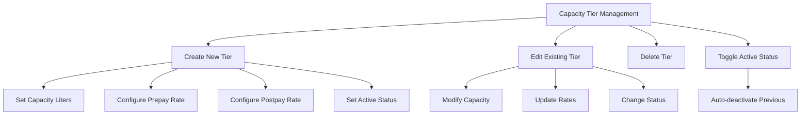

# Customer Management

<cite>
**Referenced Files in This Document**
- [customer.ts](file://app/types/customer.ts)
- [CustomerModal.vue](file://app/components/CustomerModal.vue)
- [EditCustomerModal.vue](file://app/components/EditCustomerModal.vue)
- [customer-types.vue](file://app/pages/management/customer-types.vue)
- [rates.vue](file://app/pages/management/rates.vue)
- [index.vue](file://app/pages/customers/index.vue)
</cite>

## Update Summary
**Changes Made**
- Added comprehensive documentation for pricingMode field support in customer types system
- Updated customer form sections to include conditional logic based on pricing mode (per_bin vs full_truck)
- Enhanced capacity tier selection dropdown integration for per-bin pricing customers
- Added detailed explanations of capacityRateId field usage and validation
- Updated customer type management interface with radio button selection for pricing strategies
- Integrated new capacity tier management functionality with rates system

## Table of Contents
1. [Overview](#overview)
2. [Customer Data Models](#customer-data-models)
3. [Pricing Mode System](#pricing-mode-system)
4. [Customer Creation Workflow](#customer-creation-workflow)
5. [Customer Editing Workflow](#customer-editing-workflow)
6. [Capacity Tier Management](#capacity-tier-management)
7. [Form Validation Rules](#form-validation-rules)
8. [API Integration Patterns](#api-integration-patterns)
9. [Error Handling Strategies](#error-handling-strategies)
10. [Common Workflows](#common-workflows)

## Overview

The Customer Management module provides comprehensive functionality for managing customer accounts, including creation, editing, viewing, and deletion operations. The system supports two distinct pricing modes that determine how customers are billed: **per_bin** pricing (based on bin size × number of bins) and **full_truck** pricing (flat rate per trip).

The module integrates with the capacity tier management system to provide flexible pricing options for per-bin customers, allowing administrators to configure different bin capacities and associated rates.

## Customer Data Models

### Core Customer Types

The customer data model has been enhanced with the `pricingMode` field to support different pricing strategies:

```typescript
interface CustomerType {
  id: string
  name: string
  pricingMode?: 'per_bin' | 'full_truck'  // NEW: Determines pricing strategy
  createdAt: string
  updatedAt: string
}

interface Customer {
  id: string
  userId: string
  customerTypeId: string
  zoneId: string
  phoneNumber: string
  noBins: number
  capacityRateId?: string | null  // NEW: Links to capacity tier for per_bin pricing
  status: string
  address: string | null
  city: string | null
  region: string | null
  postalCode: string | null
  country: string | null
  placeName: string | null
  locationUpdatedAt: string | null
  location: { latitude: number; longitude: number } | null
  createdAt: string
  updatedAt: string
  user: CustomerUser
  customerType: CustomerType | null
  zone: CustomerZone | null
}
```

**Section sources**
- [customer.ts:18-24](file://app/types/customer.ts#L18-L24)
- [customer.ts:35-57](file://app/types/customer.ts#L35-L57)

### Capacity Tier Model

Capacity tiers define the available bin sizes and their associated pricing:

```typescript
interface CapacityTier {
  id: string
  capacityLiters: number
  prepayRate: number
  postpayRate: number
  isActive: boolean
  createdAt: string
  updatedAt: string
}
```

**Section sources**
- [rates.vue:4-12](file://app/pages/management/rates.vue#L4-L12)

## Pricing Mode System

The pricing mode system is a core enhancement that allows administrators to configure different billing strategies for customer types.

### Pricing Mode Options

1. **Per Bin Pricing (`per_bin`)**
   - Customers are charged based on bin size × number of bins
   - Requires capacity tier selection during customer creation/editing
   - Supports multiple capacity tiers with different rates

2. **Full Truck Pricing (`full_truck`)**
   - Customers are charged a flat rate per trip regardless of bin count
   - No capacity tier selection required
   - Simplified billing structure

### Pricing Mode Configuration

The customer type management interface provides radio button selection for pricing modes with descriptive help text:

```javascript
const pricingModeHelper = (mode: PricingMode) =>
  mode === 'per_bin'
    ? 'Customers priced by bin size × number of bins'
    : 'Customers priced by truck load tier (flat per trip)'
```

**Section sources**
- [customer-types.vue:109-113](file://app/pages/management/customer-types.vue#L109-L113)

### Conditional Form Logic

Customer forms implement conditional logic based on the selected customer type's pricing mode:

```javascript
// Whether the selected customer type is priced per bin
const isPerBinType = computed(() => {
  const ct = customerTypes.value.find(t => t.id === form.customerTypeId)
  return (ct?.pricingMode ?? 'per_bin') === 'per_bin'
})
```

This computed property determines whether to show the capacity tier selection dropdown and apply relevant validation rules.

**Section sources**
- [CustomerModal.vue:61-64](file://app/components/CustomerModal.vue#L61-L64)
- [EditCustomerModal.vue:45-48](file://app/components/EditCustomerModal.vue#L45-L48)

## Customer Creation Workflow

### Enhanced Customer Modal

The customer creation modal includes conditional fields based on pricing mode:

#### Per-Bin Pricing Flow
When a customer type with `pricingMode: 'per_bin'` is selected:

1. **Capacity Tier Selection**: A dropdown appears allowing selection from available capacity tiers
2. **Validation**: Capacity tier becomes a required field
3. **Payload Construction**: The `capacityRateId` is included in the API payload

#### Full Truck Pricing Flow
When a customer type with `pricingMode: 'full_truck'` is selected:

1. **Simplified Interface**: No capacity tier selection required
2. **Reduced Validation**: Fewer required fields
3. **Payload Construction**: `capacityRateId` is not included in the payload

### Form Implementation

```html
<!-- Bin Capacity (per_bin pricing mode only) -->
<div v-if="isPerBinType" style="display:flex;flex-direction;gap:6px">
  <label style="font-size:14px;font-weight:500;color:#1a1a1a;font-family:'Manrope',sans-serif">Bin Capacity</label>
  <select v-model="form.capacityRateId" :style="...">
    <option value="" disabled>Select bin capacity</option>
    <option v-for="tier in capacityTiers" :key="tier.id" :value="tier.id">
      {{ tier.capacityLiters }}L — GHS {{ tier.prepayRate }}/pickup
    </option>
  </select>
  <span v-if="errors.capacityRateId" style="font-size:12px;color:#ef4444">{{ errors.capacityRateId }}</span>
</div>
```

**Section sources**
- [CustomerModal.vue:293-306](file://app/components/CustomerModal.vue#L293-L306)

### Payload Construction

The submission logic conditionally includes the `capacityRateId` field:

```javascript
async function submit() {
  if (!validate()) return
  loading.value = true
  
  const payload: Record<string, unknown> = {
    email: form.email.trim(),
    name: `${form.firstName.trim()} ${form.lastName.trim()}`.trim(),
    phoneNumber: form.phone.trim(),
    customerTypeId: form.customerTypeId,
    zoneId: form.zoneId,
    noBins: form.binCount,
    address: form.address.trim(),
    city: form.city.trim(),
    region: form.region.trim(),
    postalCode: form.postalCode.trim(),
    country: form.country.trim(),
    placeName: form.placeName.trim(),
    location: {
      latitude: Number(form.latitude) || 0,
      longitude: Number(form.longitude) || 0,
    },
  }
  
  // Only per_bin customers get a capacity rate assigned at profile level
  if (isPerBinType.value && form.capacityRateId) {
    payload.capacityRateId = form.capacityRateId
  }
  
  const result = await api.post('/customer/admin/', payload, 'Failed to create customer')
  // ... rest of submission logic
}
```

**Section sources**
- [CustomerModal.vue:174-205](file://app/components/CustomerModal.vue#L174-L205)

## Customer Editing Workflow

### Edit Modal Enhancements

The edit customer modal mirrors the creation workflow with conditional logic:

#### Dynamic Field Visibility
- Capacity tier dropdown appears/disappears based on customer type's pricing mode
- Real-time updates when customer type changes
- Proper handling of existing `capacityRateId` values

#### Validation Updates
- Conditional validation for `capacityRateId` when pricing mode is `per_bin`
- Maintains consistency with creation form validation rules

### Edit Submission Logic

```javascript
function submit() {
  if (props.saving) return
  if (!validate()) return
  
  emit('submit', {
    customerTypeId: form.customerTypeId,
    zoneId: form.zoneId,
    phoneNumber: form.phoneNumber.trim(),
    noBins: Number(form.noBins),
    capacityRateId: isPerBinType.value ? (form.capacityRateId || null) : null,
    address: form.address.trim(),
    city: form.city.trim(),
    region: form.region?.trim() ?? '',
    postalCode: form.postalCode?.trim() ?? '',
    country: form.country?.trim() ?? '',
    placeName: form.placeName?.trim() ?? '',
  })
}
```

**Section sources**
- [EditCustomerModal.vue:78-94](file://app/components/EditCustomerModal.vue#L78-L94)

## Capacity Tier Management

### Capacity Tier Configuration

The capacity tier management system allows administrators to define different bin sizes and their associated pricing:

#### Tier Properties
- **capacityLiters**: Volume capacity in liters
- **prepayRate**: Prepaid pickup rate per bin
- **postpayRate**: Postpaid pickup rate per bin
- **isActive**: Whether the tier is available for selection

#### Management Interface
The rates management page provides comprehensive CRUD operations for capacity tiers:



**Diagram sources**
- [rates.vue:81-150](file://app/pages/management/rates.vue#L81-L150)

### Integration with Customer Forms

Capacity tiers are loaded and displayed in customer forms:

```javascript
async function fetchCapacityTiers() {
  const data = await api.get<{ tiers: CapacityTierOption[] }>('/rates/admin/capacity', 'Failed to load bin capacities')
  if (data) {
    capacityTiers.value = (data.tiers || []).filter(t => t.capacityLiters != null)
  }
}
```

**Section sources**
- [CustomerModal.vue:146-151](file://app/components/CustomerModal.vue#L146-L151)

## Form Validation Rules

### Conditional Validation

The validation system implements conditional rules based on pricing mode:

```javascript
function validate() {
  Object.keys(errors).forEach(k => delete errors[k])
  
  // Basic validation
  if (!form.phoneNumber.trim())  errors.phoneNumber = 'Required'
  if (!form.address.trim())      errors.address = 'Required'
  if (!form.city.trim())         errors.city = 'Required'
  if (!form.customerTypeId)      errors.customerTypeId = 'Required'
  if (!form.zoneId)              errors.zoneId = 'Required'
  
  // Conditional validation for per_bin pricing
  if (isPerBinType.value && !form.capacityRateId) 
    errors.capacityRateId = 'Required'
  
  return Object.keys(errors).length === 0
}
```

### Validation States

| Field | Required For | Validation Rule | Error Message |
|-------|--------------|-----------------|---------------|
| `phoneNumber` | All customers | Non-empty string | "Required" |
| `address` | All customers | Non-empty string | "Required" |
| `city` | All customers | Non-empty string | "Required" |
| `customerTypeId` | All customers | Valid ID | "Required" |
| `zoneId` | All customers | Valid ID | "Required" |
| `capacityRateId` | Per-bin only | Valid capacity tier ID | "Required" |

**Section sources**
- [EditCustomerModal.vue:66-76](file://app/components/EditCustomerModal.vue#L66-L76)
- [CustomerModal.vue:161-172](file://app/components/CustomerModal.vue#L161-L172)

## API Integration Patterns

### Customer Type Management

The customer types API supports the new `pricingMode` field:

```javascript
// Create customer type with pricing mode
const payload = {
  name: addForm.value.name.trim(),
  pricingMode: addForm.value.pricingMode,  // 'per_bin' or 'full_truck'
}

if (addSelectedQuantityIds.value.length > 0) {
  payload.estimatedQuantityIds = addSelectedQuantityIds.value
}

const response = await api.post('/customer/admin/types', payload, 'Failed to create customer type')
```

### Customer Creation/Update

Customer APIs handle the conditional `capacityRateId` field:

```javascript
// Customer creation payload
const payload = {
  // ... other fields
  customerTypeId: form.customerTypeId,
  noBins: form.binCount,
  // capacityRateId only included for per_bin pricing
  ...(isPerBinType.value && form.capacityRateId ? { capacityRateId: form.capacityRateId } : {})
}
```

### Capacity Tier Management

Capacity tiers are managed through the rates API:

```javascript
// Fetch capacity tiers
const response = await api.get('/rates/admin/capacity?includeInactive=true', 'Failed to load capacity tiers')

// Create/update capacity tier
await api.request('/rates/admin/capacity', {
  method: 'POST',
  body: JSON.stringify({
    capacityLiters: Number(capacityForm.value.capacityLiters),
    prepayRate: Number(capacityForm.value.prepayRate),
    postpayRate: Number(capacityForm.value.postpayRate),
    isActive: capacityForm.value.isActive,
  }),
})
```

**Section sources**
- [customer-types.vue:114-163](file://app/pages/management/customer-types.vue#L114-L163)
- [CustomerModal.vue:174-205](file://app/components/CustomerModal.vue#L174-L205)
- [rates.vue:110-150](file://app/pages/management/rates.vue#L110-L150)

## Error Handling Strategies

### Form-Level Validation Errors

The system provides immediate feedback for form validation errors:

```javascript
const errors = reactive<Record<string, string>>({})

function validate() {
  Object.keys(errors).forEach(k => delete errors[k])
  
  // Validation logic with specific error messages
  if (!form.capacityRateId && isPerBinType.value) {
    errors.capacityRateId = 'Required'
  }
  
  return Object.keys(errors).length === 0
}
```

### API Error Handling

API calls include proper error handling with user-friendly messages:

```javascript
try {
  const response = await api.post('/customer/admin/types', payload, 'Failed to create customer type')
  toast.success('Customer type created successfully')
} catch (err: any) {
  console.error('[CustomerTypes] Failed to create:', err)
  const errorMessage = err?.message || 'Failed to create customer type'
  
  // Handle specific error cases
  if (errorMessage.toLowerCase().includes('already exists') || 
      errorMessage.toLowerCase().includes('duplicate')) {
    addError.value = 'A customer type with this name already exists'
  } else {
    addError.value = errorMessage
  }
}
```

### Capacity Tier Validation

Capacity tier forms include comprehensive validation:

```javascript
function validateCapacityForm(): string | null {
  const cap = Number(capacityForm.value.capacityLiters)
  const prepay = Number(capacityForm.value.prepayRate)
  const postpay = Number(capacityForm.value.postpayRate)
  
  if (!capacityForm.value.capacityLiters || isNaN(cap) || cap <= 0) 
    return 'Capacity (liters) must be a positive number.'
  if (!capacityForm.value.prepayRate || isNaN(prepay) || prepay < 0) 
    return 'Prepay rate must be a valid amount.'
  if (!capacityForm.value.postpayRate || isNaN(postpay) || postpay < 0) 
    return 'Postpay rate must be a valid amount.'
  
  return null
}
```

**Section sources**
- [customer-types.vue:150-163](file://app/pages/management/customer-types.vue#L150-L163)
- [rates.vue:100-108](file://app/pages/management/rates.vue#L100-L108)

## Common Workflows

### Creating a Per-Bin Customer

1. **Navigate to Customer Management**: Access the customer creation modal
2. **Select Customer Type**: Choose a customer type with `pricingMode: 'per_bin'`
3. **Configure Capacity**: Select appropriate capacity tier from dropdown
4. **Fill Required Fields**: Complete all mandatory customer information
5. **Submit**: Create the customer with capacity tier assignment

### Creating a Full Truck Customer

1. **Navigate to Customer Management**: Access the customer creation modal
2. **Select Customer Type**: Choose a customer type with `pricingMode: 'full_truck'`
3. **Fill Required Fields**: Complete basic customer information (no capacity selection needed)
4. **Submit**: Create the simplified customer profile

### Managing Capacity Tiers

1. **Access Rates Management**: Navigate to the rates management page
2. **Add New Tier**: Click "Add Capacity Tier" button
3. **Configure Tier**: Set capacity liters, prepay/postpay rates, and active status
4. **Save**: Create the new capacity tier for use in customer forms

### Updating Customer Pricing Strategy

1. **Edit Customer**: Open the customer edit modal
2. **Change Customer Type**: Switch to different customer type if needed
3. **Update Capacity**: Adjust capacity tier selection based on new pricing mode
4. **Save Changes**: Apply the updated configuration

These workflows demonstrate the flexibility of the enhanced customer management system with its support for different pricing strategies and capacity tier configurations.