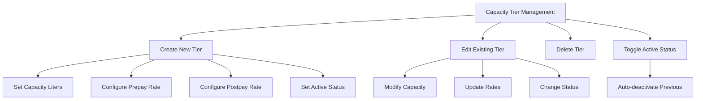

# Customer Management

<cite>
**Referenced Files in This Document**
- [customer.ts](file://app/types/customer.ts)
- [CustomerModal.vue](file://app/components/CustomerModal.vue)
- [EditCustomerModal.vue](file://app/components/EditCustomerModal.vue)
- [customer-types.vue](file://app/pages/management/customer-types.vue)
- [rates.vue](file://app/pages/management/rates.vue)
- [index.vue](file://app/pages/customers/index.vue)
</cite>

## Update Summary
**Changes Made**
- Added comprehensive documentation for GPS location capture functionality using TomTom Maps SDK
- Enhanced customer form sections with reverse geocoding capabilities for automatic address field population
- Integrated comprehensive error handling for GPS permission denials and network issues
- Updated location capture workflow with user-friendly feedback and fallback mechanisms
- Added detailed explanations of geolocation API integration and TomTom reverse geocoding services

## Table of Contents
1. [Overview](#overview)
2. [Customer Data Models](#customer-data-models)
3. [GPS Location Capture System](#gps-location-capture-system)
4. [Pricing Mode System](#pricing-mode-system)
5. [Customer Creation Workflow](#customer-creation-workflow)
6. [Customer Editing Workflow](#customer-editing-workflow)
7. [Capacity Tier Management](#capacity-tier-management)
8. [Form Validation Rules](#form-validation-rules)
9. [API Integration Patterns](#api-integration-patterns)
10. [Error Handling Strategies](#error-handling-strategies)
11. [Common Workflows](#common-workflows)

## Overview

The Customer Management module provides comprehensive functionality for managing customer accounts, including creation, editing, viewing, and deletion operations. The system supports two distinct pricing modes that determine how customers are billed: **per_bin** pricing (based on bin size × number of bins) and **full_truck** pricing (flat rate per trip).

The module integrates with the capacity tier management system to provide flexible pricing options for per-bin customers, allowing administrators to configure different bin capacities and associated rates. Additionally, it features advanced GPS location capture capabilities for field-based customer sign-ups, enabling staff to automatically capture customer locations and populate address fields.

## Customer Data Models

### Core Customer Types

The customer data model has been enhanced with the `pricingMode` field to support different pricing strategies:

```typescript
interface CustomerType {
  id: string
  name: string
  pricingMode?: 'per_bin' | 'full_truck'  // Determines pricing strategy
  createdAt: string
  updatedAt: string
}

interface Customer {
  id: string
  userId: string
  customerTypeId: string
  zoneId: string
  phoneNumber: string
  noBins: number
  capacityRateId?: string | null  // Links to capacity tier for per_bin pricing
  status: string
  address: string | null
  city: string | null
  region: string | null
  postalCode: string | null
  country: string | null
  placeName: string | null
  locationUpdatedAt: string | null
  location: { latitude: number; longitude: number } | null
  createdAt: string
  updatedAt: string
  user: CustomerUser
  customerType: CustomerType | null
  zone: CustomerZone | null
}
```

**Section sources**
- [customer.ts:18-24](file://app/types/customer.ts#L18-L24)
- [customer.ts:35-57](file://app/types/customer.ts#L35-L57)

### Capacity Tier Model

Capacity tiers define the available bin sizes and their associated pricing:

```typescript
interface CapacityTier {
  id: string
  capacityLiters: number
  prepayRate: number
  postpayRate: number
  isActive: boolean
  createdAt: string
  updatedAt: string
}
```

**Section sources**
- [rates.vue:4-12](file://app/pages/management/rates.vue#L4-L12)

## GPS Location Capture System

**Updated** The Customer Management module now includes advanced GPS location capture capabilities designed specifically for field-based customer sign-ups. This system enables staff members to capture customer locations directly from their devices and automatically populate address fields using reverse geocoding.

### GPS Location Capture Features

The location capture system provides several key functionalities:

#### Device GPS Acquisition
- **High-Accuracy GPS**: Uses `navigator.geolocation.getCurrentPosition()` with high accuracy settings
- **Permission Handling**: Comprehensive error handling for permission denials and network issues
- **Timeout Management**: Configurable timeout (15 seconds) with user feedback during location acquisition

#### Reverse Geocoding Integration
- **TomTom Maps SDK**: Integrates with TomTom's reverse geocoding service to convert coordinates to addresses
- **Automatic Field Population**: Populates address, city, region, postal code, country, and place name fields
- **Fallback Support**: Gracefully handles reverse geocoding failures while preserving captured coordinates

#### User Interface Enhancements
- **Visual Feedback**: Loading indicators and status messages during location capture
- **Error Display**: Clear error messages for various failure scenarios
- **One-Tap Operation**: Simplified interface for quick location capture in field environments

### Location Capture Implementation

The GPS location capture is implemented through a dedicated function that handles the complete workflow:

```javascript
async function fetchCurrentLocation() {
  if (locating.value) return
  geoError.value = ''

  if (!('geolocation' in navigator)) {
    geoError.value = 'Location is not supported on this device.'
    return
  }

  locating.value = true
  try {
    const position = await new Promise<GeolocationPosition>((resolve, reject) => {
      navigator.geolocation.getCurrentPosition(resolve, reject, {
        enableHighAccuracy: true,
        timeout: 15000,
        maximumAge: 0,
      })
    })
    const { latitude, longitude } = position.coords
    form.latitude = String(latitude)
    form.longitude = String(longitude)

    // Resolve the coordinates into address fields
    try {
      const place = await reverseGeocode({
        position: [longitude, latitude],
        apiKey: config.public.tomtomApiKey as string,
      }) as TomTomPlace
      if (place) fillFormFromPlace(place)
      toast.success('Location captured')
    } catch (err) {
      console.error('Reverse geocode error:', err)
      toast.success('Coordinates captured — fill the address details manually')
    }
  } catch (err) {
    const e = err as GeolocationPositionError
    if (e?.code === e.PERMISSION_DENIED) {
      geoError.value = 'Location permission denied. Allow location access for this site and try again.'
    } else if (e?.code === e.TIMEOUT) {
      geoError.value = 'Getting your location timed out. Try again in an open area.'
    } else {
      geoError.value = 'Could not determine your location. Check GPS/network and try again.'
    }
  } finally {
    locating.value = false
  }
}
```

### Address Autocomplete with TomTom Geocoding

The system also includes address autocomplete functionality powered by TomTom's geocoding service:

#### Geocoding Features
- **Debounced Search**: 500ms delay between keystrokes to optimize API calls
- **Country Filtering**: Results filtered to Ghana (GH) only for local relevance
- **Suggestion Display**: Dropdown list showing up to 5 most relevant addresses
- **Field Population**: Automatic population of all address-related fields when a suggestion is selected

#### Geocoding Implementation
```javascript
function debouncedGeocode(query: string) {
  if (geocodeTimeout) clearTimeout(geocodeTimeout)
  if (!query.trim()) {
    addressSuggestions.value = []
    showSuggestions.value = false
    return
  }
  geocodeTimeout = setTimeout(() => fetchAddressSuggestions(query), 500)
}

async function fetchAddressSuggestions(query: string) {
  geocoding.value = true
  try {
    const results = await geocode({
      query,
      limit: 10,
      position: GHANA_CENTER,
      apiKey: config.public.tomtomApiKey as string,
    }) as { features: TomTomPlace[] }
    const features = (results.features || []).filter((place) => {
      const cc = place.properties.address?.countryCode
      return !cc || cc.toUpperCase() === 'GH'
    })
    addressSuggestions.value = features.slice(0, 5)
    showSuggestions.value = features.length > 0
  } catch (err) {
    console.error('TomTom geocode error:', err)
    addressSuggestions.value = []
    showSuggestions.value = false
  } finally {
    geocoding.value = false
  }
}
```

### Error Handling Strategy

The GPS location capture system implements comprehensive error handling for various scenarios:

#### Permission Errors
- **Browser Not Supported**: Detects when geolocation API is unavailable
- **Permission Denied**: Provides clear instructions for users to enable location permissions
- **Network Issues**: Handles connectivity problems gracefully

#### Timeout and Network Errors
- **GPS Timeout**: 15-second timeout with user-friendly messaging
- **Reverse Geocoding Failures**: Falls back to coordinate-only mode with manual address entry
- **API Key Issues**: Validates TomTom API key configuration

#### User Experience Considerations
- **Loading States**: Visual feedback during location acquisition
- **Success Messages**: Confirmation when location is successfully captured
- **Graceful Degradation**: System continues to work even if reverse geocoding fails

**Section sources**
- [CustomerModal.vue:128-196](file://app/components/CustomerModal.vue#L128-L196)
- [CustomerModal.vue:72-104](file://app/components/CustomerModal.vue#L72-L104)
- [CustomerModal.vue:134-147](file://app/components/CustomerModal.vue#L134-L147)

## Pricing Mode System

The pricing mode system is a core enhancement that allows administrators to configure different billing strategies for customer types.

### Pricing Mode Options

1. **Per Bin Pricing (`per_bin`)**
   - Customers are charged based on bin size × number of bins
   - Requires capacity tier selection during customer creation/editing
   - Supports multiple capacity tiers with different rates

2. **Full Truck Pricing (`full_truck`)**
   - Customers are charged a flat rate per trip regardless of bin count
   - No capacity tier selection required
   - Simplified billing structure

### Pricing Mode Configuration

The customer type management interface provides radio button selection for pricing modes with descriptive help text:

```javascript
const pricingModeHelper = (mode: PricingMode) =>
  mode === 'per_bin'
    ? 'Customers priced by bin size × number of bins'
    : 'Customers priced by truck load tier (flat per trip)'
```

**Section sources**
- [customer-types.vue:109-113](file://app/pages/management/customer-types.vue#L109-L113)

### Conditional Form Logic

Customer forms implement conditional logic based on the selected customer type's pricing mode:

```javascript
// Whether the selected customer type is priced per bin
const isPerBinType = computed(() => {
  const ct = customerTypes.value.find(t => t.id === form.customerTypeId)
  return (ct?.pricingMode ?? 'per_bin') === 'per_bin'
})
```

This computed property determines whether to show the capacity tier selection dropdown and apply relevant validation rules.

**Section sources**
- [CustomerModal.vue:61-64](file://app/components/CustomerModal.vue#L61-L64)
- [EditCustomerModal.vue:45-48](file://app/components/EditCustomerModal.vue#L45-L48)

## Customer Creation Workflow

### Enhanced Customer Modal

The customer creation modal includes conditional fields based on pricing mode and GPS location capture capabilities:

#### Per-Bin Pricing Flow
When a customer type with `pricingMode: 'per_bin'` is selected:

1. **Capacity Tier Selection**: A dropdown appears allowing selection from available capacity tiers
2. **Validation**: Capacity tier becomes a required field
3. **Payload Construction**: The `capacityRateId` is included in the API payload

#### Full Truck Pricing Flow
When a customer type with `pricingMode: 'full_truck'` is selected:

1. **Simplified Interface**: No capacity tier selection required
2. **Reduced Validation**: Fewer required fields
3. **Payload Construction**: `capacityRateId` is not included in the payload

#### GPS Location Capture Integration
For field-based customer sign-ups:

1. **Location Button**: Prominent "Use My Current Location" button in the form
2. **One-Tap Capture**: Single tap captures GPS coordinates and reverse geocodes to address
3. **Automatic Population**: Address fields are populated automatically when possible
4. **Manual Fallback**: Users can still manually enter address details if needed

### Form Implementation

```html
<!-- GPS Location Capture -->
<div style="display:flex;flex-direction:column;gap:6px">
  <button
    type="button"
    :disabled="locating"
    :style="`width:100%;height:42px;display:flex;align-items:center;justify-content:center;gap:8px;background:${locating ? '#fffbeb' : 'rgba(255,180,0,0.1)'};border:1px dashed #ffb400;border-radius:16px;font-size:14px;font-weight:600;color:#b45309;font-family:'Manrope',sans-serif;cursor:${locating ? 'wait' : 'pointer'};opacity:${locating ? 0.7 : 1}`"
    @click="fetchCurrentLocation"
  >
    <UIcon
      :name="locating ? 'i-lucide-loader-2' : 'i-lucide-locate-fixed'"
      :style="`width:16px;height:16px;${locating ? 'animation:spinPlain 1s linear infinite' : ''}`"
    />
    {{ locating ? 'Getting location...' : 'Use My Current Location' }}
  </button>
  <span v-if="geoError" style="font-size:12px;color:#ef4444;font-family:'Manrope',sans-serif">{{ geoError }}</span>
  <span v-else style="font-size:12px;color:#9ca3af;font-family:'Manrope',sans-serif">Standing at the customer's place? Tap to capture GPS and auto-fill the address.</span>
</div>
```

**Section sources**
- [CustomerModal.vue:405-421](file://app/components/CustomerModal.vue#L405-L421)

### Payload Construction

The submission logic conditionally includes the `capacityRateId` field and includes location data:

```javascript
async function submit() {
  if (!validate()) return
  loading.value = true
  
  const payload: Record<string, unknown> = {
    email: form.email.trim(),
    name: `${form.firstName.trim()} ${form.lastName.trim()}`.trim(),
    phoneNumber: form.phone.trim(),
    customerTypeId: form.customerTypeId,
    zoneId: form.zoneId,
    address: form.address.trim(),
    city: form.city.trim(),
    region: form.region.trim(),
    postalCode: form.postalCode.trim(),
    country: form.country.trim(),
    placeName: form.placeName.trim(),
    location: {
      latitude: Number(form.latitude) || 0,
      longitude: Number(form.longitude) || 0,
    },
  }
  
  // Only per_bin customers get a capacity rate assigned at profile level
  if (isPerBinType.value && form.capacityRateId) {
    payload.capacityRateId = form.capacityRateId
    payload.noBins = form.binCount
  } else {
    payload.noBins = 1
  }
  
  const result = await api.post('/customer/admin/', payload, 'Failed to create customer')
  // ... rest of submission logic
}
```

**Section sources**
- [CustomerModal.vue:244-280](file://app/components/CustomerModal.vue#L244-L280)

## Customer Editing Workflow

### Edit Modal Enhancements

The edit customer modal mirrors the creation workflow with conditional logic:

#### Dynamic Field Visibility
- Capacity tier dropdown appears/disappears based on customer type's pricing mode
- Real-time updates when customer type changes
- Proper handling of existing `capacityRateId` values

#### Validation Updates
- Conditional validation for `capacityRateId` when pricing mode is `per_bin`
- Maintains consistency with creation form validation rules

### Edit Submission Logic

```javascript
function submit() {
  if (props.saving) return
  if (!validate()) return
  
  emit('submit', {
    customerTypeId: form.customerTypeId,
    zoneId: form.zoneId,
    phoneNumber: form.phoneNumber.trim(),
    noBins: isPerBinType.value ? Number(form.noBins) : 1,
    capacityRateId: isPerBinType.value ? (form.capacityRateId || null) : null,
    address: form.address.trim(),
    city: form.city.trim(),
    region: form.region?.trim() ?? '',
    postalCode: form.postalCode?.trim() ?? '',
    country: form.country?.trim() ?? '',
    placeName: form.placeName?.trim() ?? '',
  })
}
```

**Section sources**
- [EditCustomerModal.vue:78-94](file://app/components/EditCustomerModal.vue#L78-L94)

## Capacity Tier Management

### Capacity Tier Configuration

The capacity tier management system allows administrators to define different bin sizes and their associated pricing:

#### Tier Properties
- **capacityLiters**: Volume capacity in liters
- **prepayRate**: Prepaid pickup rate per bin
- **postpayRate**: Postpaid pickup rate per bin
- **isActive**: Whether the tier is available for selection

#### Management Interface
The rates management page provides comprehensive CRUD operations for capacity tiers:



**Diagram sources**
- [rates.vue:81-150](file://app/pages/management/rates.vue#L81-L150)

### Integration with Customer Forms

Capacity tiers are loaded and displayed in customer forms alongside GPS location capture functionality:

```javascript
async function fetchCapacityTiers() {
  const data = await api.get<{ tiers: CapacityTierOption[] }>('/rates/admin/capacity', 'Failed to load bin capacities')
  if (data) {
    capacityTiers.value = (data.tiers || []).filter(t => t.capacityLiters != null)
  }
}
```

**Section sources**
- [CustomerModal.vue:216-221](file://app/components/CustomerModal.vue#L216-L221)

## Form Validation Rules

### Conditional Validation

The validation system implements conditional rules based on pricing mode and location capture status:

```javascript
function validate() {
  Object.keys(errors).forEach(k => delete errors[k])
  if (!form.firstName.trim())  errors.firstName = 'Required'
  if (!form.lastName.trim())   errors.lastName = 'Required'
  if (!form.email.trim())      errors.email = 'Required'
  else if (!/^[^\s@]+@[^\s@]+\.[^\s@]+$/.test(form.email)) errors.email = 'Invalid email'
  if (!form.phone.trim())      errors.phone = 'Required'
  if (!form.customerTypeId)    errors.customerTypeId = 'Required'
  if (!form.zoneId)            errors.zoneId = 'Required'
  if (isPerBinType.value && !form.capacityRateId) errors.capacityRateId = 'Required'
  return Object.keys(errors).length === 0
}
```

### Validation States

| Field | Required For | Validation Rule | Error Message |
|-------|--------------|-----------------|---------------|
| `phoneNumber` | All customers | Non-empty string | "Required" |
| `address` | All customers | Non-empty string | "Required" |
| `city` | All customers | Non-empty string | "Required" |
| `customerTypeId` | All customers | Valid ID | "Required" |
| `zoneId` | All customers | Valid ID | "Required" |
| `capacityRateId` | Per-bin only | Valid capacity tier ID | "Required" |
| `latitude/longitude` | GPS capture | Numeric coordinates | Auto-populated via GPS |

**Section sources**
- [EditCustomerModal.vue:66-76](file://app/components/EditCustomerModal.vue#L66-L76)
- [CustomerModal.vue:231-242](file://app/components/CustomerModal.vue#L231-L242)

## API Integration Patterns

### Customer Type Management

The customer types API supports the new `pricingMode` field:

```javascript
// Create customer type with pricing mode
const payload = {
  name: addForm.value.name.trim(),
  pricingMode: addForm.value.pricingMode,  // 'per_bin' or 'full_truck'
}

if (addSelectedQuantityIds.value.length > 0) {
  payload.estimatedQuantityIds = addSelectedQuantityIds.value
}

const response = await api.post('/customer/admin/types', payload, 'Failed to create customer type')
```

### Customer Creation/Update with GPS Data

Customer APIs handle the conditional `capacityRateId` field and include location data:

```javascript
// Customer creation payload with GPS coordinates
const payload = {
  // ... other fields
  customerTypeId: form.customerTypeId,
  noBins: form.binCount,
  location: {
    latitude: Number(form.latitude) || 0,
    longitude: Number(form.longitude) || 0,
  },
  // capacityRateId only included for per_bin pricing
  ...(isPerBinType.value && form.capacityRateId ? { capacityRateId: form.capacityRateId } : {})
}
```

### TomTom Maps SDK Integration

The system integrates with TomTom's geocoding and reverse geocoding services:

```javascript
// Forward geocoding for address autocomplete
const results = await geocode({
  query,
  limit: 10,
  position: GHANA_CENTER,
  apiKey: config.public.tomtomApiKey as string,
}) as { features: TomTomPlace[] }

// Reverse geocoding for GPS to address conversion
const place = await reverseGeocode({
  position: [longitude, latitude],
  apiKey: config.public.tomtomApiKey as string,
}) as TomTomPlace
```

**Section sources**
- [customer-types.vue:114-163](file://app/pages/management/customer-types.vue#L114-L163)
- [CustomerModal.vue:82-104](file://app/components/CustomerModal.vue#L82-L104)
- [CustomerModal.vue:174-178](file://app/components/CustomerModal.vue#L174-L178)

## Error Handling Strategies

### GPS Location Capture Error Handling

The system provides comprehensive error handling for GPS location capture:

#### Browser Compatibility Errors
```javascript
if (!('geolocation' in navigator)) {
  geoError.value = 'Location is not supported on this device.'
  return
}
```

#### Permission Denial Handling
```javascript
if (e?.code === e.PERMISSION_DENIED) {
  geoError.value = 'Location permission denied. Allow location access for this site and try again.'
}
```

#### Timeout and Network Errors
```javascript
if (e?.code === e.TIMEOUT) {
  geoError.value = 'Getting your location timed out. Try again in an open area.'
} else {
  geoError.value = 'Could not determine your location. Check GPS/network and try again.'
}
```

#### Reverse Geocoding Failures
```javascript
try {
  const place = await reverseGeocode({
    position: [longitude, latitude],
    apiKey: config.public.tomtomApiKey as string,
  }) as TomTomPlace
  if (place) fillFormFromPlace(place)
  toast.success('Location captured')
} catch (err) {
  console.error('Reverse geocode error:', err)
  toast.success('Coordinates captured — fill the address details manually')
}
```

### Form-Level Validation Errors

The system provides immediate feedback for form validation errors:

```javascript
const errors = reactive<Record<string, string>>({})

function validate() {
  Object.keys(errors).forEach(k => delete errors[k])
  
  // Validation logic with specific error messages
  if (!form.capacityRateId && isPerBinType.value) {
    errors.capacityRateId = 'Required'
  }
  
  return Object.keys(errors).length === 0
}
```

### API Error Handling

API calls include proper error handling with user-friendly messages:

```javascript
try {
  const response = await api.post('/customer/admin/types', payload, 'Failed to create customer type')
  toast.success('Customer type created successfully')
} catch (err: any) {
  console.error('[CustomerTypes] Failed to create:', err)
  const errorMessage = err?.message || 'Failed to create customer type'
  
  // Handle specific error cases
  if (errorMessage.toLowerCase().includes('already exists') || 
      errorMessage.toLowerCase().includes('duplicate')) {
    addError.value = 'A customer type with this name already exists'
  } else {
    addError.value = errorMessage
  }
}
```

**Section sources**
- [CustomerModal.vue:149-196](file://app/components/CustomerModal.vue#L149-L196)
- [customer-types.vue:150-163](file://app/pages/management/customer-types.vue#L150-L163)

## Common Workflows

### Creating a Per-Bin Customer with GPS Location

1. **Navigate to Customer Management**: Access the customer creation modal
2. **Select Customer Type**: Choose a customer type with `pricingMode: 'per_bin'`
3. **Capture GPS Location**: Click "Use My Current Location" to automatically capture and populate address fields
4. **Configure Capacity**: Select appropriate capacity tier from dropdown
5. **Fill Required Fields**: Complete any remaining mandatory customer information
6. **Submit**: Create the customer with capacity tier assignment and GPS coordinates

### Creating a Full Truck Customer with Manual Address Entry

1. **Navigate to Customer Management**: Access the customer creation modal
2. **Select Customer Type**: Choose a customer type with `pricingMode: 'full_truck'`
3. **Enter Address Details**: Either use address autocomplete or manually enter address information
4. **Fill Required Fields**: Complete basic customer information (no capacity selection needed)
5. **Submit**: Create the simplified customer profile

### Field-Based Customer Sign-Up with GPS

1. **Navigate to Customer Management**: Access the customer creation modal
2. **Go to Customer Location**: Stand at the customer's physical location
3. **Capture GPS**: Click "Use My Current Location" button
4. **Verify Address**: Review automatically populated address fields
5. **Complete Profile**: Fill in remaining customer information
6. **Submit**: Create customer with precise GPS coordinates

### Managing Capacity Tiers

1. **Access Rates Management**: Navigate to the rates management page
2. **Add New Tier**: Click "Add Capacity Tier" button
3. **Configure Tier**: Set capacity liters, prepay/postpay rates, and active status
4. **Save**: Create the new capacity tier for use in customer forms

### Updating Customer Pricing Strategy

1. **Edit Customer**: Open the customer edit modal
2. **Change Customer Type**: Switch to different customer type if needed
3. **Update Capacity**: Adjust capacity tier selection based on new pricing mode
4. **Save Changes**: Apply the updated configuration

These workflows demonstrate the flexibility of the enhanced customer management system with its support for different pricing strategies, GPS location capture, and capacity tier configurations.