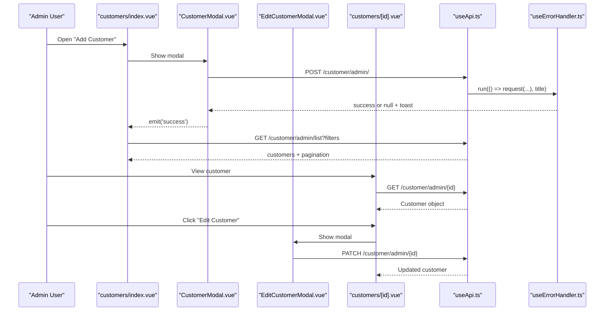
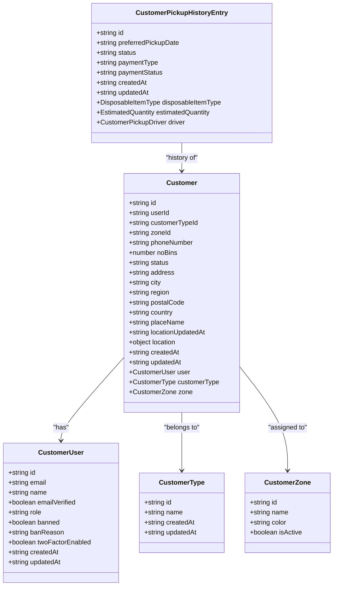
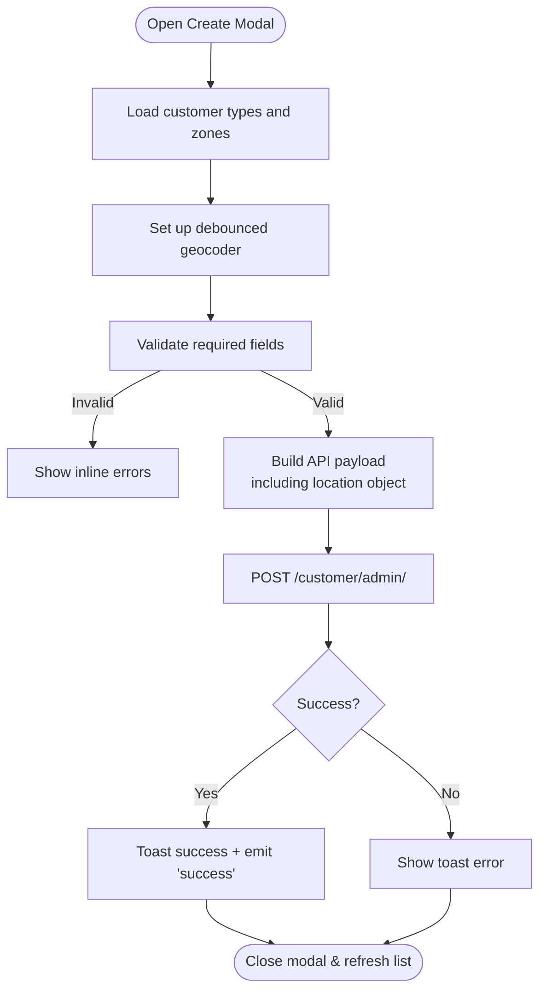
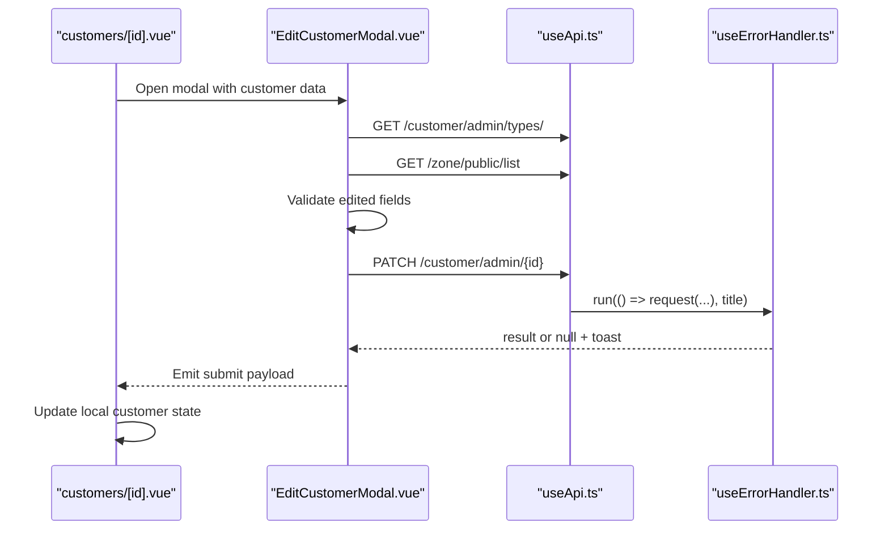
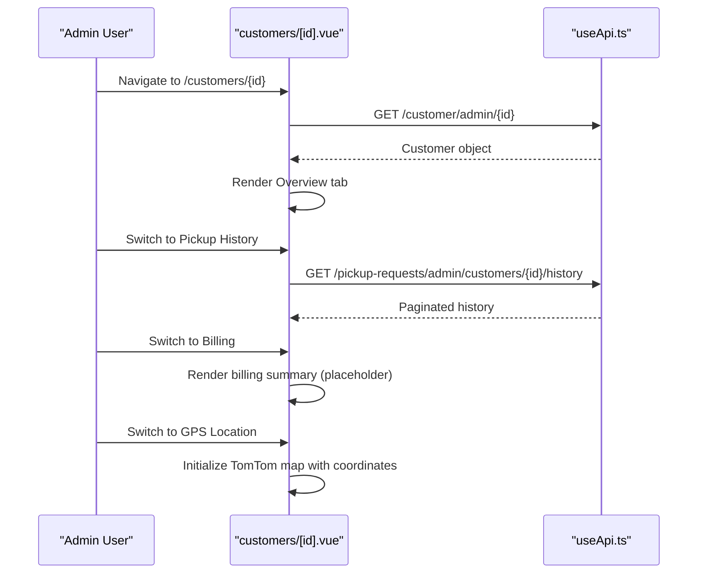
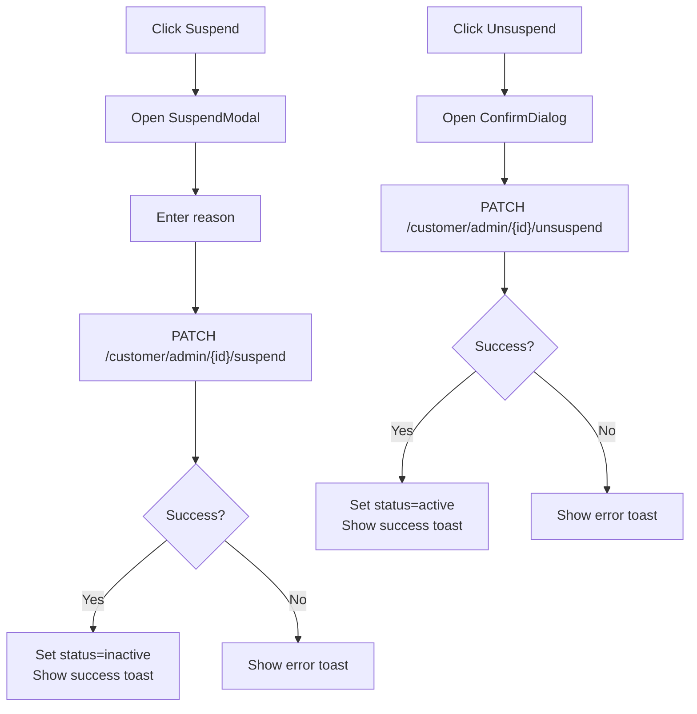
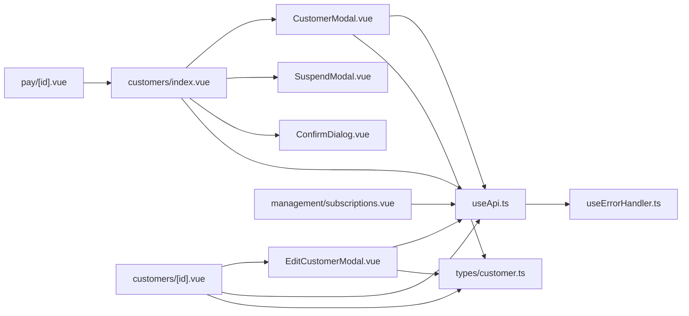

# Customer Management

<cite>
**Referenced Files in This Document**
- [CustomerModal.vue](file://app/components/CustomerModal.vue)
- [EditCustomerModal.vue](file://app/components/EditCustomerModal.vue)
- [SuspendModal.vue](file://app/components/SuspendModal.vue)
- [ConfirmDialog.vue](file://app/components/ConfirmDialog.vue)
- [useApi.ts](file://app/composables/useApi.ts)
- [useErrorHandler.ts](file://app/composables/useErrorHandler.ts)
- [index.vue (Customers list)](file://app/pages/customers/index.vue)
- [id.vue (Customer detail)](file://app/pages/customers/[id].vue)
- [customer.ts (Types)](file://app/types/customer.ts)
- [subscriptions.vue (Subscription plans)](file://app/pages/management/subscriptions.vue)
- [pay/[id].vue (Payment portal)](file://app/pages/pay/[id].vue)
</cite>

## Table of Contents
1. Introduction
2. Project Structure
3. Core Components
4. Architecture Overview
5. Detailed Component Analysis
6. Dependency Analysis
7. Performance Considerations
8. Troubleshooting Guide
9. Conclusion

## Introduction
This document provides comprehensive documentation for the Customer Management module. It covers the full customer lifecycle: creation, editing, viewing, and suspension/reactivation workflows. It also documents data models, subscription integration points, billing linkage, status workflows, modal components, form validation, data transformation utilities, API integration patterns, common workflows, and error handling strategies.

## Project Structure
The Customer Management feature spans pages, reusable modals, composables for API and error handling, shared types, and related billing/subscription pages that integrate with customers.

```mermaid
graph TB
subgraph "Pages"
CList["customers/index.vue"]
CDet["customers/[id].vue"]
Pay["pay/[id].vue"]
SubPlans["management/subscriptions.vue"]
end
subgraph "Components"
CAdd["components/CustomerModal.vue"]
CEdit["components/EditCustomerModal.vue"]
CSus["components/SuspendModal.vue"]
CConf["components/ConfirmDialog.vue"]
end
subgraph "Composables"
Api["composables/useApi.ts"]
Err["composables/useErrorHandler.ts"]
end
subgraph "Types"
Types["types/customer.ts"]
end
CList --> CAdd
CList --> CSus
CList --> CConf
CDet --> CEdit
CDet --> CSus
CDet --> CConf
CAdd --> Api
CEdit --> Api
CList --> Api
CDet --> Api
Api --> Err
CAdd --> Types
CEdit --> Types
CDet --> Types
SubPlans --> Api
Pay --> CList
```

**Diagram sources**
- [index.vue (Customers list):1-352](file://app/pages/customers/index.vue#L1-L352)
- [id.vue (Customer detail):1-800](file://app/pages/customers/[id].vue#L1-L800)
- [CustomerModal.vue:1-414](file://app/components/CustomerModal.vue#L1-L414)
- [EditCustomerModal.vue:1-242](file://app/components/EditCustomerModal.vue#L1-L242)
- [SuspendModal.vue:1-75](file://app/components/SuspendModal.vue#L1-L75)
- [ConfirmDialog.vue:1-53](file://app/components/ConfirmDialog.vue#L1-L53)
- [useApi.ts:1-91](file://app/composables/useApi.ts#L1-L91)
- [useErrorHandler.ts:1-29](file://app/composables/useErrorHandler.ts#L1-L29)
- [customer.ts (Types):1-103](file://app/types/customer.ts#L1-L103)
- [subscriptions.vue (Subscription plans):1-800](file://app/pages/management/subscriptions.vue#L1-L800)
- [pay/[id].vue (Payment portal)](file://app/pages/pay/[id].vue#L1-L353)

**Section sources**
- [index.vue (Customers list):1-352](file://app/pages/customers/index.vue#L1-L352)
- [id.vue (Customer detail):1-800](file://app/pages/customers/[id].vue#L1-L800)
- [CustomerModal.vue:1-414](file://app/components/CustomerModal.vue#L1-L414)
- [EditCustomerModal.vue:1-242](file://app/components/EditCustomerModal.vue#L1-L242)
- [SuspendModal.vue:1-75](file://app/components/SuspendModal.vue#L1-L75)
- [ConfirmDialog.vue:1-53](file://app/components/ConfirmDialog.vue#L1-L53)
- [useApi.ts:1-91](file://app/composables/useApi.ts#L1-L91)
- [useErrorHandler.ts:1-29](file://app/composables/useErrorHandler.ts#L1-L29)
- [customer.ts (Types):1-103](file://app/types/customer.ts#L1-L103)
- [subscriptions.vue (Subscription plans):1-800](file://app/pages/management/subscriptions.vue#L1-L800)
- [pay/[id].vue (Payment portal)](file://app/pages/pay/[id].vue#L1-L353)

## Core Components
- Customer creation modal: Provides address autocomplete via TomTom geocoding, validates required fields, transforms UI inputs to API payload, and posts to create a customer.
- Customer edit modal: Loads available customer types and zones, validates editable fields, and emits updated data to parent for patching.
- Suspend/Unsuspend flows: Modal-driven confirmation and reason capture; triggers suspend/unsuspend endpoints and updates local state.
- API composable: Centralized HTTP client with auth header injection, unified error handling, and typed wrappers for GET/POST/PATCH/DELETE.
- Error handler composable: Wraps async operations to show toast errors and return null on failure.
- Customer list page: Lists, filters, suspends/unsuspends, exports to Excel, and opens creation modal.
- Customer detail page: Displays profile, tabs for overview/pickup history/billing/GPS, supports editing, suspension, and payment link generation.
- Subscription plans page: Manages plan definitions used by customers; includes data transformation utilities between API and UI shapes.
- Payment portal: Customer-facing payment flow for outstanding invoices.

**Section sources**
- [CustomerModal.vue:1-414](file://app/components/CustomerModal.vue#L1-L414)
- [EditCustomerModal.vue:1-242](file://app/components/EditCustomerModal.vue#L1-L242)
- [SuspendModal.vue:1-75](file://app/components/SuspendModal.vue#L1-L75)
- [ConfirmDialog.vue:1-53](file://app/components/ConfirmDialog.vue#L1-L53)
- [useApi.ts:1-91](file://app/composables/useApi.ts#L1-L91)
- [useErrorHandler.ts:1-29](file://app/composables/useErrorHandler.ts#L1-L29)
- [index.vue (Customers list):1-352](file://app/pages/customers/index.vue#L1-L352)
- [id.vue (Customer detail):1-800](file://app/pages/customers/[id].vue#L1-L800)
- [subscriptions.vue (Subscription plans):1-800](file://app/pages/management/subscriptions.vue#L1-L800)
- [pay/[id].vue (Payment portal)](file://app/pages/pay/[id].vue#L1-L353)

## Architecture Overview
The Customer Management module follows a component-page-composable architecture:
- Pages orchestrate user flows and state.
- Reusable modals encapsulate complex forms and confirmations.
- Composables abstract network requests and error feedback.
- Shared TypeScript types define contracts across modules.



**Diagram sources**
- [index.vue (Customers list):1-352](file://app/pages/customers/index.vue#L1-L352)
- [CustomerModal.vue:1-414](file://app/components/CustomerModal.vue#L1-L414)
- [EditCustomerModal.vue:1-242](file://app/components/EditCustomerModal.vue#L1-L242)
- [id.vue (Customer detail):1-800](file://app/pages/customers/[id].vue#L1-L800)
- [useApi.ts:1-91](file://app/composables/useApi.ts#L1-L91)
- [useErrorHandler.ts:1-29](file://app/composables/useErrorHandler.ts#L1-L29)

## Detailed Component Analysis

### Data Models (Customer Domain)
The customer domain is modeled using TypeScript interfaces that describe the shape of API responses and related entities.



**Diagram sources**
- [customer.ts (Types):1-103](file://app/types/customer.ts#L1-L103)

**Section sources**
- [customer.ts (Types):1-103](file://app/types/customer.ts#L1-L103)

### Customer Creation Flow (Create)
Creation uses a modal with address autocomplete, validation, and API submission.



**Diagram sources**
- [CustomerModal.vue:1-414](file://app/components/CustomerModal.vue#L1-L414)
- [useApi.ts:1-91](file://app/composables/useApi.ts#L1-L91)
- [useErrorHandler.ts:1-29](file://app/composables/useErrorHandler.ts#L1-L29)

**Section sources**
- [CustomerModal.vue:1-414](file://app/components/CustomerModal.vue#L1-L414)
- [useApi.ts:1-91](file://app/composables/useApi.ts#L1-L91)
- [useErrorHandler.ts:1-29](file://app/composables/useErrorHandler.ts#L1-L29)

### Customer Editing Flow (Update)
Editing loads existing values, validates changes, and patches the record.



**Diagram sources**
- [EditCustomerModal.vue:1-242](file://app/components/EditCustomerModal.vue#L1-L242)
- [id.vue (Customer detail):1-800](file://app/pages/customers/[id].vue#L1-L800)
- [useApi.ts:1-91](file://app/composables/useApi.ts#L1-L91)
- [useErrorHandler.ts:1-29](file://app/composables/useErrorHandler.ts#L1-L29)

**Section sources**
- [EditCustomerModal.vue:1-242](file://app/components/EditCustomerModal.vue#L1-L242)
- [id.vue (Customer detail):1-800](file://app/pages/customers/[id].vue#L1-L800)
- [useApi.ts:1-91](file://app/composables/useApi.ts#L1-L91)
- [useErrorHandler.ts:1-29](file://app/composables/useErrorHandler.ts#L1-L29)

### Viewing Customer Details (Read)
The detail page displays profile information, pickup history, billing summary, and GPS map.



**Diagram sources**
- [id.vue (Customer detail):1-800](file://app/pages/customers/[id].vue#L1-L800)
- [useApi.ts:1-91](file://app/composables/useApi.ts#L1-L91)

**Section sources**
- [id.vue (Customer detail):1-800](file://app/pages/customers/[id].vue#L1-L800)

### Suspension and Reactivation (Status Workflow)
Suspension requires a reason; unsuspend confirms action. Both update local state after successful API calls.



**Diagram sources**
- [SuspendModal.vue:1-75](file://app/components/SuspendModal.vue#L1-L75)
- [ConfirmDialog.vue:1-53](file://app/components/ConfirmDialog.vue#L1-L53)
- [index.vue (Customers list):1-352](file://app/pages/customers/index.vue#L1-L352)
- [id.vue (Customer detail):1-800](file://app/pages/customers/[id].vue#L1-L800)
- [useApi.ts:1-91](file://app/composables/useApi.ts#L1-L91)
- [useErrorHandler.ts:1-29](file://app/composables/useErrorHandler.ts#L1-L29)

**Section sources**
- [SuspendModal.vue:1-75](file://app/components/SuspendModal.vue#L1-L75)
- [ConfirmDialog.vue:1-53](file://app/components/ConfirmDialog.vue#L1-L53)
- [index.vue (Customers list):1-352](file://app/pages/customers/index.vue#L1-L352)
- [id.vue (Customer detail):1-800](file://app/pages/customers/[id].vue#L1-L800)
- [useApi.ts:1-91](file://app/composables/useApi.ts#L1-L91)
- [useErrorHandler.ts:1-29](file://app/composables/useErrorHandler.ts#L1-L29)

### Form Validation and Data Transformation
- Creation modal validates required fields (name, email, phone, type, zone) and constructs an API payload including a nested location object.
- Edit modal validates phone, address, city, type, zone, and bin count, then emits a normalized payload for patching.
- Subscription plans include explicit transform functions mapping between API and UI field names.

Key behaviors:
- Debounced geocoding with filtering to Ghana results.
- Inline error messages per field.
- Payload normalization before submission.

**Section sources**
- [CustomerModal.vue:1-414](file://app/components/CustomerModal.vue#L1-L414)
- [EditCustomerModal.vue:1-242](file://app/components/EditCustomerModal.vue#L1-L242)
- [subscriptions.vue (Subscription plans):1-800](file://app/pages/management/subscriptions.vue#L1-L800)

### API Integration Patterns
- useApi centralizes fetch calls, injects Authorization headers, handles 401 redirects, and normalizes success codes.
- useErrorHandler wraps calls to display consistent toasts and return null on failure.
- Pages and modals use typed wrappers (get/post/patch/del) with custom titles for error toasts.

Common patterns:
- Use run() wrapper for automatic error feedback.
- For special cases (e.g., detailed 400 validation in modals), call raw request and handle errors manually.

**Section sources**
- [useApi.ts:1-91](file://app/composables/useApi.ts#L1-L91)
- [useErrorHandler.ts:1-29](file://app/composables/useErrorHandler.ts#L1-L29)
- [CustomerModal.vue:1-414](file://app/components/CustomerModal.vue#L1-L414)
- [EditCustomerModal.vue:1-242](file://app/components/EditCustomerModal.vue#L1-L242)
- [index.vue (Customers list):1-352](file://app/pages/customers/index.vue#L1-L352)
- [id.vue (Customer detail):1-800](file://app/pages/customers/[id].vue#L1-L800)
- [subscriptions.vue (Subscription plans):1-800](file://app/pages/management/subscriptions.vue#L1-L800)

### Subscription Management Integration
- Customers are associated with a customer type and zone; plan definitions live under management/subscriptions.
- The subscriptions page demonstrates robust API-to-UI transformations and flexible response parsing.
- While customer detail shows a placeholder billing tab, the broader billing/subscription system is managed centrally.

**Section sources**
- [subscriptions.vue (Subscription plans):1-800](file://app/pages/management/subscriptions.vue#L1-L800)
- [id.vue (Customer detail):1-800](file://app/pages/customers/[id].vue#L1-L800)

### Billing Linkage and Payment Portal
- Customer detail exposes a “Make Payment” button linking to /pay/{id}.
- The payment portal presents outstanding invoices and supports cash or mobile money flows.

**Section sources**
- [id.vue (Customer detail):1-800](file://app/pages/customers/[id].vue#L1-L800)
- [pay/[id].vue (Payment portal)](file://app/pages/pay/[id].vue#L1-L353)

## Dependency Analysis
High-level dependencies among key files:



**Diagram sources**
- [index.vue (Customers list):1-352](file://app/pages/customers/index.vue#L1-L352)
- [id.vue (Customer detail):1-800](file://app/pages/customers/[id].vue#L1-L800)
- [CustomerModal.vue:1-414](file://app/components/CustomerModal.vue#L1-L414)
- [EditCustomerModal.vue:1-242](file://app/components/EditCustomerModal.vue#L1-L242)
- [SuspendModal.vue:1-75](file://app/components/SuspendModal.vue#L1-L75)
- [ConfirmDialog.vue:1-53](file://app/components/ConfirmDialog.vue#L1-L53)
- [useApi.ts:1-91](file://app/composables/useApi.ts#L1-L91)
- [useErrorHandler.ts:1-29](file://app/composables/useErrorHandler.ts#L1-L29)
- [customer.ts (Types):1-103](file://app/types/customer.ts#L1-L103)
- [subscriptions.vue (Subscription plans):1-800](file://app/pages/management/subscriptions.vue#L1-L800)
- [pay/[id].vue (Payment portal)](file://app/pages/pay/[id].vue#L1-L353)

**Section sources**
- [index.vue (Customers list):1-352](file://app/pages/customers/index.vue#L1-L352)
- [id.vue (Customer detail):1-800](file://app/pages/customers/[id].vue#L1-L800)
- [CustomerModal.vue:1-414](file://app/components/CustomerModal.vue#L1-L414)
- [EditCustomerModal.vue:1-242](file://app/components/EditCustomerModal.vue#L1-L242)
- [SuspendModal.vue:1-75](file://app/components/SuspendModal.vue#L1-L75)
- [ConfirmDialog.vue:1-53](file://app/components/ConfirmDialog.vue#L1-L53)
- [useApi.ts:1-91](file://app/composables/useApi.ts#L1-L91)
- [useErrorHandler.ts:1-29](file://app/composables/useErrorHandler.ts#L1-L29)
- [customer.ts (Types):1-103](file://app/types/customer.ts#L1-L103)
- [subscriptions.vue (Subscription plans):1-800](file://app/pages/management/subscriptions.vue#L1-L800)
- [pay/[id].vue (Payment portal)](file://app/pages/pay/[id].vue#L1-L353)

## Performance Considerations
- Debounce geocoding input to reduce external API calls during typing.
- Lazy-load map libraries only when the GPS Location tab is active.
- Paginate lists and limit per-page sizes to avoid heavy payloads.
- Use parallel requests where appropriate (e.g., loading types and zones concurrently).
- Avoid unnecessary re-renders by keeping local state minimal and derived from props/API responses.

[No sources needed since this section provides general guidance]

## Troubleshooting Guide
Common issues and resolutions:
- 401 Unauthorized: The API composable logs out and redirects to login automatically. Ensure the session token is present and not expired.
- Network failures: useErrorHandler shows a toast with a provided title and optional message; verify connectivity and backend availability.
- Validation errors:
  - Creation modal: ensure all required fields are filled and email format is valid.
  - Edit modal: ensure phone, address, city, type, and zone are set; bins cannot be negative.
- Geocoding not working: Verify the TomTom API key is configured and that the environment variable is accessible.
- Map initialization errors: Check that the container element exists and the API key is set; errors are logged and surfaced in the UI.

**Section sources**
- [useApi.ts:1-91](file://app/composables/useApi.ts#L1-L91)
- [useErrorHandler.ts:1-29](file://app/composables/useErrorHandler.ts#L1-L29)
- [CustomerModal.vue:1-414](file://app/components/CustomerModal.vue#L1-L414)
- [EditCustomerModal.vue:1-242](file://app/components/EditCustomerModal.vue#L1-L242)
- [id.vue (Customer detail):1-800](file://app/pages/customers/[id].vue#L1-L800)

## Conclusion
The Customer Management module provides a cohesive, type-safe, and user-friendly experience for managing customer records. It integrates with subscription and billing systems, offers robust validation and error handling, and leverages reusable components and composables for consistency and maintainability.

[No sources needed since this section summarizes without analyzing specific files]