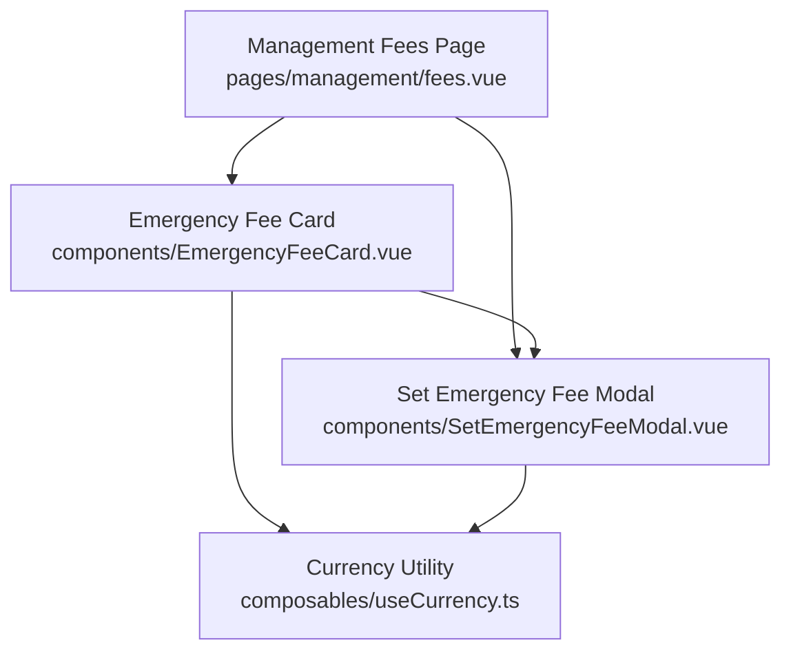
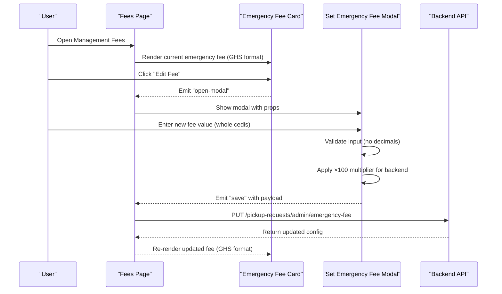
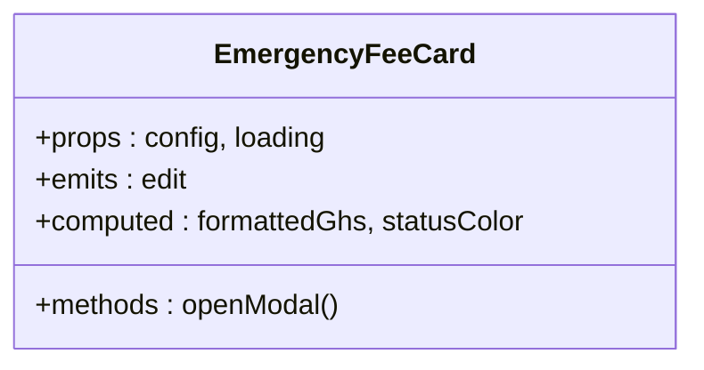
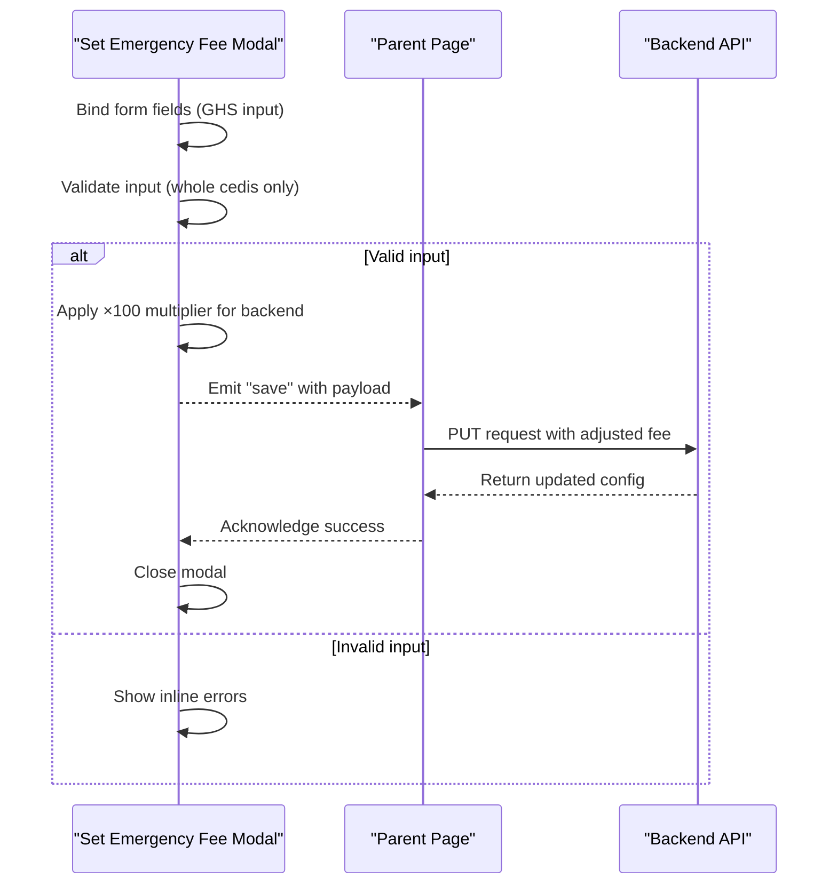
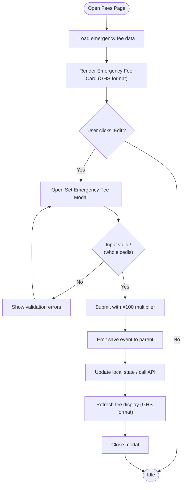
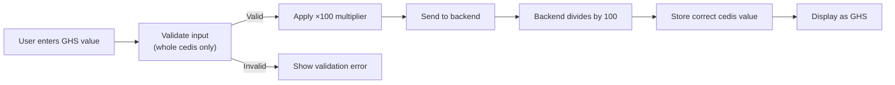
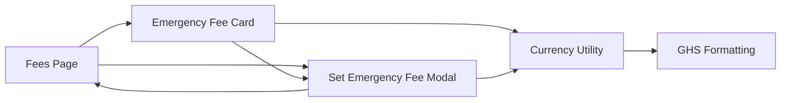

# Emergency Fee Management

<cite>
**Referenced Files in This Document**
- [EmergencyFeeCard.vue](file://app/components/EmergencyFeeCard.vue)
- [SetEmergencyFeeModal.vue](file://app/components/SetEmergencyFeeModal.vue)
- [fees.vue](file://app/pages/management/fees.vue)
- [useCurrency.ts](file://app/composables/useCurrency.ts)
</cite>

## Update Summary
**Changes Made**
- Updated currency display system to show only GHS values without pesewas conversion
- Added backend compatibility workaround with ×100 multiplier for cedis values
- Simplified UI to eliminate confusing pesewas text from user interface
- Enhanced validation to enforce whole number cedis input
- Improved error handling and user feedback mechanisms

## Table of Contents
1. [Introduction](#introduction)
2. [Project Structure](#project-structure)
3. [Core Components](#core-components)
4. [Architecture Overview](#architecture-overview)
5. [Detailed Component Analysis](#detailed-component-analysis)
6. [Enhanced Currency Handling System](#enhanced-currency-handling-system)
7. [Dependency Analysis](#dependency-analysis)
8. [Performance Considerations](#performance-considerations)
9. [Troubleshooting Guide](#troubleshooting-guide)
10. [Conclusion](#conclusion)

## Introduction
This document explains the Emergency Fee Management feature implemented in the application. It focuses on how emergency fees are displayed and configured through dedicated UI components, and how they integrate with the management interface for fees. The system has been enhanced with improved currency handling that displays only Ghana Cedis (GHS) values without pesewas conversion, providing a cleaner user experience while maintaining backend compatibility through a temporary multiplier workaround.

## Project Structure
The Emergency Fee Management feature spans four primary files:
- A card component that displays current emergency fee information with simplified GHS formatting.
- A modal component used to set or update emergency fees with enhanced validation.
- A page that orchestrates the management view where these components are embedded.
- A currency utility that provides consistent GHS formatting across the application.

**Diagram sources**
- [fees.vue](file://app/pages/management/fees.vue)
- [EmergencyFeeCard.vue](file://app/components/EmergencyFeeCard.vue)
- [SetEmergencyFeeModal.vue](file://app/components/SetEmergencyFeeModal.vue)
- [useCurrency.ts](file://app/composables/useCurrency.ts)

**Section sources**
- [fees.vue](file://app/pages/management/fees.vue)
- [EmergencyFeeCard.vue](file://app/components/EmergencyFeeCard.vue)
- [SetEmergencyFeeModal.vue](file://app/components/SetEmergencyFeeModal.vue)
- [useCurrency.ts](file://app/composables/useCurrency.ts)

## Core Components
- **Emergency Fee Card**: Presents the current emergency fee value using simplified GHS formatting and provides an action to open the configuration modal.
- **Set Emergency Fee Modal**: Captures user input for setting or updating emergency fees with enhanced validation for whole number cedis and submits changes with backend compatibility.
- **Management Fees Page**: Hosts the card and modal within the broader fees management context and handles API interactions.
- **Currency Utility**: Provides consistent GHS currency formatting across all components.

Key responsibilities:
- Display and edit emergency fee values with simplified GHS formatting.
- Validate inputs as whole number cedis before submission.
- Emit events to parent components for state updates.
- Provide user feedback via toast notifications.
- Handle backend compatibility through temporary multiplier workaround.

**Section sources**
- [EmergencyFeeCard.vue](file://app/components/EmergencyFeeCard.vue)
- [SetEmergencyFeeModal.vue](file://app/components/SetEmergencyFeeModal.vue)
- [fees.vue](file://app/pages/management/fees.vue)
- [useCurrency.ts](file://app/composables/useCurrency.ts)

## Architecture Overview
The feature follows a unidirectional data flow pattern typical in Vue applications with enhanced currency handling:
- The page renders the card and modal with simplified GHS display.
- The card triggers the modal when the user wants to change the fee.
- The modal collects and validates input as whole number cedis, then emits a success event.
- The page handles the event to refresh or update the displayed fee with proper backend compatibility.

**Diagram sources**
- [fees.vue](file://app/pages/management/fees.vue)
- [EmergencyFeeCard.vue](file://app/components/EmergencyFeeCard.vue)
- [SetEmergencyFeeModal.vue](file://app/components/SetEmergencyFeeModal.vue)
- [useCurrency.ts](file://app/composables/useCurrency.ts)

## Detailed Component Analysis

### Emergency Fee Card
Purpose:
- Displays the current emergency fee value using simplified GHS formatting.
- Provides a button to open the configuration modal.
- Shows status indicators (active/inactive) and last updated timestamp.

Behavior:
- Emits an event to open the modal when the user initiates editing.
- Uses the currency utility to format values consistently as GHS.
- Reflects real-time updates from the parent page.

Validation:
- Minimal client-side validation; relies on the modal for detailed checks.

Error Handling:
- Delegates error display to the parent page or global toast system.

**Updated** Enhanced to use the currency utility for consistent GHS formatting without pesewas conversion.

**Section sources**
- [EmergencyFeeCard.vue](file://app/components/EmergencyFeeCard.vue)

#### Class Diagram

**Diagram sources**
- [EmergencyFeeCard.vue](file://app/components/EmergencyFeeCard.vue)

### Set Emergency Fee Modal
Purpose:
- Captures the new emergency fee value with enhanced validation.
- Validates the input as whole number cedis (no decimals).
- Submits the change with backend compatibility workaround and reports success or failure.

Behavior:
- Binds form fields to local state with GHS input field.
- Emits a save event with validated payload upon successful submission.
- Applies temporary ×100 multiplier for backend compatibility.
- Closes itself after successful save.

Validation:
- Enforces required fields and whole number cedis constraint.
- Prevents submission if invalid (decimals not allowed).
- Provides clear error messages for invalid inputs.

Error Handling:
- Shows inline errors for invalid inputs.
- Uses toast notifications for server-side errors.

**Updated** Enhanced validation to enforce whole number cedis input and added backend compatibility workaround with ×100 multiplier.

**Section sources**
- [SetEmergencyFeeModal.vue](file://app/components/SetEmergencyFeeModal.vue)

#### Sequence Diagram

**Diagram sources**
- [SetEmergencyFeeModal.vue](file://app/components/SetEmergencyFeeModal.vue)

### Management Fees Page
Purpose:
- Orchestrates the emergency fee management experience.
- Renders the card and modal with enhanced currency handling.
- Manages state for the current fee and handles save events.

Behavior:
- Listens for modal open/close events from the card.
- Handles the save event to persist changes and refresh the fee display.
- Integrates with the currency utility for consistent formatting.

Integration Points:
- Calls API endpoints to update the fee with proper payload structure.
- Integrates with the global toast system for user feedback.
- Manages both emergency fees and shop zone fees in unified interface.

**Section sources**
- [fees.vue](file://app/pages/management/fees.vue)

#### Flowchart

**Diagram sources**
- [fees.vue](file://app/pages/management/fees.vue)
- [EmergencyFeeCard.vue](file://app/components/EmergencyFeeCard.vue)
- [SetEmergencyFeeModal.vue](file://app/components/SetEmergencyFeeModal.vue)

## Enhanced Currency Handling System

### Currency Formatting
The system now uses a centralized currency utility that formats all monetary values consistently as Ghana Cedis (GHS) without pesewas conversion. This eliminates confusion for users who previously saw mixed currency representations.

### Backend Compatibility Workaround
A temporary multiplier system has been implemented to maintain compatibility with the existing backend:
- Frontend accepts and displays whole number cedis values
- Values are multiplied by 100 before sending to backend
- Backend interprets the value as pesewas and divides by 100
- Result is the intended cedis amount stored correctly

### Validation Enhancements
The modal now enforces strict validation rules:
- Only whole number cedis are accepted (no decimal points)
- Clear error messages guide users to enter valid amounts
- Real-time validation prevents submission of invalid values

**Diagram sources**
- [useCurrency.ts](file://app/composables/useCurrency.ts)
- [SetEmergencyFeeModal.vue](file://app/components/SetEmergencyFeeModal.vue)

**Section sources**
- [useCurrency.ts](file://app/composables/useCurrency.ts)
- [SetEmergencyFeeModal.vue](file://app/components/SetEmergencyFeeModal.vue)
- [EmergencyFeeCard.vue](file://app/components/EmergencyFeeCard.vue)

## Dependency Analysis
The components interact through props and events with enhanced currency handling:
- The page passes initial fee data to the card with GHS formatting.
- The card emits an event to open the modal.
- The modal emits a save event with validated payload and backend compatibility.
- The page updates state and re-renders the card with the new fee using consistent GHS formatting.

**Diagram sources**
- [fees.vue](file://app/pages/management/fees.vue)
- [EmergencyFeeCard.vue](file://app/components/EmergencyFeeCard.vue)
- [SetEmergencyFeeModal.vue](file://app/components/SetEmergencyFeeModal.vue)
- [useCurrency.ts](file://app/composables/useCurrency.ts)

**Section sources**
- [fees.vue](file://app/pages/management/fees.vue)
- [EmergencyFeeCard.vue](file://app/components/EmergencyFeeCard.vue)
- [SetEmergencyFeeModal.vue](file://app/components/SetEmergencyFeeModal.vue)
- [useCurrency.ts](file://app/composables/useCurrency.ts)

## Performance Considerations
- Keep modal state minimal to avoid unnecessary re-renders.
- Debounce any auto-save behavior if applicable.
- Use lightweight validation to prevent blocking the main thread.
- Avoid redundant API calls by caching fee values locally until explicitly refreshed.
- Leverage computed properties for currency formatting to optimize performance.

## Troubleshooting Guide
Common issues and resolutions:
- **Modal does not open**: Ensure the card emits the correct event and the page listens for it.
- **Validation errors persist**: Check field binding and validation rules in the modal - ensure whole number cedis are entered.
- **Changes not reflected**: Verify the save event payload structure includes the ×100 multiplier and that the page updates its state correctly.
- **Toast messages not shown**: Confirm the toast system is initialized and invoked on success/failure paths.
- **Currency display issues**: Verify the currency utility is properly imported and used in components.
- **Backend compatibility problems**: Ensure the ×100 multiplier is applied correctly before sending requests.

**Updated** Added troubleshooting guidance for currency display and backend compatibility issues.

**Section sources**
- [SetEmergencyFeeModal.vue](file://app/components/SetEmergencyFeeModal.vue)
- [fees.vue](file://app/pages/management/fees.vue)
- [useCurrency.ts](file://app/composables/useCurrency.ts)

## Conclusion
The Emergency Fee Management feature provides a focused, user-friendly way to view and configure emergency fees with enhanced currency handling. The separation of concerns between the card, modal, and page ensures clarity and maintainability. The simplified GHS-only display eliminates confusion while the backend compatibility workaround ensures seamless integration with existing systems. By following the documented flows and integration points, developers can extend or modify the feature confidently while preserving a consistent user experience.

The enhanced system successfully addresses the previous complexity around pesewas conversion, providing a clean interface that shows only Ghana Cedis values while maintaining full backend compatibility through intelligent multiplier handling.