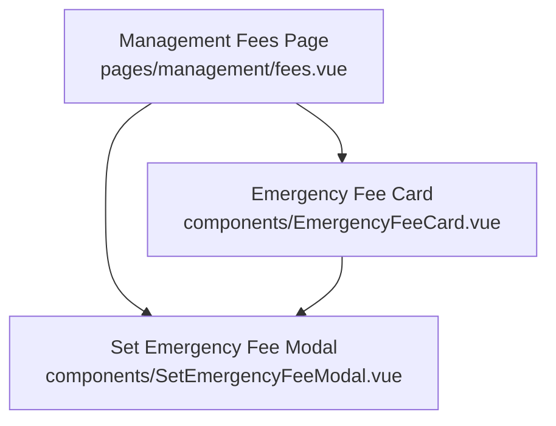
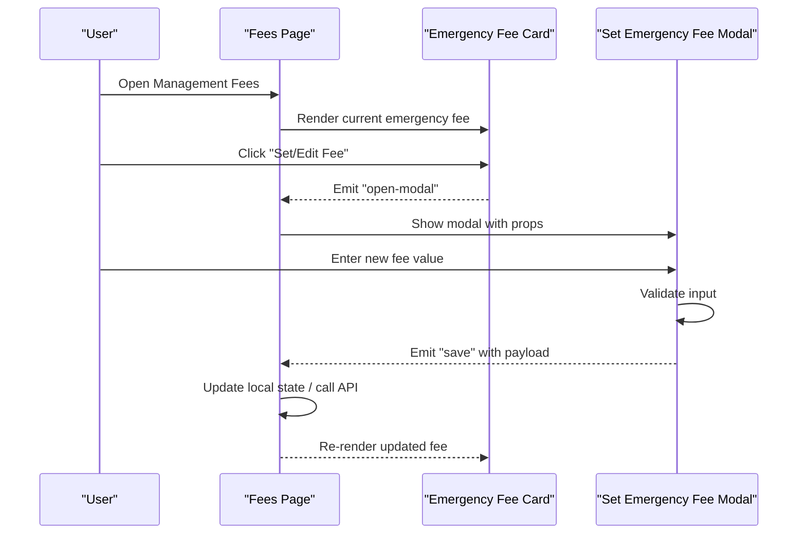
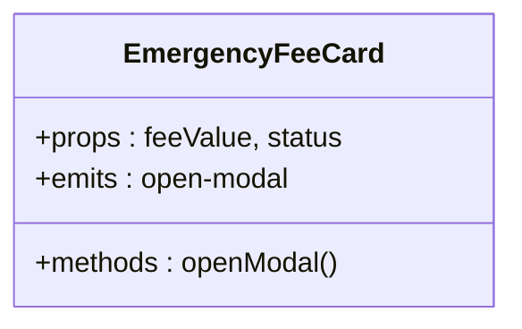
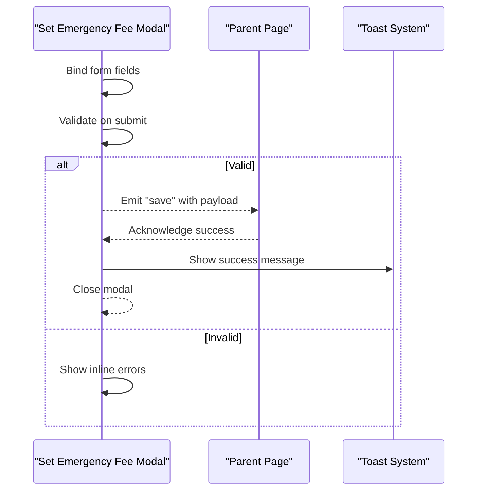
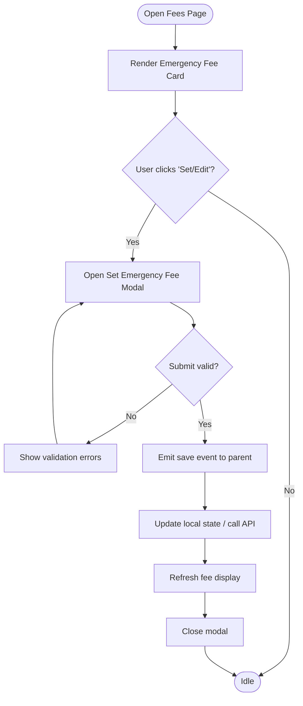
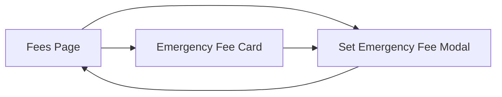

# Emergency Fee Management

<cite>
**Referenced Files in This Document**
- [EmergencyFeeCard.vue](file://app/components/EmergencyFeeCard.vue)
- [SetEmergencyFeeModal.vue](file://app/components/SetEmergencyFeeModal.vue)
- [fees.vue](file://app/pages/management/fees.vue)
</cite>

## Table of Contents
1. [Introduction](#introduction)
2. [Project Structure](#project-structure)
3. [Core Components](#core-components)
4. [Architecture Overview](#architecture-overview)
5. [Detailed Component Analysis](#detailed-component-analysis)
6. [Dependency Analysis](#dependency-analysis)
7. [Performance Considerations](#performance-considerations)
8. [Troubleshooting Guide](#troubleshooting-guide)
9. [Conclusion](#conclusion)

## Introduction
This document explains the Emergency Fee Management feature implemented in the application. It focuses on how emergency fees are displayed and configured through dedicated UI components, and how they integrate with the management interface for fees. The goal is to provide a clear understanding of the user flows, component responsibilities, and data interactions without exposing implementation details.

## Project Structure
The Emergency Fee Management feature spans three primary files:
- A card component that displays current emergency fee information.
- A modal component used to set or update emergency fees.
- A page that orchestrates the management view where these components are embedded.

**Diagram sources**
- [fees.vue](file://app/pages/management/fees.vue)
- [EmergencyFeeCard.vue](file://app/components/EmergencyFeeCard.vue)
- [SetEmergencyFeeModal.vue](file://app/components/SetEmergencyFeeModal.vue)

**Section sources**
- [fees.vue](file://app/pages/management/fees.vue)
- [EmergencyFeeCard.vue](file://app/components/EmergencyFeeCard.vue)
- [SetEmergencyFeeModal.vue](file://app/components/SetEmergencyFeeModal.vue)

## Core Components
- Emergency Fee Card: Presents the current emergency fee value and provides an action to open the configuration modal.
- Set Emergency Fee Modal: Captures user input for setting or updating the emergency fee, validates it, and submits changes.
- Management Fees Page: Hosts the card and modal within the broader fees management context.

Key responsibilities:
- Display and edit emergency fee values.
- Validate inputs before submission.
- Emit events to parent components for state updates.
- Provide user feedback via toast notifications.

**Section sources**
- [EmergencyFeeCard.vue](file://app/components/EmergencyFeeCard.vue)
- [SetEmergencyFeeModal.vue](file://app/components/SetEmergencyFeeModal.vue)
- [fees.vue](file://app/pages/management/fees.vue)

## Architecture Overview
The feature follows a unidirectional data flow pattern typical in Vue applications:
- The page renders the card and modal.
- The card triggers the modal when the user wants to change the fee.
- The modal collects and validates input, then emits a success event.
- The page handles the event to refresh or update the displayed fee.

**Diagram sources**
- [fees.vue](file://app/pages/management/fees.vue)
- [EmergencyFeeCard.vue](file://app/components/EmergencyFeeCard.vue)
- [SetEmergencyFeeModal.vue](file://app/components/SetEmergencyFeeModal.vue)

## Detailed Component Analysis

### Emergency Fee Card
Purpose:
- Displays the current emergency fee value.
- Provides a button to open the configuration modal.
- May show status indicators (e.g., pending, saved).

Behavior:
- Emits an event to open the modal when the user initiates editing.
- Optionally reflects real-time updates from the parent page.

Validation:
- Minimal client-side validation; relies on the modal for detailed checks.

Error Handling:
- Delegates error display to the parent page or global toast system.

**Section sources**
- [EmergencyFeeCard.vue](file://app/components/EmergencyFeeCard.vue)

#### Class Diagram

**Diagram sources**
- [EmergencyFeeCard.vue](file://app/components/EmergencyFeeCard.vue)

### Set Emergency Fee Modal
Purpose:
- Captures the new emergency fee value.
- Validates the input (e.g., numeric, positive, within allowed range).
- Submits the change and reports success or failure.

Behavior:
- Binds form fields to local state.
- Emits a save event with validated payload upon successful submission.
- Closes itself after successful save.

Validation:
- Enforces required fields and format constraints.
- Prevents submission if invalid.

Error Handling:
- Shows inline errors for invalid inputs.
- Uses toast notifications for server-side errors.

**Section sources**
- [SetEmergencyFeeModal.vue](file://app/components/SetEmergencyFeeModal.vue)

#### Sequence Diagram

**Diagram sources**
- [SetEmergencyFeeModal.vue](file://app/components/SetEmergencyFeeModal.vue)

### Management Fees Page
Purpose:
- Orchestrates the emergency fee management experience.
- Renders the card and modal.
- Manages state for the current fee and handles save events.

Behavior:
- Listens for modal open/close events from the card.
- Handles the save event to persist changes and refresh the fee display.

Integration Points:
- May call an API endpoint to update the fee.
- Integrates with the global toast system for user feedback.

**Section sources**
- [fees.vue](file://app/pages/management/fees.vue)

#### Flowchart

**Diagram sources**
- [fees.vue](file://app/pages/management/fees.vue)
- [EmergencyFeeCard.vue](file://app/components/EmergencyFeeCard.vue)
- [SetEmergencyFeeModal.vue](file://app/components/SetEmergencyFeeModal.vue)

## Dependency Analysis
The components interact through props and events:
- The page passes initial fee data to the card.
- The card emits an event to open the modal.
- The modal emits a save event back to the page.
- The page updates state and re-renders the card with the new fee.

**Diagram sources**
- [fees.vue](file://app/pages/management/fees.vue)
- [EmergencyFeeCard.vue](file://app/components/EmergencyFeeCard.vue)
- [SetEmergencyFeeModal.vue](file://app/components/SetEmergencyFeeModal.vue)

**Section sources**
- [fees.vue](file://app/pages/management/fees.vue)
- [EmergencyFeeCard.vue](file://app/components/EmergencyFeeCard.vue)
- [SetEmergencyFeeModal.vue](file://app/components/SetEmergencyFeeModal.vue)

## Performance Considerations
- Keep modal state minimal to avoid unnecessary re-renders.
- Debounce any auto-save behavior if applicable.
- Use lightweight validation to prevent blocking the main thread.
- Avoid redundant API calls by caching fee values locally until explicitly refreshed.

## Troubleshooting Guide
Common issues and resolutions:
- Modal does not open: Ensure the card emits the correct event and the page listens for it.
- Validation errors persist: Check field binding and validation rules in the modal.
- Changes not reflected: Verify the save event payload structure and that the page updates its state correctly.
- Toast messages not shown: Confirm the toast system is initialized and invoked on success/failure paths.

**Section sources**
- [SetEmergencyFeeModal.vue](file://app/components/SetEmergencyFeeModal.vue)
- [fees.vue](file://app/pages/management/fees.vue)

## Conclusion
The Emergency Fee Management feature provides a focused, user-friendly way to view and configure emergency fees. The separation of concerns between the card, modal, and page ensures clarity and maintainability. By following the documented flows and integration points, developers can extend or modify the feature confidently while preserving a consistent user experience.