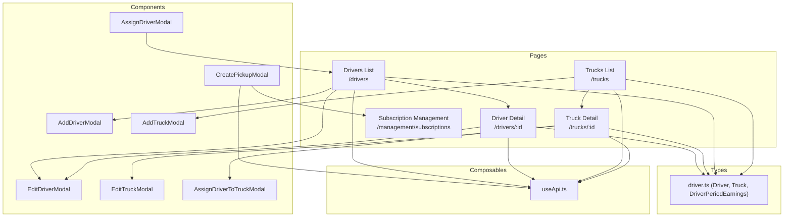
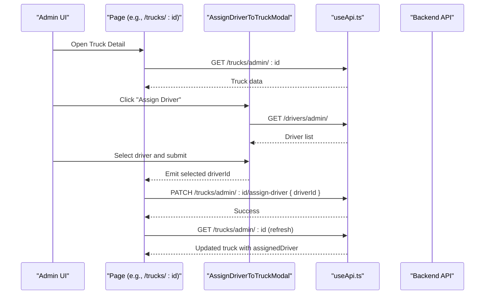
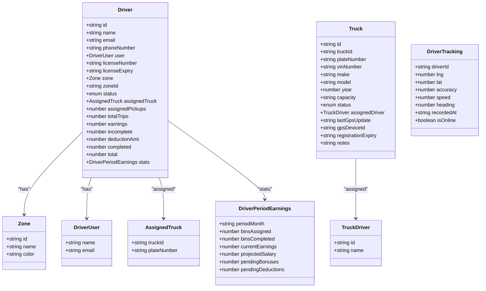
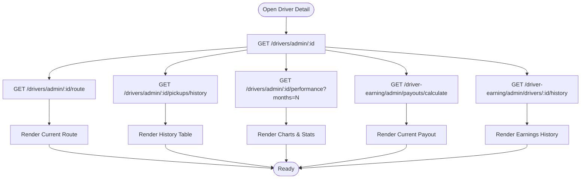
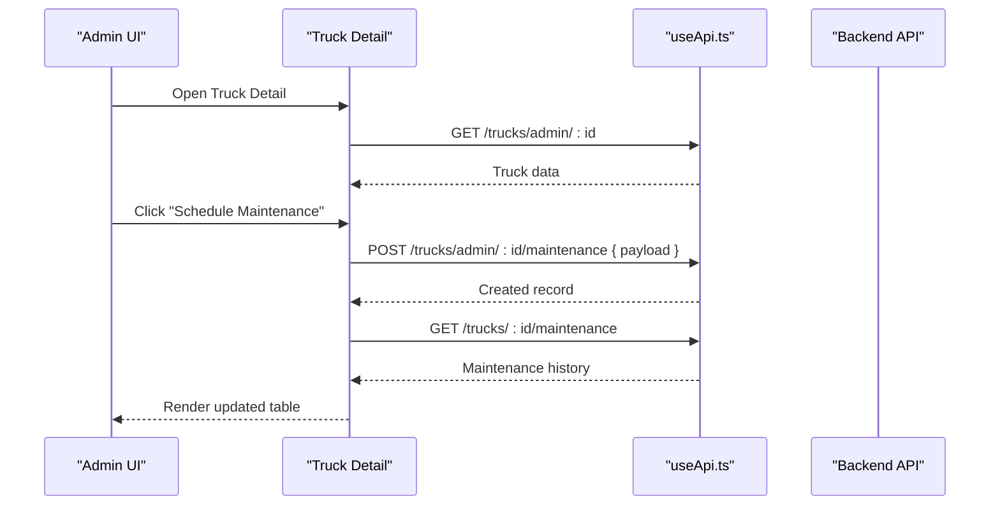
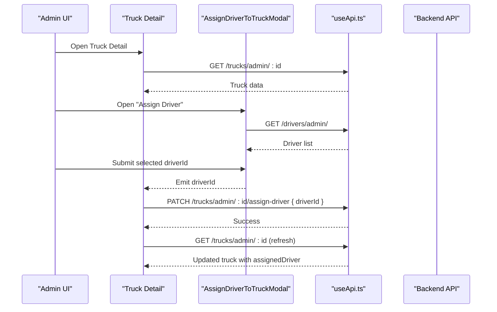
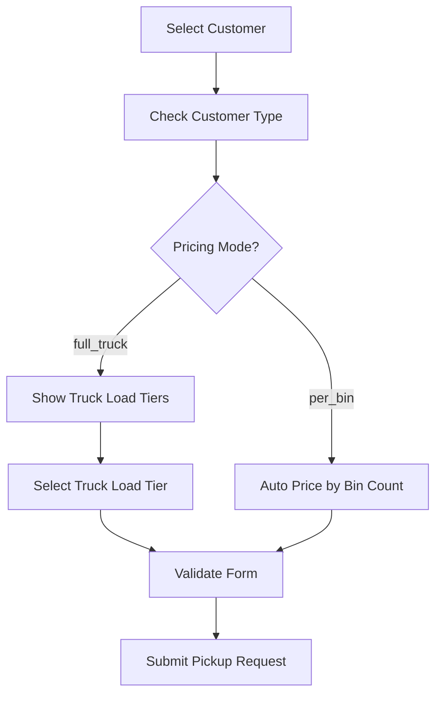
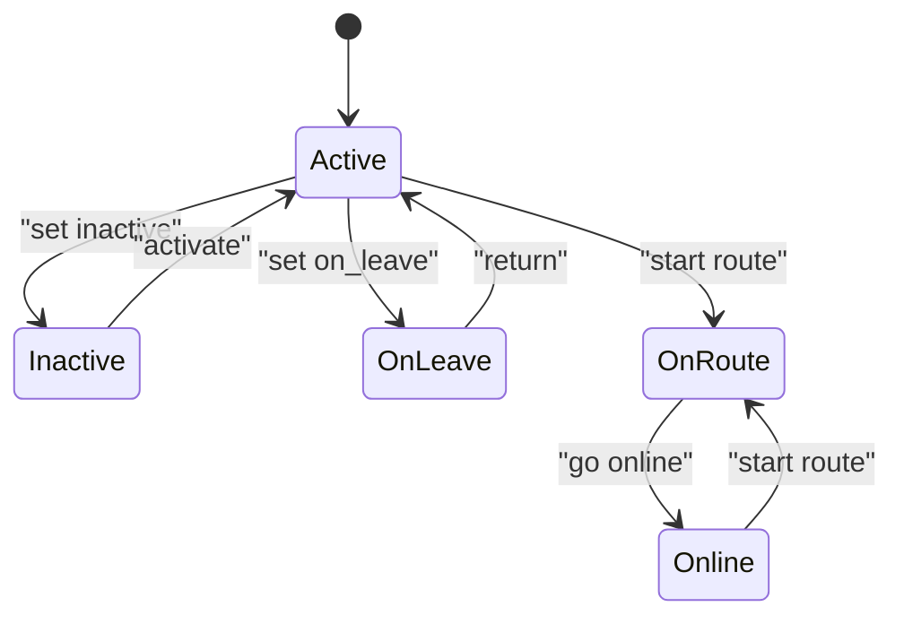
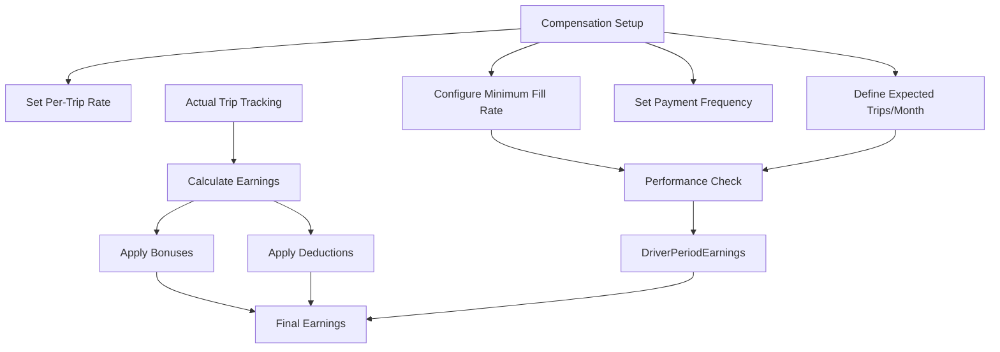
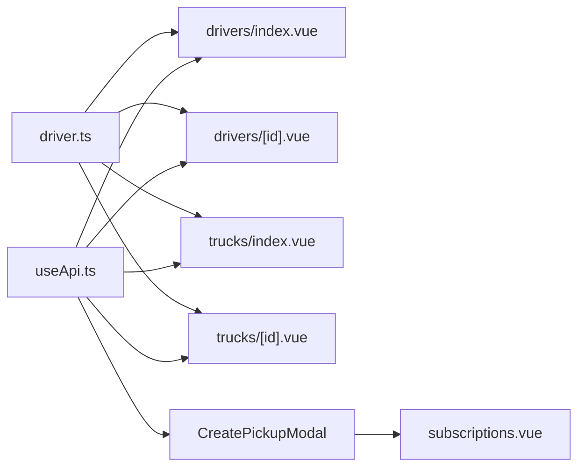

# Fleet Management

<cite>
**Referenced Files in This Document**
- [driver.ts](file://app/types/driver.ts)
- [drivers/index.vue](file://app/pages/drivers/index.vue)
- [drivers/[id].vue](file://app/pages/drivers/[id].vue)
- [trucks/index.vue](file://app/pages/trucks/index.vue)
- [trucks/[id].vue](file://app/pages/trucks/[id].vue)
- [AddDriverModal.vue](file://app/components/AddDriverModal.vue)
- [EditDriverModal.vue](file://app/components/EditDriverModal.vue)
- [AddTruckModal.vue](file://app/components/AddTruckModal.vue)
- [EditTruckModal.vue](file://app/components/EditTruckModal.vue)
- [AssignDriverToTruckModal.vue](file://app/components/AssignDriverToTruckModal.vue)
- [AssignDriverModal.vue](file://app/components/AssignDriverModal.vue)
- [CreatePickupModal.vue](file://app/components/CreatePickupModal.vue)
- [subscriptions.vue](file://app/pages/management/subscriptions.vue)
- [useApi.ts](file://app/composables/useApi.ts)
</cite>

## Update Summary
**Changes Made**
- Enhanced driver compensation support with DriverPeriodEarnings structure for comprehensive earnings tracking
- Improved pickup creation modal with dual pricing modes (per_bin and full_truck) based on customer subscription states
- Strengthened validation logic for customer subscription states and pricing mode determination
- Updated driver detail page to display enhanced compensation data and manual adjustment capabilities
- Added comprehensive compensation management features including per-trip rates, expected trips, fill rate requirements, and payment frequency settings

## Table of Contents
1. [Introduction](#introduction)
2. [Project Structure](#project-structure)
3. [Core Components](#core-components)
4. [Architecture Overview](#architecture-overview)
5. [Detailed Component Analysis](#detailed-component-analysis)
6. [Dependency Analysis](#dependency-analysis)
7. [Performance Considerations](#performance-considerations)
8. [Troubleshooting Guide](#troubleshooting-guide)
9. [Conclusion](#conclusion)

## Introduction
This document provides comprehensive documentation for the Fleet Management feature, covering driver and truck administration, assignment workflows, availability tracking, operational status management, and real-time status updates. The system now includes enhanced driver compensation management with DriverPeriodEarnings support, improved pickup creation with dual pricing modes, and strengthened validation logic for customer subscription states. It explains how drivers and trucks are modeled, how assignments are created and updated, and how the system integrates with backend APIs to reflect live operational states. The system supports advanced driver compensation management with per-trip rates, monthly trip expectations, fill rate requirements, flexible payment frequency options, and comprehensive earnings tracking through the DriverPeriodEarnings structure.

## Project Structure
Fleet Management is implemented across pages, components, types, and composables:
- Pages: Driver list/detail, Truck list/detail, Subscription management
- Components: Add/Edit Driver, Add/Edit Truck, Assign Driver to Truck, Assign Driver to Pickup, Create Pickup Modal
- Types: Shared data models for Driver, Truck, and related entities with enhanced compensation fields
- Composables: API client wrapper for HTTP requests

**Diagram sources**
- [drivers/index.vue:1-152](file://app/pages/drivers/index.vue#L1-L152)
- [trucks/index.vue:1-205](file://app/pages/trucks/index.vue#L1-L205)
- [trucks/[id].vue](file://app/pages/trucks/[id].vue#L1-L573)
- [AddDriverModal.vue:1-253](file://app/components/AddDriverModal.vue#L1-L253)
- [EditDriverModal.vue:1-202](file://app/components/EditDriverModal.vue#L1-L202)
- [AddTruckModal.vue:1-238](file://app/components/AddTruckModal.vue#L1-L238)
- [EditTruckModal.vue:1-250](file://app/components/EditTruckModal.vue#L1-L250)
- [AssignDriverToTruckModal.vue:1-108](file://app/components/AssignDriverToTruckModal.vue#L1-L108)
- [AssignDriverModal.vue:1-222](file://app/components/AssignDriverModal.vue#L1-L222)
- [CreatePickupModal.vue:1-416](file://app/components/CreatePickupModal.vue#L1-L416)
- [subscriptions.vue:1-800](file://app/pages/management/subscriptions.vue#L1-L800)
- [driver.ts:1-127](file://app/types/driver.ts#L1-L127)
- [useApi.ts:1-91](file://app/composables/useApi.ts#L1-L91)

**Section sources**
- [drivers/index.vue:1-152](file://app/pages/drivers/index.vue#L1-L152)
- [trucks/index.vue:1-205](file://app/pages/trucks/index.vue#L1-L205)
- [trucks/[id].vue](file://app/pages/trucks/[id].vue#L1-L573)
- [driver.ts:1-127](file://app/types/driver.ts#L1-L127)
- [useApi.ts:1-91](file://app/composables/useApi.ts#L1-L91)

## Core Components
- Driver lifecycle: Create, edit, delete, view details, route history, performance metrics, earnings summary, and enhanced compensation management with DriverPeriodEarnings.
- Truck lifecycle: Create, edit, delete, view details, maintenance scheduling/history, assign/unassign driver.
- Assignment workflow: Assign a driver to a truck via modal; update truck's assigned driver and refresh state.
- Availability and status: Drivers have statuses such as active, inactive, on_leave, on-route, online; Trucks have active, maintenance, inactive.
- Compensation management: Per-trip rate configuration, monthly trip expectations, minimum fill rate tracking, flexible payment frequency settings, and comprehensive earnings tracking through DriverPeriodEarnings structure.
- Pickup creation: Enhanced modal with dual pricing modes (per_bin and full_truck) based on customer subscription states.

Key responsibilities by file:
- Data models: [driver.ts:1-127](file://app/types/driver.ts#L1-L127)
- Driver list and creation: [drivers/index.vue:1-152](file://app/pages/drivers/index.vue#L1-L152), [AddDriverModal.vue:1-253](file://app/components/AddDriverModal.vue#L1-L253)
- Driver detail and editing: [drivers/[id].vue](file://app/pages/drivers/[id].vue#L1-L1108), [EditDriverModal.vue:1-202](file://app/components/EditDriverModal.vue#L1-L202)
- Truck list and creation: [trucks/index.vue:1-205](file://app/pages/trucks/index.vue#L1-L205), [AddTruckModal.vue:1-238](file://app/components/AddTruckModal.vue#L1-L238)
- Truck detail and editing: [trucks/[id].vue](file://app/pages/trucks/[id].vue#L1-L573), [EditTruckModal.vue:1-250](file://app/components/EditTruckModal.vue#L1-L250)
- Assign driver to truck: [AssignDriverToTruckModal.vue:1-108](file://app/components/AssignDriverToTruckModal.vue#L1-L108)
- Assign driver to pickup request: [AssignDriverModal.vue:1-222](file://app/components/AssignDriverModal.vue#L1-L222)
- Create pickup modal: [CreatePickupModal.vue:1-416](file://app/components/CreatePickupModal.vue#L1-L416)
- Subscription management: [subscriptions.vue:1-800](file://app/pages/management/subscriptions.vue#L1-L800)
- API client: [useApi.ts:1-91](file://app/composables/useApi.ts#L1-L91)

**Section sources**
- [driver.ts:1-127](file://app/types/driver.ts#L1-L127)
- [drivers/index.vue:1-152](file://app/pages/drivers/index.vue#L1-L152)
- [trucks/index.vue:1-205](file://app/pages/trucks/index.vue#L1-L205)
- [trucks/[id].vue](file://app/pages/trucks/[id].vue#L1-L573)
- [AddDriverModal.vue:1-253](file://app/components/AddDriverModal.vue#L1-L253)
- [EditDriverModal.vue:1-202](file://app/components/EditDriverModal.vue#L1-L202)
- [AddTruckModal.vue:1-238](file://app/components/AddTruckModal.vue#L1-L238)
- [EditTruckModal.vue:1-250](file://app/components/EditTruckModal.vue#L1-L250)
- [AssignDriverToTruckModal.vue:1-108](file://app/components/AssignDriverToTruckModal.vue#L1-L108)
- [AssignDriverModal.vue:1-222](file://app/components/AssignDriverModal.vue#L1-L222)
- [CreatePickupModal.vue:1-416](file://app/components/CreatePickupModal.vue#L1-L416)
- [subscriptions.vue:1-800](file://app/pages/management/subscriptions.vue#L1-L800)
- [useApi.ts:1-91](file://app/composables/useApi.ts#L1-L91)

## Architecture Overview
The Fleet Management UI follows a page-driven architecture with reusable modals and typed data models. All server interactions go through a centralized API composable that handles authentication, error handling, and response normalization. The system now supports comprehensive driver compensation management with DriverPeriodEarnings structure, enhanced pickup creation with dual pricing modes, and strengthened validation logic for customer subscription states.

**Diagram sources**
- [trucks/[id].vue](file://app/pages/trucks/[id].vue#L114-L129)
- [AssignDriverToTruckModal.vue:16-31](file://app/components/AssignDriverToTruckModal.vue#L16-L31)
- [useApi.ts:9-67](file://app/composables/useApi.ts#L9-L67)

**Section sources**
- [trucks/[id].vue](file://app/pages/trucks/[id].vue#L1-L573)
- [AssignDriverToTruckModal.vue:1-108](file://app/components/AssignDriverToTruckModal.vue#L1-L108)
- [useApi.ts:1-91](file://app/composables/useApi.ts#L1-L91)

## Detailed Component Analysis

### Data Models and Relationships
The shared type definitions define the core entities and their relationships, enhanced with comprehensive compensation fields through DriverPeriodEarnings:
- Driver: identity, contact info, license, zone, status, assigned truck, stats, and enhanced compensation details with DriverPeriodEarnings
- Truck: identity, plate, VIN, make/model/year/capacity, status, assigned driver, GPS info
- DriverPeriodEarnings: comprehensive earnings tracking with periodMonth, binsAssigned, binsCompleted, currentEarnings, projectedSalary, pendingBonuses, pendingDeductions
- Payloads: create/update structures for drivers and trucks with enhanced compensation fields

**Updated** Enhanced Driver type with comprehensive DriverPeriodEarnings structure for detailed compensation tracking and earnings management.

**Diagram sources**
- [driver.ts:1-127](file://app/types/driver.ts#L1-L127)

**Section sources**
- [driver.ts:1-127](file://app/types/driver.ts#L1-L127)

### Driver Lifecycle Management
- Create Driver:
  - UI: [AddDriverModal.vue:1-253](file://app/components/AddDriverModal.vue#L1-L253)
  - Submission: [drivers/index.vue:24-37](file://app/pages/drivers/index.vue#L24-L37)
  - API: POST /drivers/admin/
  - **Updated** Includes comprehensive compensation field validation with perTripRate, expectedTripsPerMonth, minimumFillRate, and paymentFrequency
- Edit Driver:
  - UI: [EditDriverModal.vue:1-202](file://app/components/EditDriverModal.vue#L1-L202)
  - Submission: [drivers/[id].vue](file://app/pages/drivers/[id].vue#L410-L424)
  - API: PATCH /drivers/admin/:id
- Delete Driver:
  - Confirmation and deletion: [drivers/[id].vue](file://app/pages/drivers/[id].vue#L426-L442)
  - API: DELETE /drivers/admin/:id
- View Details:
  - Profile, current route, history, performance, earnings with DriverPeriodEarnings: [drivers/[id].vue](file://app/pages/drivers/[id].vue#L110-L121)
  - API calls:
    - GET /drivers/admin/:id
    - GET /drivers/admin/:id/route
    - GET /drivers/admin/:id/pickups/history
    - GET /drivers/admin/:id/performance?months=N
    - GET /driver-earning/admin/payouts/calculate
    - GET /driver-earning/admin/drivers/:id/history

**Section sources**
- [AddDriverModal.vue:1-253](file://app/components/AddDriverModal.vue#L1-L253)
- [EditDriverModal.vue:1-202](file://app/components/EditDriverModal.vue#L1-L202)
- [drivers/index.vue:1-152](file://app/pages/drivers/index.vue#L1-L152)
- [drivers/[id].vue](file://app/pages/drivers/[id].vue#L1-L1108)

### Truck Fleet Oversight
- Create Truck:
  - UI: [AddTruckModal.vue:1-238](file://app/components/AddTruckModal.vue#L1-L238)
  - Submission: [trucks/index.vue:25-34](file://app/pages/trucks/index.vue#L25-L34)
  - API: POST /trucks/admin/
- Edit Truck:
  - UI: [EditTruckModal.vue:1-250](file://app/components/EditTruckModal.vue#L1-L250)
  - Submission: [trucks/[id].vue](file://app/pages/trucks/[id].vue#L131-L153)
  - API: PATCH /trucks/admin/:id
- Delete Truck:
  - Confirmation and deletion: [trucks/[id].vue](file://app/pages/trucks/[id].vue#L155-L166)
  - API: DELETE /trucks/admin/:id
- Maintenance Scheduling:
  - Schedule: [trucks/[id].vue](file://app/pages/trucks/[id].vue#L74-L112)
  - Update: [trucks/[id].vue](file://app/pages/trucks/[id].vue#L173-L204)
  - API endpoints:
    - POST /trucks/admin/:id/maintenance
    - PATCH /trucks/admin/:id/maintenance/:maintenanceId
  - Load history: [trucks/[id].vue](file://app/pages/trucks/[id].vue#L39-L72)
  - API: GET /trucks/:id/maintenance

**Diagram sources**
- [trucks/[id].vue](file://app/pages/trucks/[id].vue#L39-L112)
- [useApi.ts:9-67](file://app/composables/useApi.ts#L9-L67)

**Section sources**
- [AddTruckModal.vue:1-238](file://app/components/AddTruckModal.vue#L1-L238)
- [EditTruckModal.vue:1-250](file://app/components/EditTruckModal.vue#L1-L250)
- [trucks/index.vue:1-205](file://app/pages/trucks/index.vue#L1-L205)
- [trucks/[id].vue](file://app/pages/trucks/[id].vue#L1-L573)

### Vehicle Assignment Workflows and Driver-Truck Relationship
- Assign Driver to Truck:
  - UI: [AssignDriverToTruckModal.vue:1-108](file://app/components/AssignDriverToTruckModal.vue#L1-L108)
  - Triggered from Truck Detail: [trucks/[id].vue](file://app/pages/trucks/[id].vue#L114-L129)
  - API: PATCH /trucks/admin/:id/assign-driver { driverId }
  - Refreshes truck data post-assignment
- Assign Driver to Pickup Request:
  - UI: [AssignDriverModal.vue:1-222](file://app/components/AssignDriverModal.vue#L1-L222)
  - Filters available drivers by status (active or online)
  - Emits selection for further processing

**Diagram sources**
- [AssignDriverToTruckModal.vue:16-31](file://app/components/AssignDriverToTruckModal.vue#L16-L31)
- [trucks/[id].vue](file://app/pages/trucks/[id].vue#L114-L129)
- [useApi.ts:9-67](file://app/composables/useApi.ts#L9-L67)

**Section sources**
- [AssignDriverToTruckModal.vue:1-108](file://app/components/AssignDriverToTruckModal.vue#L1-L108)
- [AssignDriverModal.vue:1-222](file://app/components/AssignDriverModal.vue#L1-L222)
- [trucks/[id].vue](file://app/pages/trucks/[id].vue#L1-L573)

### Enhanced Pickup Creation with Dual Pricing Modes
The pickup creation modal now supports two pricing modes based on customer subscription states:

- **Per-Bin Pricing**: Automatic pricing based on bin count for standard customers
- **Full-Truck Pricing**: Requires truck load tier selection for premium customers
- **Customer Type Detection**: Automatically determines pricing mode based on customer subscription state
- **Dynamic Form Validation**: Conditional validation based on selected pricing mode

Key features:
- Customer type pricing mode detection via `/customer/admin/types/` endpoint
- Truck load tier selection for full_truck customers
- Conditional form fields and validation rules
- Auto-resolved payment type based on customer subscription state

**Diagram sources**
- [CreatePickupModal.vue:97-115](file://app/components/CreatePickupModal.vue#L97-L115)
- [CreatePickupModal.vue:196-208](file://app/components/CreatePickupModal.vue#L196-L208)
- [CreatePickupModal.vue:210-238](file://app/components/CreatePickupModal.vue#L210-L238)

**Section sources**
- [CreatePickupModal.vue:1-416](file://app/components/CreatePickupModal.vue#L1-L416)

### Availability Tracking and Operational Status Management
- Driver statuses: active, inactive, on_leave, on-route, online
- Truck statuses: active, maintenance, inactive
- Display logic:
  - Driver list badges and colors: [drivers/index.vue:39-45](file://app/pages/drivers/index.vue#L39-L45)
  - Truck list badges and colors: [trucks/index.vue:57-61](file://app/pages/trucks/index.vue#L57-L61)
  - Driver detail computed badge: [drivers/[id].vue](file://app/pages/drivers/[id].vue#L123-L130)
  - Truck detail computed badge: [trucks/[id].vue](file://app/pages/trucks/[id].vue#L206-L211)

**Diagram sources**
- [driver.ts:39](file://app/types/driver.ts#L39)
- [drivers/index.vue:39-45](file://app/pages/drivers/index.vue#L39-L45)
- [drivers/[id].vue](file://app/pages/drivers/[id].vue#L123-L130)
- [trucks/index.vue:57-61](file://app/pages/trucks/index.vue#L57-L61)
- [trucks/[id].vue](file://app/pages/trucks/[id].vue#L206-L211)

**Section sources**
- [driver.ts:1-127](file://app/types/driver.ts#L1-L127)
- [drivers/index.vue:1-152](file://app/pages/drivers/index.vue#L1-L152)
- [drivers/[id].vue](file://app/pages/drivers/[id].vue#L1-L1108)
- [trucks/index.vue:1-205](file://app/pages/trucks/index.vue#L1-L205)
- [trucks/[id].vue](file://app/pages/trucks/[id].vue#L1-L573)

### Enhanced Driver Compensation Management
The system now provides comprehensive driver compensation management with DriverPeriodEarnings support:

- **DriverPeriodEarnings Structure**: Enhanced earnings tracking with periodMonth, binsAssigned, binsCompleted, currentEarnings, projectedSalary, pendingBonuses, pendingDeductions
- **Per-Trip Rate Configuration**: Set individual per-trip compensation rates for each driver
- **Monthly Trip Expectations**: Define expected trips per month for performance tracking
- **Minimum Fill Rate**: Configure minimum fill rate requirements for optimal utilization
- **Payment Frequency Settings**: Support for various payment frequencies (weekly, bi_weekly, monthly)
- **Manual Adjustments**: Ability to add bonuses and deductions directly from driver detail page
- **Dynamic Earnings Calculation**: Real-time earnings calculation based on actual trips and rates

Compensation integration features:
- **Enhanced Data Model**: DriverPeriodEarnings structure in Driver.stats
- **UI Inputs**: Comprehensive validation and input handling in Add/Edit Driver modals
- **Detail Page Integration**: Manual bonus/deduction adjustment interface with period-specific targeting
- **API Integration**: Backend endpoints for compensation data synchronization and payout calculations

**Diagram sources**
- [driver.ts:19-27](file://app/types/driver.ts#L19-L27)
- [AddDriverModal.vue:190-230](file://app/components/AddDriverModal.vue#L190-L230)
- [EditDriverModal.vue:1-202](file://app/components/EditDriverModal.vue#L1-L202)
- [drivers/[id].vue](file://app/pages/drivers/[id].vue#L249-L287)

**Section sources**
- [driver.ts:1-127](file://app/types/driver.ts#L1-L127)
- [AddDriverModal.vue:1-253](file://app/components/AddDriverModal.vue#L1-L253)
- [EditDriverModal.vue:1-202](file://app/components/EditDriverModal.vue#L1-L202)
- [drivers/[id].vue](file://app/pages/drivers/[id].vue#L1-L1108)

## Dependency Analysis
- API client dependency:
  - All pages and modals use [useApi.ts:1-91](file://app/composables/useApi.ts#L1-L91) for authenticated requests and error handling.
- Type dependencies:
  - Pages and modals import shared types from [driver.ts:1-127](file://app/types/driver.ts#L1-L127).
- Cross-page navigation:
  - Drivers list links to detail; Truck list links to detail; Truck detail opens assignment modal.
- Enhanced dependencies:
  - CreatePickupModal depends on customer type pricing mode detection
  - Driver detail page integrates with earnings and payout calculation endpoints

**Diagram sources**
- [useApi.ts:1-91](file://app/composables/useApi.ts#L1-L91)
- [driver.ts:1-127](file://app/types/driver.ts#L1-L127)
- [drivers/index.vue:1-152](file://app/pages/drivers/index.vue#L1-L152)
- [drivers/[id].vue](file://app/pages/drivers/[id].vue#L1-L1108)
- [trucks/index.vue:1-205](file://app/pages/trucks/index.vue#L1-L205)
- [trucks/[id].vue](file://app/pages/trucks/[id].vue#L1-L573)
- [CreatePickupModal.vue:1-416](file://app/components/CreatePickupModal.vue#L1-L416)
- [subscriptions.vue:1-800](file://app/pages/management/subscriptions.vue#L1-L800)

**Section sources**
- [useApi.ts:1-91](file://app/composables/useApi.ts#L1-L91)
- [driver.ts:1-127](file://app/types/driver.ts#L1-L127)
- [drivers/index.vue:1-152](file://app/pages/drivers/index.vue#L1-L152)
- [drivers/[id].vue](file://app/pages/drivers/[id].vue#L1-L1108)
- [trucks/index.vue:1-205](file://app/pages/trucks/index.vue#L1-L205)
- [trucks/[id].vue](file://app/pages/trucks/[id].vue#L1-L573)
- [CreatePickupModal.vue:1-416](file://app/components/CreatePickupModal.vue#L1-L416)
- [subscriptions.vue:1-800](file://app/pages/management/subscriptions.vue#L1-L800)

## Performance Considerations
- Minimize redundant fetches:
  - After mutations (create/edit/delete), refresh only necessary resources (e.g., refresh truck after assignment).
- Efficient marker updates:
  - Remove and recreate GeoJSON source and layer when updating map markers to avoid stale state.
- Debounce heavy operations:
  - For large lists, consider pagination or virtualization if needed.
- Error resilience:
  - Centralized error handling in [useApi.ts:46-67](file://app/composables/useApi.ts#L46-L67) ensures consistent UX and avoids repeated failed requests.
- Compensation calculations should be cached where possible to minimize API calls during earnings display.
- Customer type pricing mode detection should be cached to avoid repeated API calls.

## Troubleshooting Guide
- Authentication failures:
  - 401 responses trigger logout and redirect to login via [useApi.ts:39-44](file://app/composables/useApi.ts#L39-L44).
- Missing environment variables:
  - Ensure proper configuration of API endpoints and service URLs.
- SSE connectivity issues:
  - Connection errors set a non-blocking banner with a retry button.
- Validation errors in forms:
  - Driver and Truck modals validate required fields and display inline errors ([AddDriverModal.vue:35-47](file://app/components/AddDriverModal.vue#L35-L47), [AddTruckModal.vue:37-85](file://app/components/AddTruckModal.vue#L37-L85)).
- Compensation field validation:
  - Ensure numeric values are properly formatted and within acceptable ranges for per-trip rates and fill rates.
  - Validate payment frequency against supported values.
- Pickup creation validation:
  - Full-truck customers require truck load tier selection
  - Per-bin customers automatically calculate pricing
  - Customer type pricing mode must be properly detected

**Section sources**
- [useApi.ts:39-67](file://app/composables/useApi.ts#L39-L67)
- [AddDriverModal.vue:35-47](file://app/components/AddDriverModal.vue#L35-L47)
- [AddTruckModal.vue:37-85](file://app/components/AddTruckModal.vue#L37-L85)
- [CreatePickupModal.vue:196-208](file://app/components/CreatePickupModal.vue#L196-L208)

## Conclusion
Fleet Management provides a robust admin experience for managing drivers and trucks, including assignment workflows, maintenance scheduling, and comprehensive compensation management with DriverPeriodEarnings support. The modular structure separates concerns between pages, modals, types, and API utilities, enabling clear maintenance and extensibility. Status management and assignment constraints are enforced at both UI and API layers, ensuring consistency across the application. The enhanced compensation management features provide flexible driver payment configurations with real-time earnings calculation, manual adjustment capabilities, and comprehensive earnings tracking. The improved pickup creation modal with dual pricing modes offers better customer subscription state handling and more accurate pricing calculations. The strengthened validation logic ensures data integrity across all fleet management operations.