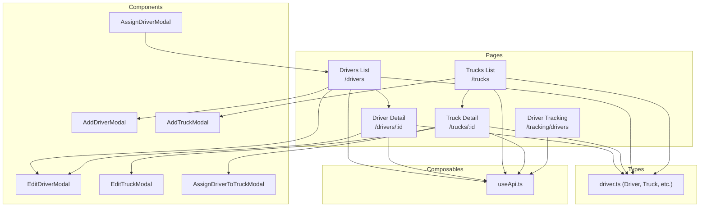
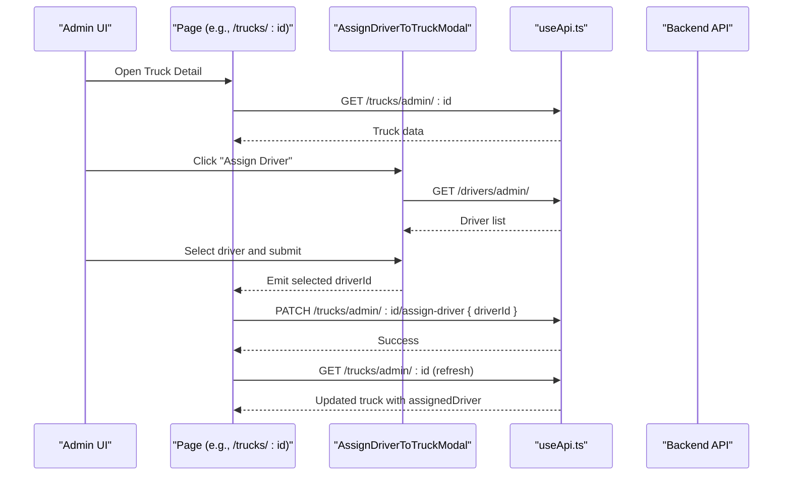
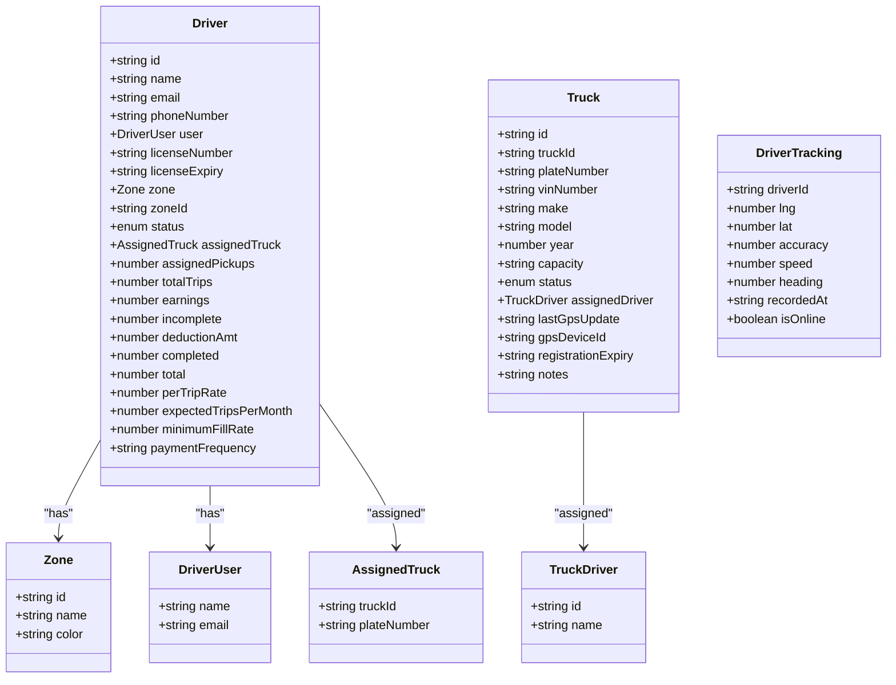
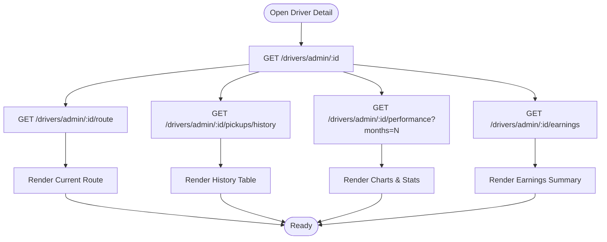
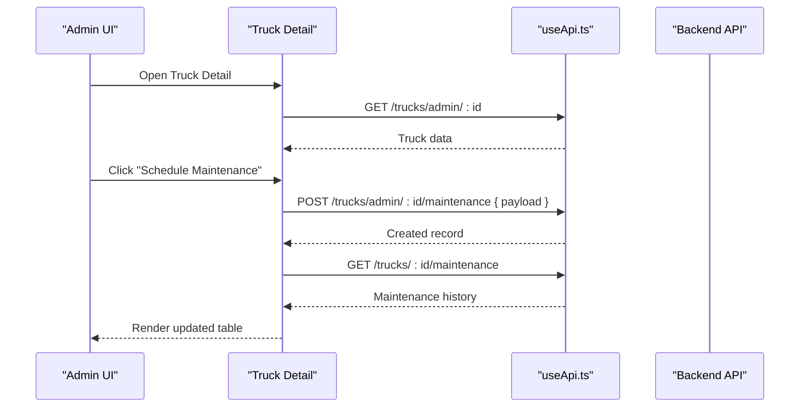
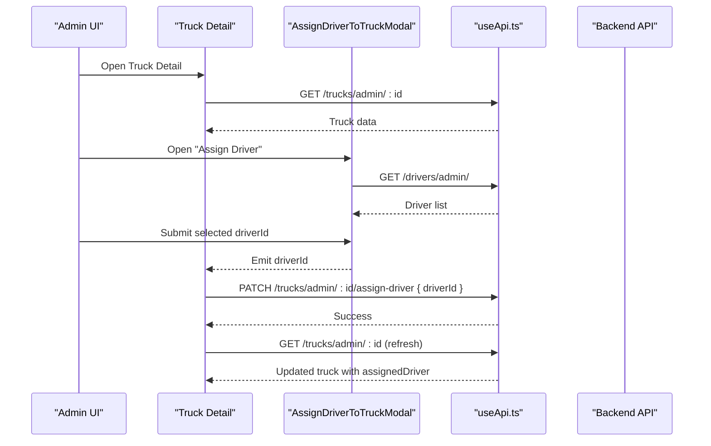
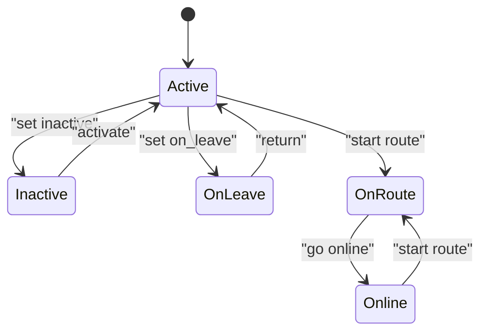
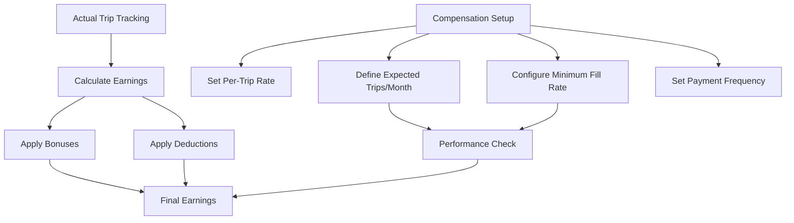
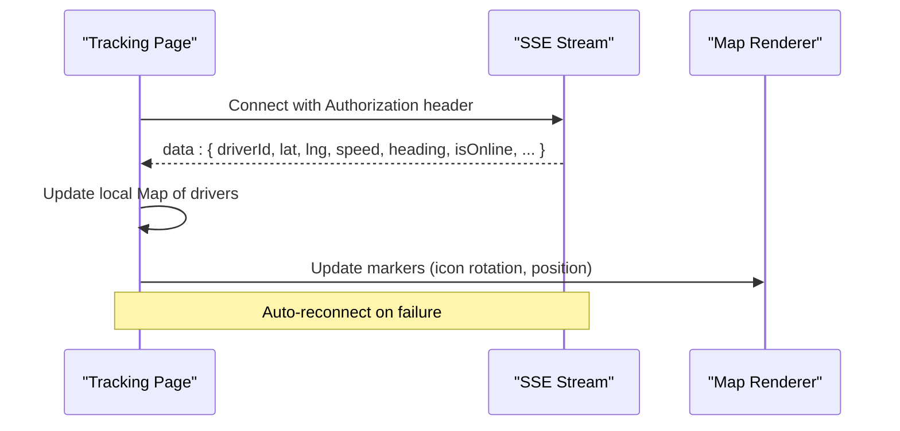
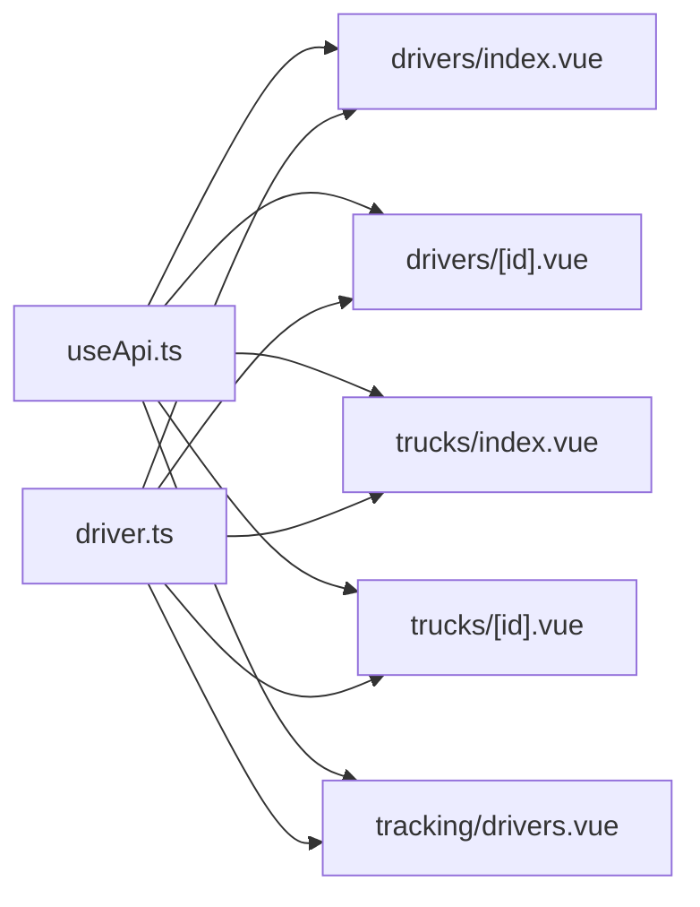

# Fleet Management

<cite>
**Referenced Files in This Document**
- [driver.ts](file://app/types/driver.ts)
- [drivers/index.vue](file://app/pages/drivers/index.vue)
- [drivers/[id].vue](file://app/pages/drivers/[id].vue)
- [trucks/index.vue](file://app/pages/trucks/index.vue)
- [trucks/[id].vue](file://app/pages/trucks/[id].vue)
- [AddDriverModal.vue](file://app/components/AddDriverModal.vue)
- [EditDriverModal.vue](file://app/components/EditDriverModal.vue)
- [AddTruckModal.vue](file://app/components/AddTruckModal.vue)
- [EditTruckModal.vue](file://app/components/EditTruckModal.vue)
- [AssignDriverToTruckModal.vue](file://app/components/AssignDriverToTruckModal.vue)
- [AssignDriverModal.vue](file://app/components/AssignDriverModal.vue)
- [useApi.ts](file://app/composables/useApi.ts)
- [tracking/drivers.vue](file://app/pages/tracking/drivers.vue)
</cite>

## Update Summary
**Changes Made**
- Added comprehensive driver compensation field support including perTripRate, expectedTripsPerMonth, minimumFillRate, and paymentFrequency fields
- Enhanced driver detail page with manual bonus/deduction adjustments functionality
- Updated driver data models to include compensation-related properties
- Added validation and UI inputs for compensation fields in driver creation and editing workflows
- Integrated dynamic earnings fetching capabilities for real-time compensation tracking

## Table of Contents
1. [Introduction](#introduction)
2. [Project Structure](#project-structure)
3. [Core Components](#core-components)
4. [Architecture Overview](#architecture-overview)
5. [Detailed Component Analysis](#detailed-component-analysis)
6. [Dependency Analysis](#dependency-analysis)
7. [Performance Considerations](#performance-considerations)
8. [Troubleshooting Guide](#troubleshooting-guide)
9. [Conclusion](#conclusion)

## Introduction
This document provides comprehensive documentation for the Fleet Management feature, covering driver and truck administration, assignment workflows, availability tracking, operational status management, and real-time status updates. It explains how drivers and trucks are modeled, how assignments are created and updated, and how the system integrates with backend APIs to reflect live operational states. The system now includes advanced driver compensation management with per-trip rates, monthly trip expectations, fill rate requirements, and flexible payment frequency options.

## Project Structure
Fleet Management is implemented across pages, components, types, and composables:
- Pages: Driver list/detail, Truck list/detail, Driver Tracking
- Components: Add/Edit Driver, Add/Edit Truck, Assign Driver to Truck, Assign Driver to Pickup
- Types: Shared data models for Driver, Truck, and related entities
- Composables: API client wrapper for HTTP requests

**Diagram sources**
- [drivers/index.vue:1-149](file://app/pages/drivers/index.vue#L1-L149)
- [drivers/[id].vue](file://app/pages/drivers/[id].vue#L1-L800)
- [trucks/index.vue:1-205](file://app/pages/trucks/index.vue#L1-L205)
- [trucks/[id].vue](file://app/pages/trucks/[id].vue#L1-L573)
- [AddDriverModal.vue:1-190](file://app/components/AddDriverModal.vue#L1-L190)
- [EditDriverModal.vue:1-195](file://app/components/EditDriverModal.vue#L1-L195)
- [AddTruckModal.vue:1-238](file://app/components/AddTruckModal.vue#L1-L238)
- [EditTruckModal.vue:1-250](file://app/components/EditTruckModal.vue#L1-L250)
- [AssignDriverToTruckModal.vue:1-108](file://app/components/AssignDriverToTruckModal.vue#L1-L108)
- [AssignDriverModal.vue:1-222](file://app/components/AssignDriverModal.vue#L1-L222)
- [driver.ts:1-106](file://app/types/driver.ts#L1-L106)
- [useApi.ts:1-91](file://app/composables/useApi.ts#L1-L91)
- [tracking/drivers.vue:1-556](file://app/pages/tracking/drivers.vue#L1-L556)

**Section sources**
- [drivers/index.vue:1-149](file://app/pages/drivers/index.vue#L1-L149)
- [drivers/[id].vue](file://app/pages/drivers/[id].vue#L1-L800)
- [trucks/index.vue:1-205](file://app/pages/trucks/index.vue#L1-L205)
- [trucks/[id].vue](file://app/pages/trucks/[id].vue#L1-L573)
- [driver.ts:1-106](file://app/types/driver.ts#L1-L106)
- [useApi.ts:1-91](file://app/composables/useApi.ts#L1-L91)
- [tracking/drivers.vue:1-556](file://app/pages/tracking/drivers.vue#L1-L556)

## Core Components
- Driver lifecycle: Create, edit, delete, view details, route history, performance metrics, earnings summary, and compensation management.
- Truck lifecycle: Create, edit, delete, view details, maintenance scheduling/history, assign/unassign driver.
- Assignment workflow: Assign a driver to a truck via modal; update truck's assigned driver and refresh state.
- Availability and status: Drivers have statuses such as active, inactive, on_leave, on-route, online; Trucks have active, maintenance, inactive.
- Real-time tracking: SSE-based driver location stream rendered on a map.
- Compensation management: Per-trip rate configuration, monthly trip expectations, minimum fill rate tracking, and flexible payment frequency settings.

Key responsibilities by file:
- Data models: [driver.ts:1-106](file://app/types/driver.ts#L1-L106)
- Driver list and creation: [drivers/index.vue:1-149](file://app/pages/drivers/index.vue#L1-L149), [AddDriverModal.vue:1-190](file://app/components/AddDriverModal.vue#L1-L190)
- Driver detail and editing: [drivers/[id].vue](file://app/pages/drivers/[id].vue#L1-L800), [EditDriverModal.vue:1-195](file://app/components/EditDriverModal.vue#L1-L195)
- Truck list and creation: [trucks/index.vue:1-205](file://app/pages/trucks/index.vue#L1-L205), [AddTruckModal.vue:1-238](file://app/components/AddTruckModal.vue#L1-L238)
- Truck detail and editing: [trucks/[id].vue](file://app/pages/trucks/[id].vue#L1-L573), [EditTruckModal.vue:1-250](file://app/components/EditTruckModal.vue#L1-L250)
- Assign driver to truck: [AssignDriverToTruckModal.vue:1-108](file://app/components/AssignDriverToTruckModal.vue#L1-L108)
- Assign driver to pickup request: [AssignDriverModal.vue:1-222](file://app/components/AssignDriverModal.vue#L1-L222)
- API client: [useApi.ts:1-91](file://app/composables/useApi.ts#L1-L91)
- Real-time tracking: [tracking/drivers.vue:1-556](file://app/pages/tracking/drivers.vue#L1-L556)

**Section sources**
- [driver.ts:1-106](file://app/types/driver.ts#L1-L106)
- [drivers/index.vue:1-149](file://app/pages/drivers/index.vue#L1-L149)
- [drivers/[id].vue](file://app/pages/drivers/[id].vue#L1-L800)
- [trucks/index.vue:1-205](file://app/pages/trucks/index.vue#L1-L205)
- [trucks/[id].vue](file://app/pages/trucks/[id].vue#L1-L573)
- [AddDriverModal.vue:1-190](file://app/components/AddDriverModal.vue#L1-L190)
- [EditDriverModal.vue:1-195](file://app/components/EditDriverModal.vue#L1-L195)
- [AddTruckModal.vue:1-238](file://app/components/AddTruckModal.vue#L1-L238)
- [EditTruckModal.vue:1-250](file://app/components/EditTruckModal.vue#L1-L250)
- [AssignDriverToTruckModal.vue:1-108](file://app/components/AssignDriverToTruckModal.vue#L1-L108)
- [AssignDriverModal.vue:1-222](file://app/components/AssignDriverModal.vue#L1-L222)
- [useApi.ts:1-91](file://app/composables/useApi.ts#L1-L91)
- [tracking/drivers.vue:1-556](file://app/pages/tracking/drivers.vue#L1-L556)

## Architecture Overview
The Fleet Management UI follows a page-driven architecture with reusable modals and typed data models. All server interactions go through a centralized API composable that handles authentication, error handling, and response normalization. The system now supports comprehensive driver compensation management with real-time earnings calculation and adjustment capabilities.

**Diagram sources**
- [trucks/[id].vue](file://app/pages/trucks/[id].vue#L114-L129)
- [AssignDriverToTruckModal.vue:16-31](file://app/components/AssignDriverToTruckModal.vue#L16-L31)
- [useApi.ts:9-67](file://app/composables/useApi.ts#L9-L67)

**Section sources**
- [trucks/[id].vue](file://app/pages/trucks/[id].vue#L1-L573)
- [AssignDriverToTruckModal.vue:1-108](file://app/components/AssignDriverToTruckModal.vue#L1-L108)
- [useApi.ts:1-91](file://app/composables/useApi.ts#L1-L91)

## Detailed Component Analysis

### Data Models and Relationships
The shared type definitions define the core entities and their relationships, now enhanced with comprehensive compensation fields:
- Driver: identity, contact info, license, zone, status, assigned truck, stats, and compensation details
- Truck: identity, plate, VIN, make/model/year/capacity, status, assigned driver, GPS info
- DriverTracking: real-time telemetry fields
- Payloads: create/update structures for drivers and trucks

**Updated** Added compensation fields to the Driver class including perTripRate, expectedTripsPerMonth, minimumFillRate, and paymentFrequency for comprehensive driver compensation management.

**Diagram sources**
- [driver.ts:1-106](file://app/types/driver.ts#L1-L106)

**Section sources**
- [driver.ts:1-106](file://app/types/driver.ts#L1-L106)

### Driver Lifecycle Management
- Create Driver:
  - UI: [AddDriverModal.vue:1-190](file://app/components/AddDriverModal.vue#L1-L190)
  - Submission: [drivers/index.vue:23-33](file://app/pages/drivers/index.vue#L23-L33)
  - API: POST /drivers/admin/
  - **Updated** Now includes compensation field validation and input handling
- Edit Driver:
  - UI: [EditDriverModal.vue:1-195](file://app/components/EditDriverModal.vue#L1-L195)
  - Submission: [drivers/[id].vue](file://app/pages/drivers/[id].vue#L271-L282)
  - API: PATCH /drivers/admin/:id
  - **Updated** Enhanced with compensation field editing capabilities
- Delete Driver:
  - Confirmation and deletion: [drivers/[id].vue](file://app/pages/drivers/[id].vue#L284-L300)
  - API: DELETE /drivers/admin/:id
- View Details:
  - Profile, current route, history, performance, earnings: [drivers/[id].vue](file://app/pages/drivers/[id].vue#L108-L119)
  - **Updated** Enhanced with manual bonus/deduction adjustments and dynamic earnings fetching
  - API calls:
    - GET /drivers/admin/:id
    - GET /drivers/admin/:id/route
    - GET /drivers/admin/:id/pickups/history
    - GET /drivers/admin/:id/performance?months=N

**Updated** Added dynamic earnings fetching endpoint and enhanced earnings display with manual adjustment capabilities.

**Diagram sources**
- [drivers/[id].vue](file://app/pages/drivers/[id].vue#L36-L119)

**Section sources**
- [AddDriverModal.vue:1-190](file://app/components/AddDriverModal.vue#L1-L190)
- [EditDriverModal.vue:1-195](file://app/components/EditDriverModal.vue#L1-L195)
- [drivers/index.vue:1-149](file://app/pages/drivers/index.vue#L1-L149)
- [drivers/[id].vue](file://app/pages/drivers/[id].vue#L1-L800)

### Truck Fleet Oversight
- Create Truck:
  - UI: [AddTruckModal.vue:1-238](file://app/components/AddTruckModal.vue#L1-L238)
  - Submission: [trucks/index.vue:25-34](file://app/pages/trucks/index.vue#L25-L34)
  - API: POST /trucks/admin/
- Edit Truck:
  - UI: [EditTruckModal.vue:1-250](file://app/components/EditTruckModal.vue#L1-L250)
  - Submission: [trucks/[id].vue](file://app/pages/trucks/[id].vue#L131-L153)
  - API: PATCH /trucks/admin/:id
- Delete Truck:
  - Confirmation and deletion: [trucks/[id].vue](file://app/pages/trucks/[id].vue#L155-L166)
  - API: DELETE /trucks/admin/:id
- Maintenance Scheduling:
  - Schedule: [trucks/[id].vue](file://app/pages/trucks/[id].vue#L74-L112)
  - Update: [trucks/[id].vue](file://app/pages/trucks/[id].vue#L173-L204)
  - API endpoints:
    - POST /trucks/admin/:id/maintenance
    - PATCH /trucks/admin/:id/maintenance/:maintenanceId
  - Load history: [trucks/[id].vue](file://app/pages/trucks/[id].vue#L39-L72)
  - API: GET /trucks/:id/maintenance

**Diagram sources**
- [trucks/[id].vue](file://app/pages/trucks/[id].vue#L39-L112)
- [useApi.ts:9-67](file://app/composables/useApi.ts#L9-L67)

**Section sources**
- [AddTruckModal.vue:1-238](file://app/components/AddTruckModal.vue#L1-L238)
- [EditTruckModal.vue:1-250](file://app/components/EditTruckModal.vue#L1-L250)
- [trucks/index.vue:1-205](file://app/pages/trucks/index.vue#L1-L205)
- [trucks/[id].vue](file://app/pages/trucks/[id].vue#L1-L573)

### Vehicle Assignment Workflows and Driver-Truck Relationship
- Assign Driver to Truck:
  - UI: [AssignDriverToTruckModal.vue:1-108](file://app/components/AssignDriverToTruckModal.vue#L1-L108)
  - Triggered from Truck Detail: [trucks/[id].vue](file://app/pages/trucks/[id].vue#L114-L129)
  - API: PATCH /trucks/admin/:id/assign-driver { driverId }
  - Refreshes truck data post-assignment
- Assign Driver to Pickup Request:
  - UI: [AssignDriverModal.vue:1-222](file://app/components/AssignDriverModal.vue#L1-L222)
  - Filters available drivers by status (active or online)
  - Emits selection for further processing

**Diagram sources**
- [AssignDriverToTruckModal.vue:16-31](file://app/components/AssignDriverToTruckModal.vue#L16-L31)
- [trucks/[id].vue](file://app/pages/trucks/[id].vue#L114-L129)
- [useApi.ts:9-67](file://app/composables/useApi.ts#L9-L67)

**Section sources**
- [AssignDriverToTruckModal.vue:1-108](file://app/components/AssignDriverToTruckModal.vue#L1-L108)
- [AssignDriverModal.vue:1-222](file://app/components/AssignDriverModal.vue#L1-L222)
- [trucks/[id].vue](file://app/pages/trucks/[id].vue#L1-L573)

### Availability Tracking and Operational Status Management
- Driver statuses: active, inactive, on_leave, on-route, online
- Truck statuses: active, maintenance, inactive
- Display logic:
  - Driver list badges and colors: [drivers/index.vue:35-41](file://app/pages/drivers/index.vue#L35-L41)
  - Truck list badges and colors: [trucks/index.vue:57-61](file://app/pages/trucks/index.vue#L57-L61)
  - Driver detail computed badge: [drivers/[id].vue](file://app/pages/drivers/[id].vue#L121-L128)
  - Truck detail computed badge: [trucks/[id].vue](file://app/pages/trucks/[id].vue#L206-L211)

**Diagram sources**
- [driver.ts:19-38](file://app/types/driver.ts#L19-L38)
- [drivers/index.vue:35-41](file://app/pages/drivers/index.vue#L35-L41)
- [drivers/[id].vue](file://app/pages/drivers/[id].vue#L121-L128)
- [trucks/index.vue:57-61](file://app/pages/trucks/index.vue#L57-L61)
- [trucks/[id].vue](file://app/pages/trucks/[id].vue#L206-L211)

**Section sources**
- [driver.ts:1-106](file://app/types/driver.ts#L1-L106)
- [drivers/index.vue:1-149](file://app/pages/drivers/index.vue#L1-L149)
- [drivers/[id].vue](file://app/pages/drivers/[id].vue#L1-L800)
- [trucks/index.vue:1-205](file://app/pages/trucks/index.vue#L1-L205)
- [trucks/[id].vue](file://app/pages/trucks/[id].vue#L1-L573)

### Driver Compensation Management
**New Section** The system now provides comprehensive driver compensation management with the following features:

- **Per-Trip Rate Configuration**: Set individual per-trip compensation rates for each driver
- **Monthly Trip Expectations**: Define expected trips per month for performance tracking
- **Minimum Fill Rate**: Configure minimum fill rate requirements for optimal utilization
- **Payment Frequency Settings**: Support for various payment frequencies (weekly, bi-weekly, monthly)
- **Manual Adjustments**: Ability to add bonuses and deductions directly from driver detail page
- **Dynamic Earnings Calculation**: Real-time earnings calculation based on actual trips and rates

Compensation fields integration:
- **Data Model**: Enhanced Driver type with compensation properties
- **UI Inputs**: Validation and input handling in Add/Edit Driver modals
- **Detail Page**: Manual bonus/deduction adjustment interface
- **API Integration**: Backend endpoints for compensation data synchronization

**Diagram sources**
- [driver.ts:1-106](file://app/types/driver.ts#L1-L106)
- [AddDriverModal.vue:1-190](file://app/components/AddDriverModal.vue#L1-L190)
- [EditDriverModal.vue:1-195](file://app/components/EditDriverModal.vue#L1-L195)
- [drivers/[id].vue](file://app/pages/drivers/[id].vue#L1-L800)

**Section sources**
- [driver.ts:1-106](file://app/types/driver.ts#L1-L106)
- [AddDriverModal.vue:1-190](file://app/components/AddDriverModal.vue#L1-L190)
- [EditDriverModal.vue:1-195](file://app/components/EditDriverModal.vue#L1-L195)
- [drivers/[id].vue](file://app/pages/drivers/[id].vue#L1-L800)

### Real-Time Status Updates (Driver Tracking)
- Live map rendering using TomTom SDK
- SSE connection to /tracking/sse/drivers
- Map markers update based on incoming telemetry
- Reconnection controls and error handling

**Diagram sources**
- [tracking/drivers.vue:285-353](file://app/pages/tracking/drivers.vue#L285-L353)
- [tracking/drivers.vue:180-283](file://app/pages/tracking/drivers.vue#L180-L283)

**Section sources**
- [tracking/drivers.vue:1-556](file://app/pages/tracking/drivers.vue#L1-L556)

## Dependency Analysis
- API client dependency:
  - All pages and modals use [useApi.ts:1-91](file://app/composables/useApi.ts#L1-L91) for authenticated requests and error handling.
- Type dependencies:
  - Pages and modals import shared types from [driver.ts:1-106](file://app/types/driver.ts#L1-L106).
- Cross-page navigation:
  - Drivers list links to detail; Truck list links to detail; Truck detail opens assignment modal.

**Diagram sources**
- [useApi.ts:1-91](file://app/composables/useApi.ts#L1-L91)
- [driver.ts:1-106](file://app/types/driver.ts#L1-L106)
- [drivers/index.vue:1-149](file://app/pages/drivers/index.vue#L1-L149)
- [drivers/[id].vue](file://app/pages/drivers/[id].vue#L1-L800)
- [trucks/index.vue:1-205](file://app/pages/trucks/index.vue#L1-L205)
- [trucks/[id].vue](file://app/pages/trucks/[id].vue#L1-L573)
- [tracking/drivers.vue:1-556](file://app/pages/tracking/drivers.vue#L1-L556)

**Section sources**
- [useApi.ts:1-91](file://app/composables/useApi.ts#L1-L91)
- [driver.ts:1-106](file://app/types/driver.ts#L1-L106)
- [drivers/index.vue:1-149](file://app/pages/drivers/index.vue#L1-L149)
- [drivers/[id].vue](file://app/pages/drivers/[id].vue#L1-L800)
- [trucks/index.vue:1-205](file://app/pages/trucks/index.vue#L1-L205)
- [trucks/[id].vue](file://app/pages/trucks/[id].vue#L1-L573)
- [tracking/drivers.vue:1-556](file://app/pages/tracking/drivers.vue#L1-L556)

## Performance Considerations
- Minimize redundant fetches:
  - After mutations (create/edit/delete), refresh only necessary resources (e.g., refresh truck after assignment).
- Efficient marker updates:
  - Remove and recreate GeoJSON source and layer when updating map markers to avoid stale state.
- Debounce heavy operations:
  - For large lists, consider pagination or virtualization if needed.
- Error resilience:
  - Centralized error handling in [useApi.ts:46-67](file://app/composables/useApi.ts#L46-L67) ensures consistent UX and avoids repeated failed requests.
- **Updated** Compensation calculations should be cached where possible to minimize API calls during earnings display.

## Troubleshooting Guide
- Authentication failures:
  - 401 responses trigger logout and redirect to login via [useApi.ts:39-44](file://app/composables/useApi.ts#L39-L44).
- Missing environment variables:
  - Tracking page requires a configured API key; otherwise shows an error banner ([tracking/drivers.vue:115-123](file://app/pages/tracking/drivers.vue#L115-L123)).
- SSE connectivity issues:
  - Connection errors set a non-blocking banner with a retry button ([tracking/drivers.vue:285-353](file://app/pages/tracking/drivers.vue#L285-L353)).
- Validation errors in forms:
  - Driver and Truck modals validate required fields and display inline errors ([AddDriverModal.vue:29-38](file://app/components/AddDriverModal.vue#L29-L38), [AddTruckModal.vue:37-85](file://app/components/AddTruckModal.vue#L37-L85)).
- **Updated** Compensation field validation:
  - Ensure numeric values are properly formatted and within acceptable ranges for per-trip rates and fill rates.
  - Validate payment frequency against supported values.

**Section sources**
- [useApi.ts:39-67](file://app/composables/useApi.ts#L39-L67)
- [tracking/drivers.vue:115-123](file://app/pages/tracking/drivers.vue#L115-L123)
- [tracking/drivers.vue:285-353](file://app/pages/tracking/drivers.vue#L285-L353)
- [AddDriverModal.vue:29-38](file://app/components/AddDriverModal.vue#L29-L38)
- [AddTruckModal.vue:37-85](file://app/components/AddTruckModal.vue#L37-L85)

## Conclusion
Fleet Management provides a robust admin experience for managing drivers and trucks, including assignment workflows, maintenance scheduling, real-time tracking, and comprehensive compensation management. The modular structure separates concerns between pages, modals, types, and API utilities, enabling clear maintenance and extensibility. Status management and assignment constraints are enforced at both UI and API layers, ensuring consistency across the application. The new compensation management features provide flexible driver payment configurations with real-time earnings calculation and manual adjustment capabilities, enhancing the overall driver administration experience.