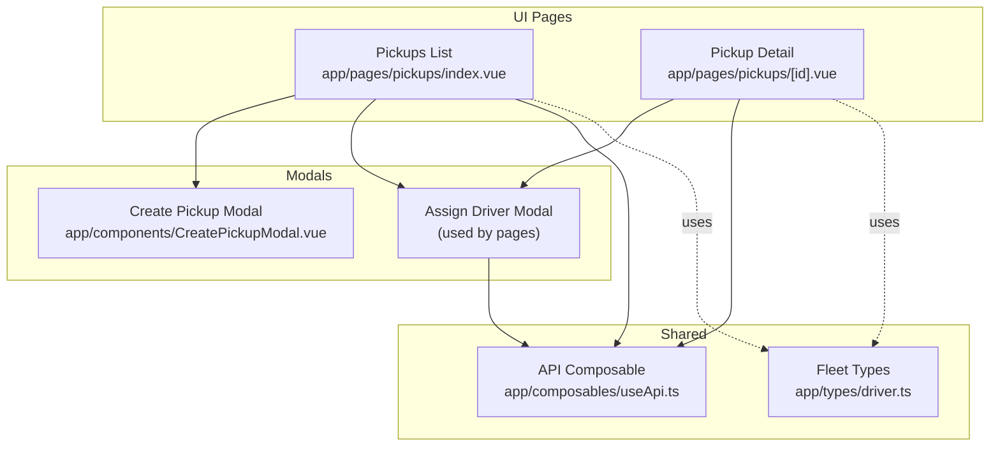
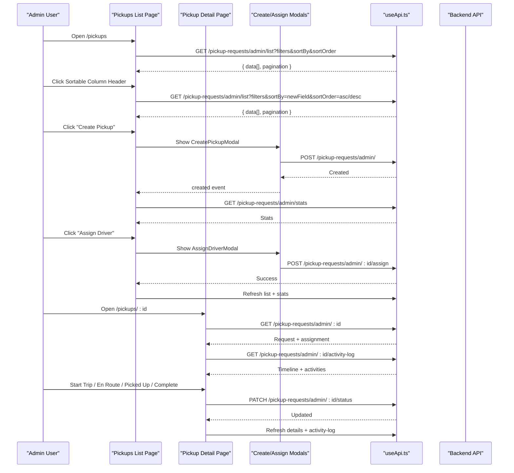
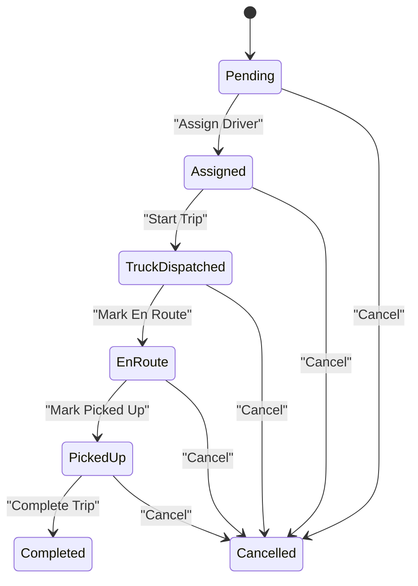
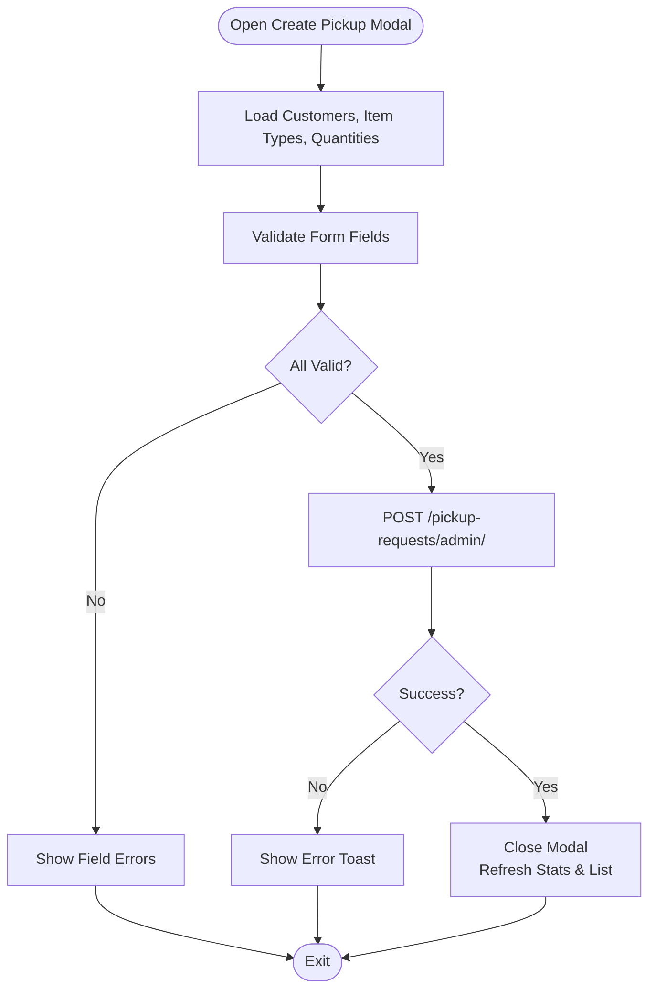
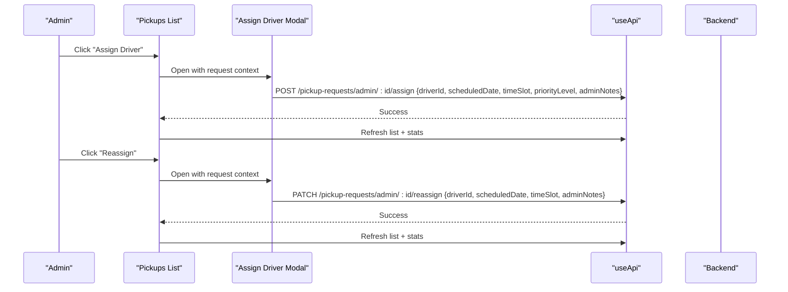
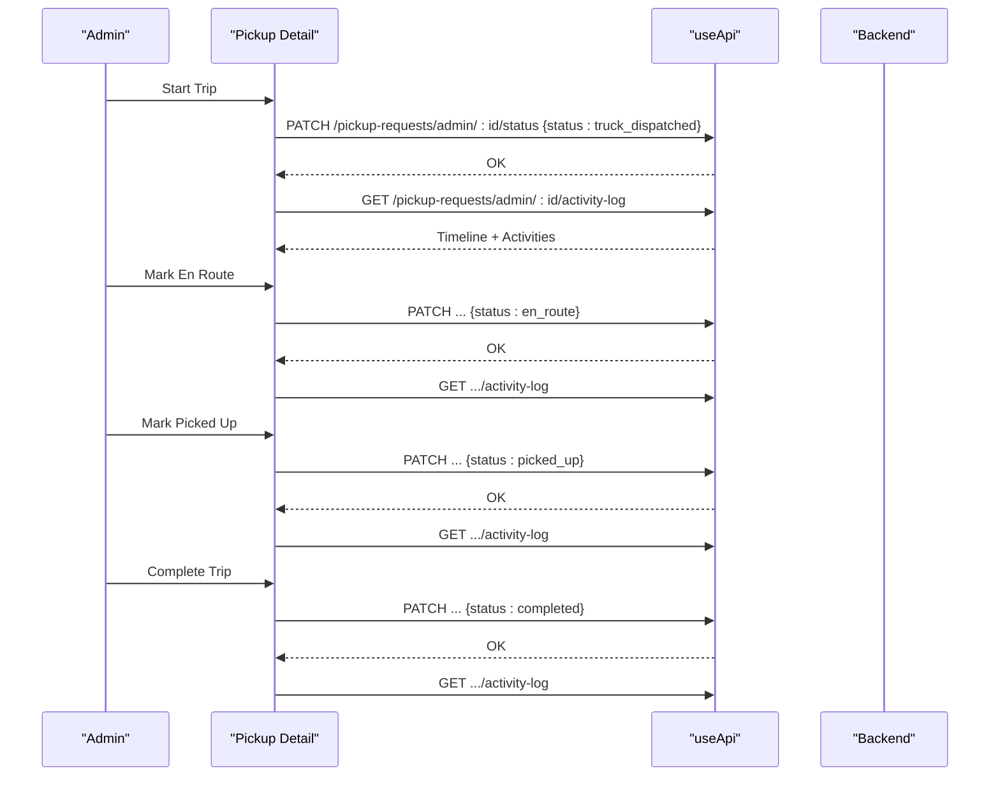
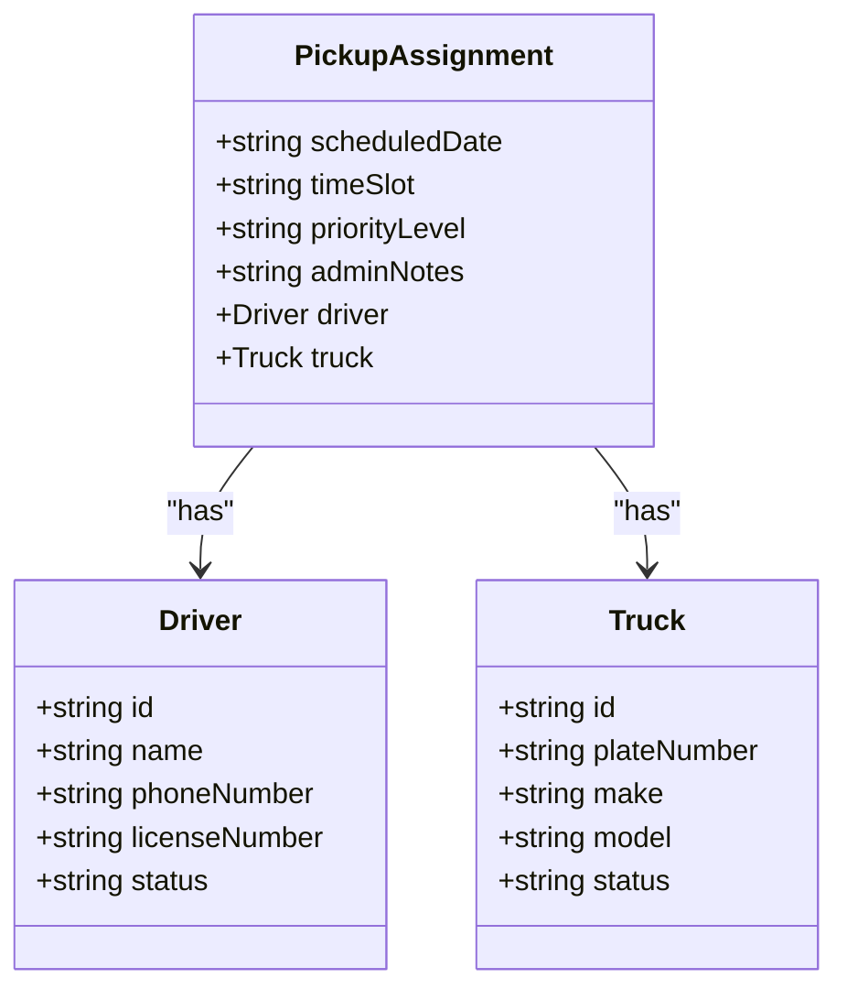
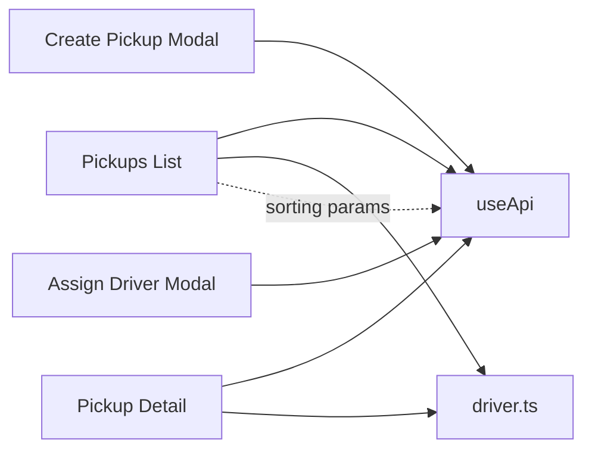

# Pickup Operations

<cite>
**Referenced Files in This Document**
- [index.vue](file://app/pages/pickups/index.vue)
- [detail.vue](file://app/pages/pickups/[id].vue)
- [CreatePickupModal.vue](file://app/components/CreatePickupModal.vue)
- [AssignDriverToTruckModal.vue](file://app/components/AssignDriverToTruckModal.vue)
- [useApi.ts](file://app/composables/useApi.ts)
- [driver.ts](file://app/types/driver.ts)
</cite>

## Update Summary
**Changes Made**
- Added comprehensive sorting functionality to pickup requests list interface
- Implemented interactive column headers with directional arrows for visual feedback
- Enhanced loading states with new Created At column display
- Added server-side sorting support with sortBy and sortOrder parameters

## Table of Contents
1. [Introduction](#introduction)
2. [Project Structure](#project-structure)
3. [Core Components](#core-components)
4. [Architecture Overview](#architecture-overview)
5. [Detailed Component Analysis](#detailed-component-analysis)
6. [Dependency Analysis](#dependency-analysis)
7. [Performance Considerations](#performance-considerations)
8. [Troubleshooting Guide](#troubleshooting-guide)
9. [Conclusion](#conclusion)

## Introduction
This document explains the end-to-end Pickup Operations management in the console application. It covers the pickup request lifecycle from creation to completion, including driver assignment and reassignment workflows, status transitions, priority handling, and integration with fleet management (drivers and trucks). It also documents data models, filtering and pagination, approval-like actions (status updates), real-time tracking mechanisms via activity logs and timeline views, and comprehensive sorting capabilities for efficient data management.

## Project Structure
The pickup operations are implemented primarily through:
- A list page for browsing, filtering, sorting, and assigning/reassigning pickups
- A detail page for deep inspection, status progression, and activity log review
- Modal components for creating requests and assigning drivers
- An API composable that centralizes HTTP calls and error handling
- Type definitions for drivers and trucks used by the UI



**Diagram sources**
- [index.vue:1-606](file://app/pages/pickups/index.vue#L1-L606)
- [detail.vue:1-841](file://app/pages/pickups/[id].vue#L1-L841)
- [CreatePickupModal.vue:1-293](file://app/components/CreatePickupModal.vue#L1-L293)
- [AssignDriverToTruckModal.vue:1-33](file://app/components/AssignDriverToTruckModal.vue#L1-L33)
- [useApi.ts:1-91](file://app/composables/useApi.ts#L1-L91)
- [driver.ts:1-106](file://app/types/driver.ts#L1-L106)

**Section sources**
- [index.vue:1-606](file://app/pages/pickups/index.vue#L1-L606)
- [detail.vue:1-841](file://app/pages/pickups/[id].vue#L1-L841)
- [CreatePickupModal.vue:1-293](file://app/components/CreatePickupModal.vue#L1-L293)
- [useApi.ts:1-91](file://app/composables/useApi.ts#L1-L91)
- [driver.ts:1-106](file://app/types/driver.ts#L1-L106)

## Core Components
- Pickups List Page
  - Displays paginated pickup requests with filters by status and payment status
  - **Updated**: Provides comprehensive sorting functionality with interactive column headers for creation date, preferred pickup date, and last update time
  - Shows visual feedback through directional arrows indicating sort direction
  - Provides "Assign Driver" or "Reassign" actions based on current status
  - Opens a modal to assign or reassign a driver and schedule time slots
  - Fetches operational stats for quick overview
- Pickup Detail Page
  - Shows full request details, customer info, assigned driver/truck, and notes
  - Supports status progression: Start Trip → En Route → Picked Up → Complete
  - Allows cancellation and reassignment
  - Displays a timeline and detailed activity log
- Create Pickup Modal
  - Collects customer selection, disposable item type, estimated quantity, preferred date, and notes
  - Submits a new pickup request via admin endpoint
- Assign Driver Modal
  - Captures driver, scheduled date/time slot, and notes; emits submission to parent
- API Composable
  - Centralized fetch wrapper with auth header injection, unified error handling, and typed helpers
- Fleet Types
  - Shared TypeScript interfaces for drivers, trucks, zones, and tracking data

**Section sources**
- [index.vue:1-606](file://app/pages/pickups/index.vue#L1-L606)
- [detail.vue:1-841](file://app/pages/pickups/[id].vue#L1-L841)
- [CreatePickupModal.vue:1-293](file://app/components/CreatePickupModal.vue#L1-L293)
- [AssignDriverToTruckModal.vue:1-33](file://app/components/AssignDriverToTruckModal.vue#L1-L33)
- [useApi.ts:1-91](file://app/composables/useApi.ts#L1-L91)
- [driver.ts:1-106](file://app/types/driver.ts#L1-L106)

## Architecture Overview
The frontend orchestrates pickup operations by calling admin endpoints for listing, creating, assigning/reassigning, and updating statuses. The detail view enriches context with an activity log and timeline. **Updated**: The list view now supports server-side sorting with dynamic parameter passing for enhanced performance and user experience.



**Diagram sources**
- [index.vue:58-75](file://app/pages/pickups/index.vue#L58-L75)
- [index.vue:124-158](file://app/pages/pickups/index.vue#L124-L158)
- [index.vue:187-239](file://app/pages/pickups/index.vue#L187-L239)
- [detail.vue:117-153](file://app/pages/pickups/[id].vue#L117-L153)
- [detail.vue:290-379](file://app/pages/pickups/[id].vue#L290-L379)
- [CreatePickupModal.vue:131-152](file://app/components/CreatePickupModal.vue#L131-L152)
- [useApi.ts:9-67](file://app/composables/useApi.ts#L9-L67)

## Detailed Component Analysis

### Data Models and Status Lifecycle
- Pickup Request Model
  - Identifiers and timestamps: id, createdAt, updatedAt
  - Customer reference and nested customer details (name, phone, address, region, etc.)
  - Disposable item type and estimated quantity references
  - Assignment object with driver and truck details when available
  - Operational fields: preferredPickupDate, additionalNotes, status, paymentType, paymentStatus
- Status Values
  - pending, assigned, truck_dispatched, en_route, picked_up, completed, cancelled
- Payment Status Values
  - active-plan/active_plan, paid, unpaid
- Priority Handling
  - When assigning a new pickup, a priorityLevel is included in the payload
  - Reassignment does not include priorityLevel
- Time Slots
  - UI presents Morning/Afternoon/Evening; mapped to morning/afternoon/evening for the backend



**Diagram sources**
- [index.vue:167-176](file://app/pages/pickups/index.vue#L167-L176)
- [detail.vue:202-214](file://app/pages/pickups/[id].vue#L202-L214)

**Section sources**
- [index.vue:4-31](file://app/pages/pickups/index.vue#L4-L31)
- [detail.vue:7-65](file://app/pages/pickups/[id].vue#L7-L65)
- [index.vue:167-176](file://app/pages/pickups/index.vue#L167-L176)
- [detail.vue:202-214](file://app/pages/pickups/[id].vue#L202-L214)

### Comprehensive Sorting Functionality
**New Feature**: The pickup requests list now includes advanced sorting capabilities that enhance data navigation and management efficiency.

#### Sorting Implementation
- **Sortable Columns**: Creation Date, Preferred Pickup Date, and Last Update Time
- **Interactive Headers**: Clickable column headers with visual feedback through directional arrows
- **State Management**: Maintains current sort field and order using reactive state variables
- **Server-Side Processing**: Sort parameters are passed to the backend for efficient data processing
- **Visual Indicators**: Dynamic arrow icons show current sort direction (ascending/descending)

#### Technical Implementation
```typescript
// Sorting state management
const sortBy = ref<'createdAt' | 'preferredPickupDate' | 'updatedAt'>('createdAt')
const sortOrder = ref<'asc' | 'desc'>('desc')

// Toggle sort function with automatic pagination reset
function toggleSort(field: 'createdAt' | 'preferredPickupDate' | 'updatedAt') {
  if (sortBy.value === field) {
    sortOrder.value = sortOrder.value === 'asc' ? 'desc' : 'asc'
  } else {
    sortBy.value = field
    sortOrder.value = 'desc'
  }
  pagination.value.page = 1
  fetchRequests()
}

// Visual feedback through icon mapping
function sortIcon(field: string) {
  if (sortBy.value !== field) return 'i-lucide-arrow-up-down'
  return sortOrder.value === 'asc' ? 'i-lucide-arrow-up' : 'i-lucide-arrow-down'
}
```

#### User Interface Features
- **Enhanced Loading States**: Skeleton loaders include the new Created At column
- **Responsive Design**: Sorting controls adapt to different screen sizes
- **Accessibility**: Proper keyboard navigation and screen reader support
- **Performance Optimization**: Server-side sorting reduces client-side processing overhead

**Section sources**
- [index.vue:58-75](file://app/pages/pickups/index.vue#L58-L75)
- [index.vue:124-158](file://app/pages/pickups/index.vue#L124-L158)
- [index.vue:463-471](file://app/pages/pickups/index.vue#L463-L471)
- [index.vue:522-525](file://app/pages/pickups/index.vue#L522-L525)

### Pickup Creation Workflow
- Inputs
  - Customer search and selection (supports name, phone, area)
  - Disposable item type and estimated quantity dropdowns
  - Preferred pickup date and optional notes
- Validation
  - Required fields enforced before submission
- Submission
  - Creates a pickup request via admin endpoint
  - Emits success event to refresh list and stats



**Diagram sources**
- [CreatePickupModal.vue:75-119](file://app/components/CreatePickupModal.vue#L75-L119)
- [CreatePickupModal.vue:121-152](file://app/components/CreatePickupModal.vue#L121-L152)

**Section sources**
- [CreatePickupModal.vue:1-293](file://app/components/CreatePickupModal.vue#L1-L293)

### Driver Assignment and Reassignment
- Initial Assignment
  - Triggered from list or detail when status is pending
  - Payload includes driverId, scheduledDate, timeSlot, priorityLevel, adminNotes
- Reassignment
  - Triggered when status is assigned or when changing driver later
  - Uses reassign endpoint without priorityLevel
- Time Slot Mapping
  - UI labels map to backend values: morning, afternoon, evening



**Diagram sources**
- [index.vue:187-239](file://app/pages/pickups/index.vue#L187-L239)
- [detail.vue:381-431](file://app/pages/pickups/[id].vue#L381-L431)

**Section sources**
- [index.vue:178-239](file://app/pages/pickups/index.vue#L178-L239)
- [detail.vue:381-431](file://app/pages/pickups/[id].vue#L381-L431)

### Status Transitions and Real-Time Tracking
- Status Updates
  - Start Trip: sets status to truck_dispatched
  - Mark En Route: sets status to en_route
  - Mark Picked Up: sets status to picked_up
  - Complete Trip: sets status to completed
  - Cancel: sets status to cancelled
- Activity Log and Timeline
  - Fetches timeline milestones and chronological activities
  - Displays actor, timestamp, and action description



**Diagram sources**
- [detail.vue:290-379](file://app/pages/pickups/[id].vue#L290-L379)
- [detail.vue:139-153](file://app/pages/pickups/[id].vue#L139-L153)

**Section sources**
- [detail.vue:117-153](file://app/pages/pickups/[id].vue#L117-L153)
- [detail.vue:290-379](file://app/pages/pickups/[id].vue#L290-L379)

### Integration with Fleet Management
- Drivers and Trucks
  - Assignment payloads reference driverId
  - Detail view shows assigned driver and truck metadata (plate number, make, model)
- Driver Availability and Status
  - Driver types define statuses such as active, inactive, on_leave, on-route, online
  - Truck assignments and GPS-related fields are modeled for future tracking integrations



**Diagram sources**
- [detail.vue:44-64](file://app/pages/pickups/[id].vue#L44-L64)
- [driver.ts:19-38](file://app/types/driver.ts#L19-L38)
- [driver.ts:65-80](file://app/types/driver.ts#L65-L80)

**Section sources**
- [detail.vue:44-64](file://app/pages/pickups/[id].vue#L44-L64)
- [driver.ts:1-106](file://app/types/driver.ts#L1-L106)

## Dependency Analysis
- UI Pages depend on the API composable for all network operations
- Modals encapsulate user input and emit events to parent pages
- Type definitions provide shared contracts for drivers and trucks
- Filtering and pagination logic resides in the list page and drives API queries
- **Updated**: Sorting functionality integrates with both client-side state management and server-side API parameters



**Diagram sources**
- [index.vue:58-75](file://app/pages/pickups/index.vue#L58-L75)
- [index.vue:124-158](file://app/pages/pickups/index.vue#L124-L158)
- [detail.vue:117-153](file://app/pages/pickups/[id].vue#L117-L153)
- [CreatePickupModal.vue:131-152](file://app/components/CreatePickupModal.vue#L131-L152)
- [useApi.ts:1-91](file://app/composables/useApi.ts#L1-L91)
- [driver.ts:1-106](file://app/types/driver.ts#L1-L106)

**Section sources**
- [index.vue:1-606](file://app/pages/pickups/index.vue#L1-L606)
- [detail.vue:1-841](file://app/pages/pickups/[id].vue#L1-L841)
- [CreatePickupModal.vue:1-293](file://app/components/CreatePickupModal.vue#L1-L293)
- [useApi.ts:1-91](file://app/composables/useApi.ts#L1-L91)
- [driver.ts:1-106](file://app/types/driver.ts#L1-L106)

## Performance Considerations
- Pagination and Filtering
  - Use server-side pagination and filter parameters to reduce payload size
  - Reset to page 1 on filter changes to avoid stale data
- **Updated**: Sorting Performance
  - Implement server-side sorting to handle large datasets efficiently
  - Cache sort preferences to minimize repeated API calls
  - Debounce rapid sort changes to prevent excessive network requests
- Parallel Data Loading
  - Fetch stats and lists concurrently where possible to improve perceived performance
- Efficient UI Rendering
  - Avoid unnecessary re-renders by keeping computed properties minimal and memoized
- Network Efficiency
  - Leverage the centralized API composable to reuse headers and handle errors consistently

## Troubleshooting Guide
- Authentication Failures
  - 401 responses trigger logout and redirect to login via the API composable
- Network Errors
  - Non-successful responses throw descriptive errors; wrapped helpers show toast notifications
- **Updated**: Sorting Issues
  - Verify backend supports requested sort fields (createdAt, preferredPickupDate, updatedAt)
  - Check sort parameter transmission in API requests
  - Ensure proper handling of invalid sort combinations
- Common Issues
  - Missing required fields during creation/validation
  - Incorrect time slot mapping between UI and backend
  - Attempting invalid status transitions (e.g., completing a cancelled request)

**Section sources**
- [useApi.ts:39-67](file://app/composables/useApi.ts#L39-L67)
- [CreatePickupModal.vue:121-152](file://app/components/CreatePickupModal.vue#L121-L152)
- [index.vue:58-75](file://app/pages/pickups/index.vue#L58-L75)
- [index.vue:124-158](file://app/pages/pickups/index.vue#L124-L158)
- [detail.vue:290-379](file://app/pages/pickups/[id].vue#L290-L379)

## Conclusion
The pickup operations module provides a comprehensive workflow for managing waste pickup requests. It supports creation, assignment/reassignment with priority handling, clear status transitions, and rich visibility through activity logs and timelines. **Updated**: The addition of comprehensive sorting functionality significantly enhances data management capabilities, allowing users to efficiently navigate and analyze pickup requests by creation date, preferred pickup date, and last update time. Integration with fleet management is achieved via structured driver and truck references, enabling robust scheduling and tracking capabilities. The enhanced sorting features demonstrate the system's commitment to providing intuitive and powerful administrative tools for effective operations management.