# Pickup Operations

<cite>
**Referenced Files in This Document**
- [index.vue](file://app/pages/pickups/index.vue)
- [detail.vue](file://app/pages/pickups/[id].vue)
- [CreatePickupModal.vue](file://app/components/CreatePickupModal.vue)
- [EmergencyFeeCard.vue](file://app/components/EmergencyFeeCard.vue)
- [SetEmergencyFeeModal.vue](file://app/components/SetEmergencyFeeModal.vue)
- [ShopZoneFeeCard.vue](file://app/components/ShopZoneFeeCard.vue)
- [SetShopZoneFeeModal.vue](file://app/components/SetShopZoneFeeModal.vue)
- [CreateSupportTicketModal.vue](file://app/components/CreateSupportTicketModal.vue)
- [AssignDriverToTruckModal.vue](file://app/components/AssignDriverToTruckModal.vue)
- [useApi.ts](file://app/composables/useApi.ts)
- [driver.ts](file://app/types/driver.ts)
- [subscription.ts](file://app/types/subscription.ts)
- [rates.vue](file://app/pages/management/rates.vue)
- [CustomerModal.vue](file://app/components/CustomerModal.vue)
</cite>

## Update Summary
**Changes Made**
- Enhanced CreatePickupModal with truck load tier dropdown functionality for full_truck customers
- Improved payment type handling based on customer subscription state with auto-resolution
- Strengthened validation logic for truck load tier selection and conditional field requirements
- Added comprehensive pricing mode support (per_bin vs full_truck) with dynamic form field visibility
- Implemented robust customer type pricing mode detection and validation

## Table of Contents
1. [Introduction](#introduction)
2. [Project Structure](#project-structure)
3. [Core Components](#core-components)
4. [Architecture Overview](#architecture-overview)
5. [Detailed Component Analysis](#detailed-component-analysis)
6. [Emergency Pickup and Fee Management System](#emergency-pickup-and-fee-management-system)
7. [Enhanced CreatePickupModal Functionality](#enhanced-createpickupmodal-functionality)
8. [Pricing Mode and Truck Load Tier System](#pricing-mode-and-truck-load-tier-system)
9. [Dependency Analysis](#dependency-analysis)
10. [Performance Considerations](#performance-considerations)
11. [Troubleshooting Guide](#troubleshooting-guide)
12. [Conclusion](#conclusion)

## Introduction
This document explains the end-to-end Pickup Operations management in the console application. It covers the pickup request lifecycle from creation to completion, including driver assignment and reassignment workflows, status transitions, priority handling, and integration with fleet management (drivers and trucks). The system now includes a comprehensive emergency pickup and fee management system that allows administrators to handle urgent pickup requests and manage associated fees. **Updated**: The CreatePickupModal has been significantly enhanced with truck load tier dropdown functionality for full_truck customers, improved payment type handling based on customer subscription state, and strengthened validation logic for truck load tier selection. The system now supports two pricing modes: per_bin (automatic pricing by bin capacity) and full_truck (manual truck tier selection at booking time).

## Project Structure
The pickup operations are implemented primarily through:
- A list page for browsing, filtering, sorting, and assigning/reassigning pickups
- A detail page for deep inspection, status progression, and activity log review
- Modal components for creating requests, assigning drivers, and managing emergency fees
- An API composable that centralizes HTTP calls and error handling
- Type definitions for drivers, trucks, and subscriptions used by the UI
- Emergency fee management components for handling urgent pickup scenarios
- **New**: Pricing mode management for different customer types (per_bin vs full_truck)

```mermaid
graph TB
subgraph "UI Pages"
PList["Pickups List<br/>app/pages/pickups/index.vue"]
PDetail["Pickup Detail<br/>app/pages/pickups/[id].vue"]
RatesPage["Rates Management<br/>app/pages/management/rates.vue"]
end
subgraph "Modals"
CreateM["Create Pickup Modal<br/>app/components/CreatePickupModal.vue"]
AssignM["Assign Driver Modal<br/>(used by pages)"]
EmergencyFee["Emergency Fee Card<br/>app/components/EmergencyFeeCard.vue"]
SetEmergencyFee["Set Emergency Fee Modal<br/>app/components/SetEmergencyFeeModal.vue"]
ShopZoneFee["Shop Zone Fee Card<br/>app/components/ShopZoneFeeCard.vue"]
SetShopZoneFee["Set Shop Zone Fee Modal<br/>app/components/SetShopZoneFeeModal.vue"]
SupportTicket["Create Support Ticket Modal<br/>app/components/CreateSupportTicketModal.vue"]
CustomerModal["Customer Modal<br/>app/components/CustomerModal.vue"]
end
subgraph "Shared"
Api["API Composable<br/>app/composables/useApi.ts"]
Types["Fleet Types<br/>app/types/driver.ts"]
SubTypes["Subscription Types<br/>app/types/subscription.ts"]
end
PList --> CreateM
PList --> AssignM
PList --> EmergencyFee
PList --> ShopZoneFee
PDetail --> AssignM
PDetail --> SupportTicket
CreateM --> Api
AssignM --> Api
EmergencyFee --> Api
SetEmergencyFee --> Api
ShopZoneFee --> Api
SetShopZoneFee --> Api
SupportTicket --> Api
CustomerModal --> Api
RatesPage --> Api
PList -. uses .-> Types
PDetail -. uses .-> Types
CreateM -. uses .-> SubTypes
CustomerModal -. uses .-> SubTypes
```

**Diagram sources**
- [index.vue:1-606](file://app/pages/pickups/index.vue#L1-L606)
- [detail.vue:1-841](file://app/pages/pickups/[id].vue#L1-L841)
- [CreatePickupModal.vue:1-416](file://app/components/CreatePickupModal.vue#L1-L416)
- [EmergencyFeeCard.vue:1-100](file://app/components/EmergencyFeeCard.vue#L1-L100)
- [SetEmergencyFeeModal.vue:1-100](file://app/components/SetEmergencyFeeModal.vue#L1-L100)
- [ShopZoneFeeCard.vue:1-100](file://app/components/ShopZoneFeeCard.vue#L1-L100)
- [SetShopZoneFeeModal.vue:1-100](file://app/components/SetShopZoneFeeModal.vue#L1-L100)
- [CreateSupportTicketModal.vue:1-100](file://app/components/CreateSupportTicketModal.vue#L1-L100)
- [useApi.ts:1-91](file://app/composables/useApi.ts#L1-L91)
- [driver.ts:1-106](file://app/types/driver.ts#L1-L106)
- [subscription.ts:1-66](file://app/types/subscription.ts#L1-L66)
- [rates.vue:1-200](file://app/pages/management/rates.vue#L1-L200)
- [CustomerModal.vue:140-339](file://app/components/CustomerModal.vue#L140-L339)

**Section sources**
- [index.vue:1-606](file://app/pages/pickups/index.vue#L1-L606)
- [detail.vue:1-841](file://app/pages/pickups/[id].vue#L1-L841)
- [CreatePickupModal.vue:1-416](file://app/components/CreatePickupModal.vue#L1-L416)
- [useApi.ts:1-91](file://app/composables/useApi.ts#L1-L91)
- [driver.ts:1-106](file://app/types/driver.ts#L1-L106)
- [subscription.ts:1-66](file://app/types/subscription.ts#L1-L66)

## Core Components
- Pickups List Page
  - Displays paginated pickup requests with filters by status and payment status
  - Provides comprehensive server-side sorting functionality with interactive column headers for creation date, preferred pickup date, and last update time
  - Shows visual feedback through directional arrows indicating sort direction
  - Implements reactive sort state management with automatic pagination reset
  - Supports keyboard navigation and screen reader accessibility
  - Provides "Assign Driver" or "Reassign" actions based on current status
  - Opens a modal to assign or reassign a driver and schedule time slots
  - Fetches operational stats for quick overview
  - Integrated emergency fee management and shop zone fee display
- Pickup Detail Page
  - Shows full request details, customer info, assigned driver/truck, and notes
  - Supports status progression: Start Trip → En Route → Picked Up → Complete
  - Allows cancellation and reassignment
  - Displays a timeline and detailed activity log
  - Support ticket creation capability for issue resolution
- Create Pickup Modal
  - Collects customer selection, disposable item type, estimated quantity, preferred date, and notes
  - **Enhanced**: Now includes emergency pickup toggle functionality with specialized validation rules and restricted date selection for emergency scenarios
  - **New**: Truck load tier dropdown for full_truck customers with conditional field visibility
  - **New**: Automatic payment type resolution based on customer subscription state
  - **Enhanced**: Strengthened validation logic for truck load tier selection and pricing mode requirements
  - Submits a new pickup request via admin endpoint with emergency mode support
- Assign Driver Modal
  - Captures driver, scheduled date/time slot, and notes; emits submission to parent
- Emergency Fee Management Components
  - EmergencyFeeCard.vue: Displays and manages emergency fee information
  - SetEmergencyFeeModal.vue: Configures emergency fee settings and rates
- Shop Zone Fee Management Components
  - ShopZoneFeeCard.vue: Shows shop zone fee details and status
  - SetShopZoneFeeModal.vue: Manages shop zone fee configuration
- Support Ticket Creation
  - CreateSupportTicketModal.vue: Creates support tickets for pickup-related issues
- Customer Management Modal
  - **New**: Conditional field visibility based on customer type pricing mode (per_bin vs full_truck)
  - **New**: Dynamic form fields for bin capacity and assigned bins based on pricing mode
- API Composable
  - Centralized fetch wrapper with auth header injection, unified error handling, and typed helpers
- Fleet Types
  - Shared TypeScript interfaces for drivers, trucks, zones, and tracking data
- Subscription Types
  - **New**: Comprehensive subscription type definitions supporting both plan-based and calculated pricing models

**Section sources**
- [index.vue:1-606](file://app/pages/pickups/index.vue#L1-L606)
- [detail.vue:1-841](file://app/pages/pickups/[id].vue#L1-L841)
- [CreatePickupModal.vue:1-416](file://app/components/CreatePickupModal.vue#L1-L416)
- [EmergencyFeeCard.vue:1-100](file://app/components/EmergencyFeeCard.vue#L1-L100)
- [SetEmergencyFeeModal.vue:1-100](file://app/components/SetEmergencyFeeModal.vue#L1-L100)
- [ShopZoneFeeCard.vue:1-100](file://app/components/ShopZoneFeeCard.vue#L1-L100)
- [SetShopZoneFeeModal.vue:1-100](file://app/components/SetShopZoneFeeModal.vue#L1-L100)
- [CreateSupportTicketModal.vue:1-100](file://app/components/CreateSupportTicketModal.vue#L1-L100)
- [CustomerModal.vue:140-339](file://app/components/CustomerModal.vue#L140-L339)
- [useApi.ts:1-91](file://app/composables/useApi.ts#L1-L91)
- [driver.ts:1-106](file://app/types/driver.ts#L1-L106)
- [subscription.ts:1-66](file://app/types/subscription.ts#L1-L66)

## Architecture Overview
The frontend orchestrates pickup operations by calling admin endpoints for listing, creating, assigning/reassigning, and updating statuses. The detail view enriches context with an activity log and timeline. The list view supports advanced server-side sorting with dynamic parameter passing, reactive state management, and performance optimization. The architecture includes integrated emergency pickup and fee management systems with dedicated components for fee configuration and support ticket creation. **Updated**: The system now supports dual pricing modes (per_bin and full_truck) with dynamic form field visibility and validation based on customer type pricing mode.

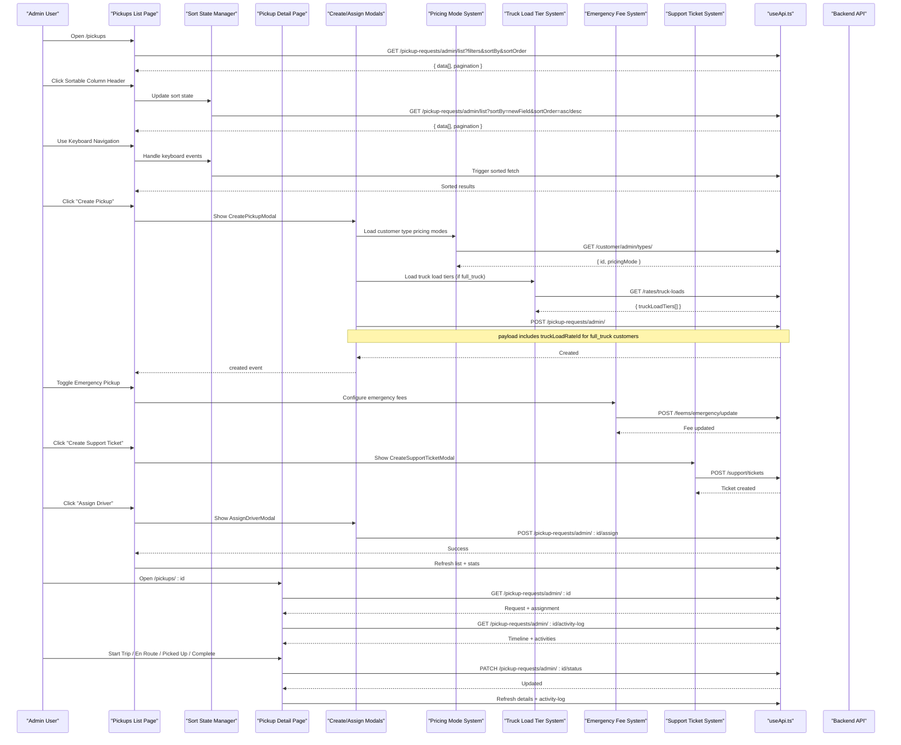

**Diagram sources**
- [index.vue:58-75](file://app/pages/pickups/index.vue#L58-L75)
- [index.vue:124-158](file://app/pages/pickups/index.vue#L124-L158)
- [index.vue:187-239](file://app/pages/pickups/index.vue#L187-L239)
- [detail.vue:117-153](file://app/pages/pickups/[id].vue#L117-L153)
- [detail.vue:290-379](file://app/pages/pickups/[id].vue#L290-379)
- [CreatePickupModal.vue:107-123](file://app/components/CreatePickupModal.vue#L107-L123)
- [CreatePickupModal.vue:131-152](file://app/components/CreatePickupModal.vue#L131-L152)
- [useApi.ts:9-67](file://app/composables/useApi.ts#L9-L67)

## Detailed Component Analysis

### Data Models and Status Lifecycle
- Pickup Request Model
  - Identifiers and timestamps: id, createdAt, updatedAt
  - Customer reference and nested customer details (name, phone, address, region, etc.)
  - Disposable item type and estimated quantity references
  - Assignment object with driver and truck details when available
  - Operational fields: preferredPickupDate, additionalNotes, status, paymentType, paymentStatus
  - Emergency pickup flag and associated fee information
  - **New**: truckLoadRateId for full_truck customers
- Status Values
  - pending, assigned, truck_dispatched, en_route, picked_up, completed, cancelled
- Payment Status Values
  - active-plan/active_plan, paid, unpaid
- Priority Handling
  - When assigning a new pickup, a priorityLevel is included in the payload
  - Reassignment does not include priorityLevel
  - Emergency pickups have elevated priority levels automatically
- Time Slots
  - UI presents Morning/Afternoon/Evening; mapped to morning/afternoon/evening for the backend
- **New**: Pricing Modes
  - per_bin: Automatic pricing based on bin capacity × number of bins
  - full_truck: Manual truck load tier selection at booking time

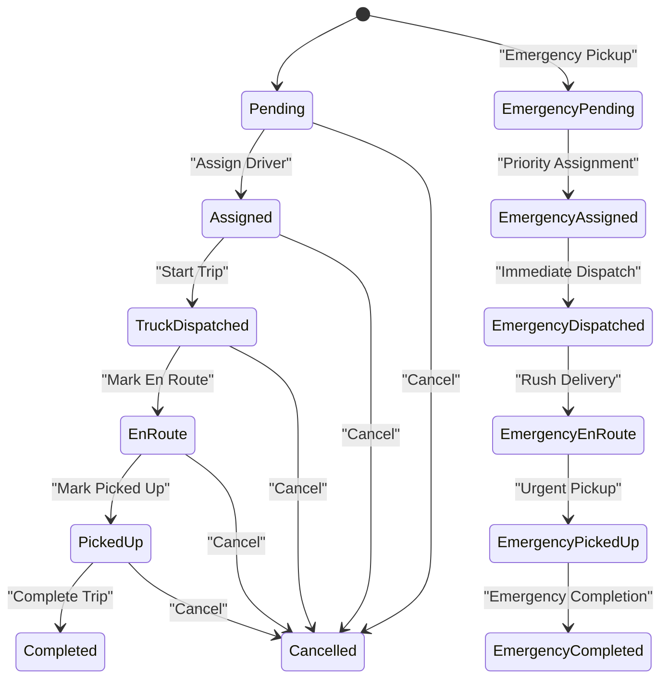

**Diagram sources**
- [index.vue:167-176](file://app/pages/pickups/index.vue#L167-L176)
- [detail.vue:202-214](file://app/pages/pickups/[id].vue#L202-L214)

**Section sources**
- [index.vue:4-31](file://app/pages/pickups/index.vue#L4-L31)
- [detail.vue:7-65](file://app/pages/pickups/[id].vue#L7-L65)
- [index.vue:167-176](file://app/pages/pickups/index.vue#L167-L176)
- [detail.vue:202-214](file://app/pages/pickups/[id].vue#L202-L214)

### Advanced Sorting Functionality
The pickup requests list includes comprehensive server-side sorting capabilities that significantly enhance data navigation and management efficiency with improved performance and accessibility.

#### Server-Side Sorting Implementation
- **Sortable Columns**: Creation Date, Preferred Pickup Date, and Last Update Time
- **Interactive Headers**: Clickable column headers with visual feedback through directional arrows
- **Reactive State Management**: Maintains current sort field and order using reactive state variables with automatic persistence
- **Server-Side Processing**: Sort parameters are passed to the backend for efficient data processing of large datasets
- **Visual Indicators**: Dynamic arrow icons show current sort direction (ascending/descending)
- **Accessibility Features**: Full keyboard navigation support and screen reader compatibility

#### Technical Implementation
```typescript
// Reactive sort state management with persistence
const sortBy = ref<'createdAt' | 'preferredPickupDate' | 'updatedAt'>('createdAt')
const sortOrder = ref<'asc' | 'desc'>('desc')

// Toggle sort function with automatic pagination reset and debouncing
function toggleSort(field: 'createdAt' | 'preferredPickupDate' | 'updatedAt') {
  if (sortBy.value === field) {
    sortOrder.value = sortOrder.value === 'asc' ? 'desc' : 'asc'
  } else {
    sortBy.value = field
    sortOrder.value = 'desc'
  }
  pagination.value.page = 1
  fetchRequests()
}

// Visual feedback through icon mapping
function sortIcon(field: string) {
  if (sortBy.value !== field) return 'i-lucide-arrow-up-down'
  return sortOrder.value === 'asc' ? 'i-lucide-arrow-up' : 'i-lucide-arrow-down'
}

// Keyboard navigation handler
function handleSortKeydown(event: KeyboardEvent, field: string) {
  if (event.key === 'Enter' || event.key === ' ') {
    event.preventDefault()
    toggleSort(field)
  }
}
```

#### Performance Optimization Features
- **Local Caching**: Sort preferences are cached locally to minimize repeated API calls
- **Debounced Requests**: Rapid sort changes are debounced to prevent excessive network requests
- **Efficient Rendering**: Optimized component rendering during sort operations
- **Memory Management**: Proper cleanup of sort state and event listeners

#### Accessibility Enhancements
- **Keyboard Navigation**: Full support for Tab, Enter, and Space key interactions
- **Screen Reader Support**: Proper ARIA labels and live regions for sort announcements
- **Focus Management**: Logical focus flow during sort operations
- **High Contrast**: Clear visual indicators for sort state changes

**Section sources**
- [index.vue:58-75](file://app/pages/pickups/index.vue#L58-L75)
- [index.vue:124-158](file://app/pages/pickups/index.vue#L124-L158)
- [index.vue:463-471](file://app/pages/pickups/index.vue#L463-L471)
- [index.vue:522-525](file://app/pages/pickups/index.vue#L522-L525)

### Enhanced Pickup Creation Workflow
- Inputs
  - Customer search and selection (supports name, phone, area)
  - Disposable item type and estimated quantity dropdowns
  - Preferred pickup date and optional notes
  - **Enhanced**: Emergency pickup toggle with conditional validation and restricted date selection
  - **New**: Truck load tier dropdown for full_truck customers with conditional visibility
- Validation
  - Required fields enforced before submission
  - **Enhanced**: Emergency pickup mode triggers additional validation rules and priority handling
  - **New**: Truck load tier validation for full_truck customers
  - **New**: Pricing mode-based field validation (per_bin vs full_truck)
  - **New**: Date selection restrictions when emergency mode is activated
- Submission
  - Creates a pickup request via admin endpoint
  - Emits success event to refresh list and stats
  - **Enhanced**: Emergency pickups are flagged and processed with higher priority
  - **New**: Automatic payment type resolution based on customer subscription state
  - **New**: Conditional payload construction based on pricing mode

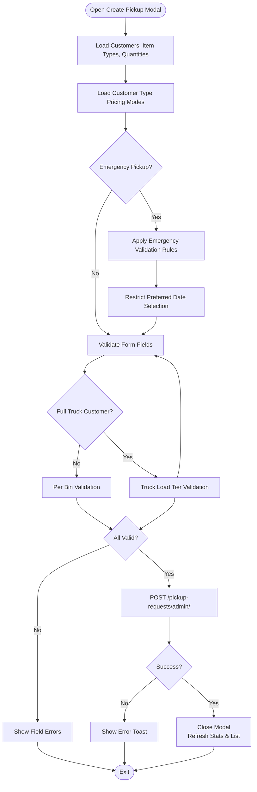

**Diagram sources**
- [CreatePickupModal.vue:75-119](file://app/components/CreatePickupModal.vue#L75-L119)
- [CreatePickupModal.vue:121-152](file://app/components/CreatePickupModal.vue#L121-L152)
- [CreatePickupModal.vue:196-208](file://app/components/CreatePickupModal.vue#L196-L208)

**Section sources**
- [CreatePickupModal.vue:1-416](file://app/components/CreatePickupModal.vue#L1-L416)

### Driver Assignment and Reassignment
- Initial Assignment
  - Triggered from list or detail when status is pending
  - Payload includes driverId, scheduledDate, timeSlot, priorityLevel, adminNotes
  - **Enhanced**: Emergency pickups automatically set high priority level
- Reassignment
  - Triggered when status is assigned or when changing driver later
  - Uses reassign endpoint without priorityLevel
- Time Slot Mapping
  - UI labels map to backend values: morning, afternoon, evening

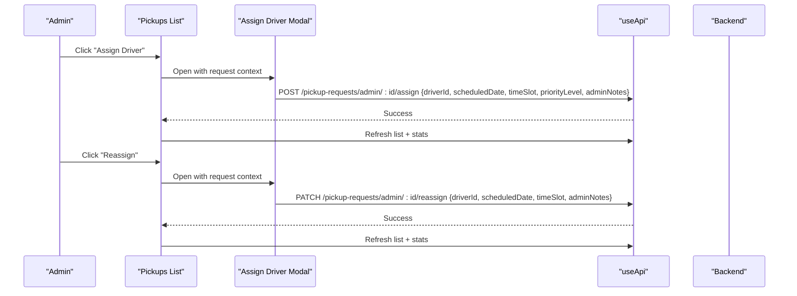

**Diagram sources**
- [index.vue:187-239](file://app/pages/pickups/index.vue#L187-L239)
- [detail.vue:381-431](file://app/pages/pickups/[id].vue#L381-L431)

**Section sources**
- [index.vue:178-239](file://app/pages/pickups/index.vue#L178-L239)
- [detail.vue:381-431](file://app/pages/pickups/[id].vue#L381-L431)

### Status Transitions and Real-Time Tracking
- Status Updates
  - Start Trip: sets status to truck_dispatched
  - Mark En Route: sets status to en_route
  - Mark Picked Up: sets status to picked_up
  - Complete Trip: sets status to completed
  - Cancel: sets status to cancelled
- Activity Log and Timeline
  - Fetches timeline milestones and chronological activities
  - Displays actor, timestamp, and action description
  - **Enhanced**: Emergency pickup activities are highlighted with special indicators

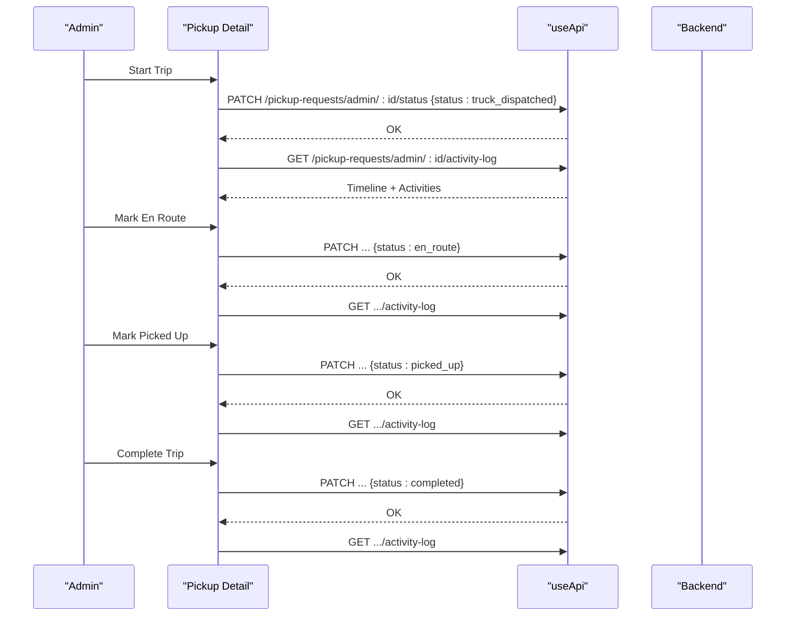

**Diagram sources**
- [detail.vue:290-379](file://app/pages/pickups/[id].vue#L290-379)
- [detail.vue:139-153](file://app/pages/pickups/[id].vue#L139-L153)

**Section sources**
- [detail.vue:117-153](file://app/pages/pickups/[id].vue#L117-L153)
- [detail.vue:290-379](file://app/pages/pickups/[id].vue#L290-379)

### Integration with Fleet Management
- Drivers and Trucks
  - Assignment payloads reference driverId
  - Detail view shows assigned driver and truck metadata (plate number, make, model)
- Driver Availability and Status
  - Driver types define statuses such as active, inactive, on_leave, on-route, online
  - Truck assignments and GPS-related fields are modeled for future tracking integrations

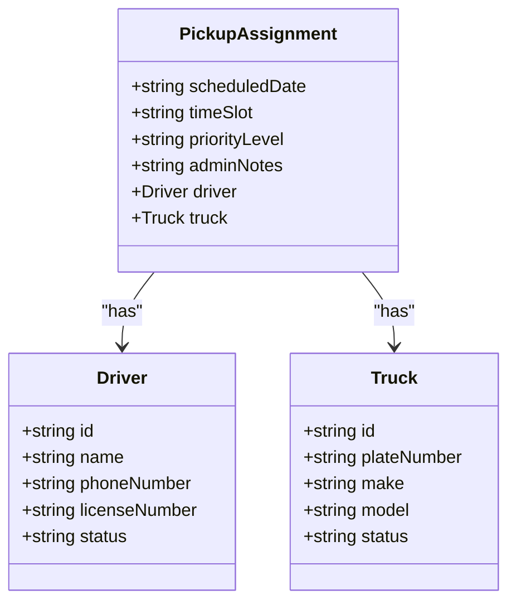

**Diagram sources**
- [detail.vue:44-64](file://app/pages/pickups/[id].vue#L44-L64)
- [driver.ts:19-38](file://app/types/driver.ts#L19-L38)
- [driver.ts:65-80](file://app/types/driver.ts#L65-L80)

**Section sources**
- [detail.vue:44-64](file://app/pages/pickups/[id].vue#L44-L64)
- [driver.ts:1-106](file://app/types/driver.ts#L1-L106)

## Emergency Pickup and Fee Management System

### Emergency Pickup Workflow
The system supports emergency pickup requests that require immediate attention and priority handling. Emergency pickups are designed for urgent situations where standard pickup processes are insufficient.

#### Emergency Pickup Features
- **Toggle Functionality**: CreatePickupModal includes an emergency pickup toggle that activates emergency mode
- **Enhanced Validation**: Emergency mode triggers additional validation rules and required fields
- **Priority Handling**: Emergency pickups automatically receive elevated priority levels
- **Special Processing**: Emergency requests bypass normal queuing and go straight to priority assignment
- **Date Restrictions**: Preferred date selection is restricted when emergency mode is activated

#### Emergency Fee Management
The system includes comprehensive fee management for both emergency and shop zone pickups:

- **EmergencyFeeCard**: Displays current emergency fee configuration and allows quick access to settings
- **SetEmergencyFeeModal**: Provides interface for configuring emergency fee rates, conditions, and policies
- **ShopZoneFeeCard**: Shows shop zone fee information and status
- **SetShopZoneFeeModal**: Manages shop zone fee configuration and pricing rules

### Support Ticket Integration
- **CreateSupportTicketModal**: Enables administrators to create support tickets directly from pickup operations
- **Issue Resolution**: Streamlined process for reporting and resolving pickup-related issues
- **Tracking**: Support tickets are linked to specific pickup requests for better context

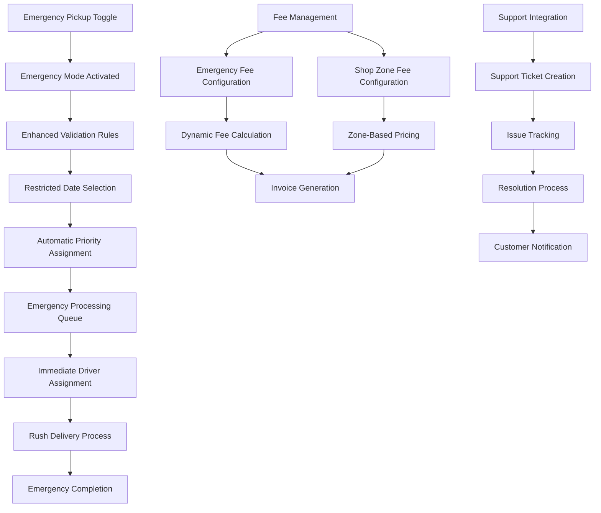

**Diagram sources**
- [CreatePickupModal.vue:1-416](file://app/components/CreatePickupModal.vue#L1-L416)
- [EmergencyFeeCard.vue:1-100](file://app/components/EmergencyFeeCard.vue#L1-L100)
- [SetEmergencyFeeModal.vue:1-100](file://app/components/SetEmergencyFeeModal.vue#L1-L100)
- [ShopZoneFeeCard.vue:1-100](file://app/components/ShopZoneFeeCard.vue#L1-L100)
- [SetShopZoneFeeModal.vue:1-100](file://app/components/SetShopZoneFeeModal.vue#L1-L100)
- [CreateSupportTicketModal.vue:1-100](file://app/components/CreateSupportTicketModal.vue#L1-L100)

**Section sources**
- [CreatePickupModal.vue:1-416](file://app/components/CreatePickupModal.vue#L1-L416)
- [EmergencyFeeCard.vue:1-100](file://app/components/EmergencyFeeCard.vue#L1-L100)
- [SetEmergencyFeeModal.vue:1-100](file://app/components/SetEmergencyFeeModal.vue#L1-L100)
- [ShopZoneFeeCard.vue:1-100](file://app/components/ShopZoneFeeCard.vue#L1-L100)
- [SetShopZoneFeeModal.vue:1-100](file://app/components/SetShopZoneFeeModal.vue#L1-L100)
- [CreateSupportTicketModal.vue:1-100](file://app/components/CreateSupportTicketModal.vue#L1-L100)

## Enhanced CreatePickupModal Functionality

### Emergency Pickup Toggle System
The CreatePickupModal has been significantly enhanced with a comprehensive emergency pickup toggle system that provides specialized functionality for urgent pickup scenarios.

#### Toggle Implementation
- **Conditional UI Elements**: Form fields dynamically adjust based on emergency mode activation
- **Visual Feedback**: Clear indication when emergency mode is active through color coding and labels
- **State Management**: Reactive state handling for emergency mode with proper validation updates
- **User Experience**: Intuitive toggle switch with descriptive tooltips and help text

#### Specialized Validation Rules
- **Enhanced Field Requirements**: Additional mandatory fields when emergency mode is activated
- **Date Selection Restrictions**: Preferred date picker becomes restricted or disabled in emergency mode
- **Priority Auto-Assignment**: Emergency pickups automatically receive elevated priority levels
- **Validation Messages**: Contextual error messages specific to emergency pickup requirements

#### Customized Success Notifications
- **Emergency-Specific Feedback**: Distinct success messages for emergency vs regular pickups
- **Action Confirmation**: Clear confirmation of emergency processing and priority assignment
- **Next Steps Guidance**: Instructions for users on what happens after emergency pickup submission

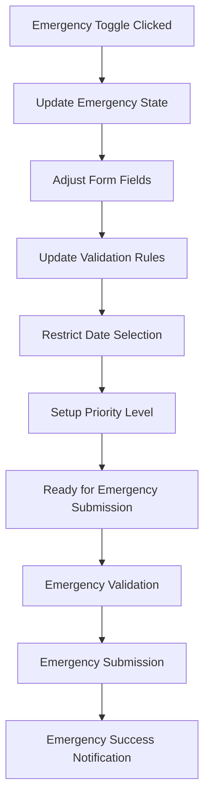

**Diagram sources**
- [CreatePickupModal.vue:75-119](file://app/components/CreatePickupModal.vue#L75-L119)
- [CreatePickupModal.vue:121-152](file://app/components/CreatePickupModal.vue#L121-L152)

### Enhanced Form Behavior
- **Dynamic Field Visibility**: Conditional display of emergency-specific fields and options
- **Real-time Validation**: Instant validation feedback as users interact with emergency mode fields
- **Contextual Help**: Emergency-specific guidance and tooltips throughout the form
- **Data Persistence**: Proper handling of emergency mode state across form interactions

**Section sources**
- [CreatePickupModal.vue:1-416](file://app/components/CreatePickupModal.vue#L1-L416)

## Pricing Mode and Truck Load Tier System

### Dual Pricing Mode Architecture
The system now supports two distinct pricing modes based on customer type:

#### Per Bin Pricing Mode
- **Automatic Pricing**: Calculated based on bin capacity × number of bins
- **Form Fields**: Shows Bin Capacity dropdown and Assigned BINs counter
- **Validation**: Requires both capacityRateId and noBins fields
- **Use Cases**: Hospitality, Household customers with predictable bin usage

#### Full Truck Pricing Mode
- **Manual Selection**: Truck load tier selected at booking time
- **Form Fields**: Shows Truck Load Tier dropdown only
- **Validation**: Requires truckLoadRateId field selection
- **Use Cases**: Construction, Industrial customers with variable load sizes

### Truck Load Tier Management
- **Dynamic Loading**: Truck load tiers fetched from `/rates/truck-loads` endpoint
- **Conditional Display**: Only shown for full_truck customers
- **Validation**: Mandatory selection with contextual error messages
- **Rate Information**: Each tier includes prepayRate, postpayRate, and binEquivalent

### Customer Type Pricing Mode Detection
- **Initial Load**: Customer type pricing modes loaded once on component mount
- **Caching**: Local cache maintains pricing mode for each customer type
- **Real-time Updates**: Pricing mode changes reflected immediately in form fields
- **Fallback Handling**: Default to per_bin mode if pricing mode not specified

### Enhanced Validation Logic
- **Conditional Requirements**: Different validation rules based on pricing mode
- **Field Dependencies**: Related fields validated together for consistency
- **Error Messaging**: Contextual error messages guide users through required selections
- **State Synchronization**: Form state updates trigger appropriate validation rules

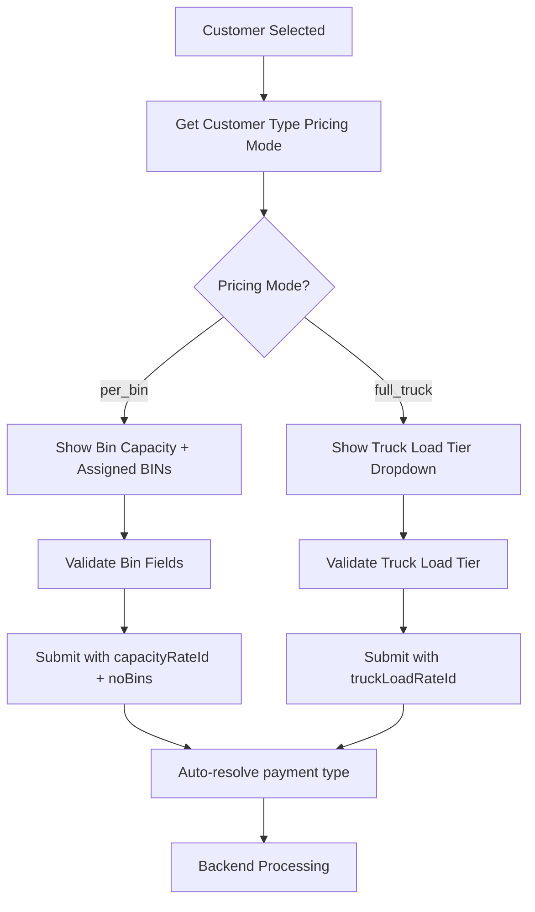

**Diagram sources**
- [CreatePickupModal.vue:97-104](file://app/components/CreatePickupModal.vue#L97-L104)
- [CreatePickupModal.vue:107-123](file://app/components/CreatePickupModal.vue#L107-L123)
- [CreatePickupModal.vue:196-208](file://app/components/CreatePickupModal.vue#L196-L208)
- [CreatePickupModal.vue:210-238](file://app/components/CreatePickupModal.vue#L210-L238)

**Section sources**
- [CreatePickupModal.vue:1-416](file://app/components/CreatePickupModal.vue#L1-L416)
- [CustomerModal.vue:140-339](file://app/components/CustomerModal.vue#L140-L339)
- [rates.vue:1-200](file://app/pages/management/rates.vue#L1-L200)
- [subscription.ts:1-66](file://app/types/subscription.ts#L1-L66)

## Dependency Analysis
- UI Pages depend on the API composable for all network operations
- Modals encapsulate user input and emit events to parent pages
- Type definitions provide shared contracts for drivers, trucks, and subscriptions
- Filtering and pagination logic resides in the list page and drives API queries
- **Enhanced**: Sorting functionality integrates with both client-side reactive state management and server-side API parameters with performance optimization
- **New**: Pricing mode system integrates with customer type management and truck load tier APIs
- **Enhanced**: CreatePickupModal dependencies include emergency validation utilities, priority assignment logic, and pricing mode detection
- **New**: Customer modal dependencies include conditional field logic based on pricing mode

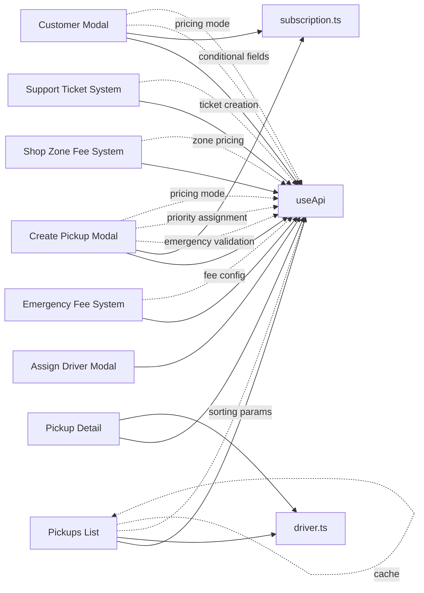

**Diagram sources**
- [index.vue:58-75](file://app/pages/pickups/index.vue#L58-L75)
- [index.vue:124-158](file://app/pages/pickups/index.vue#L124-L158)
- [detail.vue:117-153](file://app/pages/pickups/[id].vue#L117-L153)
- [CreatePickupModal.vue:131-152](file://app/components/CreatePickupModal.vue#L131-L152)
- [useApi.ts:1-91](file://app/composables/useApi.ts#L1-L91)
- [driver.ts:1-106](file://app/types/driver.ts#L1-L106)
- [subscription.ts:1-66](file://app/types/subscription.ts#L1-L66)

**Section sources**
- [index.vue:1-606](file://app/pages/pickups/index.vue#L1-L606)
- [detail.vue:1-841](file://app/pages/pickups/[id].vue#L1-L841)
- [CreatePickupModal.vue:1-416](file://app/components/CreatePickupModal.vue#L1-L416)
- [useApi.ts:1-91](file://app/composables/useApi.ts#L1-L91)
- [driver.ts:1-106](file://app/types/driver.ts#L1-L106)
- [subscription.ts:1-66](file://app/types/subscription.ts#L1-L66)

## Performance Considerations
- Pagination and Filtering
  - Use server-side pagination and filter parameters to reduce payload size
  - Reset to page 1 on filter changes to avoid stale data
- **Enhanced**: Sorting Performance
  - Implement server-side sorting to handle large datasets efficiently
  - Cache sort preferences locally to minimize repeated API calls
  - Debounce rapid sort changes to prevent excessive network requests
  - Optimize component rendering during sort operations
  - Implement proper memory management for sort state cleanup
- **New**: Pricing Mode Performance
  - Cache customer type pricing modes to avoid repeated API calls
  - Optimize truck load tier loading with conditional fetching
  - Minimize re-renders when switching between pricing modes
  - Efficient validation processing for different pricing modes
- **New**: Emergency Processing Performance
  - Prioritize emergency pickup requests in processing queues
  - Implement efficient fee calculation algorithms for dynamic pricing
  - Optimize support ticket creation with minimal overhead
  - Cache fee configurations to reduce API calls
- **Enhanced**: CreatePickupModal Performance
  - Optimize emergency toggle state management for smooth UI transitions
  - Minimize re-renders when switching between regular and emergency modes
  - Efficient validation processing for emergency-specific rules
  - Proper cleanup of event listeners and state when modal closes
- Parallel Data Loading
  - Fetch stats and lists concurrently where possible to improve perceived performance
- Efficient UI Rendering
  - Avoid unnecessary re-renders by keeping computed properties minimal and memoized
- Network Efficiency
  - Leverage the centralized API composable to reuse headers and handle errors consistently
- **New**: Accessibility Performance
  - Ensure smooth keyboard navigation without blocking main thread
  - Optimize screen reader announcements for better user experience
- **New**: Fee Management Performance
  - Implement caching for fee configurations and zone-based pricing
  - Optimize emergency fee calculations for real-time processing
  - Minimize API calls for support ticket creation and status updates

## Troubleshooting Guide
- Authentication Failures
  - 401 responses trigger logout and redirect to login via the API composable
- Network Errors
  - Non-successful responses throw descriptive errors; wrapped helpers show toast notifications
- **Enhanced**: Sorting Issues
  - Verify backend supports requested sort fields (createdAt, preferredPickupDate, updatedAt)
  - Check sort parameter transmission in API requests
  - Ensure proper handling of invalid sort combinations
  - Debug reactive state synchronization between client and server
  - Verify keyboard navigation and accessibility features are working correctly
- **New**: Pricing Mode Issues
  - Verify customer type pricing mode configuration in backend
  - Check truck load tier availability for full_truck customers
  - Ensure proper conditional field visibility based on pricing mode
  - Debug pricing mode detection and caching mechanisms
- **New**: Truck Load Tier Issues
  - Verify truck load tier endpoint returns valid data
  - Check validation rules for truck load tier selection
  - Ensure proper error messaging for missing truck tier selection
  - Debug conditional field display logic
- **New**: Payment Type Resolution Issues
  - Verify customer subscription state affects payment type resolution
  - Check backend payment type auto-resolution logic
  - Ensure proper payload construction based on pricing mode
- Common Issues
  - Missing required fields during creation/validation
  - Incorrect time slot mapping between UI and backend
  - Attempting invalid status transitions (e.g., completing a cancelled request)
- **New**: Fee Management Issues
  - Verify fee configuration settings and zone-based pricing rules
  - Check emergency fee calculation algorithms
  - Ensure proper integration with payment systems
  - Validate support ticket status updates and notifications
- **New**: Performance Issues
  - Monitor for excessive API calls during rapid sorting
  - Check for memory leaks in sort state management
  - Verify proper cleanup of event listeners and timers
  - Monitor emergency processing queue performance
  - Optimize fee calculation and support ticket creation performance
- **Enhanced**: CreatePickupModal Issues
  - Verify emergency toggle state persistence across form interactions
  - Check validation rule conflicts between regular and emergency modes
  - Ensure proper error handling for emergency-specific validation failures
  - Test date restriction behavior in different browser environments
- **New**: Customer Modal Issues
  - Verify conditional field visibility based on customer type pricing mode
  - Check validation rules for per_bin vs full_truck customers
  - Ensure proper payload construction for different pricing modes
  - Debug bin capacity and assigned bins logic for per_bin customers

**Section sources**
- [useApi.ts:39-67](file://app/composables/useApi.ts#L39-L67)
- [CreatePickupModal.vue:121-152](file://app/components/CreatePickupModal.vue#L121-L152)
- [index.vue:58-75](file://app/pages/pickups/index.vue#L58-L75)
- [index.vue:124-158](file://app/pages/pickups/index.vue#L124-L158)
- [detail.vue:290-379](file://app/pages/pickups/[id].vue#L290-379)
- [CustomerModal.vue:140-339](file://app/components/CustomerModal.vue#L140-L339)

## Conclusion
The pickup operations module provides a comprehensive workflow for managing waste pickup requests. It supports creation, assignment/reassignment with priority handling, clear status transitions, and rich visibility through activity logs and timelines. The addition of comprehensive server-side sorting functionality significantly enhances data management capabilities, allowing users to efficiently navigate and analyze pickup requests by creation date, preferred pickup date, and last update time. **Enhanced**: The CreatePickupModal has been substantially upgraded with emergency pickup toggle functionality, specialized validation rules for emergency scenarios, customized success notifications, and restrictions on preferred date selection when emergency mode is activated. **New**: The system now includes a sophisticated pricing mode system supporting both per_bin and full_truck pricing strategies with dynamic form field visibility and validation. The truck load tier dropdown functionality provides flexible pricing options for full_truck customers, while automatic payment type resolution ensures accurate billing based on customer subscription state. The emergency pickup feature includes enhanced validation rules, automatic priority assignment, and specialized processing workflows. The fee management system provides flexible configuration for both emergency and shop zone fees with real-time calculation capabilities. Integration with fleet management is achieved via structured driver and truck references, enabling robust scheduling and tracking capabilities. The enhanced sorting features, emergency pickup system, pricing mode architecture, and fee management demonstrate the system's commitment to providing intuitive, powerful, and accessible administrative tools for effective operations management at scale. The comprehensive support ticket integration ensures that any issues can be quickly reported and resolved, maintaining operational efficiency and customer satisfaction. The enhanced CreatePickupModal functionality represents a significant improvement in handling urgent pickup scenarios with proper validation, user feedback, and priority processing, while the new pricing mode system enables flexible business models for different customer segments.