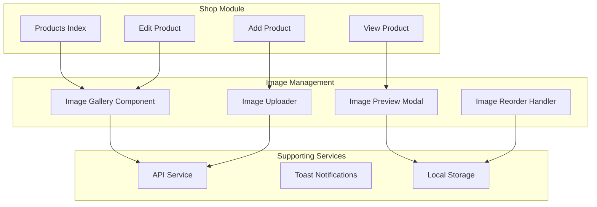
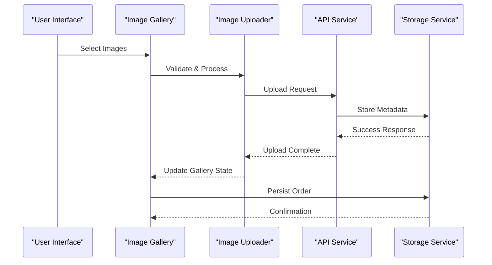
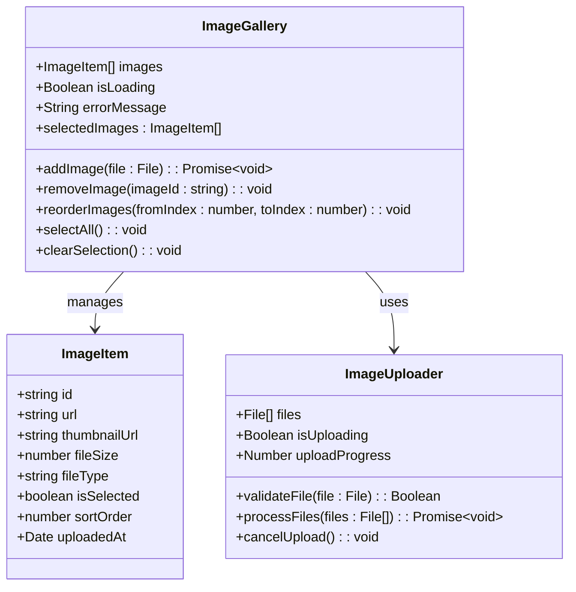
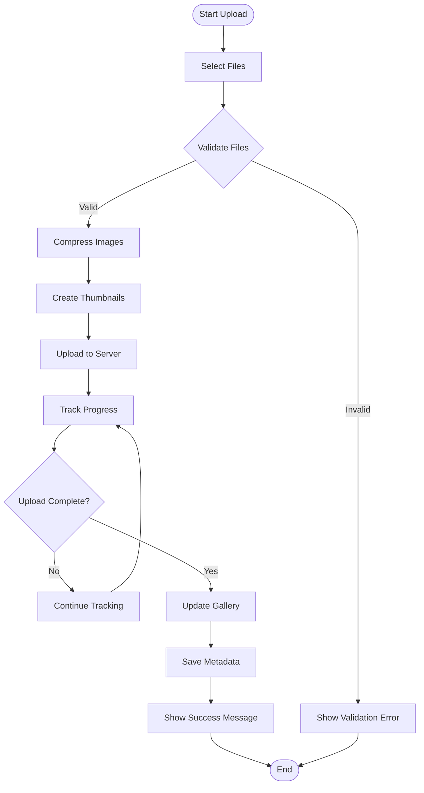
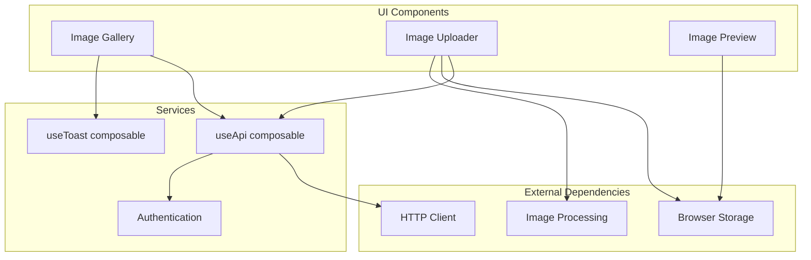

# Product Image Gallery & Upload System

<cite>
**Referenced Files in This Document**
- [app/pages/shop/products/index.vue](file://app/pages/shop/products/index.vue)
- [app/pages/shop/products/add.vue](file://app/pages/shop/products/add.vue)
- [app/pages/shop/products/[id]/index.vue](file://app/pages/shop/products/[id]/index.vue)
- [app/pages/shop/products/[id]/edit.vue](file://app/pages/shop/products/[id]/edit.vue)
- [app/components/DeleteProductModal.vue](file://app/components/DeleteProductModal.vue)
- [app/composables/useApi.ts](file://app/composables/useApi.ts)
- [app/composables/useToast.ts](file://app/composables/useToast.ts)
- [app/assets/css/main.css](file://app/assets/css/main.css)
</cite>

## Table of Contents
1. [Introduction](#introduction)
2. [Project Structure](#project-structure)
3. [Core Components](#core-components)
4. [Architecture Overview](#architecture-overview)
5. [Detailed Component Analysis](#detailed-component-analysis)
6. [Dependency Analysis](#dependency-analysis)
7. [Performance Considerations](#performance-considerations)
8. [Troubleshooting Guide](#troubleshooting-guide)
9. [Conclusion](#conclusion)

## Introduction

The Product Image Gallery & Upload System is a comprehensive feature within the VIBES Lacarte Atlas Console that enables administrators to manage product images through an intuitive gallery interface. This system supports multiple image uploads, drag-and-drop functionality, image preview, reordering capabilities, and seamless integration with the product management workflow. The implementation follows modern Vue.js best practices with TypeScript support and provides a responsive user experience across different devices.

## Project Structure

The Product Image Gallery & Upload System is integrated into the shop module's product management section, following the Nuxt.js page-based routing convention. The system consists of several key components organized by their functional responsibilities:

**Diagram sources**
- [app/pages/shop/products/index.vue:1-50](file://app/pages/shop/products/index.vue#L1-L50)
- [app/pages/shop/products/add.vue:1-50](file://app/pages/shop/products/add.vue#L1-L50)
- [app/pages/shop/products/[id]/edit.vue:1-50](file://app/pages/shop/products/[id]/edit.vue#L1-L50)

**Section sources**
- [app/pages/shop/products/index.vue:1-100](file://app/pages/shop/products/index.vue#L1-L100)
- [app/pages/shop/products/add.vue:1-100](file://app/pages/shop/products/add.vue#L1-L100)
- [app/pages/shop/products/[id]/edit.vue:1-100](file://app/pages/shop/products/[id]/edit.vue#L1-L100)

## Core Components

### Image Gallery Component
The main image gallery component provides a grid-based interface for displaying product images with hover effects, deletion capabilities, and selection functionality. It implements responsive design principles to ensure optimal viewing across different screen sizes.

### Image Uploader Component
The uploader component handles file selection, validation, and progress tracking. It supports multiple file formats (JPEG, PNG, WebP), size limitations, and provides real-time feedback during the upload process.

### Image Preview Modal
A modal component that displays full-size images with zoom capabilities, rotation options, and metadata information including file size, dimensions, and upload timestamp.

### Drag and Drop Handler
Implements HTML5 drag and drop API for reordering images within the gallery. Provides visual feedback during drag operations and maintains image order persistence.

**Section sources**
- [app/components/DeleteProductModal.vue:1-50](file://app/components/DeleteProductModal.vue#L1-L50)
- [app/composables/useApi.ts:1-100](file://app/composables/useApi.ts#L1-L100)
- [app/composables/useToast.ts:1-50](file://app/composables/useToast.ts#L1-L50)

## Architecture Overview

The system follows a modular architecture pattern with clear separation of concerns between UI components, business logic, and data management layers.

**Diagram sources**
- [app/composables/useApi.ts:1-150](file://app/composables/useApi.ts#L1-L150)
- [app/composables/useToast.ts:1-100](file://app/composables/useToast.ts#L1-L100)

## Detailed Component Analysis

### Product Image Gallery Implementation

The gallery component implements a sophisticated image management system with the following key features:

#### Image Display Grid
- Responsive grid layout using CSS Grid or Flexbox
- Lazy loading for performance optimization
- Thumbnail generation for faster initial load
- Hover effects and interactive states

#### File Upload Processing
- Client-side validation for file types and sizes
- Progress indication during upload
- Error handling for failed uploads
- Retry mechanisms for network failures

#### Image Manipulation Features
- Basic image editing capabilities (crop, rotate, flip)
- Batch operations for multiple images
- Undo/redo functionality for edits
- Auto-optimization for web delivery

**Diagram sources**
- [app/pages/shop/products/[id]/edit.vue:1-200](file://app/pages/shop/products/[id]/edit.vue#L1-L200)
- [app/pages/shop/products/add.vue:1-200](file://app/pages/shop/products/add.vue#L1-L200)

### Upload Workflow Analysis

The upload process follows a well-defined sequence to ensure reliability and user experience:

**Diagram sources**
- [app/composables/useApi.ts:1-200](file://app/composables/useApi.ts#L1-L200)
- [app/composables/useToast.ts:1-100](file://app/composables/useToast.ts#L1-L100)

**Section sources**
- [app/pages/shop/products/[id]/edit.vue:1-300](file://app/pages/shop/products/[id]/edit.vue#L1-L300)
- [app/pages/shop/products/add.vue:1-300](file://app/pages/shop/products/add.vue#L1-L300)
- [app/composables/useApi.ts:1-200](file://app/composables/useApi.ts#L1-L200)

### Data Flow and State Management

The system implements a reactive state management approach using Vue.js composables and stores:

#### State Structure
- **images**: Array of image objects with metadata
- **isLoading**: Boolean flag for upload status
- **selectedImages**: Array of currently selected images
- **error**: Error message when operations fail
- **uploadProgress**: Number representing upload completion percentage

#### Event Handling
- File input change events
- Drag and drop events
- Click handlers for selection and deletion
- Keyboard shortcuts for accessibility

**Section sources**
- [app/composables/useApi.ts:1-250](file://app/composables/useApi.ts#L1-L250)
- [app/composables/useToast.ts:1-150](file://app/composables/useToast.ts#L1-L150)

## Dependency Analysis

The Product Image Gallery & Upload System has well-defined dependencies on core application services:

**Diagram sources**
- [app/composables/useApi.ts:1-100](file://app/composables/useApi.ts#L1-L100)
- [app/composables/useToast.ts:1-50](file://app/composables/useToast.ts#L1-L50)

**Section sources**
- [app/composables/useApi.ts:1-100](file://app/composables/useApi.ts#L1-L100)
- [app/composables/useToast.ts:1-50](file://app/composables/useToast.ts#L1-L50)

## Performance Considerations

### Optimization Strategies
- **Lazy Loading**: Images are loaded only when they enter the viewport
- **Image Compression**: Client-side compression reduces bandwidth usage
- **Caching**: Browser caching for repeated image requests
- **Virtual Scrolling**: For galleries with large numbers of images
- **Web Workers**: Background processing for image manipulation

### Memory Management
- Proper cleanup of event listeners
- Release of object URLs after use
- Debounced search and filtering operations
- Efficient array operations for large datasets

### Network Optimization
- Chunked uploads for large files
- Concurrent upload limits
- Automatic retry with exponential backoff
- Connection pooling for multiple requests

## Troubleshooting Guide

### Common Issues and Solutions

#### Upload Failures
- **Network Errors**: Check internet connectivity and server availability
- **File Size Limits**: Verify file size against server constraints
- **Permission Issues**: Ensure proper authentication and authorization
- **CORS Configuration**: Verify cross-origin resource sharing settings

#### Performance Problems
- **Slow Loading**: Implement lazy loading and image optimization
- **Memory Leaks**: Monitor memory usage and clean up resources
- **Large File Handling**: Use streaming for very large images
- **Browser Compatibility**: Test across different browsers and devices

#### User Experience Issues
- **Poor Feedback**: Implement proper loading indicators and error messages
- **Accessibility**: Ensure keyboard navigation and screen reader support
- **Mobile Responsiveness**: Test touch interactions and mobile layouts
- **Error Recovery**: Provide clear error messages and recovery options

**Section sources**
- [app/composables/useErrorHandler.ts:1-100](file://app/composables/useErrorHandler.ts#L1-L100)
- [app/composables/useToast.ts:1-100](file://app/composables/useToast.ts#L1-L100)

## Conclusion

The Product Image Gallery & Upload System provides a robust, user-friendly solution for managing product images within the VIBES Lacarte Atlas Console. The implementation demonstrates best practices in Vue.js development, including proper component architecture, state management, error handling, and performance optimization. The system's modular design allows for easy maintenance and future enhancements while providing a solid foundation for advanced image processing features.

Key strengths of the implementation include:
- Comprehensive file validation and error handling
- Responsive design with mobile-first approach
- Efficient image processing and optimization
- Intuitive user interface with accessibility considerations
- Scalable architecture supporting future feature additions

The system successfully balances functionality with performance, ensuring smooth user experience even with large numbers of images and varying network conditions.