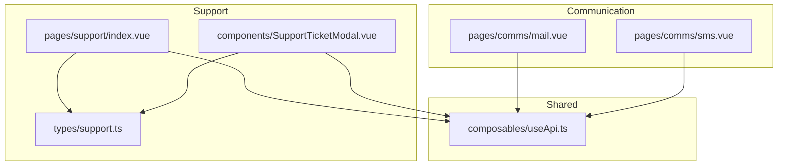
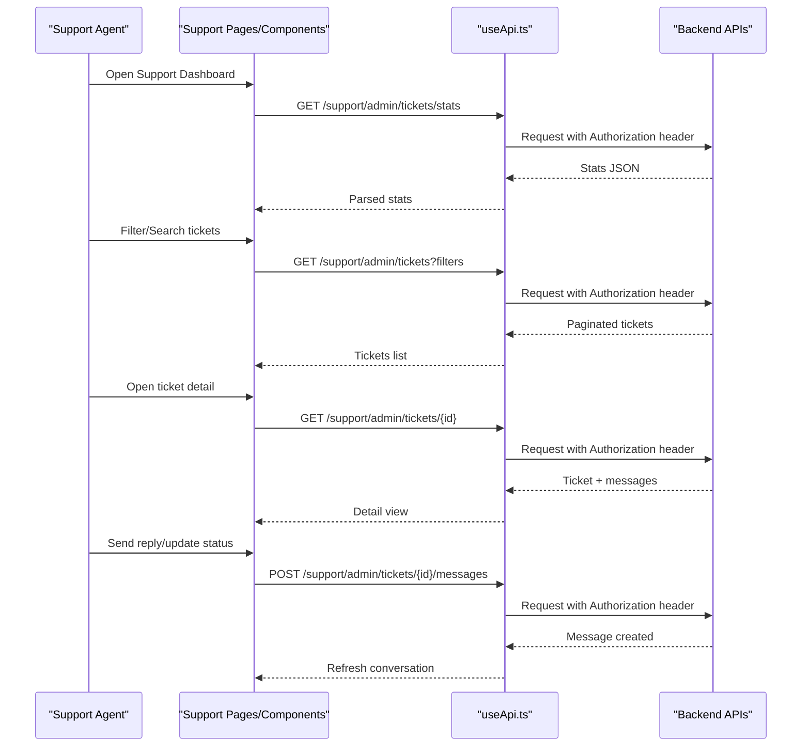
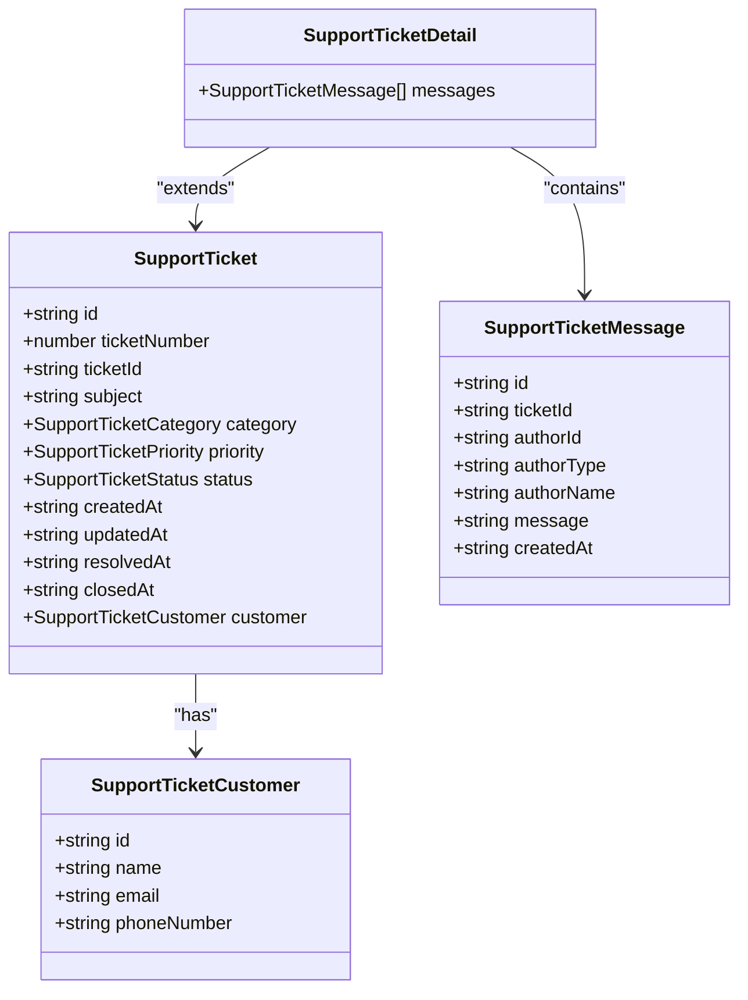
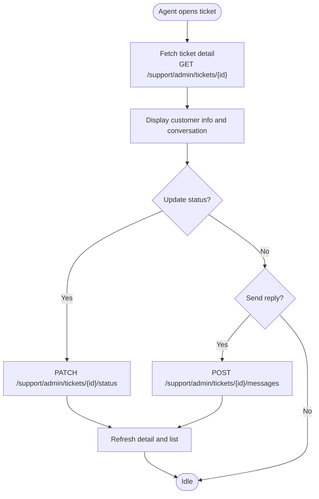
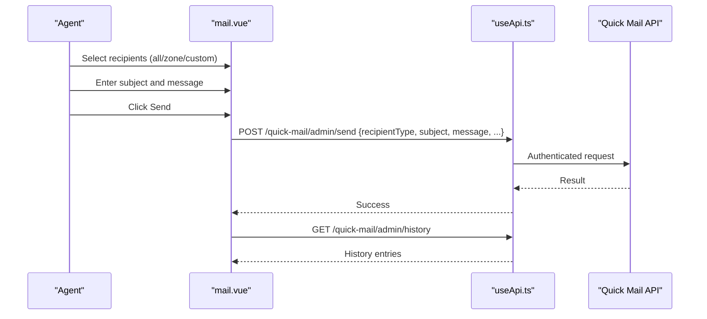
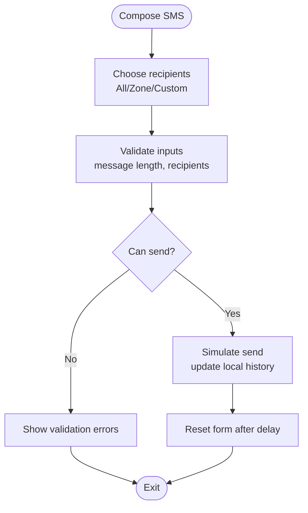
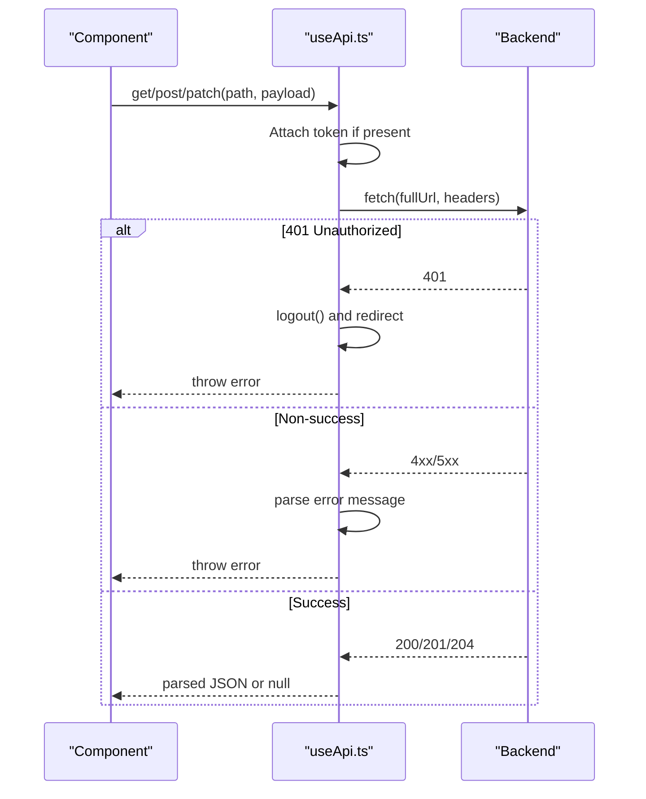
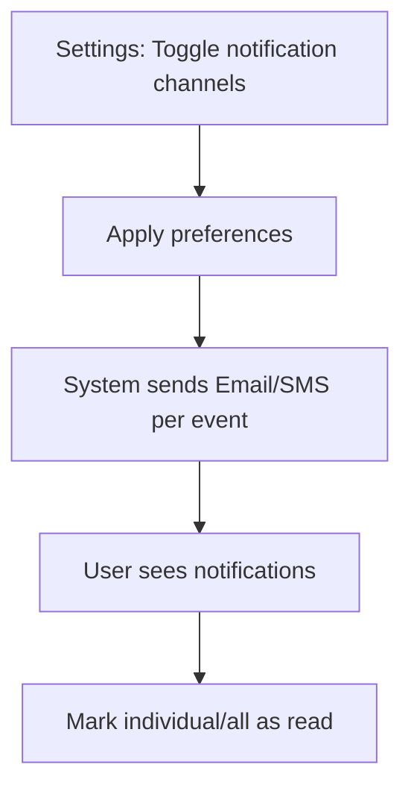
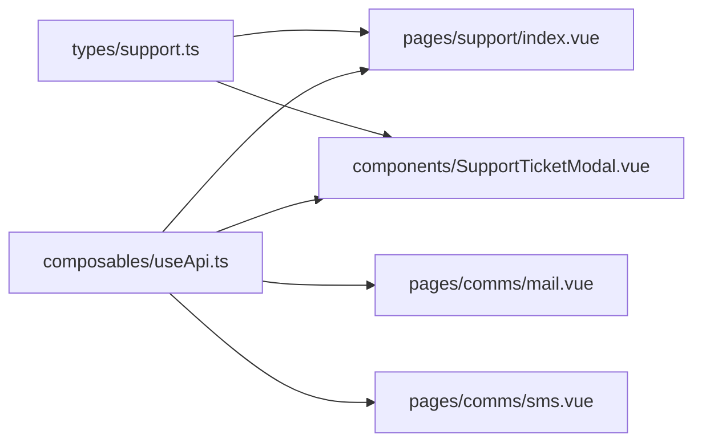

# Support & Communication

<cite>
**Referenced Files in This Document**
- [support/index.vue](file://app/pages/support/index.vue)
- [SupportTicketModal.vue](file://app/components/SupportTicketModal.vue)
- [support.ts](file://app/types/support.ts)
- [mail.vue](file://app/pages/comms/mail.vue)
- [sms.vue](file://app/pages/comms/sms.vue)
- [useApi.ts](file://app/composables/useApi.ts)
- [analytics.vue](file://app/pages/reports/analytics.vue)
- [settings/index.vue](file://app/pages/settings/index.vue)
</cite>

## Table of Contents
1. [Introduction](#introduction)
2. [Project Structure](#project-structure)
3. [Core Components](#core-components)
4. [Architecture Overview](#architecture-overview)
5. [Detailed Component Analysis](#detailed-component-analysis)
6. [Dependency Analysis](#dependency-analysis)
7. [Performance Considerations](#performance-considerations)
8. [Troubleshooting Guide](#troubleshooting-guide)
9. [Conclusion](#conclusion)
10. [Appendices](#appendices)

## Introduction
This document describes the Support and Communication systems implemented in the console application. It covers:
- Support ticket lifecycle, filtering, pagination, and detail view with conversation history
- Bulk communication channels for email and SMS with recipient targeting and history tracking
- Integration points with customer records via shared data models and API usage
- Notification system configuration and support analytics dashboards
- Best practices for customer service workflows and operational efficiency

## Project Structure
The support and communication features are primarily implemented as Nuxt pages and components that consume a typed API client. The key areas include:
- Support ticket listing and details
- Quick Mail (bulk email) compose and history
- Quick SMS (bulk SMS) compose and history
- Shared API client for authenticated requests
- Analytics and settings for notifications

**Diagram sources**
- [support/index.vue:1-120](file://app/pages/support/index.vue#L1-L120)
- [SupportTicketModal.vue:1-120](file://app/components/SupportTicketModal.vue#L1-L120)
- [support.ts:1-81](file://app/types/support.ts#L1-L81)
- [mail.vue:1-120](file://app/pages/comms/mail.vue#L1-L120)
- [sms.vue:1-120](file://app/pages/comms/sms.vue#L1-L120)
- [useApi.ts:1-91](file://app/composables/useApi.ts#L1-L91)

**Section sources**
- [support/index.vue:1-120](file://app/pages/support/index.vue#L1-L120)
- [SupportTicketModal.vue:1-120](file://app/components/SupportTicketModal.vue#L1-L120)
- [support.ts:1-81](file://app/types/support.ts#L1-L81)
- [mail.vue:1-120](file://app/pages/comms/mail.vue#L1-L120)
- [sms.vue:1-120](file://app/pages/comms/sms.vue#L1-L120)
- [useApi.ts:1-91](file://app/composables/useApi.ts#L1-L91)

## Core Components
- Support Ticket List: Provides search, filters (status, priority, category), tabs, and pagination. Displays summary metrics and opens a detail modal.
- Support Ticket Detail Modal: Shows full ticket info, customer context, conversation messages, status updates, and staff replies.
- Quick Mail: Compose bulk emails to all customers, by zone, or custom recipients; includes history view with delivery stats.
- Quick SMS: Compose bulk SMS to all customers, by zone, or custom recipients; includes character count and message credits estimation; history view with success/failure logs.
- API Client: Centralized HTTP client with authentication, error handling, and typed helpers.

**Section sources**
- [support/index.vue:82-155](file://app/pages/support/index.vue#L82-L155)
- [SupportTicketModal.vue:96-145](file://app/components/SupportTicketModal.vue#L96-L145)
- [mail.vue:219-268](file://app/pages/comms/mail.vue#L219-L268)
- [sms.vue:111-144](file://app/pages/comms/sms.vue#L111-L144)
- [useApi.ts:9-67](file://app/composables/useApi.ts#L9-L67)

## Architecture Overview
The frontend is a Vue/Nuxt SPA that calls backend endpoints through a typed API client. Authentication tokens are attached automatically. Error handling centralizes user feedback and session management.

**Diagram sources**
- [support/index.vue:82-155](file://app/pages/support/index.vue#L82-L155)
- [SupportTicketModal.vue:96-145](file://app/components/SupportTicketModal.vue#L96-L145)
- [useApi.ts:9-67](file://app/composables/useApi.ts#L9-L67)

## Detailed Component Analysis

### Support Ticket Management
- Listing and Filtering
  - Supports search by subject/customer/ticket ID
  - Filters by status, priority, and category
  - Tabs mirror common statuses: All, Open, In Progress, Resolved
  - Pagination controls page and limit
- Metrics
  - Open tickets, in-progress tickets, resolved today, average response hours
- Detail View
  - Customer information panel (name, email, phone)
  - Conversation thread with author avatars and timestamps
  - Status change dropdown and send reply action
  - Optional status update on reply submission

**Diagram sources**
- [support.ts:12-25](file://app/types/support.ts#L12-L25)
- [support.ts:60-74](file://app/types/support.ts#L60-L74)

**Section sources**
- [support/index.vue:8-155](file://app/pages/support/index.vue#L8-L155)
- [SupportTicketModal.vue:16-145](file://app/components/SupportTicketModal.vue#L16-L145)
- [support.ts:12-74](file://app/types/support.ts#L12-L74)

#### Ticket Lifecycle Flow

**Diagram sources**
- [SupportTicketModal.vue:106-145](file://app/components/SupportTicketModal.vue#L106-L145)

### Quick Mail (Bulk Email)
- Recipient Targeting
  - All Customers
  - By Zone (requires zone selection)
  - Custom (searchable customer list plus manual email entry)
- Composition
  - Subject and body fields
  - Validation ensures required fields and valid recipients
- Sending
  - Payload includes recipient type and optional zoneId or emails array
  - Success triggers history refresh and form reset after delay
- History
  - Lists past mailings with status (completed/pending/failed), recipient label, and delivery counts
  - Filters by status

**Diagram sources**
- [mail.vue:219-268](file://app/pages/comms/mail.vue#L219-L268)
- [mail.vue:196-204](file://app/pages/comms/mail.vue#L196-L204)
- [useApi.ts:9-67](file://app/composables/useApi.ts#L9-L67)

**Section sources**
- [mail.vue:34-132](file://app/pages/comms/mail.vue#L34-L132)
- [mail.vue:219-268](file://app/pages/comms/mail.vue#L219-L268)
- [mail.vue:196-208](file://app/pages/comms/mail.vue#L196-L208)

### Quick SMS (Bulk SMS)
- Recipient Targeting
  - All Customers
  - By Zone (static list used for selection)
  - Custom (searchable customer list plus manual number entry)
- Composition
  - Character counter and estimated SMS credit calculation
  - Validation ensures non-empty message and appropriate recipients
- Sending
  - Simulated send flow with local history update
- History
  - Logs with status (successful/failed), recipient label, delivered vs total

**Diagram sources**
- [sms.vue:82-144](file://app/pages/comms/sms.vue#L82-L144)

**Section sources**
- [sms.vue:16-144](file://app/pages/comms/sms.vue#L16-L144)

### API Client and Error Handling
- Adds Authorization header when available
- Normalizes success responses (200, 201, 204)
- Handles 401 by logging out and redirecting to login
- Wraps requests with error handler to show user-friendly toasts

**Diagram sources**
- [useApi.ts:9-67](file://app/composables/useApi.ts#L9-L67)

**Section sources**
- [useApi.ts:9-67](file://app/composables/useApi.ts#L9-L67)

### Notifications and Settings
- Notification preferences allow toggling email/SMS alerts for events such as new pickups, driver assignments, payments, and low inventory
- A notification modal provides read/unread filtering and mark-as-read actions

**Diagram sources**
- [settings/index.vue:350-363](file://app/pages/settings/index.vue#L350-L363)

**Section sources**
- [settings/index.vue:350-363](file://app/pages/settings/index.vue#L350-L363)

### Support Analytics
- The dashboard includes general business analytics (revenue, pickup frequency, customer growth, shop sales). While not specific to support, these metrics can be combined with support KPIs (open/in-progress/resolved counts, average response time) to evaluate overall service performance.

**Section sources**
- [analytics.vue:6-84](file://app/pages/reports/analytics.vue#L6-L84)

## Dependency Analysis
- Support pages depend on the typed support types and the API client
- Quick Mail depends on customer and zone lists and quick-mail endpoints
- Quick SMS uses local sample data for demonstration but follows similar patterns
- Shared API client centralizes auth and error handling across all modules

**Diagram sources**
- [support.ts:12-74](file://app/types/support.ts#L12-L74)
- [support/index.vue:1-120](file://app/pages/support/index.vue#L1-L120)
- [SupportTicketModal.vue:1-120](file://app/components/SupportTicketModal.vue#L1-L120)
- [mail.vue:1-120](file://app/pages/comms/mail.vue#L1-L120)
- [sms.vue:1-120](file://app/pages/comms/sms.vue#L1-L120)
- [useApi.ts:1-91](file://app/composables/useApi.ts#L1-L91)

**Section sources**
- [support.ts:12-74](file://app/types/support.ts#L12-L74)
- [support/index.vue:1-120](file://app/pages/support/index.vue#L1-L120)
- [SupportTicketModal.vue:1-120](file://app/components/SupportTicketModal.vue#L1-L120)
- [mail.vue:1-120](file://app/pages/comms/mail.vue#L1-L120)
- [sms.vue:1-120](file://app/pages/comms/sms.vue#L1-L120)
- [useApi.ts:1-91](file://app/composables/useApi.ts#L1-L91)

## Performance Considerations
- Pagination and server-side filtering reduce payload sizes for large ticket sets
- Debounce or throttling could be added to search input to avoid excessive requests
- For Quick Mail, consider lazy-loading zones and customers to improve initial load time
- Avoid unnecessary re-fetches by caching recent results where appropriate
- Keep conversation threads paginated if they grow large

[No sources needed since this section provides general guidance]

## Troubleshooting Guide
- Authentication failures
  - 401 responses trigger logout and redirect to login; ensure tokens are present and refreshed
- Network errors
  - Non-success responses display error messages via the error handler; check network connectivity and backend availability
- Quick Mail sending issues
  - Validate recipient selection and email format; confirm zone IDs exist when sending by zone
- Quick SMS composition
  - Ensure message length within limits and at least one recipient selected; verify phone number formats

**Section sources**
- [useApi.ts:39-67](file://app/composables/useApi.ts#L39-L67)
- [mail.vue:163-180](file://app/pages/comms/mail.vue#L163-L180)
- [sms.vue:68-80](file://app/pages/comms/sms.vue#L68-L80)

## Conclusion
The Support and Communication subsystems provide a cohesive experience for managing customer inquiries and broadcasting announcements. The ticket workflow supports filtering, detailed conversations, and status management. Bulk email and SMS tools enable targeted outreach with clear history tracking. Centralized API handling improves reliability and consistency across features. Integrating support KPIs with broader analytics offers actionable insights for continuous improvement.

[No sources needed since this section summarizes without analyzing specific files]

## Appendices

### Data Models Summary
- SupportTicket: core ticket attributes including identifiers, metadata, timestamps, and linked customer
- SupportTicketCustomer: contact details for the ticket owner
- SupportTicketMessage: individual conversation entries with authorship and timestamps
- SupportTicketDetail: enriched ticket including messages
- TicketStats: high-level metrics for support operations
- Pagination: standard pagination metadata

**Section sources**
- [support.ts:12-81](file://app/types/support.ts#L12-L81)

### API Endpoints Used
- Support
  - GET /support/admin/tickets/stats
  - GET /support/admin/tickets
  - GET /support/admin/tickets/{id}
  - PATCH /support/admin/tickets/{id}/status
  - POST /support/admin/tickets/{id}/messages
- Quick Mail
  - POST /quick-mail/admin/send
  - GET /quick-mail/admin/history
- Zones and Customers (for recipient selection)
  - GET /zone/admin/list
  - GET /customer/admin/list

**Section sources**
- [support/index.vue:82-155](file://app/pages/support/index.vue#L82-L155)
- [SupportTicketModal.vue:96-145](file://app/components/SupportTicketModal.vue#L96-L145)
- [mail.vue:60-68](file://app/pages/comms/mail.vue#L60-L68)
- [mail.vue:95-132](file://app/pages/comms/mail.vue#L95-L132)
- [mail.vue:196-204](file://app/pages/comms/mail.vue#L196-L204)
- [mail.vue:219-268](file://app/pages/comms/mail.vue#L219-L268)

### Customer Service Best Practices
- Prioritize urgent/high-priority tickets first
- Maintain consistent status transitions and document reasons in conversation
- Use categories to route tickets efficiently
- Provide timely replies and set expectations for resolution times
- Leverage bulk communications for proactive updates and reminders
- Monitor KPIs like open tickets, in-progress volume, resolved today, and average response hours

[No sources needed since this section provides general guidance]