# Team Administration

<cite>
**Referenced Files in This Document**
- [team.ts](file://app/types/team.ts)
- [auth.ts](file://app/utils/auth.ts)
- [usePermissions.ts](file://app/composables/usePermissions.ts)
- [PermissionGuard.vue](file://app/components/PermissionGuard.vue)
- [permissions.global.ts](file://app/middleware/permissions.global.ts)
- [auth.global.ts](file://app/middleware/auth.global.ts)
- [auth.ts (store)](file://app/stores/auth.ts)
- [index.vue (Team List)](file://app/pages/team/index.vue)
- [add.vue (Add Member)](file://app/pages/team/add.vue)
- [AddRoleModal.vue](file://app/components/AddRoleModal.vue)
- [teamValidation.ts](file://app/utils/teamValidation.ts)
- [teamTransform.ts](file://app/utils/teamTransform.ts)
- [requirements.md](file://.kiro/specs/team-management/requirements.md)
</cite>

## Update Summary
**Changes Made**
- Enhanced Team Member Deletion Flow section with parallel refresh implementation using Promise.all()
- Updated Performance Considerations to highlight Promise.all() optimization
- Added comprehensive error handling details for delete operations
- Updated API Endpoints section to include 204 No Content response handling

## Table of Contents
1. [Introduction](#introduction)
2. [Project Structure](#project-structure)
3. [Core Components](#core-components)
4. [Architecture Overview](#architecture-overview)
5. [Detailed Component Analysis](#detailed-component-analysis)
6. [Dependency Analysis](#dependency-analysis)
7. [Performance Considerations](#performance-considerations)
8. [Troubleshooting Guide](#troubleshooting-guide)
9. [Conclusion](#conclusion)
10. [Appendices](#appendices)

## Introduction
This document explains the Team Administration and Role-Based Access Control (RBAC) implementation across the application. It covers user management workflows, role configuration, permission hierarchies, team member lifecycle management, validation utilities, invitation processes, and access control mechanisms. It also details data models, permission inheritance, and security considerations for multi-user environments.

## Project Structure
The team administration feature spans types, utilities, composables, components, pages, middleware, and store modules:
- Types define core entities: TeamMember, Role, Permission, and API payloads.
- Utilities provide validation and transformation helpers.
- Composables encapsulate permission checks.
- Components include a reusable permission guard and role creation modal.
- Pages implement team list and add-member flows.
- Middleware enforces authentication and route-level permissions.
- The auth store manages session, profile fetch, and merges admin role/permissions into the user context.

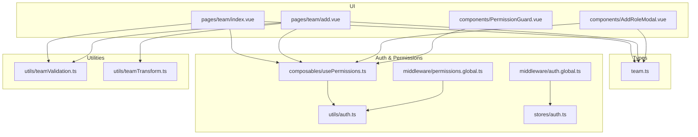

**Diagram sources**
- [team.ts:1-65](file://app/types/team.ts#L1-L65)
- [auth.ts:1-58](file://app/utils/auth.ts#L1-L58)
- [usePermissions.ts:1-43](file://app/composables/usePermissions.ts#L1-L43)
- [PermissionGuard.vue:1-38](file://app/components/PermissionGuard.vue#L1-L38)
- [permissions.global.ts:1-59](file://app/middleware/permissions.global.ts#L1-L59)
- [auth.global.ts:1-32](file://app/middleware/auth.global.ts#L1-L32)
- [auth.ts (store):1-230](file://app/stores/auth.ts#L1-L230)
- [index.vue (Team List):1-605](file://app/pages/team/index.vue#L1-L605)
- [add.vue (Add Member):1-450](file://app/pages/team/add.vue#L1-L450)
- [AddRoleModal.vue:1-287](file://app/components/AddRoleModal.vue#L1-L287)
- [teamValidation.ts:1-122](file://app/utils/teamValidation.ts#L1-L122)
- [teamTransform.ts:1-88](file://app/utils/teamTransform.ts#L1-L88)

**Section sources**
- [team.ts:1-65](file://app/types/team.ts#L1-L65)
- [auth.ts:1-58](file://app/utils/auth.ts#L1-L58)
- [usePermissions.ts:1-43](file://app/composables/usePermissions.ts#L1-L43)
- [PermissionGuard.vue:1-38](file://app/components/PermissionGuard.vue#L1-L38)
- [permissions.global.ts:1-59](file://app/middleware/permissions.global.ts#L1-L59)
- [auth.global.ts:1-32](file://app/middleware/auth.global.ts#L1-L32)
- [auth.ts (store):1-230](file://app/stores/auth.ts#L1-L230)
- [index.vue (Team List):1-605](file://app/pages/team/index.vue#L1-L605)
- [add.vue (Add Member):1-450](file://app/pages/team/add.vue#L1-L450)
- [AddRoleModal.vue:1-287](file://app/components/AddRoleModal.vue#L1-L287)
- [teamValidation.ts:1-122](file://app/utils/teamValidation.ts#L1-L122)
- [teamTransform.ts:1-88](file://app/utils/teamTransform.ts#L1-L88)

## Core Components
- Data Models: TeamMember, Role, Permission, and API payloads define the shape of team data and requests.
- Auth Helpers: Normalize roles, check admin status, extract permissions, and compare roles case-insensitively.
- Permission Composable: Provides hasPermission, hasAnyPermission, hasAllPermissions, hasRole, hasAnyRole, and isSuperAdmin.
- Permission Guard: A component that conditionally renders content based on role or permission requirements.
- Global Middleware: Enforces authentication and maps routes to required permissions.
- Auth Store: Manages token, session refresh, and merges admin profile (role + permissions) into the user object.
- Validation Utilities: Validate non-empty fields, email format, phone format, and composite forms.
- Transformation Utilities: Convert UI form data to backend payloads with trimming and normalization.

Key responsibilities:
- RBAC enforcement at route level and component level.
- Admin privilege detection and implicit full permissions for admins.
- Client-side validation and payload shaping before API calls.
- Invitation flow signaling via success messages and UX notes.

**Section sources**
- [team.ts:1-65](file://app/types/team.ts#L1-L65)
- [auth.ts:1-58](file://app/utils/auth.ts#L1-L58)
- [usePermissions.ts:1-43](file://app/composables/usePermissions.ts#L1-L43)
- [PermissionGuard.vue:1-38](file://app/components/PermissionGuard.vue#L1-L38)
- [permissions.global.ts:1-59](file://app/middleware/permissions.global.ts#L1-L59)
- [auth.ts (store):1-230](file://app/stores/auth.ts#L1-L230)
- [teamValidation.ts:1-122](file://app/utils/teamValidation.ts#L1-L122)
- [teamTransform.ts:1-88](file://app/utils/teamTransform.ts#L1-L88)

## Architecture Overview
The system combines client-side guards with global middleware and server-side authorization. Admin users implicitly have all permissions; regular users must hold explicit permissions. Route mappings enforce coarse-grained access, while PermissionGuard provides fine-grained UI control.

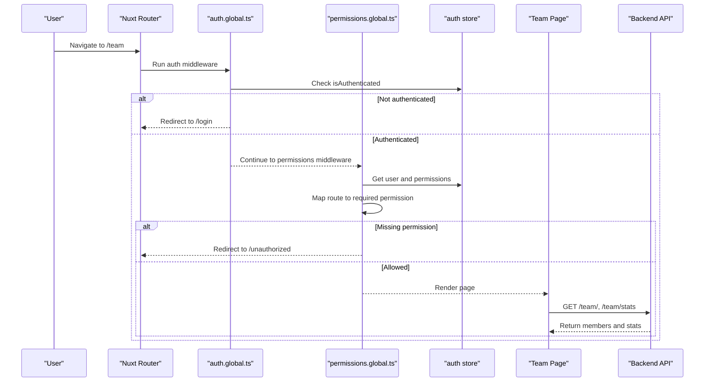

**Diagram sources**
- [auth.global.ts:1-32](file://app/middleware/auth.global.ts#L1-L32)
- [permissions.global.ts:1-59](file://app/middleware/permissions.global.ts#L1-L59)
- [auth.ts (store):1-230](file://app/stores/auth.ts#L1-L230)
- [index.vue (Team List):1-605](file://app/pages/team/index.vue#L1-L605)

## Detailed Component Analysis

### Data Models and Relationships
The team domain centers around three primary entities:
- TeamMember: Represents a person with identity, contact info, role assignment, status, and timestamps.
- Role: Encapsulates a named set of permissions with metadata.
- Permission: Describes an atomic capability grouped by module.

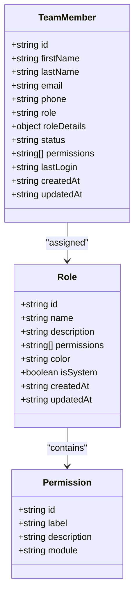

**Diagram sources**
- [team.ts:1-65](file://app/types/team.ts#L1-L65)

**Section sources**
- [team.ts:1-65](file://app/types/team.ts#L1-L65)

### Authentication and Session Management
The auth store persists tokens, maintains session expiry, periodically validates sessions, and enriches the user object with admin role and permissions from the profile endpoint.

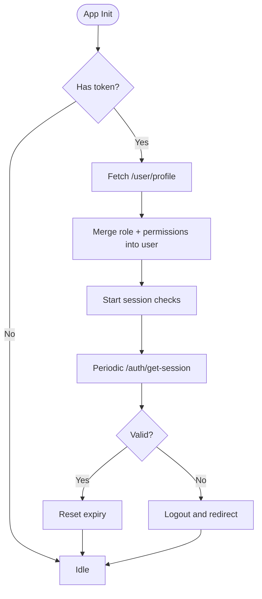

**Diagram sources**
- [auth.ts (store):1-230](file://app/stores/auth.ts#L1-L230)

**Section sources**
- [auth.ts (store):1-230](file://app/stores/auth.ts#L1-L230)

### Permission Model and Inheritance
- Admins (super admin or admin) implicitly have all permissions.
- Non-admin users must explicitly possess required permissions.
- Roles are normalized to lowercase with underscores replaced by spaces for comparison.
- Route-level mapping enforces coarse-grained access; component-level guards enable fine-grained visibility.

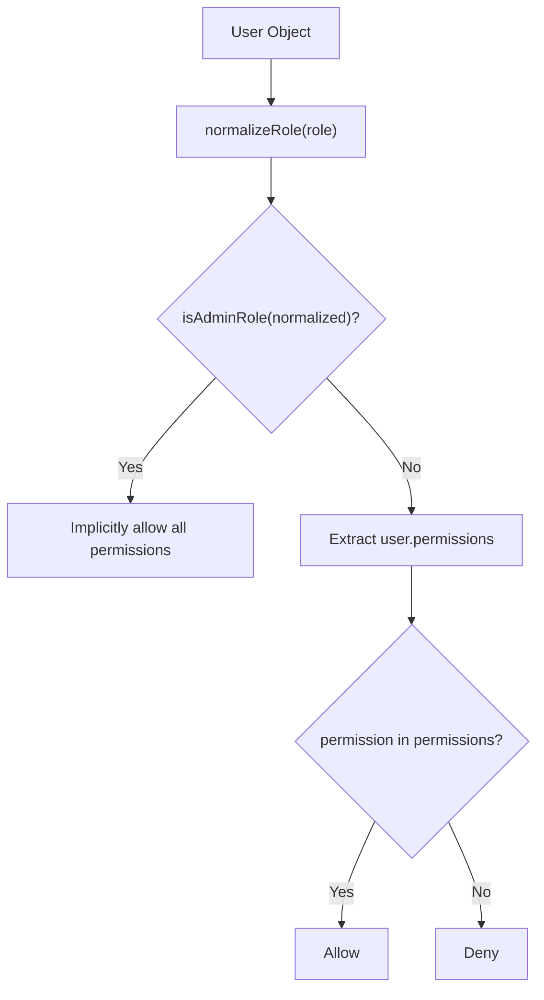

**Diagram sources**
- [auth.ts:1-58](file://app/utils/auth.ts#L1-L58)

**Section sources**
- [auth.ts:1-58](file://app/utils/auth.ts#L1-L58)
- [usePermissions.ts:1-43](file://app/composables/usePermissions.ts#L1-L43)
- [PermissionGuard.vue:1-38](file://app/components/PermissionGuard.vue#L1-L38)
- [permissions.global.ts:1-59](file://app/middleware/permissions.global.ts#L1-L59)

### Team Member Lifecycle: Add Member Flow
Adding a new team member involves authorization checks, client-side validation, payload transformation, and API submission. On success, the user is redirected and shown a success message. The invitation process is indicated in the UI.

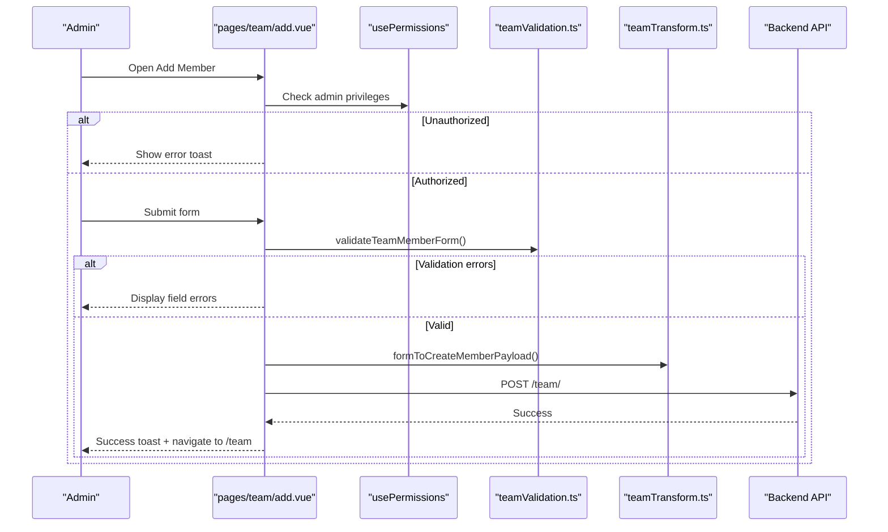

**Diagram sources**
- [add.vue (Add Member):1-450](file://app/pages/team/add.vue#L1-L450)
- [teamValidation.ts:1-122](file://app/utils/teamValidation.ts#L1-L122)
- [teamTransform.ts:1-88](file://app/utils/teamTransform.ts#L1-L88)
- [usePermissions.ts:1-43](file://app/composables/usePermissions.ts#L1-L43)

**Section sources**
- [add.vue (Add Member):1-450](file://app/pages/team/add.vue#L1-L450)
- [teamValidation.ts:1-122](file://app/utils/teamValidation.ts#L1-L122)
- [teamTransform.ts:1-88](file://app/utils/teamTransform.ts#L1-L88)
- [requirements.md:60-80](file://.kiro/specs/team-management/requirements.md#L60-L80)

### Team Member Lifecycle: Delete Member Flow
Deletion requires explicit authorization and confirmation. Upon successful deletion, the list refreshes automatically using parallel execution for optimal performance.

**Updated** Enhanced with Promise.all() for parallel refresh of both member list and stats dashboard, handling 204 No Content responses and comprehensive error handling.

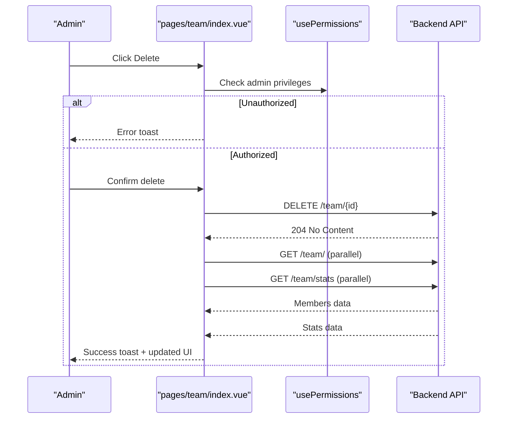

**Diagram sources**
- [index.vue (Team List):1-605](file://app/pages/team/index.vue#L1-L605)
- [usePermissions.ts:1-43](file://app/composables/usePermissions.ts#L1-L43)

**Section sources**
- [index.vue (Team List):1-605](file://app/pages/team/index.vue#L1-L605)

### Role Configuration: Create Role Flow
Creating a role involves fetching available permissions, grouping them by module, selecting a subset, and submitting a role definition.

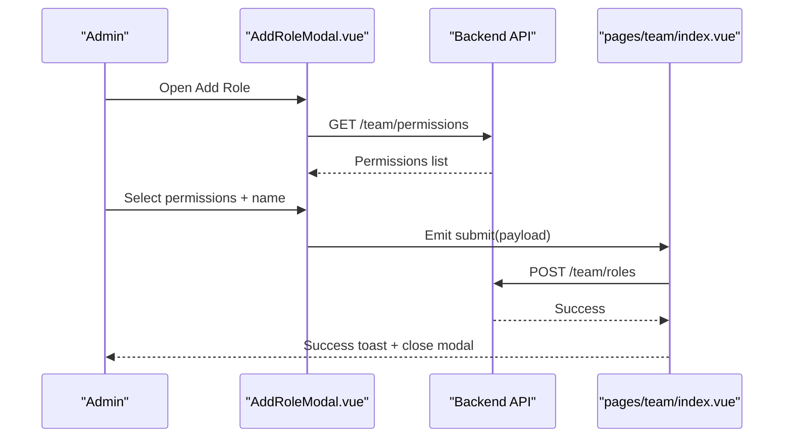

**Diagram sources**
- [AddRoleModal.vue:1-287](file://app/components/AddRoleModal.vue#L1-L287)
- [index.vue (Team List):1-605](file://app/pages/team/index.vue#L1-L605)

**Section sources**
- [AddRoleModal.vue:1-287](file://app/components/AddRoleModal.vue#L1-L287)
- [index.vue (Team List):1-605](file://app/pages/team/index.vue#L1-L605)

### Access Control Mechanisms
- Route-level: Global middleware maps routes to required permissions and redirects unauthorized users.
- Component-level: PermissionGuard evaluates role and permission requirements and conditionally renders slots.
- Store-level: Admin privileges are inferred from normalized role; permissions are merged from the profile endpoint.

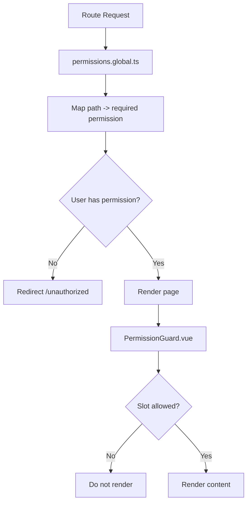

**Diagram sources**
- [permissions.global.ts:1-59](file://app/middleware/permissions.global.ts#L1-L59)
- [PermissionGuard.vue:1-38](file://app/components/PermissionGuard.vue#L1-L38)

**Section sources**
- [permissions.global.ts:1-59](file://app/middleware/permissions.global.ts#L1-L59)
- [PermissionGuard.vue:1-38](file://app/components/PermissionGuard.vue#L1-L38)

### Validation Utilities
Client-side validation ensures data integrity before submission:
- Non-empty checks for required fields.
- Email format validation using a regex pattern.
- Phone number validation ensuring digit count within acceptable range.
- Composite validation for team member and role forms.

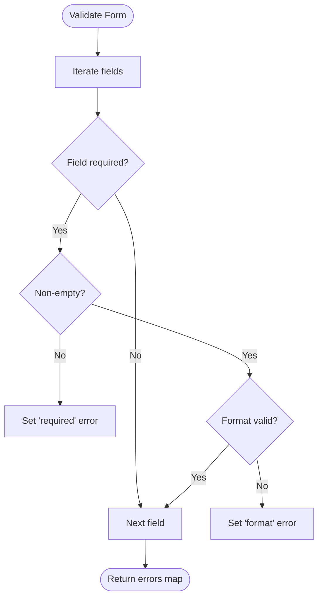

**Diagram sources**
- [teamValidation.ts:1-122](file://app/utils/teamValidation.ts#L1-L122)

**Section sources**
- [teamValidation.ts:1-122](file://app/utils/teamValidation.ts#L1-L122)

### Data Transformation Utilities
Transformation functions normalize input for the backend:
- Trim whitespace.
- Lowercase emails.
- Map UI field names to backend payload keys.
- Include only provided fields for updates.

**Section sources**
- [teamTransform.ts:1-88](file://app/utils/teamTransform.ts#L1-L88)

## Dependency Analysis
The following diagram shows key dependencies between modules involved in team administration and RBAC.

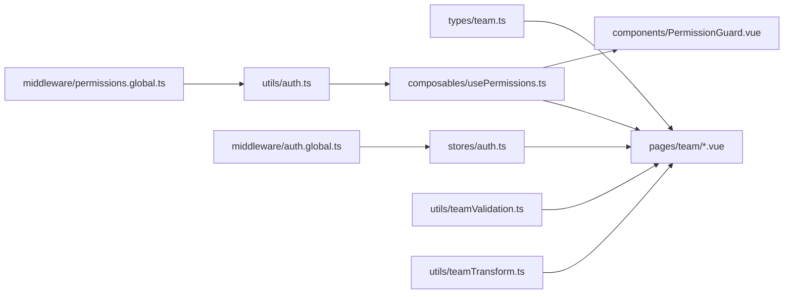

**Diagram sources**
- [team.ts:1-65](file://app/types/team.ts#L1-L65)
- [auth.ts:1-58](file://app/utils/auth.ts#L1-L58)
- [usePermissions.ts:1-43](file://app/composables/usePermissions.ts#L1-L43)
- [PermissionGuard.vue:1-38](file://app/components/PermissionGuard.vue#L1-L38)
- [permissions.global.ts:1-59](file://app/middleware/permissions.global.ts#L1-L59)
- [auth.global.ts:1-32](file://app/middleware/auth.global.ts#L1-L32)
- [auth.ts (store):1-230](file://app/stores/auth.ts#L1-L230)
- [teamValidation.ts:1-122](file://app/utils/teamValidation.ts#L1-L122)
- [teamTransform.ts:1-88](file://app/utils/teamTransform.ts#L1-L88)

**Section sources**
- [team.ts:1-65](file://app/types/team.ts#L1-L65)
- [auth.ts:1-58](file://app/utils/auth.ts#L1-L58)
- [usePermissions.ts:1-43](file://app/composables/usePermissions.ts#L1-L43)
- [PermissionGuard.vue:1-38](file://app/components/PermissionGuard.vue#L1-L38)
- [permissions.global.ts:1-59](file://app/middleware/permissions.global.ts#L1-L59)
- [auth.global.ts:1-32](file://app/middleware/auth.global.ts#L1-L32)
- [auth.ts (store):1-230](file://app/stores/auth.ts#L1-L230)
- [teamValidation.ts:1-122](file://app/utils/teamValidation.ts#L1-L122)
- [teamTransform.ts:1-88](file://app/utils/teamTransform.ts#L1-L88)

## Performance Considerations
- Minimize redundant API calls by caching roles and permissions where appropriate.
- Debounce heavy operations like filtering large member lists.
- Use skeleton loaders to improve perceived performance during initial loads.
- Avoid excessive reactivity churn by keeping derived computations minimal.
- **Enhanced**: Team member deletion now uses Promise.all() for parallel refresh of member list and stats dashboard, significantly improving performance by eliminating sequential API calls.
- **Enhanced**: Delete operations handle 204 No Content responses efficiently without unnecessary data processing.

[No sources needed since this section provides general guidance]

## Troubleshooting Guide
Common issues and resolutions:
- Unauthorized access to team pages: Ensure the user has the required permission or admin role; verify route mapping and middleware behavior.
- Duplicate email on add member: Handle 400 responses indicating duplicate email and display a specific error message.
- Invalid email or phone formats: Use validation utilities to catch and present clear field-level errors.
- Session expiration: The store periodically checks session validity and redirects to login when expired.
- **Enhanced**: Delete operation failures: Comprehensive error handling now catches network errors, permission issues, and invalid member IDs with appropriate user feedback.
- **Enhanced**: Parallel refresh issues: Promise.all() properly handles partial failures - if one refresh fails, the other continues and displays appropriate error states.

**Section sources**
- [permissions.global.ts:1-59](file://app/middleware/permissions.global.ts#L1-L59)
- [add.vue (Add Member):1-450](file://app/pages/team/add.vue#L1-L450)
- [teamValidation.ts:1-122](file://app/utils/teamValidation.ts#L1-L122)
- [auth.ts (store):1-230](file://app/stores/auth.ts#L1-L230)

## Conclusion
The team administration system implements a robust RBAC model with layered access controls: route-level middleware, component-level guards, and store-managed session and profile enrichment. Admins enjoy implicit full permissions, while regular users require explicit permissions. Robust client-side validation and transformation ensure reliable submissions, and the UI communicates invitation and security policies clearly. The recent enhancements to the deletion workflow demonstrate improved performance through parallel API calls and comprehensive error handling, providing a more responsive and reliable user experience.

[No sources needed since this section summarizes without analyzing specific files]

## Appendices

### API Endpoints Used by Team Features
- GET /team/: Retrieve team members list.
- GET /team/stats: Retrieve team statistics.
- POST /team/: Create a new team member.
- DELETE /team/{id}: Delete a team member (returns 204 No Content on success).
- GET /team/roles: Retrieve available roles.
- POST /team/roles: Create a new role.
- GET /team/permissions: Retrieve available permissions.

**Updated**: Delete endpoint now returns 204 No Content status code for successful deletions, enabling efficient parallel refresh operations.

[No sources needed since this section aggregates endpoints referenced in code paths]