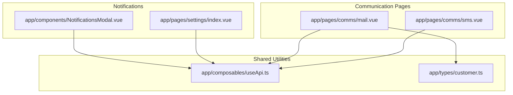
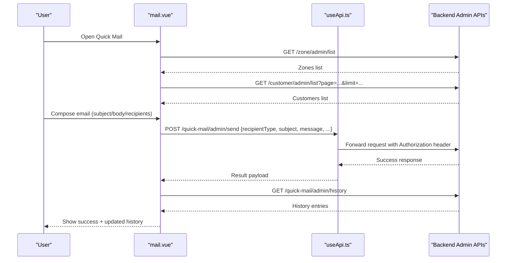
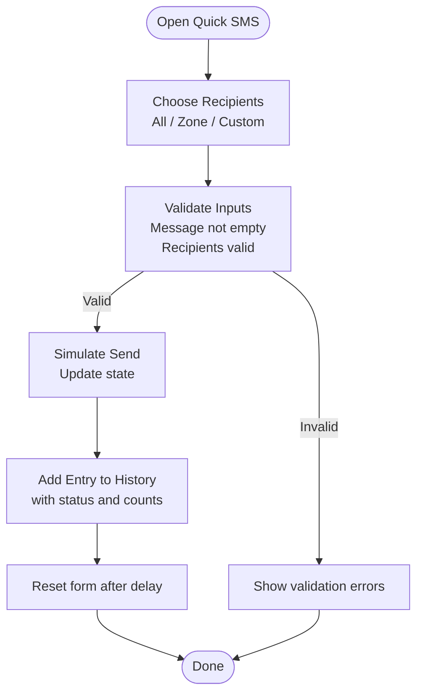
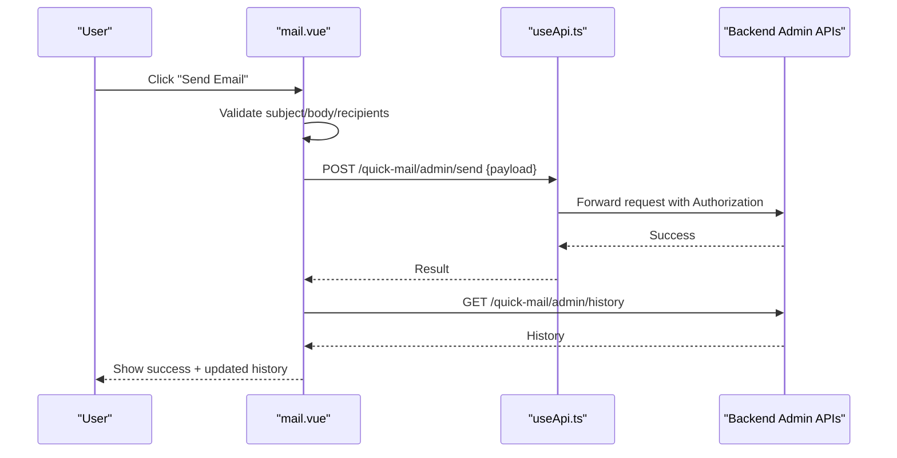
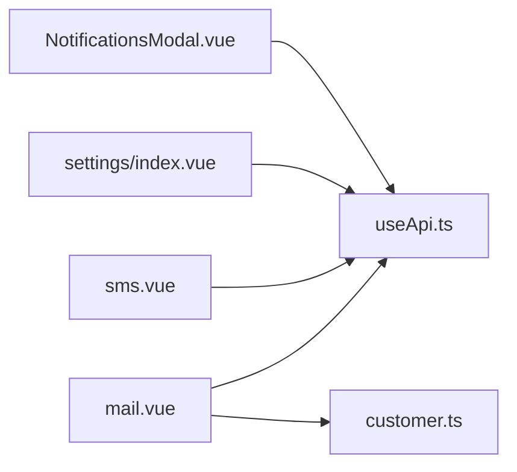

# Communication Hub

<cite>
**Referenced Files in This Document**
- [sms.vue](file://app/pages/comms/sms.vue)
- [mail.vue](file://app/pages/comms/mail.vue)
- [useApi.ts](file://app/composables/useApi.ts)
- [customer.ts](file://app/types/customer.ts)
- [NotificationsModal.vue](file://app/components/NotificationsModal.vue)
- [settings/index.vue](file://app/pages/settings/index.vue)
</cite>

## Table of Contents
1. [Introduction](#introduction)
2. [Project Structure](#project-structure)
3. [Core Components](#core-components)
4. [Architecture Overview](#architecture-overview)
5. [Detailed Component Analysis](#detailed-component-analysis)
6. [Dependency Analysis](#dependency-analysis)
7. [Performance Considerations](#performance-considerations)
8. [Troubleshooting Guide](#troubleshooting-guide)
9. [Conclusion](#conclusion)
10. [Appendices](#appendices)

## Introduction
This document describes the Communication Hub system implemented in the console application. It covers:
- SMS messaging capabilities and history tracking
- Email composition, recipient selection, and delivery status
- Notification preferences and in-app notifications
- Data models for customers, zones, and communication logs
- Practical examples for sending messages, composing emails, managing templates (conceptual), and tracking delivery
- Integration patterns with customer and pickup management systems for automated notifications

The goal is to provide both a high-level overview and code-level details so that developers and operators can understand, extend, and troubleshoot the communication features effectively.

## Project Structure
The Communication Hub is primarily implemented as two pages under the comms module, with shared API utilities and types used across the app.

**Diagram sources**
- [sms.vue:1-333](file://app/pages/comms/sms.vue#L1-L333)
- [mail.vue:1-495](file://app/pages/comms/mail.vue#L1-L495)
- [useApi.ts:1-91](file://app/composables/useApi.ts#L1-L91)
- [customer.ts:1-103](file://app/types/customer.ts#L1-L103)
- [NotificationsModal.vue:1-210](file://app/components/NotificationsModal.vue#L1-L210)
- [settings/index.vue:340-387](file://app/pages/settings/index.vue#L340-L387)

**Section sources**
- [sms.vue:1-333](file://app/pages/comms/sms.vue#L1-L333)
- [mail.vue:1-495](file://app/pages/comms/mail.vue#L1-L495)
- [useApi.ts:1-91](file://app/composables/useApi.ts#L1-L91)
- [customer.ts:1-103](file://app/types/customer.ts#L1-L103)
- [NotificationsModal.vue:1-210](file://app/components/NotificationsModal.vue#L1-L210)
- [settings/index.vue:340-387](file://app/pages/settings/index.vue#L340-L387)

## Core Components
- SMS Compose and History page
  - Supports recipients by “All Customers,” “By Zone,” or “Custom” phone numbers
  - Message length and SMS credit calculation
  - Local history with status and delivery counts
- Email Compose and History page
  - Recipients by “All Customers,” “By Zone,” or “Custom” email addresses
  - Fetches zones and customers from backend APIs
  - Sends via an admin endpoint and refreshes history
- API utility
  - Centralized HTTP client with auth headers, error handling, and typed helpers
- Customer and zone data models
  - Strongly typed interfaces for customers, zones, and related entities
- In-app notifications modal
  - Displays operational alerts and supports read/unread states
- Notification preferences
  - Toggle-based UI for enabling/disabling specific notification channels (email/SMS)

**Section sources**
- [sms.vue:1-333](file://app/pages/comms/sms.vue#L1-L333)
- [mail.vue:1-495](file://app/pages/comms/mail.vue#L1-L495)
- [useApi.ts:1-91](file://app/composables/useApi.ts#L1-L91)
- [customer.ts:1-103](file://app/types/customer.ts#L1-L103)
- [NotificationsModal.vue:1-210](file://app/components/NotificationsModal.vue#L1-L210)
- [settings/index.vue:340-387](file://app/pages/settings/index.vue#L340-L387)

## Architecture Overview
The Communication Hub integrates with existing admin endpoints for zones and customers, and provides dedicated endpoints for quick mail operations. The SMS page currently simulates sending locally; the email page posts to a server endpoint and refreshes history.

**Diagram sources**
- [mail.vue:60-87](file://app/pages/comms/mail.vue#L60-L87)
- [mail.vue:95-132](file://app/pages/comms/mail.vue#L95-L132)
- [mail.vue:196-204](file://app/pages/comms/mail.vue#L196-L204)
- [mail.vue:219-268](file://app/pages/comms/mail.vue#L219-L268)
- [useApi.ts:9-67](file://app/composables/useApi.ts#L9-L67)

## Detailed Component Analysis

### SMS Messaging (Quick SMS)
Key responsibilities:
- Recipient selection: All Customers, By Zone, Custom
- Manual number entry with validation
- Message composition with character count and SMS credit estimation
- Local history with status and delivery metrics

Data model highlights:
- SmsLog includes recipients, recipientType, message, sentAt, status, delivered, total
- Customer interface for search and manual addition

Processing logic:
- Validation ensures non-empty message and appropriate recipients based on selected type
- Sending flow simulates network delay and updates local history
- History filtering by status (all, successful, failed)

Practical example:
- To send an SMS to a zone, select “By Zone,” choose a zone, compose the message, then click “Send SMS.” The history tab will show the new entry with status and delivery counts.

**Diagram sources**
- [sms.vue:82-90](file://app/pages/comms/sms.vue#L82-L90)
- [sms.vue:111-144](file://app/pages/comms/sms.vue#L111-L144)
- [sms.vue:93-103](file://app/pages/comms/sms.vue#L93-L103)

**Section sources**
- [sms.vue:1-333](file://app/pages/comms/sms.vue#L1-L333)

### Email Messaging (Quick Mail)
Key responsibilities:
- Fetch zones and customers for recipient selection
- Compose email with subject and body
- Send via admin endpoint and refresh history
- Filter history by status (completed, pending, failed)

Data model highlights:
- MailLog includes subject, message, recipientType, zoneId, zoneName, customEmails, recipientCount, deliveredCount, failedCount, status, sentBy, senderName, createdAt
- Zone interface includes id, name, customerCount, etc.
- Customer interface includes id, name, email

Processing logic:
- On mount, fetch zones and customers concurrently; fetch history separately
- Build payload based on recipientType (all, zone, custom)
- Post to /quick-mail/admin/send; on success, update sent flag and refresh history
- Display history with status badges and delivery metrics

Practical example:
- To send an email to all customers, select “All Customers,” enter subject and body, then click “Send Email.” After success, the history tab shows the new entry with status and counts.

**Diagram sources**
- [mail.vue:219-268](file://app/pages/comms/mail.vue#L219-L268)
- [mail.vue:196-204](file://app/pages/comms/mail.vue#L196-L204)
- [useApi.ts:9-67](file://app/composables/useApi.ts#L9-L67)

**Section sources**
- [mail.vue:1-495](file://app/pages/comms/mail.vue#L1-L495)
- [useApi.ts:1-91](file://app/composables/useApi.ts#L1-L91)

### API Utility (useApi)
Responsibilities:
- Attach Authorization header when available
- Normalize responses and handle 401 by logging out and redirecting
- Provide typed helpers get/post/put/patch/del with error wrapping
- Log request/response metadata for debugging

Integration points:
- Used by Quick Mail to call zone, customer, and quick-mail endpoints
- Can be reused by Quick SMS if integrated with backend later

**Section sources**
- [useApi.ts:1-91](file://app/composables/useApi.ts#L1-L91)

### Data Models (Customer and Related Types)
Highlights:
- Customer includes user info, zone assignment, location, and timestamps
- Pickup history entry includes driver, disposable item type, estimated quantity
- Paginated response envelope for history lists

Usage in Communication Hub:
- Quick Mail maps backend customer fields to local Customer interface for search and selection
- Zones are fetched and displayed with customer counts to guide recipient targeting

**Section sources**
- [customer.ts:1-103](file://app/types/customer.ts#L1-L103)
- [mail.vue:89-132](file://app/pages/comms/mail.vue#L89-L132)

### In-App Notifications Modal
Features:
- List of notifications with icons, titles, messages, and timestamps
- Unread indicators and mark-as-read functionality
- Dismiss individual items and mark all as read

Integration notes:
- Currently uses local mock data; can be extended to consume real-time events or polling endpoints

**Section sources**
- [NotificationsModal.vue:1-210](file://app/components/NotificationsModal.vue#L1-L210)

### Notification Preferences (Settings)
Features:
- Toggles for email and SMS notifications for key events (new pickup, driver assigned, payment received, low inventory)
- Save changes button to persist preferences

Integration notes:
- These toggles define which automated notifications should be triggered by backend workflows

**Section sources**
- [settings/index.vue:340-387](file://app/pages/settings/index.vue#L340-L387)

## Dependency Analysis
High-level dependencies:
- Quick Mail depends on useApi for HTTP calls and on customer/zone data models
- Quick SMS currently operates locally but can integrate with useApi for future backend connectivity
- Settings and Notifications Modal are independent UI components that may drive backend behavior through other flows

**Diagram sources**
- [mail.vue:60-87](file://app/pages/comms/mail.vue#L60-L87)
- [mail.vue:95-132](file://app/pages/comms/mail.vue#L95-L132)
- [sms.vue:1-333](file://app/pages/comms/sms.vue#L1-L333)
- [useApi.ts:1-91](file://app/composables/useApi.ts#L1-L91)
- [customer.ts:1-103](file://app/types/customer.ts#L1-L103)
- [settings/index.vue:340-387](file://app/pages/settings/index.vue#L340-L387)
- [NotificationsModal.vue:1-210](file://app/components/NotificationsModal.vue#L1-L210)

**Section sources**
- [mail.vue:1-495](file://app/pages/comms/mail.vue#L1-L495)
- [sms.vue:1-333](file://app/pages/comms/sms.vue#L1-L333)
- [useApi.ts:1-91](file://app/composables/useApi.ts#L1-L91)
- [customer.ts:1-103](file://app/types/customer.ts#L1-L103)
- [settings/index.vue:340-387](file://app/pages/settings/index.vue#L340-L387)
- [NotificationsModal.vue:1-210](file://app/components/NotificationsModal.vue#L1-L210)

## Performance Considerations
- Pagination for customers: Quick Mail paginates up to 10 pages (max 1000 customers). Consider virtualization or infinite scroll for large lists.
- Concurrency: Fetching zones and customers concurrently reduces initial load time.
- Client-side filtering: Search and filter operations run in-memory; ensure indexes or debounced input for very large datasets.
- Error handling: useApi centralizes error handling; leverage it consistently to avoid repeated try/catch blocks.

[No sources needed since this section provides general guidance]

## Troubleshooting Guide
Common issues and resolutions:
- 401 Unauthorized: useApi automatically logs out and redirects to login. Ensure tokens are present and valid.
- Failed requests: useApi wraps errors and throws descriptive messages; check browser console logs for path, status, and detail.
- Empty history: Verify backend endpoints return expected structures; Quick Mail normalizes arrays from various response shapes.
- Invalid recipients: Ensure phone/email formats pass validation before sending.

Operational tips:
- Use the history filters to isolate failures and investigate delivery counts.
- For Quick Mail, inspect the payload logged before posting to confirm recipient selection and content.

**Section sources**
- [useApi.ts:39-67](file://app/composables/useApi.ts#L39-L67)
- [mail.vue:196-204](file://app/pages/comms/mail.vue#L196-L204)
- [mail.vue:219-268](file://app/pages/comms/mail.vue#L219-L268)
- [sms.vue:82-90](file://app/pages/comms/sms.vue#L82-L90)

## Conclusion
The Communication Hub provides practical tools for bulk SMS and email outreach, robust recipient management, and clear delivery tracking. While SMS currently simulates sending, the email flow integrates with backend admin endpoints and offers comprehensive history. With strong typing and centralized API utilities, the system is well-positioned for further enhancements such as template management, advanced analytics, and deeper integration with customer and pickup management systems.

[No sources needed since this section summarizes without analyzing specific files]

## Appendices

### Practical Examples

- Sending an SMS
  - Select “By Zone” or “Custom,” add recipients, compose message, and click “Send SMS.”
  - Observe the history tab for status and delivery counts.

- Composing an Email
  - Select “All Customers,” “By Zone,” or “Custom,” fill subject and body, then click “Send Email.”
  - Refresh history to see the new entry and its status.

- Managing Message Templates (Conceptual)
  - Define reusable templates with placeholders for dynamic fields (e.g., customer name, pickup date).
  - Store templates centrally and render them before sending.
  - Version templates to track changes and support rollback.

- Tracking Delivery Status
  - Use history filters to view completed, pending, or failed messages.
  - Inspect delivered vs. total counts to identify partial failures.

- Formatting Messages
  - Keep SMS within standard limits; the SMS page estimates credits based on character count.
  - For emails, structure content clearly with concise subjects and readable bodies.

- Recipient Management
  - Prefer “By Zone” for broad campaigns; use “Custom” for targeted outreach.
  - Validate inputs to prevent duplicates and invalid formats.

- Integration Patterns
  - Trigger automated notifications based on events (new pickup, driver assigned, payment received, low inventory) using toggles in settings.
  - Leverage customer and zone data models to enrich message content and targeting.

[No sources needed since this section provides conceptual guidance]