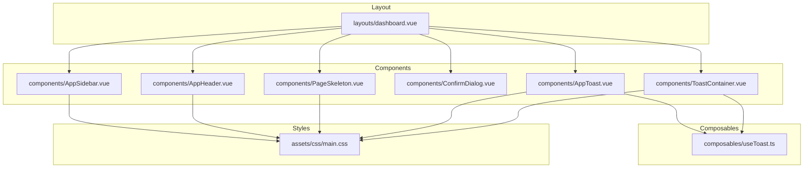
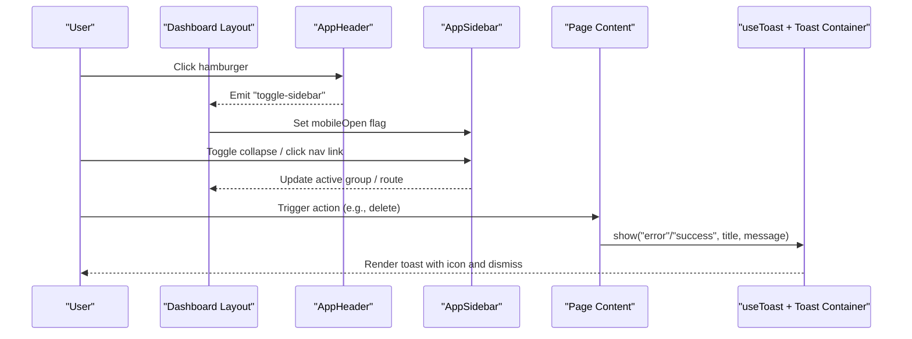
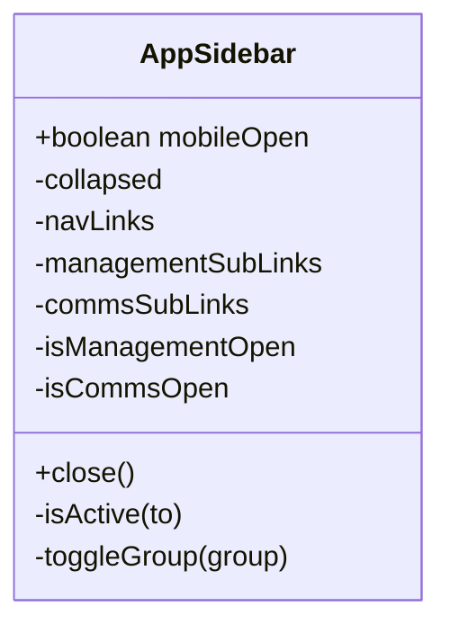
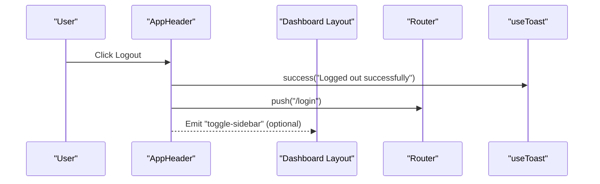
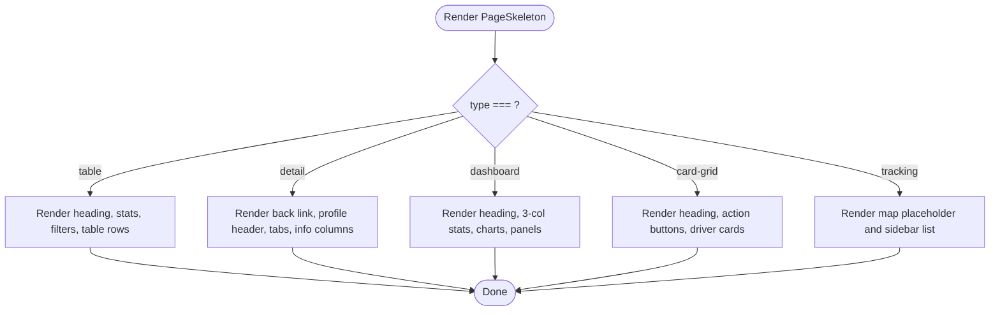
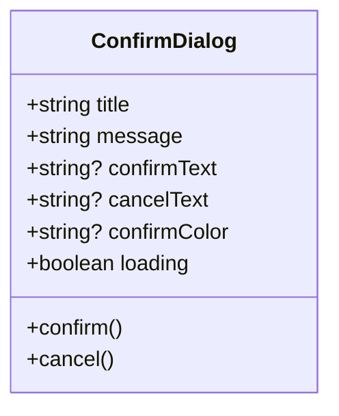
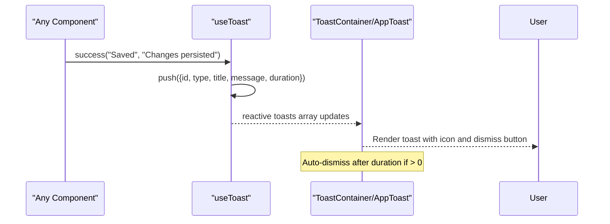
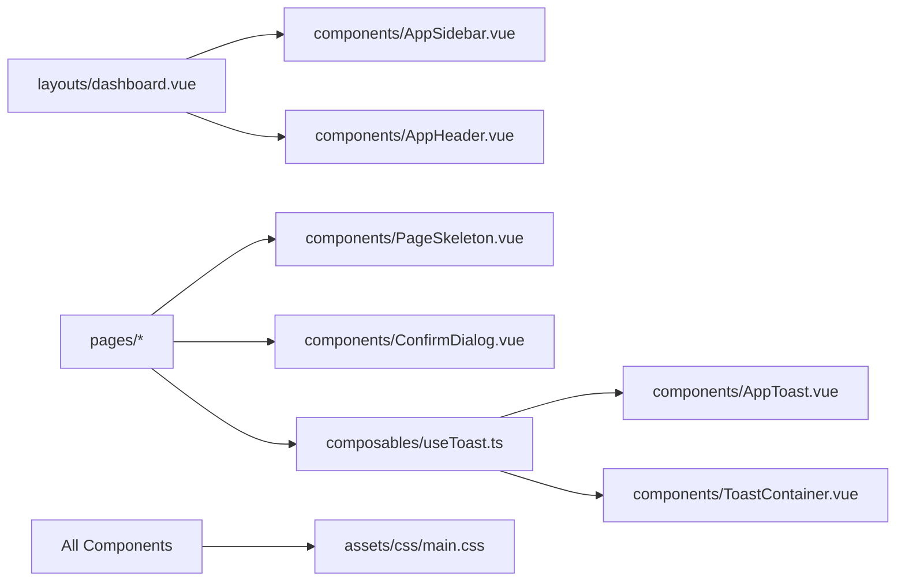

# Core UI Components

<cite>
**Referenced Files in This Document**
- [AppSidebar.vue](file://app/components/AppSidebar.vue)
- [AppHeader.vue](file://app/components/AppHeader.vue)
- [PageSkeleton.vue](file://app/components/PageSkeleton.vue)
- [ConfirmDialog.vue](file://app/components/ConfirmDialog.vue)
- [AppToast.vue](file://app/components/AppToast.vue)
- [ToastContainer.vue](file://app/components/ToastContainer.vue)
- [useToast.ts](file://app/composables/useToast.ts)
- [dashboard.vue](file://app/layouts/dashboard.vue)
- [main.css](file://app/assets/css/main.css)
</cite>

## Table of Contents
1. [Introduction](#introduction)
2. [Project Structure](#project-structure)
3. [Core Components](#core-components)
4. [Architecture Overview](#architecture-overview)
5. [Detailed Component Analysis](#detailed-component-analysis)
6. [Dependency Analysis](#dependency-analysis)
7. [Performance Considerations](#performance-considerations)
8. [Troubleshooting Guide](#troubleshooting-guide)
9. [Conclusion](#conclusion)
10. [Appendices](#appendices)

## Introduction
This document describes the core UI component library used across the application. It focuses on reusable building blocks that provide a consistent user experience: responsive sidebar navigation, application header with search and user controls, page skeleton loading states, confirmation dialogs, and toast notifications. For each component, you will find props, events, slots (if any), customization options, usage patterns, accessibility considerations, styling approach, integration guidelines, performance tips, browser compatibility notes, and extension points.

## Project Structure
The components are organized under app/components and rely on shared composables for state management (toasts). Layouts compose these components to form the application shell. Global styles define typography, color tokens, skeleton animations, and responsive utilities.

**Diagram sources**
- [dashboard.vue:1-25](file://app/layouts/dashboard.vue#L1-L25)
- [AppSidebar.vue:1-319](file://app/components/AppSidebar.vue#L1-L319)
- [AppHeader.vue:1-94](file://app/components/AppHeader.vue#L1-L94)
- [PageSkeleton.vue:1-300](file://app/components/PageSkeleton.vue#L1-L300)
- [ConfirmDialog.vue:1-53](file://app/components/ConfirmDialog.vue#L1-L53)
- [AppToast.vue:1-115](file://app/components/AppToast.vue#L1-L115)
- [ToastContainer.vue:1-120](file://app/components/ToastContainer.vue#L1-L120)
- [useToast.ts:1-37](file://app/composables/useToast.ts#L1-L37)
- [main.css:1-206](file://app/assets/css/main.css#L1-L206)

**Section sources**
- [dashboard.vue:1-25](file://app/layouts/dashboard.vue#L1-L25)
- [main.css:1-206](file://app/assets/css/main.css#L1-L206)

## Core Components
- Responsive Sidebar Navigation: Collapsible desktop sidebar with permission-based links and mobile slide-in behavior.
- Application Header: Top bar with hamburger toggle, global search input, and user controls including logout.
- Page Skeleton Loading States: Predefined skeleton layouts for table, detail, dashboard, card-grid, and tracking pages.
- Confirmation Dialog: Generic modal for destructive or important confirmations with optional loading state.
- Toast Notification System: Global notification system with multiple visual variants and auto-dismiss.

**Section sources**
- [AppSidebar.vue:1-319](file://app/components/AppSidebar.vue#L1-L319)
- [AppHeader.vue:1-94](file://app/components/AppHeader.vue#L1-L94)
- [PageSkeleton.vue:1-300](file://app/components/PageSkeleton.vue#L1-L300)
- [ConfirmDialog.vue:1-53](file://app/components/ConfirmDialog.vue#L1-L53)
- [AppToast.vue:1-115](file://app/components/AppToast.vue#L1-L115)
- [ToastContainer.vue:1-120](file://app/components/ToastContainer.vue#L1-L120)
- [useToast.ts:1-37](file://app/composables/useToast.ts#L1-L37)

## Architecture Overview
The layout composes the sidebar and header, while pages render skeletons during initial load. The toast system is driven by a composable and rendered via two alternative containers. Styles are centralized in a single CSS file providing skeleton animations and responsive grids.

**Diagram sources**
- [dashboard.vue:1-25](file://app/layouts/dashboard.vue#L1-L25)
- [AppHeader.vue:1-94](file://app/components/AppHeader.vue#L1-L94)
- [AppSidebar.vue:1-319](file://app/components/AppSidebar.vue#L1-L319)
- [useToast.ts:1-37](file://app/composables/useToast.ts#L1-L37)
- [ToastContainer.vue:1-120](file://app/components/ToastContainer.vue#L1-L120)

## Detailed Component Analysis

### AppSidebar
A responsive, collapsible sidebar with permission-aware navigation and grouped sections. On mobile, it slides in from the left with a backdrop overlay.

- Props
  - mobileOpen: boolean — Controls open/close state on mobile.
- Events
  - close: void — Emitted when closing the mobile sidebar (e.g., tapping backdrop).
- Behavior
  - Collapses/expands width and toggles visibility of labels and groups.
  - Filters top-level and grouped links based on permissions.
  - Tracks active route and expands relevant groups automatically.
  - Displays user initials and name/email in footer; collapses to avatar-only view.
- Styling
  - Inline styles for layout and transitions; uses icons and brand colors.
  - Mobile behavior controlled by CSS classes defined in main.css.
- Accessibility
  - Uses semantic aside/nav elements.
  - Provides titles for collapsed items and buttons.
  - Ensure focus management is handled by parent layout when opening/closing.
- Customization
  - Add/remove links by editing the computed navigation arrays.
  - Extend groups similarly to existing Management and Communications sections.
- Usage example path
  - See layout composition and prop binding in [dashboard.vue:1-25](file://app/layouts/dashboard.vue#L1-L25).

**Section sources**
- [AppSidebar.vue:1-319](file://app/components/AppSidebar.vue#L1-L319)
- [dashboard.vue:1-25](file://app/layouts/dashboard.vue#L1-L25)
- [main.css:160-197](file://app/assets/css/main.css#L160-L197)

#### Class Diagram

**Diagram sources**
- [AppSidebar.vue:1-319](file://app/components/AppSidebar.vue#L1-L319)

### AppHeader
Top application bar with a mobile hamburger button, global search input, and user controls. Emits an event to toggle the sidebar on mobile.

- Props
  - None (internal state only).
- Events
  - toggle-sidebar: void — Emitted to open/close the mobile sidebar.
- Behavior
  - Renders a search input bound to local state.
  - Provides a logout flow that triggers a success toast and navigates to login.
- Styling
  - Inline styles for layout and interactions; responsive rules in main.css hide/show elements at breakpoints.
- Accessibility
  - Buttons have descriptive titles and keyboard support.
  - Search input has placeholder text and accessible focus states.
- Customization
  - Replace or extend the right-side actions (notifications, profile menu).
- Usage example path
  - Event binding in [dashboard.vue:1-25](file://app/layouts/dashboard.vue#L1-L25).

**Section sources**
- [AppHeader.vue:1-94](file://app/components/AppHeader.vue#L1-L94)
- [dashboard.vue:1-25](file://app/layouts/dashboard.vue#L1-L25)
- [main.css:199-206](file://app/assets/css/main.css#L199-L206)

#### Sequence Diagram

**Diagram sources**
- [AppHeader.vue:1-94](file://app/components/AppHeader.vue#L1-L94)
- [useToast.ts:1-37](file://app/composables/useToast.ts#L1-L37)

### PageSkeleton
Reusable full-page loading placeholders for common page shapes.

- Props
  - type: 'table' | 'detail' | 'dashboard' | 'card-grid' | 'tracking'
  - rows?: number — Number of table rows (default 6).
  - cards?: number — Number of stat cards (default 4).
- Slots
  - None.
- Behavior
  - Renders skeleton blocks matching the selected layout shape.
  - Uses shimmer animation defined globally.
- Styling
  - Relies on .skeleton class and grid utilities from main.css.
- Accessibility
  - Use v-if to conditionally render real content after data loads; consider aria-busy="true" on the container while loading.
- Customization
  - Add new types by extending the template branches and adding corresponding CSS if needed.
- Usage example path
  - Example usage in a page: [customers/index.vue:175-175](file://app/pages/customers/index.vue#L175-L175).

**Section sources**
- [PageSkeleton.vue:1-300](file://app/components/PageSkeleton.vue#L1-L300)
- [main.css:18-36](file://app/assets/css/main.css#L18-L36)
- [customers/index.vue:175-175](file://app/pages/customers/index.vue#L175-L175)

#### Flowchart

**Diagram sources**
- [PageSkeleton.vue:24-296](file://app/components/PageSkeleton.vue#L24-L296)

### ConfirmDialog
Generic confirmation modal with customizable text and optional loading indicator.

- Props
  - title: string
  - message: string
  - confirmText?: string
  - cancelText?: string
  - confirmColor?: string
  - loading?: boolean
- Events
  - confirm: void
  - cancel: void
- Behavior
  - Dismisses on backdrop click.
  - Disables buttons while loading.
- Styling
  - Inline styles for layout and colors; supports custom confirm color.
- Accessibility
  - Centered modal with clear headings and actionable buttons.
  - Ensure focus trapping and Escape key handling are implemented by the parent when integrating.
- Customization
  - Override button text and colors via props.
- Usage example path
  - See similar modal patterns in [DeleteConfirmModal.vue:1-38](file://app/components/DeleteConfirmModal.vue#L1-L38).

**Section sources**
- [ConfirmDialog.vue:1-53](file://app/components/ConfirmDialog.vue#L1-L53)
- [DeleteConfirmModal.vue:1-38](file://app/components/DeleteConfirmModal.vue#L1-L38)

#### Class Diagram

**Diagram sources**
- [ConfirmDialog.vue:1-53](file://app/components/ConfirmDialog.vue#L1-L53)

### Toast Notification System
Two rendering implementations share the same composable state. Choose one container per app.

- Composable API (useToast)
  - Types: ToastType = 'success' | 'error' | 'warning' | 'info'
  - Interface: Toast { id, type, title, message?, duration? }
  - Methods:
    - success(title, message?, duration?)
    - error(title, message?, duration?)
    - warning(title, message?, duration?)
    - info(title, message?, duration?)
    - dismiss(id)
- AppToast.vue
  - Renders toasts fixed at top-right with animated entrance.
  - Maps types to icons and color palettes.
- ToastContainer.vue
  - Teleports to body and renders toasts fixed at bottom-right with progress bars and spring-like transitions.
- Integration
  - Import useToast in any component and call methods to display messages.
  - Include either AppToast or ToastContainer once in your layout.
- Styling
  - Both use inline styles and scoped CSS for transitions and animations.
- Accessibility
  - Provide role="alert" and aria-live="assertive" on the container for screen readers.
  - Ensure dismiss buttons are keyboard accessible.
- Customization
  - Extend ToastType and update icon/color mappings in the chosen container.
  - Adjust durations and positioning via props/styles.

**Section sources**
- [useToast.ts:1-37](file://app/composables/useToast.ts#L1-L37)
- [AppToast.vue:1-115](file://app/components/AppToast.vue#L1-L115)
- [ToastContainer.vue:1-120](file://app/components/ToastContainer.vue#L1-L120)

#### Sequence Diagram

**Diagram sources**
- [useToast.ts:14-36](file://app/composables/useToast.ts#L14-L36)
- [ToastContainer.vue:18-96](file://app/components/ToastContainer.vue#L18-L96)
- [AppToast.vue:25-84](file://app/components/AppToast.vue#L25-L84)

## Dependency Analysis
High-level dependencies between components and shared modules:

**Diagram sources**
- [dashboard.vue:1-25](file://app/layouts/dashboard.vue#L1-L25)
- [AppSidebar.vue:1-319](file://app/components/AppSidebar.vue#L1-L319)
- [AppHeader.vue:1-94](file://app/components/AppHeader.vue#L1-L94)
- [PageSkeleton.vue:1-300](file://app/components/PageSkeleton.vue#L1-L300)
- [ConfirmDialog.vue:1-53](file://app/components/ConfirmDialog.vue#L1-L53)
- [useToast.ts:1-37](file://app/composables/useToast.ts#L1-L37)
- [AppToast.vue:1-115](file://app/components/AppToast.vue#L1-L115)
- [ToastContainer.vue:1-120](file://app/components/ToastContainer.vue#L1-L120)
- [main.css:1-206](file://app/assets/css/main.css#L1-L206)

**Section sources**
- [dashboard.vue:1-25](file://app/layouts/dashboard.vue#L1-L25)
- [main.css:1-206](file://app/assets/css/main.css#L1-L206)

## Performance Considerations
- Prefer lightweight skeletons for initial load to improve perceived performance.
- Avoid heavy computations inside sidebar navigation; keep link lists static or memoized.
- Debounce search inputs in headers to reduce re-renders.
- Use TransitionGroup efficiently; avoid unnecessary reflows by keeping toast containers minimal.
- Keep inline styles minimal and reuse CSS variables where possible.

[No sources needed since this section provides general guidance]

## Troubleshooting Guide
- Sidebar not closing on mobile
  - Ensure the layout emits and listens to the close event and toggles the mobileOpen flag.
  - Verify CSS classes for mobile overlay are applied correctly.
- Toast not appearing
  - Confirm the toast container is mounted once in the layout.
  - Check that the composable is imported and methods are called with correct arguments.
- Skeleton not animating
  - Ensure the global .skeleton class and keyframes are present in main.css.
- Confirmation dialog not dismissing
  - Verify @click.self handler and emitted cancel event are wired in the parent.

**Section sources**
- [dashboard.vue:1-25](file://app/layouts/dashboard.vue#L1-L25)
- [AppToast.vue:1-115](file://app/components/AppToast.vue#L1-L115)
- [ToastContainer.vue:1-120](file://app/components/ToastContainer.vue#L1-L120)
- [useToast.ts:1-37](file://app/composables/useToast.ts#L1-L37)
- [main.css:18-36](file://app/assets/css/main.css#L18-L36)

## Conclusion
The core UI components provide a cohesive foundation for the application’s interface. They emphasize responsiveness, clarity, and extensibility. By following the integration and customization guidelines, teams can maintain consistency while adapting to evolving requirements.

[No sources needed since this section summarizes without analyzing specific files]

## Appendices

### Styling Approach and Tailwind CSS
- Current implementation primarily uses inline styles and a small set of utility classes defined in main.css.
- If adopting Tailwind CSS, replace inline styles with utility classes and centralize design tokens in Tailwind configuration.
- Maintain consistent spacing, radii, and shadows using Tailwind’s scale.

[No sources needed since this section doesn't analyze specific files]

### Browser Compatibility
- Modern browsers supported by Nuxt/Vue ecosystem.
- Animations and transitions rely on standard CSS features widely supported.
- Teleport requires modern DOM APIs; ensure polyfills if targeting legacy environments.

[No sources needed since this section doesn't analyze specific files]

### Extension Points
- Sidebar: Add new groups and links with permission checks.
- Header: Integrate notifications dropdown or additional actions.
- Skeleton: Introduce new page templates by extending the type union and template branches.
- ConfirmDialog: Add variant props (size, icon, slot content).
- Toast: Add new types and visuals by updating the composable and container mappings.

[No sources needed since this section doesn't analyze specific files]