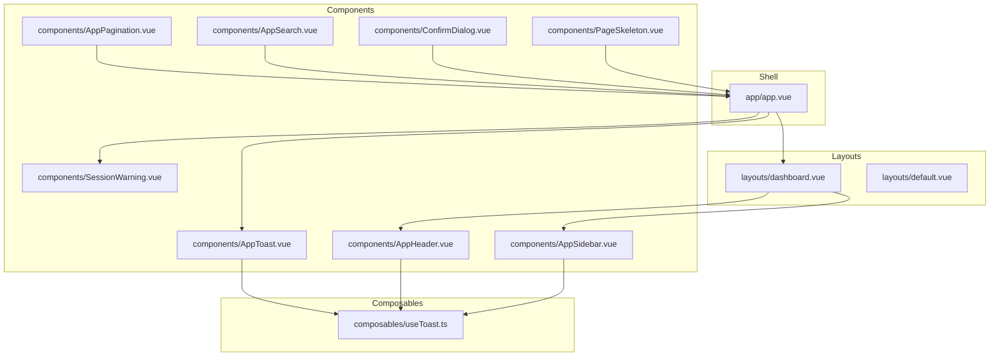
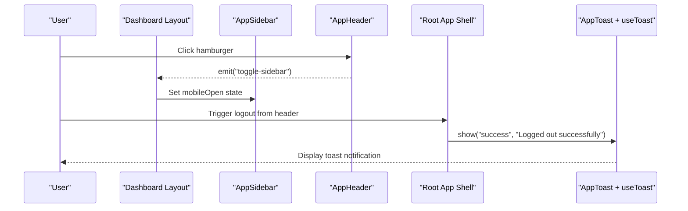
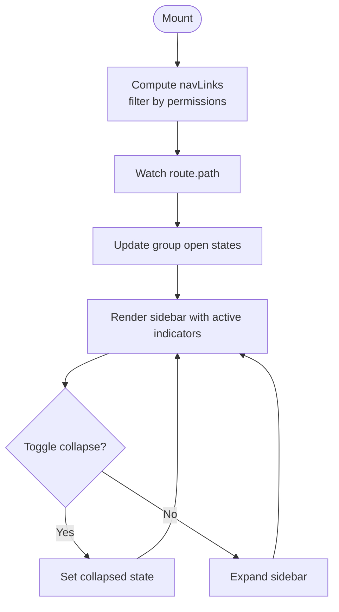
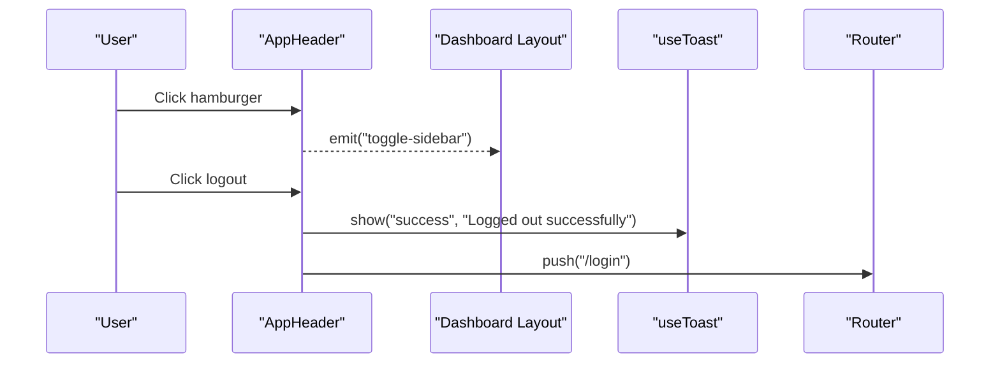
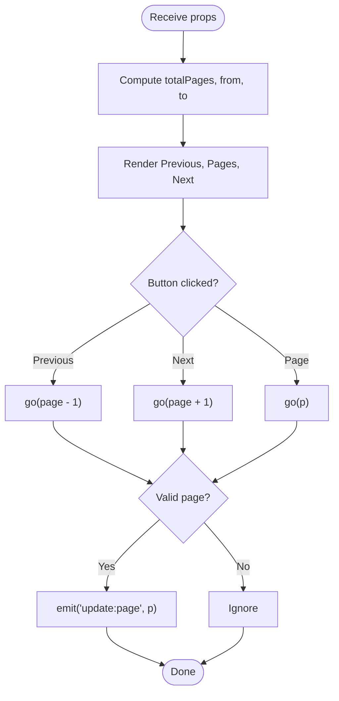
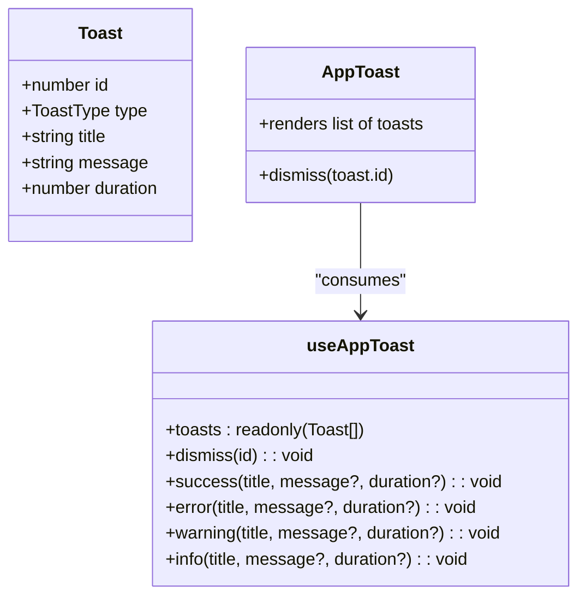
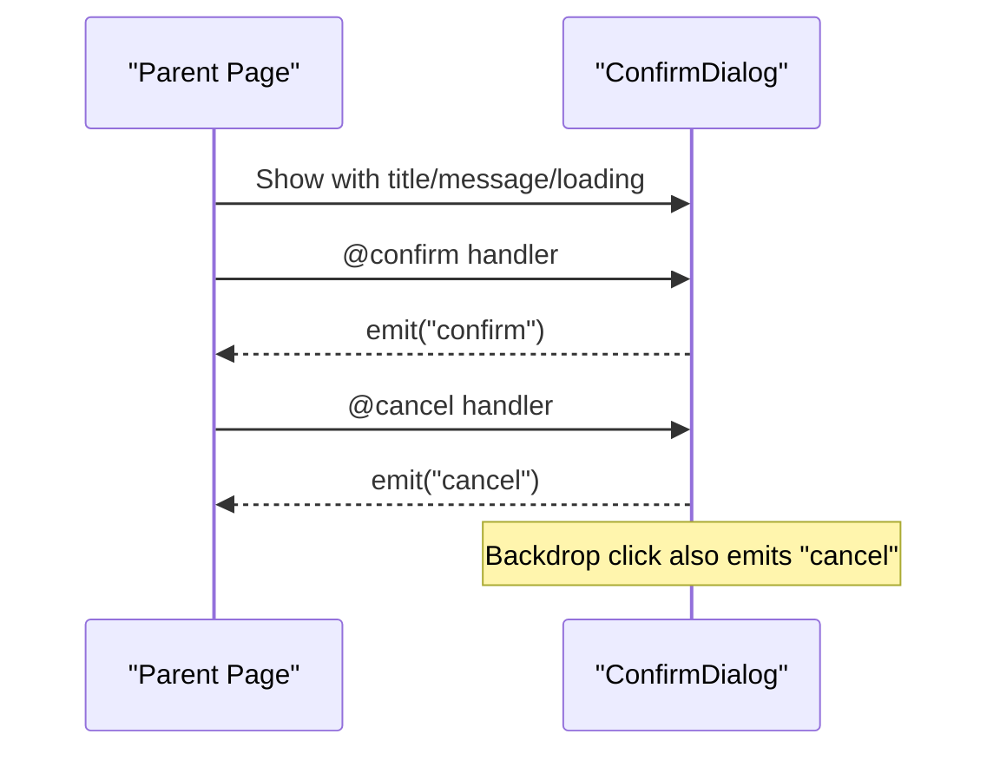
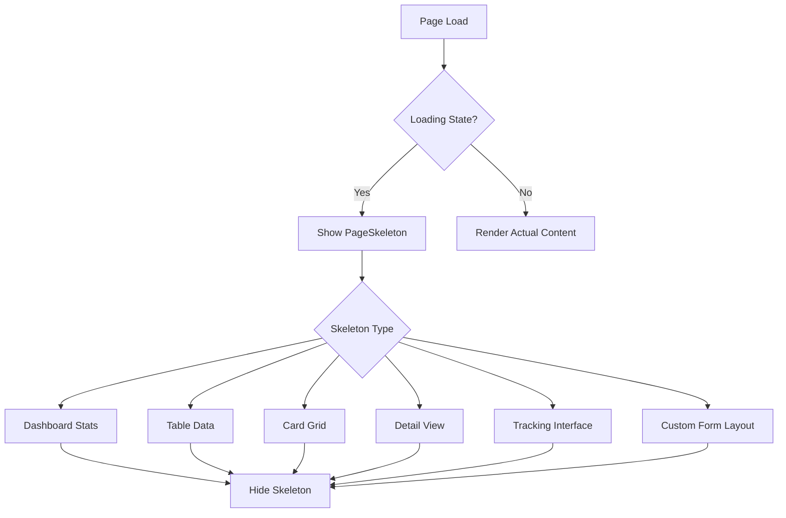
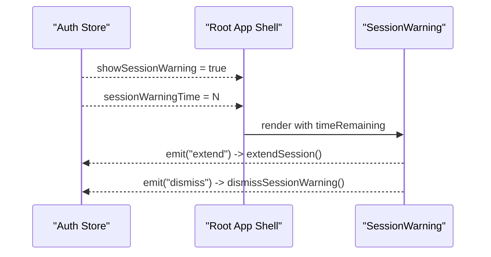
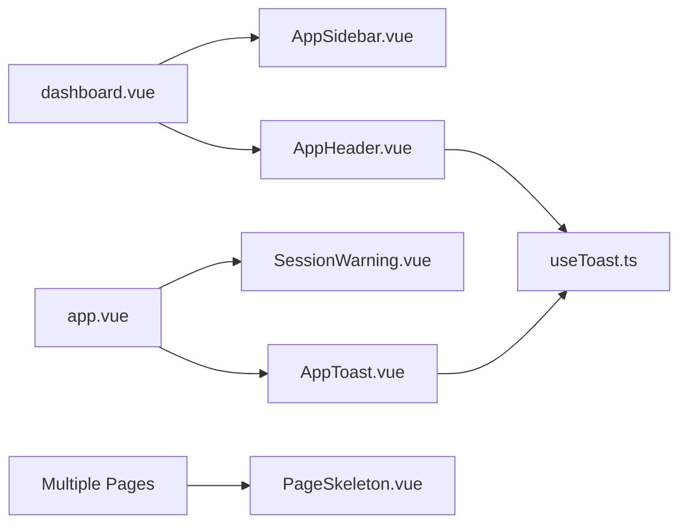

# Core UI Components

<cite>
**Referenced Files in This Document**
- [AppSidebar.vue](file://app/components/AppSidebar.vue)
- [AppHeader.vue](file://app/components/AppHeader.vue)
- [AppPagination.vue](file://app/components/AppPagination.vue)
- [AppSearch.vue](file://app/components/AppSearch.vue)
- [AppToast.vue](file://app/components/AppToast.vue)
- [ConfirmDialog.vue](file://app/components/ConfirmDialog.vue)
- [PageSkeleton.vue](file://app/components/PageSkeleton.vue)
- [SessionWarning.vue](file://app/components/SessionWarning.vue)
- [useToast.ts](file://app/composables/useToast.ts)
- [dashboard.vue](file://app/layouts/dashboard.vue)
- [default.vue](file://app/layouts/default.vue)
- [app.vue](file://app/app.vue)
- [index.vue](file://app/pages/index.vue)
- [inventory/index.vue](file://app/pages/inventory/index.vue)
- [shop/orders/index.vue](file://app/pages/shop/orders/index.vue)
- [support/index.vue](file://app/pages/support/index.vue)
- [drivers/index.vue](file://app/pages/drivers/index.vue)
- [trucks/index.vue](file://app/pages/trucks/index.vue)
- [team/[id]/edit.vue](file://app/pages/team/[id]/edit.vue)
</cite>

## Update Summary
**Changes Made**
- Updated PageSkeleton component documentation to reflect comprehensive implementation across major application pages
- Added detailed usage examples from dashboard, inventory, orders, support tickets, drivers, trucks, and team member edit page
- Enhanced skeleton layout patterns with custom form structures matching actual page layouts
- Expanded component integration patterns showing real-world usage scenarios

## Table of Contents
1. Introduction
2. Project Structure
3. Core Components
4. Architecture Overview
5. Detailed Component Analysis
6. Dependency Analysis
7. Performance Considerations
8. Troubleshooting Guide
9. Conclusion

## Introduction
This document describes the core UI components library used across the application. It covers reusable building blocks for navigation, header and user controls, pagination, search, toast notifications, confirmation dialogs, page skeletons, and session warnings. For each component, you will find props, events, slots (if any), customization options, usage patterns, responsive behavior, accessibility notes, and integration examples with other components.

**Updated** The PageSkeleton component has been comprehensively implemented across all major application pages with custom skeleton layouts that match their respective form structures and data presentations.

## Project Structure
The UI components are organized under app/components and integrated via Nuxt layouts and the root app shell. The dashboard layout composes AppSidebar and AppHeader around page content. The root app mounts global overlays like SessionWarning and AppToast.

**Diagram sources**
- [dashboard.vue:1-25](file://app/layouts/dashboard.vue#L1-L25)
- [default.vue:1-6](file://app/layouts/default.vue#L1-L6)
- [app.vue:1-33](file://app/app.vue#L1-L33)
- [AppSidebar.vue:1-319](file://app/components/AppSidebar.vue#L1-L319)
- [AppHeader.vue:1-94](file://app/components/AppHeader.vue#L1-L94)
- [AppPagination.vue:1-48](file://app/components/AppPagination.vue#L1-L48)
- [AppSearch.vue:1-25](file://app/components/AppSearch.vue#L1-L25)
- [AppToast.vue:1-115](file://app/components/AppToast.vue#L1-L115)
- [ConfirmDialog.vue:1-53](file://app/components/ConfirmDialog.vue#L1-L53)
- [PageSkeleton.vue:1-300](file://app/components/PageSkeleton.vue#L1-L300)
- [SessionWarning.vue:1-66](file://app/components/SessionWarning.vue#L1-L66)
- [useToast.ts:1-37](file://app/composables/useToast.ts#L1-L37)

**Section sources**
- [dashboard.vue:1-25](file://app/layouts/dashboard.vue#L1-L25)
- [default.vue:1-6](file://app/layouts/default.vue#L1-L6)
- [app.vue:1-33](file://app/app.vue#L1-L33)

## Core Components
Below is a concise overview of each component's purpose, props, events, slots, and key behaviors.

- AppSidebar
  - Purpose: Collapsible navigation with permission-based visibility and grouped sections.
  - Props: mobileOpen (boolean).
  - Events: close.
  - Slots: none.
  - Customization: Navigation items are defined internally; expand by editing the computed link lists.
  - Behavior: Collapses to icon-only width on small screens; toggles groups based on route path.

- AppHeader
  - Purpose: Top bar with hamburger toggle, global search input, and user menu area.
  - Props: none.
  - Events: toggle-sidebar.
  - Slots: none.
  - Customization: Replace or extend the user menu and actions.
  - Behavior: Emits toggle-sidebar to control sidebar on mobile.

- AppPagination
  - Purpose: Numeric pagination with range info and prev/next buttons.
  - Props: page (number), total (number), perPage (number, optional).
  - Events: update:page.
  - Slots: none.
  - Customization: Style via CSS variables or wrapper classes.
  - Behavior: Computes totalPages and visible range; emits new page index.

- AppSearch
  - Purpose: Reusable text input with leading search icon and v-model binding.
  - Props: placeholder (string, optional).
  - Events: none (uses defineModel).
  - Slots: none.
  - Customization: Extend with clear button or debounce logic at the consumer.
  - Behavior: Two-way binding via v-model.

- AppToast
  - Purpose: Global toast overlay driven by useAppToast composable.
  - Props: none.
  - Events: none.
  - Slots: none.
  - Customization: Modify colors/icons in the component or extend types in the composable.
  - Behavior: Auto-dismiss after duration; supports success/error/warning/info.

- ConfirmDialog
  - Purpose: Modal dialog for destructive or important confirmations.
  - Props: title (string), message (string), confirmText (string, optional), cancelText (string, optional), confirmColor (string, optional), loading (boolean).
  - Events: confirm, cancel.
  - Slots: none.
  - Customization: Override button styles and colors via props.
  - Behavior: Dismissed on backdrop click; shows spinner when loading.

- PageSkeleton
  - Purpose: Full-page loading placeholders for different page shapes with comprehensive implementation across major application pages.
  - Props: type ('table' | 'detail' | 'dashboard' | 'card-grid' | 'tracking'), rows (number, default 6), cards (number, default 4).
  - Events: none.
  - Slots: none.
  - Customization: Add new skeleton variants by extending the prop union and template branches.
  - Behavior: Renders structured placeholders matching real page layouts including dashboard statistics, table data, detail views, card grids, and tracking interfaces.

- SessionWarning
  - Purpose: Warning banner indicating imminent session expiration.
  - Props: timeRemaining (number, seconds).
  - Events: extend, dismiss.
  - Slots: none.
  - Customization: Adjust styling and copy as needed.
  - Behavior: Displays formatted countdown and action buttons.

**Section sources**
- [AppSidebar.vue:1-319](file://app/components/AppSidebar.vue#L1-L319)
- [AppHeader.vue:1-94](file://app/components/AppHeader.vue#L1-L94)
- [AppPagination.vue:1-48](file://app/components/AppPagination.vue#L1-L48)
- [AppSearch.vue:1-25](file://app/components/AppSearch.vue#L1-L25)
- [AppToast.vue:1-115](file://app/components/AppToast.vue#L1-L115)
- [ConfirmDialog.vue:1-53](file://app/components/ConfirmDialog.vue#L1-L53)
- [PageSkeleton.vue:1-300](file://app/components/PageSkeleton.vue#L1-L300)
- [SessionWarning.vue:1-66](file://app/components/SessionWarning.vue#L1-L66)
- [useToast.ts:1-37](file://app/composables/useToast.ts#L1-L37)

## Architecture Overview
The layout orchestrates the shell and global overlays. The dashboard layout composes the sidebar and header, while the root app mounts SessionWarning and AppToast globally. Toasts are managed centrally via a composable.

**Diagram sources**
- [dashboard.vue:1-25](file://app/layouts/dashboard.vue#L1-L25)
- [AppHeader.vue:1-94](file://app/components/AppHeader.vue#L1-L94)
- [AppSidebar.vue:1-319](file://app/components/AppSidebar.vue#L1-L319)
- [app.vue:1-33](file://app/app.vue#L1-L33)
- [AppToast.vue:1-115](file://app/components/AppToast.vue#L1-L115)
- [useToast.ts:1-37](file://app/composables/useToast.ts#L1-L37)

## Detailed Component Analysis

### AppSidebar
- Responsibilities
  - Render navigation links filtered by permissions.
  - Support collapsible mode and grouped sections (Management, Communications).
  - Highlight active routes and manage group open states based on current path.
  - Show user initials and name/email in footer.
- Props
  - mobileOpen: boolean — controls mobile overlay visibility.
- Events
  - close: emitted to collapse sidebar on mobile.
- Data Flow
  - Uses route and auth store to compute active state and user info.
  - Uses permissions utility to filter visible links.
- Responsive Design
  - Collapses to narrow width; hides labels and centers icons.
  - Mobile overlay controlled by parent layout.
- Accessibility
  - Provides titles for collapsed items.
  - Use semantic nav element and keyboard-friendly links.
- Integration
  - Controlled by dashboard layout via mobileOpen and close event.

**Diagram sources**
- [AppSidebar.vue:1-319](file://app/components/AppSidebar.vue#L1-L319)

**Section sources**
- [AppSidebar.vue:1-319](file://app/components/AppSidebar.vue#L1-L319)
- [dashboard.vue:1-25](file://app/layouts/dashboard.vue#L1-L25)

### AppHeader
- Responsibilities
  - Provide hamburger button to toggle sidebar on mobile.
  - Host global search input and user info/logout actions.
- Props
  - None.
- Events
  - toggle-sidebar: emitted to parent layout.
- Data Flow
  - Calls logout flow using auth store and shows a success toast before redirecting.
- Responsive Design
  - Hamburger visible on mobile; search input adapts to container width.
- Accessibility
  - Buttons have titles and icons; ensure focus styles are visible.
- Integration
  - Parent layout listens for toggle-sidebar to control sidebar visibility.

**Diagram sources**
- [AppHeader.vue:1-94](file://app/components/AppHeader.vue#L1-L94)
- [dashboard.vue:1-25](file://app/layouts/dashboard.vue#L1-L25)
- [useToast.ts:1-37](file://app/composables/useToast.ts#L1-L37)

**Section sources**
- [AppHeader.vue:1-94](file://app/components/AppHeader.vue#L1-L94)
- [dashboard.vue:1-25](file://app/layouts/dashboard.vue#L1-L25)

### AppPagination
- Responsibilities
  - Display current range and numeric page buttons.
  - Emit updated page index to parent.
- Props
  - page: number
  - total: number
  - perPage?: number
- Events
  - update:page: number
- Logic
  - Computes totalPages, from/to indices, and guards invalid transitions.
- Usage Pattern
  - Bind :page and @update:page to local reactive state.
- Accessibility
  - Buttons should include aria-labels describing page numbers.

**Diagram sources**
- [AppPagination.vue:1-48](file://app/components/AppPagination.vue#L1-L48)

**Section sources**
- [AppPagination.vue:1-48](file://app/components/AppPagination.vue#L1-L48)

### AppSearch
- Responsibilities
  - Provide a styled search input with leading icon and two-way binding.
- Props
  - placeholder?: string
- Model Binding
  - defineModel<string> for v-model support.
- Usage Pattern
  - <AppSearch v-model="query" placeholder="Search..." />
- Accessibility
  - Ensure associated label or aria-label is provided by the consumer.

**Section sources**
- [AppSearch.vue:1-25](file://app/components/AppSearch.vue#L1-L25)

### AppToast and useToast
- Responsibilities
  - Centralized toast management and rendering.
- Composable API
  - Types: ToastType = 'success' | 'error' | 'warning' | 'info'.
  - Interface: { id, type, title, message?, duration? }.
  - Functions:
    - success(title, message?, duration?)
    - error(title, message?, duration?)
    - warning(title, message?, duration?)
    - info(title, message?, duration?)
    - dismiss(id)
    - toasts: readonly array
- Rendering
  - AppToast reads toasts and renders them with animations and dismiss buttons.
- Integration Examples
  - In header logout: show success toast then navigate.
  - In pages: call useAppToast() to display feedback after mutations.

**Diagram sources**
- [useToast.ts:1-37](file://app/composables/useToast.ts#L1-L37)
- [AppToast.vue:1-115](file://app/components/AppToast.vue#L1-L115)

**Section sources**
- [useToast.ts:1-37](file://app/composables/useToast.ts#L1-L37)
- [AppToast.vue:1-115](file://app/components/AppToast.vue#L1-L115)
- [AppHeader.vue:1-94](file://app/components/AppHeader.vue#L1-L94)

### ConfirmDialog
- Responsibilities
  - Present a modal with title, message, and customizable confirm/cancel actions.
- Props
  - title: string
  - message: string
  - confirmText?: string
  - cancelText?: string
  - confirmColor?: string
  - loading: boolean
- Events
  - confirm
  - cancel
- Behavior
  - Backdrop click triggers cancel.
  - Loading state disables buttons and shows spinner.
- Usage Pattern
  - Control visibility with a local boolean and bind props/events accordingly.

**Diagram sources**
- [ConfirmDialog.vue:1-53](file://app/components/ConfirmDialog.vue#L1-L53)

**Section sources**
- [ConfirmDialog.vue:1-53](file://app/components/ConfirmDialog.vue#L1-L53)

### PageSkeleton
- Responsibilities
  - Provide full-page loading placeholders for multiple page templates with comprehensive implementation across major application pages.
- Props
  - type: 'table' | 'detail' | 'dashboard' | 'card-grid' | 'tracking'
  - rows?: number (default 6)
  - cards?: number (default 4)
- Usage Pattern
  - <PageSkeleton v-if="loading" type="table" :rows="8" :cards="0" />
- Extensibility
  - Add new skeleton types by extending the prop union and adding a template branch.

**Updated** The PageSkeleton component is now comprehensively implemented across all major application pages with custom skeleton layouts that match their specific form structures and data presentations:

#### Dashboard Skeleton Implementation
Used in the main dashboard page (`app/pages/index.vue`) with `type="dashboard"` to display loading placeholders for analytics metrics, revenue charts, and operational data panels.

#### Table Skeleton Implementations  
Used across multiple data-heavy pages:
- **Inventory Management** (`app/pages/inventory/index.vue`): Table skeleton with 8 rows for product listings
- **Orders Management** (`app/pages/shop/orders/index.vue`): Table skeleton for order data presentation
- **Customers Management** (`app/pages/customers/index.vue`): Table skeleton with 8 rows for customer records
- **Truck Management** (`app/pages/trucks/index.vue`): Table skeleton with 5 rows for fleet vehicle data

#### Card Grid Skeleton Implementation
Used in the Drivers page (`app/pages/drivers/index.vue`) with `type="card-grid"` to display loading placeholders for driver profile cards with avatar, contact information, and performance metrics.

#### Detail Skeleton Implementations
Used in detail view pages:
- **Customer Details** (`app/pages/customers/[id].vue`): Detail skeleton for individual customer profiles
- **Driver Details** (`app/pages/drivers/[id].vue`): Detail skeleton for driver information pages  
- **Truck Details** (`app/pages/trucks/[id].vue`): Detail skeleton for truck specification pages

#### Tracking Skeleton Implementation
Available for map-based interfaces with `type="tracking"` to display loading placeholders for map areas and sidebar navigation elements.

#### Custom Form Skeleton Implementation
The Team Member Edit page (`app/pages/team/[id]/edit.vue`) implements a custom skeleton layout that matches its specific form structure with two-column layout, form fields, and role/permission sections.

**Diagram sources**
- [PageSkeleton.vue:1-300](file://app/components/PageSkeleton.vue#L1-L300)
- [index.vue:309](file://app/pages/index.vue#L309)
- [inventory/index.vue:182](file://app/pages/inventory/index.vue#L182)
- [shop/orders/index.vue:169](file://app/pages/shop/orders/index.vue#L169)
- [customers/index.vue:182](file://app/pages/customers/index.vue#L182)
- [drivers/index.vue:49](file://app/pages/drivers/index.vue#L49)
- [trucks/index.vue:69](file://app/pages/trucks/index.vue#L69)
- [team/[id]/edit.vue:280](file://app/pages/team/[id]/edit.vue#L280)

**Section sources**
- [PageSkeleton.vue:1-300](file://app/components/PageSkeleton.vue#L1-L300)
- [index.vue:309](file://app/pages/index.vue#L309)
- [inventory/index.vue:182](file://app/pages/inventory/index.vue#L182)
- [shop/orders/index.vue:169](file://app/pages/shop/orders/index.vue#L169)
- [customers/index.vue:182](file://app/pages/customers/index.vue#L182)
- [drivers/index.vue:49](file://app/pages/drivers/index.vue#L49)
- [trucks/index.vue:69](file://app/pages/trucks/index.vue#L69)
- [team/[id]/edit.vue:280](file://app/pages/team/[id]/edit.vue#L280)

### SessionWarning
- Responsibilities
  - Warn users about impending session expiration and offer actions.
- Props
  - timeRemaining: number (seconds)
- Events
  - extend: request to extend session
  - dismiss: hide the warning
- Formatting
  - Displays minutes:seconds countdown.
- Integration
  - Mounted in root app shell and bound to auth store flags/actions.

**Diagram sources**
- [SessionWarning.vue:1-66](file://app/components/SessionWarning.vue#L1-L66)
- [app.vue:1-33](file://app/app.vue#L1-L33)

**Section sources**
- [SessionWarning.vue:1-66](file://app/components/SessionWarning.vue#L1-L66)
- [app.vue:1-33](file://app/app.vue#L1-L33)

## Dependency Analysis
- Layout-to-component coupling
  - Dashboard layout composes AppSidebar and AppHeader and manages mobile state.
- Global overlays
  - Root app mounts SessionWarning and AppToast globally.
- Toast dependency chain
  - AppToast consumes useAppToast; consumers call useAppToast() directly to trigger toasts.
- PageSkeleton integration
  - Multiple pages import and conditionally render PageSkeleton based on loading states.

**Diagram sources**
- [dashboard.vue:1-25](file://app/layouts/dashboard.vue#L1-L25)
- [app.vue:1-33](file://app/app.vue#L1-L33)
- [AppToast.vue:1-115](file://app/components/AppToast.vue#L1-L115)
- [useToast.ts:1-37](file://app/composables/useToast.ts#L1-L37)
- [index.vue:309](file://app/pages/index.vue#L309)
- [inventory/index.vue:182](file://app/pages/inventory/index.vue#L182)
- [shop/orders/index.vue:169](file://app/pages/shop/orders/index.vue#L169)
- [customers/index.vue:182](file://app/pages/customers/index.vue#L182)
- [drivers/index.vue:49](file://app/pages/drivers/index.vue#L49)
- [trucks/index.vue:69](file://app/pages/trucks/index.vue#L69)

**Section sources**
- [dashboard.vue:1-25](file://app/layouts/dashboard.vue#L1-L25)
- [app.vue:1-33](file://app/app.vue#L1-L33)
- [AppToast.vue:1-115](file://app/components/AppToast.vue#L1-L115)
- [useToast.ts:1-37](file://app/composables/useToast.ts#L1-L37)

## Performance Considerations
- Sidebar
  - Avoid heavy computations inside watchers; keep navigation data static where possible.
  - Use lazy-loaded icons if necessary.
- Pagination
  - Keep perPage reasonable; avoid rendering excessive page buttons for very large totals.
- Toasts
  - Limit concurrent toasts; consider auto-dismiss durations to prevent memory growth.
- Skeletons
  - Prefer lightweight placeholders; avoid complex nested structures.
  - Use conditional rendering to minimize DOM manipulation during loading states.
  - Optimize skeleton complexity based on page type to reduce initial render overhead.

## Troubleshooting Guide
- Sidebar not closing on mobile
  - Ensure parent layout sets mobileOpen to false on route change and handles close event.
- Toast not appearing
  - Verify that AppToast is mounted in the root shell and that useAppToast is called correctly.
- Pagination not updating
  - Confirm that the parent binds :page and @update:page and updates its local state.
- ConfirmDialog not dismissing
  - Check that both @confirm and @cancel handlers set the controlling boolean to false.
- SessionWarning not showing
  - Ensure auth store flags and methods are wired in the root app shell.
- PageSkeleton not displaying
  - Verify that loading state is properly managed and PageSkeleton is imported correctly.
  - Check that the correct skeleton type is specified for the page layout.
  - Ensure proper conditional rendering with v-if directives.

**Section sources**
- [dashboard.vue:1-25](file://app/layouts/dashboard.vue#L1-L25)
- [app.vue:1-33](file://app/app.vue#L1-L33)
- [AppToast.vue:1-115](file://app/components/AppToast.vue#L1-L115)
- [AppPagination.vue:1-48](file://app/components/AppPagination.vue#L1-L48)
- [ConfirmDialog.vue:1-53](file://app/components/ConfirmDialog.vue#L1-L53)
- [SessionWarning.vue:1-66](file://app/components/SessionWarning.vue#L1-L66)
- [PageSkeleton.vue:1-300](file://app/components/PageSkeleton.vue#L1-L300)

## Conclusion
The core UI components provide a cohesive foundation for navigation, user interactions, feedback, and loading states. They are designed to be composable, accessible, and responsive. By following the documented props, events, and integration patterns, teams can consistently build feature-rich pages with predictable UX and maintainable code.

**Updated** The comprehensive implementation of PageSkeleton across all major application pages demonstrates the component's versatility and effectiveness in providing consistent loading experiences. The custom skeleton layouts that match specific page structures enhance user experience by maintaining visual continuity during data loading operations.