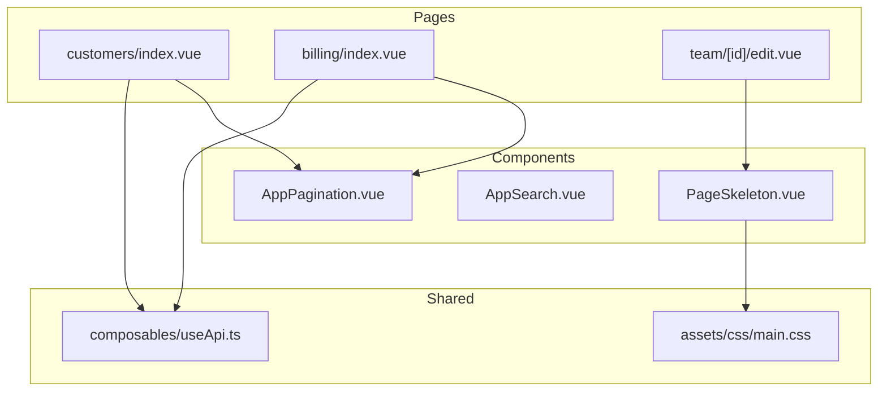
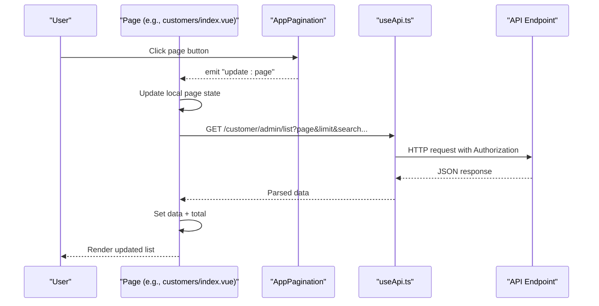
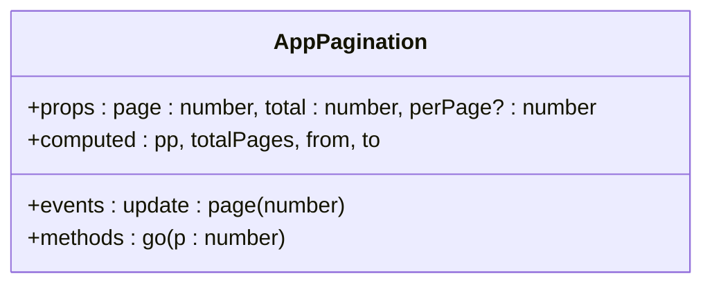
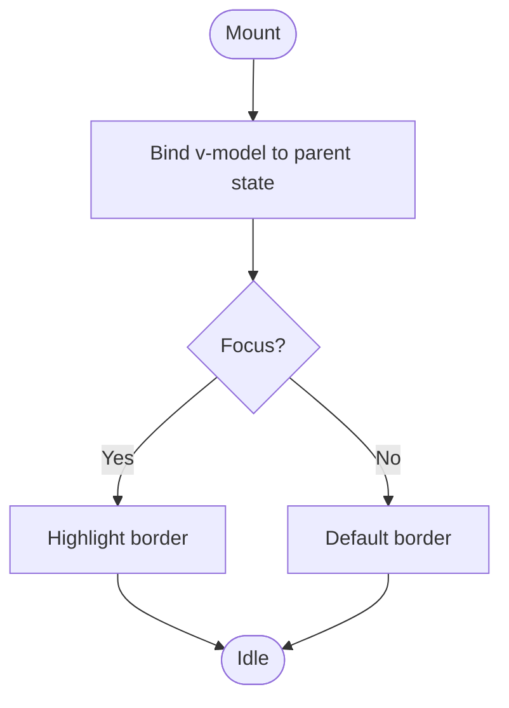
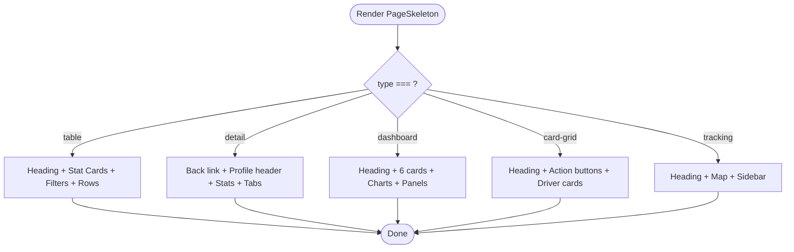
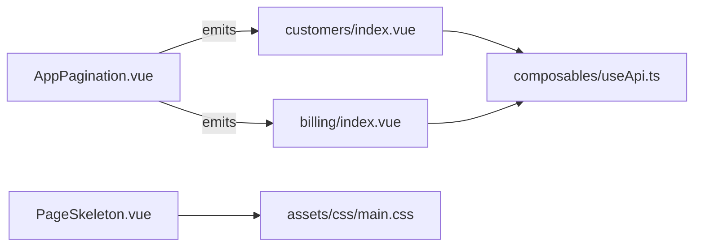

# Data Display Components

<cite>
**Referenced Files in This Document**
- [AppPagination.vue](file://app/components/AppPagination.vue)
- [AppSearch.vue](file://app/components/AppSearch.vue)
- [PageSkeleton.vue](file://app/components/PageSkeleton.vue)
- [main.css](file://app/assets/css/main.css)
- [customers/index.vue](file://app/pages/customers/index.vue)
- [billing/index.vue](file://app/pages/billing/index.vue)
- [team/[id]/edit.vue](file://app/pages/team/[id]/edit.vue)
- [useApi.ts](file://app/composables/useApi.ts)
</cite>

## Table of Contents
1. [Introduction](#introduction)
2. [Project Structure](#project-structure)
3. [Core Components](#core-components)
4. [Architecture Overview](#architecture-overview)
5. [Detailed Component Analysis](#detailed-component-analysis)
6. [Dependency Analysis](#dependency-analysis)
7. [Performance Considerations](#performance-considerations)
8. [Troubleshooting Guide](#troubleshooting-guide)
9. [Conclusion](#conclusion)

## Introduction
This document provides comprehensive documentation for three data display components used across the application:
- AppPagination: A client-side pagination control that emits page changes and computes visible ranges.
- AppSearch: A simple, styled search input with a two-way bound model and focus/blur styling.
- PageSkeleton: A full-page loading skeleton with multiple layout presets (table, detail, dashboard, card-grid, tracking).

The guide covers prop configuration, event handling, integration patterns with API endpoints, usage examples, customization options, accessibility considerations, and performance tips for large datasets.

## Project Structure
These components live under app/components and are consumed by various pages to render paginated lists, search inputs, and loading placeholders. The shared CSS defines the shimmer animation and grid utilities used by PageSkeleton.

**Diagram sources**
- [AppPagination.vue](file://app/components/AppPagination.vue)
- [AppSearch.vue](file://app/components/AppSearch.vue)
- [PageSkeleton.vue](file://app/components/PageSkeleton.vue)
- [main.css](file://app/assets/css/main.css)
- [customers/index.vue](file://app/pages/customers/index.vue)
- [billing/index.vue](file://app/pages/billing/index.vue)
- [team/[id]/edit.vue](file://app/pages/team/[id]/edit.vue)
- [useApi.ts](file://app/composables/useApi.ts)

**Section sources**
- [AppPagination.vue](file://app/components/AppPagination.vue)
- [AppSearch.vue](file://app/components/AppSearch.vue)
- [PageSkeleton.vue](file://app/components/PageSkeleton.vue)
- [main.css](file://app/assets/css/main.css)
- [customers/index.vue](file://app/pages/customers/index.vue)
- [billing/index.vue](file://app/pages/billing/index.vue)
- [team/[id]/edit.vue](file://app/pages/team/[id]/edit.vue)
- [useApi.ts](file://app/composables/useApi.ts)

## Core Components
- AppPagination
  - Purpose: Renders current range info and page buttons; emits page updates via v-model-like update:page.
  - Props: page (number), total (number), perPage (optional number).
  - Events: update:page (emits new page number).
  - Behavior: Computes totalPages, from/to indices, disables Previous/Next when at boundaries.

- AppSearch
  - Purpose: Provides a consistent search input with an icon and placeholder.
  - Props: placeholder (string, optional).
  - Model: Two-way binding via defineModel<string>.
  - Behavior: Focus/blur border color change; no built-in debounce or filtering.

- PageSkeleton
  - Purpose: Displays animated placeholders for different page layouts while content loads.
  - Props: type ('table' | 'detail' | 'dashboard' | 'card-grid' | 'tracking'), rows (default 6), cards (default 4).
  - Behavior: Renders skeletons matching the chosen layout; uses global shimmer animation.

**Section sources**
- [AppPagination.vue](file://app/components/AppPagination.vue)
- [AppSearch.vue](file://app/components/AppSearch.vue)
- [PageSkeleton.vue](file://app/components/PageSkeleton.vue)
- [main.css](file://app/assets/css/main.css)

## Architecture Overview
The components integrate with pages that manage state and fetch data using useApi. Pagination drives server-side requests; search inputs typically trigger re-fetches; PageSkeleton is shown during initial load.

**Diagram sources**
- [AppPagination.vue](file://app/components/AppPagination.vue)
- [customers/index.vue](file://app/pages/customers/index.vue)
- [useApi.ts](file://app/composables/useApi.ts)

## Detailed Component Analysis

### AppPagination
- Prop Configuration
  - page: Current active page (number).
  - total: Total number of items (number).
  - perPage: Items per page (number, optional; defaults to 10 internally).
- Event Handling
  - Emits update:page with the target page number.
  - Validates navigation within [1, totalPages].
- Computed Values
  - totalPages: Derived from total and perPage.
  - from/to: Range of displayed items on the current page.
- Integration Example
  - In customers/index.vue, the component receives :page, :total, :per-page and listens to @update:page to update local state and refetch data.
  - In billing/index.vue, it is used similarly for invoice and transfer tables.

**Diagram sources**
- [AppPagination.vue](file://app/components/AppPagination.vue)

**Section sources**
- [AppPagination.vue](file://app/components/AppPagination.vue)
- [customers/index.vue](file://app/pages/customers/index.vue)
- [billing/index.vue](file://app/pages/billing/index.vue)

### AppSearch
- Prop Configuration
  - placeholder: Optional string for the input placeholder text.
- Model Binding
  - Uses defineModel<string> for two-way binding.
- Styling and UX
  - Search icon overlay; focus highlights border color; blur restores default.
- Usage Notes
  - No built-in debouncing or filtering; pages can bind the model and trigger their own logic.

**Diagram sources**
- [AppSearch.vue](file://app/components/AppSearch.vue)

**Section sources**
- [AppSearch.vue](file://app/components/AppSearch.vue)

### PageSkeleton
- Prop Configuration
  - type: Layout preset ('table' | 'detail' | 'dashboard' | 'card-grid' | 'tracking').
  - rows: Number of table rows to render (used only for 'table'; default 6).
  - cards: Number of stat cards to render (default 4).
- Visuals
  - Uses a global shimmer animation defined in main.css.
  - Responsive grids and map/sidebar layouts supported via utility classes.
- Usage Examples
  - Shown conditionally while initialLoading is true in customers/index.vue.
  - Used in team/[id]/edit.vue to show a dashboard-style skeleton during load.

**Diagram sources**
- [PageSkeleton.vue](file://app/components/PageSkeleton.vue)
- [main.css](file://app/assets/css/main.css)

**Section sources**
- [PageSkeleton.vue](file://app/components/PageSkeleton.vue)
- [main.css](file://app/assets/css/main.css)
- [customers/index.vue](file://app/pages/customers/index.vue)
- [team/[id]/edit.vue](file://app/pages/team/[id]/edit.vue)

## Dependency Analysis
- Component Coupling
  - AppPagination depends only on its props and emits events; no direct imports.
  - AppSearch is self-contained with minimal styling dependencies.
  - PageSkeleton relies on global CSS for shimmer and grid utilities.
- External Dependencies
  - Pages consume these components and call useApi for data fetching.
  - useApi handles authentication headers, error handling, and redirects on 401.

**Diagram sources**
- [AppPagination.vue](file://app/components/AppPagination.vue)
- [PageSkeleton.vue](file://app/components/PageSkeleton.vue)
- [main.css](file://app/assets/css/main.css)
- [customers/index.vue](file://app/pages/customers/index.vue)
- [billing/index.vue](file://app/pages/billing/index.vue)
- [useApi.ts](file://app/composables/useApi.ts)

**Section sources**
- [AppPagination.vue](file://app/components/AppPagination.vue)
- [AppSearch.vue](file://app/components/AppSearch.vue)
- [PageSkeleton.vue](file://app/components/PageSkeleton.vue)
- [main.css](file://app/assets/css/main.css)
- [customers/index.vue](file://app/pages/customers/index.vue)
- [billing/index.vue](file://app/pages/billing/index.vue)
- [useApi.ts](file://app/composables/useApi.ts)

## Performance Considerations
- Pagination
  - Prefer server-side pagination for large datasets. Ensure perPage is reasonable (e.g., 10–50) to limit DOM size.
  - Avoid recalculating heavy computations inside computed properties; keep them lightweight.
- Search
  - For real-time search over large lists, implement debouncing at the page level before triggering API calls.
  - Use server-side filtering and search parameters to reduce payload sizes.
- Skeletons
  - Keep skeleton row/card counts modest to avoid unnecessary DOM nodes during long loads.
  - Reuse skeleton types that match actual page structure to minimize layout shifts.
- API Calls
  - Leverage useApi’s centralized error handling and token injection.
  - Cancel in-flight requests if navigating away or changing filters rapidly.

[No sources needed since this section provides general guidance]

## Troubleshooting Guide
- Pagination not updating
  - Ensure the parent page binds :page and listens to @update:page correctly.
  - Verify total reflects the server-reported count and perPage is set consistently.
- Search not triggering results
  - Confirm the page watches the search model and triggers refetching.
  - Add debouncing if typing too frequently causes excessive requests.
- Skeleton not showing
  - Make sure the loading flag is true initially and toggled after data resolves.
  - Verify the correct type prop matches the page layout.
- API errors and redirects
  - useApi logs and throws on failures; check console logs for status codes and messages.
  - On 401, the composable logs out and redirects to login automatically.

**Section sources**
- [useApi.ts](file://app/composables/useApi.ts)
- [customers/index.vue](file://app/pages/customers/index.vue)
- [billing/index.vue](file://app/pages/billing/index.vue)
- [team/[id]/edit.vue](file://app/pages/team/[id]/edit.vue)

## Conclusion
AppPagination, AppSearch, and PageSkeleton provide a cohesive foundation for data-heavy pages. They are intentionally small and focused, delegating complex behaviors like debounced search and server-side pagination to consuming pages. By combining these components with useApi and thoughtful state management, you can build responsive, accessible, and performant data displays.