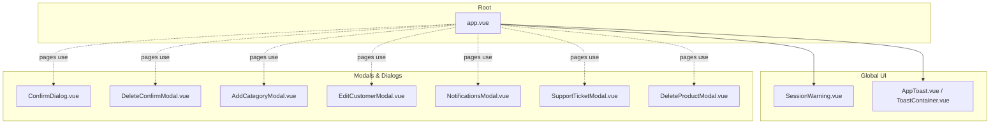
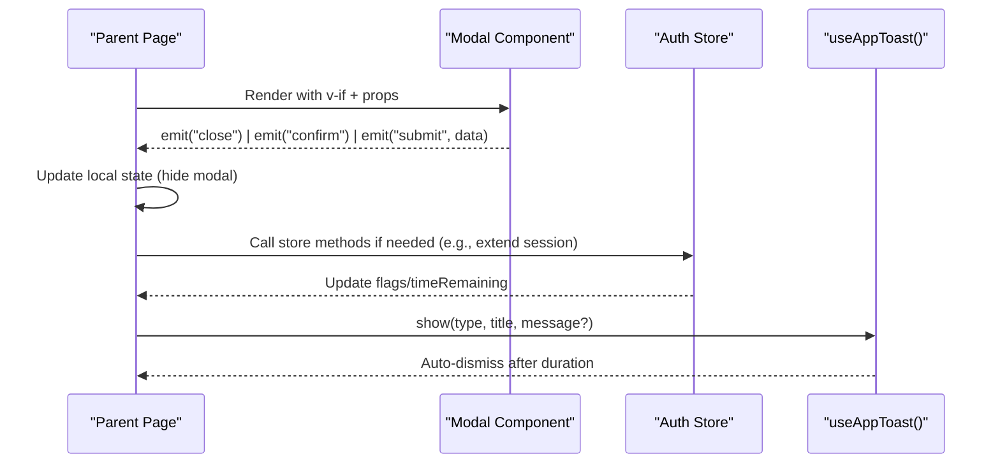
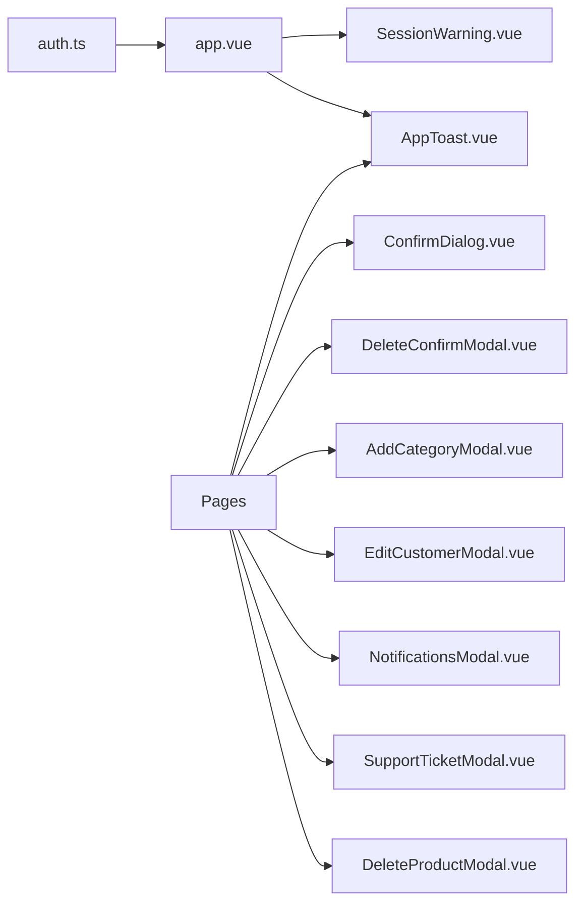

# Dialog & Modal System

<cite>
**Referenced Files in This Document**
- [app.vue](file://app/app.vue)
- [auth.ts](file://app/stores/auth.ts)
- [ConfirmDialog.vue](file://app/components/ConfirmDialog.vue)
- [DeleteConfirmModal.vue](file://app/components/DeleteConfirmModal.vue)
- [SessionWarning.vue](file://app/components/SessionWarning.vue)
- [AddCategoryModal.vue](file://app/components/AddCategoryModal.vue)
- [EditCustomerModal.vue](file://app/components/EditCustomerModal.vue)
- [NotificationsModal.vue](file://app/components/NotificationsModal.vue)
- [SupportTicketModal.vue](file://app/components/SupportTicketModal.vue)
- [DeleteProductModal.vue](file://app/components/DeleteProductModal.vue)
- [useToast.ts](file://app/composables/useToast.ts)
- [AppToast.vue](file://app/components/AppToast.vue)
- [ToastContainer.vue](file://app/components/ToastContainer.vue)
</cite>

## Table of Contents
1. [Introduction](#introduction)
2. [Project Structure](#project-structure)
3. [Core Components](#core-components)
4. [Architecture Overview](#architecture-overview)
5. [Detailed Component Analysis](#detailed-component-analysis)
6. [Dependency Analysis](#dependency-analysis)
7. [Performance Considerations](#performance-considerations)
8. [Troubleshooting Guide](#troubleshooting-guide)
9. [Conclusion](#conclusion)
10. [Appendices](#appendices)

## Introduction
This document explains the dialog and modal system used across the application. It covers confirmation dialogs, delete confirmations, session warnings, and related UI patterns such as toasts. The focus is on component architecture, z-index management, backdrop handling, event handling patterns, prop interfaces for different modal types, integration with global state (including a simple toast stack), accessibility considerations, best practices for composition, and common pitfalls like stacking issues.

## Project Structure
The modal and dialog components are implemented as standalone Vue components under app/components. They follow a consistent pattern:
- A full-screen overlay with a semi-transparent backdrop
- A centered or positioned content panel
- Event-driven interactions via emits (e.g., close, confirm, submit)
- Inline styles for layout and z-index control
- Optional loading states and form validation within modals

**Diagram sources**
- [app.vue:1-33](file://app/app.vue#L1-L33)
- [SessionWarning.vue:1-66](file://app/components/SessionWarning.vue#L1-L66)
- [AppToast.vue:1-115](file://app/components/AppToast.vue#L1-L115)
- [ToastContainer.vue:1-120](file://app/components/ToastContainer.vue#L1-L120)
- [ConfirmDialog.vue:1-53](file://app/components/ConfirmDialog.vue#L1-L53)
- [DeleteConfirmModal.vue:1-39](file://app/components/DeleteConfirmModal.vue#L1-L39)
- [AddCategoryModal.vue:1-73](file://app/components/AddCategoryModal.vue#L1-L73)
- [EditCustomerModal.vue:1-242](file://app/components/EditCustomerModal.vue#L1-L242)
- [NotificationsModal.vue:1-210](file://app/components/NotificationsModal.vue#L1-L210)
- [SupportTicketModal.vue:1-336](file://app/components/SupportTicketModal.vue#L1-L336)
- [DeleteProductModal.vue:1-58](file://app/components/DeleteProductModal.vue#L1-L58)

**Section sources**
- [app.vue:1-33](file://app/app.vue#L1-L33)

## Core Components
- Confirmation dialog: generic two-button dialog with optional loading state and customizable text/colors.
- Delete confirmation modal: destructive action prompt with clear visual emphasis.
- Session warning: top-right floating alert that warns about expiring sessions and offers extend/dismiss actions.
- Form-based modals: add/edit flows with local validation and async submission patterns.
- Notifications modal: list-style modal with filtering and read/unread states.
- Support ticket modal: complex modal with detail fetching, status updates, and reply sending.
- Toast notifications: global notification stack managed by a composable and rendered via a container.

Key characteristics:
- Backdrop: fixed overlay covering the viewport with a click-to-close handler on the backdrop area.
- Z-index: each modal sets its own z-index; values vary across components (see section below).
- Events: components emit events to parent pages for lifecycle control (close, confirm, submit).
- State: most modals manage internal state locally; some integrate with composables or API utilities.

**Section sources**
- [ConfirmDialog.vue:1-53](file://app/components/ConfirmDialog.vue#L1-L53)
- [DeleteConfirmModal.vue:1-39](file://app/components/DeleteConfirmModal.vue#L1-L39)
- [SessionWarning.vue:1-66](file://app/components/SessionWarning.vue#L1-L66)
- [AddCategoryModal.vue:1-73](file://app/components/AddCategoryModal.vue#L1-L73)
- [EditCustomerModal.vue:1-242](file://app/components/EditCustomerModal.vue#L1-L242)
- [NotificationsModal.vue:1-210](file://app/components/NotificationsModal.vue#L1-L210)
- [SupportTicketModal.vue:1-336](file://app/components/SupportTicketModal.vue#L1-L336)
- [DeleteProductModal.vue:1-58](file://app/components/DeleteProductModal.vue#L1-L58)
- [useToast.ts:1-37](file://app/composables/useToast.ts#L1-L37)
- [AppToast.vue:1-115](file://app/components/AppToast.vue#L1-L115)
- [ToastContainer.vue:1-120](file://app/components/ToastContainer.vue#L1-L120)

## Architecture Overview
At runtime, modals are conditionally rendered by their parent pages or root app. Global UI elements (session warning, toasts) are mounted at the root level. Each modal controls its own visibility through props and emits events back to the parent to update state.

**Diagram sources**
- [app.vue:1-33](file://app/app.vue#L1-L33)
- [auth.ts:1-230](file://app/stores/auth.ts#L1-L230)
- [useToast.ts:1-37](file://app/composables/useToast.ts#L1-L37)
- [ConfirmDialog.vue:1-53](file://app/components/ConfirmDialog.vue#L1-L53)
- [DeleteConfirmModal.vue:1-39](file://app/components/DeleteConfirmModal.vue#L1-L39)
- [SessionWarning.vue:1-66](file://app/components/SessionWarning.vue#L1-L66)

## Detailed Component Analysis

### Confirmation Dialog
Purpose:
- Generic confirmation with title, message, and customizable buttons. Supports a loading state to prevent double submissions.

Props and events:
- Props: title, message, confirmText, cancelText, confirmColor, loading
- Emits: confirm, cancel

Behavior:
- Backdrop click triggers cancel.
- Buttons disabled while loading.

Accessibility notes:
- No explicit ARIA attributes or focus trapping currently.

Best practices:
- Use this for non-destructive confirmations where you want a neutral tone.

**Section sources**
- [ConfirmDialog.vue:1-53](file://app/components/ConfirmDialog.vue#L1-L53)

### Delete Confirmation Modal
Purpose:
- Destructive deletion prompts with strong visual cues.

Props and events:
- Props: title, message
- Emits: close, confirm

Behavior:
- Backdrop click triggers close.
- Clear separation between Cancel and Delete actions.

Accessibility notes:
- No explicit ARIA attributes or focus trapping currently.

Best practices:
- Prefer for irreversible operations. Ensure parent handles async deletion and shows feedback via toasts.

**Section sources**
- [DeleteConfirmModal.vue:1-39](file://app/components/DeleteConfirmModal.vue#L1-L39)

### Session Warning
Purpose:
- Warns users when their session is about to expire and allows extending or dismissing.

Props and events:
- Props: timeRemaining (seconds)
- Emits: extend, dismiss

Behavior:
- Positioned top-right with high z-index.
- Time formatting helper displays minutes:seconds.
- Extend triggers session refresh; dismiss hides the warning.

Integration:
- Controlled by auth store flags and timers.

Accessibility notes:
- No explicit ARIA attributes or focus trapping currently.

**Section sources**
- [SessionWarning.vue:1-66](file://app/components/SessionWarning.vue#L1-L66)
- [auth.ts:1-230](file://app/stores/auth.ts#L1-L230)
- [app.vue:1-33](file://app/app.vue#L1-L33)

### Add Category Modal
Purpose:
- Simple form modal to create a new category.

Props and events:
- Emits: close, submit(name)

Behavior:
- Basic client-side validation (non-empty name).
- Enter key submits.

Accessibility notes:
- No explicit ARIA attributes or focus trapping currently.

**Section sources**
- [AddCategoryModal.vue:1-73](file://app/components/AddCategoryModal.vue#L1-L73)

### Edit Customer Modal
Purpose:
- Complex edit form with multiple fields, dropdowns, and validation.

Props and events:
- Props: customer, saving
- Emits: close, submit(data)

Behavior:
- Fetches options on mount (customer types, zones).
- Validates required fields and numeric constraints.
- Disables save button while saving.

Accessibility notes:
- No explicit ARIA attributes or focus trapping currently.

**Section sources**
- [EditCustomerModal.vue:1-242](file://app/components/EditCustomerModal.vue#L1-L242)

### Notifications Modal
Purpose:
- List of notifications with filters and read/unread indicators.

Props and events:
- Emits: close

Behavior:
- Filters between all and unread.
- Mark individual or all as read.
- Dismiss items from the list.

Accessibility notes:
- No explicit ARIA attributes or focus trapping currently.

**Section sources**
- [NotificationsModal.vue:1-210](file://app/components/NotificationsModal.vue#L1-L210)

### Support Ticket Modal
Purpose:
- Detailed view of a support ticket with conversation history, status changes, and replies.

Props and events:
- Props: ticket
- Emits: close, update(id, status)

Behavior:
- Fetches detailed info on mount.
- Updates status via PATCH and sends replies via POST.
- Reverts UI state on failure.

Accessibility notes:
- No explicit ARIA attributes or focus trapping currently.

**Section sources**
- [SupportTicketModal.vue:1-336](file://app/components/SupportTicketModal.vue#L1-L336)

### Delete Product Modal
Purpose:
- Focused delete confirmation for products with product name context.

Props and events:
- Props: productName, productId
- Emits: close, confirm(id)

Behavior:
- Backdrop click closes modal.
- Confirms deletion with product id.

Accessibility notes:
- No explicit ARIA attributes or focus trapping currently.

**Section sources**
- [DeleteProductModal.vue:1-58](file://app/components/DeleteProductModal.vue#L1-L58)

### Toast Notifications
Purpose:
- Global notification stack with auto-dismiss and type-specific styling.

Composable interface:
- Types: success, error, warning, info
- Methods: show(type, title, message?, duration?), dismiss(id), convenience helpers: success(), error(), warning(), info()

Rendering:
- Two implementations exist: AppToast.vue and ToastContainer.vue. Both consume the same composable.

Accessibility notes:
- No explicit ARIA live regions currently.

**Section sources**
- [useToast.ts:1-37](file://app/composables/useToast.ts#L1-L37)
- [AppToast.vue:1-115](file://app/components/AppToast.vue#L1-L115)
- [ToastContainer.vue:1-120](file://app/components/ToastContainer.vue#L1-L120)

## Dependency Analysis
- Root-level integration:
  - app.vue mounts SessionWarning and AppToast globally.
  - SessionWarning is controlled by auth store flags and time remaining.
- Modals are typically rendered inside pages using v-if and refs to control submitting states.
- Toasts are consumed via the useAppToast composable from anywhere in the app.

**Diagram sources**
- [app.vue:1-33](file://app/app.vue#L1-L33)
- [auth.ts:1-230](file://app/stores/auth.ts#L1-L230)
- [SessionWarning.vue:1-66](file://app/components/SessionWarning.vue#L1-L66)
- [AppToast.vue:1-115](file://app/components/AppToast.vue#L1-L115)
- [ConfirmDialog.vue:1-53](file://app/components/ConfirmDialog.vue#L1-L53)
- [DeleteConfirmModal.vue:1-39](file://app/components/DeleteConfirmModal.vue#L1-L39)
- [AddCategoryModal.vue:1-73](file://app/components/AddCategoryModal.vue#L1-L73)
- [EditCustomerModal.vue:1-242](file://app/components/EditCustomerModal.vue#L1-L242)
- [NotificationsModal.vue:1-210](file://app/components/NotificationsModal.vue#L1-L210)
- [SupportTicketModal.vue:1-336](file://app/components/SupportTicketModal.vue#L1-L336)
- [DeleteProductModal.vue:1-58](file://app/components/DeleteProductModal.vue#L1-L58)

**Section sources**
- [app.vue:1-33](file://app/app.vue#L1-L33)
- [auth.ts:1-230](file://app/stores/auth.ts#L1-L230)

## Performance Considerations
- Avoid rendering many heavy modals simultaneously; prefer conditional rendering with v-if to keep DOM light.
- Defer expensive computations until modal opens (lazy initialization) where possible.
- Debounce or throttle user inputs in large forms to reduce re-renders.
- For long lists inside modals (e.g., notifications), consider virtualization if the list grows significantly.
- Keep z-index values predictable to avoid unnecessary repaints due to stacking conflicts.

[No sources needed since this section provides general guidance]

## Troubleshooting Guide
Common issues and resolutions:
- Multiple modals overlapping:
  - Symptom: Unexpected layering or clicks passing through.
  - Cause: Inconsistent z-index values across modals.
  - Resolution: Standardize z-index levels and ensure only one modal is active at a time.
- Focus not trapped inside modal:
  - Symptom: Tabbing escapes modal to background content.
  - Cause: No focus trap implementation.
  - Resolution: Implement focus trapping and return focus to trigger element on close.
- Missing ARIA semantics:
  - Symptom: Screen readers do not announce modal purpose or role.
  - Cause: No aria-modal, aria-labelledby, or aria-describedby.
  - Resolution: Add appropriate ARIA attributes and associate labels/descriptions.
- Toast not visible:
  - Symptom: Notifications not shown.
  - Cause: Container not mounted or incorrect usage of composable.
  - Resolution: Ensure AppToast or ToastContainer is mounted and useAppToast is called correctly.

**Section sources**
- [AppToast.vue:1-115](file://app/components/AppToast.vue#L1-L115)
- [ToastContainer.vue:1-120](file://app/components/ToastContainer.vue#L1-L120)
- [useToast.ts:1-37](file://app/composables/useToast.ts#L1-L37)

## Conclusion
The current modal system relies on lightweight, self-contained components with inline styles and event-driven communication. While functional, it lacks a centralized modal stack, focus trapping, and comprehensive ARIA support. Adopting a unified approach will improve consistency, accessibility, and maintainability.

[No sources needed since this section summarizes without analyzing specific files]

## Appendices

### Prop Interfaces Summary
- ConfirmDialog
  - Props: title, message, confirmText?, cancelText?, confirmColor?, loading?
  - Emits: confirm, cancel
- DeleteConfirmModal
  - Props: title, message
  - Emits: close, confirm
- SessionWarning
  - Props: timeRemaining (seconds)
  - Emits: extend, dismiss
- AddCategoryModal
  - Emits: close, submit(name)
- EditCustomerModal
  - Props: customer, saving?
  - Emits: close, submit(data)
- NotificationsModal
  - Emits: close
- SupportTicketModal
  - Props: ticket
  - Emits: close, update(id, status)
- DeleteProductModal
  - Props: productName, productId
  - Emits: close, confirm(id)

**Section sources**
- [ConfirmDialog.vue:1-53](file://app/components/ConfirmDialog.vue#L1-L53)
- [DeleteConfirmModal.vue:1-39](file://app/components/DeleteConfirmModal.vue#L1-L39)
- [SessionWarning.vue:1-66](file://app/components/SessionWarning.vue#L1-L66)
- [AddCategoryModal.vue:1-73](file://app/components/AddCategoryModal.vue#L1-L73)
- [EditCustomerModal.vue:1-242](file://app/components/EditCustomerModal.vue#L1-L242)
- [NotificationsModal.vue:1-210](file://app/components/NotificationsModal.vue#L1-L210)
- [SupportTicketModal.vue:1-336](file://app/components/SupportTicketModal.vue#L1-L336)
- [DeleteProductModal.vue:1-58](file://app/components/DeleteProductModal.vue#L1-L58)

### Z-Index Management Notes
Observed z-index values:
- ConfirmDialog: 50
- DeleteConfirmModal: 9999
- SessionWarning: 10000
- NotificationsModal: 50
- SupportTicketModal: 50
- DeleteProductModal: 50
- Toast containers: 9999

Recommendation:
- Define a small set of levels (e.g., base overlays ~50, important alerts ~9000, critical toasts/warnings ~10000) and enforce them consistently.

**Section sources**
- [ConfirmDialog.vue:1-53](file://app/components/ConfirmDialog.vue#L1-L53)
- [DeleteConfirmModal.vue:1-39](file://app/components/DeleteConfirmModal.vue#L1-L39)
- [SessionWarning.vue:1-66](file://app/components/SessionWarning.vue#L1-L66)
- [NotificationsModal.vue:1-210](file://app/components/NotificationsModal.vue#L1-L210)
- [SupportTicketModal.vue:1-336](file://app/components/SupportTicketModal.vue#L1-L336)
- [DeleteProductModal.vue:1-58](file://app/components/DeleteProductModal.vue#L1-L58)
- [AppToast.vue:1-115](file://app/components/AppToast.vue#L1-L115)
- [ToastContainer.vue:1-120](file://app/components/ToastContainer.vue#L1-L120)

### Accessibility Requirements Checklist
- ARIA roles and labels:
  - Add aria-modal="true" to modal containers.
  - Associate aria-labelledby and aria-describedby to modal header/body.
- Keyboard navigation:
  - Trap focus within modal.
  - Close on Escape key.
  - Return focus to trigger element on close.
- Screen reader support:
  - Announce dynamic content changes (e.g., loading, errors).
  - Provide descriptive titles and messages.
- Visual contrast and focus indicators:
  - Ensure sufficient color contrast.
  - Visible focus outlines for interactive elements.

[No sources needed since this section provides general guidance]

### Best Practices for Modal Composition
- Single source of truth for visibility:
  - Manage modal open/close state in the parent page or a dedicated store.
- Consistent event contracts:
  - Use standardized emits (close, confirm, submit) across modal types.
- Async operations:
  - Disable primary action during async work.
  - Show loading indicators inside the modal.
  - Handle errors and surface feedback via toasts.
- Form validation:
  - Validate before submission.
  - Display inline errors near fields.
- Avoid stacking issues:
  - Prevent opening another modal while one is active unless explicitly designed for nested modals.
  - Centralize z-index levels.

[No sources needed since this section provides general guidance]