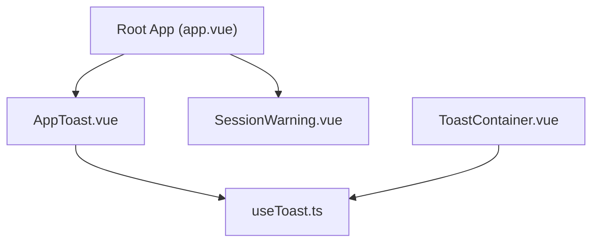
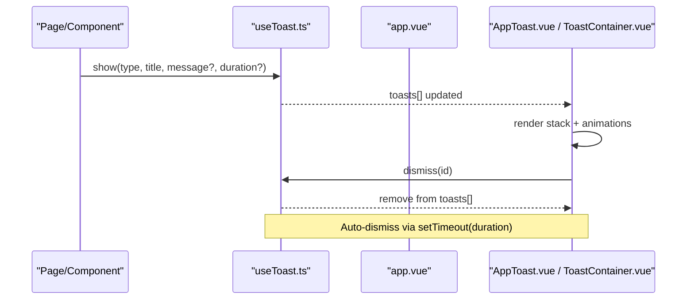
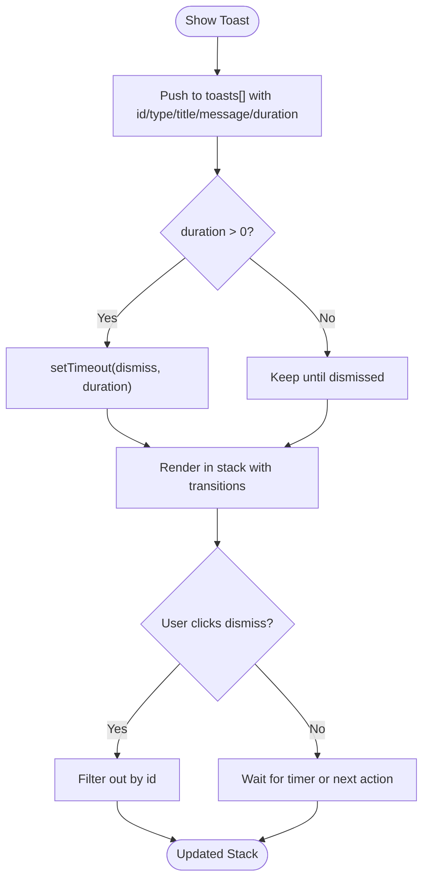
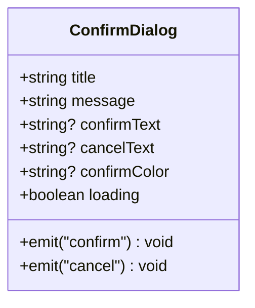
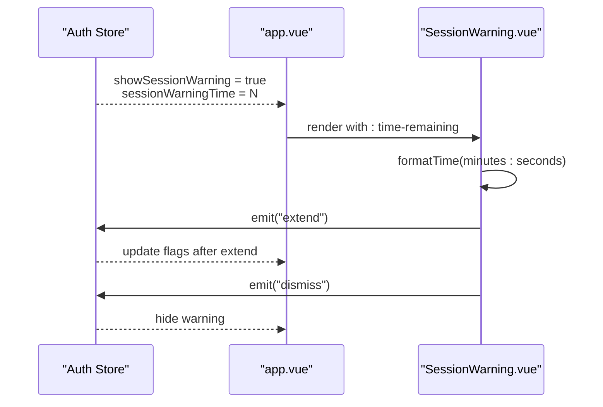
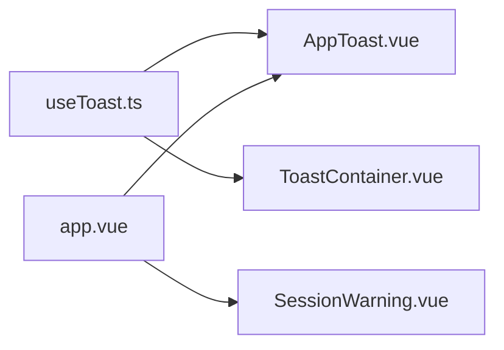

# Feedback & Notification Components

<cite>
**Referenced Files in This Document**
- [app.vue](file://app/app.vue)
- [AppToast.vue](file://app/components/AppToast.vue)
- [ConfirmDialog.vue](file://app/components/ConfirmDialog.vue)
- [SessionWarning.vue](file://app/components/SessionWarning.vue)
- [ToastContainer.vue](file://app/components/ToastContainer.vue)
- [useToast.ts](file://app/composables/useToast.ts)
</cite>

## Table of Contents
1. [Introduction](#introduction)
2. [Project Structure](#project-structure)
3. [Core Components](#core-components)
4. [Architecture Overview](#architecture-overview)
5. [Detailed Component Analysis](#detailed-component-analysis)
6. [Dependency Analysis](#dependency-analysis)
7. [Performance Considerations](#performance-considerations)
8. [Troubleshooting Guide](#troubleshooting-guide)
9. [Conclusion](#conclusion)
10. [Appendices](#appendices)

## Introduction
This document provides comprehensive documentation for the feedback and notification components used across the application: toast notifications, confirmation dialogs, and session warnings. It explains how to use each component, their configuration options, behavior, styling customization, internationalization support, and integration patterns with form validation and API responses.

## Project Structure
The feedback and notification system is implemented as a set of Vue 3 components and a shared composable that manages toast state globally. The root application mounts the toast container and session warning based on authentication state.

**Diagram sources**
- [app.vue:1-33](file://app/app.vue#L1-L33)
- [AppToast.vue:1-115](file://app/components/AppToast.vue#L1-L115)
- [SessionWarning.vue:1-66](file://app/components/SessionWarning.vue#L1-L66)
- [ToastContainer.vue:1-120](file://app/components/ToastContainer.vue#L1-L120)
- [useToast.ts:1-37](file://app/composables/useToast.ts#L1-L37)

**Section sources**
- [app.vue:1-33](file://app/app.vue#L1-L33)

## Core Components
- AppToast: Renders stacked toast notifications with type-based icons and colors, auto-dismiss timers, and manual dismissal.
- ConfirmDialog: A modal dialog for confirm/cancel actions with customizable text and loading states.
- SessionWarning: A warning banner indicating session expiration with countdown formatting and extend/dismiss actions.
- ToastContainer: An alternative toast renderer using Teleport and progress bar animation.
- useToast: Shared composable providing global toast state, show/dismiss methods, and typed helpers.

Key behaviors:
- Message types: success, error, warning, info
- Positioning: top-right stack for AppToast; bottom-right stack for ToastContainer
- Auto-dismiss: configurable duration per toast
- Stacking management: vertical stacking with transitions
- Accessibility: keyboard-friendly buttons and clear labels via UI icon library

**Section sources**
- [AppToast.vue:1-115](file://app/components/AppToast.vue#L1-L115)
- [ToastContainer.vue:1-120](file://app/components/ToastContainer.vue#L1-L120)
- [ConfirmDialog.vue:1-53](file://app/components/ConfirmDialog.vue#L1-L53)
- [SessionWarning.vue:1-66](file://app/components/SessionWarning.vue#L1-L66)
- [useToast.ts:1-37](file://app/composables/useToast.ts#L1-L37)

## Architecture Overview
The architecture centers around a single source of truth for toasts managed by the useToast composable. Components consume this state and render accordingly. The root app mounts both the primary toast renderer and the session warning.

**Diagram sources**
- [useToast.ts:1-37](file://app/composables/useToast.ts#L1-L37)
- [app.vue:1-33](file://app/app.vue#L1-L33)
- [AppToast.vue:1-115](file://app/components/AppToast.vue#L1-L115)
- [ToastContainer.vue:1-120](file://app/components/ToastContainer.vue#L1-L120)

## Detailed Component Analysis

### AppToast
Purpose:
- Displays a stack of toasts at the top-right corner with type-specific icons and color themes.
- Supports optional message text, auto-dismiss timers, and manual dismissal.

Props and data model:
- Consumes toasts array and dismiss function from useToast.
- Each toast includes id, type, title, optional message, and optional duration.

Behavior:
- Type mapping selects icon and color palette.
- Transitions animate entry/exit and reorder items smoothly.
- Dismiss button removes the toast immediately.

Styling customization:
- Inline styles define background, border, padding, typography, and shadow.
- Scoped CSS defines slide-in/out animations and move transitions.

Accessibility:
- Buttons are interactive with hover effects.
- Icons communicate status visually; consider adding aria-labels where appropriate.

Integration examples:
- Use toast.success(), toast.error(), toast.warning(), or toast.info() from any component or page.
- Provide custom durations to control auto-dismiss timing.

**Diagram sources**
- [useToast.ts:1-37](file://app/composables/useToast.ts#L1-L37)
- [AppToast.vue:1-115](file://app/components/AppToast.vue#L1-L115)

**Section sources**
- [AppToast.vue:1-115](file://app/components/AppToast.vue#L1-L115)
- [useToast.ts:1-37](file://app/composables/useToast.ts#L1-L37)

### ToastContainer (Alternative Renderer)
Purpose:
- Alternative toast renderer teleported to body, positioned bottom-right with a progress bar indicating remaining time.

Features:
- Uses Teleport to mount under <body>.
- Progress bar animates linearly based on toast.duration.
- Same type-to-style mapping and dismiss behavior.

Styling:
- Scoped CSS defines spring-like enter/leave transitions and keyframes for progress.

Use cases:
- Prefer when you want a different visual style or placement than AppToast.

**Section sources**
- [ToastContainer.vue:1-120](file://app/components/ToastContainer.vue#L1-L120)
- [useToast.ts:1-37](file://app/composables/useToast.ts#L1-L37)

### ConfirmDialog
Purpose:
- Modal dialog prompting user confirmation before destructive or important actions.

Props:
- title: string
- message: string
- confirmText?: string
- cancelText?: string
- confirmColor?: string
- loading?: boolean

Events:
- confirm: emitted when user confirms
- cancel: emitted when user cancels or clicks backdrop

Behavior:
- Backdrop click triggers cancel.
- Loading state disables buttons and shows spinner in confirm button.

Accessibility:
- Focusable buttons with clear labels.
- Consider trapping focus within modal and handling Escape key for improved accessibility.

Integration examples:
- Bind v-model or reactive flags to toggle visibility.
- Handle confirm/cancel to execute or abort operations.

**Diagram sources**
- [ConfirmDialog.vue:1-53](file://app/components/ConfirmDialog.vue#L1-L53)

**Section sources**
- [ConfirmDialog.vue:1-53](file://app/components/ConfirmDialog.vue#L1-L53)

### SessionWarning
Purpose:
- Warns users about impending session expiration and offers extend or dismiss actions.

Props:
- timeRemaining: number (seconds)

Events:
- extend: emitted to request session extension
- dismiss: emitted to hide the warning

Behavior:
- Formats remaining time into minutes:seconds.
- Positioned top-right with distinct warning styling.

Integration:
- Mounted conditionally in root app based on auth store flags.
- Extend action typically calls an API to refresh session tokens.

**Diagram sources**
- [app.vue:1-33](file://app/app.vue#L1-L33)
- [SessionWarning.vue:1-66](file://app/components/SessionWarning.vue#L1-L66)

**Section sources**
- [SessionWarning.vue:1-66](file://app/components/SessionWarning.vue#L1-L66)
- [app.vue:1-33](file://app/app.vue#L1-L33)

## Dependency Analysis
Components depend on the shared composable for toast state. The root app orchestrates mounting of SessionWarning and AppToast.

**Diagram sources**
- [useToast.ts:1-37](file://app/composables/useToast.ts#L1-L37)
- [AppToast.vue:1-115](file://app/components/AppToast.vue#L1-L115)
- [ToastContainer.vue:1-120](file://app/components/ToastContainer.vue#L1-L120)
- [app.vue:1-33](file://app/app.vue#L1-L33)
- [SessionWarning.vue:1-66](file://app/components/SessionWarning.vue#L1-L66)

**Section sources**
- [useToast.ts:1-37](file://app/composables/useToast.ts#L1-L37)
- [app.vue:1-33](file://app/app.vue#L1-L33)

## Performance Considerations
- Minimize re-renders by batching toast updates and avoiding unnecessary state mutations.
- Use stable ids for toasts to optimize transition performance.
- Keep durations reasonable to prevent excessive DOM nodes.
- For large stacks, consider limiting visible toasts and implementing overflow strategies.

[No sources needed since this section provides general guidance]

## Troubleshooting Guide
Common issues and resolutions:
- Toast not appearing: Ensure the composable is imported and mounted in the root app. Verify that toasts[] is populated and no filters remove entries.
- Auto-dismiss not working: Check duration values; if undefined or zero, toasts will persist until manually dismissed.
- Duplicate toasts: Ensure unique ids are generated; the composable uses an incrementing counter.
- ConfirmDialog not closing: Verify event handlers are bound and backdrops are clickable.
- SessionWarning not updating: Confirm that timeRemaining prop is being refreshed by the parent store.

**Section sources**
- [useToast.ts:1-37](file://app/composables/useToast.ts#L1-L37)
- [AppToast.vue:1-115](file://app/components/AppToast.vue#L1-L115)
- [ToastContainer.vue:1-120](file://app/components/ToastContainer.vue#L1-L120)
- [ConfirmDialog.vue:1-53](file://app/components/ConfirmDialog.vue#L1-L53)
- [SessionWarning.vue:1-66](file://app/components/SessionWarning.vue#L1-L66)
- [app.vue:1-33](file://app/app.vue#L1-L33)

## Conclusion
The feedback and notification system provides a cohesive set of components for user-facing messages and confirmations. With a centralized toast state, flexible styling, and clear interaction patterns, these components integrate seamlessly into forms and API flows. Extending them with internationalization and enhanced accessibility further improves usability.

[No sources needed since this section summarizes without analyzing specific files]

## Appendices

### Styling Customization
- AppToast: Modify inline styles or scoped CSS for colors, spacing, and animations.
- ToastContainer: Adjust Teleport target, positioning, and progress bar keyframes.
- ConfirmDialog: Customize button colors, sizes, and loading indicator via props and inline styles.
- SessionWarning: Update warning colors, typography, and layout as needed.

[No sources needed since this section provides general guidance]

### Internationalization Support
- Replace static strings (e.g., titles, messages, button labels) with i18n keys.
- For dynamic content, pass localized strings from composables or stores.
- Ensure date/time formatting respects locale settings.

[No sources needed since this section provides general guidance]

### Integration Examples

#### Form Validation
- On invalid submission, call toast.error('Please provide a reason...') to inform users.
- On successful submission, call toast.success('Account suspended successfully').

References:
- [customers/[id].vue:59](file://app/pages/customers/[id].vue#L59)
- [customers/[id].vue:76](file://app/pages/customers/[id].vue#L76)
- [customers/index.vue:25](file://app/pages/customers/index.vue#L25)
- [customers/index.vue:41](file://app/pages/customers/index.vue#L41)

#### API Responses
- Map API errors to toast.error(...) with descriptive messages.
- Map API successes to toast.success(...) with concise confirmations.

References:
- [CreatePickupModal.vue:148](file://app/components/CreatePickupModal.vue#L148)
- [CustomerModal.vue:179](file://app/components/CustomerModal.vue#L179)
- [AppHeader.vue:19](file://app/components/AppHeader.vue#L19)