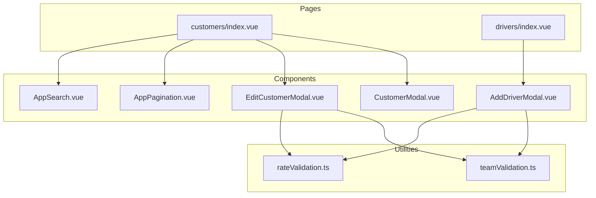
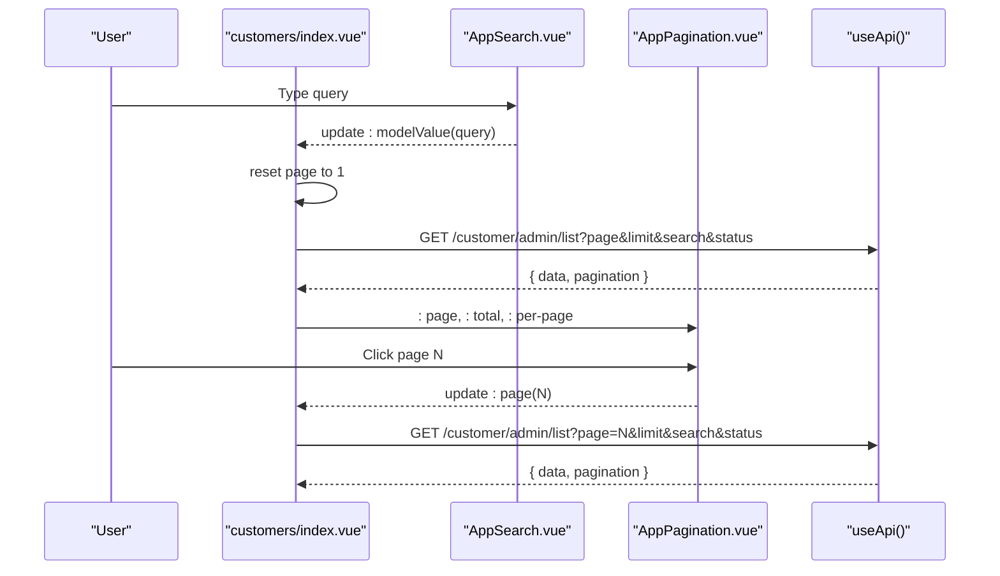
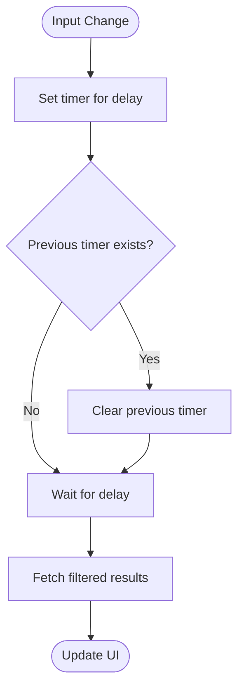
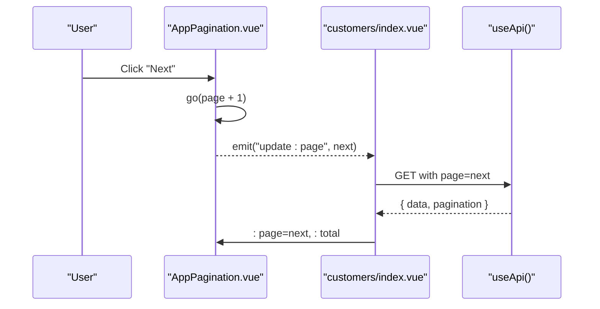
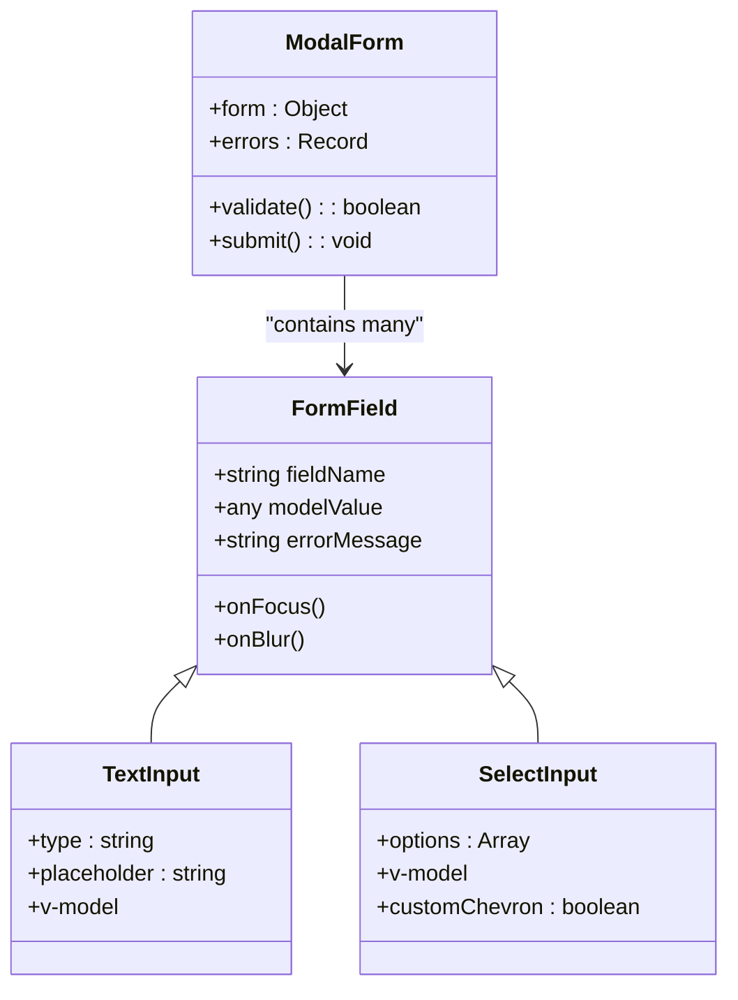
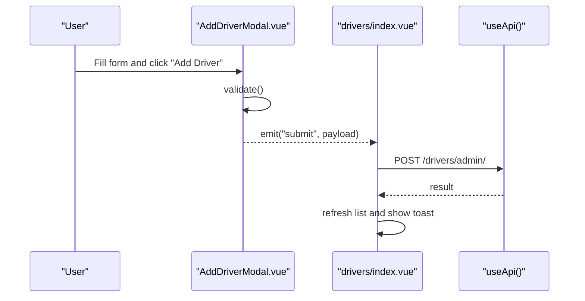
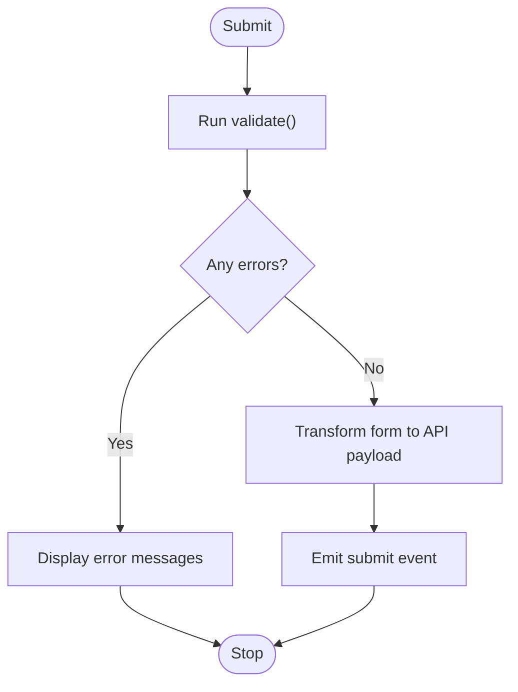
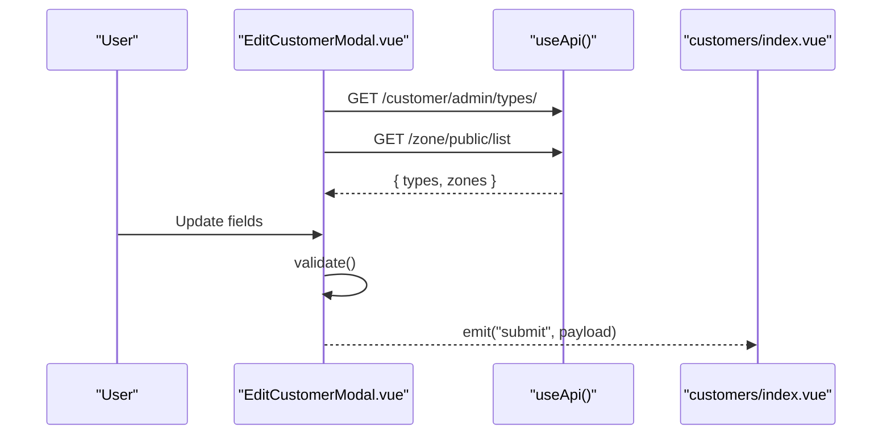
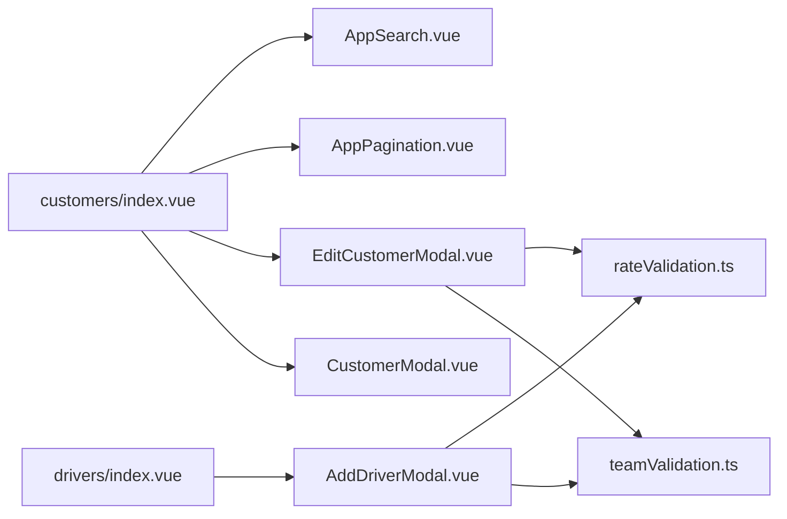

# Form & Input Components

<cite>
**Referenced Files in This Document**
- [AppSearch.vue](file://app/components/AppSearch.vue)
- [AppPagination.vue](file://app/components/AppPagination.vue)
- [AddDriverModal.vue](file://app/components/AddDriverModal.vue)
- [EditCustomerModal.vue](file://app/components/EditCustomerModal.vue)
- [CustomerModal.vue](file://app/components/CustomerModal.vue)
- [customers/index.vue](file://app/pages/customers/index.vue)
- [drivers/index.vue](file://app/pages/drivers/index.vue)
- [rateValidation.ts](file://app/utils/rateValidation.ts)
- [teamValidation.ts](file://app/utils/teamValidation.ts)
</cite>

## Table of Contents
1. Introduction
2. Project Structure
3. Core Components
4. Architecture Overview
5. Detailed Component Analysis
6. Dependency Analysis
7. Performance Considerations
8. Troubleshooting Guide
9. Conclusion

## Introduction
This document provides comprehensive documentation for form and input components used across the application, focusing on:
- Search component with debounced filtering
- Pagination controls with configurable page sizes
- Reusable input patterns for data binding, validation integration, and customization
- Event handling patterns, keyboard navigation support, and accessibility considerations
- Examples for complex forms, file uploads, validation library integration, and custom inputs
- Performance optimization for large datasets, virtual scrolling considerations, and mobile touch interactions
- Styling approaches using inline styles and guidance for adopting Tailwind CSS classes and theming

The goal is to help developers implement consistent, accessible, and performant forms and inputs while maintaining a clear separation between UI behavior and business logic.

## Project Structure
Form-related components and utilities are organized as follows:
- Shared input components: AppSearch (search input), AppPagination (pagination control)
- Modal-based forms: AddDriverModal, EditCustomerModal, CustomerModal
- Pages integrating search and pagination: customers/index.vue, drivers/index.vue
- Validation utilities: rateValidation.ts, teamValidation.ts

**Diagram sources**
- [AppSearch.vue:1-25](file://app/components/AppSearch.vue#L1-L25)
- [AppPagination.vue:1-48](file://app/components/AppPagination.vue#L1-L48)
- [AddDriverModal.vue:1-190](file://app/components/AddDriverModal.vue#L1-L190)
- [EditCustomerModal.vue:1-242](file://app/components/EditCustomerModal.vue#L1-L242)
- [CustomerModal.vue:1-216](file://app/components/CustomerModal.vue#L1-L216)
- [customers/index.vue:1-352](file://app/pages/customers/index.vue#L1-L352)
- [drivers/index.vue:1-149](file://app/pages/drivers/index.vue#L1-L149)
- [rateValidation.ts:1-69](file://app/utils/rateValidation.ts#L1-L69)
- [teamValidation.ts:1-122](file://app/utils/teamValidation.ts#L1-L122)

**Section sources**
- [AppSearch.vue:1-25](file://app/components/AppSearch.vue#L1-L25)
- [AppPagination.vue:1-48](file://app/components/AppPagination.vue#L1-L48)
- [AddDriverModal.vue:1-190](file://app/components/AddDriverModal.vue#L1-L190)
- [EditCustomerModal.vue:1-242](file://app/components/EditCustomerModal.vue#L1-L242)
- [CustomerModal.vue:1-216](file://app/components/CustomerModal.vue#L1-L216)
- [customers/index.vue:1-352](file://app/pages/customers/index.vue#L1-L352)
- [drivers/index.vue:1-149](file://app/pages/drivers/index.vue#L1-L149)
- [rateValidation.ts:1-69](file://app/utils/rateValidation.ts#L1-L69)
- [teamValidation.ts:1-122](file://app/utils/teamValidation.ts#L1-L122)

## Core Components
This section documents the primary reusable form and input components and their usage patterns.

### AppSearch
A simple text input with an icon and focus/blur border styling. It uses v-model for two-way data binding and exposes a placeholder prop.

Key behaviors:
- Two-way binding via defineModel<string>
- Optional placeholder prop
- Focus/blur border color changes for visual feedback

Props:
- placeholder?: string

Events:
- update:modelValue (via defineModel)

Accessibility notes:
- No aria-label or associated label element; consider adding one for screen readers
- Keyboard navigation works by default for native inputs

Styling approach:
- Inline styles for border, padding, font, and focus states

Usage example path:
- [customers/index.vue:194-204](file://app/pages/customers/index.vue#L194-L204)

**Section sources**
- [AppSearch.vue:1-25](file://app/components/AppSearch.vue#L1-L25)
- [customers/index.vue:194-204](file://app/pages/customers/index.vue#L194-L204)

### AppPagination
A pagination control that displays current range and allows navigating pages. It computes total pages based on total and perPage props and emits page updates.

Props:
- page: number
- total: number
- perPage?: number

Emits:
- update:page: number

Computed values:
- pp: effective per-page size (default 10)
- totalPages: computed from total and pp
- from/to: display range for current page

Behavior:
- Previous/Next buttons disabled at boundaries
- Page buttons highlight active page
- Emits only valid page numbers within bounds

Accessibility notes:
- Buttons have visible labels; consider adding aria-current="page" to the active button
- Ensure focus management when navigating pages

Styling approach:
- Inline styles for layout, colors, and active state

Usage example path:
- [customers/index.vue:323](file://app/pages/customers/index.vue#L323)

**Section sources**
- [AppPagination.vue:1-48](file://app/components/AppPagination.vue#L1-L48)
- [customers/index.vue:323](file://app/pages/customers/index.vue#L323)

### Modal Forms: AddDriverModal, EditCustomerModal, CustomerModal
These modals encapsulate complex forms with:
- Reactive form state
- Local validation functions
- Error messages displayed under fields
- Submit handlers emitting validated payloads
- Selects with custom chevron backgrounds
- Focus/blur border styling

Common patterns:
- v-model bindings for inputs
- Reactive errors object keyed by field name
- Validate function returns boolean and populates errors
- Submit handler transforms form into API payload and emits event
- Select elements styled with background-image for dropdown arrow

Accessibility notes:
- Inputs use labels; ensure proper association
- For selects, consider aria-invalid when errors exist
- Close buttons should be reachable via keyboard

Styling approach:
- Inline styles for borders, fonts, and focus states
- Custom chevron background for select elements

Usage example paths:
- [AddDriverModal.vue:1-190](file://app/components/AddDriverModal.vue#L1-L190)
- [EditCustomerModal.vue:1-242](file://app/components/EditCustomerModal.vue#L1-L242)
- [CustomerModal.vue:1-216](file://app/components/CustomerModal.vue#L1-L216)

**Section sources**
- [AddDriverModal.vue:1-190](file://app/components/AddDriverModal.vue#L1-L190)
- [EditCustomerModal.vue:1-242](file://app/components/EditCustomerModal.vue#L1-L242)
- [CustomerModal.vue:1-216](file://app/components/CustomerModal.vue#L1-L216)

## Architecture Overview
The following sequence diagram shows how a page integrates search and pagination to fetch filtered results.

**Diagram sources**
- [customers/index.vue:74-104](file://app/pages/customers/index.vue#L74-L104)
- [customers/index.vue:194-204](file://app/pages/customers/index.vue#L194-L204)
- [customers/index.vue:323](file://app/pages/customers/index.vue#L323)
- [AppSearch.vue:1-25](file://app/components/AppSearch.vue#L1-L25)
- [AppPagination.vue:1-48](file://app/components/AppPagination.vue#L1-L48)

## Detailed Component Analysis

### Search with Debounced Filtering
Current implementation:
- The search input binds directly to a reactive variable and triggers immediate refetch on change.
- There is no debounce implemented in the provided files.

Recommendation:
- Introduce a debounced watcher around the search value to reduce network requests during typing.
- Use a small delay (e.g., 300ms) before triggering fetchCustomers.

Flowchart for debounced search:

[No sources needed since this diagram shows conceptual workflow, not actual code structure]

Implementation guidance:
- Wrap the search watcher with a timeout-based debounce utility.
- Reset page to 1 on new search to avoid empty pages.

**Section sources**
- [customers/index.vue:74-104](file://app/pages/customers/index.vue#L74-L104)

### Pagination Controls
Current implementation:
- AppPagination computes total pages and emits update:page for valid ranges.
- The parent page listens to update:page and refetches data.

Sequence diagram for pagination interaction:

**Diagram sources**
- [AppPagination.vue:17-19](file://app/components/AppPagination.vue#L17-L19)
- [customers/index.vue:104](file://app/pages/customers/index.vue#L104)

Enhancements:
- Add aria-current="page" to the active page button.
- Provide keyboard shortcuts (arrow keys) to navigate pages when focused.

**Section sources**
- [AppPagination.vue:1-48](file://app/components/AppPagination.vue#L1-L48)
- [customers/index.vue:323](file://app/pages/customers/index.vue#L323)

### Reusable Input Patterns
Patterns observed across modal forms:
- Label + input + error message structure
- Reactive errors keyed by field name
- Focus/blur border color toggles
- Select elements with custom chevron background

Class diagram for form pattern:

[No sources needed since this diagram shows conceptual structure, not actual code structure]

Accessibility recommendations:
- Associate each input with its label using id and for attributes.
- Display error messages with role="alert" and visually hidden until shown.
- Use aria-invalid on inputs when errors exist.

Styling approach:
- Replace inline styles with Tailwind CSS classes for consistency and themeability.
- Centralize focus and error border colors in a theme configuration.

**Section sources**
- [AddDriverModal.vue:56-65](file://app/components/AddDriverModal.vue#L56-L65)
- [EditCustomerModal.vue:85-97](file://app/components/EditCustomerModal.vue#L85-L97)
- [CustomerModal.vue:53-62](file://app/components/CustomerModal.vue#L53-L62)

### Data Binding and Events
Two-way binding:
- Inputs use v-model to bind to reactive form properties.
- Modals emit submit events with transformed payloads.

Event handling patterns:
- Parent pages listen to modal submit events and call APIs.
- Pagination emits update:page to trigger refetch.

Sequence diagram for modal submission:

**Diagram sources**
- [AddDriverModal.vue:40-52](file://app/components/AddDriverModal.vue#L40-L52)
- [drivers/index.vue:23-33](file://app/pages/drivers/index.vue#L23-L33)

**Section sources**
- [AddDriverModal.vue:40-52](file://app/components/AddDriverModal.vue#L40-L52)
- [drivers/index.vue:23-33](file://app/pages/drivers/index.vue#L23-L33)

### Validation Integration
Local validation:
- Each modal defines a validate function that checks required fields and formats.
- Errors are stored in a reactive record and displayed under fields.

Utility-based validation:
- rateValidation.ts provides structured validation and transformation for rate forms.
- teamValidation.ts offers reusable validators for email, phone, and non-empty checks.

Flowchart for validation flow:

**Diagram sources**
- [AddDriverModal.vue:29-38](file://app/components/AddDriverModal.vue#L29-L38)
- [rateValidation.ts:27-52](file://app/utils/rateValidation.ts#L27-L52)
- [teamValidation.ts:49-99](file://app/utils/teamValidation.ts#L49-L99)

Integration examples:
- Use teamValidation.ts helpers to standardize email and phone validation across forms.
- Use rateValidation.ts to convert form fields to API-compatible payloads.

**Section sources**
- [AddDriverModal.vue:29-38](file://app/components/AddDriverModal.vue#L29-L38)
- [rateValidation.ts:27-52](file://app/utils/rateValidation.ts#L27-L52)
- [teamValidation.ts:49-99](file://app/utils/teamValidation.ts#L49-L99)

### Complex Forms Example
Example: EditCustomerModal
- Loads options (customer types, zones) concurrently on mount.
- Validates multiple fields including numeric constraints.
- Emits a structured payload with trimmed strings and normalized numbers.

Sequence diagram for editing customer:

**Diagram sources**
- [EditCustomerModal.vue:29-38](file://app/components/EditCustomerModal.vue#L29-L38)
- [EditCustomerModal.vue:55-81](file://app/components/EditCustomerModal.vue#L55-L81)

**Section sources**
- [EditCustomerModal.vue:29-38](file://app/components/EditCustomerModal.vue#L29-L38)
- [EditCustomerModal.vue:55-81](file://app/components/EditCustomerModal.vue#L55-L81)

### File Uploads
There are no file upload inputs in the analyzed components. To add file uploads:
- Use a native input[type="file"] bound to a FileList or a single File.
- Validate file type and size before submission.
- Optionally integrate with a progress indicator and chunked upload for large files.

Accessibility:
- Associate label with the file input.
- Provide clear error messages for invalid files.

[No sources needed since this section provides general guidance]

### Integrating with Validation Libraries
To integrate libraries like VeeValidate or Zod:
- Define schema-based validations in utils (similar to rateValidation.ts).
- Bind form fields to the library’s form state.
- Display errors through the library’s error bag.

Benefits:
- Centralized validation rules
- Consistent error formatting
- Easier testing and reuse

[No sources needed since this section provides general guidance]

### Creating Custom Input Components
Guidelines:
- Encapsulate common patterns (label, input, error) into a reusable component.
- Expose props for modelValue, placeholder, error, and style overrides.
- Emit update:modelValue for two-way binding.
- Include accessibility attributes (aria-invalid, role="alert" for errors).

Styling:
- Prefer Tailwind CSS classes for consistent theming.
- Provide variant props for size and color themes.

[No sources needed since this section provides general guidance]

## Dependency Analysis
Relationships between components and pages:
- customers/index.vue depends on AppSearch and AppPagination for filtering and paging.
- drivers/index.vue depends on AddDriverModal for creating drivers.
- EditCustomerModal and CustomerModal depend on API calls to load options and emit payloads.

Dependency diagram:

**Diagram sources**
- [customers/index.vue:194-204](file://app/pages/customers/index.vue#L194-L204)
- [customers/index.vue:323](file://app/pages/customers/index.vue#L323)
- [drivers/index.vue:143-147](file://app/pages/drivers/index.vue#L143-L147)
- [AddDriverModal.vue:1-190](file://app/components/AddDriverModal.vue#L1-L190)
- [EditCustomerModal.vue:1-242](file://app/components/EditCustomerModal.vue#L1-L242)
- [CustomerModal.vue:1-216](file://app/components/CustomerModal.vue#L1-L216)
- [rateValidation.ts:1-69](file://app/utils/rateValidation.ts#L1-L69)
- [teamValidation.ts:1-122](file://app/utils/teamValidation.ts#L1-L122)

**Section sources**
- [customers/index.vue:194-204](file://app/pages/customers/index.vue#L194-L204)
- [customers/index.vue:323](file://app/pages/customers/index.vue#L323)
- [drivers/index.vue:143-147](file://app/pages/drivers/index.vue#L143-L147)
- [AddDriverModal.vue:1-190](file://app/components/AddDriverModal.vue#L1-L190)
- [EditCustomerModal.vue:1-242](file://app/components/EditCustomerModal.vue#L1-L242)
- [CustomerModal.vue:1-216](file://app/components/CustomerModal.vue#L1-L216)
- [rateValidation.ts:1-69](file://app/utils/rateValidation.ts#L1-L69)
- [teamValidation.ts:1-122](file://app/utils/teamValidation.ts#L1-L122)

## Performance Considerations
- Debounce search input to reduce unnecessary API calls during rapid typing.
- Use server-side pagination and filtering to handle large datasets efficiently.
- Avoid re-rendering entire lists; leverage key-based rendering and minimal DOM updates.
- Consider virtual scrolling for very large tables if client-side rendering becomes a bottleneck.
- Optimize image/icon loading and minimize inline style recalculations.

[No sources needed since this section provides general guidance]

## Troubleshooting Guide
Common issues and resolutions:
- Missing labels or aria attributes: Add explicit labels and aria-invalid for inputs to improve accessibility.
- Non-debounced search causing excessive requests: Implement debounce around search watchers.
- Pagination out-of-sync: Ensure parent page resets to page 1 on filter changes and validates emitted page numbers.
- Validation errors not clearing: Clear errors at the start of validate() before repopulating.

**Section sources**
- [AppSearch.vue:1-25](file://app/components/AppSearch.vue#L1-L25)
- [AppPagination.vue:17-19](file://app/components/AppPagination.vue#L17-L19)
- [AddDriverModal.vue:29-38](file://app/components/AddDriverModal.vue#L29-L38)
- [customers/index.vue:103-104](file://app/pages/customers/index.vue#L103-L104)

## Conclusion
The form and input components follow consistent patterns for data binding, validation, and user feedback. By introducing debounced search, enhancing accessibility, and adopting Tailwind CSS for styling, the system can achieve better performance, maintainability, and user experience. Validation utilities provide reusable logic that can be extended across forms, and pagination controls offer a robust foundation for handling large datasets.