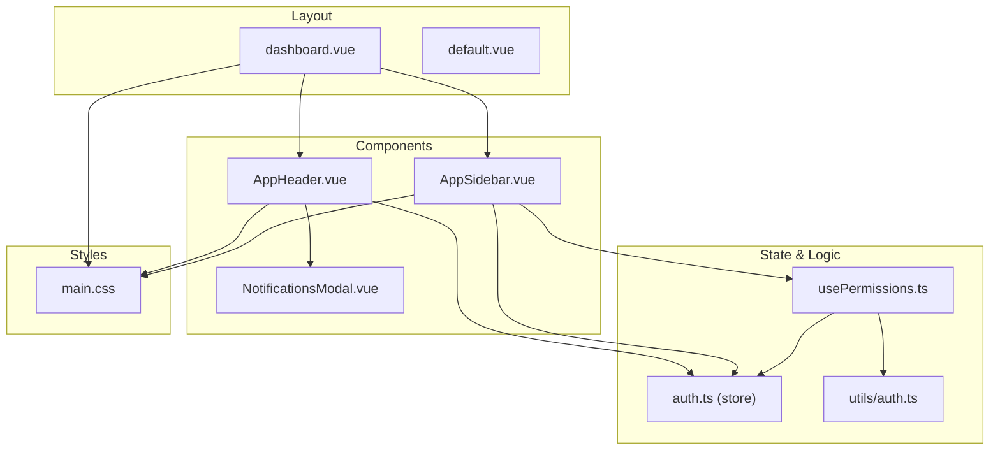
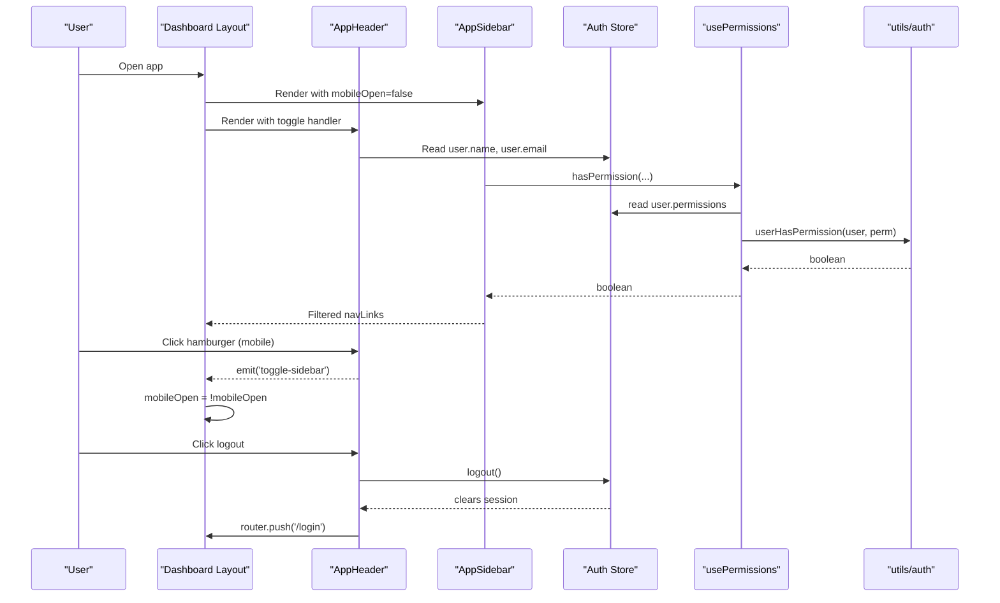
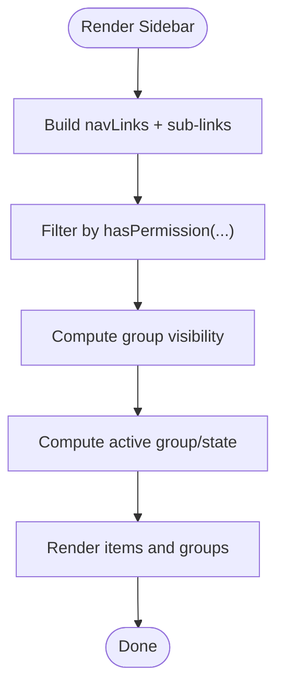
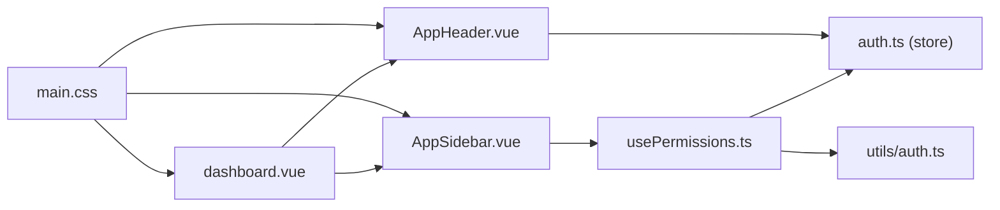

# Layout Components

<cite>
**Referenced Files in This Document**
- [AppSidebar.vue](file://app/components/AppSidebar.vue)
- [AppHeader.vue](file://app/components/AppHeader.vue)
- [dashboard.vue](file://app/layouts/dashboard.vue)
- [default.vue](file://app/layouts/default.vue)
- [auth.ts](file://app/stores/auth.ts)
- [usePermissions.ts](file://app/composables/usePermissions.ts)
- [auth.ts](file://app/utils/auth.ts)
- [NotificationsModal.vue](file://app/components/NotificationsModal.vue)
- [main.css](file://app/assets/css/main.css)
</cite>

## Table of Contents
1. [Introduction](#introduction)
2. [Project Structure](#project-structure)
3. [Core Components](#core-components)
4. [Architecture Overview](#architecture-overview)
5. [Detailed Component Analysis](#detailed-component-analysis)
6. [Dependency Analysis](#dependency-analysis)
7. [Performance Considerations](#performance-considerations)
8. [Troubleshooting Guide](#troubleshooting-guide)
9. [Conclusion](#conclusion)

## Introduction
This document explains the layout components that form the main application shell: AppSidebar for navigation and AppHeader for user controls. It covers how the sidebar collapses, filters navigation by permissions, behaves on mobile, and integrates with the authentication store. It also documents the header’s user profile display, notification system integration points, and responsive design patterns. Finally, it provides props, events, slots, customization options, and examples of how these components work together to create the primary dashboard layout.

## Project Structure
The layout is composed of a dashboard layout that composes AppSidebar and AppHeader, with global CSS handling responsive behavior and a permission system driven by the auth store and utilities.

**Diagram sources**
- [dashboard.vue:1-25](file://app/layouts/dashboard.vue#L1-L25)
- [default.vue:1-6](file://app/layouts/default.vue#L1-L6)
- [AppSidebar.vue:1-319](file://app/components/AppSidebar.vue#L1-L319)
- [AppHeader.vue:1-94](file://app/components/AppHeader.vue#L1-L94)
- [NotificationsModal.vue:1-210](file://app/components/NotificationsModal.vue#L1-L210)
- [auth.ts](file://app/stores/auth.ts)
- [usePermissions.ts:1-43](file://app/composables/usePermissions.ts#L1-L43)
- [auth.ts](file://app/utils/auth.ts)
- [main.css:1-206](file://app/assets/css/main.css#L1-L206)

**Section sources**
- [dashboard.vue:1-25](file://app/layouts/dashboard.vue#L1-L25)
- [default.vue:1-6](file://app/layouts/default.vue#L1-L6)
- [AppSidebar.vue:1-319](file://app/components/AppSidebar.vue#L1-L319)
- [AppHeader.vue:1-94](file://app/components/AppHeader.vue#L1-L94)
- [auth.ts](file://app/stores/auth.ts)
- [usePermissions.ts:1-43](file://app/composables/usePermissions.ts#L1-L43)
- [auth.ts](file://app/utils/auth.ts)
- [NotificationsModal.vue:1-210](file://app/components/NotificationsModal.vue#L1-L210)
- [main.css:1-206](file://app/assets/css/main.css#L1-L206)

## Core Components
- AppSidebar: Collapsible navigation with permission-based filtering, grouped sections, active state, and a user footer.
- AppHeader: Top bar with hamburger toggle (mobile), search input, and user area with logout.
- Dashboard layout: Composes sidebar and header, manages mobile open/close state, and renders page content via slot.

Key responsibilities:
- Sidebar: Renders filtered links based on current user permissions; toggles collapse state; handles group expansion; shows user initials and name/email at the bottom.
- Header: Emits toggle event for mobile sidebar; displays user info from auth store; triggers logout flow.
- Layout: Controls mobile overlay/backdrop and ensures sidebar closes on route change.

**Section sources**
- [AppSidebar.vue:1-319](file://app/components/AppSidebar.vue#L1-L319)
- [AppHeader.vue:1-94](file://app/components/AppHeader.vue#L1-L94)
- [dashboard.vue:1-25](file://app/layouts/dashboard.vue#L1-L25)

## Architecture Overview
The layout architecture centers around a parent layout that wires up state between sidebar and header. The sidebar reads permissions from the auth store through a composable, while the header uses the same store for user data and logout actions. Notifications are available as a modal component integrated into the header via an event-driven pattern.

**Diagram sources**
- [dashboard.vue:1-25](file://app/layouts/dashboard.vue#L1-L25)
- [AppHeader.vue:1-94](file://app/components/AppHeader.vue#L1-L94)
- [AppSidebar.vue:1-319](file://app/components/AppSidebar.vue#L1-L319)
- [auth.ts](file://app/stores/auth.ts)
- [usePermissions.ts:1-43](file://app/composables/usePermissions.ts#L1-L43)
- [auth.ts](file://app/utils/auth.ts)

## Detailed Component Analysis

### AppSidebar
Responsibilities:
- Collapse/expand state persisted across navigations using a shared state key.
- Permission-based filtering of top-level links and sub-groups.
- Active link detection based on route path prefixing.
- Group expansion logic that respects collapsed state.
- Footer showing user initial, name, and email.

Props:
- mobileOpen: boolean — controls visibility on mobile via CSS transform.

Events:
- close: emitted when clicking the backdrop or closing action on mobile.

Slots:
- None.

Computed data:
- navLinks: top-level links filtered by permission.
- managementSubLinks, commsSubLinks: sub-links filtered by permission.
- showManagement, showComms: whether groups should be visible.
- isManagementActive, isCommsActive: active group detection.
- userInitial, userName, userEmail: derived from auth store.

Behavior highlights:
- Collapsed width transitions and icon-only mode.
- Hover states and active indicator styling.
- Watchers expand groups when navigating into their routes.

Integration points:
- useAuthStore for user data.
- usePermissions for permission checks.
- NuxtLink for routing.

Customization options:
- Add/remove entries in navLinks and sub-link arrays.
- Toggle group visibility by editing computed flags.
- Adjust collapsed width and colors via inline styles or extracted CSS variables.

Example usage:
- Used within the dashboard layout with mobileOpen bound to layout state and @close handled to hide the sidebar.

**Section sources**
- [AppSidebar.vue:1-319](file://app/components/AppSidebar.vue#L1-L319)
- [usePermissions.ts:1-43](file://app/composables/usePermissions.ts#L1-L43)
- [auth.ts](file://app/stores/auth.ts)

#### Sidebar Navigation Filtering Flow

**Diagram sources**
- [AppSidebar.vue:12-51](file://app/components/AppSidebar.vue#L12-L51)
- [usePermissions.ts:1-43](file://app/composables/usePermissions.ts#L1-L43)
- [auth.ts](file://app/utils/auth.ts)

### AppHeader
Responsibilities:
- Mobile hamburger button to toggle sidebar.
- Search input placeholder (non-functional in this file).
- User area displaying name and role text, avatar with initial, and logout button.
- Placeholder for notifications (modal integration point).

Props:
- None.

Events:
- toggle-sidebar: emitted to allow parent layout to control mobile sidebar.

Slots:
- None.

Computed data:
- userInitial, userName: derived from auth store.

Behavior highlights:
- Logout calls auth store logout, shows success toast, and redirects to login.
- Notification UI is commented out but ready to integrate with NotificationsModal.

Integration points:
- useAuthStore for user data and logout.
- useAppToast for feedback.
- Router for navigation after logout.

Customization options:
- Replace search input behavior with a global search composable.
- Enable notifications by uncommenting the bell button and modal binding.
- Style user text and avatar via CSS classes or theme tokens.

Example usage:
- Placed above the main content in the dashboard layout; emits toggle-sidebar to control mobile sidebar.

**Section sources**
- [AppHeader.vue:1-94](file://app/components/AppHeader.vue#L1-L94)
- [NotificationsModal.vue:1-210](file://app/components/NotificationsModal.vue#L1-L210)
- [auth.ts](file://app/stores/auth.ts)

### Dashboard Layout
Responsibilities:
- Provide full-height flex container with background color.
- Manage mobile sidebar open state and close on route change.
- Render AppSidebar and AppHeader, then a scrollable main area with a slot for pages.

Props:
- None.

Events:
- Handles internal state changes; no external events exposed.

Slots:
- Default slot for page content.

Behavior highlights:
- Backdrop overlay appears on mobile when sidebar is open; clicking backdrop closes it.
- Route watcher resets mobileOpen to false on navigation.

Customization options:
- Adjust padding and spacing in the main area.
- Change background color or add additional header/sidebar behaviors.

**Section sources**
- [dashboard.vue:1-25](file://app/layouts/dashboard.vue#L1-L25)

### Default Layout
A minimal layout wrapper that simply renders its default slot. Useful for non-dashboard pages without sidebar/header.

**Section sources**
- [default.vue:1-6](file://app/layouts/default.vue#L1-L6)

### Notifications Modal
Responsibilities:
- Display a list of notifications with unread indicators, filters, mark-as-read, dismiss, and “mark all read”.
- Close via emitting a close event.

Props:
- None.

Events:
- close: emitted to dismiss the modal.

Slots:
- None.

Integration points:
- Can be conditionally rendered from AppHeader when the bell button is enabled.

**Section sources**
- [NotificationsModal.vue:1-210](file://app/components/NotificationsModal.vue#L1-L210)

## Dependency Analysis
The layout components depend on the auth store and permission utilities. The sidebar computes navigation visibility based on permissions, while the header relies on the store for user data and logout. Global CSS defines responsive breakpoints and mobile behaviors.

**Diagram sources**
- [AppSidebar.vue:1-319](file://app/components/AppSidebar.vue#L1-L319)
- [AppHeader.vue:1-94](file://app/components/AppHeader.vue#L1-L94)
- [dashboard.vue:1-25](file://app/layouts/dashboard.vue#L1-L25)
- [usePermissions.ts:1-43](file://app/composables/usePermissions.ts#L1-L43)
- [auth.ts](file://app/stores/auth.ts)
- [auth.ts](file://app/utils/auth.ts)
- [main.css:1-206](file://app/assets/css/main.css#L1-L206)

**Section sources**
- [AppSidebar.vue:1-319](file://app/components/AppSidebar.vue#L1-L319)
- [AppHeader.vue:1-94](file://app/components/AppHeader.vue#L1-L94)
- [dashboard.vue:1-25](file://app/layouts/dashboard.vue#L1-L25)
- [usePermissions.ts:1-43](file://app/composables/usePermissions.ts#L1-L43)
- [auth.ts](file://app/stores/auth.ts)
- [auth.ts](file://app/utils/auth.ts)
- [main.css:1-206](file://app/assets/css/main.css#L1-L206)

## Performance Considerations
- Computed properties: navLinks and sub-links are computed and filtered once per dependency change, minimizing re-renders.
- Collapsed state: Persisted via a shared state key to avoid unnecessary recomputation on reloads.
- Route watchers: Expand groups only when needed; consider debouncing if many nested groups are added.
- Icons and hover effects: Inline styles are used; extracting to CSS variables can improve maintainability and reduce style churn.
- Notifications modal: Currently static data; when integrating real-time updates, prefer incremental updates and virtualized lists for large datasets.

[No sources needed since this section provides general guidance]

## Troubleshooting Guide
Common issues and resolutions:
- Sidebar not collapsing/expanding:
  - Ensure the shared state key is accessible globally and not overwritten elsewhere.
  - Verify that the collapse toggle click handler is bound and not intercepted by other elements.
- Navigation items missing:
  - Confirm the user has required permissions; admins implicitly have all permissions.
  - Check that the auth store has loaded user permissions before rendering the sidebar.
- Mobile sidebar not opening/closing:
  - Verify the dashboard layout binds mobileOpen and emits/handles toggle-sidebar correctly.
  - Ensure the backdrop click handler sets mobileOpen to false.
- Header user info not updating:
  - Confirm the auth store’s user object is populated and reactive.
  - After logout, ensure the router navigates away from protected routes.
- Notifications modal not appearing:
  - If enabling the bell button, ensure the modal is conditionally rendered and emits close properly.

**Section sources**
- [AppSidebar.vue:1-319](file://app/components/AppSidebar.vue#L1-L319)
- [AppHeader.vue:1-94](file://app/components/AppHeader.vue#L1-L94)
- [dashboard.vue:1-25](file://app/layouts/dashboard.vue#L1-L25)
- [auth.ts](file://app/stores/auth.ts)
- [usePermissions.ts:1-43](file://app/composables/usePermissions.ts#L1-L43)
- [auth.ts](file://app/utils/auth.ts)
- [NotificationsModal.vue:1-210](file://app/components/NotificationsModal.vue#L1-L210)

## Conclusion
The layout components provide a robust foundation for the application’s main shell. AppSidebar offers flexible, permission-aware navigation with collapsible behavior and mobile support. AppHeader centralizes user controls and integrates seamlessly with the auth store. Together with the dashboard layout and global responsive styles, they deliver a consistent, accessible experience across devices. Extensibility points include adding new navigation entries, enabling notifications, and customizing visual themes via CSS variables.