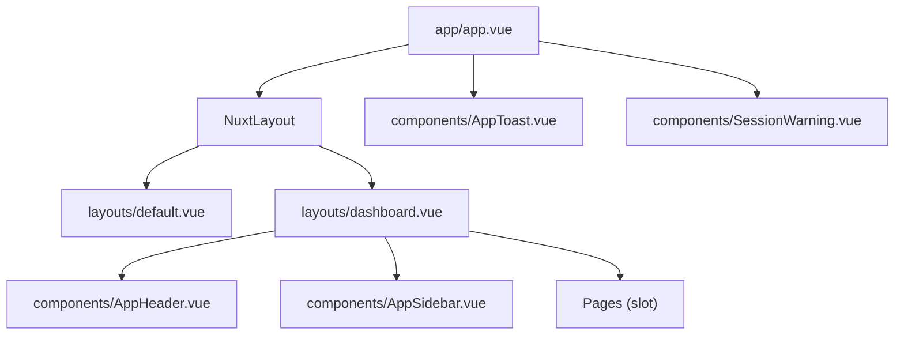
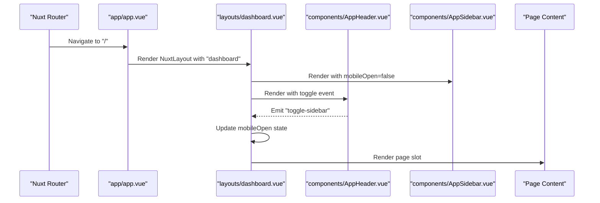
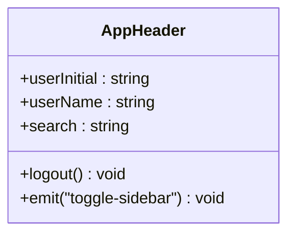
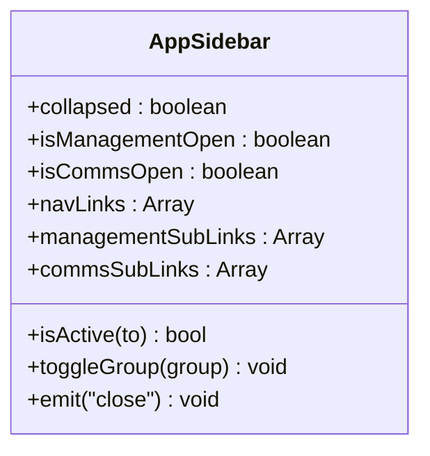
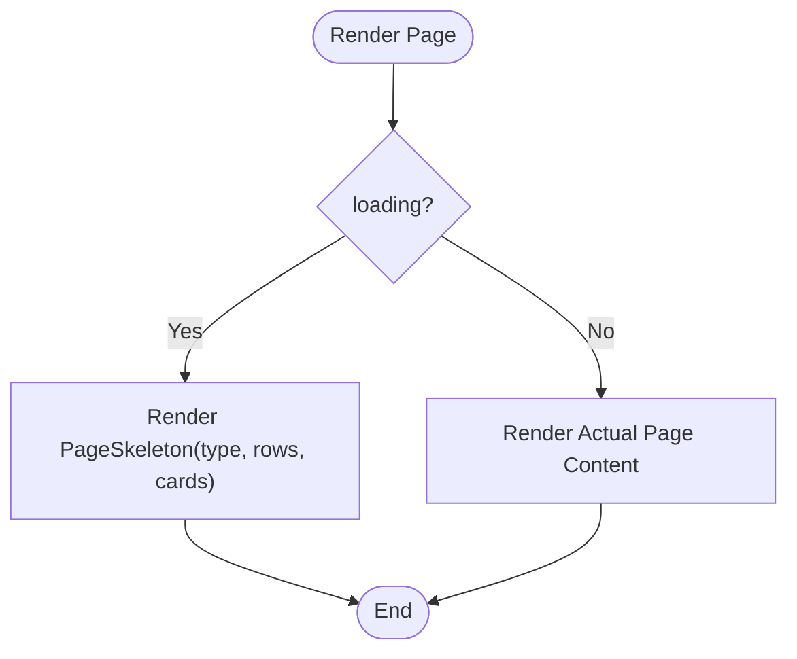
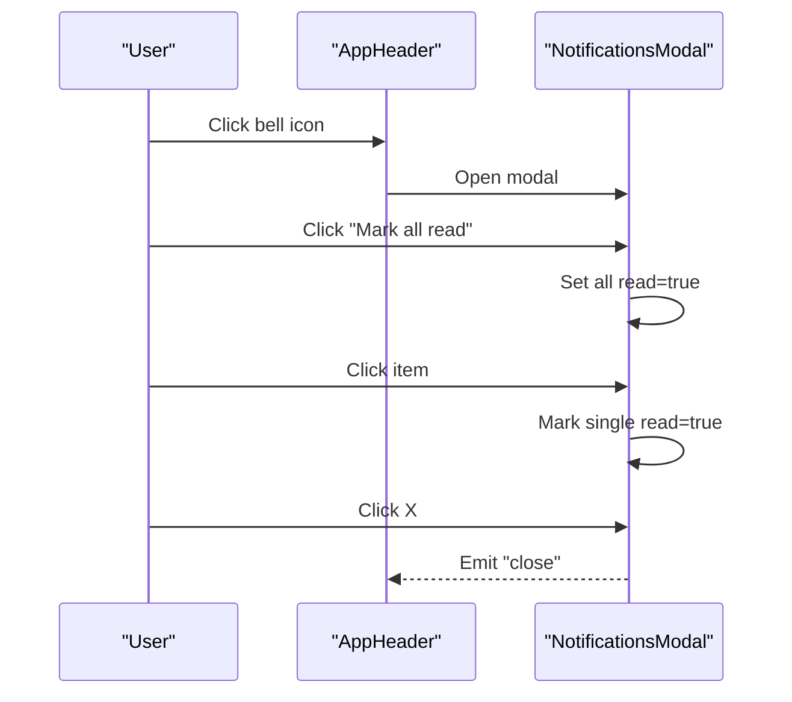
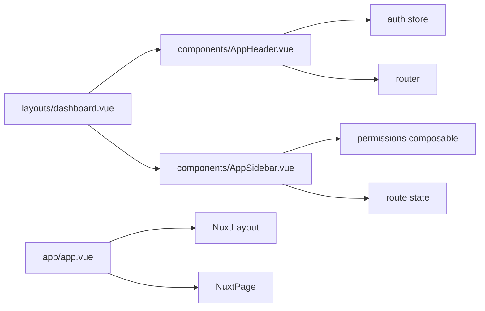

# Layout Components

<cite>
**Referenced Files in This Document**
- [app.vue](file://app/app.vue)
- [default.vue](file://app/layouts/default.vue)
- [dashboard.vue](file://app/layouts/dashboard.vue)
- [AppHeader.vue](file://app/components/AppHeader.vue)
- [AppSidebar.vue](file://app/components/AppSidebar.vue)
- [PageSkeleton.vue](file://app/components/PageSkeleton.vue)
- [NotificationsModal.vue](file://app/components/NotificationsModal.vue)
- [AppSearch.vue](file://app/components/AppSearch.vue)
- [main.css](file://app/assets/css/main.css)
- [index.vue](file://app/pages/index.vue)
</cite>

## Table of Contents
1. [Introduction](#introduction)
2. [Project Structure](#project-structure)
3. [Core Components](#core-components)
4. [Architecture Overview](#architecture-overview)
5. [Detailed Component Analysis](#detailed-component-analysis)
6. [Dependency Analysis](#dependency-analysis)
7. [Performance Considerations](#performance-considerations)
8. [Troubleshooting Guide](#troubleshooting-guide)
9. [Conclusion](#conclusion)
10. [Appendices](#appendices)

## Introduction
This document explains the layout system used across the application, focusing on:
- Application header with user profile display and search
- Notification system integration points
- PageSkeleton for loading states and placeholder content
- Layout composition patterns and responsive breakpoints
- Integration with sidebar navigation
- Examples for custom layouts, breadcrumb navigation, page transitions, and layout-specific state
- Performance considerations, SEO implications, and accessibility compliance

The goal is to provide a clear, practical guide for building consistent, accessible, and performant layouts using the existing components.

## Project Structure
Layouts are defined under app/layouts and composed by pages via Nuxt’s layout system. The root app shell wraps everything with global UI and accessibility helpers.

**Diagram sources**
- [app.vue:15-18](file://app/app.vue#L15-L18)
- [default.vue:1-6](file://app/layouts/default.vue#L1-L6)
- [dashboard.vue:1-25](file://app/layouts/dashboard.vue#L1-L25)

**Section sources**
- [app.vue:1-33](file://app/app.vue#L1-L33)
- [default.vue:1-6](file://app/layouts/default.vue#L1-L6)
- [dashboard.vue:1-25](file://app/layouts/dashboard.vue#L1-L25)

## Core Components
- AppHeader: Top bar with hamburger toggle (mobile), search input, and user profile actions including logout. Emits events to control sidebar state.
- AppSidebar: Collapsible navigation with permission-based visibility, active route detection, and mobile overlay behavior.
- PageSkeleton: Full-page skeleton placeholders for multiple content types (table, detail, dashboard, card-grid, tracking).
- NotificationsModal: Modal for displaying notifications with filtering and read/unread management.
- AppSearch: Reusable search input component with v-model binding.

Key responsibilities:
- Header manages user context and emits sidebar toggle events.
- Sidebar renders navigation links filtered by permissions and handles collapse/open state.
- Skeleton provides consistent loading UX across pages.
- Notifications modal offers a centralized notification experience.
- Search component standardizes search input styling and behavior.

**Section sources**
- [AppHeader.vue:1-94](file://app/components/AppHeader.vue#L1-L94)
- [AppSidebar.vue:1-319](file://app/components/AppSidebar.vue#L1-L319)
- [PageSkeleton.vue:1-300](file://app/components/PageSkeleton.vue#L1-L300)
- [NotificationsModal.vue:1-210](file://app/components/NotificationsModal.vue#L1-L210)
- [AppSearch.vue:1-25](file://app/components/AppSearch.vue#L1-L25)

## Architecture Overview
The dashboard layout composes the header and sidebar around a scrollable main area. Pages opt into the dashboard layout via page metadata. The root app shell injects global UI and accessibility elements.

**Diagram sources**
- [dashboard.vue:1-25](file://app/layouts/dashboard.vue#L1-L25)
- [AppHeader.vue:1-94](file://app/components/AppHeader.vue#L1-L94)
- [index.vue:1-10](file://app/pages/index.vue#L1-L10)

## Detailed Component Analysis

### AppHeader
Responsibilities:
- Displays user name and initial avatar derived from auth store.
- Provides a search input (local ref) and a hamburger button that emits a sidebar toggle event.
- Implements logout flow using auth store and router navigation.

Integration points:
- Emits 'toggle-sidebar' to control mobile sidebar open/close.
- Uses auth store for user data and logout action.
- Uses toast utility for success feedback after logout.

Responsive behavior:
- Hamburger visible on small screens; search hidden on very small screens per CSS rules.

Accessibility notes:
- Buttons include titles where appropriate.
- Focus styles are applied inline for visual clarity.

**Section sources**
- [AppHeader.vue:1-94](file://app/components/AppHeader.vue#L1-L94)
- [main.css:175-197](file://app/assets/css/main.css#L175-L197)

#### Class Diagram

**Diagram sources**
- [AppHeader.vue:1-94](file://app/components/AppHeader.vue#L1-L94)

### AppSidebar
Responsibilities:
- Renders top-level navigation links and collapsible groups (Management, Communications).
- Filters links based on permissions.
- Tracks collapsed state persistently and expands groups when needed.
- Highlights active routes and supports mobile overlay with backdrop.

State and interactions:
- Uses useState for collapsed state persistence.
- Watches route changes to auto-open relevant groups.
- Emits close event to allow parent to manage mobile overlay.

Responsive behavior:
- Fixed overlay on mobile with transform translateX for slide-in/out.
- Backdrop click closes sidebar.

Accessibility notes:
- Links use NuxtLink for semantic navigation.
- Titles provided for collapsed items.

**Section sources**
- [AppSidebar.vue:1-319](file://app/components/AppSidebar.vue#L1-L319)
- [main.css:181-197](file://app/assets/css/main.css#L181-L197)

#### Class Diagram

**Diagram sources**
- [AppSidebar.vue:1-319](file://app/components/AppSidebar.vue#L1-L319)

### PageSkeleton
Responsibilities:
- Provides full-page loading skeletons for different content types: table, detail, dashboard, card-grid, tracking.
- Accepts props to customize number of rows/cards.

Usage pattern:
- Show skeleton while data loads, then render actual content.

Styling:
- Uses shimmer animation defined in global CSS.

**Section sources**
- [PageSkeleton.vue:1-300](file://app/components/PageSkeleton.vue#L1-L300)
- [main.css:18-36](file://app/assets/css/main.css#L18-L36)

#### Flowchart

**Diagram sources**
- [PageSkeleton.vue:1-300](file://app/components/PageSkeleton.vue#L1-L300)

### NotificationsModal
Responsibilities:
- Displays a list of notifications with filters (All, Unread).
- Supports marking individual or all notifications as read.
- Allows dismissing notifications.

Integration points:
- Can be toggled from header (currently commented out in header template).
- Emits close event to dismiss modal.

Accessibility notes:
- Clicking outside the modal closes it.
- Clear labels and roles can be added for screen readers if needed.

**Section sources**
- [NotificationsModal.vue:1-210](file://app/components/NotificationsModal.vue#L1-L210)
- [AppHeader.vue:51-61](file://app/components/AppHeader.vue#L51-L61)

#### Sequence Diagram

**Diagram sources**
- [NotificationsModal.vue:1-210](file://app/components/NotificationsModal.vue#L1-L210)
- [AppHeader.vue:51-61](file://app/components/AppHeader.vue#L51-L61)

### AppSearch
Responsibilities:
- Reusable search input with v-model binding and placeholder customization.
- Inline focus border color change for visual feedback.

Integration points:
- Can be embedded within header or other containers.

**Section sources**
- [AppSearch.vue:1-25](file://app/components/AppSearch.vue#L1-L25)

### Layout Composition Patterns
- Default layout: minimal wrapper rendering slot content.
- Dashboard layout: flex container with sidebar, header, and scrollable main area. Mobile uses overlay sidebar and backdrop.

Examples:
- Opt-in to dashboard layout via page metadata.
- Use slots to compose page content inside layouts.

**Section sources**
- [default.vue:1-6](file://app/layouts/default.vue#L1-L6)
- [dashboard.vue:1-25](file://app/layouts/dashboard.vue#L1-L25)
- [index.vue:1-10](file://app/pages/index.vue#L1-L10)

### Responsive Breakpoints
Global CSS defines:
- Tablet breakpoint at ≤1024px: grid columns reduce, map/billing grids stack.
- Mobile breakpoint at ≤640px: grids become single column, header search hides, hamburger shows, sidebar becomes fixed overlay.
- Very small screens at ≤480px: hide user text in header.

Practical guidance:
- Prefer grid utilities (.grid-cols-*, .grid-map) for consistent layouts.
- Use media queries sparingly; rely on utility classes where possible.

**Section sources**
- [main.css:86-159](file://app/assets/css/main.css#L86-L159)
- [main.css:199-206](file://app/assets/css/main.css#L199-L206)

### Creating Custom Layouts
Steps:
- Create a new file under app/layouts (e.g., wide.vue).
- Compose header/sidebar/main areas using flex/grid as needed.
- Apply mobile overlay logic similar to dashboard layout if sidebar is included.
- Reference the layout from pages using definePageMeta.

Example reference:
- See how index.vue opts into the dashboard layout.

**Section sources**
- [index.vue:1-10](file://app/pages/index.vue#L1-L10)
- [dashboard.vue:1-25](file://app/layouts/dashboard.vue#L1-L25)

### Implementing Breadcrumb Navigation
Approach:
- Add a breadcrumb section above the main content in the layout or page.
- Derive segments from route.path to build hierarchical links.
- Ensure each segment is a NuxtLink with proper aria-labels.

Guidance:
- Keep breadcrumbs concise and avoid deep nesting.
- Highlight the current page segment without making it clickable.

[No sources needed since this section doesn't analyze specific files]

### Handling Page Transitions
Recommendations:
- Use Nuxt’s built-in transition features for smooth page changes.
- Avoid heavy animations during navigation to maintain performance.
- Combine with skeleton loaders to mask network latency.

[No sources needed since this section doesn't analyze specific files]

### Managing Layout-Specific State
Patterns:
- Use reactive refs in layout components for local state (e.g., mobileOpen).
- Persist persistent UI preferences (e.g., sidebarCollapsed) with useState.
- Watch route changes to reset or adjust layout state (e.g., closing sidebar on navigation).

**Section sources**
- [dashboard.vue:20-24](file://app/layouts/dashboard.vue#L20-L24)
- [AppSidebar.vue:9](file://app/components/AppSidebar.vue#L9)

## Dependency Analysis
High-level relationships:
- Dashboard layout depends on AppHeader and AppSidebar.
- AppHeader depends on auth store and router.
- AppSidebar depends on permissions and route state.
- Root app shell includes global UI and accessibility announcer.

**Diagram sources**
- [dashboard.vue:1-25](file://app/layouts/dashboard.vue#L1-L25)
- [AppHeader.vue:1-94](file://app/components/AppHeader.vue#L1-L94)
- [AppSidebar.vue:1-319](file://app/components/AppSidebar.vue#L1-L319)
- [app.vue:15-18](file://app/app.vue#L15-L18)

**Section sources**
- [dashboard.vue:1-25](file://app/layouts/dashboard.vue#L1-L25)
- [AppHeader.vue:1-94](file://app/components/AppHeader.vue#L1-L94)
- [AppSidebar.vue:1-319](file://app/components/AppSidebar.vue#L1-L319)
- [app.vue:1-33](file://app/app.vue#L1-L33)

## Performance Considerations
- Minimize re-renders in header and sidebar by leveraging computed properties and memoization.
- Use skeleton placeholders to improve perceived performance during data fetching.
- Avoid heavy DOM manipulations in mobile sidebar; prefer CSS transforms for sliding.
- Defer non-critical UI updates until after initial paint.
- Keep header search input lightweight; debounce any downstream processing.

[No sources needed since this section provides general guidance]

## Troubleshooting Guide
Common issues:
- Sidebar not closing on mobile navigation: ensure route watcher resets mobileOpen state.
- Header search not responding: verify v-model binding and focus style handlers.
- Notifications modal not opening: confirm trigger button is enabled and modal emits close correctly.
- Permission-driven links missing: check permission flags and filter logic in sidebar.

Debugging tips:
- Log route path changes in layout watchers.
- Inspect computed link arrays in sidebar to validate permission filtering.
- Verify toast messages appear after logout to confirm auth store actions.

**Section sources**
- [dashboard.vue:20-24](file://app/layouts/dashboard.vue#L20-L24)
- [AppHeader.vue:17-22](file://app/components/AppHeader.vue#L17-L22)
- [AppSidebar.vue:12-24](file://app/components/AppSidebar.vue#L12-L24)

## Conclusion
The layout system centers around a reusable dashboard layout that composes a header, sidebar, and main content area. AppHeader provides user controls and search, AppSidebar delivers permission-aware navigation, and PageSkeleton ensures consistent loading experiences. Global CSS establishes responsive breakpoints and shared utilities. By following the patterns outlined here—layout composition, responsive design, and accessibility—you can extend the system with custom layouts, breadcrumbs, transitions, and layout-specific state while maintaining performance and usability.

[No sources needed since this section summarizes without analyzing specific files]

## Appendices

### Accessibility Compliance Checklist
- Provide meaningful titles and labels for interactive elements.
- Ensure keyboard navigability for header actions and sidebar links.
- Use semantic HTML (header, nav, main) and ARIA attributes where necessary.
- Include NuxtRouteAnnouncer for route announcements.

**Section sources**
- [app.vue:8-10](file://app/app.vue#L8-L10)
- [AppHeader.vue:79-87](file://app/components/AppHeader.vue#L79-L87)
- [AppSidebar.vue:139-178](file://app/components/AppSidebar.vue#L139-L178)

### SEO Implications of Layout Strategies
- Prefer server-rendered layouts to ensure content is available to crawlers.
- Avoid hiding critical content behind client-only toggles.
- Keep meta tags and structured data at the page level rather than layout level for clarity.

[No sources needed since this section provides general guidance]