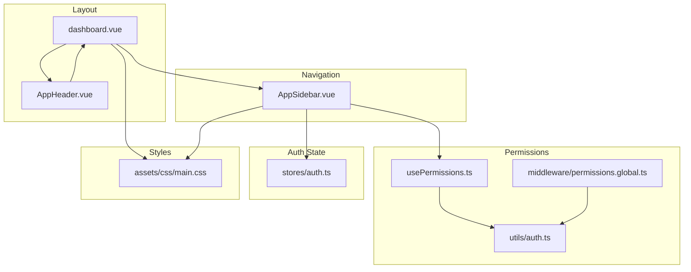
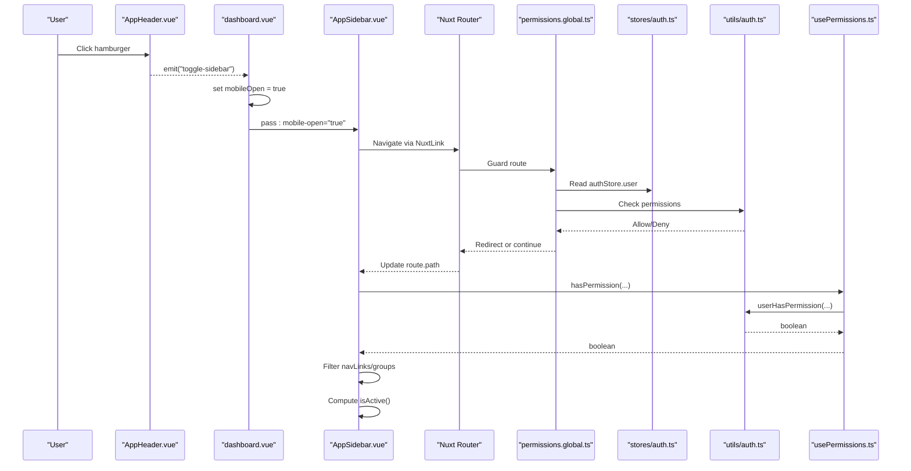
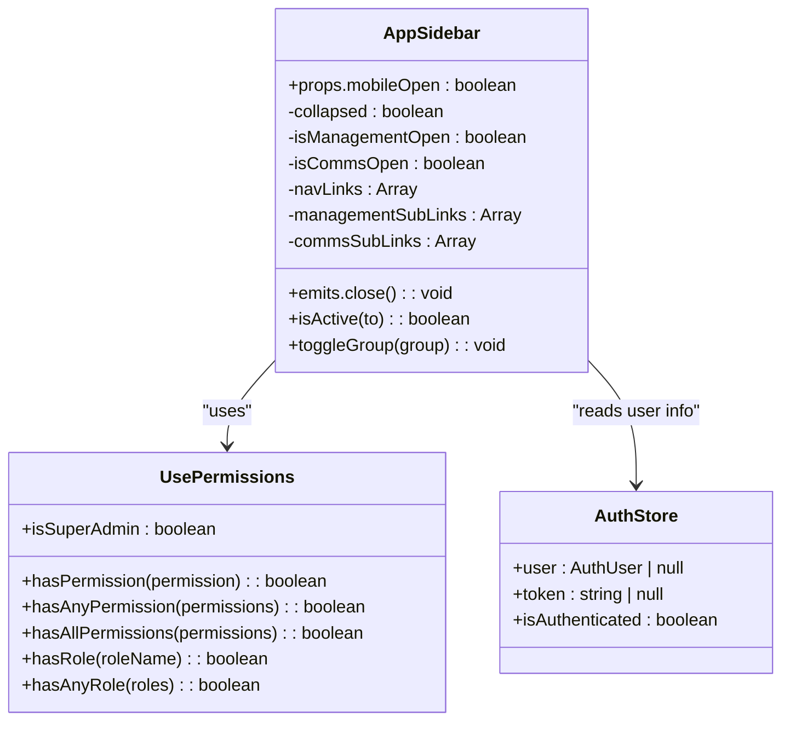
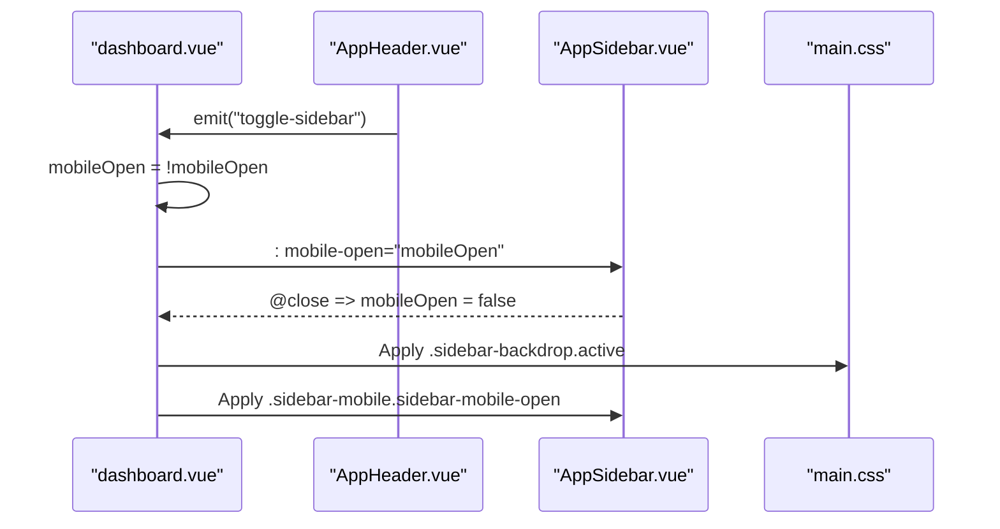
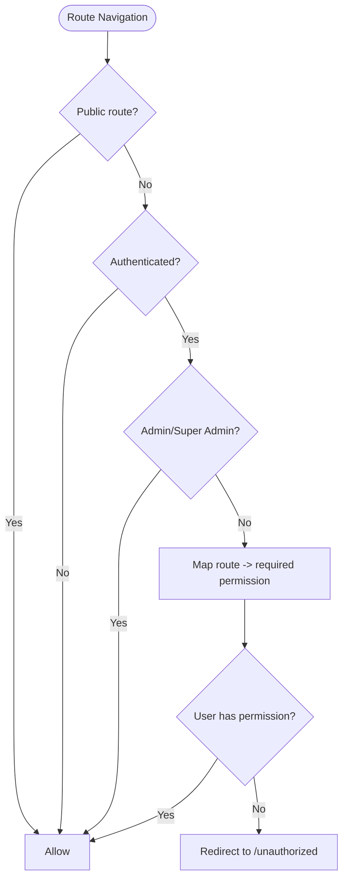
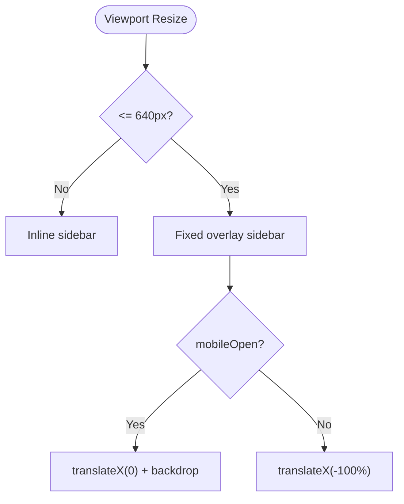
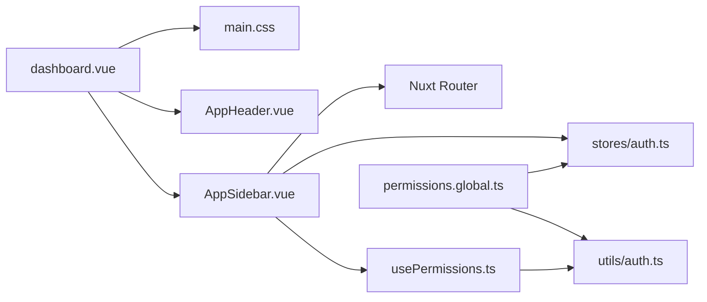

# Navigation Components

<cite>
**Referenced Files in This Document**
- [AppSidebar.vue](file://app/components/AppSidebar.vue)
- [dashboard.vue](file://app/layouts/dashboard.vue)
- [AppHeader.vue](file://app/components/AppHeader.vue)
- [usePermissions.ts](file://app/composables/usePermissions.ts)
- [permissions.global.ts](file://app/middleware/permissions.global.ts)
- [auth.ts](file://app/utils/auth.ts)
- [auth.ts (store)](file://app/stores/auth.ts)
- [main.css](file://app/assets/css/main.css)
</cite>

## Table of Contents
1. [Introduction](#introduction)
2. [Project Structure](#project-structure)
3. [Core Components](#core-components)
4. [Architecture Overview](#architecture-overview)
5. [Detailed Component Analysis](#detailed-component-analysis)
6. [Dependency Analysis](#dependency-analysis)
7. [Performance Considerations](#performance-considerations)
8. [Troubleshooting Guide](#troubleshooting-guide)
9. [Conclusion](#conclusion)
10. [Appendices](#appendices)

## Introduction
This document explains the navigation system with a focus on the responsive sidebar, permission-based route filtering, and mobile-responsive behavior. It covers the AppSidebar component’s props, events, state management, and navigation link configuration. It also details how permissions are integrated to filter available routes, manage nested groups (Management, Communications), and handle active states. Practical guidance is provided for adding new items, configuring permissions, customizing icons, implementing responsive behavior, accessibility considerations, keyboard navigation, and performance optimization for large navigation trees.

## Project Structure
The navigation system spans several files:
- Sidebar UI and logic: AppSidebar.vue
- Layout orchestration and mobile overlay: dashboard.vue
- Header with hamburger toggle: AppHeader.vue
- Permission utilities: usePermissions.ts and utils/auth.ts
- Route-level permission enforcement: permissions.global.ts
- Auth store providing user data: stores/auth.ts
- Responsive styles: main.css

**Diagram sources**
- [dashboard.vue:1-25](file://app/layouts/dashboard.vue#L1-L25)
- [AppSidebar.vue:1-319](file://app/components/AppSidebar.vue#L1-L319)
- [AppHeader.vue:1-94](file://app/components/AppHeader.vue#L1-L94)
- [usePermissions.ts:1-43](file://app/composables/usePermissions.ts#L1-L43)
- [auth.ts:1-58](file://app/utils/auth.ts#L1-L58)
- [permissions.global.ts:1-59](file://app/middleware/permissions.global.ts#L1-L59)
- [auth.ts (store):1-230](file://app/stores/auth.ts#L1-L230)
- [main.css:1-206](file://app/assets/css/main.css#L1-L206)

**Section sources**
- [dashboard.vue:1-25](file://app/layouts/dashboard.vue#L1-L25)
- [AppSidebar.vue:1-319](file://app/components/AppSidebar.vue#L1-L319)
- [AppHeader.vue:1-94](file://app/components/AppHeader.vue#L1-L94)
- [usePermissions.ts:1-43](file://app/composables/usePermissions.ts#L1-L43)
- [auth.ts:1-58](file://app/utils/auth.ts#L1-L58)
- [permissions.global.ts:1-59](file://app/middleware/permissions.global.ts#L1-L59)
- [auth.ts (store):1-230](file://app/stores/auth.ts#L1-L230)
- [main.css:1-206](file://app/assets/css/main.css#L1-L206)

## Core Components
- AppSidebar.vue: Renders the sidebar, manages collapsed state, renders top-level links and nested groups, applies active styling, and handles mobile open/close via props and events.
- dashboard.vue: Hosts the sidebar, provides mobile backdrop, toggles mobileOpen based on header actions, and resets mobileOpen on navigation.
- AppHeader.vue: Provides the hamburger button that emits an event to toggle the sidebar on mobile.
- usePermissions.ts: Composable exposing hasPermission, hasAnyPermission, hasAllPermissions, hasRole, hasAnyRole, isSuperAdmin.
- utils/auth.ts: Low-level helpers for role normalization, admin checks, and permission checks.
- middleware/permissions.global.ts: Enforces route-level permissions by mapping paths to required permissions.
- stores/auth.ts: Holds user, token, and session state; augments user with role and permissions after profile fetch.
- main.css: Defines responsive breakpoints, mobile sidebar overlay/backdrop, and transitions.

Key behaviors:
- Collapsed state persists across navigations using a shared state key.
- Top-level links and nested groups are filtered by permissions before rendering.
- Active state is computed from current route path prefixes.
- Mobile mode uses fixed positioning and transform transitions controlled by CSS classes.

**Section sources**
- [AppSidebar.vue:1-319](file://app/components/AppSidebar.vue#L1-L319)
- [dashboard.vue:1-25](file://app/layouts/dashboard.vue#L1-L25)
- [AppHeader.vue:1-94](file://app/components/AppHeader.vue#L1-L94)
- [usePermissions.ts:1-43](file://app/composables/usePermissions.ts#L1-L43)
- [auth.ts:1-58](file://app/utils/auth.ts#L1-L58)
- [permissions.global.ts:1-59](file://app/middleware/permissions.global.ts#L1-L59)
- [auth.ts (store):1-230](file://app/stores/auth.ts#L1-L230)
- [main.css:1-206](file://app/assets/css/main.css#L1-L206)

## Architecture Overview
The navigation architecture integrates UI, state, and security layers:
- UI layer: AppSidebar and layout components render navigation and respond to user interactions.
- State layer: Auth store provides user context; sidebar maintains local collapsed state.
- Security layer: Permissions composable and middleware enforce access at both UI and route levels.
- Styling layer: CSS defines responsive behavior and transitions.

**Diagram sources**
- [AppHeader.vue:1-94](file://app/components/AppHeader.vue#L1-L94)
- [dashboard.vue:1-25](file://app/layouts/dashboard.vue#L1-L25)
- [AppSidebar.vue:1-319](file://app/components/AppSidebar.vue#L1-L319)
- [permissions.global.ts:1-59](file://app/middleware/permissions.global.ts#L1-L59)
- [auth.ts (store):1-230](file://app/stores/auth.ts#L1-L230)
- [auth.ts:1-58](file://app/utils/auth.ts#L1-L58)
- [usePermissions.ts:1-43](file://app/composables/usePermissions.ts#L1-L43)

## Detailed Component Analysis

### AppSidebar Component
Responsibilities:
- Props and Events:
  - Prop: mobileOpen (boolean) controls visibility on mobile.
  - Event: close emitted when needed (e.g., clicking outside or navigating away).
- State Management:
  - collapsed: persisted via shared state key to remember expanded/collapsed across navigations.
  - Group open states: per-group booleans for Management and Communications.
  - Active detection: computed from route.path prefix matching.
- Navigation Configuration:
  - Top-level links array with label, icon, to, and optional permission.
  - Nested groups: Management and Communications sub-links arrays with permission requirements.
  - Visibility control: groups only shown if at least one sub-link passes permission checks.
- Interaction:
  - Toggle group expansion when collapsed, auto-expand target group on click.
  - Hover effects and active indicator styling.
  - Footer shows user initials/name/email derived from auth store.

**Diagram sources**
- [AppSidebar.vue:1-319](file://app/components/AppSidebar.vue#L1-L319)
- [usePermissions.ts:1-43](file://app/composables/usePermissions.ts#L1-L43)
- [auth.ts (store):1-230](file://app/stores/auth.ts#L1-L230)

**Section sources**
- [AppSidebar.vue:1-319](file://app/components/AppSidebar.vue#L1-L319)

### Layout Integration (dashboard.vue)
Responsibilities:
- Maintains mobileOpen state and closes it on route changes.
- Renders backdrop overlay for mobile and forwards close event to AppSidebar.
- Passes mobileOpen prop to AppSidebar and listens for close event.

**Diagram sources**
- [dashboard.vue:1-25](file://app/layouts/dashboard.vue#L1-L25)
- [AppHeader.vue:1-94](file://app/components/AppHeader.vue#L1-L94)
- [main.css:166-197](file://app/assets/css/main.css#L166-L197)

**Section sources**
- [dashboard.vue:1-25](file://app/layouts/dashboard.vue#L1-L25)
- [AppHeader.vue:1-94](file://app/components/AppHeader.vue#L1-L94)
- [main.css:166-197](file://app/assets/css/main.css#L166-L197)

### Permission System Integration
- usePermissions.ts exposes functions to check permissions and roles against the current user in the auth store.
- utils/auth.ts implements core checks:
  - Admin users implicitly have all permissions.
  - Role normalization supports string or object shapes.
  - Permission extraction returns the user’s permissions array.
- middleware/permissions.global.ts enforces route-level access:
  - Public routes bypass checks.
  - Admin/Super Admin bypass checks.
  - Otherwise, maps route prefixes to required permissions and redirects to unauthorized page if missing.

**Diagram sources**
- [permissions.global.ts:1-59](file://app/middleware/permissions.global.ts#L1-L59)
- [auth.ts:1-58](file://app/utils/auth.ts#L1-L58)

**Section sources**
- [usePermissions.ts:1-43](file://app/composables/usePermissions.ts#L1-L43)
- [auth.ts:1-58](file://app/utils/auth.ts#L1-L58)
- [permissions.global.ts:1-59](file://app/middleware/permissions.global.ts#L1-L59)

### Responsive Behavior
- Desktop: Sidebar inline with content; width controlled by collapsed state.
- Tablet/Mobile: Sidebar becomes a fixed overlay with slide-in/out transitions.
- Backdrop: Semi-transparent overlay appears behind the sidebar on mobile.
- Header: Hamburger button visible on small screens to toggle sidebar.

**Diagram sources**
- [main.css:175-197](file://app/assets/css/main.css#L175-L197)
- [dashboard.vue:1-25](file://app/layouts/dashboard.vue#L1-L25)
- [AppHeader.vue:1-94](file://app/components/AppHeader.vue#L1-L94)

**Section sources**
- [main.css:166-197](file://app/assets/css/main.css#L166-L197)
- [dashboard.vue:1-25](file://app/layouts/dashboard.vue#L1-L25)
- [AppHeader.vue:1-94](file://app/components/AppHeader.vue#L1-L94)

## Dependency Analysis
- AppSidebar depends on:
  - usePermissions for filtering links and groups.
  - Auth store for user display data.
  - Nuxt router for active state computation and navigation.
- Layout depends on:
  - AppSidebar and AppHeader for UI composition.
  - CSS for responsive behavior.
- Permissions middleware depends on:
  - Auth store and utils/auth for authorization decisions.
- Auth store depends on:
  - API endpoints for session/profile and runtime config.

**Diagram sources**
- [AppSidebar.vue:1-319](file://app/components/AppSidebar.vue#L1-L319)
- [usePermissions.ts:1-43](file://app/composables/usePermissions.ts#L1-L43)
- [auth.ts (store):1-230](file://app/stores/auth.ts#L1-L230)
- [dashboard.vue:1-25](file://app/layouts/dashboard.vue#L1-L25)
- [AppHeader.vue:1-94](file://app/components/AppHeader.vue#L1-L94)
- [main.css:1-206](file://app/assets/css/main.css#L1-L206)
- [auth.ts:1-58](file://app/utils/auth.ts#L1-L58)
- [permissions.global.ts:1-59](file://app/middleware/permissions.global.ts#L1-L59)

**Section sources**
- [AppSidebar.vue:1-319](file://app/components/AppSidebar.vue#L1-L319)
- [usePermissions.ts:1-43](file://app/composables/usePermissions.ts#L1-L43)
- [auth.ts (store):1-230](file://app/stores/auth.ts#L1-L230)
- [dashboard.vue:1-25](file://app/layouts/dashboard.vue#L1-L25)
- [AppHeader.vue:1-94](file://app/components/AppHeader.vue#L1-L94)
- [main.css:1-206](file://app/assets/css/main.css#L1-L206)
- [auth.ts:1-58](file://app/utils/auth.ts#L1-L58)
- [permissions.global.ts:1-59](file://app/middleware/permissions.global.ts#L1-L59)

## Performance Considerations
- Computed Filtering:
  - navLinks, managementSubLinks, and commsSubLinks are computed and filtered by permissions. This ensures minimal re-renders when permissions change.
- Collapsed State Persistence:
  - Using a shared state key avoids unnecessary recomputation and preserves UX across navigations.
- Active State Optimization:
  - isActive uses simple string prefix checks; consider memoization if the number of links grows significantly.
- Large Navigation Trees:
  - Virtualize or paginate sub-links if groups become very large.
  - Defer heavy computations until groups are opened.
- CSS Transitions:
  - Keep transition durations short to maintain responsiveness.
- Middleware Efficiency:
  - Route permission mapping is O(n) over entries; keep mappings concise and grouped by prefixes.

[No sources needed since this section provides general guidance]

## Troubleshooting Guide
Common issues and resolutions:
- Links not visible:
  - Ensure the user has the required permission for each link/group. Verify permissions are loaded into the auth store before rendering.
- Route blocked unexpectedly:
  - Confirm the route prefix exists in the middleware permission map and matches the intended permission.
- Mobile sidebar not closing:
  - Verify the close event is handled in the layout and that mobileOpen is reset on navigation.
- Active state incorrect:
  - Check isActive implementation and ensure route paths align with link targets.
- Icons not showing:
  - Validate icon names used in link configurations match available icon sets.

**Section sources**
- [AppSidebar.vue:1-319](file://app/components/AppSidebar.vue#L1-L319)
- [permissions.global.ts:1-59](file://app/middleware/permissions.global.ts#L1-L59)
- [dashboard.vue:1-25](file://app/layouts/dashboard.vue#L1-L25)

## Conclusion
The navigation system combines a flexible, permission-aware sidebar with robust route-level guards and responsive design. The AppSidebar component centralizes navigation configuration and interaction, while the permission system ensures consistent access control across UI and routing. With careful attention to performance and accessibility, the system scales well for complex applications.

[No sources needed since this section summarizes without analyzing specific files]

## Appendices

### Adding New Navigation Items
- Add a top-level link:
  - Include a new entry in the top-level links array with label, icon, to, and optional permission.
- Add a nested item:
  - Add a new entry under the appropriate sub-links array (e.g., Management or Communications) with label, to, and permission.
- Control group visibility:
  - Groups automatically hide if no sub-links pass permission checks.

**Section sources**
- [AppSidebar.vue:12-46](file://app/components/AppSidebar.vue#L12-L46)

### Configuring Permissions
- Link-level permissions:
  - Set the permission field on each link or sub-link to restrict visibility.
- Route-level permissions:
  - Add route prefixes and required permissions in the global middleware mapping.
- Role-based access:
  - Admin/Super Admin bypasses permission checks for both UI and routes.

**Section sources**
- [AppSidebar.vue:12-46](file://app/components/AppSidebar.vue#L12-L46)
- [permissions.global.ts:32-57](file://app/middleware/permissions.global.ts#L32-L57)
- [auth.ts:22-46](file://app/utils/auth.ts#L22-L46)

### Customizing Icons
- Icon names:
  - Use icon identifiers consistent with your icon library (e.g., Lucide) in the icon field of links.
- Active color:
  - Active links highlight icons with a brand color; hover states adjust background colors.

**Section sources**
- [AppSidebar.vue:167-176](file://app/components/AppSidebar.vue#L167-L176)

### Implementing Responsive Behavior
- Mobile toggle:
  - Use the header hamburger to toggle mobileOpen in the layout.
- Overlay and backdrop:
  - CSS classes apply fixed positioning and transitions for mobile sidebar.
- Close on navigation:
  - Reset mobileOpen when route changes to prevent overlay persistence.

**Section sources**
- [dashboard.vue:1-25](file://app/layouts/dashboard.vue#L1-L25)
- [main.css:175-197](file://app/assets/css/main.css#L175-L197)

### Accessibility Considerations
- Keyboard navigation:
  - Ensure all interactive elements are focusable and operable via keyboard.
  - Provide clear focus indicators for links and buttons.
- ARIA attributes:
  - Add aria-expanded for collapsible groups and aria-label for icons where text is hidden.
- Screen reader support:
  - Use meaningful labels and titles for collapsed states.

[No sources needed since this section provides general guidance]

### Active States and Group Expansion
- Active detection:
  - Uses route.path prefix matching to determine active links and groups.
- Auto-expand:
  - When collapsed, clicking a group expands it and opens the relevant sub-group.

**Section sources**
- [AppSidebar.vue:54-89](file://app/components/AppSidebar.vue#L54-L89)