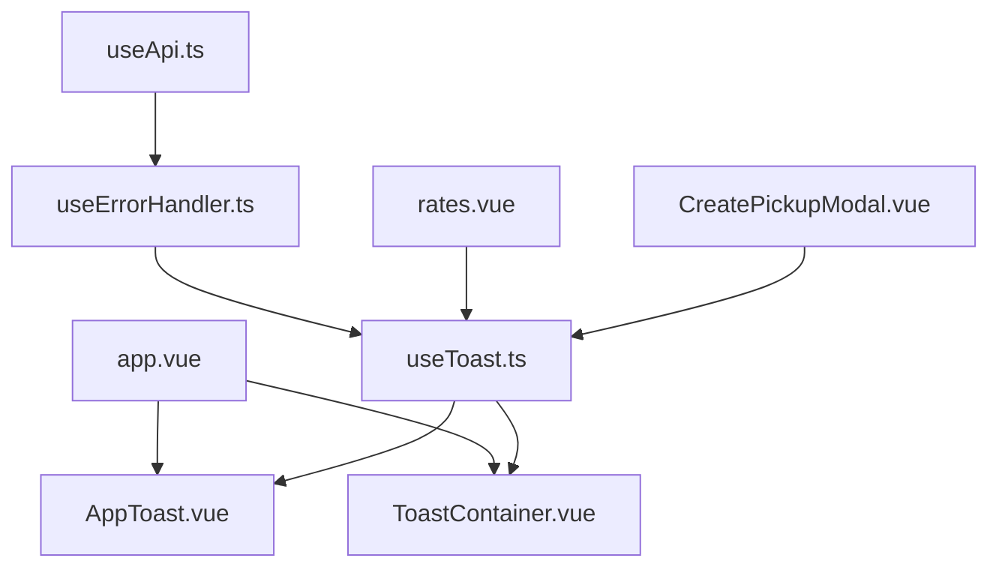
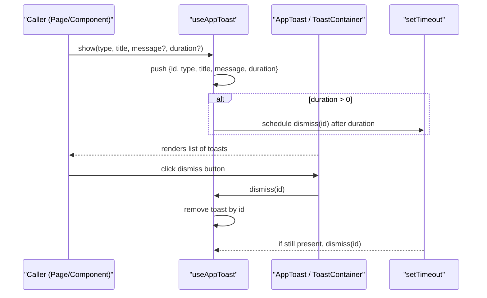
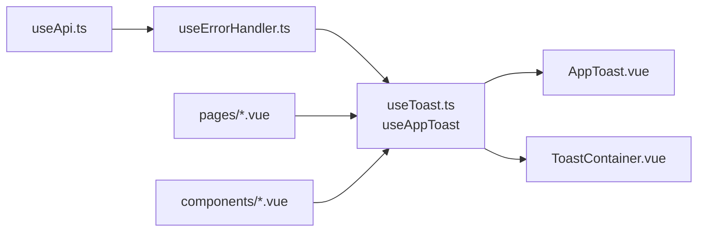

# Notification System

<cite>
**Referenced Files in This Document**
- [app.vue](file://app/app.vue)
- [AppToast.vue](file://app/components/AppToast.vue)
- [ToastContainer.vue](file://app/components/ToastContainer.vue)
- [useToast.ts](file://app/composables/useToast.ts)
- [useApi.ts](file://app/composables/useApi.ts)
- [useErrorHandler.ts](file://app/composables/useErrorHandler.ts)
- [rates.vue](file://app/pages/management/rates.vue)
- [CreatePickupModal.vue](file://app/components/CreatePickupModal.vue)
</cite>

## Table of Contents
1. [Introduction](#introduction)
2. [Project Structure](#project-structure)
3. [Core Components](#core-components)
4. [Architecture Overview](#architecture-overview)
5. [Detailed Component Analysis](#detailed-component-analysis)
6. [Dependency Analysis](#dependency-analysis)
7. [Performance Considerations](#performance-considerations)
8. [Troubleshooting Guide](#troubleshooting-guide)
9. [Conclusion](#conclusion)
10. [Appendices](#appendices)

## Introduction
This document explains the toast notification system used across the application. It covers:
- The AppToast component and ToastContainer manager
- The useToast composable (useAppToast) for triggering notifications from anywhere
- Supported notification types, positioning, auto-dismiss behavior, and manual control
- Integration patterns with API calls and error handling workflows
- Customization options and accessibility considerations
- Performance and memory management guidance for high-frequency or long-running scenarios

## Project Structure
The notification system is composed of a stateful composable and two interchangeable rendering components. The app mounts one of these renderers globally so that any part of the application can trigger toasts via the composable.

**Diagram sources**
- [app.vue:28-30](file://app/app.vue#L28-L30)
- [AppToast.vue:1-115](file://app/components/AppToast.vue#L1-L115)
- [ToastContainer.vue:1-120](file://app/components/ToastContainer.vue#L1-L120)
- [useToast.ts:1-37](file://app/composables/useToast.ts#L1-L37)
- [useErrorHandler.ts:1-29](file://app/composables/useErrorHandler.ts#L1-L29)
- [useApi.ts:1-91](file://app/composables/useApi.ts#L1-L91)
- [rates.vue:240-439](file://app/pages/management/rates.vue#L240-L439)
- [CreatePickupModal.vue:1-200](file://app/components/CreatePickupModal.vue#L1-L200)

**Section sources**
- [app.vue:28-30](file://app/app.vue#L28-L30)

## Core Components
- useToast composable (useAppToast): Provides reactive state and methods to add and dismiss toasts. Exposes convenience helpers for success, error, warning, and info.
- AppToast component: Renders toasts at the top-right with slide-in/out transitions and per-type color/icon mapping.
- ToastContainer component: Alternative renderer mounted to body using Teleport; includes an animated progress bar indicating remaining duration.

Key behaviors:
- Types: success, error, warning, info
- Positioning: fixed container; AppToast uses top-right, ToastContainer uses bottom-right
- Auto-dismiss: configurable duration; default is applied when not provided
- Manual control: dismiss by id

**Section sources**
- [useToast.ts:1-37](file://app/composables/useToast.ts#L1-L37)
- [AppToast.vue:1-115](file://app/components/AppToast.vue#L1-L115)
- [ToastContainer.vue:1-120](file://app/components/ToastContainer.vue#L1-L120)

## Architecture Overview
The composable owns global toast state and lifecycle. Components subscribe to this state and render accordingly. Error handling utilities integrate seamlessly by invoking the composable on failures.

**Diagram sources**
- [useToast.ts:14-26](file://app/composables/useToast.ts#L14-L26)
- [AppToast.vue:28-82](file://app/components/AppToast.vue#L28-L82)
- [ToastContainer.vue:34-96](file://app/components/ToastContainer.vue#L34-L96)

## Detailed Component Analysis

### useToast composable (useAppToast)
Responsibilities:
- Maintain a reactive array of toasts
- Generate unique IDs
- Add toasts with optional auto-dismiss
- Remove toasts by ID
- Provide typed convenience methods for each notification type

API surface:
- show(type, title, message?, duration?)
- dismiss(id)
- success(title, message?, duration?)
- error(title, message?, duration?)
- warning(title, message?, duration?)
- info(title, message?, duration?)
- toasts (readonly)

Data model:
- id: number
- type: 'success' | 'error' | 'warning' | 'info'
- title: string
- message?: string
- duration?: number

Notes:
- Default duration is applied when not provided
- Auto-dismiss uses setTimeout; no cleanup hook is implemented in the composable itself

**Section sources**
- [useToast.ts:1-37](file://app/composables/useToast.ts#L1-L37)

### AppToast component
Rendering:
- Fixed container at top-right
- TransitionGroup for enter/leave animations
- Per-type icon and color palette
- Dismiss button per toast

Behavior:
- Reads toasts and dismiss function from useAppToast
- Animations defined in scoped styles

Customization points:
- Icon mapping by type
- Color palette by type
- Layout and spacing via inline styles

Accessibility:
- No explicit aria attributes or roles are present in this component

**Section sources**
- [AppToast.vue:1-115](file://app/components/AppToast.vue#L1-L115)

### ToastContainer component
Rendering:
- Teleported to body
- Fixed container at bottom-right
- Animated progress bar reflecting remaining duration
- TransitionGroup for enter/leave animations
- Dismiss button per toast

Behavior:
- Reads toasts and dismiss function from useAppToast
- Progress animation duration matches toast.duration (with default fallback)

Customization points:
- Icon and color configuration map
- Border radius, shadows, and typography

Accessibility:
- No explicit aria attributes or roles are present in this component

**Section sources**
- [ToastContainer.vue:1-120](file://app/components/ToastContainer.vue#L1-L120)

### Integration with API and error handling
Patterns observed:
- Direct usage in pages and modals to show success/error feedback
- useErrorHandler wraps async operations and shows error toasts automatically
- useApi provides typed wrappers that leverage useErrorHandler

Example flows:
- Success path: call API, then toast.success(...)
- Error path: catch errors, optionally differentiate validation vs server errors, then toast.error(...)
- Centralized error flow: wrap requests with useErrorHandler.run(...) which shows toast.error(...) on failure and returns null

**Section sources**
- [useErrorHandler.ts:10-28](file://app/composables/useErrorHandler.ts#L10-L28)
- [useApi.ts:69-89](file://app/composables/useApi.ts#L69-L89)
- [rates.vue:240-439](file://app/pages/management/rates.vue#L240-L439)
- [CreatePickupModal.vue:131-152](file://app/components/CreatePickupModal.vue#L131-L152)

## Dependency Analysis
High-level dependencies:
- Both renderers depend on useAppToast for state and actions
- useErrorHandler depends on useAppToast to display errors
- useApi delegates to useErrorHandler for automatic error toasts
- Pages and components consume useAppToast directly for user feedback

**Diagram sources**
- [useToast.ts:1-37](file://app/composables/useToast.ts#L1-L37)
- [AppToast.vue:1-115](file://app/components/AppToast.vue#L1-L115)
- [ToastContainer.vue:1-120](file://app/components/ToastContainer.vue#L1-L120)
- [useErrorHandler.ts:1-29](file://app/composables/useErrorHandler.ts#L1-L29)
- [useApi.ts:1-91](file://app/composables/useApi.ts#L1-L91)

**Section sources**
- [useToast.ts:1-37](file://app/composables/useToast.ts#L1-L37)
- [useErrorHandler.ts:1-29](file://app/composables/useErrorHandler.ts#L1-L29)
- [useApi.ts:1-91](file://app/composables/useApi.ts#L1-L91)

## Performance Considerations
- High-frequency notifications:
  - Each toast triggers reactivity updates and DOM transitions. Consider batching or throttling rapid successive toasts to avoid layout thrashing.
  - Prefer shorter durations for transient messages to keep the queue small.
- Memory management:
  - Auto-dismiss schedules timers per toast. If many toasts remain visible for long periods, timers accumulate. For long-running apps, consider implementing a cleanup strategy (e.g., clearing timers on unmount or limiting max concurrent toasts).
- Rendering performance:
  - Keep titles concise and avoid heavy content inside toasts.
  - Use the simpler renderer (AppToast) when progress bars are unnecessary to reduce style computations.

[No sources needed since this section provides general guidance]

## Troubleshooting Guide
Common issues and resolutions:
- Toasts do not appear:
  - Ensure the chosen renderer (AppToast or ToastContainer) is mounted in the app root.
  - Verify the composable is imported and invoked correctly.
- Toasts do not auto-dismiss:
  - Confirm duration is greater than zero; otherwise, auto-dismiss is skipped.
- Multiple toasts overlap:
  - Adjust container gap or max-width to fit more items without overlapping.
- Styling conflicts:
  - Inline styles may be overridden by global CSS; scope styles or adjust specificity.

**Section sources**
- [app.vue:28-30](file://app/app.vue#L28-L30)
- [useToast.ts:14-26](file://app/composables/useToast.ts#L14-L26)
- [AppToast.vue:26-83](file://app/components/AppToast.vue#L26-L83)
- [ToastContainer.vue:18-96](file://app/components/ToastContainer.vue#L18-L96)

## Conclusion
The notification system is lightweight and composable-driven, enabling consistent user feedback across the application. With clear APIs for types, positioning, auto-dismiss, and manual control, it integrates smoothly with API and error-handling utilities. For production-grade robustness, consider adding accessibility enhancements and lifecycle-aware timer cleanup.

[No sources needed since this section summarizes without analyzing specific files]

## Appendices

### API Reference: useAppToast
- Methods:
  - show(type, title, message?, duration?)
  - dismiss(id)
  - success(title, message?, duration?)
  - error(title, message?, duration?)
  - warning(title, message?, duration?)
  - info(title, message?, duration?)
- State:
  - toasts: readonly array of { id, type, title, message?, duration? }

Usage examples:
- From a page or modal:
  - const toast = useAppToast()
  - toast.success('Saved')
  - toast.error('Failed', 'Details here')
- With error handler:
  - const { run } = useErrorHandler()
  - const data = await run(() => api.get('/endpoint'), 'Failed to load')

**Section sources**
- [useToast.ts:14-36](file://app/composables/useToast.ts#L14-L36)
- [useErrorHandler.ts:10-28](file://app/composables/useErrorHandler.ts#L10-L28)

### Integration Patterns
- Success feedback after mutations:
  - Call API, then toast.success('...')
- Error feedback:
  - Catch errors and call toast.error('...', details)
  - Or wrap with useErrorHandler.run(...) for automatic error toasts
- Validation vs server errors:
  - Differentiate client-side validation errors (inline) from server errors (toast)

**Section sources**
- [rates.vue:240-439](file://app/pages/management/rates.vue#L240-L439)
- [CreatePickupModal.vue:131-152](file://app/components/CreatePickupModal.vue#L131-L152)
- [useErrorHandler.ts:10-28](file://app/composables/useErrorHandler.ts#L10-L28)

### Accessibility Notes
Current implementation does not include explicit ARIA attributes or keyboard navigation hooks for toasts. Recommended improvements:
- Add role="alert" or aria-live="polite" to the toast container to announce changes to screen readers.
- Provide focusable dismiss buttons with descriptive labels.
- Ensure sufficient color contrast and focus indicators.

[No sources needed since this section proposes improvements beyond current code]