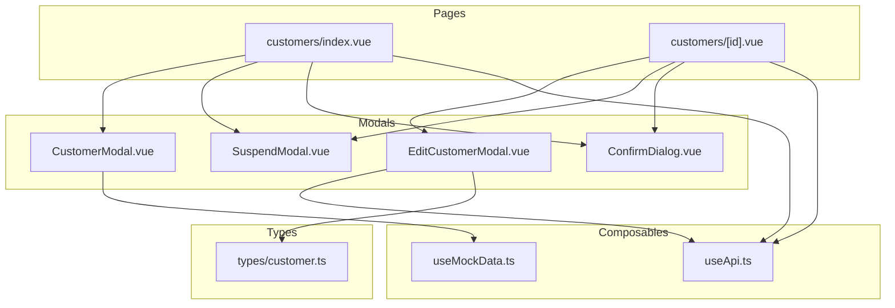
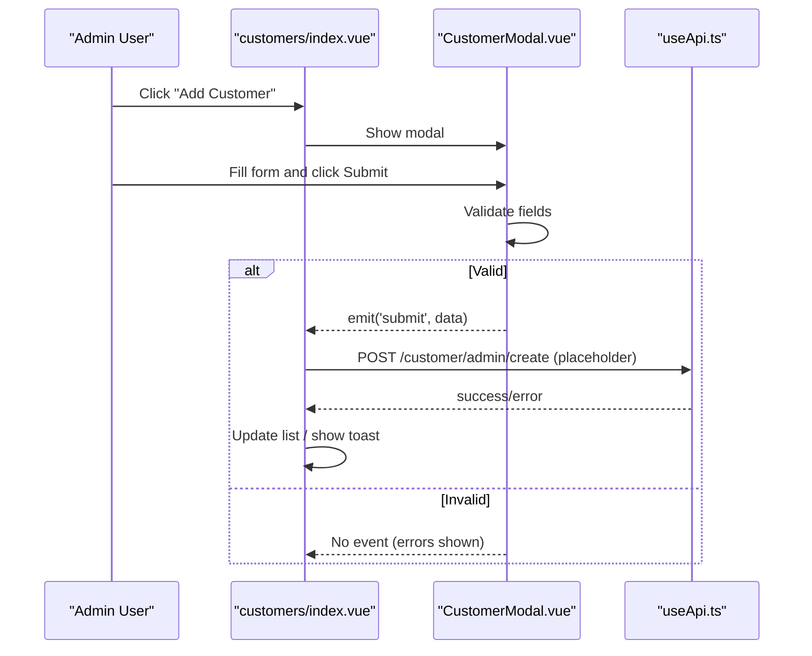
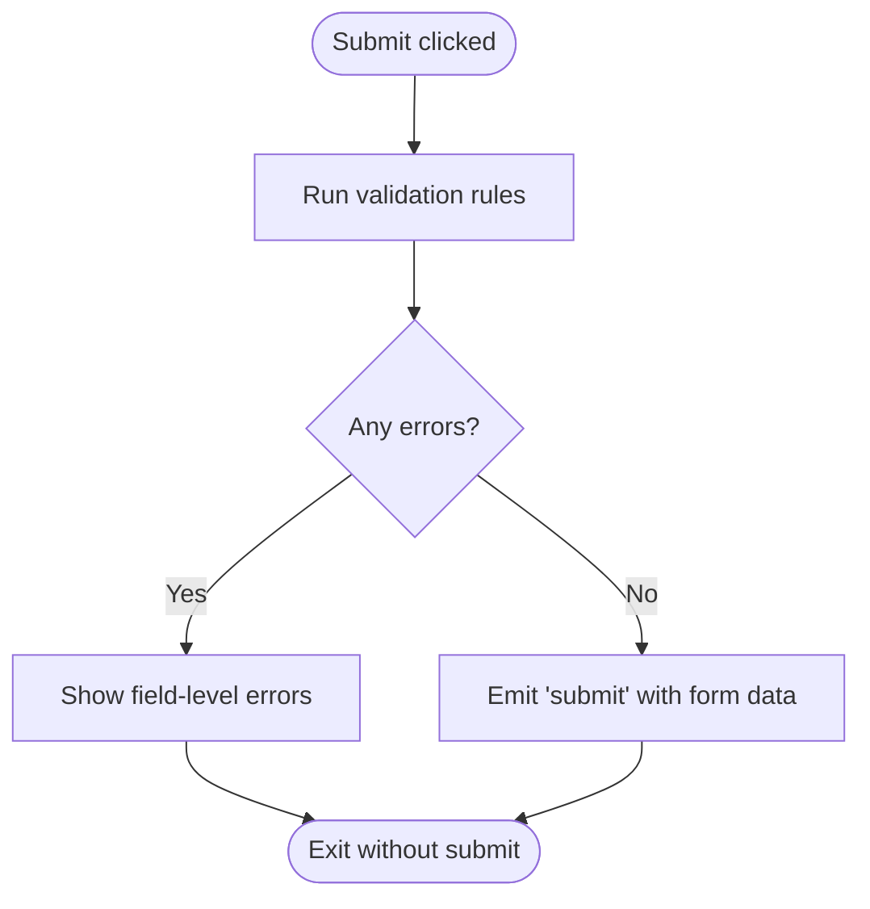
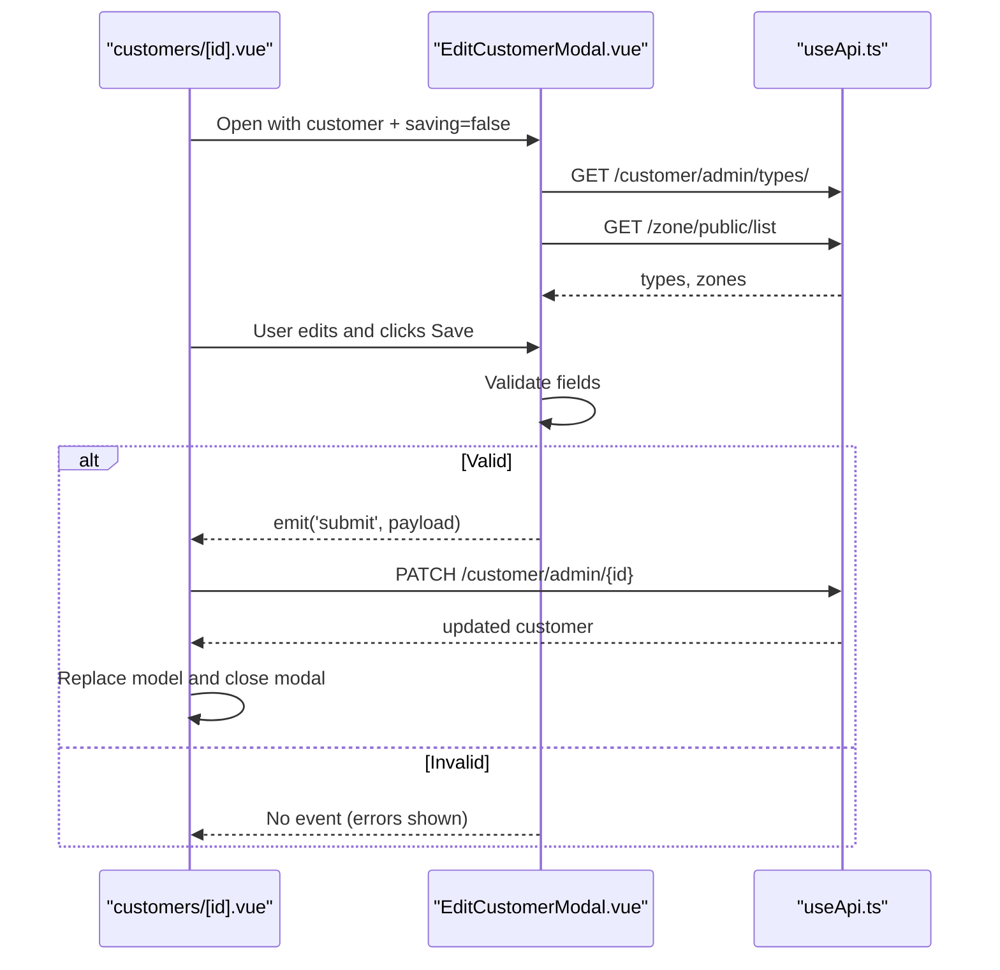
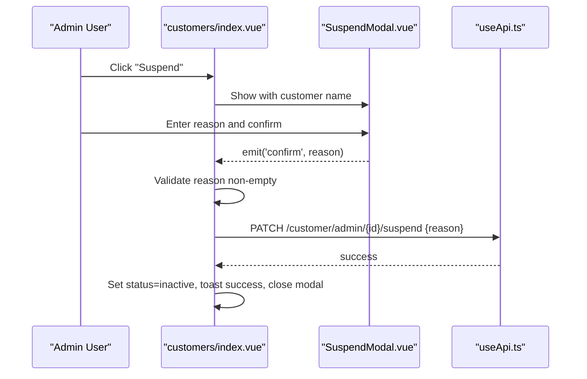
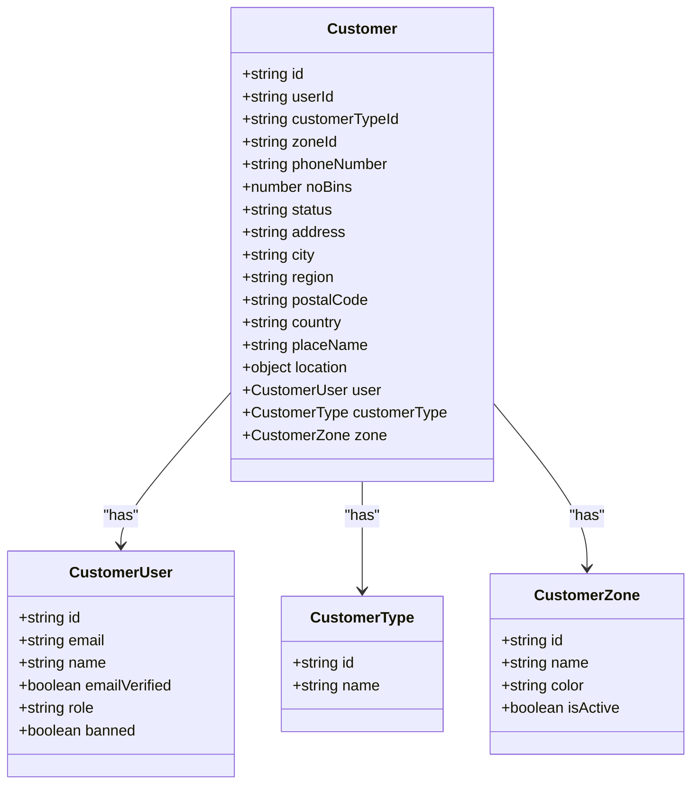
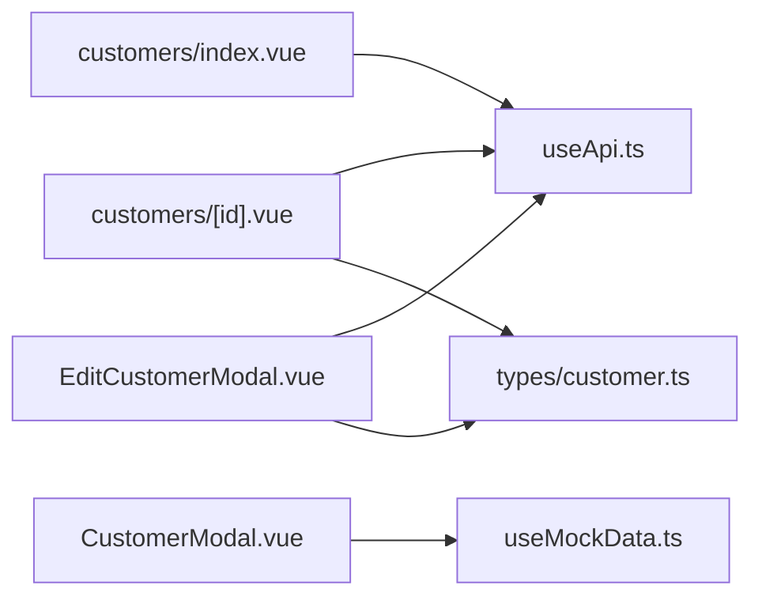

# Customer CRUD Operations

<cite>
**Referenced Files in This Document**
- [CustomerModal.vue](file://app/components/CustomerModal.vue)
- [EditCustomerModal.vue](file://app/components/EditCustomerModal.vue)
- [SuspendModal.vue](file://app/components/SuspendModal.vue)
- [ConfirmDialog.vue](file://app/components/ConfirmDialog.vue)
- [customers/index.vue](file://app/pages/customers/index.vue)
- [customers/[id].vue](file://app/pages/customers/[id].vue)
- [customer.ts](file://app/types/customer.ts)
- [useApi.ts](file://app/composables/useApi.ts)
- [useMockData.ts](file://app/composables/useMockData.ts)
</cite>

## Table of Contents
1. [Introduction](#introduction)
2. [Project Structure](#project-structure)
3. [Core Components](#core-components)
4. [Architecture Overview](#architecture-overview)
5. [Detailed Component Analysis](#detailed-component-analysis)
6. [Dependency Analysis](#dependency-analysis)
7. [Performance Considerations](#performance-considerations)
8. [Troubleshooting Guide](#troubleshooting-guide)
9. [Conclusion](#conclusion)
10. [Appendices](#appendices)

## Introduction
This document explains the customer creation, editing, suspension, and unsuspension workflows implemented in the application. It focuses on modal-based form patterns, validation strategies, API integration points, and state management for each operation. It also provides guidance for extending forms to support new customer types and handling complex validation scenarios.

## Project Structure
The customer feature spans a few key pages and reusable components:
- List page: manages listing, filtering, pagination, and triggers modals for create/suspend/unsuspend
- Detail page: displays customer details, edit modal, and suspend/unsuspend flows
- Modals: Create (CustomerModal), Edit (EditCustomerModal), Suspend confirmation (SuspendModal), generic Confirm dialog (ConfirmDialog)
- Types: shared TypeScript interfaces for customers and related entities
- Composables: HTTP client wrapper and mock data provider

**Diagram sources**
- [customers/index.vue:1-352](file://app/pages/customers/index.vue#L1-L352)
- [customers/[id].vue](file://app/pages/customers/[id].vue#L1-L1024)
- [CustomerModal.vue:1-216](file://app/components/CustomerModal.vue#L1-L216)
- [EditCustomerModal.vue:1-242](file://app/components/EditCustomerModal.vue#L1-L242)
- [SuspendModal.vue:1-75](file://app/components/SuspendModal.vue#L1-L75)
- [ConfirmDialog.vue:1-53](file://app/components/ConfirmDialog.vue#L1-L53)
- [useApi.ts:1-91](file://app/composables/useApi.ts#L1-L91)
- [useMockData.ts:1-61](file://app/composables/useMockData.ts#L1-L61)
- [customer.ts:1-103](file://app/types/customer.ts#L1-L103)

**Section sources**
- [customers/index.vue:1-352](file://app/pages/customers/index.vue#L1-L352)
- [customers/[id].vue](file://app/pages/customers/[id].vue#L1-L1024)
- [CustomerModal.vue:1-216](file://app/components/CustomerModal.vue#L1-L216)
- [EditCustomerModal.vue:1-242](file://app/components/EditCustomerModal.vue#L1-L242)
- [SuspendModal.vue:1-75](file://app/components/SuspendModal.vue#L1-L75)
- [ConfirmDialog.vue:1-53](file://app/components/ConfirmDialog.vue#L1-L53)
- [useApi.ts:1-91](file://app/composables/useApi.ts#L1-L91)
- [useMockData.ts:1-61](file://app/composables/useMockData.ts#L1-L61)
- [customer.ts:1-103](file://app/types/customer.ts#L1-L103)

## Core Components
- CustomerModal: Modal for creating a new customer with basic identity, portal access, zone assignment, and bin count. Uses local reactive state and inline validation. Emits close and submit events.
- EditCustomerModal: Modal for editing an existing customer’s operational fields. Loads options from APIs (customer types and zones). Validates required fields and emits submit with normalized payload.
- SuspendModal: Confirmation modal to suspend a customer account; requires a reason and emits confirm/close.
- ConfirmDialog: Generic confirmation dialog used for unsuspend actions.

Key responsibilities:
- Form state and validation within each modal
- Event-driven communication with parent pages
- API calls orchestrated by parent pages using useApi

**Section sources**
- [CustomerModal.vue:1-216](file://app/components/CustomerModal.vue#L1-L216)
- [EditCustomerModal.vue:1-242](file://app/components/EditCustomerModal.vue#L1-L242)
- [SuspendModal.vue:1-75](file://app/components/SuspendModal.vue#L1-L75)
- [ConfirmDialog.vue:1-53](file://app/components/ConfirmDialog.vue#L1-L53)

## Architecture Overview
The customer CRUD operations follow a consistent pattern:
- Parent page controls visibility of modals and holds loading states
- Modals validate inputs and emit events with payloads
- Parent pages call API endpoints via useApi and update UI state or show toasts

**Diagram sources**
- [customers/index.vue:112-116](file://app/pages/customers/index.vue#L112-L116)
- [CustomerModal.vue:33-49](file://app/components/CustomerModal.vue#L33-L49)
- [useApi.ts:70-80](file://app/composables/useApi.ts#L70-L80)

## Detailed Component Analysis

### CustomerModal (Create)
- Props: none
- Events:
  - close: closes modal
  - submit(data): emits validated form data
- Form fields:
  - Identity: firstName, lastName, email, phone
  - Portal access: password, confirmPassword, sendWelcome flag
  - Classification: userType (from mock data), entityName (conditional)
  - Assignment: zone (from mock data), assigned BINs count
  - Optional location fields present but not validated here
- Validation strategy:
  - Required checks for name, email, phone, password
  - Email format check
  - Password length and match with confirm
  - Returns boolean to gate submission
- Data source:
  - Zones and customer types are loaded from useMockData for now
- Submission:
  - Emits submit with a plain object; parent is responsible for API call

**Diagram sources**
- [CustomerModal.vue:33-49](file://app/components/CustomerModal.vue#L33-L49)

**Section sources**
- [CustomerModal.vue:1-216](file://app/components/CustomerModal.vue#L1-L216)
- [useMockData.ts:1-61](file://app/composables/useMockData.ts#L1-L61)

### EditCustomerModal (Update)
- Props:
  - customer: current customer record (typed)
  - saving?: boolean (disables submit while saving)
- Events:
  - close: closes modal
  - submit(payload): emits normalized payload for PATCH
- Options loading:
  - On mount, fetches customer types and zones via useApi
- Form fields:
  - phoneNumber, customerTypeId, zoneId, noBins
  - Address fields: address, city, region, postalCode, country, placeName
- Validation strategy:
  - Required checks for phone, address, city, customer type, zone
  - Non-negative bins
- Submission:
  - Normalizes values (trim strings, cast numbers) and emits payload

**Diagram sources**
- [EditCustomerModal.vue:29-81](file://app/components/EditCustomerModal.vue#L29-L81)
- [customers/[id].vue](file://app/pages/customers/[id].vue#L100-L126)
- [useApi.ts:70-80](file://app/composables/useApi.ts#L70-L80)

**Section sources**
- [EditCustomerModal.vue:1-242](file://app/components/EditCustomerModal.vue#L1-L242)
- [customers/[id].vue](file://app/pages/customers/[id].vue#L100-L126)
- [customer.ts:34-55](file://app/types/customer.ts#L34-L55)

### Suspend and Unsuspend Workflows
- Suspend flow:
  - Triggered from list or detail page
  - Opens SuspendModal requiring a reason
  - Parent validates reason presence and calls PATCH /customer/admin/{id}/suspend
  - On success, updates local status to inactive and shows success toast
- Unsuspend flow:
  - Opens ConfirmDialog for confirmation
  - Parent calls PATCH /customer/admin/{id}/unsuspend
  - On success, updates local status to active and shows success toast

**Diagram sources**
- [customers/index.vue:24-46](file://app/pages/customers/index.vue#L24-L46)
- [SuspendModal.vue:1-75](file://app/components/SuspendModal.vue#L1-L75)
- [useApi.ts:70-80](file://app/composables/useApi.ts#L70-L80)

**Section sources**
- [customers/index.vue:14-72](file://app/pages/customers/index.vue#L14-L72)
- [customers/[id].vue](file://app/pages/customers/[id].vue#L58-L98)
- [SuspendModal.vue:1-75](file://app/components/SuspendModal.vue#L1-L75)
- [ConfirmDialog.vue:1-53](file://app/components/ConfirmDialog.vue#L1-L53)

### Data Models
- Customer interface defines all fields returned by the admin endpoint, including user profile, type, zone, and optional location data.
- Pickup history and billing sections exist in the detail page but are out of scope for this document.

**Diagram sources**
- [customer.ts:4-55](file://app/types/customer.ts#L4-L55)

**Section sources**
- [customer.ts:1-103](file://app/types/customer.ts#L1-L103)

## Dependency Analysis
- Pages depend on:
  - useApi for HTTP requests and error handling
  - Modals for UI interactions
  - Types for strong typing
- Modals depend on:
  - EditCustomerModal depends on useApi to load options
  - CustomerModal uses useMockData for static reference data
- Shared utilities:
  - useApi centralizes auth headers, error normalization, and typed helpers (get/post/put/patch/del)

**Diagram sources**
- [customers/index.vue:1-352](file://app/pages/customers/index.vue#L1-L352)
- [customers/[id].vue](file://app/pages/customers/[id].vue#L1-L1024)
- [EditCustomerModal.vue:1-242](file://app/components/EditCustomerModal.vue#L1-L242)
- [CustomerModal.vue:1-216](file://app/components/CustomerModal.vue#L1-L216)
- [useApi.ts:1-91](file://app/composables/useApi.ts#L1-L91)
- [useMockData.ts:1-61](file://app/composables/useMockData.ts#L1-L61)
- [customer.ts:1-103](file://app/types/customer.ts#L1-L103)

**Section sources**
- [useApi.ts:1-91](file://app/composables/useApi.ts#L1-L91)
- [useMockData.ts:1-61](file://app/composables/useMockData.ts#L1-L61)
- [customer.ts:1-103](file://app/types/customer.ts#L1-L103)

## Performance Considerations
- Option fetching:
  - EditCustomerModal loads customer types and zones concurrently using Promise.all to minimize latency
- Local state updates:
  - Suspend/unsuspend update local arrays or objects immediately after successful responses to keep UI responsive
- Avoid unnecessary re-renders:
  - Keep modal props minimal and only pass necessary fields
- Debounce search/filter:
  - The list page resets pagination on filter changes; consider debouncing search input if needed

[No sources needed since this section provides general guidance]

## Troubleshooting Guide
Common issues and resolutions:
- Authentication failures:
  - useApi handles 401 by logging out and redirecting to login; ensure tokens are present and valid
- Network errors:
  - useApi wraps requests with error titles; check console logs for path/status/message
- Validation errors:
  - Ensure all required fields are filled; verify regex/email/phone formats
- Missing options:
  - If customer types or zones do not load, check API availability and network connectivity

**Section sources**
- [useApi.ts:39-67](file://app/composables/useApi.ts#L39-L67)
- [EditCustomerModal.vue:29-38](file://app/components/EditCustomerModal.vue#L29-L38)
- [CustomerModal.vue:33-49](file://app/components/CustomerModal.vue#L33-L49)

## Conclusion
The customer CRUD implementation follows a clear separation of concerns:
- Modals encapsulate form state and validation
- Pages orchestrate API calls and manage global state
- Shared composables standardize HTTP behavior and error handling
This structure makes it straightforward to extend forms, add new validations, and integrate additional customer types.

[No sources needed since this section summarizes without analyzing specific files]

## Appendices

### Extending Customer Types and Forms
- Adding a new customer type:
  - Add a new entry to the mock dataset or replace with real API in useMockData
  - Ensure the select lists in CustomerModal and EditCustomerModal reflect the new type
- Conditional fields:
  - Use conditional rendering based on userType to show/hide fields like entityName
- Complex validation:
  - Centralize validation logic into composable functions similar to teamValidation patterns
  - Return structured error maps keyed by field names for consistent UI feedback

**Section sources**
- [useMockData.ts:46-56](file://app/composables/useMockData.ts#L46-L56)
- [CustomerModal.vue:122-138](file://app/components/CustomerModal.vue#L122-L138)
- [teamValidation.ts:1-122](file://app/utils/teamValidation.ts#L1-L122)

### API Integration Reference
- Create customer:
  - Endpoint placeholder exists in the list page handler; implement POST /customer/admin/create
- Update customer:
  - PATCH /customer/admin/{id}
- Suspend:
  - PATCH /customer/admin/{id}/suspend with body { reason }
- Unsuspend:
  - PATCH /customer/admin/{id}/unsuspend with empty body

**Section sources**
- [customers/index.vue:112-116](file://app/pages/customers/index.vue#L112-L116)
- [customers/index.vue:33-65](file://app/pages/customers/index.vue#L33-L65)
- [customers/[id].vue](file://app/pages/customers/[id].vue#L100-L126)
- [customers/[id].vue](file://app/pages/customers/[id].vue#L58-L98)