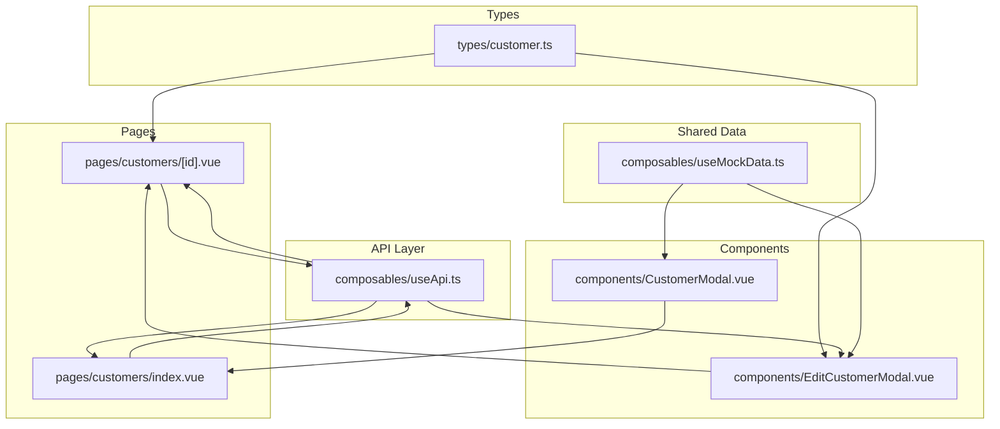
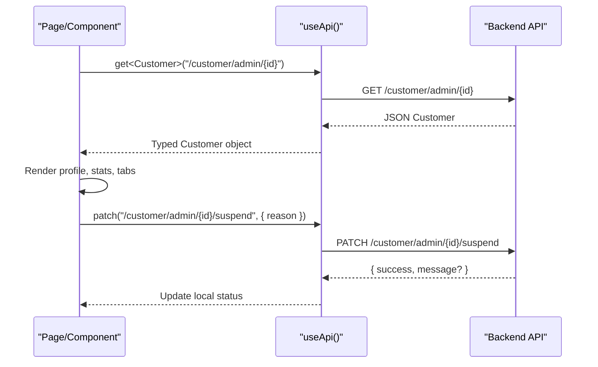
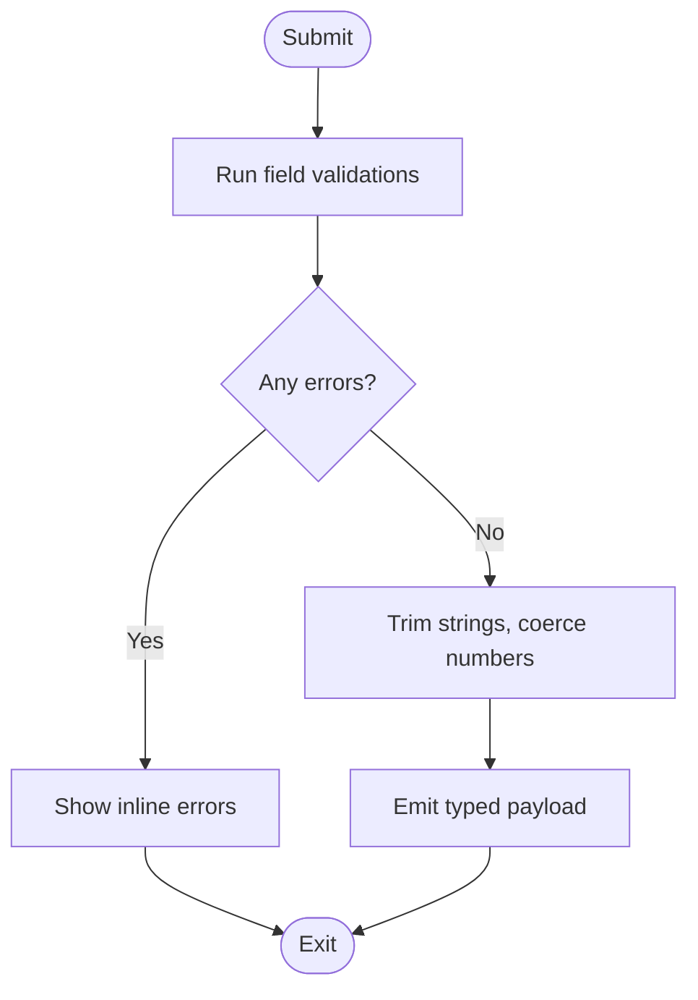
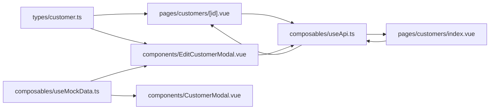

# Customer Data Model & Types

<cite>
**Referenced Files in This Document**
- [customer.ts](file://app/types/customer.ts)
- [useApi.ts](file://app/composables/useApi.ts)
- [index.vue (Customers list)](file://app/pages/customers/index.vue)
- [id.vue (Customer detail)](file://app/pages/customers/[id].vue)
- [CustomerModal.vue](file://app/components/CustomerModal.vue)
- [EditCustomerModal.vue](file://app/components/EditCustomerModal.vue)
- [useMockData.ts](file://app/composables/useMockData.ts)
</cite>

## Table of Contents
1. [Introduction](#introduction)
2. [Project Structure](#project-structure)
3. [Core Components](#core-components)
4. [Architecture Overview](#architecture-overview)
5. [Detailed Component Analysis](#detailed-component-analysis)
6. [Dependency Analysis](#dependency-analysis)
7. [Performance Considerations](#performance-considerations)
8. [Troubleshooting Guide](#troubleshooting-guide)
9. [Conclusion](#conclusion)
10. [Appendices](#appendices)

## Introduction
This document explains the customer data model and TypeScript definitions used across the application, focusing on:
- The Customer interface structure and related types
- Field definitions, optional fields, and type constraints
- Relationships between entities (user, customer type, zone, pickup history)
- Integration with the API layer (request/response schemas and transformation patterns)
- Practical examples of working with customer data in components
- Validation rules, business logic constraints, and migration strategies for schema changes

The goal is to provide a clear, code-backed reference that helps developers maintain type safety and consistency when reading or writing customer data.

## Project Structure
The customer domain spans several layers:
- Type definitions: app/types/customer.ts
- API client: app/composables/useApi.ts
- Pages: app/pages/customers/index.vue and app/pages/customers/[id].vue
- Modals: app/components/CustomerModal.vue and app/components/EditCustomerModal.vue
- Shared reference data (mock): app/composables/useMockData.ts



**Diagram sources**
- [customer.ts:1-103](file://app/types/customer.ts#L1-L103)
- [useApi.ts:1-91](file://app/composables/useApi.ts#L1-L91)
- [index.vue (Customers list):1-352](file://app/pages/customers/index.vue#L1-L352)
- [id.vue (Customer detail):1-1024](file://app/pages/customers/[id].vue#L1-L1024)
- [CustomerModal.vue:1-216](file://app/components/CustomerModal.vue#L1-L216)
- [EditCustomerModal.vue:1-242](file://app/components/EditCustomerModal.vue#L1-L242)
- [useMockData.ts:1-61](file://app/composables/useMockData.ts#L1-L61)

**Section sources**
- [customer.ts:1-103](file://app/types/customer.ts#L1-L103)
- [useApi.ts:1-91](file://app/composables/useApi.ts#L1-L91)
- [index.vue (Customers list):1-352](file://app/pages/customers/index.vue#L1-L352)
- [id.vue (Customer detail):1-1024](file://app/pages/customers/[id].vue#L1-L1024)
- [CustomerModal.vue:1-216](file://app/components/CustomerModal.vue#L1-L216)
- [EditCustomerModal.vue:1-242](file://app/components/EditCustomerModal.vue#L1-L242)
- [useMockData.ts:1-61](file://app/composables/useMockData.ts#L1-L61)

## Core Components
This section documents the core data structures and their relationships.

- CustomerUser: Represents the user account attached to a customer. Includes identity, role, verification status, ban state, timestamps.
- CustomerType: Minimal representation of a customer’s plan/type returned by admin endpoints.
- CustomerZone: Zone assigned to a customer with color and active flag.
- Customer: The primary entity returned by GET /customer/admin/{id}. Contains identifiers, contact info, address/location, counts, status, timestamps, and nested relations (user, customerType, zone).
- Pickup-related types: DisposableItemType, EstimatedQuantity, CustomerPickupDriver, CustomerPickupHistoryEntry, and CustomerPickupHistoryResponse describe the pickup history endpoint response.

Key observations:
- Optional fields are modeled as nullable string | null where appropriate (address, city, region, postalCode, country, placeName, location, etc.).
- Some fields are required strings (e.g., phoneNumber), while others are optional or nullable.
- Nested objects (user, customerType, zone) may be present or null depending on the endpoint shape.

```mermaid
classDiagram
class CustomerUser {
+string id
+string email
+string name
+boolean emailVerified
+string role
+boolean banned
+string|nullable banReason
+boolean twoFactorEnabled
+string createdAt
+string updatedAt
}
class CustomerType {
+string id
+string name
+string createdAt
+string updatedAt
}
class CustomerZone {
+string id
+string name
+string color
+boolean isActive
}
class Customer {
+string id
+string userId
+string customerTypeId
+string zoneId
+string phoneNumber
+number noBins
+string status
+string|nullable address
+string|nullable city
+string|nullable region
+string|nullable postalCode
+string|nullable country
+string|nullable placeName
+string|nullable locationUpdatedAt
+{latitude : number;longitude : number}|nullable location
+string createdAt
+string updatedAt
+CustomerUser user
+CustomerType|null customerType
+CustomerZone|null zone
}
class DisposableItemType {
+string id
+string name
+string|nullable icon
}
class EstimatedQuantity {
+string id
+string label
}
class CustomerPickupDriver {
+string id
+string name
+string|nullable phoneNumber
}
class CustomerPickupHistoryEntry {
+string id
+string|nullable preferredPickupDate
+string status
+string|nullable paymentType
+string|nullable paymentStatus
+string|nullable createdAt
+string|nullable updatedAt
+DisposableItemType|null disposableItemType
+EstimatedQuantity|null estimatedQuantity
+CustomerPickupDriver|null driver
}
class CustomerPickupHistoryResponse {
+CustomerPickupHistoryEntry[] data
+Pagination pagination
}
Customer --> CustomerUser : "has"
Customer --> CustomerType : "has"
Customer --> CustomerZone : "has"
CustomerPickupHistoryEntry --> DisposableItemType : "has"
CustomerPickupHistoryEntry --> EstimatedQuantity : "has"
CustomerPickupHistoryEntry --> CustomerPickupDriver : "has"
```

**Diagram sources**
- [customer.ts:1-103](file://app/types/customer.ts#L1-L103)

**Section sources**
- [customer.ts:1-103](file://app/types/customer.ts#L1-L103)

## Architecture Overview
The customer data flows from the API into typed models and then into UI components. The API client centralizes HTTP calls, error handling, and authentication headers.



**Diagram sources**
- [useApi.ts:1-91](file://app/composables/useApi.ts#L1-L91)
- [id.vue (Customer detail):1-1024](file://app/pages/customers/[id].vue#L1-L1024)

**Section sources**
- [useApi.ts:1-91](file://app/composables/useApi.ts#L1-L91)
- [id.vue (Customer detail):1-1024](file://app/pages/customers/[id].vue#L1-L1024)

## Detailed Component Analysis

### Customer Interface and Related Types
- Customer:
  - Required identifiers and metadata: id, userId, customerTypeId, zoneId, phoneNumber, noBins, status, createdAt, updatedAt.
  - Address/location fields are nullable: address, city, region, postalCode, country, placeName, locationUpdatedAt, location.
  - Relations: user (required), customerType (nullable), zone (nullable).
- Pickup History:
  - Entry includes optional dates, statuses, payment info, and nested references to disposable item type, estimated quantity, and driver.
  - Response envelope provides pagination metadata.

Practical implications:
- Always guard access to nullable fields (e.g., customer.zone?.name).
- Use computed properties to derive safe display values (e.g., fullName, initials).
- For lists, normalize shapes if needed (see CreatePickupModal normalization pattern).

**Section sources**
- [customer.ts:1-103](file://app/types/customer.ts#L1-L103)
- [id.vue (Customer detail):1-1024](file://app/pages/customers/[id].vue#L1-L1024)

### API Integration Patterns
- useApi():
  - Adds Authorization header when available.
  - Treats 200/201/204 as success; otherwise throws an error with a message extracted from JSON body if possible.
  - Provides typed helpers: get<T>, post<T>, put<T>, patch<T>, del<T>.
- Endpoints used for customers:
  - GET /customer/admin/{id}: returns Customer.
  - PATCH /customer/admin/{id}/suspend: request { reason }, response { success, message? }.
  - PATCH /customer/admin/{id}/unsuspend: empty body, response { success, message? }.
  - GET /customer/admin/list: paginated list with data[] and pagination.
  - GET /pickup-requests/admin/customers/{id}/history: paginated pickup history entries.

Transformation patterns:
- List normalization: some consumers add top-level convenience fields (e.g., name, placeName) derived from nested user/address when missing.
- Error handling: centralized via useErrorHandler wrapper around useApi methods.

**Section sources**
- [useApi.ts:1-91](file://app/composables/useApi.ts#L1-L91)
- [index.vue (Customers list):1-352](file://app/pages/customers/index.vue#L1-L352)
- [id.vue (Customer detail):1-1024](file://app/pages/customers/[id].vue#L1-L1024)

### Working with Customer Data in Components

#### Customer Detail Page
- Fetches Customer using typed API call.
- Derives computed values for display (fullName, initials, statusBadge).
- Handles suspend/unsuspend actions and updates local state upon success.
- Loads pickup history with pagination and aggregates stats across pages.
- Integrates GPS map only when coordinates exist.

Best practices demonstrated:
- Null-safe navigation (e.g., customer.value?.status).
- Centralized toast notifications for user feedback.
- Conditional rendering based on presence of optional data (location).

**Section sources**
- [id.vue (Customer detail):1-1024](file://app/pages/customers/[id].vue#L1-L1024)

#### Customers List Page
- Paginates and filters customers via query parameters.
- Exports current page to Excel using xlsx.
- Suspends/unsuspends accounts with confirmation dialogs.

Notes:
- Uses any[] for list items in this file; consider typing with Customer[] for stronger guarantees.
- Status badges and plan labels are computed locally.

**Section sources**
- [index.vue (Customers list):1-352](file://app/pages/customers/index.vue#L1-L352)

#### Add Customer Modal
- Collects form fields including personal info, portal credentials, zone, customer type, bin count, and address details.
- Performs basic client-side validation (required fields, email format, password length/match).
- Emits submit event with form payload for parent to handle.

Recommendation:
- Align emitted payload with a dedicated CreateCustomerRequest type to ensure type safety.

**Section sources**
- [CustomerModal.vue:1-216](file://app/components/CustomerModal.vue#L1-L216)

#### Edit Customer Modal
- Accepts a fully-typed Customer prop and emits a structured update payload.
- Loads customer types and zones via API at mount time.
- Validates required fields and non-negative bin count before submission.

Type safety:
- Props and emit payloads are strongly typed to match the backend contract.

**Section sources**
- [EditCustomerModal.vue:1-242](file://app/components/EditCustomerModal.vue#L1-L242)

### Data Validation Rules and Business Logic Constraints
Common validations observed:
- Required fields: phone number, address, city, customer type, zone.
- Numeric constraints: noBins must not be negative.
- Password policy: minimum length and confirmation match.
- Email format: regex check.

Business logic:
- Suspension requires a reason.
- Display formatting for payment types and statuses.
- Aggregation of pickup stats across all pages.

Validation flow example:



[No sources needed since this diagram shows conceptual workflow, not actual code structure]

**Section sources**
- [EditCustomerModal.vue:1-242](file://app/components/EditCustomerModal.vue#L1-L242)
- [CustomerModal.vue:1-216](file://app/components/CustomerModal.vue#L1-L216)
- [id.vue (Customer detail):1-1024](file://app/pages/customers/[id].vue#L1-L1024)

### Handling Optional Fields and Maintaining Type Safety
Guidelines:
- Use optional chaining for nested objects (e.g., customer.zone?.name).
- Provide fallbacks for display (e.g., “—” when null).
- Normalize list responses to include convenient fields when necessary.
- Prefer explicit types for props and emits in components.

Examples in code:
- Derived fullName and initials computed safely.
- Conditional rendering for GPS map only when coordinates exist.
- Normalization of list items to mirror top-level fields.

**Section sources**
- [id.vue (Customer detail):1-1024](file://app/pages/customers/[id].vue#L1-L1024)
- [index.vue (Customers list):1-352](file://app/pages/customers/index.vue#L1-L352)

### Migration Patterns for Schema Changes
When evolving the Customer model:
- Keep backward compatibility by marking new fields as optional or nullable initially.
- Introduce transform functions to adapt older payloads to newer types.
- Update API client usage gradually, ensuring both old and new responses are handled.
- Add runtime guards and default values in UI to prevent crashes during transition.

Suggested approach:
- Define versioned DTOs (e.g., CustomerV1, CustomerV2) and a single canonical type.
- Implement a normalizeCustomer function to map API responses to the canonical type.
- Use discriminated unions if multiple response shapes coexist temporarily.

[No sources needed since this section provides general guidance]

## Dependency Analysis
High-level dependencies:
- Pages depend on useApi for network operations and on types/customer for strong typing.
- Modals depend on shared reference data (zones, customer types) either from mock or API.
- The API client depends on auth store and runtime config for base URL and tokens.



**Diagram sources**
- [customer.ts:1-103](file://app/types/customer.ts#L1-L103)
- [useApi.ts:1-91](file://app/composables/useApi.ts#L1-L91)
- [index.vue (Customers list):1-352](file://app/pages/customers/index.vue#L1-L352)
- [id.vue (Customer detail):1-1024](file://app/pages/customers/[id].vue#L1-L1024)
- [CustomerModal.vue:1-216](file://app/components/CustomerModal.vue#L1-L216)
- [EditCustomerModal.vue:1-242](file://app/components/EditCustomerModal.vue#L1-L242)
- [useMockData.ts:1-61](file://app/composables/useMockData.ts#L1-L61)

**Section sources**
- [customer.ts:1-103](file://app/types/customer.ts#L1-L103)
- [useApi.ts:1-91](file://app/composables/useApi.ts#L1-L91)
- [index.vue (Customers list):1-352](file://app/pages/customers/index.vue#L1-L352)
- [id.vue (Customer detail):1-1024](file://app/pages/customers/[id].vue#L1-L1024)
- [CustomerModal.vue:1-216](file://app/components/CustomerModal.vue#L1-L216)
- [EditCustomerModal.vue:1-242](file://app/components/EditCustomerModal.vue#L1-L242)
- [useMockData.ts:1-61](file://app/composables/useMockData.ts#L1-L61)

## Performance Considerations
- Pagination: Both customer list and pickup history use pagination to limit payload size. Ensure UI reflects total counts and supports page navigation.
- Aggregations: Pickup stats are computed by iterating over all pages; cache results per customer to avoid redundant work.
- Map initialization: Defer map creation until tab activation and destroy on unmount to reduce overhead.
- Exporting: Lazy-load xlsx only when needed to keep initial bundle small.

[No sources needed since this section provides general guidance]

## Troubleshooting Guide
Common issues and resolutions:
- 401 Unauthorized: The API client logs out and redirects to login automatically. Check token validity and session persistence.
- Missing optional fields: Guard against nulls in templates and computations; provide fallbacks.
- Validation failures: Ensure required fields are filled and numeric fields are coerced correctly before emitting payloads.
- API errors: useApi wraps requests with error handling; inspect console logs for detailed messages and status codes.

Operational tips:
- Use toast notifications consistently for success and failure feedback.
- Normalize list responses to include convenient fields for UI consumption.
- Keep modal forms in sync with backend contracts to minimize transformation bugs.

**Section sources**
- [useApi.ts:1-91](file://app/composables/useApi.ts#L1-L91)
- [index.vue (Customers list):1-352](file://app/pages/customers/index.vue#L1-L352)
- [id.vue (Customer detail):1-1024](file://app/pages/customers/[id].vue#L1-L1024)

## Conclusion
The customer data model is well-defined with clear separation between core entities and related resources. Strong typing, consistent API integration, and robust validation contribute to a reliable user experience. By following the patterns outlined here—null-safe access, normalized payloads, and centralized error handling—you can extend and evolve the model safely while maintaining type safety throughout the application.

[No sources needed since this section summarizes without analyzing specific files]

## Appendices

### API Endpoints Summary
- GET /customer/admin/{id}: Returns Customer.
- PATCH /customer/admin/{id}/suspend: Request { reason }, Response { success, message? }.
- PATCH /customer/admin/{id}/unsuspend: Empty body, Response { success, message? }.
- GET /customer/admin/list: Paginated list with data[] and pagination.
- GET /pickup-requests/admin/customers/{id}/history: Paginated pickup history entries.

**Section sources**
- [index.vue (Customers list):1-352](file://app/pages/customers/index.vue#L1-L352)
- [id.vue (Customer detail):1-1024](file://app/pages/customers/[id].vue#L1-L1024)

### Example Usage Patterns
- Reading customer data:
  - Access nested user info safely: customer.user.name.
  - Display zone name with fallback: customer.zone?.name || '—'.
- Updating customer:
  - Build a typed payload matching the edit modal emit signature.
  - Patch via useApi and update local state on success.
- Listing and filtering:
  - Build URLSearchParams for search, status, and pagination.
  - Normalize list items to include top-level convenience fields if needed.

**Section sources**
- [EditCustomerModal.vue:1-242](file://app/components/EditCustomerModal.vue#L1-L242)
- [index.vue (Customers list):1-352](file://app/pages/customers/index.vue#L1-L352)
- [id.vue (Customer detail):1-1024](file://app/pages/customers/[id].vue#L1-L1024)