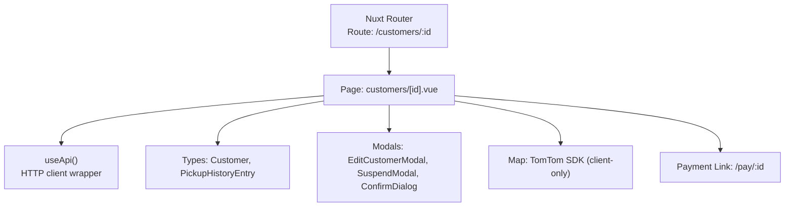
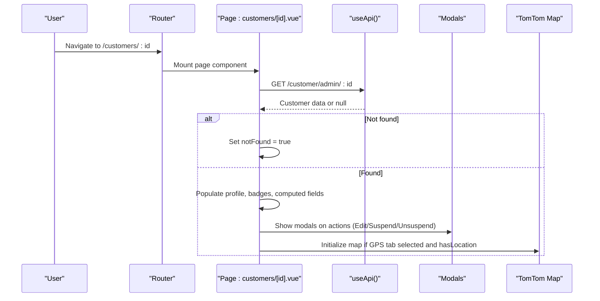
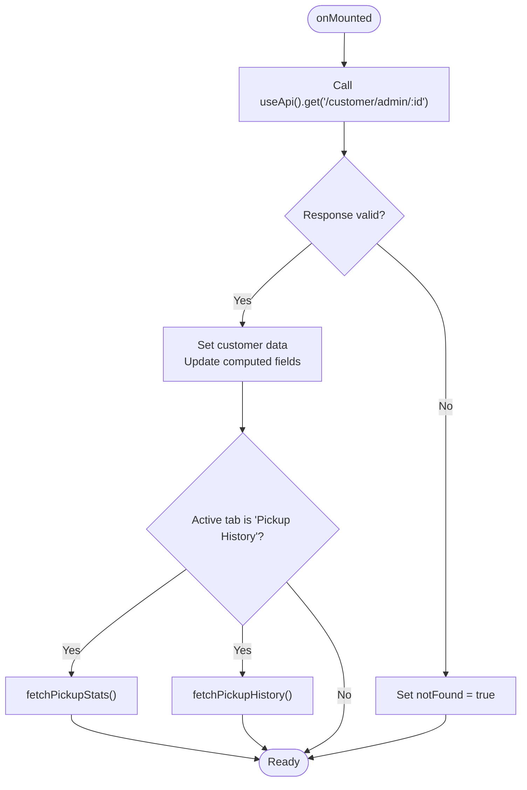
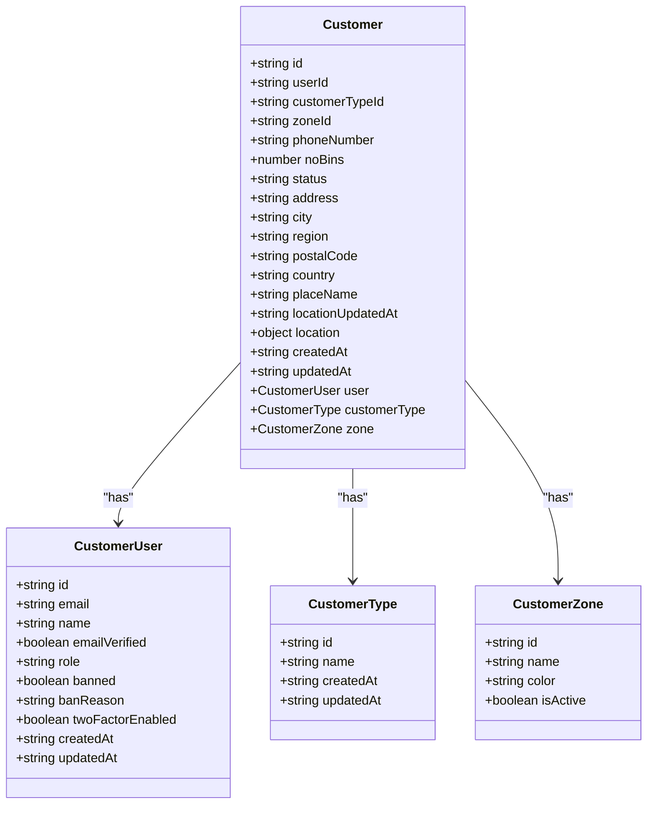
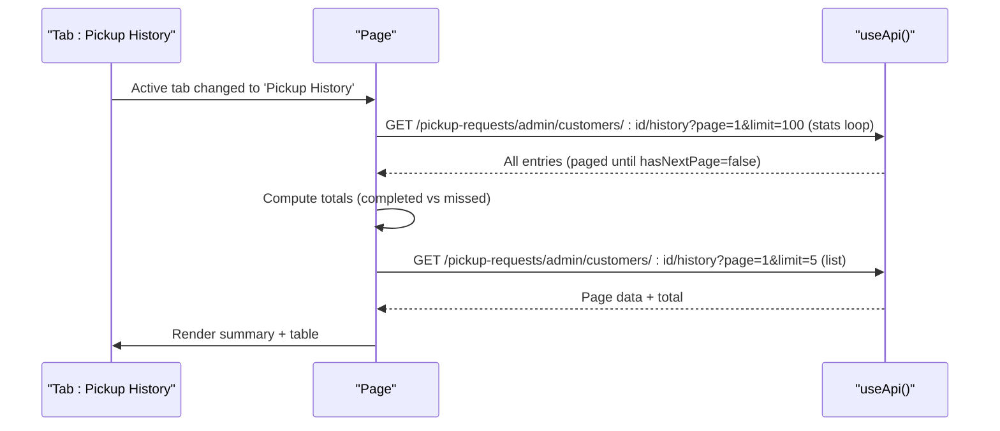
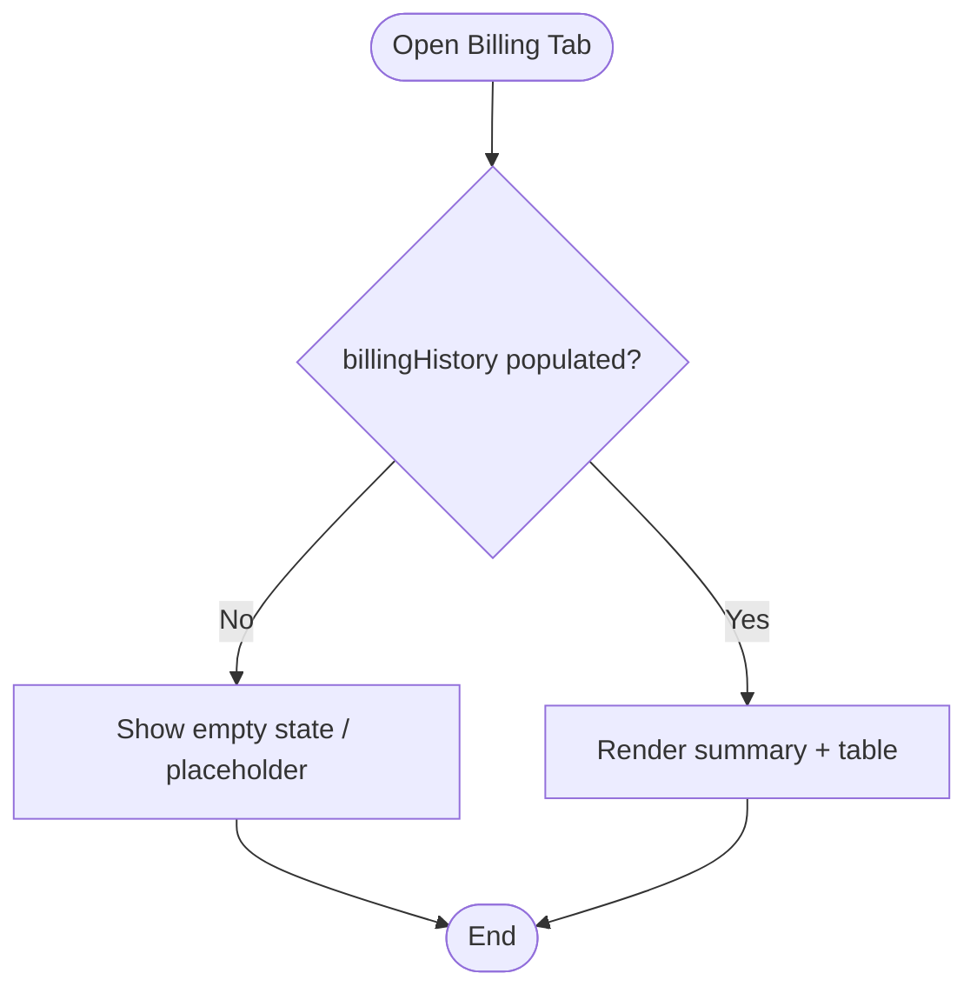
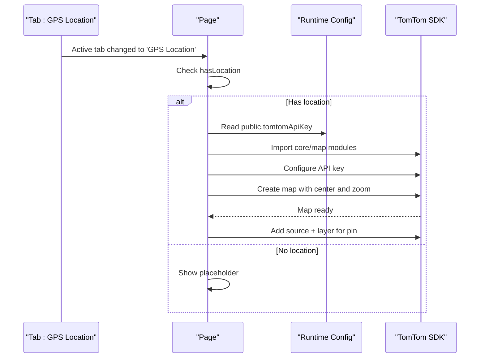
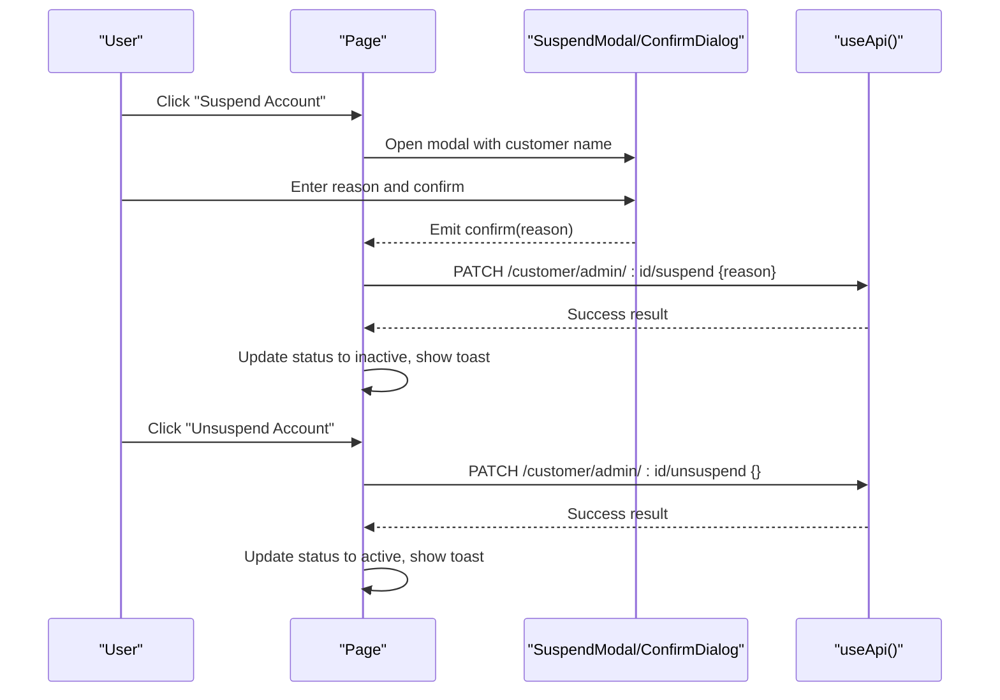
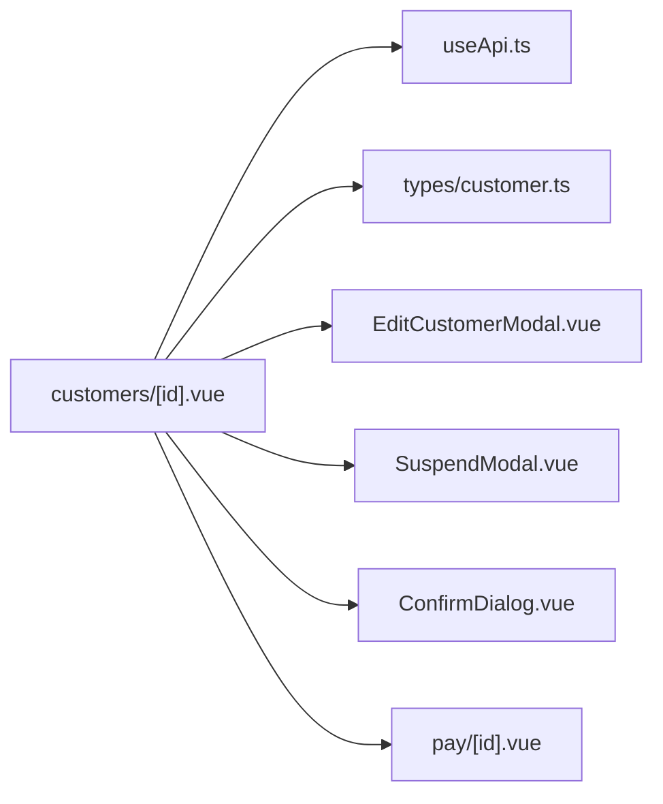

# Customer Detail View

<cite>
**Referenced Files in This Document**
- [app/pages/customers/[id].vue](file://app/pages/customers/[id].vue)
- [app/types/customer.ts](file://app/types/customer.ts)
- [app/composables/useApi.ts](file://app/composables/useApi.ts)
- [app/components/EditCustomerModal.vue](file://app/components/EditCustomerModal.vue)
- [app/components/SuspendModal.vue](file://app/components/SuspendModal.vue)
- [app/components/ConfirmDialog.vue](file://app/components/ConfirmDialog.vue)
- [app/pages/pay/[id].vue](file://app/pages/pay/[id].vue)
</cite>

## Table of Contents
1. [Introduction](#introduction)
2. [Project Structure](#project-structure)
3. [Core Components](#core-components)
4. [Architecture Overview](#architecture-overview)
5. [Detailed Component Analysis](#detailed-component-analysis)
6. [Dependency Analysis](#dependency-analysis)
7. [Performance Considerations](#performance-considerations)
8. [Troubleshooting Guide](#troubleshooting-guide)
9. [Conclusion](#conclusion)

## Introduction
This document explains the customer detail view page implemented with Nuxt.js file-based routing and Vue 3 Composition API. It covers how the page displays a customer profile (personal information, pickup history, billing details, account status), how dynamic routing with an [id] parameter is handled, how data is fetched for individual customers, error handling for missing customers, and integration points with related features such as payment links and pickup history. It also addresses responsive design considerations and user experience patterns used to present detailed customer information effectively.

## Project Structure
The customer detail view is implemented as a Nuxt.js page using file-based routing with a dynamic segment:
- Route pattern: /customers/:id
- Page file: app/pages/customers/[id].vue

Key responsibilities:
- Fetch and display customer profile data
- Render tabs for Overview, Pickup History, Billing, and GPS Location
- Provide actions like suspend/unsuspend, edit, copy payment link, and navigate to payment page
- Integrate map rendering for GPS location when available

**Diagram sources**
- [app/pages/customers/[id].vue](file://app/pages/customers/[id].vue#L1-L35)
- [app/composables/useApi.ts:1-91](file://app/composables/useApi.ts#L1-L91)
- [app/types/customer.ts:1-103](file://app/types/customer.ts#L1-L103)
- [app/components/EditCustomerModal.vue:1-38](file://app/components/EditCustomerModal.vue#L1-L38)
- [app/components/SuspendModal.vue:1-75](file://app/components/SuspendModal.vue#L1-L75)
- [app/components/ConfirmDialog.vue:1-53](file://app/components/ConfirmDialog.vue#L1-L53)
- [app/pages/pay/[id].vue](file://app/pages/pay/[id].vue#L134-L155)

**Section sources**
- [app/pages/customers/[id].vue](file://app/pages/customers/[id].vue#L1-L35)

## Core Components
- Dynamic route handling: The page reads the id from the route params and uses it to fetch the customer record.
- Data fetching: Uses useApi() to call GET /customer/admin/{id} and sets loading/notFound states accordingly.
- Profile display: Shows avatar initials, full name, contact info, address, zone, customer type, and account status badge.
- Tabs: Overview, Pickup History, Billing, GPS Location.
- Actions: Copy payment link, Make Payment navigation, Edit Customer modal, Suspend/Unsuspend flows.
- Pickup history: Paginated list with summary counts; stats computed by iterating all pages once.
- GPS Location: Client-only map initialization with TomTom SDK when coordinates are available.
- Error handling: Global API error handling via useErrorHandler; not-found state shown when no customer is returned.

**Section sources**
- [app/pages/customers/[id].vue](file://app/pages/customers/[id].vue#L15-L35)
- [app/pages/customers/[id].vue](file://app/pages/customers/[id].vue#L37-L51)
- [app/pages/customers/[id].vue](file://app/pages/customers/[id].vue#L168-L170)
- [app/pages/customers/[id].vue](file://app/pages/customers/[id].vue#L244-L254)
- [app/pages/customers/[id].vue](file://app/pages/customers/[id].vue#L274-L322)
- [app/pages/customers/[id].vue](file://app/pages/customers/[id].vue#L181-L242)
- [app/composables/useApi.ts:1-91](file://app/composables/useApi.ts#L1-L91)

## Architecture Overview
The page orchestrates multiple concerns:
- Routing and lifecycle: onMounted triggers initial data load.
- State management: refs and computed properties drive UI reactivity.
- API layer: useApi() centralizes headers, base URL, auth token injection, and error handling.
- Modal interactions: EditCustomerModal, SuspendModal, ConfirmDialog manage user confirmations and edits.
- Map integration: TomTom SDK is dynamically imported and initialized only on the client when GPS data exists.

**Diagram sources**
- [app/pages/customers/[id].vue](file://app/pages/customers/[id].vue#L15-L35)
- [app/pages/customers/[id].vue](file://app/pages/customers/[id].vue#L395-L403)
- [app/pages/customers/[id].vue](file://app/pages/customers/[id].vue#L244-L254)
- [app/pages/customers/[id].vue](file://app/pages/customers/[id].vue#L181-L242)
- [app/composables/useApi.ts:1-91](file://app/composables/useApi.ts#L1-L91)

## Detailed Component Analysis

### Dynamic Routing and Data Fetching
- Route parameter: The page uses Nuxt’s file-based routing with [id] to capture the customer identifier.
- Fetch flow: On mount, the page calls useApi().get('/customer/admin/:id') and updates local state. If the response is null or falsy, it sets a notFound flag to render a friendly “not found” screen.
- Error handling: useApi() wraps requests with useErrorHandler(), which shows toast notifications for failures. Authentication errors (401) trigger logout and redirect to login.

**Diagram sources**
- [app/pages/customers/[id].vue](file://app/pages/customers/[id].vue#L15-L35)
- [app/pages/customers/[id].vue](file://app/pages/customers/[id].vue#L395-L403)
- [app/pages/customers/[id].vue](file://app/pages/customers/[id].vue#L244-L254)
- [app/composables/useApi.ts:1-91](file://app/composables/useApi.ts#L1-L91)

**Section sources**
- [app/pages/customers/[id].vue](file://app/pages/customers/[id].vue#L15-L35)
- [app/pages/customers/[id].vue](file://app/pages/customers/[id].vue#L395-L403)
- [app/composables/useApi.ts:1-91](file://app/composables/useApi.ts#L1-L91)

### Customer Profile Display
- Personal information: Displays full name, initials avatar, phone, email, placeName/address, and customer since date.
- Status badge: Computed based on customer.status with distinct colors for active, overdue, and inactive.
- Quick actions: Copy payment link to clipboard, navigate to payment page (/pay/:id), open edit modal, suspend/unsuspend account.

**Diagram sources**
- [app/types/customer.ts:1-103](file://app/types/customer.ts#L1-L103)

**Section sources**
- [app/pages/customers/[id].vue](file://app/pages/customers/[id].vue#L37-L51)
- [app/pages/customers/[id].vue](file://app/pages/customers/[id].vue#L406-L490)
- [app/types/customer.ts:1-103](file://app/types/customer.ts#L1-L103)

### Pickup History Tab
- Summary metrics: Total pickups, completed, and missed/cancelled/expired counts. Stats are computed by paginating through all records once and aggregating statuses.
- List view: Paginated table showing date, driver, payment type, estimated quantity, and status with color-coded badges.
- Pagination: Controlled by a local page ref; watchers trigger refetch when page changes.

**Diagram sources**
- [app/pages/customers/[id].vue](file://app/pages/customers/[id].vue#L244-L254)
- [app/pages/customers/[id].vue](file://app/pages/customers/[id].vue#L274-L322)
- [app/pages/customers/[id].vue](file://app/pages/customers/[id].vue#L352-L354)

**Section sources**
- [app/pages/customers/[id].vue](file://app/pages/customers/[id].vue#L264-L328)
- [app/pages/customers/[id].vue](file://app/pages/customers/[id].vue#L352-L354)

### Billing Tab
- Current implementation: The Billing tab renders summary cards and a table but does not fetch data yet. A TODO comment indicates that real endpoints should be integrated later.
- Expected structure: The UI expects billing records with amountRaw and status fields to compute totals and colorize status badges.

**Diagram sources**
- [app/pages/customers/[id].vue](file://app/pages/customers/[id].vue#L262-L263)
- [app/pages/customers/[id].vue](file://app/pages/customers/[id].vue#L660-L730)

**Section sources**
- [app/pages/customers/[id].vue](file://app/pages/customers/[id].vue#L262-L263)
- [app/pages/customers/[id].vue](file://app/pages/customers/[id].vue#L660-L730)

### GPS Location Tab
- Conditional rendering: Only initializes the map when GPS coordinates exist and the tab is active.
- Map initialization: Dynamically imports TomTom SDK modules, configures API key from runtime config, creates a map instance, adds a GeoJSON source and circle layer for the pin.
- Error handling: Captures map load errors and displays a user-friendly message.

**Diagram sources**
- [app/pages/customers/[id].vue](file://app/pages/customers/[id].vue#L244-L254)
- [app/pages/customers/[id].vue](file://app/pages/customers/[id].vue#L181-L242)

**Section sources**
- [app/pages/customers/[id].vue](file://app/pages/customers/[id].vue#L176-L179)
- [app/pages/customers/[id].vue](file://app/pages/customers/[id].vue#L181-L242)

### Account Management Actions
- Suspend/Unsuspend: Modals collect reason and confirmation; PATCH endpoints update status and show success toasts.
- Edit Customer: Opens a modal pre-filled with current values; validates required fields and submits updated payload via PATCH.
- Payment link: Copies a generated /pay/:id URL to clipboard and navigates to the payment page.

**Diagram sources**
- [app/pages/customers/[id].vue](file://app/pages/customers/[id].vue#L58-L98)
- [app/components/SuspendModal.vue:1-75](file://app/components/SuspendModal.vue#L1-L75)
- [app/components/ConfirmDialog.vue:1-53](file://app/components/ConfirmDialog.vue#L1-L53)

**Section sources**
- [app/pages/customers/[id].vue](file://app/pages/customers/[id].vue#L58-L98)
- [app/components/SuspendModal.vue:1-75](file://app/components/SuspendModal.vue#L1-L75)
- [app/components/ConfirmDialog.vue:1-53](file://app/components/ConfirmDialog.vue#L1-L53)

### Integration with Related Features
- Payment page: The detail view constructs and copies a payment link (/pay/:id) and provides a direct navigation button to the payment page.
- Pickup management: The pickup history endpoint integrates with the broader pickup request system, enabling staff to review historical pickups per customer.

**Section sources**
- [app/pages/customers/[id].vue](file://app/pages/customers/[id].vue#L139-L146)
- [app/pages/pay/[id].vue](file://app/pages/pay/[id].vue#L134-L155)
- [app/pages/customers/[id].vue](file://app/pages/customers/[id].vue#L274-L322)

## Dependency Analysis
- Page depends on:
  - useApi() for HTTP requests and centralized error handling
  - Types from ~/types/customer.ts for strong typing of responses
  - Modal components for user interactions
  - Runtime configuration for map API keys
  - Nuxt utilities (useRoute, definePageMeta) for routing and layout

**Diagram sources**
- [app/pages/customers/[id].vue](file://app/pages/customers/[id].vue#L1-L35)
- [app/composables/useApi.ts:1-91](file://app/composables/useApi.ts#L1-L91)
- [app/types/customer.ts:1-103](file://app/types/customer.ts#L1-L103)
- [app/components/EditCustomerModal.vue:1-38](file://app/components/EditCustomerModal.vue#L1-L38)
- [app/components/SuspendModal.vue:1-75](file://app/components/SuspendModal.vue#L1-L75)
- [app/components/ConfirmDialog.vue:1-53](file://app/components/ConfirmDialog.vue#L1-L53)
- [app/pages/pay/[id].vue](file://app/pages/pay/[id].vue#L134-L155)

**Section sources**
- [app/pages/customers/[id].vue](file://app/pages/customers/[id].vue#L1-L35)
- [app/composables/useApi.ts:1-91](file://app/composables/useApi.ts#L1-L91)
- [app/types/customer.ts:1-103](file://app/types/customer.ts#L1-L103)

## Performance Considerations
- Lazy map initialization: The GPS map is only created when the tab is active and coordinates exist, avoiding unnecessary overhead.
- One-time stats aggregation: Pickup stats iterate all pages once and cache results to avoid recomputation.
- Pagination: Pickup history uses pagination to limit network payloads and improve rendering performance.
- Client-only operations: Clipboard copy and map initialization are guarded by client checks to prevent server-side issues.

[No sources needed since this section provides general guidance]

## Troubleshooting Guide
- Missing customer: When the API returns no data, the page shows a “Customer not found” state with a back link.
- Network errors: useApi() throws descriptive errors; useErrorHandler() surfaces them via toasts.
- Authentication failures: 401 responses log out the user and redirect to login.
- Map errors: Map load errors set a user-facing message; ensure the TomTom API key is configured in runtime config.

**Section sources**
- [app/pages/customers/[id].vue](file://app/pages/customers/[id].vue#L395-L403)
- [app/composables/useApi.ts:39-58](file://app/composables/useApi.ts#L39-L58)
- [app/pages/customers/[id].vue](file://app/pages/customers/[id].vue#L181-L242)

## Conclusion
The customer detail view provides a comprehensive interface for viewing and managing customer profiles within the dashboard. It leverages Nuxt.js file-based routing, reactive state, and a centralized API composable to deliver a robust user experience. While pickup history is fully integrated, billing remains a placeholder awaiting backend endpoints. Responsive styles and UX patterns ensure clarity across devices, and careful error handling improves reliability. Future enhancements include integrating real billing endpoints and expanding notes/bins sections.