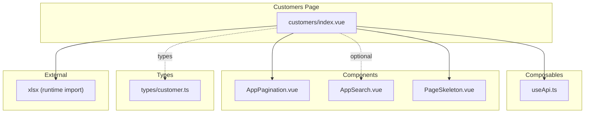
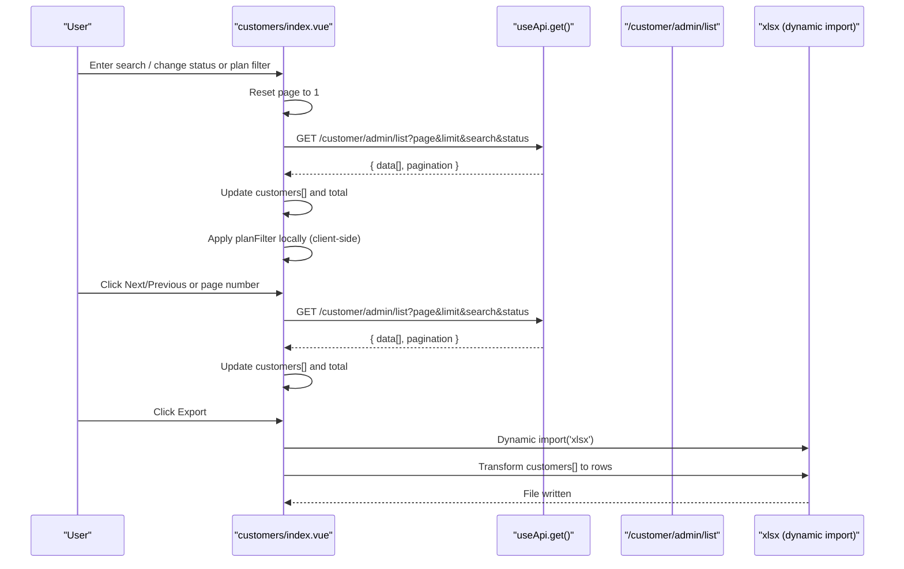
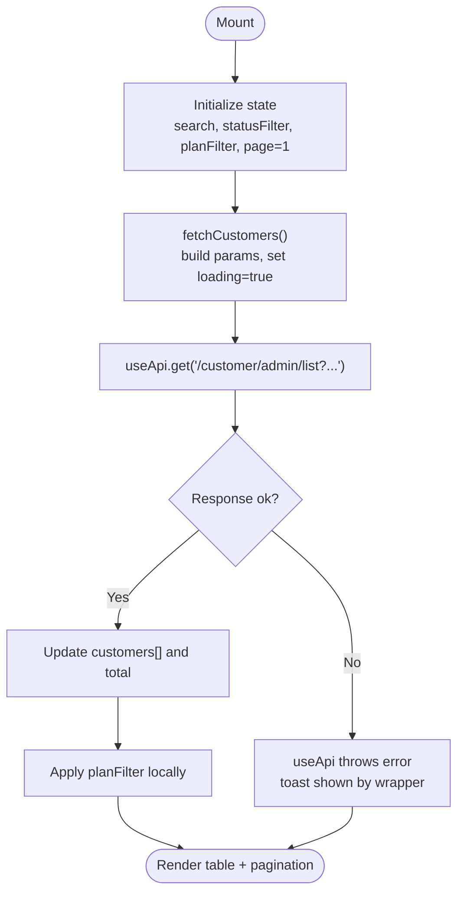
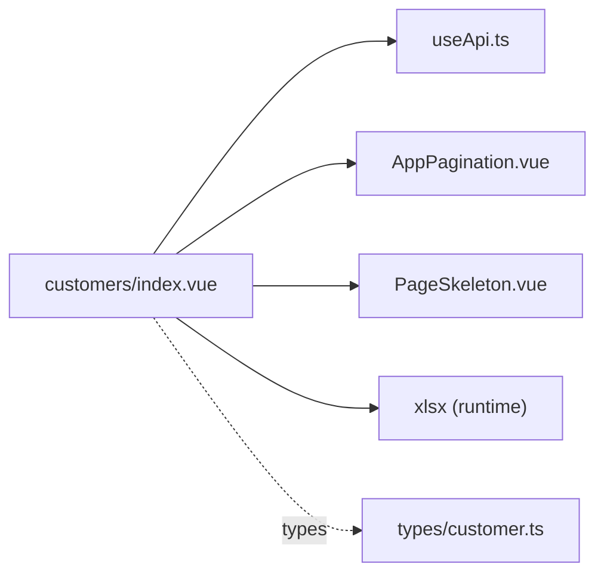

# Customer Listing & Search

<cite>
**Referenced Files in This Document**
- [app/pages/customers/index.vue](file://app/pages/customers/index.vue)
- [app/composables/useApi.ts](file://app/composables/useApi.ts)
- [app/components/AppPagination.vue](file://app/components/AppPagination.vue)
- [app/components/AppSearch.vue](file://app/components/AppSearch.vue)
- [app/types/customer.ts](file://app/types/customer.ts)
- [app/components/PageSkeleton.vue](file://app/components/PageSkeleton.vue)
- [package.json](file://package.json)
</cite>

## Table of Contents
1. [Introduction](#introduction)
2. [Project Structure](#project-structure)
3. [Core Components](#core-components)
4. [Architecture Overview](#architecture-overview)
5. [Detailed Component Analysis](#detailed-component-analysis)
6. [Dependency Analysis](#dependency-analysis)
7. [Performance Considerations](#performance-considerations)
8. [Troubleshooting Guide](#troubleshooting-guide)
9. [Conclusion](#conclusion)

## Introduction
This document explains the customer listing and search functionality implemented in the application. It covers:
- The customer table with server-side pagination
- Real-time search and filtering by status and plan type
- Data fetching using the useApi composable
- Client-side filtering logic for plan type
- Performance optimizations for large datasets
- Excel export using the xlsx library, including data transformation and file generation patterns

The goal is to provide a clear understanding of how the feature works end-to-end and how to extend it safely.

## Project Structure
The customer listing page is implemented as a single-page component that orchestrates:
- State management for filters, pagination, and loading states
- Server-driven data retrieval via useApi
- A reusable pagination component
- A reusable search input component (available but not used directly on this page)
- Type definitions for customers
- A skeleton loader for initial load UX

**Diagram sources**
- [app/pages/customers/index.vue:1-352](file://app/pages/customers/index.vue#L1-L352)
- [app/composables/useApi.ts:1-91](file://app/composables/useApi.ts#L1-L91)
- [app/components/AppPagination.vue:1-48](file://app/components/AppPagination.vue#L1-L48)
- [app/components/AppSearch.vue:1-25](file://app/components/AppSearch.vue#L1-L25)
- [app/components/PageSkeleton.vue:1-300](file://app/components/PageSkeleton.vue#L1-L300)
- [app/types/customer.ts:1-103](file://app/types/customer.ts#L1-L103)
- [package.json:1-33](file://package.json#L1-L33)

**Section sources**
- [app/pages/customers/index.vue:1-352](file://app/pages/customers/index.vue#L1-L352)
- [app/composables/useApi.ts:1-91](file://app/composables/useApi.ts#L1-L91)
- [app/components/AppPagination.vue:1-48](file://app/components/AppPagination.vue#L1-L48)
- [app/components/AppSearch.vue:1-25](file://app/components/AppSearch.vue#L1-L25)
- [app/components/PageSkeleton.vue:1-300](file://app/components/PageSkeleton.vue#L1-L300)
- [app/types/customer.ts:1-103](file://app/types/customer.ts#L1-L103)
- [package.json:1-33](file://package.json#L1-L33)

## Core Components
- Customers index page: Implements state for search, status filter, plan filter, pagination, and loading states; fetches data from the server; renders the table and controls; handles suspend/unsuspend actions; exports to Excel.
- useApi composable: Centralized HTTP client with authentication headers, error handling, and typed wrappers for GET/POST/PUT/PATCH/DELETE.
- AppPagination: Reusable pagination UI that emits page updates and computes display ranges.
- AppSearch: Reusable search input component (not used directly on the customers page).
- PageSkeleton: Loading skeleton for table pages.
- Types: Customer-related TypeScript interfaces for strongly-typed responses.

Key responsibilities:
- Data fetching: build query params, call API, update local state
- Filtering: send search and status to server; apply plan filter locally
- Pagination: controlled by page ref and perPage constant
- Export: transform current dataset into rows and write an Excel file

**Section sources**
- [app/pages/customers/index.vue:74-110](file://app/pages/customers/index.vue#L74-L110)
- [app/composables/useApi.ts:1-91](file://app/composables/useApi.ts#L1-L91)
- [app/components/AppPagination.vue:1-48](file://app/components/AppPagination.vue#L1-L48)
- [app/components/AppSearch.vue:1-25](file://app/components/AppSearch.vue#L1-L25)
- [app/components/PageSkeleton.vue:1-300](file://app/components/PageSkeleton.vue#L1-L300)
- [app/types/customer.ts:1-103](file://app/types/customer.ts#L1-L103)

## Architecture Overview
The customer listing follows a server-driven pagination model with real-time search and server-side status filtering. Plan-type filtering is applied client-side after receiving the page’s dataset.

**Diagram sources**
- [app/pages/customers/index.vue:86-110](file://app/pages/customers/index.vue#L86-L110)
- [app/pages/customers/index.vue:129-162](file://app/pages/customers/index.vue#L129-L162)
- [app/composables/useApi.ts:69-80](file://app/composables/useApi.ts#L69-L80)
- [package.json:14-25](file://package.json#L14-L25)

## Detailed Component Analysis

### Customers Index Page
Responsibilities:
- Manage reactive state: search, statusFilter, planFilter, page, perPage, customers, total, loading flags
- Build query parameters and fetch paginated results
- Reset page when filters change
- Render table with badges for plan and status
- Handle suspend/unsuspend actions and optimistic UI updates
- Export current dataset to Excel

Data fetching pattern:
- Uses useApi.get() to request /customer/admin/list with page, limit, search, and status parameters
- Updates local customers array and total count from response
- Sets loading flags appropriately

Real-time search and filtering:
- Search and status are sent to the server via URLSearchParams
- Plan filter is applied client-side after data arrives

Pagination:
- Controlled by page ref and perPage constant
- Emits update events to AppPagination which triggers re-fetch

Excel export:
- Dynamically imports xlsx at runtime
- Transforms current customers list into rows with normalized fields
- Generates workbook and writes file with date-stamped name

Loading states:
- initialLoading shows PageSkeleton during first mount
- loading dims the table while requests are in-flight
- downloading toggles export button state and spinner

Error handling:
- useApi wraps errors and throws consistent messages
- Export catches exceptions and shows toast feedback

**Diagram sources**
- [app/pages/customers/index.vue:86-110](file://app/pages/customers/index.vue#L86-L110)
- [app/pages/customers/index.vue:103-110](file://app/pages/customers/index.vue#L103-L110)
- [app/composables/useApi.ts:46-67](file://app/composables/useApi.ts#L46-L67)

**Section sources**
- [app/pages/customers/index.vue:74-110](file://app/pages/customers/index.vue#L74-L110)
- [app/pages/customers/index.vue:129-162](file://app/pages/customers/index.vue#L129-L162)
- [app/pages/customers/index.vue:164-168](file://app/pages/customers/index.vue#L164-L168)
- [app/composables/useApi.ts:1-91](file://app/composables/useApi.ts#L1-L91)

### useApi Composable
Provides:
- Automatic Authorization header injection from auth store
- Unified error handling and logging
- Typed convenience methods: get, post, put, patch, del
- signIn helper and raw request access

For customer listing:
- GET calls return parsed JSON or null on failure
- 401 redirects to login and throws session expired error
- Non-success statuses throw descriptive errors

**Section sources**
- [app/composables/useApi.ts:1-91](file://app/composables/useApi.ts#L1-L91)

### AppPagination Component
Props:
- page: current page
- total: total records
- perPage: items per page (optional)

Emits:
- update:page with new page number

Behavior:
- Computes totalPages, from/to range
- Disables prev/next when at boundaries
- Highlights active page

Integration:
- Bound to page ref in customers page; emits update:page to trigger re-fetch

**Section sources**
- [app/components/AppPagination.vue:1-48](file://app/components/AppPagination.vue#L1-L48)
- [app/pages/customers/index.vue:323-323](file://app/pages/customers/index.vue#L323-L323)

### AppSearch Component
Reusable search input with v-model binding and placeholder customization. Not used directly on the customers page, but available for reuse elsewhere.

**Section sources**
- [app/components/AppSearch.vue:1-25](file://app/components/AppSearch.vue#L1-L25)

### PageSkeleton Component
Provides table-style skeleton layout for initial loading. Used on the customers page to improve perceived performance.

**Section sources**
- [app/components/PageSkeleton.vue:1-300](file://app/components/PageSkeleton.vue#L1-L300)
- [app/pages/customers/index.vue:175-175](file://app/pages/customers/index.vue#L175-L175)

### Types
Customer-related interfaces define shapes for user, customer type, zone, and pickup history. While the customers list uses a generic any[] for simplicity, these types can be leveraged for stronger typing across features.

**Section sources**
- [app/types/customer.ts:1-103](file://app/types/customer.ts#L1-L103)

## Dependency Analysis
- The customers page depends on:
  - useApi for network requests
  - AppPagination for navigation
  - PageSkeleton for initial loading UX
  - xlsx for Excel export (dynamically imported)
- External dependency:
  - xlsx is declared in package.json and imported dynamically to avoid blocking initial bundle size

**Diagram sources**
- [app/pages/customers/index.vue:1-352](file://app/pages/customers/index.vue#L1-L352)
- [app/composables/useApi.ts:1-91](file://app/composables/useApi.ts#L1-L91)
- [app/components/AppPagination.vue:1-48](file://app/components/AppPagination.vue#L1-L48)
- [app/components/PageSkeleton.vue:1-300](file://app/components/PageSkeleton.vue#L1-L300)
- [app/types/customer.ts:1-103](file://app/types/customer.ts#L1-L103)
- [package.json:14-25](file://package.json#L14-L25)

**Section sources**
- [package.json:14-25](file://package.json#L14-L25)
- [app/pages/customers/index.vue:129-162](file://app/pages/customers/index.vue#L129-L162)

## Performance Considerations
- Server-side pagination: Reduces payload size by requesting only a subset of records per page.
- Debounced search: Consider debouncing the search input to reduce frequent re-fetches on rapid typing.
- Client-side plan filter: Applied after each fetch; for very large pages, consider moving plan filtering to the server if needed.
- Lazy-loading xlsx: The export function dynamically imports xlsx to keep initial bundle small.
- Optimistic UI: Suspend/unsuspend operations update the local row immediately for responsiveness.
- Avoid unnecessary re-renders: Keep computed formatting functions memoized where appropriate.

[No sources needed since this section provides general guidance]

## Troubleshooting Guide
Common issues and resolutions:
- No data displayed:
  - Verify API base configuration and network connectivity
  - Check console logs from useApi for request/response details
  - Ensure pagination params are correct and within valid ranges
- Authentication failures:
  - 401 responses trigger logout and redirect to login; ensure token is present and valid
- Export fails:
  - Ensure xlsx is installed and dynamic import succeeds
  - Validate that the current dataset is non-empty before exporting
- Filters not working:
  - Confirm search and status are appended to query string
  - For plan filter, verify the local mapping logic matches backend values

**Section sources**
- [app/composables/useApi.ts:39-67](file://app/composables/useApi.ts#L39-L67)
- [app/pages/customers/index.vue:86-110](file://app/pages/customers/index.vue#L86-L110)
- [app/pages/customers/index.vue:129-162](file://app/pages/customers/index.vue#L129-L162)

## Conclusion
The customer listing feature combines server-driven pagination with real-time search and selective client-side filtering. It leverages a robust HTTP composable for consistent error handling and integrates a reusable pagination component. The Excel export uses a dynamic import strategy to minimize bundle impact while providing a straightforward data transformation pipeline. Following the patterns outlined here will help you extend filters, optimize performance, and maintain consistency across similar list views.