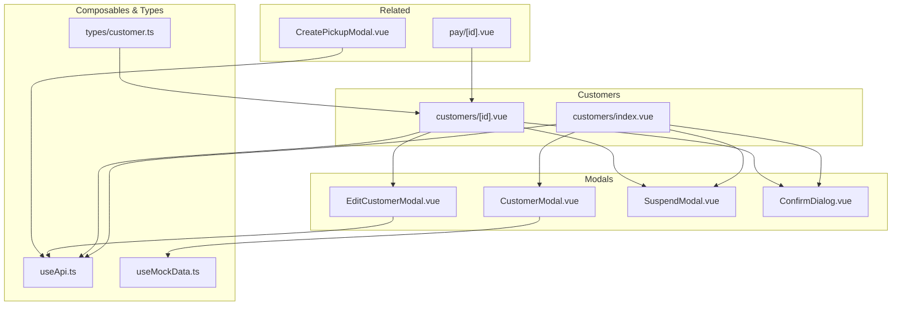
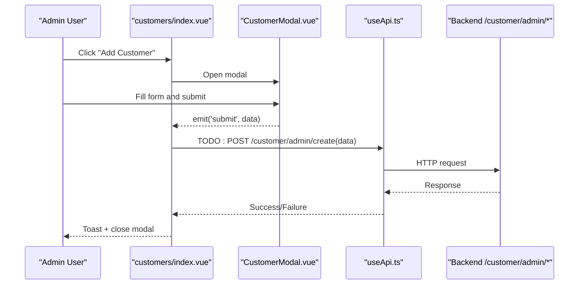
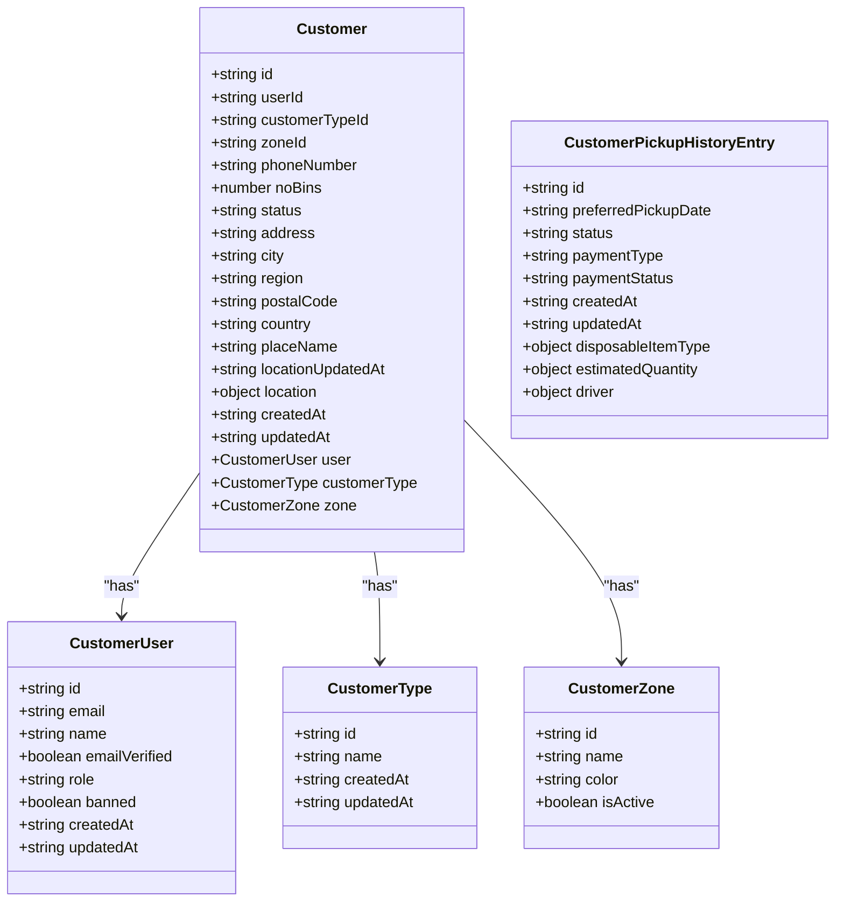
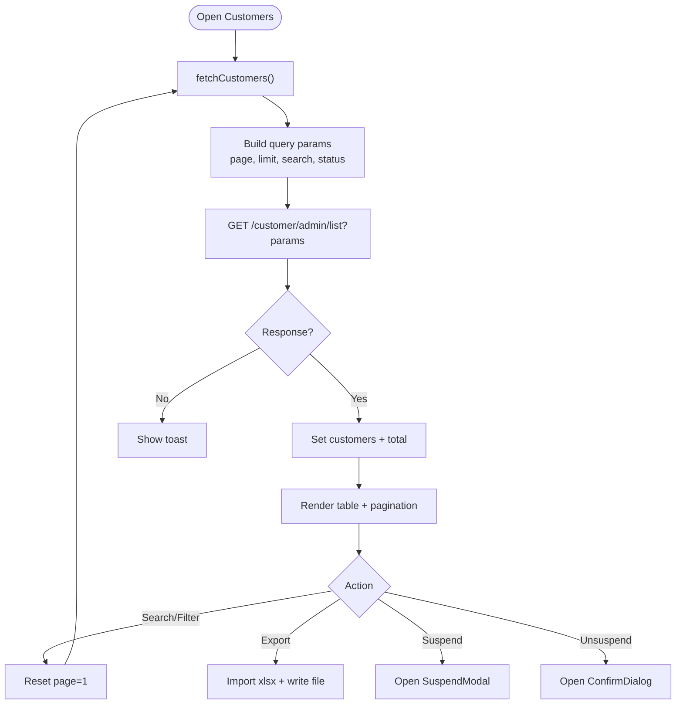
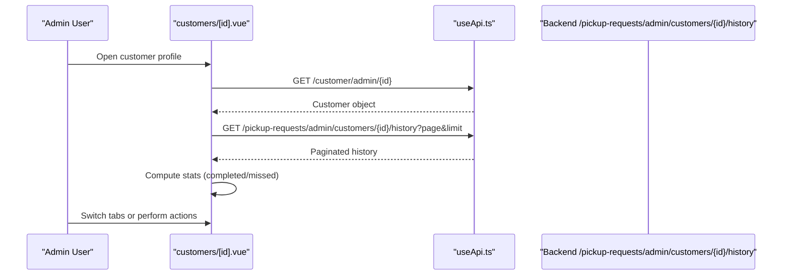
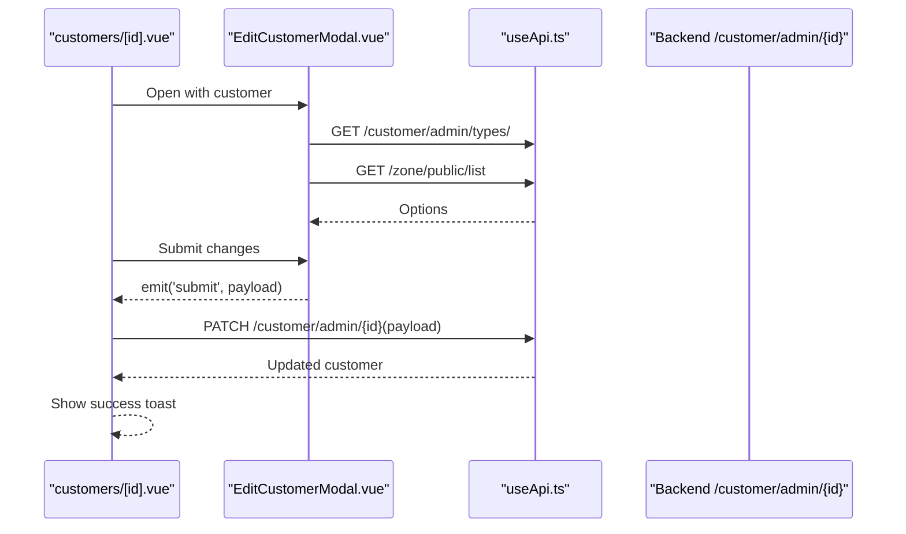
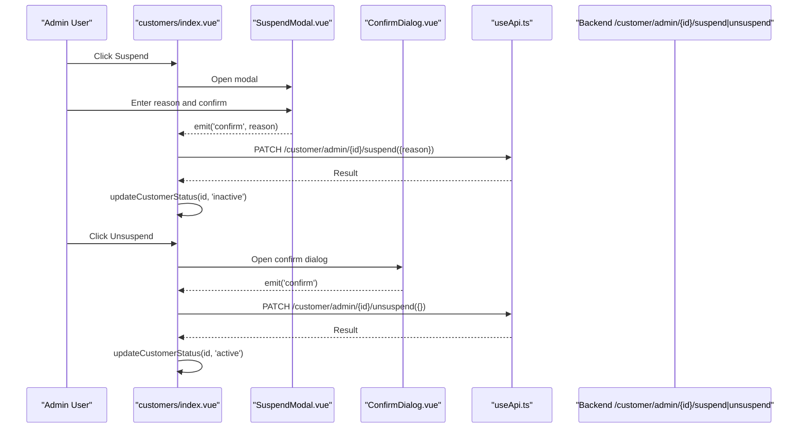
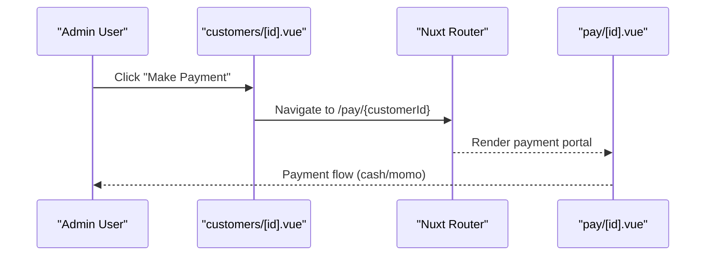
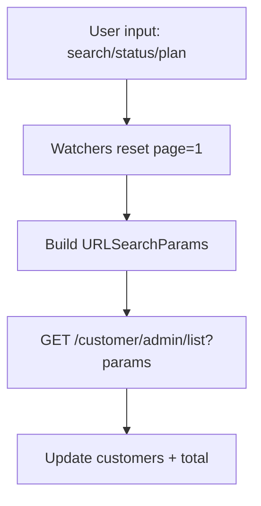
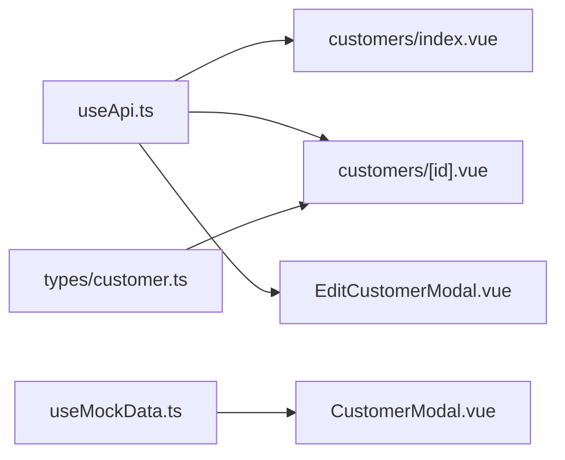

# Customer Management System

<cite>
**Referenced Files in This Document**
- [index.vue](file://app/pages/customers/index.vue)
- [id.vue](file://app/pages/customers/[id].vue)
- [CustomerModal.vue](file://app/components/CustomerModal.vue)
- [EditCustomerModal.vue](file://app/components/EditCustomerModal.vue)
- [SuspendModal.vue](file://app/components/SuspendModal.vue)
- [ConfirmDialog.vue](file://app/components/ConfirmDialog.vue)
- [useApi.ts](file://app/composables/useApi.ts)
- [customer.ts](file://app/types/customer.ts)
- [useMockData.ts](file://app/composables/useMockData.ts)
- [CreatePickupModal.vue](file://app/components/CreatePickupModal.vue)
- [pay-id.vue](file://app/pages/pay/[id].vue)
</cite>

## Table of Contents
1. [Introduction](#introduction)
2. [Project Structure](#project-structure)
3. [Core Components](#core-components)
4. [Architecture Overview](#architecture-overview)
5. [Detailed Component Analysis](#detailed-component-analysis)
6. [Dependency Analysis](#dependency-analysis)
7. [Performance Considerations](#performance-considerations)
8. [Troubleshooting Guide](#troubleshooting-guide)
9. [Conclusion](#conclusion)
10. [Appendices](#appendices)

## Introduction
This document explains the customer management system implemented in the console application. It covers the complete customer lifecycle: listing, searching and filtering, creating via modal, editing details, suspending/reactivating accounts, viewing detailed profiles with pickup history and billing summaries, exporting data to Excel, and integrating with the payment portal. The documentation includes code-level diagrams, data model definitions, validation patterns, and UX considerations for efficient workflows.

## Project Structure
The customer management feature spans pages, components, composables, and types:
- Pages:
  - Customers list and actions: app/pages/customers/index.vue
  - Customer detail profile: app/pages/customers/[id].vue
  - Payment portal (customer-facing): app/pages/pay/[id].vue
- Components:
  - Add customer modal: app/components/CustomerModal.vue
  - Edit customer modal: app/components/EditCustomerModal.vue
  - Suspend account modal: app/components/SuspendModal.vue
  - Generic confirm dialog: app/components/ConfirmDialog.vue
  - Pickup creation uses a customer search helper: app/components/CreatePickupModal.vue
- Composables:
  - API client wrapper: app/composables/useApi.ts
  - Mock reference data: app/composables/useMockData.ts
- Types:
  - Customer domain models: app/types/customer.ts

**Diagram sources**
- [index.vue:1-352](file://app/pages/customers/index.vue#L1-L352)
- [id.vue:1-800](file://app/pages/customers/[id].vue#L1-L800)
- [CustomerModal.vue:1-216](file://app/components/CustomerModal.vue#L1-L216)
- [EditCustomerModal.vue:1-242](file://app/components/EditCustomerModal.vue#L1-L242)
- [SuspendModal.vue:1-75](file://app/components/SuspendModal.vue#L1-L75)
- [ConfirmDialog.vue:1-53](file://app/components/ConfirmDialog.vue#L1-L53)
- [useApi.ts:1-91](file://app/composables/useApi.ts#L1-L91)
- [useMockData.ts:1-61](file://app/composables/useMockData.ts#L1-L61)
- [customer.ts:1-103](file://app/types/customer.ts#L1-L103)
- [CreatePickupModal.vue:58-98](file://app/components/CreatePickupModal.vue#L58-L98)
- [pay-id.vue:1-353](file://app/pages/pay/[id].vue#L1-L353)

**Section sources**
- [index.vue:1-352](file://app/pages/customers/index.vue#L1-L352)
- [id.vue:1-800](file://app/pages/customers/[id].vue#L1-L800)
- [CustomerModal.vue:1-216](file://app/components/CustomerModal.vue#L1-L216)
- [EditCustomerModal.vue:1-242](file://app/components/EditCustomerModal.vue#L1-L242)
- [SuspendModal.vue:1-75](file://app/components/SuspendModal.vue#L1-L75)
- [ConfirmDialog.vue:1-53](file://app/components/ConfirmDialog.vue#L1-L53)
- [useApi.ts:1-91](file://app/composables/useApi.ts#L1-L91)
- [useMockData.ts:1-61](file://app/composables/useMockData.ts#L1-L61)
- [customer.ts:1-103](file://app/types/customer.ts#L1-L103)
- [CreatePickupModal.vue:58-98](file://app/components/CreatePickupModal.vue#L58-L98)
- [pay-id.vue:1-353](file://app/pages/pay/[id].vue#L1-L353)

## Core Components
- Customers List Page
  - Provides search by text, status filter, plan filter, pagination, and Excel export of current page.
  - Supports suspend/un-suspend with confirmation modals and immediate UI updates.
- Customer Detail Page
  - Displays profile overview, pickup history with stats, billing summary, and GPS location map.
  - Supports edit via modal and suspension controls.
- Modals
  - Add Customer: form with validation; currently logs payload (TODO: integrate create endpoint).
  - Edit Customer: loads options from APIs, validates required fields, emits updated payload.
  - Suspend Account: requires reason; calls admin endpoints.
  - Confirm Dialog: reusable confirmation UI.
- API Client
  - Centralized fetch wrapper with auth header injection, error handling, and typed helpers.
- Data Models
  - Strongly typed interfaces for Customer, CustomerUser, CustomerZone, CustomerType, and pickup history entries.

**Section sources**
- [index.vue:1-352](file://app/pages/customers/index.vue#L1-L352)
- [id.vue:1-800](file://app/pages/customers/[id].vue#L1-L800)
- [CustomerModal.vue:1-216](file://app/components/CustomerModal.vue#L1-L216)
- [EditCustomerModal.vue:1-242](file://app/components/EditCustomerModal.vue#L1-L242)
- [SuspendModal.vue:1-75](file://app/components/SuspendModal.vue#L1-L75)
- [ConfirmDialog.vue:1-53](file://app/components/ConfirmDialog.vue#L1-L53)
- [useApi.ts:1-91](file://app/composables/useApi.ts#L1-L91)
- [customer.ts:1-103](file://app/types/customer.ts#L1-L103)

## Architecture Overview
The system follows a page-component-modal architecture with a centralized API composable. The list and detail pages orchestrate state, while modals encapsulate user interactions. Data models are defined in TypeScript for type safety across the UI.

**Diagram sources**
- [index.vue:112-116](file://app/pages/customers/index.vue#L112-L116)
- [CustomerModal.vue:46-49](file://app/components/CustomerModal.vue#L46-L49)
- [useApi.ts:69-80](file://app/composables/useApi.ts#L69-L80)

## Detailed Component Analysis

### Data Model
The customer domain is modeled with clear interfaces that describe user account info, customer metadata, zone assignment, and pickup history entries.

**Diagram sources**
- [customer.ts:1-103](file://app/types/customer.ts#L1-L103)

**Section sources**
- [customer.ts:1-103](file://app/types/customer.ts#L1-L103)

### Customers List: CRUD, Search, Filters, Export
- Read: Fetches paginated customers with optional search and status filters.
- Create: Opens modal; submission handler is present but not wired to an API call yet.
- Update: Not directly on this page; edits occur in the detail view.
- Delete: Not implemented here.
- Suspend/Unsuspend: Calls admin endpoints and updates local state immediately.
- Search/Filter: Text search, status dropdown, plan dropdown; resets page on change.
- Export: Generates Excel file using xlsx for the current page’s rows.

**Diagram sources**
- [index.vue:86-110](file://app/pages/customers/index.vue#L86-L110)
- [index.vue:129-162](file://app/pages/customers/index.vue#L129-L162)
- [index.vue:24-65](file://app/pages/customers/index.vue#L24-L65)

**Section sources**
- [index.vue:1-352](file://app/pages/customers/index.vue#L1-L352)

### Customer Detail: Profile, Pickup History, Billing, GPS
- Profile Overview: Displays account information, service address, assigned zone, and quick actions (copy payment link, make payment, edit, suspend).
- Pickup History: Loads aggregated stats and paginated history; shows totals, completed, and missed counts.
- Billing Summary: Shows total billed, paid, and outstanding amounts; placeholder table for records.
- GPS Location: Initializes TomTom map when available; handles missing API key gracefully.

**Diagram sources**
- [id.vue:15-33](file://app/pages/customers/[id].vue#L15-L33)
- [id.vue:274-322](file://app/pages/customers/[id].vue#L274-L322)

**Section sources**
- [id.vue:1-800](file://app/pages/customers/[id].vue#L1-L800)

### Modal-Based Editing Workflows
- Add Customer Modal
  - Fields include personal info, password setup, zone selection, bin count, and optional entity name for non-regular types.
  - Validation enforces required fields, email format, password length, and match.
  - Emits validated payload to parent; parent currently logs it (TODO: wire create API).
- Edit Customer Modal
  - Loads customer types and zones from APIs on mount.
  - Validates required fields (phone, address, city, customer type, zone, bins >= 0).
  - Emits normalized payload to parent; parent patches customer record.

**Diagram sources**
- [EditCustomerModal.vue:29-38](file://app/components/EditCustomerModal.vue#L29-L38)
- [EditCustomerModal.vue:66-81](file://app/components/EditCustomerModal.vue#L66-L81)
- [id.vue:100-126](file://app/pages/customers/[id].vue#L100-L126)

**Section sources**
- [CustomerModal.vue:1-216](file://app/components/CustomerModal.vue#L1-L216)
- [EditCustomerModal.vue:1-242](file://app/components/EditCustomerModal.vue#L1-L242)
- [id.vue:100-126](file://app/pages/customers/[id].vue#L100-L126)

### Suspension Workflow
- Suspend: Requires a reason; calls admin suspend endpoint; updates local status to inactive.
- Unsuspend: Confirmation dialog; calls unsuspend endpoint; updates local status to active.

**Diagram sources**
- [index.vue:24-65](file://app/pages/customers/index.vue#L24-L65)
- [SuspendModal.vue:1-75](file://app/components/SuspendModal.vue#L1-L75)
- [ConfirmDialog.vue:1-53](file://app/components/ConfirmDialog.vue#L1-L53)

**Section sources**
- [index.vue:1-352](file://app/pages/customers/index.vue#L1-L352)
- [SuspendModal.vue:1-75](file://app/components/SuspendModal.vue#L1-L75)
- [ConfirmDialog.vue:1-53](file://app/components/ConfirmDialog.vue#L1-L53)

### Integration with Billing and Payments
- Customer Detail:
  - “Make Payment” button navigates to the customer payment portal route.
  - “Copy Payment Link” generates a shareable URL for the customer.
- Payment Portal:
  - Displays invoices and allows cash or mobile money payments with validation and simulated processing.
- Billing Dashboard:
  - Separate module for transfers and invoices; not directly tied to customer detail but part of the broader billing ecosystem.

**Diagram sources**
- [id.vue:469-487](file://app/pages/customers/[id].vue#L469-L487)
- [pay-id.vue:1-353](file://app/pages/pay/[id].vue#L1-L353)

**Section sources**
- [id.vue:1-800](file://app/pages/customers/[id].vue#L1-L800)
- [pay-id.vue:1-353](file://app/pages/pay/[id].vue#L1-L353)

### Search and Filtering Capabilities
- Customers List:
  - Text search, status filter, plan filter; watchers reset pagination and refetch.
- Pickup Creation Helper:
  - Uses paginated list endpoint to load all customers for autocomplete; normalizes nested name fields.

**Diagram sources**
- [index.vue:74-104](file://app/pages/customers/index.vue#L74-L104)
- [CreatePickupModal.vue:75-98](file://app/components/CreatePickupModal.vue#L75-L98)

**Section sources**
- [index.vue:74-104](file://app/pages/customers/index.vue#L74-L104)
- [CreatePickupModal.vue:58-98](file://app/components/CreatePickupModal.vue#L58-L98)

### Bulk Operations
- Current implementation does not provide bulk selection or batch operations in the customers list.
- Export functionality is limited to the current page’s dataset.

[No sources needed since this section summarizes capabilities without analyzing specific files]

## Dependency Analysis
- API Client Coupling
  - All customer-related pages use the same API composable for consistent headers, error handling, and 401 redirects.
- Modal Dependencies
  - Add modal depends on mock reference data for initial development; Edit modal depends on live endpoints for types and zones.
- Type Safety
  - Customer detail strongly types responses and related entities, improving reliability.

**Diagram sources**
- [useApi.ts:1-91](file://app/composables/useApi.ts#L1-L91)
- [customer.ts:1-103](file://app/types/customer.ts#L1-L103)
- [useMockData.ts:1-61](file://app/composables/useMockData.ts#L1-L61)
- [index.vue:1-352](file://app/pages/customers/index.vue#L1-L352)
- [id.vue:1-800](file://app/pages/customers/[id].vue#L1-L800)
- [EditCustomerModal.vue:1-242](file://app/components/EditCustomerModal.vue#L1-L242)
- [CustomerModal.vue:1-216](file://app/components/CustomerModal.vue#L1-L216)

**Section sources**
- [useApi.ts:1-91](file://app/composables/useApi.ts#L1-L91)
- [customer.ts:1-103](file://app/types/customer.ts#L1-L103)
- [useMockData.ts:1-61](file://app/composables/useMockData.ts#L1-L61)
- [index.vue:1-352](file://app/pages/customers/index.vue#L1-L352)
- [id.vue:1-800](file://app/pages/customers/[id].vue#L1-L800)
- [EditCustomerModal.vue:1-242](file://app/components/EditCustomerModal.vue#L1-L242)
- [CustomerModal.vue:1-216](file://app/components/CustomerModal.vue#L1-L216)

## Performance Considerations
- Pagination
  - Both list and pickup history use server-side pagination to reduce payload size.
- Lazy Loading
  - Map initialization is deferred until the GPS tab is selected and only if coordinates exist.
- Conditional Imports
  - Excel library is dynamically imported to avoid bundling overhead unless used.
- Stats Aggregation
  - Pickup stats loop through multiple pages to compute totals; consider backend aggregation endpoints for large datasets.

[No sources needed since this section provides general guidance]

## Troubleshooting Guide
- Authentication Errors
  - The API client automatically logs out and redirects on 401 responses.
- Missing API Keys
  - GPS map displays an error message if the TomTom API key is not configured.
- Form Validation
  - Add and Edit modals show inline errors for required fields and constraints.
- Export Failures
  - Export function catches exceptions and shows a toast; ensure xlsx is available at runtime.

**Section sources**
- [useApi.ts:39-44](file://app/composables/useApi.ts#L39-L44)
- [id.vue:191-195](file://app/pages/customers/[id].vue#L191-L195)
- [CustomerModal.vue:33-44](file://app/components/CustomerModal.vue#L33-L44)
- [EditCustomerModal.vue:55-64](file://app/components/EditCustomerModal.vue#L55-L64)
- [index.vue:129-162](file://app/pages/customers/index.vue#L129-L162)

## Conclusion
The customer management system provides a robust foundation for administrative tasks: listing with search/filtering, detailed profiles with pickup history and billing summaries, modal-driven editing, suspension workflows, and integration with the payment portal. While bulk operations are not yet implemented, the modular design and strong typing support future enhancements such as batch actions and server-side aggregations.

[No sources needed since this section summarizes without analyzing specific files]

## Appendices

### Example Workflows from Codebase
- Creating a customer
  - Open modal, validate inputs, emit payload to parent, and implement the pending API call.
  - See: [CustomerModal.vue:46-49](file://app/components/CustomerModal.vue#L46-L49), [index.vue:112-116](file://app/pages/customers/index.vue#L112-L116)
- Updating customer details
  - Load options, validate, emit payload, patch via API, refresh UI.
  - See: [EditCustomerModal.vue:29-38](file://app/components/EditCustomerModal.vue#L29-L38), [id.vue:100-126](file://app/pages/customers/[id].vue#L100-L126)
- Tracking pickup history
  - Fetch paginated history and compute stats; display totals and per-page items.
  - See: [id.vue:274-322](file://app/pages/customers/[id].vue#L274-L322)

**Section sources**
- [CustomerModal.vue:46-49](file://app/components/CustomerModal.vue#L46-L49)
- [index.vue:112-116](file://app/pages/customers/index.vue#L112-L116)
- [EditCustomerModal.vue:29-38](file://app/components/EditCustomerModal.vue#L29-L38)
- [id.vue:100-126](file://app/pages/customers/[id].vue#L100-L126)
- [id.vue:274-322](file://app/pages/customers/[id].vue#L274-L322)