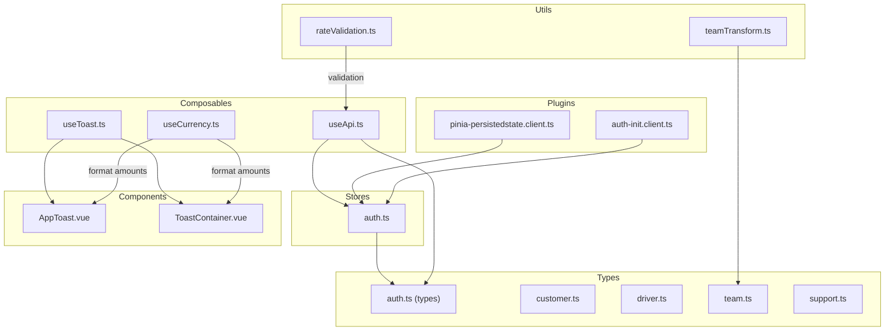
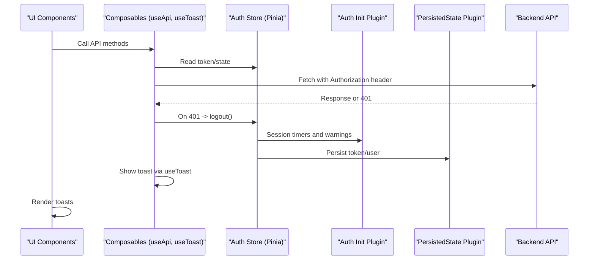
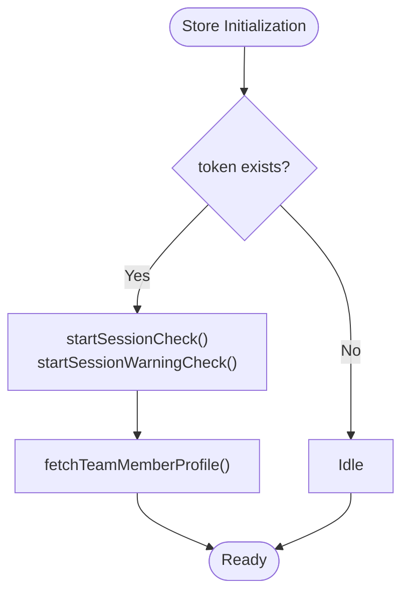
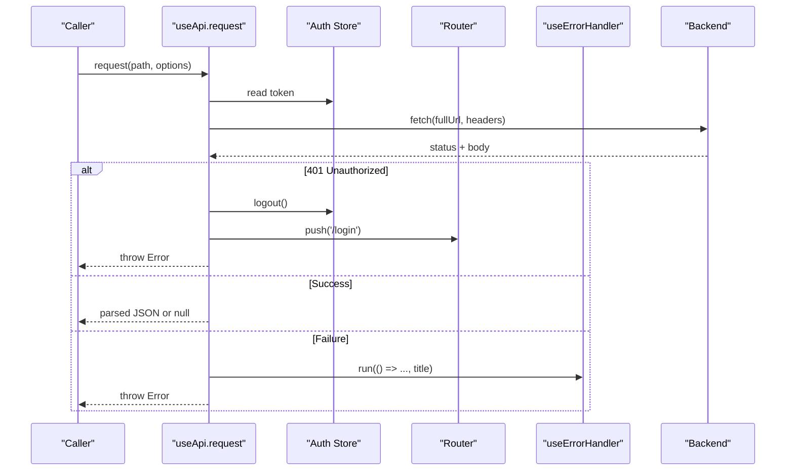
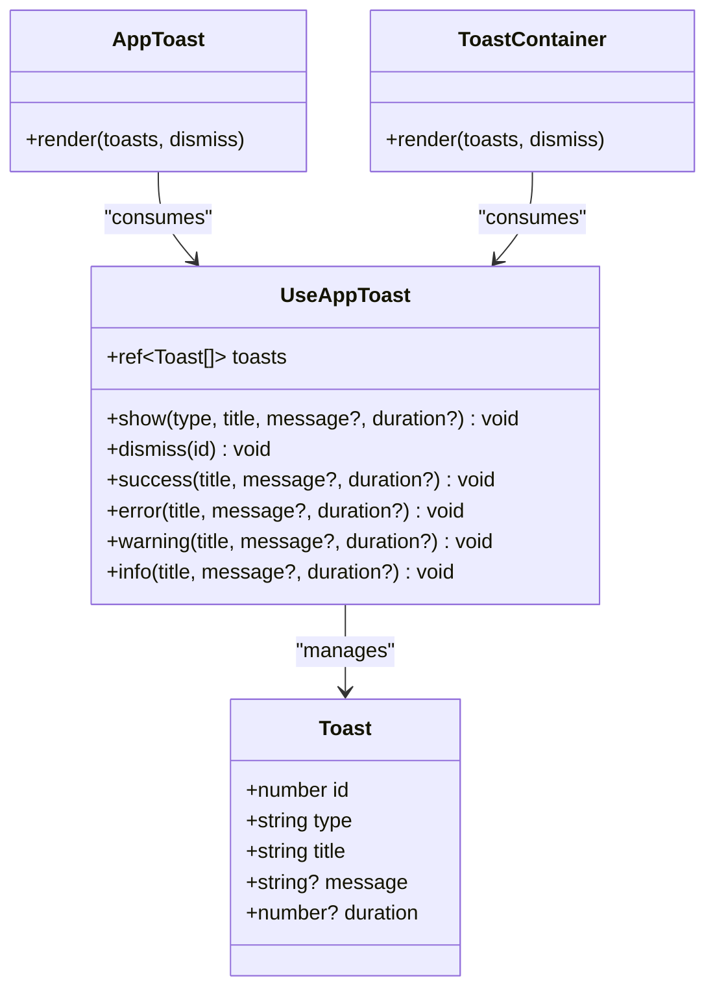
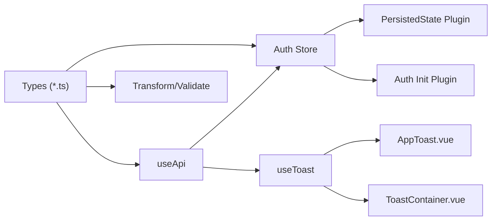

# Data Management & State

<cite>
**Referenced Files in This Document**
- [auth.ts](file://app/stores/auth.ts)
- [pinia-persistedstate.client.ts](file://app/plugins/pinia-persistedstate.client.ts)
- [useToast.ts](file://app/composables/useToast.ts)
- [AppToast.vue](file://app/components/AppToast.vue)
- [ToastContainer.vue](file://app/components/ToastContainer.vue)
- [auth.ts (types)](file://app/types/auth.ts)
- [customer.ts](file://app/types/customer.ts)
- [driver.ts](file://app/types/driver.ts)
- [team.ts](file://app/types/team.ts)
- [support.ts](file://app/types/support.ts)
- [useCurrency.ts](file://app/composables/useCurrency.ts)
- [useApi.ts](file://app/composables/useApi.ts)
- [teamTransform.ts](file://app/utils/teamTransform.ts)
- [rateValidation.ts](file://app/utils/rateValidation.ts)
- [auth-init.client.ts](file://app/plugins/auth-init.client.ts)
</cite>

## Table of Contents
1. Introduction
2. Project Structure
3. Core Components
4. Architecture Overview
5. Detailed Component Analysis
6. Dependency Analysis
7. Performance Considerations
8. Troubleshooting Guide
9. Conclusion

## Introduction
This document explains the data management and state handling patterns used across the application. It focuses on:
- Pinia store architecture for reactive state and persistence
- Type definitions that enforce type safety across modules
- Currency formatting utilities
- Toast notification system
- Reactive state management, data persistence strategies, and data transformation utilities
It also provides guidance for creating new stores, defining types, and managing complex state relationships.

## Project Structure
The relevant parts of the project are organized by feature area:
- Stores: Centralized reactive state with Pinia
- Composables: Shared logic for API calls, currency formatting, toasts
- Types: Strongly-typed models for domain entities and API payloads
- Utils: Validation and transformation helpers
- Plugins: App initialization and Pinia plugins
- Components: UI components consuming composables and stores

**Diagram sources**
- [auth.ts](file://app/stores/auth.ts)
- [useApi.ts](file://app/composables/useApi.ts)
- [useToast.ts](file://app/composables/useToast.ts)
- [useCurrency.ts](file://app/composables/useCurrency.ts)
- [auth.ts (types)](file://app/types/auth.ts)
- [customer.ts](file://app/types/customer.ts)
- [driver.ts](file://app/types/driver.ts)
- [team.ts](file://app/types/team.ts)
- [support.ts](file://app/types/support.ts)
- [teamTransform.ts](file://app/utils/teamTransform.ts)
- [rateValidation.ts](file://app/utils/rateValidation.ts)
- [pinia-persistedstate.client.ts](file://app/plugins/pinia-persistedstate.client.ts)
- [auth-init.client.ts](file://app/plugins/auth-init.client.ts)
- [AppToast.vue](file://app/components/AppToast.vue)
- [ToastContainer.vue](file://app/components/ToastContainer.vue)

**Section sources**
- [auth.ts](file://app/stores/auth.ts)
- [useApi.ts](file://app/composables/useApi.ts)
- [useToast.ts](file://app/composables/useToast.ts)
- [useCurrency.ts](file://app/composables/useCurrency.ts)
- [auth.ts (types)](file://app/types/auth.ts)
- [customer.ts](file://app/types/customer.ts)
- [driver.ts](file://app/types/driver.ts)
- [team.ts](file://app/types/team.ts)
- [support.ts](file://app/types/support.ts)
- [teamTransform.ts](file://app/utils/teamTransform.ts)
- [rateValidation.ts](file://app/utils/rateValidation.ts)
- [pinia-persistedstate.client.ts](file://app/plugins/pinia-persistedstate.client.ts)
- [auth-init.client.ts](file://app/plugins/auth-init.client.ts)
- [AppToast.vue](file://app/components/AppToast.vue)
- [ToastContainer.vue](file://app/components/ToastContainer.vue)

## Core Components
- Auth Store: Manages authentication state, session lifecycle, and profile enrichment. Uses Pinia with a persistence plugin to keep tokens and user data across reloads.
- API Composable: Centralizes HTTP requests, attaches auth headers, handles 401 redirects, and integrates error handling with toast notifications.
- Toast System: Provides a composable for showing success/error/warning/info messages and two UI implementations for rendering them.
- Currency Utility: Formats monetary values using locale-specific rules.
- Types: Strongly typed models for users, customers, drivers, teams, support tickets, and API payloads.
- Utilities: Transform form data into API payloads and validate inputs before submission.

**Section sources**
- [auth.ts](file://app/stores/auth.ts)
- [useApi.ts](file://app/composables/useApi.ts)
- [useToast.ts](file://app/composables/useToast.ts)
- [AppToast.vue](file://app/components/AppToast.vue)
- [ToastContainer.vue](file://app/components/ToastContainer.vue)
- [useCurrency.ts](file://app/composables/useCurrency.ts)
- [auth.ts (types)](file://app/types/auth.ts)
- [customer.ts](file://app/types/customer.ts)
- [driver.ts](file://app/types/driver.ts)
- [team.ts](file://app/types/team.ts)
- [support.ts](file://app/types/support.ts)
- [teamTransform.ts](file://app/utils/teamTransform.ts)
- [rateValidation.ts](file://app/utils/rateValidation.ts)

## Architecture Overview
The application uses a layered approach:
- UI components consume composables and stores
- Composables orchestrate API calls and side effects
- Stores encapsulate reactive state and persistence
- Types ensure compile-time correctness across layers
- Plugins initialize app-wide behavior (auth checks, persistence)

**Diagram sources**
- [useApi.ts](file://app/composables/useApi.ts)
- [auth.ts](file://app/stores/auth.ts)
- [pinia-persistedstate.client.ts](file://app/plugins/pinia-persistedstate.client.ts)
- [auth-init.client.ts](file://app/plugins/auth-init.client.ts)
- [useToast.ts](file://app/composables/useToast.ts)

## Detailed Component Analysis

### Authentication Store (Pinia)
Responsibilities:
- Maintain user identity, token, team member profile, and session metadata
- Enrich user with role and permissions from profile endpoint
- Manage periodic session validation and warning countdown
- Provide actions to set credentials, refresh, extend, and logout
- Persist critical fields across browser sessions

Reactive state:
- user, token, teamMember, sessionExpiresAt, showSessionWarning, sessionWarningTime
- isAuthenticated computed property

Key flows:
- setAuth: persists token and user, sets expiry, fetches profile, starts timers
- checkSession: validates session, updates user/profile, resets expiry, logs out on failure
- startSessionCheck/startSessionWarningCheck: intervals for background checks and UI warnings
- logout: clears state, stops timers, optionally calls sign-out endpoint

Persistence:
- Enabled via persisted state plugin; ensures token and user survive reloads

**Diagram sources**
- [auth.ts](file://app/stores/auth.ts)

**Section sources**
- [auth.ts](file://app/stores/auth.ts)
- [pinia-persistedstate.client.ts](file://app/plugins/pinia-persistedstate.client.ts)
- [auth-init.client.ts](file://app/plugins/auth-init.client.ts)

### API Composable
Responsibilities:
- Build base URL and headers
- Attach Authorization when available
- Handle 401 by logging out and redirecting
- Normalize success responses and throw errors otherwise
- Provide typed wrappers for GET/POST/PUT/PATCH/DELETE
- Integrate centralized error handling and toast display

Type safety:
- Generic request<T> enforces response typing
- signIn helper returns SignInResponse

Error handling:
- Delegates to useErrorHandler.run to surface consistent toasts

**Diagram sources**
- [useApi.ts](file://app/composables/useApi.ts)
- [auth.ts](file://app/stores/auth.ts)

**Section sources**
- [useApi.ts](file://app/composables/useApi.ts)
- [auth.ts](file://app/stores/auth.ts)

### Toast Notification System
Architecture:
- Composable maintains a global reactive list of toasts with unique IDs and auto-dismiss timers
- Two UI implementations render toasts with different styles and animations
- Each toast supports optional message and duration

Data model:
- id, type, title, message, duration

Actions:
- show(type, title, message?, duration?)
- dismiss(id)
- Convenience shortcuts: success, error, warning, info

Rendering:
- AppToast.vue and ToastContainer.vue both consume useAppToast and render styled cards with icons and progress bars

**Diagram sources**
- [useToast.ts](file://app/composables/useToast.ts)
- [AppToast.vue](file://app/components/AppToast.vue)
- [ToastContainer.vue](file://app/components/ToastContainer.vue)

**Section sources**
- [useToast.ts](file://app/composables/useToast.ts)
- [AppToast.vue](file://app/components/AppToast.vue)
- [ToastContainer.vue](file://app/components/ToastContainer.vue)

### Currency Formatting Utility
Purpose:
- Format numeric amounts as currency using a specific locale and currency code

Behavior:
- Returns a formatted string with fixed decimal places

Usage pattern:
- Import useCurrency and call format(amount) where needed

**Section sources**
- [useCurrency.ts](file://app/composables/useCurrency.ts)

### Type Definitions
Highlights:
- Auth types define user, team member, and API responses
- Customer types model customer profiles, zones, pickup history, and pagination
- Driver types model fleet, tracking, and CRUD payloads
- Team types model members, roles, permissions, and payloads
- Support types model tickets, categories, priorities, statuses, and messages

These types provide strong contracts between UI, composables, and backend APIs.

**Section sources**
- [auth.ts (types)](file://app/types/auth.ts)
- [customer.ts](file://app/types/customer.ts)
- [driver.ts](file://app/types/driver.ts)
- [team.ts](file://app/types/team.ts)
- [support.ts](file://app/types/support.ts)

### Data Transformation and Validation Utilities
Team transformations:
- Convert form shapes to API payloads for create/update operations
- Normalize field names and trim values

Rate validation:
- Validate required fields and business rules
- Convert form input to API payload shape

These utilities centralize data shaping and validation, reducing duplication and improving consistency.

**Section sources**
- [teamTransform.ts](file://app/utils/teamTransform.ts)
- [rateValidation.ts](file://app/utils/rateValidation.ts)

## Dependency Analysis
High-level dependencies:
- useApi depends on auth store for token injection and router for navigation
- auth store depends on runtime config and may call API endpoints directly
- Toast composable is consumed by multiple components
- Types are imported by stores, composables, and utils to ensure consistency
- Persistence plugin augments Pinia globally

**Diagram sources**
- [auth.ts (types)](file://app/types/auth.ts)
- [customer.ts](file://app/types/customer.ts)
- [driver.ts](file://app/types/driver.ts)
- [team.ts](file://app/types/team.ts)
- [support.ts](file://app/types/support.ts)
- [auth.ts](file://app/stores/auth.ts)
- [useApi.ts](file://app/composables/useApi.ts)
- [useToast.ts](file://app/composables/useToast.ts)
- [AppToast.vue](file://app/components/AppToast.vue)
- [ToastContainer.vue](file://app/components/ToastContainer.vue)
- [pinia-persistedstate.client.ts](file://app/plugins/pinia-persistedstate.client.ts)
- [auth-init.client.ts](file://app/plugins/auth-init.client.ts)

**Section sources**
- [auth.ts](file://app/stores/auth.ts)
- [useApi.ts](file://app/composables/useApi.ts)
- [useToast.ts](file://app/composables/useToast.ts)
- [pinia-persistedstate.client.ts](file://app/plugins/pinia-persistedstate.client.ts)
- [auth-init.client.ts](file://app/plugins/auth-init.client.ts)

## Performance Considerations
- Avoid unnecessary re-renders by keeping store state minimal and derived via computed properties
- Debounce or throttle frequent UI interactions that trigger API calls
- Prefer partial updates to large objects to reduce reactivity overhead
- Use lazy loading for heavy components and defer non-critical side effects
- Keep interval timers scoped to active sessions and clear them on logout/unmount

[No sources needed since this section provides general guidance]

## Troubleshooting Guide
Common issues and resolutions:
- 401 Unauthorized: The API composable logs out and redirects to login; verify token presence and session validity
- Missing Authorization header: Ensure the auth store has a token and that the API composable reads it before requests
- Toast not appearing: Confirm the toast component is mounted and the composable’s toasts array is reactive
- Session not persisting: Verify the persisted state plugin is registered and the store option is enabled
- Incorrect currency format: Check locale and currency settings in the currency utility

**Section sources**
- [useApi.ts](file://app/composables/useApi.ts)
- [auth.ts](file://app/stores/auth.ts)
- [useToast.ts](file://app/composables/useToast.ts)
- [pinia-persistedstate.client.ts](file://app/plugins/pinia-persistedstate.client.ts)
- [useCurrency.ts](file://app/composables/useCurrency.ts)

## Conclusion
The application employs a clean separation of concerns:
- Pinia stores manage core reactive state with persistence
- Composables encapsulate cross-cutting concerns like networking and notifications
- Strong types unify contracts across the stack
- Utilities standardize validation and transformation
This structure promotes maintainability, testability, and scalability while providing a solid foundation for adding new features and stores.