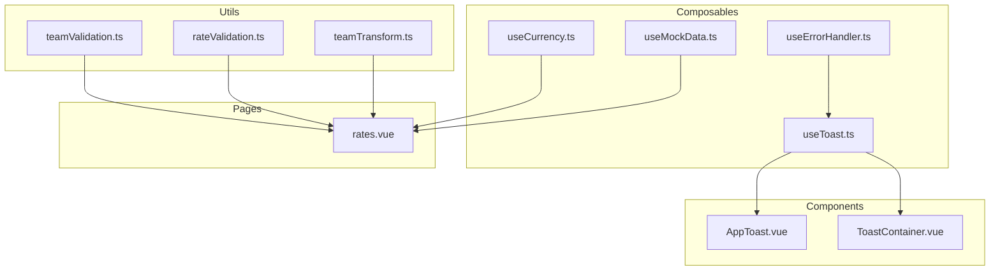
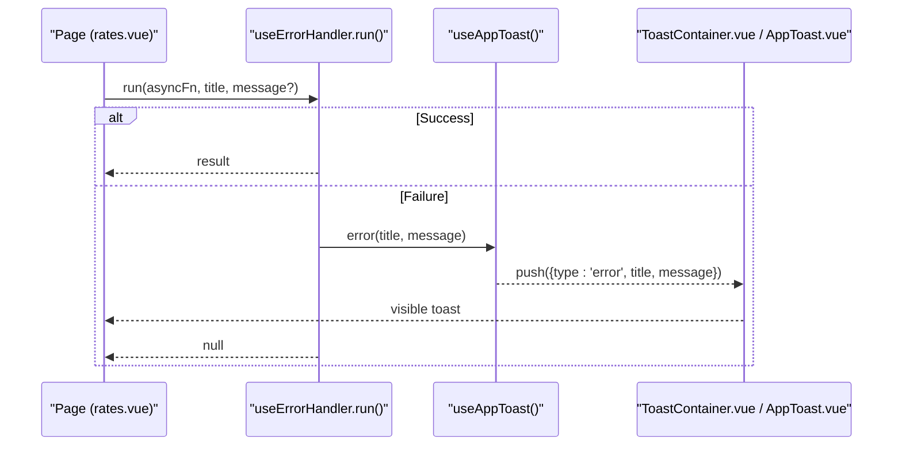
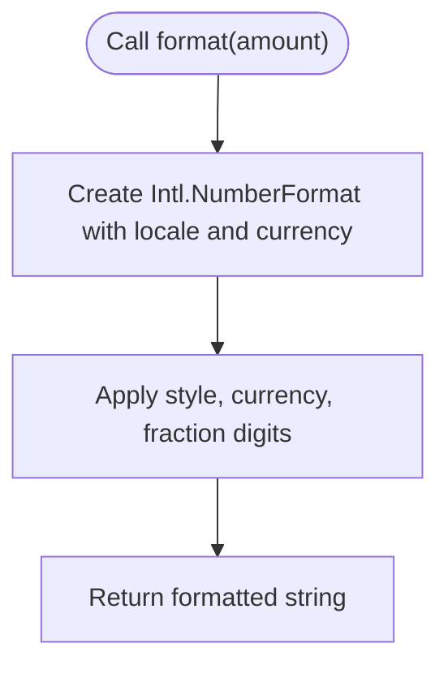
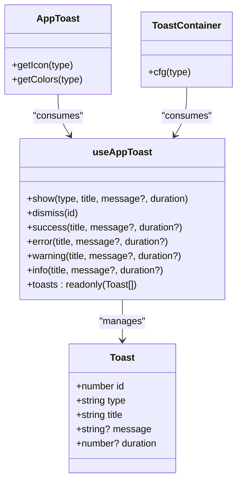
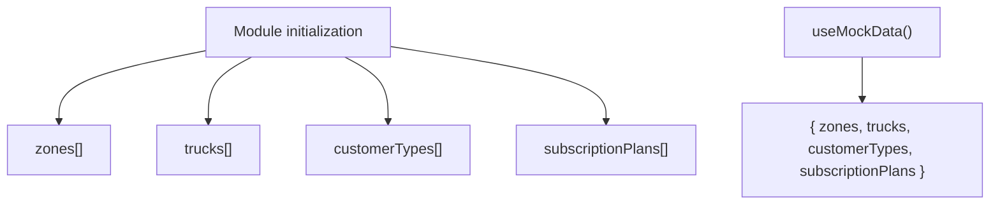
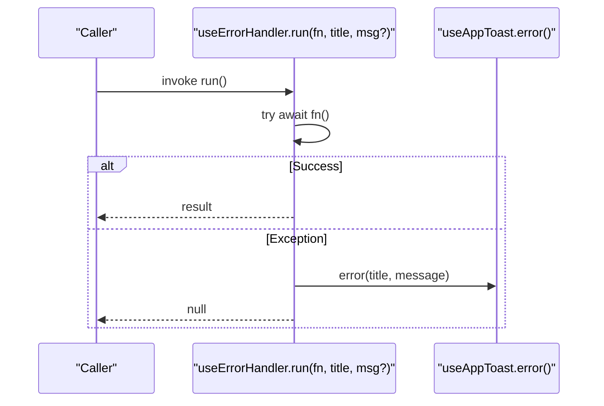
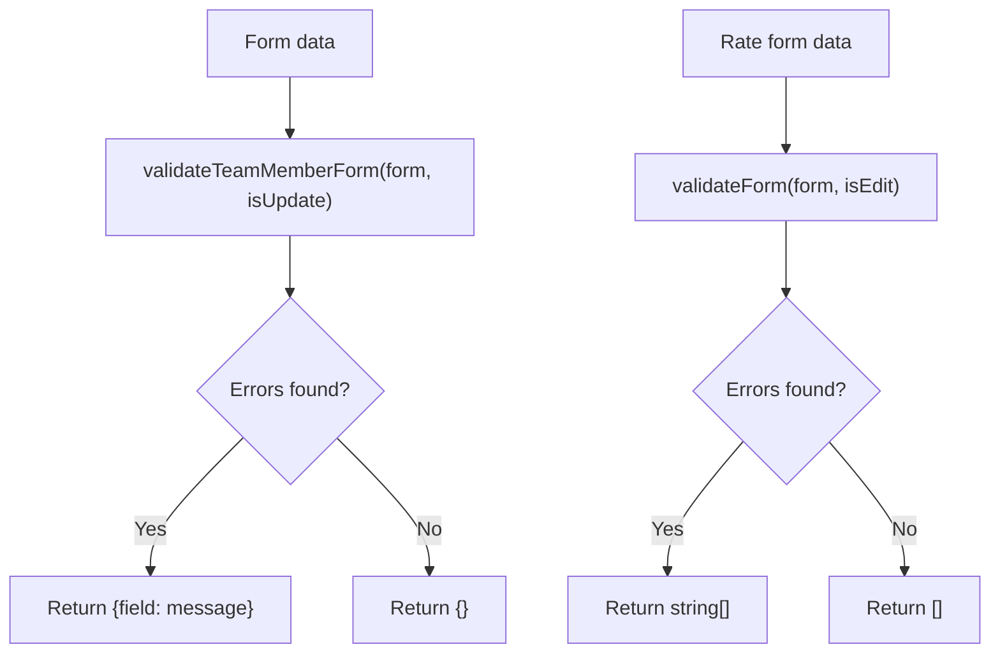
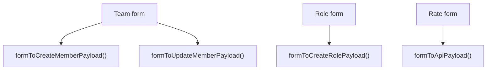
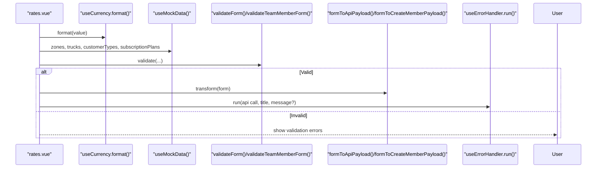
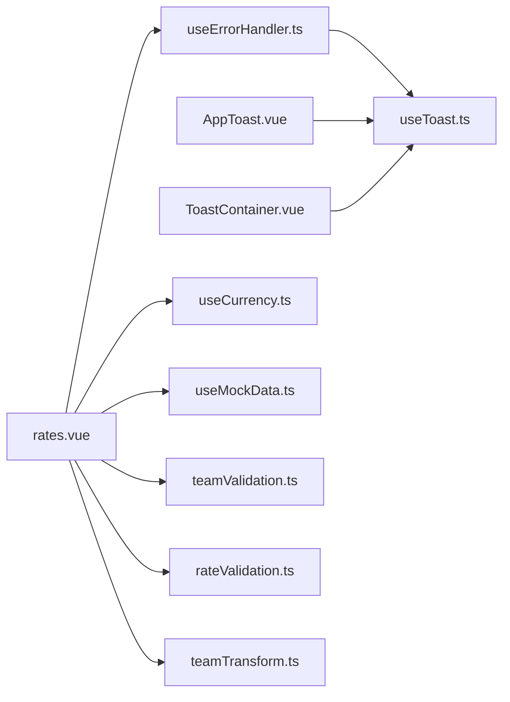

# Data Processing Utilities

<cite>
**Referenced Files in This Document**
- [useCurrency.ts](file://app/composables/useCurrency.ts)
- [useToast.ts](file://app/composables/useToast.ts)
- [AppToast.vue](file://app/components/AppToast.vue)
- [ToastContainer.vue](file://app/components/ToastContainer.vue)
- [useMockData.ts](file://app/composables/useMockData.ts)
- [useErrorHandler.ts](file://app/composables/useErrorHandler.ts)
- [teamValidation.ts](file://app/utils/teamValidation.ts)
- [rateValidation.ts](file://app/utils/rateValidation.ts)
- [teamTransform.ts](file://app/utils/teamTransform.ts)
- [rates.vue](file://app/pages/management/rates.vue)
</cite>

## Table of Contents
1. [Introduction](#introduction)
2. [Project Structure](#project-structure)
3. [Core Components](#core-components)
4. [Architecture Overview](#architecture-overview)
5. [Detailed Component Analysis](#detailed-component-analysis)
6. [Dependency Analysis](#dependency-analysis)
7. [Performance Considerations](#performance-considerations)
8. [Troubleshooting Guide](#troubleshooting-guide)
9. [Conclusion](#conclusion)
10. [Appendices](#appendices)

## Introduction
This document explains the data processing utilities and composables that power formatting, notifications, mock data, validation, transformation, and error handling across the application. It focuses on:
- Currency formatting with internationalization support
- Toast notification system and user feedback patterns
- Mock data generation for shared reference data
- Reactive data transformations and composition patterns
- Validation and payload mapping utilities
- Error handling strategies and best practices

The goal is to help you implement custom formatters, create notification handlers, generate test data, and compose utilities effectively while maintaining robust error handling.

## Project Structure
The relevant utilities are organized into composables (reactive helpers), components (UI rendering), and utils (pure functions for validation and transformation). Pages consume these utilities to format values, show notifications, and handle errors consistently.

**Diagram sources**
- [useCurrency.ts:1-11](file://app/composables/useCurrency.ts#L1-L11)
- [useToast.ts:1-37](file://app/composables/useToast.ts#L1-L37)
- [AppToast.vue:1-115](file://app/components/AppToast.vue#L1-L115)
- [ToastContainer.vue:1-120](file://app/components/ToastContainer.vue#L1-L120)
- [useMockData.ts:1-61](file://app/composables/useMockData.ts#L1-L61)
- [useErrorHandler.ts:1-29](file://app/composables/useErrorHandler.ts#L1-L29)
- [teamValidation.ts:1-122](file://app/utils/teamValidation.ts#L1-L122)
- [rateValidation.ts:1-69](file://app/utils/rateValidation.ts#L1-L69)
- [teamTransform.ts:1-88](file://app/utils/teamTransform.ts#L1-L88)
- [rates.vue:1-200](file://app/pages/management/rates.vue#L1-L200)

**Section sources**
- [useCurrency.ts:1-11](file://app/composables/useCurrency.ts#L1-L11)
- [useToast.ts:1-37](file://app/composables/useToast.ts#L1-L37)
- [AppToast.vue:1-115](file://app/components/AppToast.vue#L1-L115)
- [ToastContainer.vue:1-120](file://app/components/ToastContainer.vue#L1-L120)
- [useMockData.ts:1-61](file://app/composables/useMockData.ts#L1-L61)
- [useErrorHandler.ts:1-29](file://app/composables/useErrorHandler.ts#L1-L29)
- [teamValidation.ts:1-122](file://app/utils/teamValidation.ts#L1-L122)
- [rateValidation.ts:1-69](file://app/utils/rateValidation.ts#L1-L69)
- [teamTransform.ts:1-88](file://app/utils/teamTransform.ts#L1-L88)
- [rates.vue:1-200](file://app/pages/management/rates.vue#L1-L200)

## Core Components
- Currency formatter: A composable that formats numbers as currency using a locale and currency code.
- Toast system: A composable that manages a reactive list of notifications and provides typed convenience methods; paired with UI components for rendering.
- Mock data generator: A composable exposing shared reference datasets (zones, trucks, customer types, subscription plans).
- Error handler: A composable that wraps async operations and shows toast notifications on failure.
- Validation utilities: Pure functions for team and rate forms, returning structured errors or arrays of messages.
- Transformation utilities: Functions that map form payloads to API-compatible structures.

**Section sources**
- [useCurrency.ts:1-11](file://app/composables/useCurrency.ts#L1-L11)
- [useToast.ts:1-37](file://app/composables/useToast.ts#L1-L37)
- [AppToast.vue:1-115](file://app/components/AppToast.vue#L1-L115)
- [ToastContainer.vue:1-120](file://app/components/ToastContainer.vue#L1-L120)
- [useMockData.ts:1-61](file://app/composables/useMockData.ts#L1-L61)
- [useErrorHandler.ts:1-29](file://app/composables/useErrorHandler.ts#L1-L29)
- [teamValidation.ts:1-122](file://app/utils/teamValidation.ts#L1-L122)
- [rateValidation.ts:1-69](file://app/utils/rateValidation.ts#L1-L69)
- [teamTransform.ts:1-88](file://app/utils/teamTransform.ts#L1-L88)

## Architecture Overview
The utilities follow a clear separation of concerns:
- Composables encapsulate stateful logic (toasts, currency formatting, mock data).
- Components render UI based on composable state.
- Utils provide pure functions for validation and transformation.
- Pages orchestrate usage by composing these utilities.

**Diagram sources**
- [useErrorHandler.ts:1-29](file://app/composables/useErrorHandler.ts#L1-L29)
- [useToast.ts:1-37](file://app/composables/useToast.ts#L1-L37)
- [ToastContainer.vue:1-120](file://app/components/ToastContainer.vue#L1-L120)
- [AppToast.vue:1-115](file://app/components/AppToast.vue#L1-L115)
- [rates.vue:1-200](file://app/pages/management/rates.vue#L1-L200)

## Detailed Component Analysis

### Currency Formatting (useCurrency)
- Purpose: Format numeric amounts as localized currency strings.
- Internationalization: Uses a specific locale and currency code to ensure consistent presentation.
- Composition: Exposes a simple function to return a formatted string.
- Customization: To add new currencies or locales, extend the formatter configuration within the composable.

**Diagram sources**
- [useCurrency.ts:1-11](file://app/composables/useCurrency.ts#L1-L11)

**Section sources**
- [useCurrency.ts:1-11](file://app/composables/useCurrency.ts#L1-L11)
- [rates.vue:36-36](file://app/pages/management/rates.vue#L36-L36)

### Toast Notification System (useToast + AppToast/ToastContainer)
- State model: Each toast has id, type, title, optional message, and optional duration.
- Lifecycle: Show adds a toast; if duration > 0, auto-dismiss after timeout; dismiss removes by id.
- Types: success, error, warning, info.
- Rendering: Two component implementations exist; both read from the same reactive state and support animations and progress bars.

**Diagram sources**
- [useToast.ts:1-37](file://app/composables/useToast.ts#L1-L37)
- [AppToast.vue:1-115](file://app/components/AppToast.vue#L1-L115)
- [ToastContainer.vue:1-120](file://app/components/ToastContainer.vue#L1-L120)

**Section sources**
- [useToast.ts:1-37](file://app/composables/useToast.ts#L1-L37)
- [AppToast.vue:1-115](file://app/components/AppToast.vue#L1-L115)
- [ToastContainer.vue:1-120](file://app/components/ToastContainer.vue#L1-L120)

### Mock Data Generation (useMockData)
- Purpose: Provide shared reference datasets used across features (zones, trucks, customer types, subscription plans).
- Design: Module-level singletons ensure data consistency across all consumers.
- Extensibility: Add new datasets by defining interfaces and appending to module-level arrays.

**Diagram sources**
- [useMockData.ts:1-61](file://app/composables/useMockData.ts#L1-L61)

**Section sources**
- [useMockData.ts:1-61](file://app/composables/useMockData.ts#L1-L61)

### Error Handling Strategy (useErrorHandler)
- Pattern: Wrap async operations with a runner that catches exceptions and surfaces them via toast notifications.
- Behavior: On success, returns the result; on failure, shows an error toast and returns null for safe guarding.
- Integration: Used throughout pages to centralize error feedback.

**Diagram sources**
- [useErrorHandler.ts:1-29](file://app/composables/useErrorHandler.ts#L1-L29)
- [useToast.ts:1-37](file://app/composables/useToast.ts#L1-L37)

**Section sources**
- [useErrorHandler.ts:1-29](file://app/composables/useErrorHandler.ts#L1-L29)

### Validation Utilities
- Team validation: Provides non-empty, email, phone checks and composite validators for team member and role forms. Returns structured error maps keyed by field.
- Rate validation: Validates required fields and numeric constraints for rate management forms; returns an array of human-readable messages.

**Diagram sources**
- [teamValidation.ts:1-122](file://app/utils/teamValidation.ts#L1-L122)
- [rateValidation.ts:1-69](file://app/utils/rateValidation.ts#L1-L69)

**Section sources**
- [teamValidation.ts:1-122](file://app/utils/teamValidation.ts#L1-L122)
- [rateValidation.ts:1-69](file://app/utils/rateValidation.ts#L1-L69)

### Transformation Utilities
- Team transforms: Map form inputs to API payloads for creating/updating members and roles, normalizing fields and trimming values.
- Rate transform: Convert form fields to API payload shape, including numeric conversion and note trimming.

**Diagram sources**
- [teamTransform.ts:1-88](file://app/utils/teamTransform.ts#L1-L88)
- [rateValidation.ts:59-68](file://app/utils/rateValidation.ts#L59-L68)

**Section sources**
- [teamTransform.ts:1-88](file://app/utils/teamTransform.ts#L1-L88)
- [rateValidation.ts:1-69](file://app/utils/rateValidation.ts#L1-L69)

### Usage in Pages (Example: rates.vue)
- The page composes multiple utilities:
  - Currency formatting for display
  - Mock data for dropdowns and options
  - Validation before submission
  - Transformation to API payloads
  - Error handling for network calls

**Diagram sources**
- [rates.vue:1-200](file://app/pages/management/rates.vue#L1-L200)
- [useCurrency.ts:1-11](file://app/composables/useCurrency.ts#L1-L11)
- [useMockData.ts:1-61](file://app/composables/useMockData.ts#L1-L61)
- [rateValidation.ts:1-69](file://app/utils/rateValidation.ts#L1-L69)
- [teamValidation.ts:1-122](file://app/utils/teamValidation.ts#L1-L122)
- [teamTransform.ts:1-88](file://app/utils/teamTransform.ts#L1-L88)
- [useErrorHandler.ts:1-29](file://app/composables/useErrorHandler.ts#L1-L29)

**Section sources**
- [rates.vue:1-200](file://app/pages/management/rates.vue#L1-L200)

## Dependency Analysis
- Coupling:
  - useErrorHandler depends on useAppToast to surface errors.
  - UI components depend on useAppToast for rendering.
  - Pages depend on multiple utilities (currency, mock data, validation, transformation, error handling).
- Cohesion:
  - Each utility focuses on a single responsibility (formatting, notifications, validation, transformation).
- External integrations:
  - Internationalization via Intl APIs for currency formatting.
  - UI icon libraries referenced in components for visual cues.

**Diagram sources**
- [useErrorHandler.ts:1-29](file://app/composables/useErrorHandler.ts#L1-L29)
- [useToast.ts:1-37](file://app/composables/useToast.ts#L1-L37)
- [AppToast.vue:1-115](file://app/components/AppToast.vue#L1-L115)
- [ToastContainer.vue:1-120](file://app/components/ToastContainer.vue#L1-L120)
- [useCurrency.ts:1-11](file://app/composables/useCurrency.ts#L1-L11)
- [useMockData.ts:1-61](file://app/composables/useMockData.ts#L1-L61)
- [teamValidation.ts:1-122](file://app/utils/teamValidation.ts#L1-L122)
- [rateValidation.ts:1-69](file://app/utils/rateValidation.ts#L1-L69)
- [teamTransform.ts:1-88](file://app/utils/teamTransform.ts#L1-L88)
- [rates.vue:1-200](file://app/pages/management/rates.vue#L1-L200)

**Section sources**
- [useErrorHandler.ts:1-29](file://app/composables/useErrorHandler.ts#L1-L29)
- [useToast.ts:1-37](file://app/composables/useToast.ts#L1-L37)
- [AppToast.vue:1-115](file://app/components/AppToast.vue#L1-L115)
- [ToastContainer.vue:1-120](file://app/components/ToastContainer.vue#L1-L120)
- [useCurrency.ts:1-11](file://app/composables/useCurrency.ts#L1-L11)
- [useMockData.ts:1-61](file://app/composables/useMockData.ts#L1-L61)
- [teamValidation.ts:1-122](file://app/utils/teamValidation.ts#L1-L122)
- [rateValidation.ts:1-69](file://app/utils/rateValidation.ts#L1-L69)
- [teamTransform.ts:1-88](file://app/utils/teamTransform.ts#L1-L88)
- [rates.vue:1-200](file://app/pages/management/rates.vue#L1-L200)

## Performance Considerations
- Avoid recreating formatters per render: keep currency formatting in a composable and reuse it across views.
- Debounce heavy computations: when transforming large datasets, consider memoization or computed properties to minimize recalculations.
- Minimize toast spam: batch user feedback where possible and avoid showing duplicate messages.
- Keep mock data stable: module-level singletons reduce allocations and ensure consistent references across components.

[No sources needed since this section provides general guidance]

## Troubleshooting Guide
- Toast not appearing:
  - Ensure the toast container component is mounted and consuming the same composable instance.
  - Verify duration is greater than zero if expecting auto-dismiss behavior.
- Error not surfaced:
  - Confirm the operation is wrapped with the error handler runner and that the error path is reachable.
- Validation errors not displayed:
  - Check that the validator returns a non-empty structure and that the UI binds to the returned errors.
- Payload mismatch:
  - Validate that transformation functions map fields correctly to API expectations (e.g., renaming fields, trimming, lowercasing).

**Section sources**
- [useToast.ts:1-37](file://app/composables/useToast.ts#L1-L37)
- [useErrorHandler.ts:1-29](file://app/composables/useErrorHandler.ts#L1-L29)
- [teamValidation.ts:1-122](file://app/utils/teamValidation.ts#L1-L122)
- [rateValidation.ts:1-69](file://app/utils/rateValidation.ts#L1-L69)
- [teamTransform.ts:1-88](file://app/utils/teamTransform.ts#L1-L88)

## Conclusion
The utilities provide a cohesive foundation for formatting, notifications, validation, transformation, and error handling. By composing these building blocks, pages can remain focused on business logic while reusing consistent patterns for user feedback and data shaping. Extend the system by adding new formatters, expanding mock datasets, and refining validation rules as requirements evolve.

[No sources needed since this section summarizes without analyzing specific files]

## Appendices

### Implementing a Custom Formatter
- Define a composable that encapsulates formatting logic and returns a function.
- Use standard APIs (e.g., Intl) for localization and number formatting.
- Reuse the composable across pages and components.

**Section sources**
- [useCurrency.ts:1-11](file://app/composables/useCurrency.ts#L1-L11)

### Creating a Notification Handler
- Use the toast composable to push notifications with typed variants.
- For automatic error feedback, wrap async operations with the error handler runner.
- Render toasts using one of the provided components.

**Section sources**
- [useToast.ts:1-37](file://app/composables/useToast.ts#L1-L37)
- [useErrorHandler.ts:1-29](file://app/composables/useErrorHandler.ts#L1-L29)
- [AppToast.vue:1-115](file://app/components/AppToast.vue#L1-L115)
- [ToastContainer.vue:1-120](file://app/components/ToastContainer.vue#L1-L120)

### Generating Test Data
- Import the mock data composable to access shared reference datasets.
- Extend the module with additional entries as needed for testing scenarios.

**Section sources**
- [useMockData.ts:1-61](file://app/composables/useMockData.ts#L1-L61)

### Utility Composition Patterns
- Combine validation and transformation: validate first, then transform only valid forms.
- Centralize error handling: wrap API calls with the error handler to unify user feedback.
- Keep UI decoupled from logic: components should only consume composable state and actions.

**Section sources**
- [teamValidation.ts:1-122](file://app/utils/teamValidation.ts#L1-L122)
- [teamTransform.ts:1-88](file://app/utils/teamTransform.ts#L1-L88)
- [rateValidation.ts:1-69](file://app/utils/rateValidation.ts#L1-L69)
- [useErrorHandler.ts:1-29](file://app/composables/useErrorHandler.ts#L1-L29)