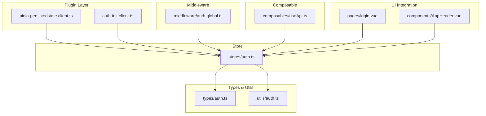
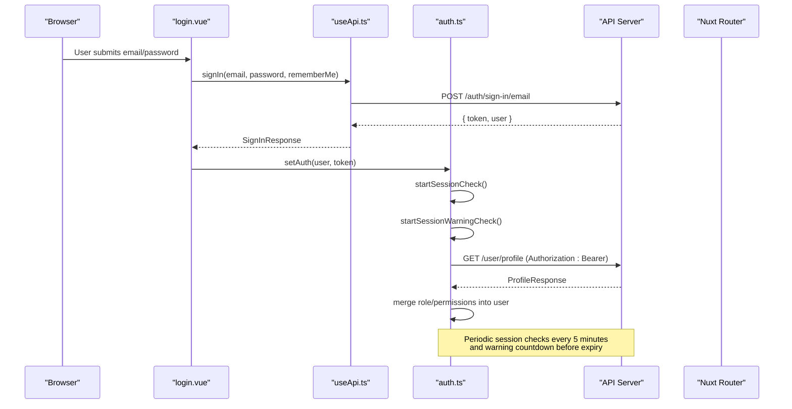
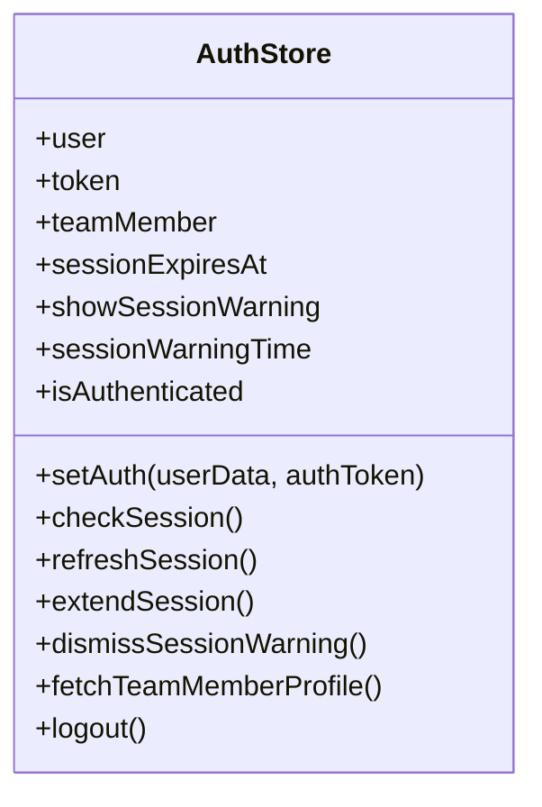
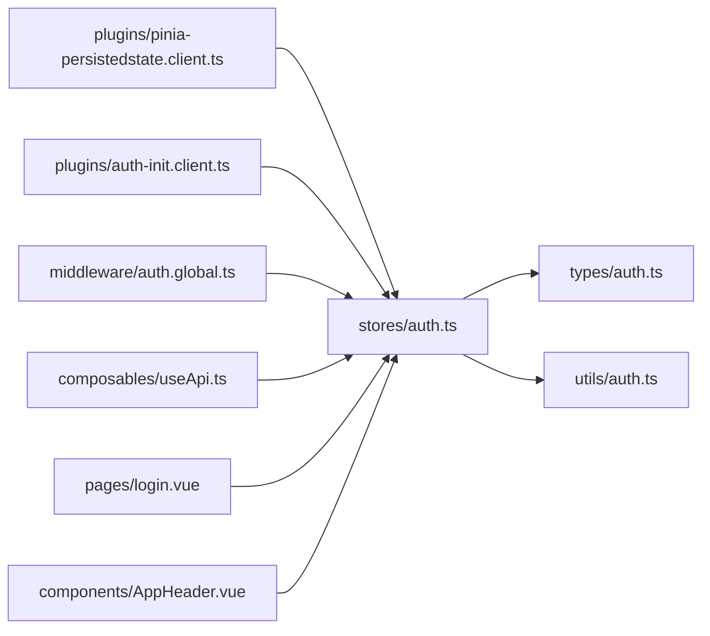

# Pinia State Stores

<cite>
**Referenced Files in This Document**
- [auth.ts](file://app/stores/auth.ts)
- [pinia-persistedstate.client.ts](file://app/plugins/pinia-persistedstate.client.ts)
- [auth-init.client.ts](file://app/plugins/auth-init.client.ts)
- [auth.global.ts](file://app/middleware/auth.global.ts)
- [useApi.ts](file://app/composables/useApi.ts)
- [login.vue](file://app/pages/login.vue)
- [AppHeader.vue](file://app/components/AppHeader.vue)
- [auth.ts](file://app/types/auth.ts)
- [auth.ts](file://app/utils/auth.ts)
</cite>

## Table of Contents
1. [Introduction](#introduction)
2. [Project Structure](#project-structure)
3. [Core Components](#core-components)
4. [Architecture Overview](#architecture-overview)
5. [Detailed Component Analysis](#detailed-component-analysis)
6. [Dependency Analysis](#dependency-analysis)
7. [Performance Considerations](#performance-considerations)
8. [Troubleshooting Guide](#troubleshooting-guide)
9. [Conclusion](#conclusion)
10. [Appendices](#appendices)

## Introduction
This document explains the Pinia-based authentication store implementation and session management patterns used across the application. It covers reactive state, computed values, async actions, token persistence via a plugin, automatic session checks and warnings, user profile synchronization, and integration points with API calls, middleware, and Vue components.

## Project Structure
The authentication system is centered around a single Pinia store and supporting plugins, middleware, composables, and types:

**Diagram sources**
- [pinia-persistedstate.client.ts:1-7](file://app/plugins/pinia-persistedstate.client.ts#L1-L7)
- [auth-init.client.ts:1-25](file://app/plugins/auth-init.client.ts#L1-L25)
- [auth.ts](file://app/stores/auth.ts)
- [auth.global.ts:1-32](file://app/middleware/auth.global.ts#L1-L32)
- [useApi.ts:1-91](file://app/composables/useApi.ts#L1-L91)
- [auth.ts](file://app/types/auth.ts)
- [auth.ts](file://app/utils/auth.ts)
- [login.vue:1-167](file://app/pages/login.vue#L1-L167)
- [AppHeader.vue:1-94](file://app/components/AppHeader.vue#L1-L94)

**Section sources**
- [auth.ts](file://app/stores/auth.ts)
- [pinia-persistedstate.client.ts:1-7](file://app/plugins/pinia-persistedstate.client.ts#L1-L7)
- [auth-init.client.ts:1-25](file://app/plugins/auth-init.client.ts#L1-L25)
- [auth.global.ts:1-32](file://app/middleware/auth.global.ts#L1-L32)
- [useApi.ts:1-91](file://app/composables/useApi.ts#L1-L91)
- [login.vue:1-167](file://app/pages/login.vue#L1-L167)
- [AppHeader.vue:1-94](file://app/components/AppHeader.vue#L1-L94)
- [auth.ts](file://app/types/auth.ts)
- [auth.ts](file://app/utils/auth.ts)

## Core Components
- Authentication Store (Pinia): Holds user identity, tokens, team member profile, session expiry, and UI flags for session warnings. Provides actions to set credentials, check/refresh sessions, logout, and fetch profile data.
- Persist Plugin: Enables client-side persistence of the auth store using pinia-plugin-persistedstate.
- Auth Init Plugin: On app load, validates an existing session if the user was previously authenticated.
- Route Middleware: Guards routes by checking authentication and validating active sessions on navigation.
- API Composable: Attaches Bearer tokens to requests and handles 401 responses by logging out and redirecting.
- Types and Utils: Strongly typed models for users, roles, permissions, and helpers for role/permission checks.

Key responsibilities:
- Reactive state: user, token, teamMember, sessionExpiresAt, showSessionWarning, sessionWarningTime
- Computed: isAuthenticated based on token presence
- Async actions: setAuth, checkSession, refreshSession, extendSession, fetchTeamMemberProfile, logout
- Session lifecycle: periodic checks, warning countdown, auto-logout on expiry
- Persistence: token and related fields persisted across reloads

**Section sources**
- [auth.ts](file://app/stores/auth.ts)
- [pinia-persistedstate.client.ts:1-7](file://app/plugins/pinia-persistedstate.client.ts#L1-L7)
- [auth-init.client.ts:1-25](file://app/plugins/auth-init.client.ts#L1-L25)
- [auth.global.ts:1-32](file://app/middleware/auth.global.ts#L1-L32)
- [useApi.ts:1-91](file://app/composables/useApi.ts#L1-L91)
- [auth.ts](file://app/types/auth.ts)
- [auth.ts](file://app/utils/auth.ts)

## Architecture Overview
The authentication flow integrates multiple layers:

**Diagram sources**
- [login.vue:48-64](file://app/pages/login.vue#L48-L64)
- [useApi.ts:82-86](file://app/composables/useApi.ts#L82-L86)
- [auth.ts:45-57](file://app/stores/auth.ts#L45-L57)
- [auth.ts:15-43](file://app/stores/auth.ts#L15-L43)
- [auth.ts:148-163](file://app/stores/auth.ts#L148-L163)
- [auth.ts:122-146](file://app/stores/auth.ts#L122-L146)

## Detailed Component Analysis

### Authentication Store (Pinia)
Responsibilities:
- Maintain reactive state for user identity, token, team member profile, and session metadata
- Provide computed isAuthenticated flag
- Implement async actions for login, session validation, refresh, logout, and profile sync
- Manage timers for periodic session checks and warning countdown
- Initialize background tasks when a persisted token exists

Reactive state properties:
- user: current user object
- token: bearer token string or null
- teamMember: detailed admin/team member profile
- sessionExpiresAt: timestamp for session expiry
- showSessionWarning: boolean to trigger UI warning
- sessionWarningTime: seconds remaining until expiry

Computed values:
- isAuthenticated: true when token is present

Async actions:
- setAuth(userData, authToken): persists credentials, sets expiry, fetches profile, starts timers
- checkSession(): validates session server-side, updates user and profile, resets expiry, logs out on failure
- refreshSession(): revalidates session and resets expiry; alias extendSession()
- dismissSessionWarning(): clears warning UI state
- fetchTeamMemberProfile(): retrieves and merges role/permissions into user
- logout(): stops timers, optionally signs out server-side, clears all state

Session management:
- startSessionCheck(): every 5 minutes, validates session and redirects to login if invalid
- startSessionWarningCheck(): every second, shows warning within last 2 minutes and triggers logout at expiry
- stopSessionCheck(): clears both intervals

Initialization behavior:
- If a token is restored from persistence, automatically starts checks and fetches profile

Persistence configuration:
- The store is configured with persist: true, enabling pinia-plugin-persistedstate to persist selected state keys

Integration points:
- useApi composable reads token to attach Authorization header and handles 401 by calling logout and redirecting
- auth-init.plugin checks session validity on app load if already authenticated
- Route middleware guards protected routes and verifies session on navigation

Error handling:
- Network errors during session checks or profile fetch are logged and handled gracefully
- Logout ensures cleanup even if server sign-out fails

Complexity considerations:
- Timers run per store instance; ensure only one store instance is active per tab
- Frequent interval checks should be balanced against network overhead

**Diagram sources**
- [auth.ts](file://app/stores/auth.ts)

**Section sources**
- [auth.ts](file://app/stores/auth.ts)

### Persist Plugin Configuration
- The plugin is registered in a Nuxt plugin file and attaches pinia-plugin-persistedstate to the Pinia instance.
- The store opts into persistence via its options, ensuring token and related fields survive page reloads.

Behavioral notes:
- Persistence occurs on the client side only
- Ensure sensitive data policies align with your security requirements

**Section sources**
- [pinia-persistedstate.client.ts:1-7](file://app/plugins/pinia-persistedstate.client.ts#L1-L7)
- [auth.ts](file://app/stores/auth.ts)

### Auth Initialization Plugin
- On app startup, if the user appears authenticated (token present), it validates the session and redirects to login if invalid.
- Provides a global loading indicator for auth checks.

**Section sources**
- [auth-init.client.ts:1-25](file://app/plugins/auth-init.client.ts#L1-L25)

### Route Middleware
- Protects non-public routes by checking isAuthenticated.
- Validates session on route transitions to catch expired tokens early.

Public routes:
- /login, /forgot-password, /unauthorized
- Any path starting with /pay

**Section sources**
- [auth.global.ts:1-32](file://app/middleware/auth.global.ts#L1-L32)

### API Composable Integration
- Automatically attaches Authorization header when token is available.
- Handles 401 responses by invoking logout and redirecting to login.
- Wraps HTTP methods with error handling and consistent response parsing.

**Section sources**
- [useApi.ts:1-91](file://app/composables/useApi.ts#L1-L91)

### Login Page Integration
- Collects credentials, calls useApi.signIn, then invokes setAuth to establish session and start background checks.
- Displays success feedback and navigates to the dashboard.

**Section sources**
- [login.vue:48-64](file://app/pages/login.vue#L48-L64)

### Header Logout Integration
- Calls logout action and navigates to login after successful logout.

**Section sources**
- [AppHeader.vue:17-22](file://app/components/AppHeader.vue#L17-L22)

### Types and Utilities
- Type definitions model user, role, team member profile, and API responses.
- Utility functions normalize roles, determine admin status, extract permissions, and check specific permissions or roles.

**Section sources**
- [auth.ts](file://app/types/auth.ts)
- [auth.ts](file://app/utils/auth.ts)

## Dependency Analysis
The following diagram maps key dependencies between modules:

**Diagram sources**
- [auth.ts](file://app/stores/auth.ts)
- [auth.ts](file://app/types/auth.ts)
- [auth.ts](file://app/utils/auth.ts)
- [pinia-persistedstate.client.ts:1-7](file://app/plugins/pinia-persistedstate.client.ts#L1-L7)
- [auth-init.client.ts:1-25](file://app/plugins/auth-init.client.ts#L1-L25)
- [auth.global.ts:1-32](file://app/middleware/auth.global.ts#L1-L32)
- [useApi.ts:1-91](file://app/composables/useApi.ts#L1-L91)
- [login.vue:1-167](file://app/pages/login.vue#L1-L167)
- [AppHeader.vue:1-94](file://app/components/AppHeader.vue#L1-L94)

**Section sources**
- [auth.ts](file://app/stores/auth.ts)
- [auth.ts](file://app/types/auth.ts)
- [auth.ts](file://app/utils/auth.ts)
- [pinia-persistedstate.client.ts:1-7](file://app/plugins/pinia-persistedstate.client.ts#L1-L7)
- [auth-init.client.ts:1-25](file://app/plugins/auth-init.client.ts#L1-L25)
- [auth.global.ts:1-32](file://app/middleware/auth.global.ts#L1-L32)
- [useApi.ts:1-91](file://app/composables/useApi.ts#L1-L91)
- [login.vue:1-167](file://app/pages/login.vue#L1-L167)
- [AppHeader.vue:1-94](file://app/components/AppHeader.vue#L1-L94)

## Performance Considerations
- Interval frequency: Session checks every 5 minutes and warning checks every second balance responsiveness and network usage.
- Token persistence: Avoid persisting overly large objects; keep only necessary fields to minimize storage size.
- Profile fetching: Fetch profile once after login and on session refresh to reduce redundant network calls.
- Error resilience: Graceful fallbacks prevent blocking UI when network requests fail.

[No sources needed since this section provides general guidance]

## Troubleshooting Guide
Common issues and resolutions:
- Session not persisting across reloads:
  - Verify the persist plugin is registered and the store has persistence enabled.
- Unexpected logouts:
  - Check 401 handling in the API composable and ensure logout is invoked correctly.
- Warning not showing:
  - Confirm sessionExpiresAt is updated on login and refresh, and that the warning timer is running.
- Profile not syncing:
  - Ensure fetchTeamMemberProfile is called after setAuth and on session refresh.

**Section sources**
- [pinia-persistedstate.client.ts:1-7](file://app/plugins/pinia-persistedstate.client.ts#L1-L7)
- [auth.ts](file://app/stores/auth.ts)
- [useApi.ts:39-44](file://app/composables/useApi.ts#L39-L44)

## Conclusion
The Pinia authentication store centralizes identity, session lifecycle, and profile synchronization while integrating seamlessly with API calls, route guards, and UI components. Persistence ensures continuity across reloads, and automated checks maintain secure sessions with user-friendly warnings.

[No sources needed since this section summarizes without analyzing specific files]

## Appendices

### Example Usage Patterns

- Store initialization and login flow:
  - After successful sign-in, call setAuth to establish session and start background checks.
  - Reference: [login.vue:48-64](file://app/pages/login.vue#L48-L64)

- Reading reactive state in components:
  - Access isAuthenticated, user, and teamMember directly in templates or scripts.
  - Reference: [AppHeader.vue:1-22](file://app/components/AppHeader.vue#L1-22)

- Integrating with API calls:
  - Use useApi to make requests; Authorization headers are attached automatically.
  - Reference: [useApi.ts:1-91](file://app/composables/useApi.ts#L1-L91)

- Guarding routes:
  - Protected routes rely on middleware to validate authentication and session.
  - Reference: [auth.global.ts:1-32](file://app/middleware/auth.global.ts#L1-L32)

- Persist plugin setup:
  - Register the plugin and enable persistence on the store.
  - References: [pinia-persistedstate.client.ts:1-7](file://app/plugins/pinia-persistedstate.client.ts#L1-L7), [auth.ts](file://app/stores/auth.ts)

**Section sources**
- [login.vue:48-64](file://app/pages/login.vue#L48-L64)
- [AppHeader.vue:1-22](file://app/components/AppHeader.vue#L1-L22)
- [useApi.ts:1-91](file://app/composables/useApi.ts#L1-L91)
- [auth.global.ts:1-32](file://app/middleware/auth.global.ts#L1-L32)
- [pinia-persistedstate.client.ts:1-7](file://app/plugins/pinia-persistedstate.client.ts#L1-L7)
- [auth.ts](file://app/stores/auth.ts)