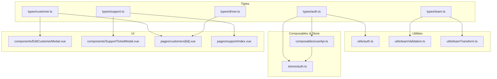
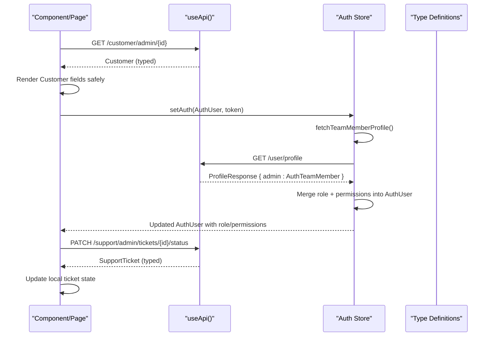
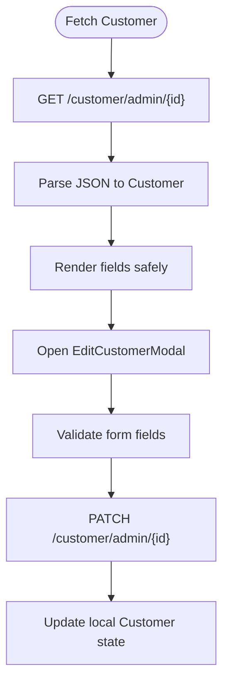
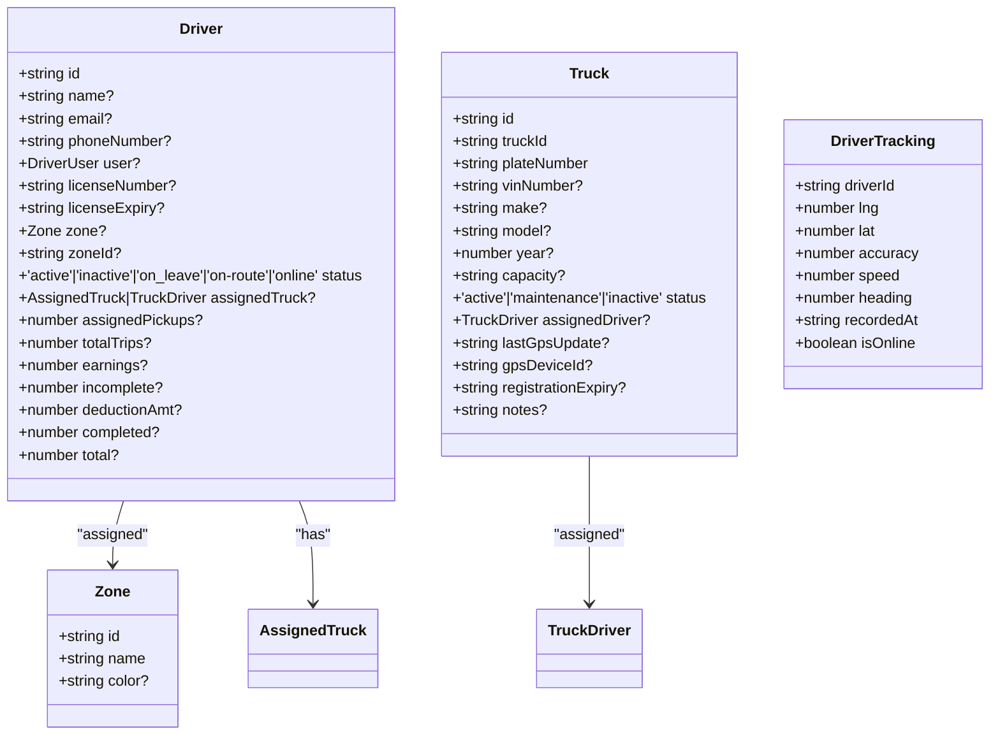
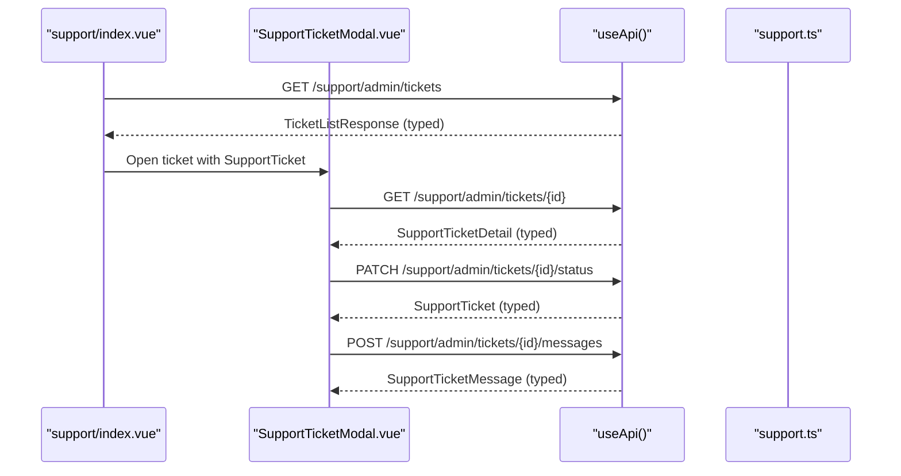
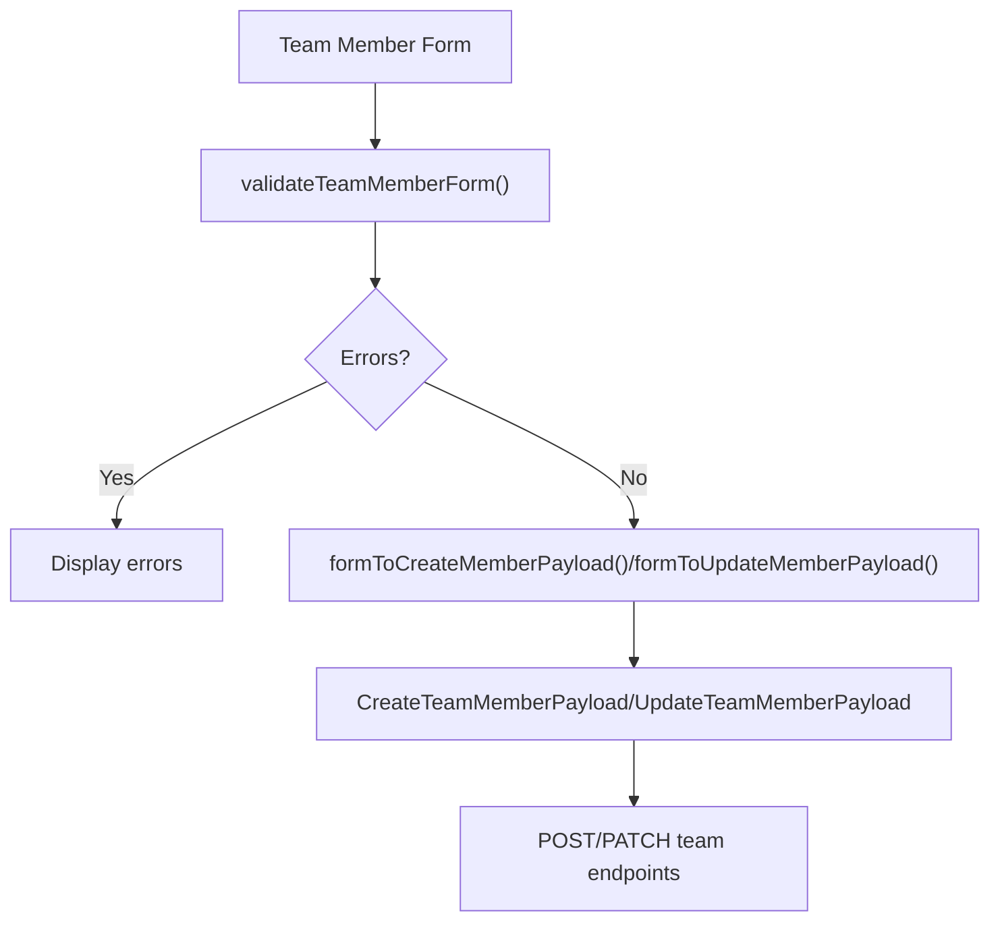
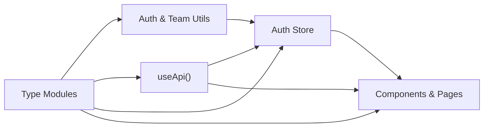

# TypeScript Type Definitions

<cite>
**Referenced Files in This Document**
- [auth.ts](file://app/types/auth.ts)
- [customer.ts](file://app/types/customer.ts)
- [driver.ts](file://app/types/driver.ts)
- [support.ts](file://app/types/support.ts)
- [team.ts](file://app/types/team.ts)
- [useApi.ts](file://app/composables/useApi.ts)
- [auth.ts (utils)](file://app/utils/auth.ts)
- [teamValidation.ts](file://app/utils/teamValidation.ts)
- [teamTransform.ts](file://app/utils/teamTransform.ts)
- [auth store](file://app/stores/auth.ts)
- [EditCustomerModal.vue](file://app/components/EditCustomerModal.vue)
- [SupportTicketModal.vue](file://app/components/SupportTicketModal.vue)
- [customers/[id].vue](file://app/pages/customers/[id].vue)
- [support/index.vue](file://app/pages/support/index.vue)
</cite>

## Table of Contents
1. [Introduction](#introduction)
2. [Project Structure](#project-structure)
3. [Core Components](#core-components)
4. [Architecture Overview](#architecture-overview)
5. [Detailed Component Analysis](#detailed-component-analysis)
6. [Dependency Analysis](#dependency-analysis)
7. [Performance Considerations](#performance-considerations)
8. [Troubleshooting Guide](#troubleshooting-guide)
9. [Conclusion](#conclusion)
10. [Appendices](#appendices)

## Introduction
This document explains the TypeScript type definitions used across the application, focusing on core domain models and their relationships: AuthUser, AuthTeamMember, Customer, Driver, SupportTicket, and TeamMember. It covers how these types model API responses, how they are consumed by components and business logic, and how validation and transformation utilities maintain data integrity. The goal is to provide a clear reference for maintaining consistent data structures and leveraging type safety throughout the codebase.

## Project Structure
The type system is organized into feature-oriented modules under app/types, with supporting utilities and composables that consume or transform these types. Key areas include:
- Domain types: auth, customer, driver, support, team
- Utilities: auth helpers, team validation and transformation
- Composables: typed HTTP client wrapper
- Stores: session and profile management using auth types
- Components and pages: usage examples of domain types



**Diagram sources**
- [auth.ts:1-64](file://app/types/auth.ts#L1-L64)
- [customer.ts:1-103](file://app/types/customer.ts#L1-L103)
- [driver.ts:1-106](file://app/types/driver.ts#L1-L106)
- [support.ts:1-81](file://app/types/support.ts#L1-L81)
- [team.ts:1-65](file://app/types/team.ts#L1-L65)
- [useApi.ts:1-91](file://app/composables/useApi.ts#L1-L91)
- [auth.ts (utils):1-58](file://app/utils/auth.ts#L1-L58)
- [teamValidation.ts:1-122](file://app/utils/teamValidation.ts#L1-L122)
- [teamTransform.ts:1-88](file://app/utils/teamTransform.ts#L1-L88)
- [auth store:1-230](file://app/stores/auth.ts#L1-L230)
- [EditCustomerModal.vue:1-200](file://app/components/EditCustomerModal.vue#L1-L200)
- [SupportTicketModal.vue:1-200](file://app/components/SupportTicketModal.vue#L1-L200)
- [customers/[id].vue](file://app/pages/customers/[id].vue#L1-L200)
- [support/index.vue:1-200](file://app/pages/support/index.vue#L1-L200)

**Section sources**
- [auth.ts:1-64](file://app/types/auth.ts#L1-L64)
- [customer.ts:1-103](file://app/types/customer.ts#L1-L103)
- [driver.ts:1-106](file://app/types/driver.ts#L1-L106)
- [support.ts:1-81](file://app/types/support.ts#L1-L81)
- [team.ts:1-65](file://app/types/team.ts#L1-L65)
- [useApi.ts:1-91](file://app/composables/useApi.ts#L1-L91)
- [auth.ts (utils):1-58](file://app/utils/auth.ts#L1-L58)
- [teamValidation.ts:1-122](file://app/utils/teamValidation.ts#L1-L122)
- [teamTransform.ts:1-88](file://app/utils/teamTransform.ts#L1-L88)
- [auth store:1-230](file://app/stores/auth.ts#L1-L230)
- [EditCustomerModal.vue:1-200](file://app/components/EditCustomerModal.vue#L1-L200)
- [SupportTicketModal.vue:1-200](file://app/components/SupportTicketModal.vue#L1-L200)
- [customers/[id].vue](file://app/pages/customers/[id].vue#L1-L200)
- [support/index.vue:1-200](file://app/pages/support/index.vue#L1-L200)

## Core Components
This section documents the primary type interfaces and their roles.

- AuthUser
  - Represents the authenticated user returned from sign-in and session endpoints. Includes identity fields, optional role and permissions augmented after profile fetch, and account state flags.
  - Used by authentication store and auth utilities for permission checks and role normalization.

- AuthTeamMember
  - Represents the admin profile returned from the user profile endpoint. Contains personal details, role object, permissions, and timestamps.
  - Consumed by the auth store to enrich the current user’s role and permissions.

- Customer
  - Represents a customer entity including address, location, phone, status, and related references to user, customer type, and zone. Also includes pickup history entry shapes and pagination envelope for history lists.
  - Used extensively in customer detail pages and edit modals.

- Driver
  - Models drivers, trucks, zones, and tracking data. Includes statuses, assignments, and fleet attributes.
  - Used in driver management and tracking views.

- SupportTicket
  - Models support tickets with category, priority, status enums, and nested customer info. Extends to detailed view with messages and provides list response shape with pagination.
  - Used in ticket listing and detail modal.

- TeamMember
  - Represents internal team members with role details and permissions. Includes payloads for create/update operations and role definitions.
  - Used in team management UI and validation/transformation utilities.

Key relationships and constraints:
- Role flexibility: AuthUser.role can be string or AuthRole; utilities normalize this to a consistent display format.
- Enumerations: SupportTicket uses strict union types for status, priority, and category to constrain inputs.
- Optional enrichment: AuthUser gains role and permissions after fetching the profile; consumers must handle undefined cases.
- Pagination envelopes: CustomerPickupHistoryResponse and TicketListResponse standardize list responses.

**Section sources**
- [auth.ts:1-64](file://app/types/auth.ts#L1-L64)
- [customer.ts:1-103](file://app/types/customer.ts#L1-L103)
- [driver.ts:1-106](file://app/types/driver.ts#L1-L106)
- [support.ts:1-81](file://app/types/support.ts#L1-L81)
- [team.ts:1-65](file://app/types/team.ts#L1-L65)
- [auth.ts (utils):1-58](file://app/utils/auth.ts#L1-L58)

## Architecture Overview
The type system integrates with the HTTP layer, stores, and UI components to ensure end-to-end type safety.



**Diagram sources**
- [useApi.ts:1-91](file://app/composables/useApi.ts#L1-L91)
- [auth store:1-230](file://app/stores/auth.ts#L1-L230)
- [auth.ts:1-64](file://app/types/auth.ts#L1-L64)
- [customer.ts:1-103](file://app/types/customer.ts#L1-L103)
- [support.ts:1-81](file://app/types/support.ts#L1-L81)

## Detailed Component Analysis

### Authentication Types and Usage
- AuthUser and AuthTeamMember define the base shapes for authentication and profile data.
- SignInResponse and SessionResponse describe API responses for login and session checks.
- ProfileResponse wraps the admin profile used to augment the current user.

Usage patterns:
- The auth store sets AuthUser and token, then fetches the profile to merge role and permissions.
- Auth utilities normalize roles and check permissions based on AuthUser.

```mermaid
classDiagram
class AuthUser {
+string id
+string name
+string email
+boolean emailVerified?
+string|Image image?
+string createdAt
+string updatedAt
+boolean twoFactorEnabled?
+boolean banned
+string|null banReason
+string|null banExpires
+string|AuthRole role?
+string[] permissions?
}
class AuthTeamMember {
+string id
+string firstName
+string lastName
+string email
+string phone?
+AuthRole role?
+string[] permissions?
+'active'|'inactive' status?
+string lastLogin?
+string createdAt?
+string updatedAt?
}
class AuthRole {
+string id?
+string name
+string description?
+string[] permissions?
+string color?
+boolean isSystem?
}
class SignInResponse {
+string token
+AuthUser user
}
class SessionResponse {
+AuthUser user
}
class ProfileResponse {
+{ admin : AuthTeamMember } data
}
AuthUser --> AuthRole : "role may be"
AuthTeamMember --> AuthRole : "has"
SignInResponse --> AuthUser : "contains"
SessionResponse --> AuthUser : "contains"
ProfileResponse --> AuthTeamMember : "wraps"
```

**Diagram sources**
- [auth.ts:1-64](file://app/types/auth.ts#L1-L64)

**Section sources**
- [auth.ts:1-64](file://app/types/auth.ts#L1-L64)
- [auth store:1-230](file://app/stores/auth.ts#L1-L230)
- [auth.ts (utils):1-58](file://app/utils/auth.ts#L1-L58)

### Customer Types and Usage
- Customer aggregates user, customer type, and zone references, plus location and address fields.
- Pickup history entries and pagination envelope provide structured access to historical data.

Usage patterns:
- Pages fetch Customer via useApi and render fields safely.
- EditCustomerModal consumes Customer props and emits update payloads aligned with the type.



**Diagram sources**
- [customer.ts:1-103](file://app/types/customer.ts#L1-L103)
- [EditCustomerModal.vue:1-200](file://app/components/EditCustomerModal.vue#L1-L200)
- [customers/[id].vue](file://app/pages/customers/[id].vue#L1-L200)

**Section sources**
- [customer.ts:1-103](file://app/types/customer.ts#L1-L103)
- [EditCustomerModal.vue:1-200](file://app/components/EditCustomerModal.vue#L1-L200)
- [customers/[id].vue](file://app/pages/customers/[id].vue#L1-L200)

### Driver Types and Usage
- Driver encapsulates driver profiles, assigned truck, zone, and operational metrics.
- Truck and Zone represent fleet assets and geographic regions.
- DriverTracking models real-time GPS data points.

Usage patterns:
- Driver and Truck types are imported in relevant pages and components for forms and listings.
- Tracking types inform map displays and live updates.



**Diagram sources**
- [driver.ts:1-106](file://app/types/driver.ts#L1-L106)

**Section sources**
- [driver.ts:1-106](file://app/types/driver.ts#L1-L106)

### Support Ticket Types and Usage
- SupportTicket defines ticket metadata with strict enums for status, priority, and category.
- SupportTicketDetail extends the base ticket with messages.
- TicketListResponse provides paginated lists.

Usage patterns:
- Listing page filters by enum values and renders formatted labels.
- Detail modal updates status and posts replies, ensuring type-safe payloads.



**Diagram sources**
- [support.ts:1-81](file://app/types/support.ts#L1-L81)
- [SupportTicketModal.vue:1-200](file://app/components/SupportTicketModal.vue#L1-L200)
- [support/index.vue:1-200](file://app/pages/support/index.vue#L1-L200)
- [useApi.ts:1-91](file://app/composables/useApi.ts#L1-L91)

**Section sources**
- [support.ts:1-81](file://app/types/support.ts#L1-L81)
- [SupportTicketModal.vue:1-200](file://app/components/SupportTicketModal.vue#L1-L200)
- [support/index.vue:1-200](file://app/pages/support/index.vue#L1-L200)

### Team Member Types and Validation
- TeamMember models team profiles with role details and permissions.
- CreateTeamMemberPayload and UpdateTeamMemberPayload define API-bound payloads.
- Role and Permission types support role management.

Validation and transformation:
- teamValidation.ts enforces non-empty fields, email format, phone format, and role presence.
- teamTransform.ts maps form data to API payloads, normalizing field names and casing.



**Diagram sources**
- [team.ts:1-65](file://app/types/team.ts#L1-L65)
- [teamValidation.ts:1-122](file://app/utils/teamValidation.ts#L1-L122)
- [teamTransform.ts:1-88](file://app/utils/teamTransform.ts#L1-L88)

**Section sources**
- [team.ts:1-65](file://app/types/team.ts#L1-L65)
- [teamValidation.ts:1-122](file://app/utils/teamValidation.ts#L1-L122)
- [teamTransform.ts:1-88](file://app/utils/teamTransform.ts#L1-L88)

## Dependency Analysis
The following diagram shows how types are consumed across layers:



**Diagram sources**
- [auth.ts:1-64](file://app/types/auth.ts#L1-L64)
- [customer.ts:1-103](file://app/types/customer.ts#L1-L103)
- [driver.ts:1-106](file://app/types/driver.ts#L1-L106)
- [support.ts:1-81](file://app/types/support.ts#L1-L81)
- [team.ts:1-65](file://app/types/team.ts#L1-L65)
- [useApi.ts:1-91](file://app/composables/useApi.ts#L1-L91)
- [auth.ts (utils):1-58](file://app/utils/auth.ts#L1-L58)
- [teamValidation.ts:1-122](file://app/utils/teamValidation.ts#L1-L122)
- [teamTransform.ts:1-88](file://app/utils/teamTransform.ts#L1-L88)
- [auth store:1-230](file://app/stores/auth.ts#L1-L230)

**Section sources**
- [auth.ts:1-64](file://app/types/auth.ts#L1-L64)
- [customer.ts:1-103](file://app/types/customer.ts#L1-L103)
- [driver.ts:1-106](file://app/types/driver.ts#L1-L106)
- [support.ts:1-81](file://app/types/support.ts#L1-L81)
- [team.ts:1-65](file://app/types/team.ts#L1-L65)
- [useApi.ts:1-91](file://app/composables/useApi.ts#L1-L91)
- [auth.ts (utils):1-58](file://app/utils/auth.ts#L1-L58)
- [teamValidation.ts:1-122](file://app/utils/teamValidation.ts#L1-L122)
- [teamTransform.ts:1-88](file://app/utils/teamTransform.ts#L1-L88)
- [auth store:1-230](file://app/stores/auth.ts#L1-L230)

## Performance Considerations
- Prefer narrow types in props and emits to reduce unnecessary re-renders.
- Use computed properties for derived fields (e.g., labels, initials) to avoid recomputation.
- Leverage union types for enums to prevent invalid states at compile time.
- Minimize deep object mutations; prefer immutable updates when refreshing data from APIs.

## Troubleshooting Guide
Common issues and resolutions:
- Missing role or permissions after login: Ensure the profile fetch completes before checking permissions. The auth store merges role and permissions from the profile response.
- Incorrect status strings: For support tickets, map between UI-friendly values and API enums consistently in components.
- Validation failures: Use provided validators for team member forms to catch empty fields, invalid emails, and phone formats early.
- Payload mismatches: Use transformation utilities to convert form data to API payloads, aligning field names and casing.

**Section sources**
- [auth store:1-230](file://app/stores/auth.ts#L1-L230)
- [SupportTicketModal.vue:1-200](file://app/components/SupportTicketModal.vue#L1-L200)
- [teamValidation.ts:1-122](file://app/utils/teamValidation.ts#L1-L122)
- [teamTransform.ts:1-88](file://app/utils/teamTransform.ts#L1-L88)

## Conclusion
The type system provides strong contracts across authentication, customers, drivers, support tickets, and team management. By centralizing domain models in dedicated type files and enforcing them through composables, stores, and UI components, the application maintains consistency and reduces runtime errors. Following best practices—using union types for enums, validating inputs early, transforming payloads explicitly, and handling optional enrichment—ensures robust and maintainable code.

## Appendices

### Type Safety Patterns and Best Practices
- Centralize domain types in app/types to avoid duplication.
- Use union types for enumerations to constrain valid values.
- Normalize flexible fields (e.g., role as string or object) with utility functions.
- Separate concerns: keep validation in utils, transformations in utils, and API calls in composables.
- Keep component props and emits narrowly typed to improve developer experience and catch mistakes early.

[No sources needed since this section provides general guidance]