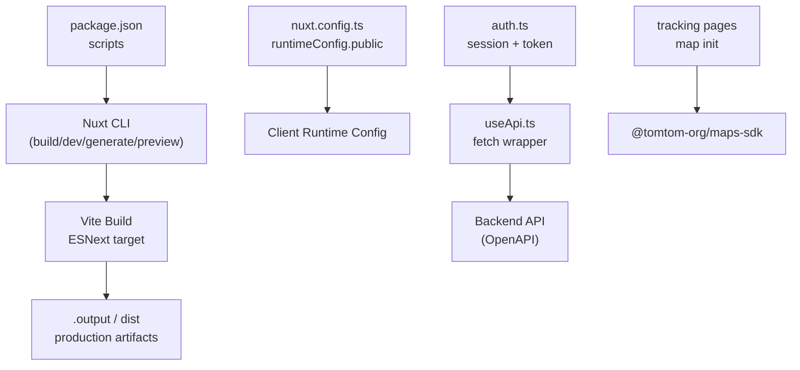
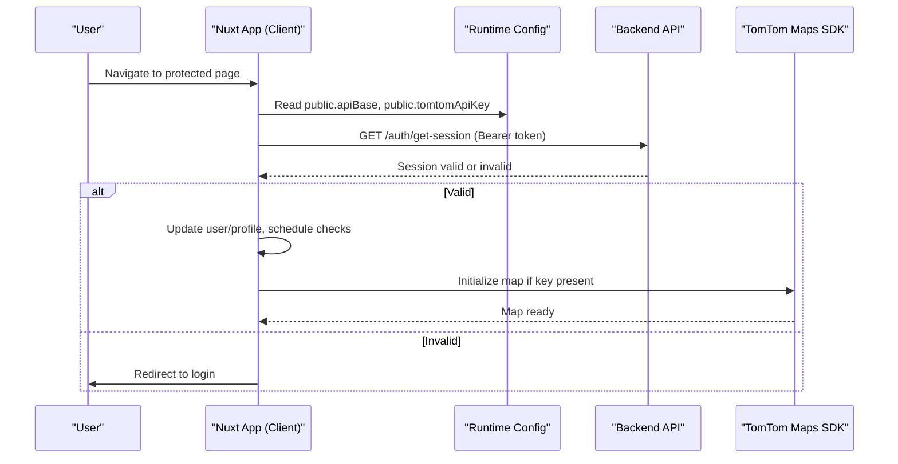
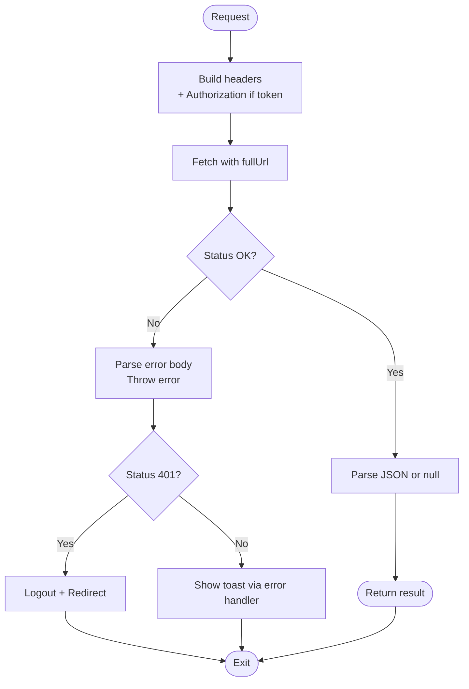
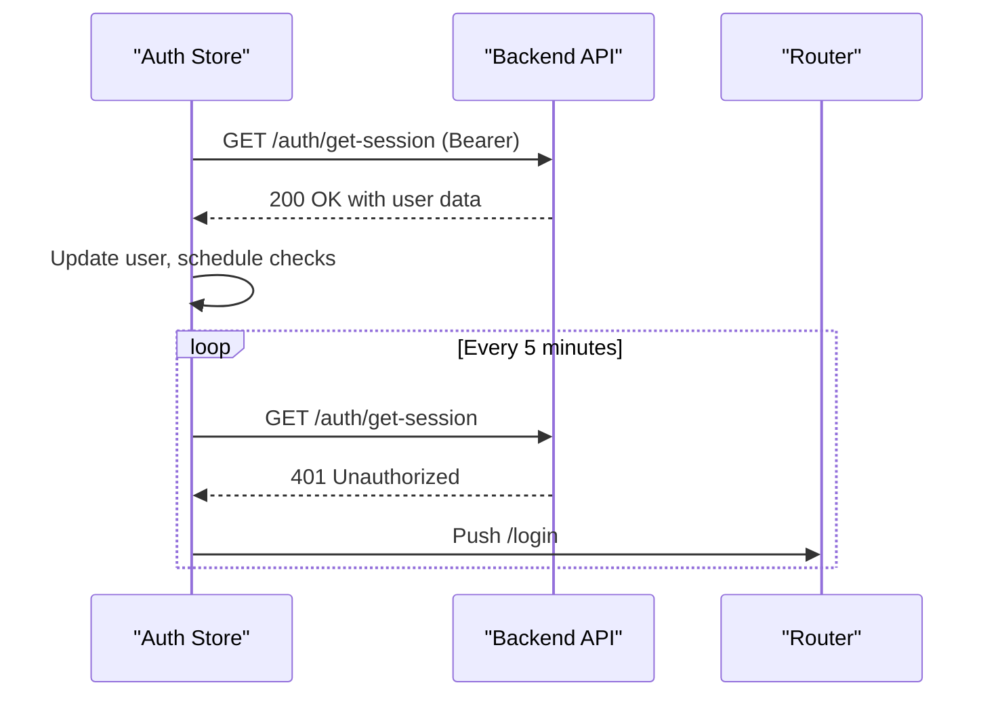
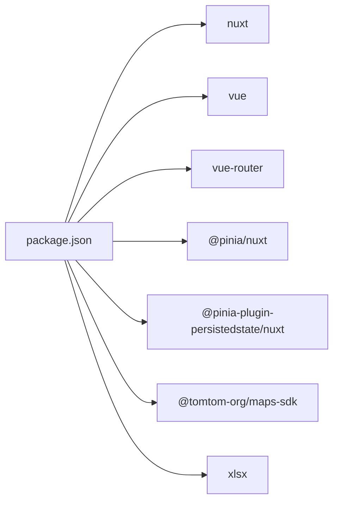

# Deployment & Production

<cite>
**Referenced Files in This Document**
- [nuxt.config.ts](file://nuxt.config.ts)
- [package.json](file://package.json)
- [README.md](file://README.md)
- [.gitignore](file://.gitignore)
- [useApi.ts](file://app/composables/useApi.ts)
- [auth.ts](file://app/stores/auth.ts)
- [drivers.vue](file://app/pages/tracking/drivers.vue)
- [index.vue](file://app/pages/tracking/index.vue)
- [api-1(6).yaml](file://api-1(6).yaml)
</cite>

## Table of Contents
1. Introduction
2. Project Structure
3. Core Components
4. Architecture Overview
5. Detailed Component Analysis
6. Dependency Analysis
7. Performance Considerations
8. Troubleshooting Guide
9. Conclusion
10. Appendices

## Introduction
This document provides a comprehensive guide to deploying and operating the application in production. It covers build configuration, environment variable management, performance monitoring, error tracking, asset optimization, caching strategies, and platform-specific deployment examples. It also addresses security considerations, scaling strategies, and maintenance procedures for production environments.

The project is a Nuxt 4 application using Vite under the hood, with runtime configuration exposed via Nuxt’s runtimeConfig. The app consumes a backend API (documented by an OpenAPI spec), manages authentication state client-side, and integrates a mapping SDK that requires a public API key.

## Project Structure
At a high level:
- Build and scripts are defined in package.json.
- Nuxt configuration includes modules, runtime config, route rules, and Vite optimizations.
- Client-side API access uses a composable that reads runtime config and attaches auth headers.
- Authentication state and session handling live in a Pinia store.
- Mapping features require a public API key provided at runtime.
- .gitignore excludes build artifacts and local env files.

**Diagram sources**
- [package.json:1-33](file://package.json#L1-L33)
- [nuxt.config.ts:1-46](file://nuxt.config.ts#L1-L46)
- [useApi.ts:1-91](file://app/composables/useApi.ts#L1-L91)
- [auth.ts:1-230](file://app/stores/auth.ts#L1-L230)
- [drivers.vue:102-185](file://app/pages/tracking/drivers.vue#L102-L185)
- [index.vue:83-123](file://app/pages/tracking/index.vue#L83-L123)

**Section sources**
- [package.json:1-33](file://package.json#L1-L33)
- [nuxt.config.ts:1-46](file://nuxt.config.ts#L1-L46)
- [.gitignore:1-28](file://.gitignore#L1-L28)

## Core Components
- Build pipeline: npm/pnpm/yarn/bun scripts wrap Nuxt commands for development, building, generating static output, and previewing production builds.
- Runtime configuration: Public runtime variables are injected into the client via runtimeConfig.public. These include the API base URL and a mapping API key.
- API client: A composable wraps fetch calls, injects Authorization headers when available, and centralizes error handling and redirects on 401.
- Authentication store: Manages tokens, user data, session expiry, periodic checks, and logout flows.
- Mapping integration: Pages initialize the map only when the public API key is present; otherwise they surface a clear error message.

Key responsibilities:
- nuxt.config.ts: Modules, head meta, color mode preference, runtimeConfig.public, router options, Vite build targets, dependency pre-bundling, and route-level SSR toggles.
- useApi.ts: Centralized HTTP layer with auth header injection, success/failure handling, and 401 redirect behavior.
- auth.ts: Token lifecycle, profile fetching, session refresh, warning UI, and logout.
- Tracking pages: Conditional map initialization based on runtime config and DOM readiness.

**Section sources**
- [nuxt.config.ts:1-46](file://nuxt.config.ts#L1-L46)
- [useApi.ts:1-91](file://app/composables/useApi.ts#L1-L91)
- [auth.ts:1-230](file://app/stores/auth.ts#L1-L230)
- [drivers.vue:102-185](file://app/pages/tracking/drivers.vue#L102-L185)
- [index.vue:83-123](file://app/pages/tracking/index.vue#L83-L123)

## Architecture Overview
The application follows a client-first architecture:
- Nuxt builds a client bundle optimized for production.
- At runtime, the app reads public configuration from runtimeConfig.public.
- API requests are made directly from the browser using the configured base URL.
- Authentication is handled client-side with token storage and periodic validation against the server.
- Mapping features depend on a public API key and are initialized lazily.

**Diagram sources**
- [nuxt.config.ts:21-26](file://nuxt.config.ts#L21-L26)
- [auth.ts:90-120](file://app/stores/auth.ts#L90-L120)
- [index.vue:83-123](file://app/pages/tracking/index.vue#L83-L123)
- [api-1(6).yaml:59-95](file://api-1(6).yaml#L59-L95)

## Detailed Component Analysis

### Build Configuration and Optimization
- Scripts: Standard Nuxt scripts for dev, build, generate, and preview are provided.
- Vite settings:
  - Build target set to esnext for modern browsers.
  - Dependency pre-bundling includes xlsx to improve cold start and reduce runtime overhead.
- Route rules: Certain routes disable SSR for client-only rendering where appropriate.
- Head and meta: Viewport meta tag included for responsive layouts.

Recommendations:
- Keep build target aligned with your target audience browser support matrix.
- Use routeRules judiciously to balance SEO and interactivity.
- Pre-bundle heavy dependencies only when necessary.

**Section sources**
- [package.json:5-13](file://package.json#L5-L13)
- [nuxt.config.ts:32-38](file://nuxt.config.ts#L32-L38)
- [nuxt.config.ts:39-44](file://nuxt.config.ts#L39-L44)
- [nuxt.config.ts:11-17](file://nuxt.config.ts#L11-L17)

### Environment Variable Management
Public runtime variables are defined in runtimeConfig.public and sourced from process.env at build time. The app expects:
- NUXT_PUBLIC_API_BASE: Base URL for all API calls.
- NUXT_PUBLIC_TOMTOM_API_KEY: Key for the mapping SDK.

Behavior:
- If NUXT_PUBLIC_TOMTOM_API_KEY is missing, map initialization fails gracefully with a user-facing error.
- API calls use config.public.apiBase to construct full URLs.

Best practices:
- Provide defaults in nuxt.config.ts for non-sensitive values.
- Never expose secrets to the client; keep them server-side only.
- Use CI/CD secret managers to inject environment variables during build/deploy.

**Section sources**
- [nuxt.config.ts:21-26](file://nuxt.config.ts#L21-L26)
- [useApi.ts:19-20](file://app/composables/useApi.ts#L19-L20)
- [drivers.vue:116-123](file://app/pages/tracking/drivers.vue#L116-L123)
- [index.vue:88-94](file://app/pages/tracking/index.vue#L88-L94)

### API Layer and Error Handling
The API composable:
- Reads runtime config for the API base URL.
- Attaches Authorization headers when a token exists.
- Treats 200/201/204 as success; otherwise attempts to parse JSON messages.
- On 401, clears session and redirects to login.
- Provides typed helpers for common HTTP methods and a raw request method.

Error handling strategy:
- Centralized logging for requests/responses.
- User-friendly errors via toast notifications through a shared error handler.
- Consistent 401 handling across the app.

**Diagram sources**
- [useApi.ts:9-67](file://app/composables/useApi.ts#L9-L67)
- [useErrorHandler.ts:1-29](file://app/composables/useErrorHandler.ts#L1-29)

**Section sources**
- [useApi.ts:1-91](file://app/composables/useApi.ts#L1-L91)
- [useErrorHandler.ts:1-29](file://app/composables/useErrorHandler.ts#L1-29)

### Authentication and Session Management
The auth store:
- Stores user, token, and team member profile.
- Sets session expiry and starts periodic checks and warnings.
- Refreshes session by calling the backend session endpoint.
- Logs out and cleans up state on expiration or explicit logout.

Security notes:
- Tokens are stored client-side; ensure HTTPS and secure cookie policies on the server side.
- Avoid storing sensitive data beyond what is required.

**Diagram sources**
- [auth.ts:90-120](file://app/stores/auth.ts#L90-L120)
- [auth.ts:148-163](file://app/stores/auth.ts#L148-L163)
- [api-1(6).yaml:59-95](file://api-1(6).yaml#L59-L95)

**Section sources**
- [auth.ts:1-230](file://app/stores/auth.ts#L1-230)

### Mapping Integration and Asset Loading
Mapping pages:
- Check for the presence of the public API key before initializing the map.
- Dynamically import the mapping SDK to avoid unnecessary loading.
- Attach event listeners for load and error states.
- Surface user-friendly errors when the container is missing or the key is absent.

Operational guidance:
- Ensure the public API key is correctly set in the deployment environment.
- Validate DOM container existence before map initialization.

**Section sources**
- [drivers.vue:102-185](file://app/pages/tracking/drivers.vue#L102-L185)
- [index.vue:83-123](file://app/pages/tracking/index.vue#L83-L123)

## Dependency Analysis
External dependencies relevant to deployment:
- Nuxt and Vue ecosystem packages.
- TomTom Maps SDK used conditionally at runtime.
- XLSX pre-bundled for performance.

**Diagram sources**
- [package.json:14-25](file://package.json#L14-L25)

**Section sources**
- [package.json:1-33](file://package.json#L1-L33)

## Performance Considerations
- Build target: esnext reduces polyfills and improves runtime performance on modern browsers.
- Dependency pre-bundling: Including xlsx in optimizeDeps avoids runtime compilation overhead.
- SSR toggles: Disabling SSR on specific routes can reduce server load and improve interactivity for client-heavy pages.
- Lazy imports: The mapping SDK is dynamically imported to defer loading until needed.
- Network efficiency: Centralized API layer enables consistent caching headers and retry logic at the edge/proxy layer.

[No sources needed since this section provides general guidance]

## Troubleshooting Guide
Common issues and resolutions:
- Missing API base URL: Verify NUXT_PUBLIC_API_BASE is set in the deployment environment.
- Missing mapping key: Ensure NUXT_PUBLIC_TOMTOM_API_KEY is configured; pages will show a clear error if absent.
- 401 redirects: If users are unexpectedly redirected to login, check session validity and token persistence.
- Map not loading: Confirm the DOM container exists and the API key is present; inspect console logs for initialization errors.
- Build artifacts: Ensure .output, .data, .nuxt, .nitro, .cache, and dist are excluded from source control and not deployed.

Operational tips:
- Use the health endpoints documented in the OpenAPI spec to verify backend availability.
- Enable structured logging on the server and correlate with client logs for faster triage.

**Section sources**
- [nuxt.config.ts:21-26](file://nuxt.config.ts#L21-L26)
- [drivers.vue:116-123](file://app/pages/tracking/drivers.vue#L116-L123)
- [index.vue:88-94](file://app/pages/tracking/index.vue#L88-L94)
- [auth.ts:90-120](file://app/stores/auth.ts#L90-L120)
- [.gitignore:1-28](file://.gitignore#L1-L28)
- [api-1(6).yaml:7-31](file://api-1(6).yaml#L7-L31)

## Conclusion
This application is designed for straightforward production deployment with clear separation between public runtime configuration and private server-side secrets. By leveraging Nuxt’s runtimeConfig, centralized API handling, and conditional feature initialization, it supports scalable and maintainable operations. Follow the environment setup, security, and performance recommendations to ensure reliable production behavior.

[No sources needed since this section summarizes without analyzing specific files]

## Appendices

### Build and Preview Commands
- Development: run the development server locally.
- Build: create a production build.
- Generate: produce a static site (if applicable).
- Preview: serve the production build locally for verification.

**Section sources**
- [README.md:41-73](file://README.md#L41-L73)
- [package.json:5-13](file://package.json#L5-L13)

### Platform-Specific Deployment Notes
- Node.js servers: Serve the Nuxt production build using a compatible Node runtime. Configure environment variables for NUXT_PUBLIC_API_BASE and NUXT_PUBLIC_TOMTOM_API_KEY.
- Static hosting: If using generate, upload the generated static assets to a CDN-backed host and configure environment variables via the host’s environment system.
- Edge platforms: Deploy to platforms that support serverless functions or edge runtimes, ensuring environment variables are injected at build or runtime as supported.

[No sources needed since this section provides general guidance]

### Security Checklist
- Do not commit secrets; rely on CI/CD secret stores.
- Enforce HTTPS everywhere.
- Validate and sanitize inputs on the server side.
- Limit exposure of public keys to only those required by client features.
- Implement rate limiting and CORS policies on the API gateway.

[No sources needed since this section provides general guidance]

### Monitoring and Logging
- Client-side: Use the existing console logs around API calls and map initialization for debugging; integrate a lightweight error reporter if desired.
- Server-side: Collect structured logs and metrics; expose health endpoints for uptime monitoring.
- Alerting: Set alerts for increased error rates, latency spikes, and failed health checks.

[No sources needed since this section provides general guidance]