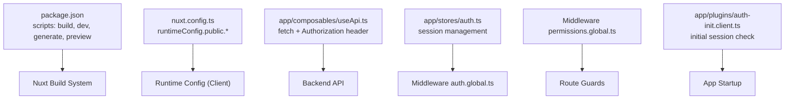
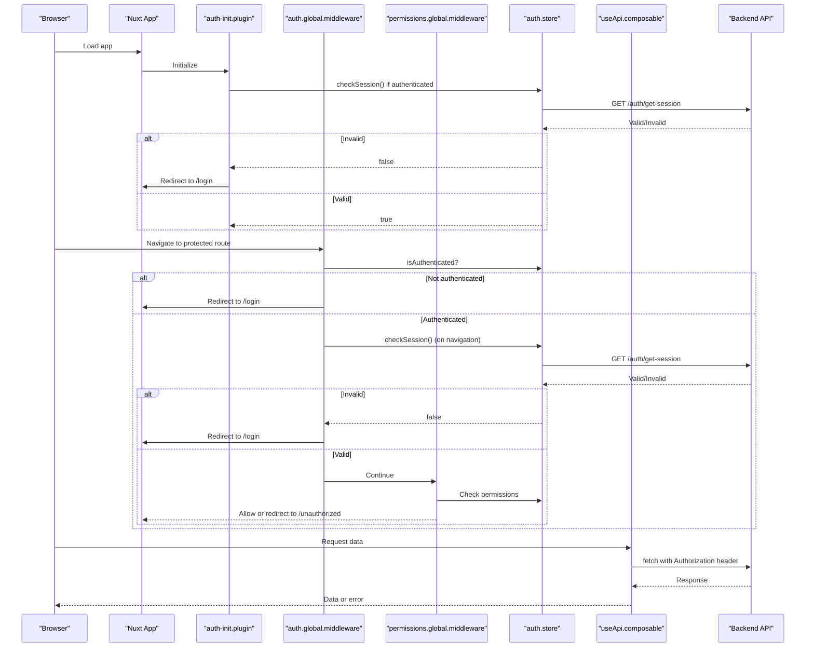
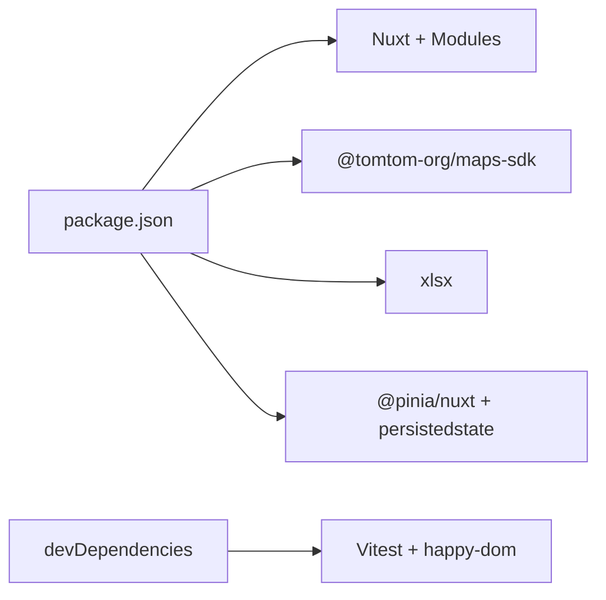

# Deployment & Production

<cite>
**Referenced Files in This Document**
- [package.json](file://package.json)
- [nuxt.config.ts](file://nuxt.config.ts)
- [README.md](file://README.md)
- [tsconfig.json](file://tsconfig.json)
- [vitest.config.ts](file://vitest.config.ts)
- [app/composables/useApi.ts](file://app/composables/useApi.ts)
- [app/plugins/auth-init.client.ts](file://app/plugins/auth-init.client.ts)
- [app/stores/auth.ts](file://app/stores/auth.ts)
- [app/middleware/auth.global.ts](file://app/middleware/auth.global.ts)
- [app/middleware/permissions.global.ts](file://app/middleware/permissions.global.ts)
</cite>

## Table of Contents
1. [Introduction](#introduction)
2. [Project Structure](#project-structure)
3. [Core Components](#core-components)
4. [Architecture Overview](#architecture-overview)
5. [Detailed Component Analysis](#detailed-component-analysis)
6. [Dependency Analysis](#dependency-analysis)
7. [Performance Considerations](#performance-considerations)
8. [Troubleshooting Guide](#troubleshooting-guide)
9. [Conclusion](#conclusion)
10. [Appendices](#appendices)

## Introduction
This document provides comprehensive deployment and production guidance for the Lacarte Atlas Console, a Nuxt-based application. It covers building for production, environment configuration, runtime behavior, security posture, monitoring/logging hooks, scaling strategies, and maintenance procedures. The goal is to enable reliable deployments with clear operational runbooks and troubleshooting steps.

## Project Structure
The project is a Nuxt 4 application using Vue 3 and Pinia. Build and preview scripts are provided via package.json, and runtime configuration is centralized in nuxt.config.ts. Authentication, authorization, and API communication are implemented through composables, stores, plugins, and middleware.

**Diagram sources**
- [package.json:5-12](file://package.json#L5-L12)
- [nuxt.config.ts:21-26](file://nuxt.config.ts#L21-L26)
- [app/composables/useApi.ts:1-91](file://app/composables/useApi.ts#L1-L91)
- [app/stores/auth.ts:1-230](file://app/stores/auth.ts#L1-L230)
- [app/middleware/auth.global.ts:1-32](file://app/middleware/auth.global.ts#L1-L32)
- [app/middleware/permissions.global.ts:1-59](file://app/middleware/permissions.global.ts#L1-L59)
- [app/plugins/auth-init.client.ts:1-25](file://app/plugins/auth-init.client.ts#L1-L25)

**Section sources**
- [package.json:1-33](file://package.json#L1-L33)
- [nuxt.config.ts:1-46](file://nuxt.config.ts#L1-L46)
- [README.md:41-76](file://README.md#L41-L76)

## Core Components
- Runtime Configuration: Public runtime config exposes API base URL and third-party keys to the client.
- API Composable: Centralized HTTP client that attaches bearer tokens, handles 401 redirects, and normalizes responses.
- Auth Store: Manages user state, token lifecycle, periodic session checks, and warnings.
- Middleware: Global authentication and permission guards enforce access control on routes.
- Plugin: Initializes session validation at app startup.

Key responsibilities:
- Environment-driven endpoints and keys via runtime config.
- Secure request handling with automatic token injection and error normalization.
- Session lifecycle with proactive refresh and warning UI.
- Route-level protection based on roles and permissions.

**Section sources**
- [nuxt.config.ts:21-26](file://nuxt.config.ts#L21-L26)
- [app/composables/useApi.ts:1-91](file://app/composables/useApi.ts#L1-L91)
- [app/stores/auth.ts:1-230](file://app/stores/auth.ts#L1-L230)
- [app/middleware/auth.global.ts:1-32](file://app/middleware/auth.global.ts#L1-L32)
- [app/middleware/permissions.global.ts:1-59](file://app/middleware/permissions.global.ts#L1-L59)
- [app/plugins/auth-init.client.ts:1-25](file://app/plugins/auth-init.client.ts#L1-L25)

## Architecture Overview
High-level runtime flow:
- Build produces static assets and server runtime (Nuxt).
- At runtime, public runtime config values are injected into the client bundle.
- On first load, the auth plugin validates an existing session.
- All route navigations pass through auth and permissions middleware.
- API calls go through useApi, which injects Authorization headers and handles errors.

**Diagram sources**
- [app/plugins/auth-init.client.ts:1-25](file://app/plugins/auth-init.client.ts#L1-L25)
- [app/middleware/auth.global.ts:1-32](file://app/middleware/auth.global.ts#L1-L32)
- [app/middleware/permissions.global.ts:1-59](file://app/middleware/permissions.global.ts#L1-L59)
- [app/stores/auth.ts:90-120](file://app/stores/auth.ts#L90-L120)
- [app/composables/useApi.ts:1-91](file://app/composables/useApi.ts#L1-L91)

## Detailed Component Analysis

### Build and Preview
- Build command compiles the app for production.
- Preview command serves the built output locally for verification.
- Generate command is available for static generation mode.

Operational notes:
- Use the same Node.js version across environments to avoid build differences.
- Cache dependencies and .nuxt artifacts in CI to speed up builds.

**Section sources**
- [package.json:5-12](file://package.json#L5-L12)
- [README.md:41-76](file://README.md#L41-L76)

### Runtime Configuration
Public runtime config variables exposed to the client:
- NUXT_PUBLIC_API_BASE: Base URL for backend API calls.
- NUXT_PUBLIC_TOMTOM_API_KEY: Key used by mapping services.

Best practices:
- Set these via your hosting platform’s environment variable system.
- Never commit secrets; rely on runtime injection.

**Section sources**
- [nuxt.config.ts:21-26](file://nuxt.config.ts#L21-L26)

### API Client and Error Handling
Centralized HTTP client:
- Attaches Authorization header when token exists.
- Normalizes success codes (200, 201, 204).
- Handles 401 by logging out and redirecting to login.
- Wraps errors with consistent messages and logs.

Error handling wrapper:
- Provides a run helper that shows toast notifications and returns null on failure.

Security considerations:
- Ensure CORS is configured on the backend for the deployed domain.
- Validate all inputs before sending to the API.

**Section sources**
- [app/composables/useApi.ts:1-91](file://app/composables/useApi.ts#L1-L91)
- [app/composables/useErrorHandler.ts:1-29](file://app/composables/useErrorHandler.ts#L1-L29)

### Authentication and Session Management
Auth store responsibilities:
- Stores user, token, team member profile, and session expiry.
- Periodically checks session validity and warns users near expiry.
- Refreshes session and updates expiry upon successful checks.
- Logs out and clears state on invalid sessions or explicit logout.

Startup flow:
- On app load, if a token exists, validate session and redirect if invalid.

Security considerations:
- Tokens are stored in memory and persisted via Pinia plugin; ensure secure storage policies align with your threat model.
- Enforce HTTPS everywhere.

**Section sources**
- [app/stores/auth.ts:1-230](file://app/stores/auth.ts#L1-L230)
- [app/plugins/auth-init.client.ts:1-25](file://app/plugins/auth-init.client.ts#L1-L25)

### Middleware: Authentication and Permissions
Authentication middleware:
- Allows public routes (/login, /forgot-password, /unauthorized) and payment pages (/pay/**).
- Redirects unauthenticated users to login.
- Verifies session on navigation transitions.

Permissions middleware:
- Skips public routes.
- Grants admin/super-admin full access.
- Maps routes to required permissions and redirects unauthorized users.

Operational tips:
- Keep route-permission mappings centralized and reviewed regularly.
- Log denied access attempts for auditability.

**Section sources**
- [app/middleware/auth.global.ts:1-32](file://app/middleware/auth.global.ts#L1-L32)
- [app/middleware/permissions.global.ts:1-59](file://app/middleware/permissions.global.ts#L1-L59)

### SSR and Routing Rules
SSR disabled for sensitive or interactive routes:
- /login
- /forgot-password
- /pay/**
- /tracking/**

Implications:
- These routes render fully on the client, reducing server load but increasing client-side work.
- Ensure any secrets remain server-only and are not embedded in client bundles.

**Section sources**
- [nuxt.config.ts:39-44](file://nuxt.config.ts#L39-L44)

### TypeScript and Build Targets
- TypeScript references generated configs under .nuxt.
- Vite build target set to esnext for modern browsers.
- Dependency optimization includes xlsx for faster cold starts.

Operational notes:
- Target modern browsers only if supported by your audience.
- Monitor bundle size and tree-shaking effectiveness.

**Section sources**
- [tsconfig.json:1-19](file://tsconfig.json#L1-L19)
- [nuxt.config.ts:32-38](file://nuxt.config.ts#L32-L38)

## Dependency Analysis
External dependencies relevant to production:
- Nuxt framework and modules (@nuxt/ui, @pinia/nuxt, persistedstate).
- Mapping SDK integration (@tomtom-org/maps-sdk).
- Spreadsheet utility (xlsx).
- Testing stack (Vitest, happy-dom) used in development/testing.

Build-time vs runtime:
- Development-only tooling should be excluded from production images.
- Only runtime dependencies are shipped to production.

**Diagram sources**
- [package.json:14-31](file://package.json#L14-L31)

**Section sources**
- [package.json:1-33](file://package.json#L1-L33)

## Performance Considerations
- Build target: esnext reduces polyfills and improves performance on modern browsers.
- Dependency optimization: Pre-bundle heavy packages like xlsx to reduce cold start latency.
- SSR offloading: Disable SSR for specific routes to reduce server CPU usage and improve interactivity.
- Bundle size: Audit large dependencies and consider lazy-loading where feasible.
- Caching: Leverage browser caching for static assets; configure CDN cache headers appropriately.
- Network: Minimize payload sizes and implement pagination for large datasets.

[No sources needed since this section provides general guidance]

## Troubleshooting Guide
Common issues and resolutions:
- 401 Unauthorized loops:
  - Verify backend session endpoint responds correctly.
  - Confirm Authorization header is attached and token is valid.
  - Check that 401 triggers logout and redirect to login.
- Missing API key errors:
  - Ensure NUXT_PUBLIC_TOMTOM_API_KEY is set in the runtime environment.
- CORS failures:
  - Configure backend CORS to allow the deployed origin.
- Session expirations:
  - Review periodic session checks and warning thresholds.
  - Inspect network requests to /auth/get-session.
- Permission denials:
  - Validate route-permission mappings and user role/permissions.

Logging and observability:
- The API composable logs request metadata and response status.
- Auth flows log session checks and redirects.
- Integrate with your logging provider by replacing console logs with structured logging.

**Section sources**
- [app/composables/useApi.ts:1-91](file://app/composables/useApi.ts#L1-L91)
- [app/stores/auth.ts:90-120](file://app/stores/auth.ts#L90-L120)
- [app/middleware/auth.global.ts:1-32](file://app/middleware/auth.global.ts#L1-L32)
- [app/middleware/permissions.global.ts:1-59](file://app/middleware/permissions.global.ts#L1-L59)

## Conclusion
The Lacarte Atlas Console is a modern Nuxt application with robust runtime configuration, secure API interactions, and strong route-level protections. By following the deployment and operational guidance herein—particularly around environment variables, SSR rules, and session management—you can achieve reliable, secure, and performant production deployments.

[No sources needed since this section summarizes without analyzing specific files]

## Appendices

### Environment Variables Reference
- NUXT_PUBLIC_API_BASE: Backend API base URL.
- NUXT_PUBLIC_TOMTOM_API_KEY: Third-party mapping service key.

Set these in your hosting platform’s environment configuration. Do not hardcode them in source.

**Section sources**
- [nuxt.config.ts:21-26](file://nuxt.config.ts#L21-L26)

### Security Checklist
- Enforce HTTPS for all traffic.
- Validate and sanitize all inputs before sending to the API.
- Restrict public routes and keep secrets server-only.
- Regularly rotate API keys and review permissions mappings.
- Enable CORS only for trusted origins.

[No sources needed since this section provides general guidance]

### Scaling Strategies
- Horizontal scaling: Run multiple instances behind a load balancer; ensure shared state is externalized (e.g., Redis) if needed.
- CDN: Serve static assets from a CDN with appropriate cache policies.
- Rate limiting: Apply at the edge or API gateway to protect backend services.
- Observability: Centralize logs and metrics; set alerts for 4xx/5xx spikes and slow endpoints.

[No sources needed since this section provides general guidance]

### Maintenance Procedures
- Update dependencies periodically and test changes with the provided test runner.
- Rebuild and redeploy after environment variable changes.
- Monitor session health and adjust intervals/warnings as needed.
- Review and prune unused routes and permissions.

**Section sources**
- [package.json:11-12](file://package.json#L11-L12)
- [app/stores/auth.ts:122-174](file://app/stores/auth.ts#L122-L174)