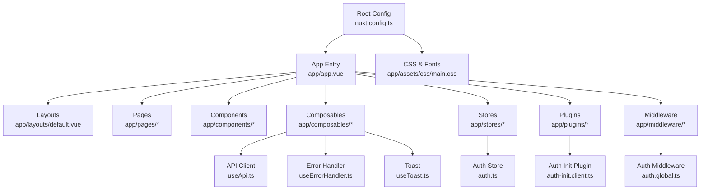
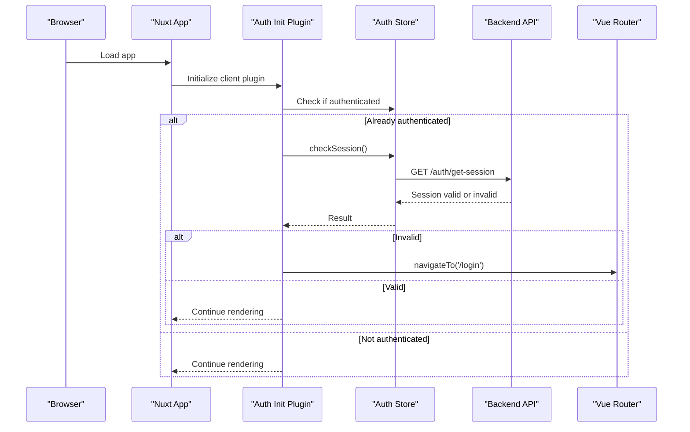
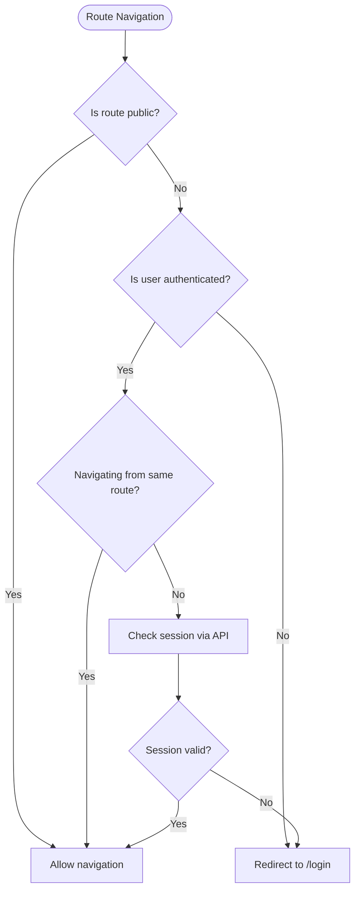
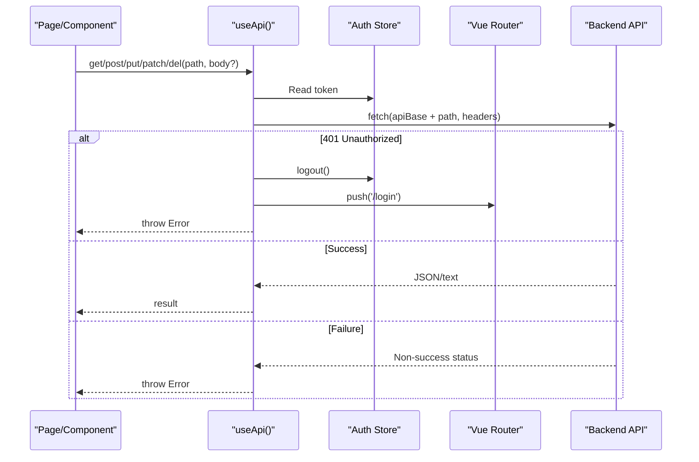
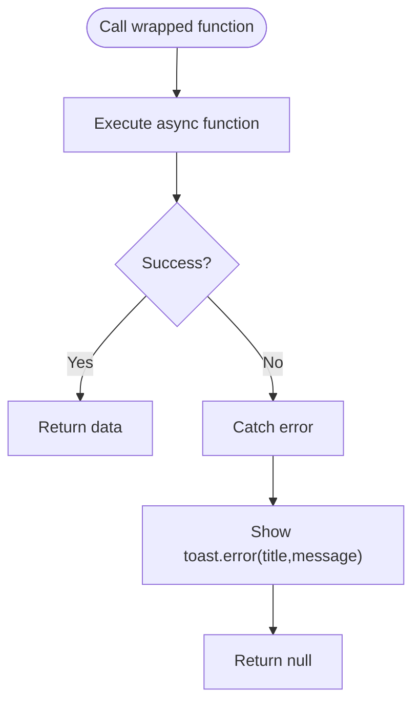
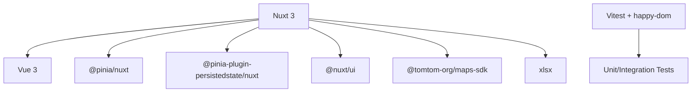

# Development Guide

<cite>
**Referenced Files in This Document**
- [package.json](file://package.json)
- [nuxt.config.ts](file://nuxt.config.ts)
- [tsconfig.json](file://tsconfig.json)
- [vitest.config.ts](file://vitest.config.ts)
- [README.md](file://README.md)
- [app.vue](file://app/app.vue)
- [default.vue](file://app/layouts/default.vue)
- [auth.global.ts](file://app/middleware/auth.global.ts)
- [useApi.ts](file://app/composables/useApi.ts)
- [auth.ts](file://app/stores/auth.ts)
- [auth-init.client.ts](file://app/plugins/auth-init.client.ts)
- [main.css](file://app/assets/css/main.css)
</cite>

## Table of Contents
1. Introduction
2. Project Structure
3. Core Components
4. Architecture Overview
5. Detailed Component Analysis
6. Dependency Analysis
7. Performance Considerations
8. Troubleshooting Guide
9. Conclusion

## Introduction
This guide explains how to contribute effectively to the Lacarte Atlas Console project. It covers development workflow, code organization conventions, naming standards, build and test processes, configuration, debugging techniques, and performance optimization. The application is a Nuxt 3 + Vue 3 SPA with Pinia state management, global middleware for authentication, and a composable-based API client.

## Project Structure
The project follows Nuxt 3 conventions:
- app/ contains all application source code (pages, components, composables, stores, types, plugins, layouts, middleware).
- public/ holds static assets served as-is.
- Configuration files at root define scripts, modules, runtime config, and testing setup.

Key directories and responsibilities:
- app/pages: File-based routing. Each .vue file maps to a route path.
- app/components: Reusable UI components.
- app/composables: Shared logic exposed via composables (e.g., API client, error handling, toast notifications).
- app/stores: Pinia stores (e.g., auth).
- app/types: TypeScript interfaces for shared data contracts.
- app/plugins: Client-side initialization logic (e.g., auth initialization).
- app/middleware: Global route guards (e.g., authentication).
- app/layouts: Layout wrappers for pages.
- app/assets: Global styles and fonts.

**Diagram sources**
- [nuxt.config.ts:1-46](file://nuxt.config.ts#L1-L46)
- [app.vue:1-33](file://app/app.vue#L1-L33)
- [default.vue:1-6](file://app/layouts/default.vue#L1-L6)
- [auth.global.ts:1-32](file://app/middleware/auth.global.ts#L1-L32)
- [useApi.ts:1-91](file://app/composables/useApi.ts#L1-L91)
- [auth.ts:1-230](file://app/stores/auth.ts#L1-L230)
- [auth-init.client.ts:1-25](file://app/plugins/auth-init.client.ts#L1-L25)
- [main.css:1-206](file://app/assets/css/main.css#L1-L206)

**Section sources**
- [nuxt.config.ts:1-46](file://nuxt.config.ts#L1-L46)
- [app.vue:1-33](file://app/app.vue#L1-L33)
- [default.vue:1-6](file://app/layouts/default.vue#L1-L6)
- [auth.global.ts:1-32](file://app/middleware/auth.global.ts#L1-L32)
- [useApi.ts:1-91](file://app/composables/useApi.ts#L1-L91)
- [auth.ts:1-230](file://app/stores/auth.ts#L1-L230)
- [auth-init.client.ts:1-25](file://app/plugins/auth-init.client.ts#L1-L25)
- [main.css:1-206](file://app/assets/css/main.css#L1-L206)

## Core Components
- Application shell and layout:
  - Root component initializes UI framework, renders layout and pages, and integrates session warning and toast containers.
  - Default layout provides a simple slot wrapper for page content.
- Authentication:
  - Global middleware enforces login requirements and redirects unauthenticated users.
  - Auth store manages user, token, session expiry, periodic checks, and warnings.
  - Client plugin validates session on app load and controls an initial loading screen.
- Networking:
  - Composable API client centralizes fetch calls, adds Authorization headers, handles 401 logout flows, and wraps errors with toast notifications.
- User feedback:
  - Toast composable provides a simple queue for success/error/warning/info messages.
  - Error handler composable wraps async operations and shows consistent error toasts.

Development workflow essentials:
- Install dependencies using your preferred package manager.
- Start dev server, build for production, preview locally, and run tests.

Build and scripts:
- Development server, build, generate, preview, and test commands are defined in package scripts.
- Postinstall prepares Nuxt for type generation.

TypeScript configuration:
- Uses Nuxt-generated tsconfig references for app/server/shared/node targets.

Testing configuration:
- Vitest configured with happy-dom environment, globals enabled, and aliases for ~ and @ pointing to app/.

Runtime configuration:
- Public runtime config exposes API base URL and external keys.
- Route rules disable SSR for specific routes.

Vite optimizations:
- Build target set to esnext; dependency pre-bundling includes xlsx.

Global styles:
- CSS variables, responsive grids, skeleton animations, and mobile-friendly utilities.

**Section sources**
- [app.vue:1-33](file://app/app.vue#L1-L33)
- [default.vue:1-6](file://app/layouts/default.vue#L1-L6)
- [auth.global.ts:1-32](file://app/middleware/auth.global.ts#L1-L32)
- [auth.ts:1-230](file://app/stores/auth.ts#L1-L230)
- [auth-init.client.ts:1-25](file://app/plugins/auth-init.client.ts#L1-L25)
- [useApi.ts:1-91](file://app/composables/useApi.ts#L1-L91)
- [main.css:1-206](file://app/assets/css/main.css#L1-L206)
- [package.json:1-33](file://package.json#L1-L33)
- [nuxt.config.ts:1-46](file://nuxt.config.ts#L1-L46)
- [tsconfig.json:1-19](file://tsconfig.json#L1-L19)
- [vitest.config.ts:1-18](file://vitest.config.ts#L1-L18)
- [README.md:1-76](file://README.md#L1-L76)

## Architecture Overview
High-level architecture:
- Nuxt 3 bootstraps the app, loads plugins, applies middleware, and renders pages within layouts.
- Authentication flow uses a client plugin to validate sessions on startup and a global middleware to protect routes.
- Pages call the API client composable which attaches tokens and normalizes responses.
- State is managed by Pinia stores with persistence enabled.

**Diagram sources**
- [auth-init.client.ts:1-25](file://app/plugins/auth-init.client.ts#L1-L25)
- [auth.ts:1-230](file://app/stores/auth.ts#L1-L230)
- [nuxt.config.ts:1-46](file://nuxt.config.ts#L1-L46)

## Detailed Component Analysis

### Authentication Flow
Responsibilities:
- Global middleware protects routes and redirects unauthenticated users.
- Auth store persists token, manages session expiry, refreshes session periodically, and updates user profile.
- Client plugin ensures session validity on app start and controls initial loading state.

**Diagram sources**
- [auth.global.ts:1-32](file://app/middleware/auth.global.ts#L1-L32)
- [auth.ts:1-230](file://app/stores/auth.ts#L1-L230)

**Section sources**
- [auth.global.ts:1-32](file://app/middleware/auth.global.ts#L1-L32)
- [auth.ts:1-230](file://app/stores/auth.ts#L1-L230)
- [auth-init.client.ts:1-25](file://app/plugins/auth-init.client.ts#L1-L25)

### API Client and Error Handling
Responsibilities:
- Centralized HTTP client that injects Authorization header, logs requests/responses, handles 401 logout, and returns typed results.
- Convenience methods wrap the core request with automatic error toasts and return null on failure.

**Diagram sources**
- [useApi.ts:1-91](file://app/composables/useApi.ts#L1-L91)
- [auth.ts:1-230](file://app/stores/auth.ts#L1-L230)

**Section sources**
- [useApi.ts:1-91](file://app/composables/useApi.ts#L1-L91)
- [auth.ts:1-230](file://app/stores/auth.ts#L1-L230)

### Toast Notifications and Error Wrapping
Responsibilities:
- Toast composable maintains a reactive list of notifications with auto-dismiss timers.
- Error handler composable wraps async functions, catches errors, displays toasts, and returns null for safe guarding.

**Diagram sources**
- [useToast.ts:1-37](file://app/composables/useToast.ts#L1-L37)
- [useErrorHandler.ts:1-29](file://app/composables/useErrorHandler.ts#L1-L29)

**Section sources**
- [useToast.ts:1-37](file://app/composables/useToast.ts#L1-L37)
- [useErrorHandler.ts:1-29](file://app/composables/useErrorHandler.ts#L1-L29)

### Global Styles and Responsive Utilities
Responsibilities:
- Provides CSS variables for theming, skeleton shimmer animation, responsive grid helpers, and mobile-specific overrides.

Usage guidelines:
- Use provided grid classes for consistent layouts.
- Leverage skeleton class for loading placeholders.
- Respect media queries for responsive behavior.

**Section sources**
- [main.css:1-206](file://app/assets/css/main.css#L1-L206)

## Dependency Analysis
External dependencies and modules:
- Nuxt 3 and Vue 3 form the core framework.
- Pinia and persisted state plugin manage and persist state.
- TomTom Maps SDK is included for mapping features.
- XLSX is optimized for dependency pre-bundling.
- Testing stack uses Vitest with happy-dom and Vue Test Utils.

Configuration highlights:
- Modules registered in Nuxt config.
- Runtime config exposes public API endpoints and keys.
- Vite build target and dependency optimization settings.
- Route rules disable SSR for sensitive or interactive routes.

**Diagram sources**
- [package.json:1-33](file://package.json#L1-L33)
- [nuxt.config.ts:1-46](file://nuxt.config.ts#L1-L46)
- [vitest.config.ts:1-18](file://vitest.config.ts#L1-L18)

**Section sources**
- [package.json:1-33](file://package.json#L1-L33)
- [nuxt.config.ts:1-46](file://nuxt.config.ts#L1-L46)
- [vitest.config.ts:1-18](file://vitest.config.ts#L1-L18)

## Performance Considerations
- Prefer composables for reusable logic to keep components thin and testable.
- Use the centralized API client to avoid duplicate network logic and ensure consistent error handling.
- Keep session checks at reasonable intervals to balance responsiveness and backend load.
- Optimize large dependencies (e.g., xlsx) through Vite’s optimizeDeps as configured.
- Disable SSR only where necessary using routeRules to reduce server overhead.
- Use skeleton loaders and responsive utilities for perceived performance improvements.

[No sources needed since this section provides general guidance]

## Troubleshooting Guide
Common issues and resolutions:
- Unauthenticated redirects:
  - Ensure the global middleware allows intended public routes and that the auth store has a valid token.
- 401 Unauthorized loops:
  - The API client logs out and redirects on 401; verify backend token validation and expiration policies.
- Session expiry warnings not appearing:
  - Confirm the auth store’s session warning interval is running and sessionExpiresAt is updated after successful checks.
- Environment variables not applied:
  - Verify runtime config values in nuxt.config.ts and ensure environment variables are set when building or running.
- Tests failing due to missing aliases:
  - Confirm vitest.config.ts aliases resolve ~ and @ to app/.

Debugging tips:
- Use console logs in the API client and auth store to trace request/response flows and session checks.
- Inspect browser network tab to confirm Authorization headers and endpoint URLs.
- Run tests with watch mode to iterate quickly on changes.

**Section sources**
- [auth.global.ts:1-32](file://app/middleware/auth.global.ts#L1-L32)
- [useApi.ts:1-91](file://app/composables/useApi.ts#L1-L91)
- [auth.ts:1-230](file://app/stores/auth.ts#L1-L230)
- [nuxt.config.ts:1-46](file://nuxt.config.ts#L1-L46)
- [vitest.config.ts:1-18](file://vitest.config.ts#L1-L18)

## Conclusion
This guide outlined the project structure, key components, and development practices for contributing to Lacarte Atlas Console. Follow the established patterns for routing, state management, networking, and error handling to maintain consistency and reliability. Use the provided scripts and configurations to develop, test, and build efficiently.

[No sources needed since this section summarizes without analyzing specific files]