# Driver Management

<cite>
**Referenced Files in This Document**
- [driver.ts](file://app/types/driver.ts)
- [index.vue](file://app/pages/drivers/index.vue)
- [id.vue](file://app/pages/drivers/[id].vue)
- [AddDriverModal.vue](file://app/components/AddDriverModal.vue)
- [EditDriverModal.vue](file://app/components/EditDriverModal.vue)
- [AssignDriverModal.vue](file://app/components/AssignDriverModal.vue)
- [drivers.vue](file://app/pages/tracking/drivers.vue)
- [useApi.ts](file://app/composables/useApi.ts)
</cite>

## Table of Contents
1. [Introduction](#introduction)
2. [Project Structure](#project-structure)
3. [Core Components](#core-components)
4. [Architecture Overview](#architecture-overview)
5. [Detailed Component Analysis](#detailed-component-analysis)
6. [Dependency Analysis](#dependency-analysis)
7. [Performance Considerations](#performance-considerations)
8. [Troubleshooting Guide](#troubleshooting-guide)
9. [Conclusion](#conclusion)
10. [Appendices](#appendices)

## Introduction
This document explains the driver management system implemented in the console application. It covers:
- CRUD operations for drivers (create, edit, delete)
- Driver status tracking and availability
- Driver profile data structure, qualification validation, and contact information
- Practical workflows for adding, updating, assigning, and monitoring drivers
- Performance metrics such as total trips and earnings
- Scheduling logic, zone assignments, and integration with real-time tracking

The system is built on a Nuxt 3 frontend that communicates with backend endpoints via a typed API wrapper.

## Project Structure
The driver management feature spans pages, components, types, and utilities:
- Pages: Drivers list and detail views
- Components: Modals for adding, editing, and assigning drivers
- Types: Shared TypeScript interfaces for drivers, zones, trucks, and tracking
- Utilities: Centralized HTTP client with error handling and authentication

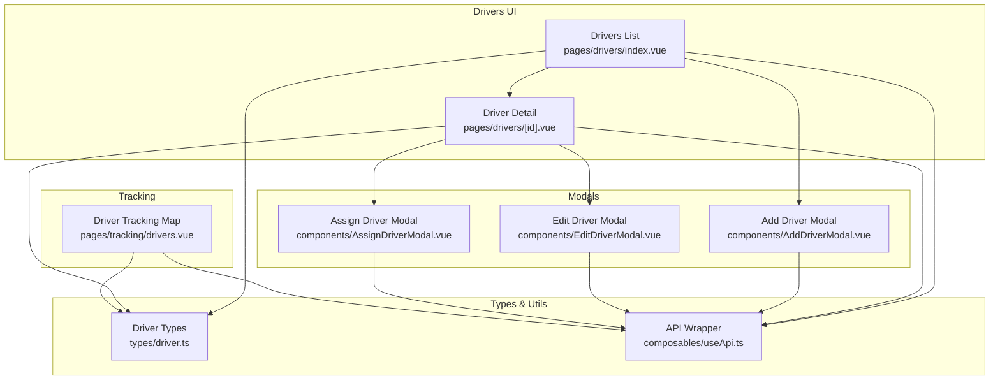

**Diagram sources**
- [index.vue:1-149](file://app/pages/drivers/index.vue#L1-L149)
- [id.vue:1-800](file://app/pages/drivers/[id].vue#L1-L800)
- [AddDriverModal.vue:1-190](file://app/components/AddDriverModal.vue#L1-L190)
- [EditDriverModal.vue:1-195](file://app/components/EditDriverModal.vue#L1-L195)
- [AssignDriverModal.vue:1-222](file://app/components/AssignDriverModal.vue#L1-L222)
- [drivers.vue:1-556](file://app/pages/tracking/drivers.vue#L1-L556)
- [driver.ts:1-106](file://app/types/driver.ts#L1-L106)
- [useApi.ts:1-91](file://app/composables/useApi.ts#L1-L91)

**Section sources**
- [index.vue:1-149](file://app/pages/drivers/index.vue#L1-L149)
- [id.vue:1-800](file://app/pages/drivers/[id].vue#L1-L800)
- [AddDriverModal.vue:1-190](file://app/components/AddDriverModal.vue#L1-L190)
- [EditDriverModal.vue:1-195](file://app/components/EditDriverModal.vue#L1-L195)
- [AssignDriverModal.vue:1-222](file://app/components/AssignDriverModal.vue#L1-L222)
- [drivers.vue:1-556](file://app/pages/tracking/drivers.vue#L1-L556)
- [driver.ts:1-106](file://app/types/driver.ts#L1-L106)
- [useApi.ts:1-91](file://app/composables/useApi.ts#L1-L91)

## Core Components
- Drivers list page: fetches all drivers, shows key attributes, and opens add modal.
- Driver detail page: displays profile, current route, history, performance, and earnings; supports edit and delete.
- Add/Edit modals: collect and validate driver profile fields, submit to backend.
- Assign driver modal: selects an available driver and schedules a pickup request.
- Tracking map: renders live driver positions using Server-Sent Events (SSE).
- API wrapper: centralizes HTTP calls, auth headers, and error handling.

Key responsibilities:
- Data fetching and mutation orchestration
- Form validation and user feedback
- Status rendering and availability filtering
- Real-time updates for tracking

**Section sources**
- [index.vue:1-149](file://app/pages/drivers/index.vue#L1-L149)
- [id.vue:1-800](file://app/pages/drivers/[id].vue#L1-L800)
- [AddDriverModal.vue:1-190](file://app/components/AddDriverModal.vue#L1-L190)
- [EditDriverModal.vue:1-195](file://app/components/EditDriverModal.vue#L1-L195)
- [AssignDriverModal.vue:1-222](file://app/components/AssignDriverModal.vue#L1-L222)
- [drivers.vue:1-556](file://app/pages/tracking/drivers.vue#L1-L556)
- [useApi.ts:1-91](file://app/composables/useApi.ts#L1-L91)

## Architecture Overview
The driver management architecture follows a clear separation between UI, stateless modals, shared types, and a centralized API layer.

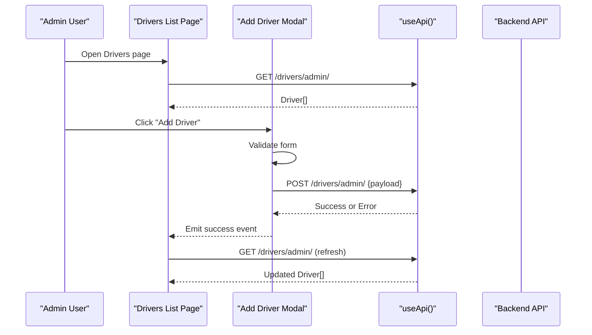

**Diagram sources**
- [index.vue:1-149](file://app/pages/drivers/index.vue#L1-L149)
- [AddDriverModal.vue:1-190](file://app/components/AddDriverModal.vue#L1-L190)
- [useApi.ts:1-91](file://app/composables/useApi.ts#L1-L91)

## Detailed Component Analysis

### Driver Profile Data Model
The driver model includes identity, contact info, license details, zone assignment, truck assignment, operational stats, and real-time tracking metadata.

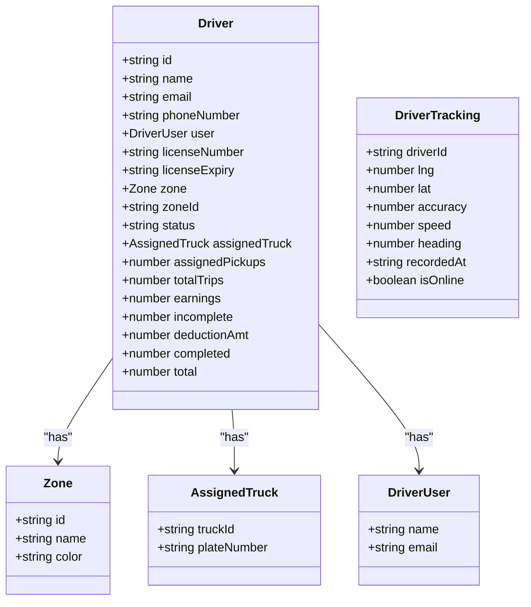

**Diagram sources**
- [driver.ts:1-106](file://app/types/driver.ts#L1-L106)

**Section sources**
- [driver.ts:1-106](file://app/types/driver.ts#L1-L106)

### Driver Status Tracking and Availability
Supported statuses include active, inactive, on_leave, on-route, online. The UI renders badges and filters based on these values.

- Status badge mapping and styling are handled in both list and detail pages.
- Assignment modal filters drivers by availability (active or online).

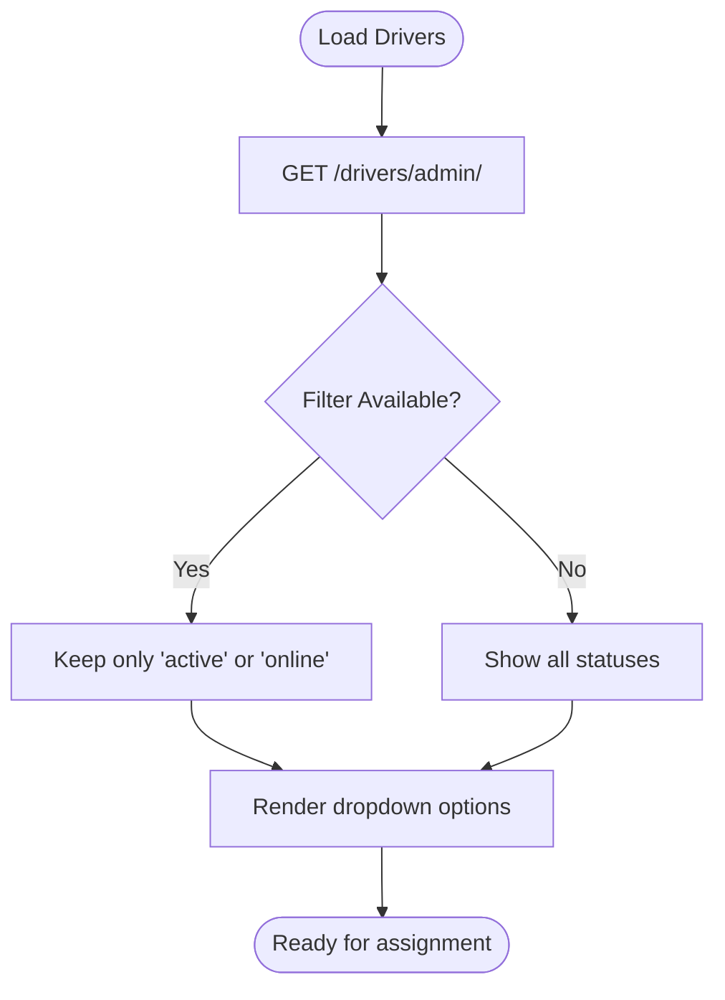

**Diagram sources**
- [AssignDriverModal.vue:1-222](file://app/components/AssignDriverModal.vue#L1-L222)
- [index.vue:1-149](file://app/pages/drivers/index.vue#L1-L149)
- [id.vue:1-800](file://app/pages/drivers/[id].vue#L1-L800)

**Section sources**
- [AssignDriverModal.vue:1-222](file://app/components/AssignDriverModal.vue#L1-L222)
- [index.vue:1-149](file://app/pages/drivers/index.vue#L1-L149)
- [id.vue:1-800](file://app/pages/drivers/[id].vue#L1-L800)

### Driver Creation Workflow
- Collects first/last name, email, phone, license number/expiry, zone, and initial status.
- Validates required fields and email format.
- Submits payload to create endpoint and refreshes the list.

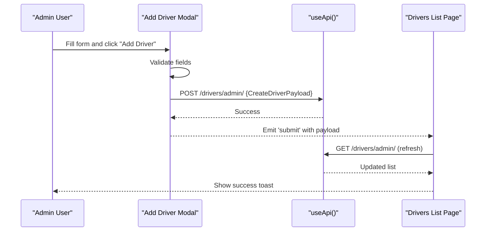

**Diagram sources**
- [AddDriverModal.vue:1-190](file://app/components/AddDriverModal.vue#L1-L190)
- [index.vue:1-149](file://app/pages/drivers/index.vue#L1-L149)
- [useApi.ts:1-91](file://app/composables/useApi.ts#L1-L91)

**Section sources**
- [AddDriverModal.vue:1-190](file://app/components/AddDriverModal.vue#L1-L190)
- [index.vue:1-149](file://app/pages/drivers/index.vue#L1-L149)

### Driver Editing Workflow
- Pre-populates form from existing driver data.
- Validates required fields and email format.
- Submits partial update via PATCH and refreshes detail view.

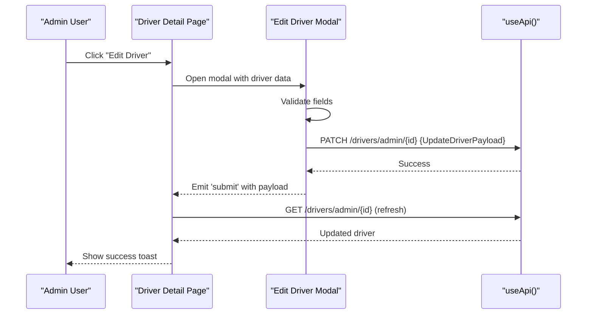

**Diagram sources**
- [EditDriverModal.vue:1-195](file://app/components/EditDriverModal.vue#L1-L195)
- [id.vue:1-800](file://app/pages/drivers/[id].vue#L1-L800)
- [useApi.ts:1-91](file://app/composables/useApi.ts#L1-L91)

**Section sources**
- [EditDriverModal.vue:1-195](file://app/components/EditDriverModal.vue#L1-L195)
- [id.vue:1-800](file://app/pages/drivers/[id].vue#L1-L800)

### Driver Deletion Workflow
- Confirms deletion via dialog.
- Sends DELETE request and navigates back to the list upon success.

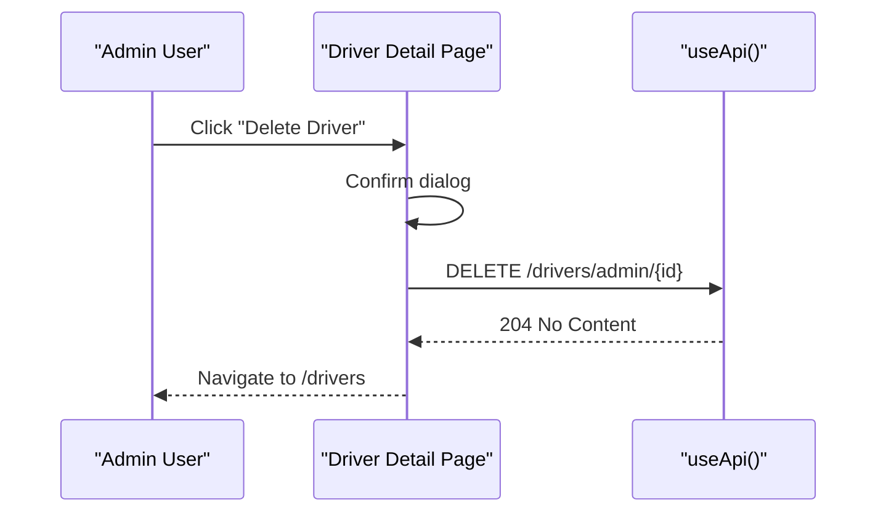

**Diagram sources**
- [id.vue:1-800](file://app/pages/drivers/[id].vue#L1-L800)
- [useApi.ts:1-91](file://app/composables/useApi.ts#L1-L91)

**Section sources**
- [id.vue:1-800](file://app/pages/drivers/[id].vue#L1-L800)

### Driver Assignment and Scheduling
- Loads available drivers (active or online).
- Allows selecting time slot, priority, and admin notes.
- Emits assignment payload for further processing.

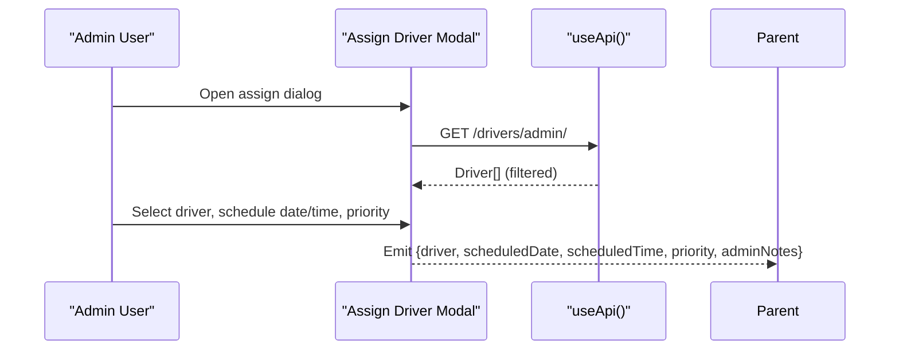

**Diagram sources**
- [AssignDriverModal.vue:1-222](file://app/components/AssignDriverModal.vue#L1-L222)
- [useApi.ts:1-91](file://app/composables/useApi.ts#L1-L91)

**Section sources**
- [AssignDriverModal.vue:1-222](file://app/components/AssignDriverModal.vue#L1-L222)

### Driver Detail View: Route, History, Performance, Earnings
- Current route: fetches today’s stops and progress.
- Route history: lists past pickups with statuses.
- Performance: monthly pickups and completion rate charts, plus summary stats.
- Earnings: current period breakdown and historical table.

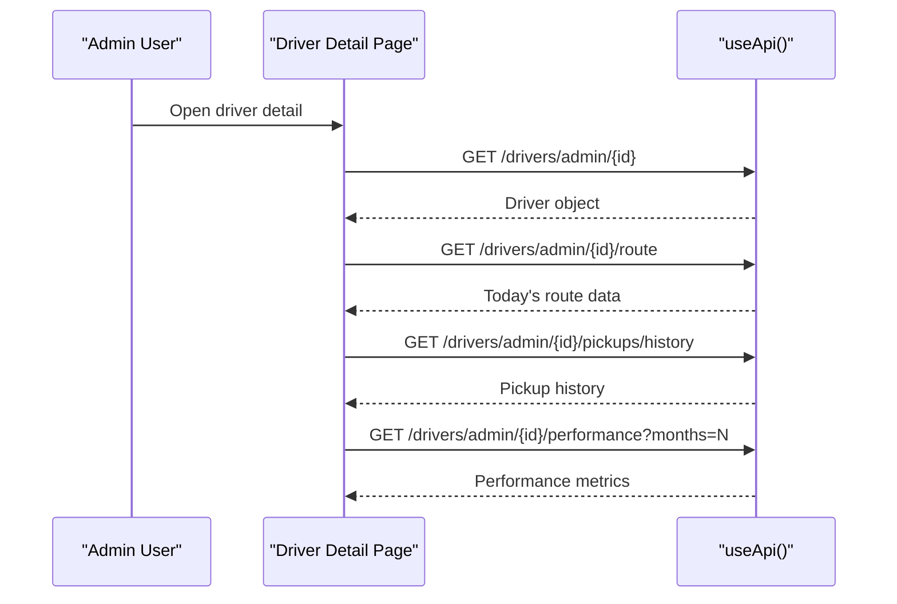

**Diagram sources**
- [id.vue:1-800](file://app/pages/drivers/[id].vue#L1-L800)
- [useApi.ts:1-91](file://app/composables/useApi.ts#L1-L91)

**Section sources**
- [id.vue:1-800](file://app/pages/drivers/[id].vue#L1-L800)

### Real-Time Driver Tracking Integration
- Initializes a TomTom map and loads custom icons.
- Connects to SSE stream for live driver locations.
- Updates markers dynamically and fits bounds to visible drivers.

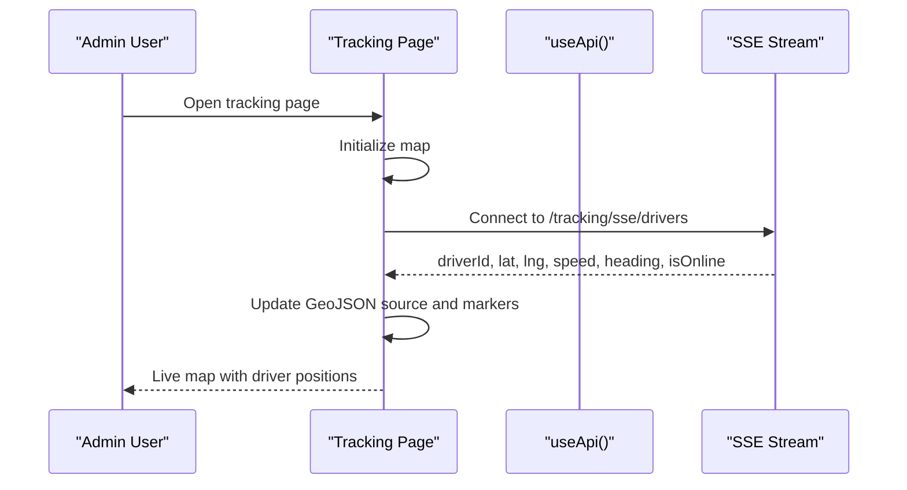

**Diagram sources**
- [drivers.vue:1-556](file://app/pages/tracking/drivers.vue#L1-L556)
- [useApi.ts:1-91](file://app/composables/useApi.ts#L1-L91)

**Section sources**
- [drivers.vue:1-556](file://app/pages/tracking/drivers.vue#L1-L556)

## Dependency Analysis
- Pages depend on the API wrapper for all HTTP interactions.
- Modals depend on the API wrapper and emit events to parent pages.
- Types define contracts used across pages and components.
- Tracking page depends on runtime configuration for API base URL and map SDK.

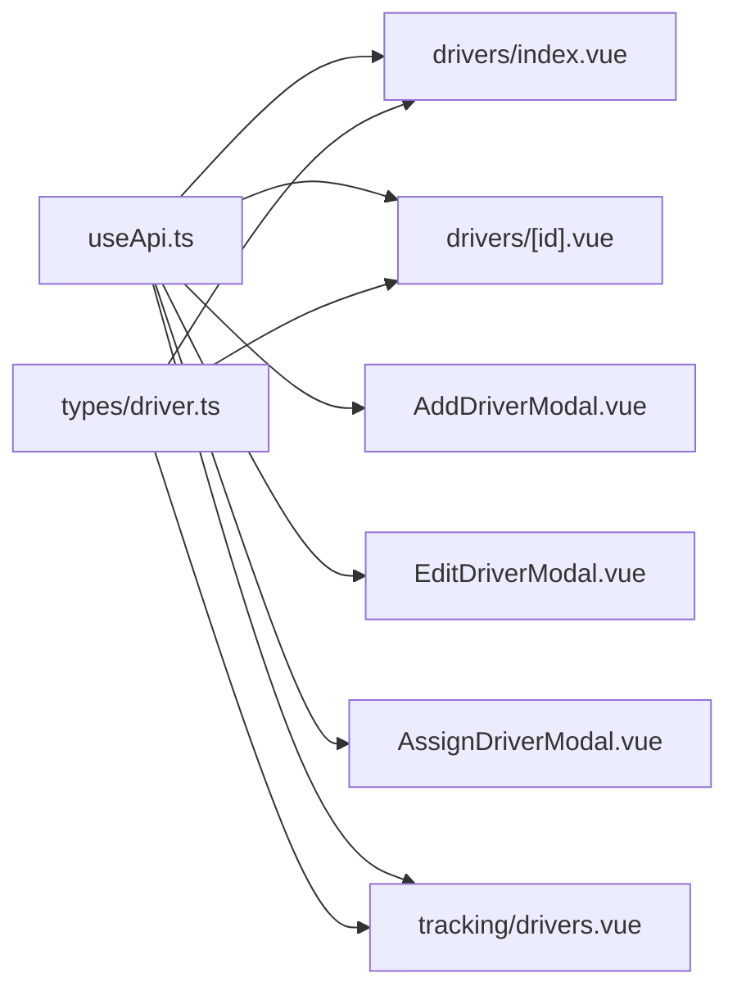

**Diagram sources**
- [useApi.ts:1-91](file://app/composables/useApi.ts#L1-L91)
- [index.vue:1-149](file://app/pages/drivers/index.vue#L1-L149)
- [id.vue:1-800](file://app/pages/drivers/[id].vue#L1-L800)
- [AddDriverModal.vue:1-190](file://app/components/AddDriverModal.vue#L1-L190)
- [EditDriverModal.vue:1-195](file://app/components/EditDriverModal.vue#L1-L195)
- [AssignDriverModal.vue:1-222](file://app/components/AssignDriverModal.vue#L1-L222)
- [drivers.vue:1-556](file://app/pages/tracking/drivers.vue#L1-L556)
- [driver.ts:1-106](file://app/types/driver.ts#L1-L106)

**Section sources**
- [useApi.ts:1-91](file://app/composables/useApi.ts#L1-L91)
- [index.vue:1-149](file://app/pages/drivers/index.vue#L1-L149)
- [id.vue:1-800](file://app/pages/drivers/[id].vue#L1-L800)
- [AddDriverModal.vue:1-190](file://app/components/AddDriverModal.vue#L1-L190)
- [EditDriverModal.vue:1-195](file://app/components/EditDriverModal.vue#L1-L195)
- [AssignDriverModal.vue:1-222](file://app/components/AssignDriverModal.vue#L1-L222)
- [drivers.vue:1-556](file://app/pages/tracking/drivers.vue#L1-L556)
- [driver.ts:1-106](file://app/types/driver.ts#L1-L106)

## Performance Considerations
- Use pagination for large datasets if needed (e.g., pickup history).
- Debounce search/filter inputs when listing drivers.
- Cache frequently accessed reference data like zones.
- Optimize map marker updates by batching SSE messages.
- Avoid unnecessary re-renders by keeping computed properties minimal.

[No sources needed since this section provides general guidance]

## Troubleshooting Guide
Common issues and resolutions:
- Authentication failures: 401 responses trigger logout and redirect to login via the API wrapper.
- Missing environment variables: Tracking map requires API keys; ensure configuration is present.
- SSE connection errors: Reconnect button allows retrying the stream.
- Validation errors: Ensure required fields are filled and email format is valid before submission.

Operational checks:
- Verify API base URL and auth token presence.
- Confirm map container exists in DOM before initialization.
- Inspect network logs for failed requests and error messages.

**Section sources**
- [useApi.ts:1-91](file://app/composables/useApi.ts#L1-L91)
- [drivers.vue:1-556](file://app/pages/tracking/drivers.vue#L1-L556)
- [AddDriverModal.vue:1-190](file://app/components/AddDriverModal.vue#L1-L190)
- [EditDriverModal.vue:1-195](file://app/components/EditDriverModal.vue#L1-L195)

## Conclusion
The driver management system provides a comprehensive set of features for managing driver profiles, scheduling, and real-time tracking. It leverages a clean separation of concerns with reusable components, strong typing, and a centralized API layer. The design supports extensibility for additional metrics, advanced scheduling rules, and enhanced reporting.

[No sources needed since this section summarizes without analyzing specific files]

## Appendices

### API Endpoints Used by Driver Management
- GET /drivers/admin/ — List all drivers
- POST /drivers/admin/ — Create a new driver
- GET /drivers/admin/{id} — Get driver details
- PATCH /drivers/admin/{id} — Update driver fields
- DELETE /drivers/admin/{id} — Delete a driver
- GET /drivers/admin/{id}/route — Get current route and progress
- GET /drivers/admin/{id}/pickups/history — Get pickup history
- GET /drivers/admin/{id}/performance?months=N — Get performance metrics
- GET /tracking/sse/drivers — SSE stream for live driver locations

**Section sources**
- [index.vue:1-149](file://app/pages/drivers/index.vue#L1-L149)
- [id.vue:1-800](file://app/pages/drivers/[id].vue#L1-L800)
- [drivers.vue:1-556](file://app/pages/tracking/drivers.vue#L1-L556)