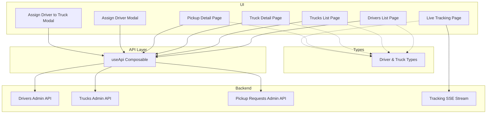
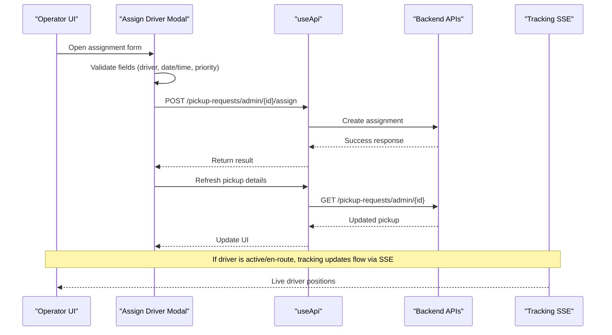
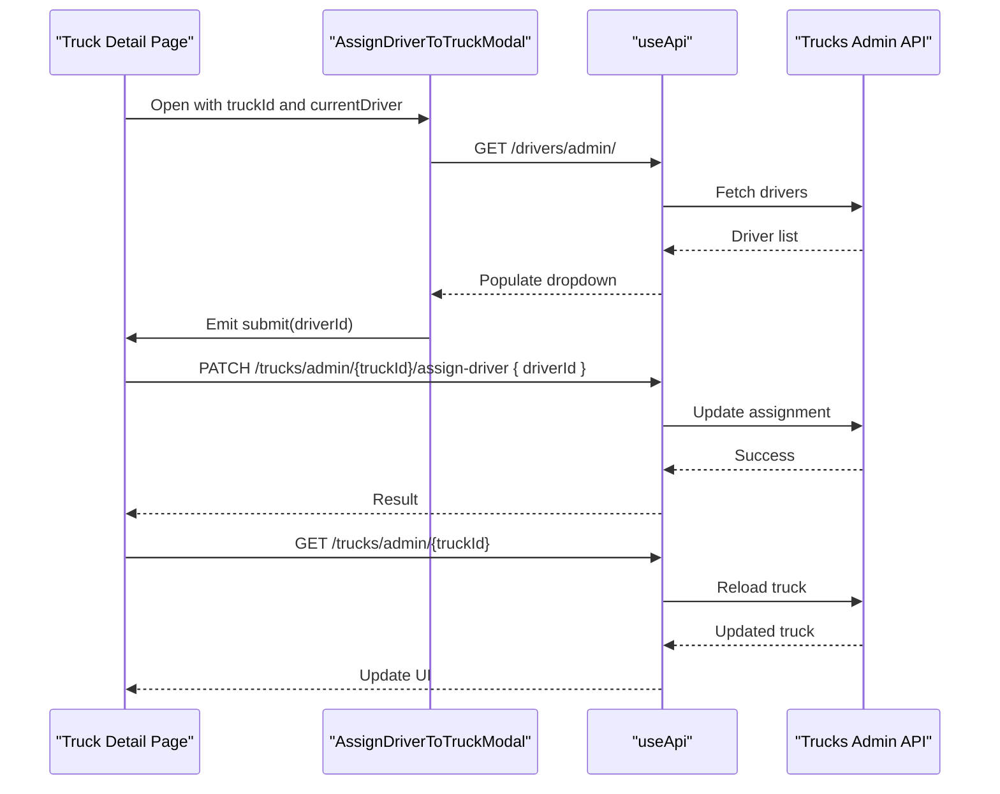
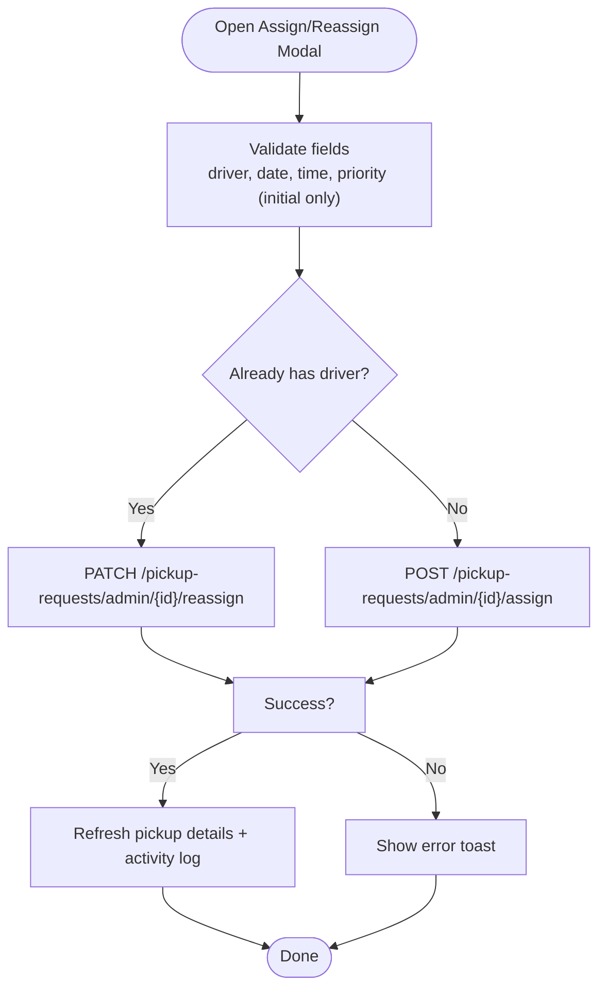
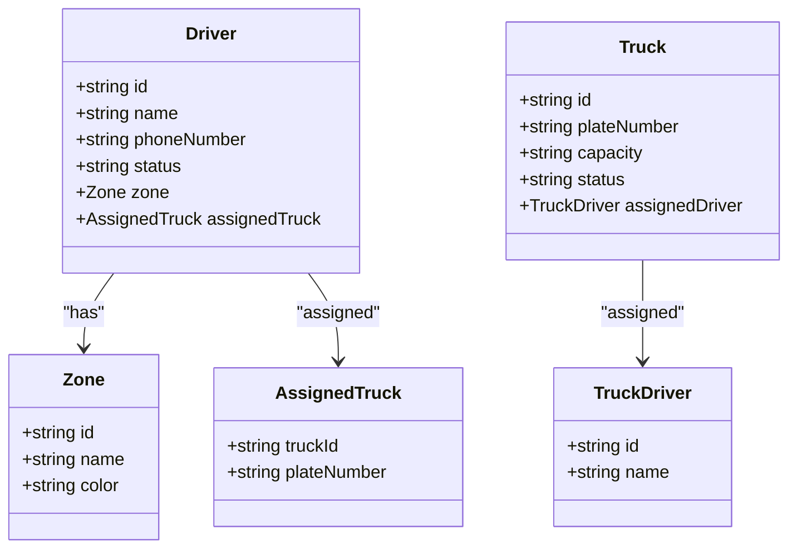
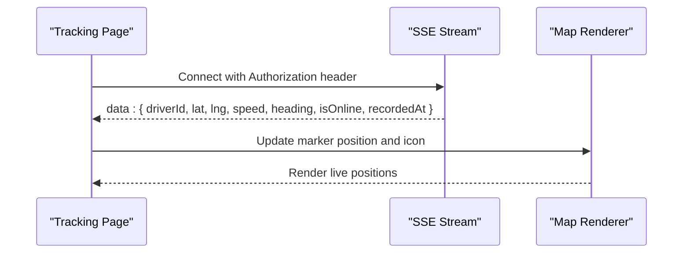
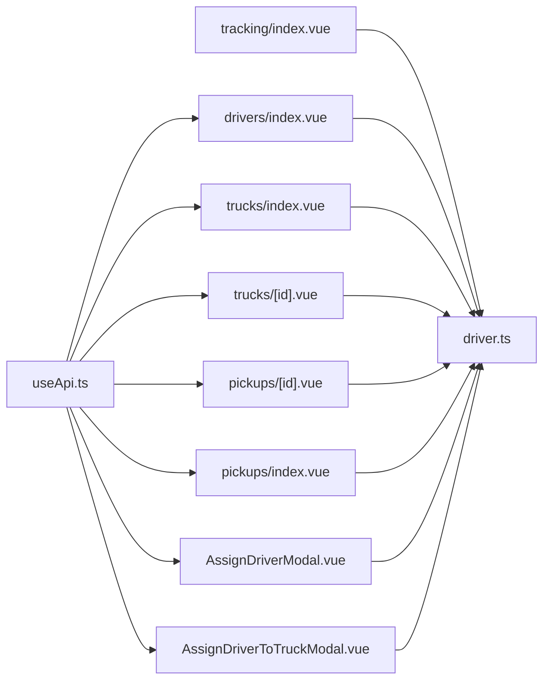

# Driver-Truck Assignments

<cite>
**Referenced Files in This Document**
- [AssignDriverToTruckModal.vue](file://app/components/AssignDriverToTruckModal.vue)
- [AssignDriverModal.vue](file://app/components/AssignDriverModal.vue)
- [drivers/index.vue](file://app/pages/drivers/index.vue)
- [trucks/index.vue](file://app/pages/trucks/index.vue)
- [trucks/[id].vue](file://app/pages/trucks/[id].vue)
- [pickups/[id].vue](file://app/pages/pickups/[id].vue)
- [pickups/index.vue](file://app/pages/pickups/index.vue)
- [tracking/index.vue](file://app/pages/tracking/index.vue)
- [driver.ts](file://app/types/driver.ts)
- [useApi.ts](file://app/composables/useApi.ts)
</cite>

## Table of Contents
1. [Introduction](#introduction)
2. [Project Structure](#project-structure)
3. [Core Components](#core-components)
4. [Architecture Overview](#architecture-overview)
5. [Detailed Component Analysis](#detailed-component-analysis)
6. [Dependency Analysis](#dependency-analysis)
7. [Performance Considerations](#performance-considerations)
8. [Troubleshooting Guide](#troubleshooting-guide)
9. [Conclusion](#conclusion)
10. [Appendices](#appendices)

## Introduction
This document explains the driver-truck assignment system implemented in the console application. It covers:
- Assignment workflows for trucks and pickup requests
- Validation rules, availability checks, and conflict handling
- Temporary reassignments and unassignment flows
- Tracking integration with real-time location monitoring
- Constraints such as driver status, truck capacity, and zone alignment

The goal is to provide both a high-level overview and code-backed details so that operators and developers can understand how assignments are created, updated, and tracked.

## Project Structure
The assignment functionality spans UI components, pages, types, and API utilities:
- Modal components handle user interactions for assigning drivers to trucks or pickups
- Pages orchestrate data fetching, state updates, and modal triggers
- Types define the shape of drivers, trucks, and tracking data
- The API composable centralizes HTTP calls and error handling
- Real-time tracking uses Server-Sent Events (SSE) to update live locations

**Diagram sources**
- [drivers/index.vue:1-149](file://app/pages/drivers/index.vue#L1-L149)
- [trucks/index.vue:1-205](file://app/pages/trucks/index.vue#L1-L205)
- [trucks/[id].vue](file://app/pages/trucks/[id].vue#L1-L573)
- [pickups/[id].vue](file://app/pages/pickups/[id].vue#L381-L432)
- [pickups/index.vue:203-239](file://app/pages/pickups/index.vue#L203-L239)
- [AssignDriverModal.vue:1-222](file://app/components/AssignDriverModal.vue#L1-L222)
- [AssignDriverToTruckModal.vue:1-108](file://app/components/AssignDriverToTruckModal.vue#L1-L108)
- [tracking/index.vue:1-502](file://app/pages/tracking/index.vue#L1-L502)
- [driver.ts:1-106](file://app/types/driver.ts#L1-L106)
- [useApi.ts:1-91](file://app/composables/useApi.ts#L1-L91)

**Section sources**
- [drivers/index.vue:1-149](file://app/pages/drivers/index.vue#L1-L149)
- [trucks/index.vue:1-205](file://app/pages/trucks/index.vue#L1-L205)
- [trucks/[id].vue:1-573](file://app/pages/trucks/[id].vue#L1-L573)
- [pickups/[id].vue:381-432](file://app/pages/pickups/[id].vue#L381-L432)
- [pickups/index.vue:203-239](file://app/pages/pickups/index.vue#L203-L239)
- [AssignDriverModal.vue:1-222](file://app/components/AssignDriverModal.vue#L1-L222)
- [AssignDriverToTruckModal.vue:1-108](file://app/components/AssignDriverToTruckModal.vue#L1-L108)
- [tracking/index.vue:1-502](file://app/pages/tracking/index.vue#L1-L502)
- [driver.ts:1-106](file://app/types/driver.ts#L1-L106)
- [useApi.ts:1-91](file://app/composables/useApi.ts#L1-L91)

## Core Components
- Drivers list page: displays drivers, their assigned truck, zone, and performance metrics; navigates to detail views.
- Trucks list page: lists trucks, shows assigned driver and GPS last seen; provides actions to manage trucks.
- Truck detail page: manages vehicle info, maintenance history, route history, and assigns/reassigns drivers via PATCH endpoint.
- Pickup detail page: supports initial assignment and reassignment using POST and PATCH endpoints respectively.
- Assign Driver Modal: collects driver selection, scheduled date/time, priority, and admin notes for pickup assignment.
- Assign Driver to Truck Modal: selects a driver to assign to a specific truck.
- Live Tracking Page: connects to SSE stream to display online/offline drivers on a map.
- Types: defines Driver, Truck, Zone, AssignedTruck, TruckDriver, and DriverTracking structures.
- useApi: centralized HTTP client with auth headers, error handling, and typed helpers.

**Section sources**
- [drivers/index.vue:1-149](file://app/pages/drivers/index.vue#L1-L149)
- [trucks/index.vue:1-205](file://app/pages/trucks/index.vue#L1-L205)
- [trucks/[id].vue:1-573](file://app/pages/trucks/[id].vue#L1-L573)
- [pickups/[id].vue:381-432](file://app/pages/pickups/[id].vue#L381-L432)
- [pickups/index.vue:203-239](file://app/pages/pickups/index.vue#L203-L239)
- [AssignDriverModal.vue:1-222](file://app/components/AssignDriverModal.vue#L1-L222)
- [AssignDriverToTruckModal.vue:1-108](file://app/components/AssignDriverToTruckModal.vue#L1-L108)
- [tracking/index.vue:1-502](file://app/pages/tracking/index.vue#L1-L502)
- [driver.ts:1-106](file://app/types/driver.ts#L1-L106)
- [useApi.ts:1-91](file://app/composables/useApi.ts#L1-L91)

## Architecture Overview
Assignment operations follow a consistent pattern:
- User initiates assignment from a modal or action button
- Frontend validates inputs locally (e.g., required fields)
- Frontend calls backend endpoints via useApi
- Backend persists assignment and returns updated entity
- Frontend refreshes local state and UI reflects changes
- For pickups, separate endpoints handle initial assignment vs reassignment
- For trucks, a single PATCH endpoint updates the assigned driver

**Diagram sources**
- [pickups/[id].vue:381-432](file://app/pages/pickups/[id].vue#L381-L432)
- [pickups/index.vue:203-239](file://app/pages/pickups/index.vue#L203-L239)
- [AssignDriverModal.vue:1-222](file://app/components/AssignDriverModal.vue#L1-L222)
- [useApi.ts:1-91](file://app/composables/useApi.ts#L1-L91)
- [tracking/index.vue:1-502](file://app/pages/tracking/index.vue#L1-L502)

## Detailed Component Analysis

### Truck Assignment Workflow
- Entry point: Truck detail page opens “Assign Driver” modal.
- Modal behavior: Fetches available drivers, allows selection, emits selected driver ID.
- Assignment call: Truck detail page sends PATCH request to assign driver to truck.
- State refresh: After success, truck detail page reloads truck data to reflect new assignment.

**Diagram sources**
- [trucks/[id].vue:114-129](file://app/pages/trucks/[id].vue#L114-L129)
- [AssignDriverToTruckModal.vue:16-31](file://app/components/AssignDriverToTruckModal.vue#L16-L31)
- [useApi.ts:1-91](file://app/composables/useApi.ts#L1-L91)

**Section sources**
- [trucks/[id].vue:114-129](file://app/pages/trucks/[id].vue#L114-L129)
- [AssignDriverToTruckModal.vue:1-108](file://app/components/AssignDriverToTruckModal.vue#L1-L108)

### Pickup Assignment and Reassignment
- Initial assignment: Uses POST /pickup-requests/admin/{id}/assign with driverId, scheduledDate, timeSlot, priorityLevel, adminNotes.
- Reassignment: Uses PATCH /pickup-requests/admin/{id}/reassign with driverId, scheduledDate, timeSlot, adminNotes (no priorityLevel).
- Time slot mapping: Converts UI labels (“Morning”, “Afternoon”, “Evening”) to backend values (“morning”, “afternoon”, “evening”).
- History tracking: After assignment/reassignment, activity log is refreshed to show audit trail.

**Diagram sources**
- [pickups/[id].vue:381-432](file://app/pages/pickups/[id].vue#L381-L432)
- [pickups/index.vue:203-239](file://app/pages/pickups/index.vue#L203-L239)
- [AssignDriverModal.vue:1-222](file://app/components/AssignDriverModal.vue#L1-L222)

**Section sources**
- [pickups/[id].vue:381-432](file://app/pages/pickups/[id].vue#L381-L432)
- [pickups/index.vue:203-239](file://app/pages/pickups/index.vue#L203-L239)
- [AssignDriverModal.vue:1-222](file://app/components/AssignDriverModal.vue#L1-L222)

### Availability Checking and Filtering
- Driver filtering: The pickup assignment modal filters drivers by status to show only active or online drivers.
- Driver listing: Both truck and pickup assignment modals fetch the full driver list from the admin endpoint and present them for selection.
- Current assignment display: Truck detail modal shows the currently assigned driver when present.

**Diagram sources**
- [driver.ts:1-106](file://app/types/driver.ts#L1-L106)

**Section sources**
- [AssignDriverModal.vue:34-56](file://app/components/AssignDriverModal.vue#L34-L56)
- [AssignDriverToTruckModal.vue:16-31](file://app/components/AssignDriverToTruckModal.vue#L16-L31)
- [driver.ts:1-106](file://app/types/driver.ts#L1-L106)

### Conflict Resolution and Unassignment
- Conflict resolution:
  - For pickups, reassignment replaces the existing driver via PATCH. The frontend determines whether to call assign or reassign based on whether a driver is already set.
  - For trucks, assigning a new driver updates the truck’s assignedDriver field via PATCH. There is no explicit multi-driver conflict model; each truck holds one assigned driver at a time.
- Unassignment:
  - The codebase does not implement an explicit unassign endpoint for trucks or pickups. To unassign, operators would need to clear the assigned field through backend logic not present in the referenced files.

Practical examples:
- Assigning a driver to a pickup:
  - Open pickup detail, click “Assign Driver”, select driver, choose time slot, set priority, add notes, submit. The system calls POST /pickup-requests/admin/{id}/assign and refreshes details and activity log.
- Reassigning a driver:
  - On an already assigned pickup, click “Reassign”, select new driver, adjust schedule if needed, submit. The system calls PATCH /pickup-requests/admin/{id}/reassign and refreshes details and activity log.
- Assigning a driver to a truck:
  - Open truck detail, click “Assign Driver”, select driver, submit. The system calls PATCH /trucks/admin/{truckId}/assign-driver and reloads truck data.

**Section sources**
- [pickups/[id].vue:381-432](file://app/pages/pickups/[id].vue#L381-L432)
- [pickups/index.vue:203-239](file://app/pages/pickups/index.vue#L203-L239)
- [trucks/[id].vue:114-129](file://app/pages/trucks/[id].vue#L114-L129)

### Assignment Constraints
- Driver qualifications:
  - License number and expiry exist in the Driver type but are not enforced in the referenced UI flows.
- Truck capacity limits:
  - Truck.capacity exists in the type but is not validated against load during assignment in the referenced files.
- Zone restrictions:
  - Driver.zone and TruckDriver/AssignedTruck relationships exist, but there is no explicit zone-matching validation in the referenced assignment flows.

Recommendations:
- Add server-side validation to enforce:
  - Active license before assignment
  - Capacity constraints relative to planned loads
  - Zone alignment between driver and truck/pickup

**Section sources**
- [driver.ts:1-106](file://app/types/driver.ts#L1-L106)

### Relationship to Real-Time Tracking
- Live tracking page connects to SSE stream at /tracking/sse/drivers and renders driver positions on a map.
- DriverTracking type includes coordinates, speed, heading, recordedAt, and isOnline flags used to update markers.
- Assignments influence visibility:
  - When a driver is assigned and becomes en_route or active, their tracking data appears in the live view.
  - The tracking layer is decoupled from assignment endpoints; it consumes SSE events independently.

**Diagram sources**
- [tracking/index.vue:251-315](file://app/pages/tracking/index.vue#L251-L315)
- [tracking/index.vue:147-249](file://app/pages/tracking/index.vue#L147-L249)
- [driver.ts:82-91](file://app/types/driver.ts#L82-L91)

**Section sources**
- [tracking/index.vue:1-502](file://app/pages/tracking/index.vue#L1-L502)
- [driver.ts:82-91](file://app/types/driver.ts#L82-L91)

## Dependency Analysis
- UI components depend on useApi for all network calls.
- Pages orchestrate modal interactions and state updates.
- Types ensure consistent shapes across components and API responses.
- Tracking page depends on runtime configuration for API keys and base URLs.

**Diagram sources**
- [useApi.ts:1-91](file://app/composables/useApi.ts#L1-L91)
- [drivers/index.vue:1-149](file://app/pages/drivers/index.vue#L1-L149)
- [trucks/index.vue:1-205](file://app/pages/trucks/index.vue#L1-L205)
- [trucks/[id].vue:1-L573](file://app/pages/trucks/[id].vue#L1-L573)
- [pickups/[id].vue:381-L432](file://app/pages/pickups/[id].vue#L381-L432)
- [pickups/index.vue:203-239](file://app/pages/pickups/index.vue#L203-L239)
- [AssignDriverModal.vue:1-222](file://app/components/AssignDriverModal.vue#L1-L222)
- [AssignDriverToTruckModal.vue:1-108](file://app/components/AssignDriverToTruckModal.vue#L1-L108)
- [tracking/index.vue:1-502](file://app/pages/tracking/index.vue#L1-L502)
- [driver.ts:1-106](file://app/types/driver.ts#L1-L106)

**Section sources**
- [useApi.ts:1-91](file://app/composables/useApi.ts#L1-L91)
- [driver.ts:1-106](file://app/types/driver.ts#L1-L106)

## Performance Considerations
- Minimize redundant API calls:
  - Cache driver lists briefly in modals to avoid repeated fetches within short sessions.
  - Debounce map marker updates if many SSE events arrive rapidly.
- Efficient SSE parsing:
  - Buffer and split lines efficiently; avoid heavy processing per event.
- UI responsiveness:
  - Keep loading states visible during long-running operations like fetching large datasets.
- Error resilience:
  - Centralized error handling in useApi ensures consistent user feedback and session recovery.

[No sources needed since this section provides general guidance]

## Troubleshooting Guide
Common issues and resolutions:
- 401 Unauthorized:
  - The API composable logs out and redirects to login when receiving 401. Ensure tokens are valid and persisted.
- SSE connection failures:
  - Check environment variables for API key and base URL. Verify authentication token presence and network connectivity.
- Assignment errors:
  - Inspect console logs for detailed error messages returned by the backend. Confirm payload structure matches expected fields.
- Missing driver options:
  - Ensure drivers have status ‘active’ or ‘online’ to appear in the pickup assignment dropdown.

**Section sources**
- [useApi.ts:39-44](file://app/composables/useApi.ts#L39-L44)
- [tracking/index.vue:87-145](file://app/pages/tracking/index.vue#L87-L145)
- [AssignDriverModal.vue:34-56](file://app/components/AssignDriverModal.vue#L34-L56)

## Conclusion
The driver-truck assignment system integrates assignment creation, reassignment, and real-time tracking into a cohesive workflow. While core flows are well-implemented, additional validations (license, capacity, zone) should be enforced server-side to strengthen constraints. The separation of concerns between UI, API, and tracking layers promotes maintainability and scalability.

[No sources needed since this section summarizes without analyzing specific files]

## Appendices

### Practical Examples
- Assign driver to pickup:
  - Open pickup detail, click “Assign Driver”, select driver, choose time slot, set priority, add notes, submit. System calls POST /pickup-requests/admin/{id}/assign and refreshes details and activity log.
- Reassign driver:
  - Click “Reassign”, select new driver, adjust schedule if needed, submit. System calls PATCH /pickup-requests/admin/{id}/reassign and refreshes details and activity log.
- Assign driver to truck:
  - Open truck detail, click “Assign Driver”, select driver, submit. System calls PATCH /trucks/admin/{truckId}/assign-driver and reloads truck data.

**Section sources**
- [pickups/[id].vue:381-432](file://app/pages/pickups/[id].vue#L381-L432)
- [pickups/index.vue:203-239](file://app/pages/pickups/index.vue#L203-L239)
- [trucks/[id].vue:114-129](file://app/pages/trucks/[id].vue#L114-L129)