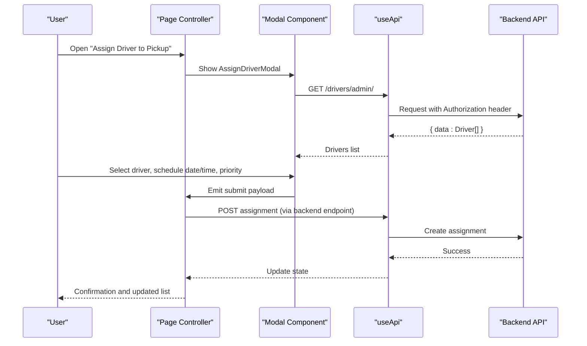
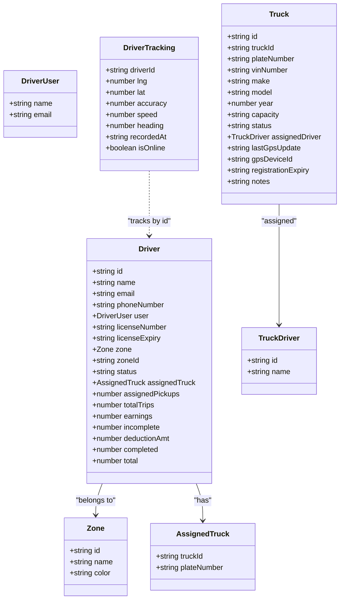
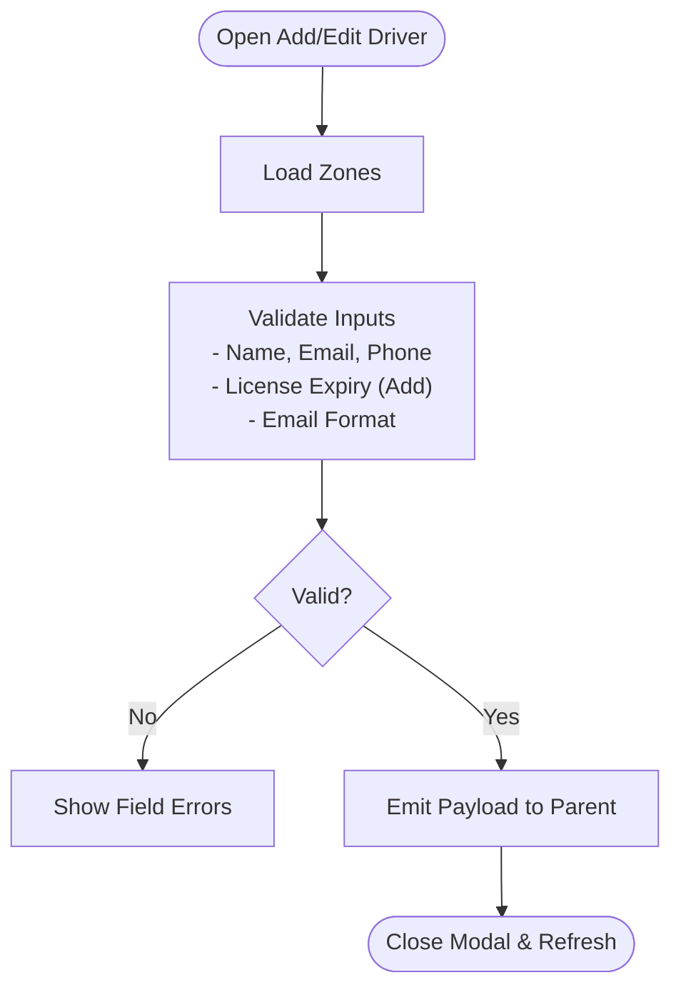
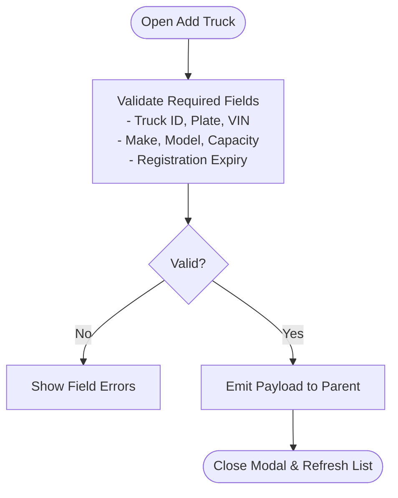
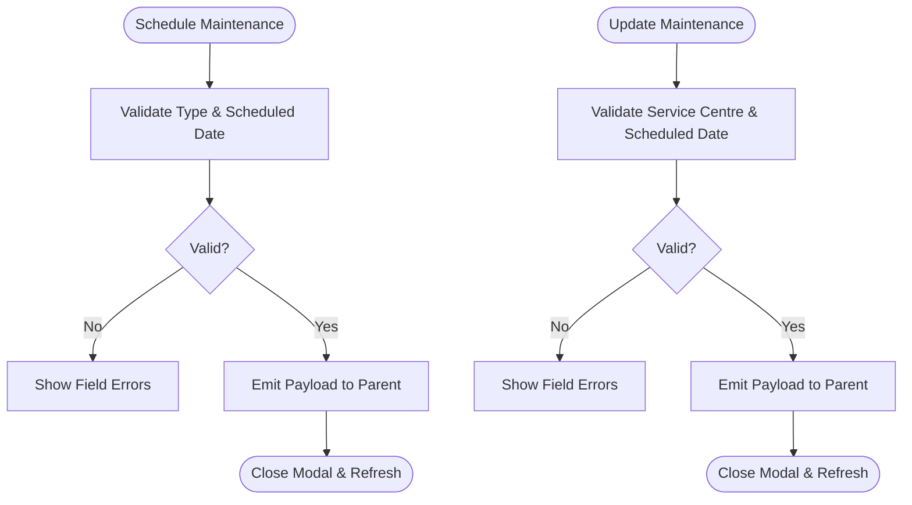
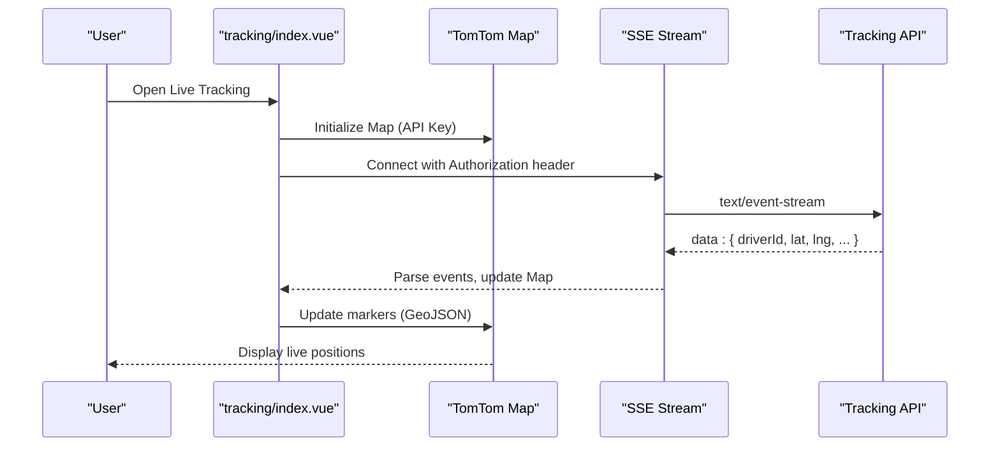
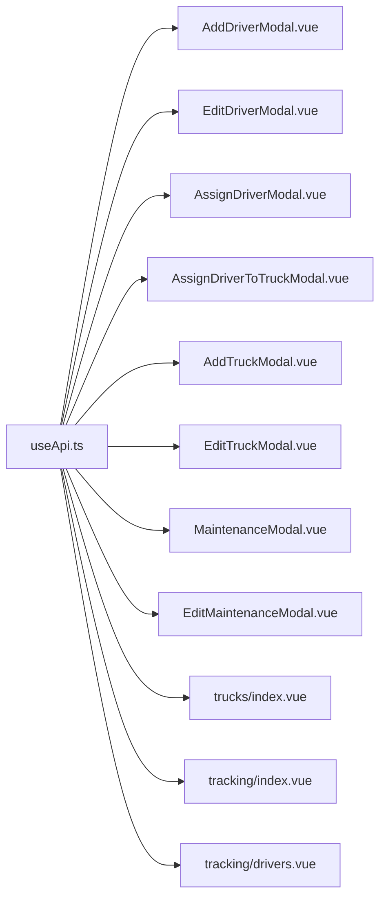

# Fleet Operations Management

<cite>
**Referenced Files in This Document**
- [driver.ts](file://app/types/driver.ts)
- [AddDriverModal.vue](file://app/components/AddDriverModal.vue)
- [EditDriverModal.vue](file://app/components/EditDriverModal.vue)
- [AssignDriverModal.vue](file://app/components/AssignDriverModal.vue)
- [AssignDriverToTruckModal.vue](file://app/components/AssignDriverToTruckModal.vue)
- [AddTruckModal.vue](file://app/components/AddTruckModal.vue)
- [EditTruckModal.vue](file://app/components/EditTruckModal.vue)
- [MaintenanceModal.vue](file://app/components/MaintenanceModal.vue)
- [EditMaintenanceModal.vue](file://app/components/EditMaintenanceModal.vue)
- [trucks/index.vue](file://app/pages/trucks/index.vue)
- [tracking/index.vue](file://app/pages/tracking/index.vue)
- [tracking/drivers.vue](file://app/pages/tracking/drivers.vue)
- [reports/analytics.vue](file://app/pages/reports/analytics.vue)
- [reports/operations.vue](file://app/pages/reports/operations.vue)
- [useApi.ts](file://app/composables/useApi.ts)
</cite>

## Table of Contents
1. [Introduction](#introduction)
2. [Project Structure](#project-structure)
3. [Core Components](#core-components)
4. [Architecture Overview](#architecture-overview)
5. [Detailed Component Analysis](#detailed-component-analysis)
6. [Dependency Analysis](#dependency-analysis)
7. [Performance Considerations](#performance-considerations)
8. [Troubleshooting Guide](#troubleshooting-guide)
9. [Conclusion](#conclusion)
10. [Appendices](#appendices)

## Introduction
This document provides comprehensive documentation for the fleet operations management system, focusing on driver management (scheduling, availability tracking, assignment workflows), truck maintenance records, vehicle tracking, and performance analytics. It explains how drivers and vehicles relate to each other, outlines assignment logic and status tracking across the operational lifecycle, and includes practical examples for managing schedules, updating maintenance records, and monitoring fleet metrics. Data validation rules for driver qualifications and maintenance scheduling are also covered, along with integration details for the real-time tracking system.

## Project Structure
The application is a Vue/Nuxt frontend that manages fleet operations through dedicated pages and reusable modal components:
- Types define core entities such as Driver, Truck, and DriverTracking.
- Pages provide CRUD and dashboards for trucks and live tracking.
- Modals encapsulate user interactions for adding/editing drivers and trucks, assigning drivers to pickups or trucks, and scheduling/updating maintenance.
- A composable centralizes HTTP requests and error handling.

```mermaid
graph TB
subgraph "Types"
T["types/driver.ts"]
end
subgraph "Pages"
PTrucks["pages/trucks/index.vue"]
PTrackIndex["pages/tracking/index.vue"]
PTrackDrivers["pages/tracking/drivers.vue"]
PAnalytics["pages/reports/analytics.vue"]
POps["pages/reports/operations.vue"]
end
subgraph "Components"
CAddDrv["components/AddDriverModal.vue"]
CEditDrv["components/EditDriverModal.vue"]
CAssignPickup["components/AssignDriverModal.vue"]
CAssignTruck["components/AssignDriverToTruckModal.vue"]
CAddTruck["components/AddTruckModal.vue"]
CEditTruck["components/EditTruckModal.vue"]
CMaint["components/MaintenanceModal.vue"]
CEditMaint["components/EditMaintenanceModal.vue"]
end
subgraph "Composables"
UApi["composables/useApi.ts"]
end
T --> PTrucks
T --> PTrackIndex
T --> PTrackDrivers
T --> PAnalytics
T --> POps
CAddDrv --> UApi
CEditDrv --> UApi
CAssignPickup --> UApi
CAssignTruck --> UApi
CAddTruck --> UApi
CEditTruck --> UApi
CMaint --> UApi
CEditMaint --> UApi
PTrucks --> UApi
PTrackIndex --> UApi
PTrackDrivers --> UApi
```

**Diagram sources**
- [driver.ts](file://app/types/driver.ts)
- [trucks/index.vue](file://app/pages/trucks/index.vue)
- [tracking/index.vue](file://app/pages/tracking/index.vue)
- [tracking/drivers.vue](file://app/pages/tracking/drivers.vue)
- [reports/analytics.vue](file://app/pages/reports/analytics.vue)
- [reports/operations.vue](file://app/pages/reports/operations.vue)
- [AddDriverModal.vue](file://app/components/AddDriverModal.vue)
- [EditDriverModal.vue](file://app/components/EditDriverModal.vue)
- [AssignDriverModal.vue](file://app/components/AssignDriverModal.vue)
- [AssignDriverToTruckModal.vue](file://app/components/AssignDriverToTruckModal.vue)
- [AddTruckModal.vue](file://app/components/AddTruckModal.vue)
- [EditTruckModal.vue](file://app/components/EditTruckModal.vue)
- [MaintenanceModal.vue](file://app/components/MaintenanceModal.vue)
- [EditMaintenanceModal.vue](file://app/components/EditMaintenanceModal.vue)
- [useApi.ts](file://app/composables/useApi.ts)

**Section sources**
- [driver.ts](file://app/types/driver.ts)
- [trucks/index.vue](file://app/pages/trucks/index.vue)
- [tracking/index.vue](file://app/pages/tracking/index.vue)
- [tracking/drivers.vue](file://app/pages/tracking/drivers.vue)
- [reports/analytics.vue](file://app/pages/reports/analytics.vue)
- [reports/operations.vue](file://app/pages/reports/operations.vue)
- [AddDriverModal.vue](file://app/components/AddDriverModal.vue)
- [EditDriverModal.vue](file://app/components/EditDriverModal.vue)
- [AssignDriverModal.vue](file://app/components/AssignDriverModal.vue)
- [AssignDriverToTruckModal.vue](file://app/components/AssignDriverToTruckModal.vue)
- [AddTruckModal.vue](file://app/components/AddTruckModal.vue)
- [EditTruckModal.vue](file://app/components/EditTruckModal.vue)
- [MaintenanceModal.vue](file://app/components/MaintenanceModal.vue)
- [EditMaintenanceModal.vue](file://app/components/EditMaintenanceModal.vue)
- [useApi.ts](file://app/composables/useApi.ts)

## Core Components
- Driver management: Add/Edit driver forms with validation; assign drivers to pickup requests; assign drivers to trucks.
- Truck management: Add/Edit trucks with required fields; list and delete trucks; view assigned driver and GPS last seen.
- Maintenance: Schedule maintenance for a truck; update maintenance records including costs and status.
- Real-time tracking: Live map of drivers using Server-Sent Events (SSE) and TomTom Maps SDK.
- Analytics and operations reports: Static charts and tables summarizing business and operational metrics.

Key responsibilities:
- Data models and types are centralized in the types file.
- API calls are routed through a single composable with authentication and error handling.
- UI flows are implemented via modals and page controllers.

**Section sources**
- [driver.ts](file://app/types/driver.ts)
- [useApi.ts](file://app/composables/useApi.ts)
- [AddDriverModal.vue](file://app/components/AddDriverModal.vue)
- [EditDriverModal.vue](file://app/components/EditDriverModal.vue)
- [AssignDriverModal.vue](file://app/components/AssignDriverModal.vue)
- [AssignDriverToTruckModal.vue](file://app/components/AssignDriverToTruckModal.vue)
- [AddTruckModal.vue](file://app/components/AddTruckModal.vue)
- [EditTruckModal.vue](file://app/components/EditTruckModal.vue)
- [MaintenanceModal.vue](file://app/components/MaintenanceModal.vue)
- [EditMaintenanceModal.vue](file://app/components/EditMaintenanceModal.vue)
- [trucks/index.vue](file://app/pages/trucks/index.vue)
- [tracking/index.vue](file://app/pages/tracking/index.vue)
- [tracking/drivers.vue](file://app/pages/tracking/drivers.vue)
- [reports/analytics.vue](file://app/pages/reports/analytics.vue)
- [reports/operations.vue](file://app/pages/reports/operations.vue)

## Architecture Overview
The system follows a component-driven architecture:
- Pages orchestrate data fetching and render lists/maps/charts.
- Modal components encapsulate focused tasks (add/edit/assign/schedule).
- The API composable handles HTTP requests, token injection, and error propagation.
- Real-time tracking uses SSE to stream driver positions into the map layer.

**Diagram sources**
- [AssignDriverModal.vue](file://app/components/AssignDriverModal.vue)
- [useApi.ts](file://app/composables/useApi.ts)
- [trucks/index.vue](file://app/pages/trucks/index.vue)

## Detailed Component Analysis

### Data Model Relationships
The core entities and their relationships are defined in the types module.

**Diagram sources**
- [driver.ts](file://app/types/driver.ts)

**Section sources**
- [driver.ts](file://app/types/driver.ts)

### Driver Management: Scheduling, Availability, Assignment Workflows
- Adding a driver:
  - Collects personal info, license details, zone, and status.
  - Validates required fields and email format before submission.
  - Emits a structured payload to the parent controller for persistence.
- Editing a driver:
  - Pre-populates form from existing driver data.
  - Loads available zones and validates inputs similarly to add flow.
- Assigning a driver to a pickup request:
  - Fetches active/online drivers from the backend.
  - Allows selection of scheduled date/time slot and priority.
  - Emits assignment payload for backend processing.
- Assigning a driver to a truck:
  - Lists all drivers and allows selection to associate with a specific truck.

Validation highlights:
- Required fields include names, email, phone, and license expiry (for add).
- Email must match a standard pattern.
- Status options include active, on_leave, inactive; online is used for availability filtering during assignment.

**Diagram sources**
- [AddDriverModal.vue](file://app/components/AddDriverModal.vue)
- [EditDriverModal.vue](file://app/components/EditDriverModal.vue)

**Section sources**
- [AddDriverModal.vue](file://app/components/AddDriverModal.vue)
- [EditDriverModal.vue](file://app/components/EditDriverModal.vue)
- [AssignDriverModal.vue](file://app/components/AssignDriverModal.vue)
- [AssignDriverToTruckModal.vue](file://app/components/AssignDriverToTruckModal.vue)

### Truck Management: Records, Status, and Assignments
- Adding a truck:
  - Requires truck ID, plate number, VIN, make, model, capacity, and registration expiry.
  - Optional fields include GPS device ID and notes.
  - Status defaults to active but can be set to maintenance or inactive.
- Editing a truck:
  - Updates editable fields while keeping truck ID read-only.
  - Enforces required fields similar to add flow.
- Listing trucks:
  - Displays truck ID, plate number, capacity, assigned driver, status, and last GPS update.
  - Supports deletion with confirmation.

Status tracking:
- Active, maintenance, inactive states are consistently represented and styled.

**Diagram sources**
- [AddTruckModal.vue](file://app/components/AddTruckModal.vue)
- [EditTruckModal.vue](file://app/components/EditTruckModal.vue)
- [trucks/index.vue](file://app/pages/trucks/index.vue)

**Section sources**
- [AddTruckModal.vue](file://app/components/AddTruckModal.vue)
- [EditTruckModal.vue](file://app/components/EditTruckModal.vue)
- [trucks/index.vue](file://app/pages/trucks/index.vue)

### Maintenance Records: Scheduling and Updates
- Scheduling maintenance:
  - Select maintenance type, technician/service center, scheduled date, estimated cost, and optional notes.
  - Validates type and scheduled date.
- Updating maintenance:
  - Edit service centre, scheduled/completed dates, estimated/actual costs, status, and notes.
  - Status options include scheduled, in_progress, completed, cancelled.

**Diagram sources**
- [MaintenanceModal.vue](file://app/components/MaintenanceModal.vue)
- [EditMaintenanceModal.vue](file://app/components/EditMaintenanceModal.vue)

**Section sources**
- [MaintenanceModal.vue](file://app/components/MaintenanceModal.vue)
- [EditMaintenanceModal.vue](file://app/components/EditMaintenanceModal.vue)

### Real-Time Tracking Integration
- Map initialization:
  - Uses runtime configuration for the TomTom API key.
  - Dynamically imports the TomTom SDK and initializes a map instance.
  - Adds custom truck icons or falls back to colored circles if icons fail to load.
- SSE connection:
  - Connects to an authenticated SSE endpoint for driver locations.
  - Parses event stream lines, updates a Map of driver tracking data, and refreshes markers.
- Marker rendering:
  - Converts tracking data to GeoJSON features.
  - Applies symbol or circle layers based on icon availability.
  - Provides click/hover interactions and auto-fit bounds when data exists.

**Diagram sources**
- [tracking/index.vue](file://app/pages/tracking/index.vue)
- [tracking/drivers.vue](file://app/pages/tracking/drivers.vue)

**Section sources**
- [tracking/index.vue](file://app/pages/tracking/index.vue)
- [tracking/drivers.vue](file://app/pages/tracking/drivers.vue)

### Performance Analytics and Operations Reports
- Business analytics:
  - Stat cards for deposits, revenue, paid customers.
  - Revenue breakdown by payment method.
  - SVG-based line and bar charts for trends and frequencies.
- Operations analytics:
  - KPIs for pickups, completion rate, active trucks, average pickup time.
  - Charts for monthly pickup volume and completion rate trend.
  - Driver performance table with pick count, completion %, average time, zone, and status.

These pages use static datasets for demonstration and export buttons for reporting.

**Section sources**
- [reports/analytics.vue](file://app/pages/reports/analytics.vue)
- [reports/operations.vue](file://app/pages/reports/operations.vue)

## Dependency Analysis
- Centralized API composable:
  - Injects Authorization headers when tokens exist.
  - Normalizes success responses (200, 201, 204) and throws errors otherwise.
  - Handles 401 by logging out and redirecting to login.
- Page and component dependencies:
  - All CRUD and assignment flows call endpoints via the composable.
  - Real-time tracking depends on runtime config and SSE stream.

**Diagram sources**
- [useApi.ts](file://app/composables/useApi.ts)
- [AddDriverModal.vue](file://app/components/AddDriverModal.vue)
- [EditDriverModal.vue](file://app/components/EditDriverModal.vue)
- [AssignDriverModal.vue](file://app/components/AssignDriverModal.vue)
- [AssignDriverToTruckModal.vue](file://app/components/AssignDriverToTruckModal.vue)
- [AddTruckModal.vue](file://app/components/AddTruckModal.vue)
- [EditTruckModal.vue](file://app/components/EditTruckModal.vue)
- [MaintenanceModal.vue](file://app/components/MaintenanceModal.vue)
- [EditMaintenanceModal.vue](file://app/components/EditMaintenanceModal.vue)
- [trucks/index.vue](file://app/pages/trucks/index.vue)
- [tracking/index.vue](file://app/pages/tracking/index.vue)
- [tracking/drivers.vue](file://app/pages/tracking/drivers.vue)

**Section sources**
- [useApi.ts](file://app/composables/useApi.ts)

## Performance Considerations
- Minimize re-renders:
  - Use computed properties for derived counts (e.g., online/offline drivers).
  - Avoid unnecessary DOM mutations by batching marker updates.
- Efficient streaming:
  - Buffer and parse SSE lines efficiently; only update when style is loaded.
  - Rebuild GeoJSON source and layers only when data changes.
- Icon loading:
  - Cache generated icons and handle failures gracefully with fallback shapes.
- Validation at the UI level:
  - Early client-side validation reduces failed network requests.

[No sources needed since this section provides general guidance]

## Troubleshooting Guide
Common issues and resolutions:
- Missing TomTom API key:
  - Ensure environment variable is configured; the map will show an error message if absent.
- SSE connection failures:
  - Check authentication token presence; verify server endpoint availability.
  - Use reconnect button to re-establish the stream.
- 401 Unauthorized:
  - The API composable logs out and redirects to login automatically.
- Validation errors:
  - Review field-level error messages in modals and correct inputs accordingly.

**Section sources**
- [tracking/index.vue](file://app/pages/tracking/index.vue)
- [tracking/drivers.vue](file://app/pages/tracking/drivers.vue)
- [useApi.ts](file://app/composables/useApi.ts)
- [AddDriverModal.vue](file://app/components/AddDriverModal.vue)
- [EditDriverModal.vue](file://app/components/EditDriverModal.vue)
- [AddTruckModal.vue](file://app/components/AddTruckModal.vue)
- [EditTruckModal.vue](file://app/components/EditTruckModal.vue)
- [MaintenanceModal.vue](file://app/components/MaintenanceModal.vue)
- [EditMaintenanceModal.vue](file://app/components/EditMaintenanceModal.vue)

## Conclusion
The fleet operations management system provides robust tools for managing drivers and trucks, scheduling assignments and maintenance, and monitoring real-time locations and performance metrics. Clear data models, consistent validation, and a centralized API composable ensure reliable interactions with the backend. The real-time tracking integration offers live visibility into driver movements, while analytics and operations reports support informed decision-making.

[No sources needed since this section summarizes without analyzing specific files]

## Appendices

### Practical Examples

- Managing driver schedules:
  - Open the assignment modal, select an available driver, choose a scheduled date and time slot, set priority, and submit. The modal emits a payload containing driver, scheduledDate, scheduledTime, priority, and admin notes.
  - Reference: [AssignDriverModal.vue](file://app/components/AssignDriverModal.vue)

- Updating truck maintenance records:
  - Open the maintenance modal, select type, enter technician/service centre, scheduled date, estimated cost, and notes. On update, edit service centre, scheduled/completed dates, costs, status, and notes.
  - References: [MaintenanceModal.vue](file://app/components/MaintenanceModal.vue), [EditMaintenanceModal.vue](file://app/components/EditMaintenanceModal.vue)

- Monitoring fleet performance metrics:
  - View operations analytics for pickup volume, completion rate, active trucks, and average pickup time. Review driver performance table for detailed metrics.
  - References: [reports/operations.vue](file://app/pages/reports/operations.vue), [reports/analytics.vue](file://app/pages/reports/analytics.vue)

- Integrating with real-time tracking:
  - Ensure the TomTom API key is configured. Open the live tracking page to connect to the SSE stream and visualize driver positions on the map.
  - References: [tracking/index.vue](file://app/pages/tracking/index.vue), [tracking/drivers.vue](file://app/pages/tracking/drivers.vue)

**Section sources**
- [AssignDriverModal.vue](file://app/components/AssignDriverModal.vue)
- [MaintenanceModal.vue](file://app/components/MaintenanceModal.vue)
- [EditMaintenanceModal.vue](file://app/components/EditMaintenanceModal.vue)
- [reports/operations.vue](file://app/pages/reports/operations.vue)
- [reports/analytics.vue](file://app/pages/reports/analytics.vue)
- [tracking/index.vue](file://app/pages/tracking/index.vue)
- [tracking/drivers.vue](file://app/pages/tracking/drivers.vue)