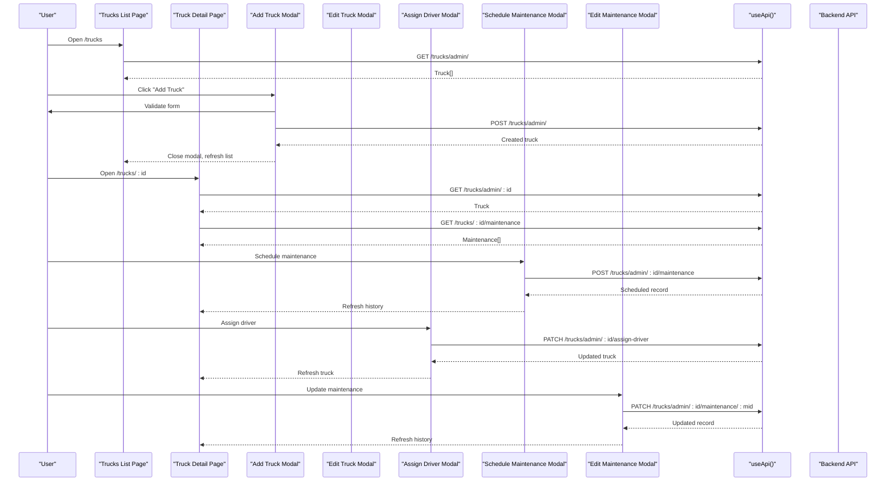
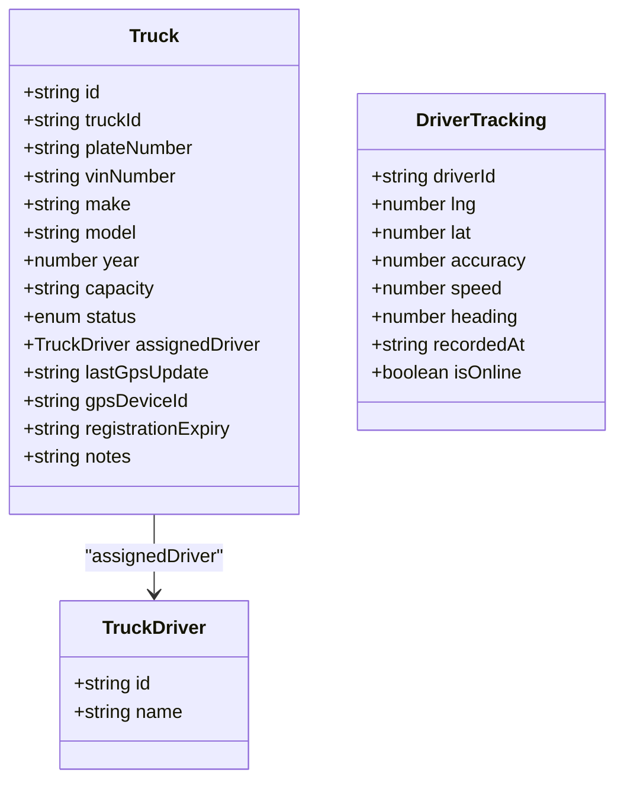
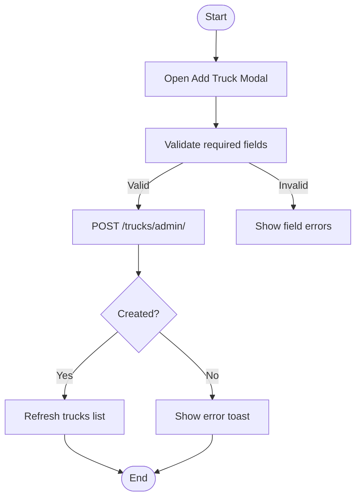
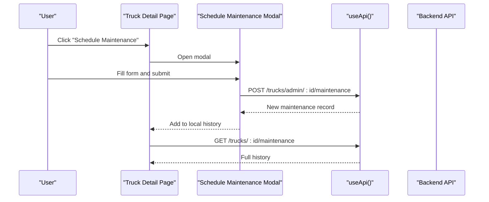
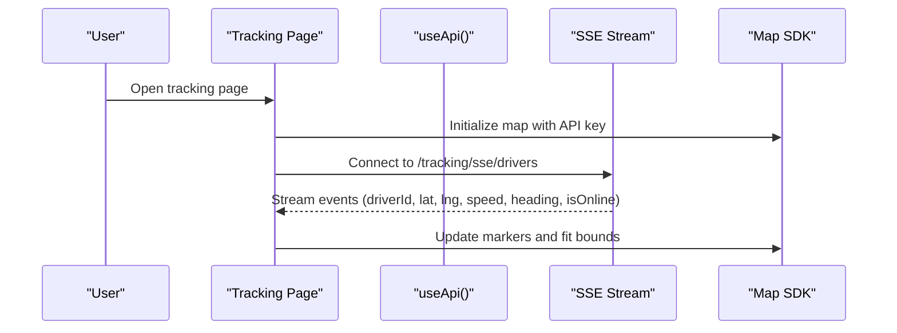
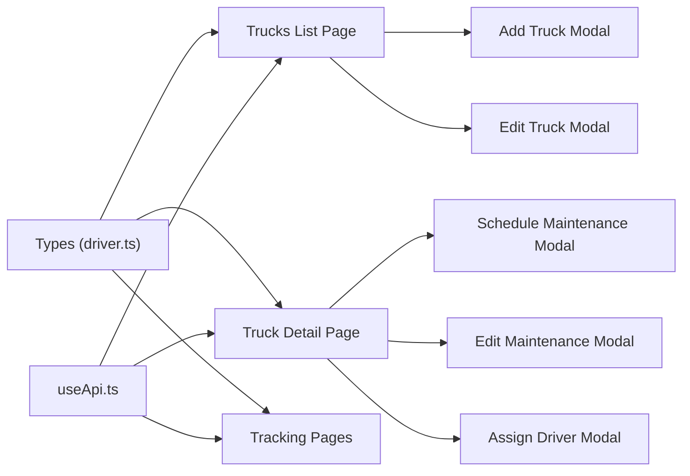

# Truck Management

<cite>
**Referenced Files in This Document**
- [index.vue](file://app/pages/trucks/index.vue)
- [id.vue](file://app/pages/trucks/[id].vue)
- [AddTruckModal.vue](file://app/components/AddTruckModal.vue)
- [EditTruckModal.vue](file://app/components/EditTruckModal.vue)
- [AssignDriverToTruckModal.vue](file://app/components/AssignDriverToTruckModal.vue)
- [MaintenanceModal.vue](file://app/components/MaintenanceModal.vue)
- [EditMaintenanceModal.vue](file://app/components/EditMaintenanceModal.vue)
- [driver.ts](file://app/types/driver.ts)
- [useApi.ts](file://app/composables/useApi.ts)
- [tracking index.vue](file://app/pages/tracking/index.vue)
- [tracking drivers.vue](file://app/pages/tracking/drivers.vue)
- [operations.vue](file://app/pages/reports/operations.vue)
</cite>

## Table of Contents
1. [Introduction](#introduction)
2. [Project Structure](#project-structure)
3. [Core Components](#core-components)
4. [Architecture Overview](#architecture-overview)
5. [Detailed Component Analysis](#detailed-component-analysis)
6. [Dependency Analysis](#dependency-analysis)
7. [Performance Considerations](#performance-considerations)
8. [Troubleshooting Guide](#troubleshooting-guide)
9. [Conclusion](#conclusion)
10. [Appendices](#appendices)

## Introduction
This document explains the truck management system implemented in the console application. It covers the full lifecycle of a truck: registration, assignment to drivers, maintenance scheduling and updates, decommissioning (deletion), vehicle tracking integration, and operational reporting. It also provides practical examples for adding trucks, scheduling maintenance, tracking vehicles, and generating reports. Where applicable, it highlights alerting and preventive maintenance considerations based on available fields and UI flows.

## Project Structure
The truck management feature is primarily implemented as Nuxt pages and Vue components that interact with backend APIs via a shared HTTP composable. Key areas include:
- Truck listing and CRUD operations
- Truck detail view with tabs for vehicle details, maintenance history, and route history
- Maintenance scheduling and editing
- Driver assignment to trucks
- Real-time driver tracking map
- Operations analytics page

```mermaid
graph TB
subgraph "Truck Management"
TList["Trucks List Page<br/>app/pages/trucks/index.vue"]
TDetail["Truck Detail Page<br/>app/pages/trucks/[id].vue"]
AddT["Add Truck Modal<br/>app/components/AddTruckModal.vue"]
EditT["Edit Truck Modal<br/>app/components/EditTruckModal.vue"]
AssignD["Assign Driver Modal<br/>app/components/AssignDriverToTruckModal.vue"]
SchedM["Schedule Maintenance Modal<br/>app/components/MaintenanceModal.vue"]
EditM["Edit Maintenance Modal<br/>app/components/EditMaintenanceModal.vue"]
end
subgraph "Tracking & Reports"
TrackIdx["Live Tracking Index<br/>app/pages/tracking/index.vue"]
TrackDrv["Driver Tracking Page<br/>app/pages/tracking/drivers.vue"]
OpsRep["Operations Analytics<br/>app/pages/reports/operations.vue"]
end
subgraph "Shared"
Types["Types (Truck, Driver, etc.)<br/>app/types/driver.ts"]
Api["HTTP Composable<br/>app/composables/useApi.ts"]
end
TList --> AddT
TList --> EditT
TList --> AssignD
TDetail --> SchedM
TDetail --> EditM
TDetail --> AssignD
TList --> Api
TDetail --> Api
TrackIdx --> Api
TrackDrv --> Api
OpsRep -.-> Api
TList --> Types
TDetail --> Types
TrackIdx --> Types
TrackDrv --> Types
```

**Diagram sources**
- [index.vue:1-205](file://app/pages/trucks/index.vue#L1-L205)
- [id.vue:1-573](file://app/pages/trucks/[id].vue#L1-L573)
- [AddTruckModal.vue:1-238](file://app/components/AddTruckModal.vue#L1-L238)
- [EditTruckModal.vue:1-250](file://app/components/EditTruckModal.vue#L1-L250)
- [AssignDriverToTruckModal.vue:1-108](file://app/components/AssignDriverToTruckModal.vue#L1-L108)
- [MaintenanceModal.vue:1-169](file://app/components/MaintenanceModal.vue#L1-L169)
- [EditMaintenanceModal.vue:1-198](file://app/components/EditMaintenanceModal.vue#L1-L198)
- [tracking index.vue:1-502](file://app/pages/tracking/index.vue#L1-L502)
- [tracking drivers.vue:1-556](file://app/pages/tracking/drivers.vue#L1-L556)
- [operations.vue:1-164](file://app/pages/reports/operations.vue#L1-L164)
- [driver.ts:1-106](file://app/types/driver.ts#L1-L106)
- [useApi.ts:1-91](file://app/composables/useApi.ts#L1-L91)

**Section sources**
- [index.vue:1-205](file://app/pages/trucks/index.vue#L1-L205)
- [id.vue:1-573](file://app/pages/trucks/[id].vue#L1-L573)
- [driver.ts:1-106](file://app/types/driver.ts#L1-L106)
- [useApi.ts:1-91](file://app/composables/useApi.ts#L1-L91)

## Core Components
- Trucks list page: fetches all trucks, supports add/delete, shows status badges, and navigates to detail view.
- Truck detail page: displays vehicle information, GPS/tracking fields, maintenance history, and route history; supports edit, assign driver, schedule/update maintenance, and delete.
- Modals: Add/Edit Truck, Assign Driver, Schedule Maintenance, Update Maintenance.
- Shared types: Truck, CreateTruckPayload, Driver, DriverTracking.
- API composable: centralized HTTP client with auth header injection and error handling.

**Section sources**
- [index.vue:1-205](file://app/pages/trucks/index.vue#L1-L205)
- [id.vue:1-573](file://app/pages/trucks/[id].vue#L1-L573)
- [AddTruckModal.vue:1-238](file://app/components/AddTruckModal.vue#L1-L238)
- [EditTruckModal.vue:1-250](file://app/components/EditTruckModal.vue#L1-L250)
- [AssignDriverToTruckModal.vue:1-108](file://app/components/AssignDriverToTruckModal.vue#L1-L108)
- [MaintenanceModal.vue:1-169](file://app/components/MaintenanceModal.vue#L1-L169)
- [EditMaintenanceModal.vue:1-198](file://app/components/EditMaintenanceModal.vue#L1-L198)
- [driver.ts:1-106](file://app/types/driver.ts#L1-L106)
- [useApi.ts:1-91](file://app/composables/useApi.ts#L1-L91)

## Architecture Overview
The frontend follows a page + modal architecture. Pages orchestrate data fetching and user actions, while modals encapsulate forms and validation. All network calls go through a single composable that attaches authentication and centralizes error handling.

**Diagram sources**
- [index.vue:1-205](file://app/pages/trucks/index.vue#L1-L205)
- [id.vue:1-573](file://app/pages/trucks/[id].vue#L1-L573)
- [AddTruckModal.vue:1-238](file://app/components/AddTruckModal.vue#L1-L238)
- [EditTruckModal.vue:1-250](file://app/components/EditTruckModal.vue#L1-L250)
- [AssignDriverToTruckModal.vue:1-108](file://app/components/AssignDriverToTruckModal.vue#L1-L108)
- [MaintenanceModal.vue:1-169](file://app/components/MaintenanceModal.vue#L1-L169)
- [EditMaintenanceModal.vue:1-198](file://app/components/EditMaintenanceModal.vue#L1-L198)
- [useApi.ts:1-91](file://app/composables/useApi.ts#L1-L91)

## Detailed Component Analysis

### Data Model: Truck and Related Entities
The core entity is Truck, with optional fields for GPS device ID, registration expiry, and notes. A Truck can be assigned to a Driver. The type definitions also include a DriverTracking model used by the live tracking pages.

**Diagram sources**
- [driver.ts:60-91](file://app/types/driver.ts#L60-L91)

**Section sources**
- [driver.ts:1-106](file://app/types/driver.ts#L1-L106)

### Truck Lifecycle: Registration, Assignment, Decommissioning
- Registration: Add a new truck via the Add Truck modal; validated fields include truck ID, plate number, VIN, make, model, capacity, and registration expiry. Submitting triggers a POST to create the truck and refreshes the list.
- Assignment: From the truck detail page, open Assign Driver modal, select a driver, and submit. The system assigns the driver to the truck and refreshes the truck data.
- Decommissioning: Delete a truck from either the list or detail page using confirmation dialogs. Deletion removes the truck from the fleet.

**Diagram sources**
- [AddTruckModal.vue:1-238](file://app/components/AddTruckModal.vue#L1-L238)
- [index.vue:1-205](file://app/pages/trucks/index.vue#L1-L205)

**Section sources**
- [index.vue:1-205](file://app/pages/trucks/index.vue#L1-L205)
- [AddTruckModal.vue:1-238](file://app/components/AddTruckModal.vue#L1-L238)
- [EditTruckModal.vue:1-250](file://app/components/EditTruckModal.vue#L1-L250)
- [AssignDriverToTruckModal.vue:1-108](file://app/components/AssignDriverToTruckModal.vue#L1-L108)

### Vehicle Details and Status
The truck detail page shows:
- Vehicle information (VIN, make/model, year, plate, capacity)
- GPS and tracking fields (device ID, last update, current location, registration expiry)
- Operational stats (last driver, total pickups, last service, next service due)
- Tabs for maintenance history and route history

Status badges reflect active, maintenance, or inactive states.

**Section sources**
- [id.vue:1-573](file://app/pages/trucks/[id].vue#L1-L573)

### Maintenance Scheduling and Record Management
- Schedule maintenance: Use the Schedule Maintenance modal to set type, technician/service centre, scheduled date, estimated cost, and notes. Submission posts a new maintenance record and appends it to the local history.
- Update maintenance: Edit existing records to update service centre, dates, costs, status, and notes. Updates are persisted via PATCH and reflected immediately in the table.
- Cost display logic: For completed records, actual cost is shown; otherwise, estimated cost is displayed.

**Diagram sources**
- [id.vue:1-573](file://app/pages/trucks/[id].vue#L1-L573)
- [MaintenanceModal.vue:1-169](file://app/components/MaintenanceModal.vue#L1-L169)
- [EditMaintenanceModal.vue:1-198](file://app/components/EditMaintenanceModal.vue#L1-L198)
- [useApi.ts:1-91](file://app/composables/useApi.ts#L1-L91)

**Section sources**
- [id.vue:1-573](file://app/pages/trucks/[id].vue#L1-L573)
- [MaintenanceModal.vue:1-169](file://app/components/MaintenanceModal.vue#L1-L169)
- [EditMaintenanceModal.vue:1-198](file://app/components/EditMaintenanceModal.vue#L1-L198)

### Fleet Tracking Integration
The tracking pages integrate with a real-time SSE stream to visualize driver locations on a TomTom-based map. While the primary focus is driver tracking, the same infrastructure can support truck-level telemetry if the backend exposes corresponding endpoints. The tracking pages:
- Initialize a map with an API key
- Connect to an SSE endpoint for live updates
- Render markers for online/offline entities
- Provide zoom controls and popups with telemetry details

**Diagram sources**
- [tracking index.vue:1-502](file://app/pages/tracking/index.vue#L1-L502)
- [tracking drivers.vue:1-556](file://app/pages/tracking/drivers.vue#L1-L556)

**Section sources**
- [tracking index.vue:1-502](file://app/pages/tracking/index.vue#L1-L502)
- [tracking drivers.vue:1-556](file://app/pages/tracking/drivers.vue#L1-L556)

### Reporting and Performance Monitoring
The operations analytics page presents high-level metrics such as total pickups, completion rate, active trucks, and average pickup time. It includes charts for monthly volume and completion trends, plus a driver performance table. These views provide operational insights useful for monitoring fleet health and efficiency.

**Section sources**
- [operations.vue:1-164](file://app/pages/reports/operations.vue#L1-L164)

## Dependency Analysis
- Pages depend on the useApi composable for all HTTP interactions.
- Modals emit events to parent pages which handle persistence and state updates.
- Types define contracts for Truck, Driver, and DriverTracking, ensuring consistent data shapes across components.
- Tracking pages depend on runtime configuration for the mapping API key and connect to SSE endpoints.

**Diagram sources**
- [driver.ts:1-106](file://app/types/driver.ts#L1-L106)
- [useApi.ts:1-91](file://app/composables/useApi.ts#L1-L91)
- [index.vue:1-205](file://app/pages/trucks/index.vue#L1-L205)
- [id.vue:1-573](file://app/pages/trucks/[id].vue#L1-L573)
- [AddTruckModal.vue:1-238](file://app/components/AddTruckModal.vue#L1-L238)
- [EditTruckModal.vue:1-250](file://app/components/EditTruckModal.vue#L1-L250)
- [AssignDriverToTruckModal.vue:1-108](file://app/components/AssignDriverToTruckModal.vue#L1-L108)
- [MaintenanceModal.vue:1-169](file://app/components/MaintenanceModal.vue#L1-L169)
- [EditMaintenanceModal.vue:1-198](file://app/components/EditMaintenanceModal.vue#L1-L198)
- [tracking index.vue:1-502](file://app/pages/tracking/index.vue#L1-L502)
- [tracking drivers.vue:1-556](file://app/pages/tracking/drivers.vue#L1-L556)

**Section sources**
- [driver.ts:1-106](file://app/types/driver.ts#L1-L106)
- [useApi.ts:1-91](file://app/composables/useApi.ts#L1-L91)
- [index.vue:1-205](file://app/pages/trucks/index.vue#L1-L205)
- [id.vue:1-573](file://app/pages/trucks/[id].vue#L1-L573)

## Performance Considerations
- Minimize re-renders by updating only necessary local state after successful mutations.
- Debounce heavy computations when rendering large maintenance histories.
- Ensure SSE connections are properly disconnected on component unmount to avoid memory leaks.
- Cache frequently accessed reference data (e.g., driver lists) where appropriate.

[No sources needed since this section provides general guidance]

## Troubleshooting Guide
Common issues and resolutions:
- Authentication failures: If the API returns 401, the composable logs out and redirects to login. Verify token presence and validity.
- Map initialization errors: Ensure the mapping API key is configured and the container element exists before initializing the map.
- SSE connection problems: Check network connectivity and server availability; use the reconnect button to retry.
- Validation errors: Required fields must be filled before submission; check modal-specific validations.

**Section sources**
- [useApi.ts:1-91](file://app/composables/useApi.ts#L1-L91)
- [tracking index.vue:1-502](file://app/pages/tracking/index.vue#L1-L502)
- [tracking drivers.vue:1-556](file://app/pages/tracking/drivers.vue#L1-L556)
- [AddTruckModal.vue:1-238](file://app/components/AddTruckModal.vue#L1-L238)
- [EditTruckModal.vue:1-250](file://app/components/EditTruckModal.vue#L1-L250)
- [MaintenanceModal.vue:1-169](file://app/components/MaintenanceModal.vue#L1-L169)
- [EditMaintenanceModal.vue:1-198](file://app/components/EditMaintenanceModal.vue#L1-L198)

## Conclusion
The truck management system provides comprehensive capabilities for registering and managing trucks, assigning drivers, scheduling and updating maintenance, and viewing operational metrics. Real-time tracking integrates with a map SDK and SSE streams to visualize fleet activity. The modular design with clear separation between pages and modals, combined with a centralized API composable and typed models, ensures maintainability and extensibility.

[No sources needed since this section summarizes without analyzing specific files]

## Appendices

### Practical Examples

- Adding a new truck:
  - Navigate to the trucks list page and click “Add Truck”.
  - Fill required fields (truck ID, plate number, VIN, make, model, capacity, registration expiry).
  - Submit to create the truck; the list refreshes automatically.

- Scheduling maintenance:
  - Open a truck’s detail page and click “Schedule Maintenance”.
  - Select maintenance type, enter technician/service centre, scheduled date, and optional estimated cost and notes.
  - Submit to create a maintenance record; it appears in the maintenance history tab.

- Tracking vehicle status:
  - View the truck detail page to see status, last GPS update, and current location fields.
  - Use the live tracking pages to monitor driver positions in real time.

- Generating maintenance reports:
  - Use the maintenance history table to review past and upcoming maintenance tasks.
  - Export or analyze operational metrics from the operations analytics page for broader insights.

[No sources needed since this section provides general guidance]