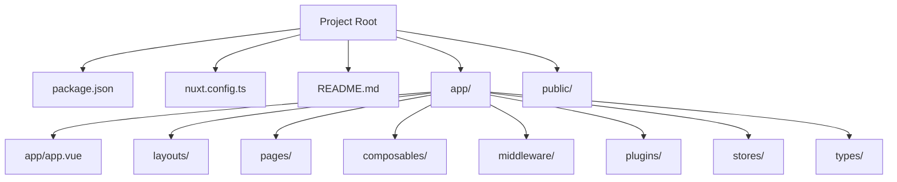
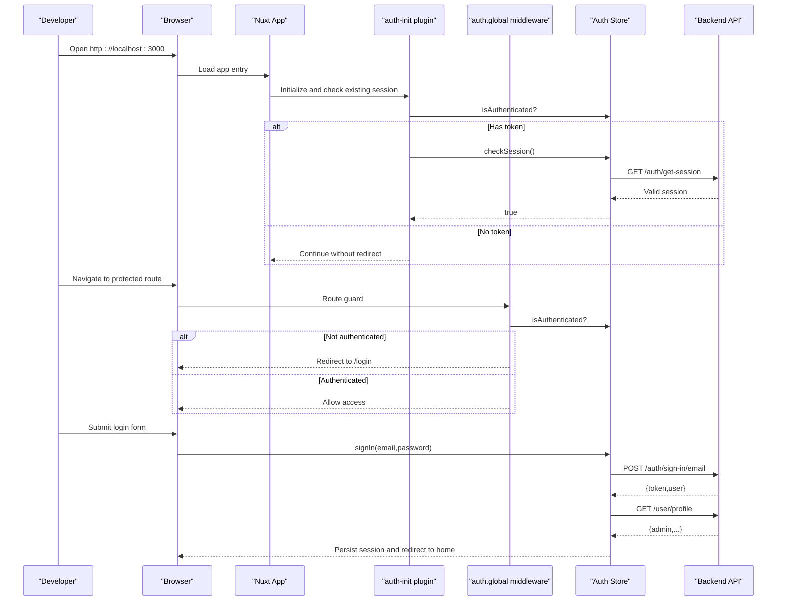
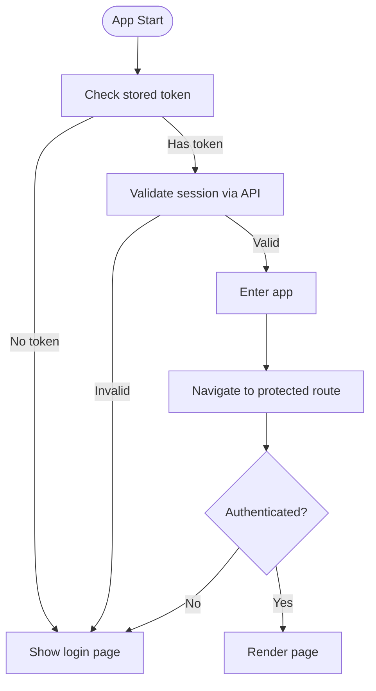
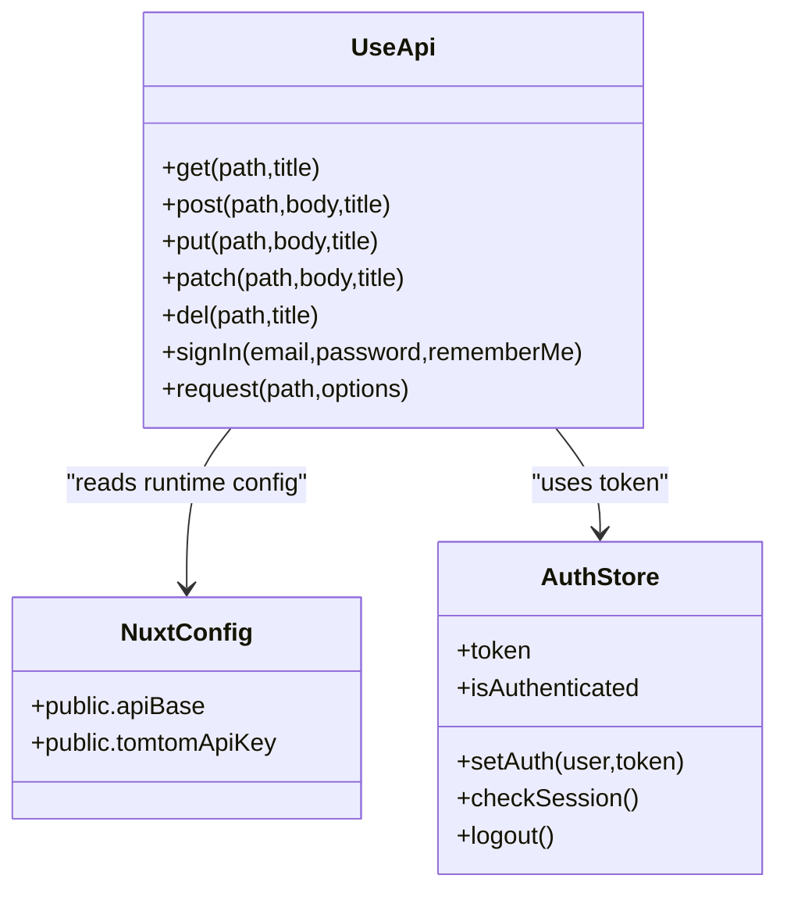

# Getting Started

<cite>
**Referenced Files in This Document**
- [README.md](file://README.md)
- [package.json](file://package.json)
- [nuxt.config.ts](file://nuxt.config.ts)
- [app/app.vue](file://app/app.vue)
- [app/layouts/dashboard.vue](file://app/layouts/dashboard.vue)
- [app/pages/login.vue](file://app/pages/login.vue)
- [app/middleware/auth.global.ts](file://app/middleware/auth.global.ts)
- [app/plugins/auth-init.client.ts](file://app/plugins/auth-init.client.ts)
- [app/stores/auth.ts](file://app/stores/auth.ts)
- [app/composables/useApi.ts](file://app/composables/useApi.ts)
- [app/types/auth.ts](file://app/types/auth.ts)
</cite>

## Table of Contents
1. Introduction
2. Project Structure
3. Core Components
4. Architecture Overview
5. Detailed Component Analysis
6. Dependency Analysis
7. Performance Considerations
8. Troubleshooting Guide
9. Conclusion

## Introduction
This guide helps you install, configure, and run the Lacarte Atlas Console locally. It covers prerequisites, installation via npm/pnpm/yarn/bun, development server setup, first-run configuration (including environment variables), basic navigation through the admin dashboard, verification steps, and troubleshooting common issues.

The application is a Nuxt 3-based Vue 3 admin dashboard that communicates with a backend API for authentication and data operations. A mapping feature depends on an optional TomTom API key.

## Project Structure
At a high level:
- Configuration and scripts are defined at the project root.
- The app source lives under app/ with pages, layouts, components, composables, middleware, plugins, stores, types, and assets.
- Public assets (e.g., logo) are served from public/.

**Diagram sources**
- [package.json:1-33](file://package.json#L1-L33)
- [nuxt.config.ts:1-46](file://nuxt.config.ts#L1-L46)
- [README.md:1-76](file://README.md#L1-L76)
- [app/app.vue:1-33](file://app/app.vue#L1-L33)

**Section sources**
- [package.json:1-33](file://package.json#L1-L33)
- [nuxt.config.ts:1-46](file://nuxt.config.ts#L1-L46)
- [README.md:1-76](file://README.md#L1-L76)

## Core Components
Key runtime pieces you will interact with during setup and first use:
- Environment configuration: Base API URL and optional TomTom API key are configured via runtime config.
- Authentication flow: Login page, global auth middleware, session checks, and store.
- HTTP client: Centralized API composable handling headers, errors, and redirects.
- UI shell: Dashboard layout with sidebar/header and routing.

What to know before starting:
- Backend API dependency: The app calls endpoints under a configurable base URL. By default it points to a production API; set NUXT_PUBLIC_API_BASE to your local or staging API when developing against a different backend.
- Optional mapping dependency: For map features, set NUXT_PUBLIC_TOMTOM_API_KEY.

**Section sources**
- [nuxt.config.ts:21-26](file://nuxt.config.ts#L21-L26)
- [app/composables/useApi.ts:1-91](file://app/composables/useApi.ts#L1-L91)
- [app/stores/auth.ts:1-230](file://app/stores/auth.ts#L1-L230)
- [app/middleware/auth.global.ts:1-32](file://app/middleware/auth.global.ts#L1-L32)
- [app/layouts/dashboard.vue:1-25](file://app/layouts/dashboard.vue#L1-L25)

## Architecture Overview
High-level flow for first run and login:

**Diagram sources**
- [app/plugins/auth-init.client.ts:1-25](file://app/plugins/auth-init.client.ts#L1-L25)
- [app/middleware/auth.global.ts:1-32](file://app/middleware/auth.global.ts#L1-L32)
- [app/stores/auth.ts:1-230](file://app/stores/auth.ts#L1-L230)
- [app/composables/useApi.ts:1-91](file://app/composables/useApi.ts#L1-L91)
- [app/pages/login.vue:1-167](file://app/pages/login.vue#L1-L167)

## Detailed Component Analysis

### Installation and Development Server
- Install dependencies using your preferred package manager.
- Start the development server.
- Preview production build locally.

Commands are provided in the repository’s README. Use the same commands for all supported managers.

**Section sources**
- [README.md:5-73](file://README.md#L5-L73)

### Environment Prerequisites
- Node.js: Ensure you have a recent LTS version compatible with Nuxt 4 and Vue 3. If you encounter compatibility issues, update to a newer LTS release.
- Package manager: npm, pnpm, yarn, or bun.
- Backend API: Configure NUXT_PUBLIC_API_BASE if you are not using the default production endpoint.
- Mapping (optional): Set NUXT_PUBLIC_TOMTOM_API_KEY to enable map features.

Where these are used:
- Runtime config exposes apiBase and tomtomApiKey.
- Map-related pages display an error message when the TomTom key is missing.

**Section sources**
- [nuxt.config.ts:21-26](file://nuxt.config.ts#L21-L26)
- [app/pages/tracking/index.vue:91](file://app/pages/tracking/index.vue#L91-L91)
- [app/pages/tracking/drivers.vue:120](file://app/pages/tracking/drivers.vue#L120-L120)
- [app/pages/customers/[id].vue:192](file://app/pages/customers/[id].vue#L192-L192)

### First-Run Configuration
- If you need to point the app to a different backend, set NUXT_PUBLIC_API_BASE.
- If you want to use maps, set NUXT_PUBLIC_TOMTOM_API_KEY.
- These values are read by the Nuxt runtime config and injected into the client at runtime.

How to set them:
- Create a .env file in the project root and add the variables.
- Or export them in your terminal before running dev/build/preview.

Example variable names:
- NUXT_PUBLIC_API_BASE
- NUXT_PUBLIC_TOMTOM_API_KEY

**Section sources**
- [nuxt.config.ts:21-26](file://nuxt.config.ts#L21-L26)

### Running the Application Locally
- Install dependencies.
- Start the dev server.
- Open http://localhost:3000 in your browser.

If you are using a custom backend, ensure NUXT_PUBLIC_API_BASE points to it before starting the server.

**Section sources**
- [README.md:23-39](file://README.md#L23-L39)

### Basic Navigation Through the Admin Dashboard
- After logging in, you land on the main dashboard layout which includes a sidebar and header.
- Protected routes require authentication; unauthenticated users are redirected to the login page.
- Some routes disable SSR for specific flows (e.g., login, forgot-password, pay, tracking).

Navigation tips:
- Use the sidebar to move between sections such as customers, drivers, trucks, pickups, management, reports, shop, billing, support, and settings.
- The header provides quick actions and mobile menu toggling.

**Section sources**
- [app/layouts/dashboard.vue:1-25](file://app/layouts/dashboard.vue#L1-L25)
- [app/middleware/auth.global.ts:1-32](file://app/middleware/auth.global.ts#L1-L32)
- [nuxt.config.ts:39-44](file://nuxt.config.ts#L39-L44)

### Authentication Flow Details
- Login page posts credentials to the backend and sets the session in the store.
- On app load, a plugin validates an existing session and redirects to login if invalid.
- Global middleware enforces authentication for protected routes and refreshes sessions on navigation.
- The store periodically checks session validity and warns/expands session near expiry.

**Diagram sources**
- [app/plugins/auth-init.client.ts:1-25](file://app/plugins/auth-init.client.ts#L1-L25)
- [app/middleware/auth.global.ts:1-32](file://app/middleware/auth.global.ts#L1-L32)
- [app/stores/auth.ts:1-230](file://app/stores/auth.ts#L1-L230)
- [app/pages/login.vue:1-167](file://app/pages/login.vue#L1-L167)

**Section sources**
- [app/pages/login.vue:1-167](file://app/pages/login.vue#L1-L167)
- [app/plugins/auth-init.client.ts:1-25](file://app/plugins/auth-init.client.ts#L1-L25)
- [app/middleware/auth.global.ts:1-32](file://app/middleware/auth.global.ts#L1-L32)
- [app/stores/auth.ts:1-230](file://app/stores/auth.ts#L1-L230)

### API Client and Error Handling
- All requests go through a centralized composable that attaches Authorization headers when available.
- 401 responses trigger logout and redirect to login.
- Non-success responses throw typed errors with user-friendly messages.
- Convenience methods wrap common HTTP verbs and integrate with toast notifications.

**Diagram sources**
- [app/composables/useApi.ts:1-91](file://app/composables/useApi.ts#L1-L91)
- [app/stores/auth.ts:1-230](file://app/stores/auth.ts#L1-L230)
- [nuxt.config.ts:21-26](file://nuxt.config.ts#L21-L26)

**Section sources**
- [app/composables/useApi.ts:1-91](file://app/composables/useApi.ts#L1-L91)
- [app/stores/auth.ts:1-230](file://app/stores/auth.ts#L1-L230)

### Data Models Used During Setup
- Authentication types define shapes for sign-in responses, session checks, and profile data.
- These types inform how the store persists and augments user data after login.

**Section sources**
- [app/types/auth.ts:1-64](file://app/types/auth.ts#L1-L64)

## Dependency Analysis
Core runtime dependencies relevant to getting started:
- Nuxt 4 and Vue 3 provide the framework and runtime.
- Pinia and persisted state plugin manage and persist the auth store.
- @nuxt/ui supplies UI primitives used across the dashboard.
- xlsx is included for spreadsheet operations.
- TomTom Maps SDK is included for mapping features.

Scripts:
- dev, build, preview, test are provided for development and testing workflows.

**Section sources**
- [package.json:1-33](file://package.json#L1-L33)

## Performance Considerations
- Keep NUXT_PUBLIC_API_BASE pointing to a fast, reliable backend during development to reduce perceived latency.
- Avoid unnecessary re-renders by leveraging the provided store and composables rather than making ad-hoc fetch calls.
- When enabling maps, ensure the TomTom API key is valid to avoid repeated fallback paths.

[No sources needed since this section provides general guidance]

## Troubleshooting Guide
Common setup issues and resolutions:

- Cannot reach the backend API
  - Symptom: Network errors or failed requests on login/data pages.
  - Resolution: Verify NUXT_PUBLIC_API_BASE points to a reachable backend. Confirm CORS is enabled if running a separate backend.

- Session expires immediately or redirects to login unexpectedly
  - Symptom: After login, you are redirected back to login.
  - Resolution: Ensure the backend responds successfully to session validation and profile endpoints. Check network logs for 401 responses.

- Map features show “API key not configured”
  - Symptom: Errors indicating the TomTom API key is missing.
  - Resolution: Set NUXT_PUBLIC_TOMTOM_API_KEY in your environment.

- Development server does not start
  - Symptom: Command fails or exits early.
  - Resolution: Update Node.js to a recent LTS. Reinstall dependencies and regenerate Nuxt files.

- TypeScript errors during dev
  - Symptom: Type errors related to generated Nuxt types.
  - Resolution: Run the prepare script (via postinstall) or rebuild to regenerate .nuxt types.

Verification steps:
- Open http://localhost:3000 and confirm the app loads.
- Attempt to log in with valid credentials.
- Navigate to a protected route and verify you remain logged in.
- If using maps, open a tracking page and confirm no “API key not configured” error appears.

**Section sources**
- [app/composables/useApi.ts:39-58](file://app/composables/useApi.ts#L39-L58)
- [app/stores/auth.ts:90-120](file://app/stores/auth.ts#L90-L120)
- [app/pages/tracking/index.vue:91](file://app/pages/tracking/index.vue#L91-L91)
- [app/pages/tracking/drivers.vue:120](file://app/pages/tracking/drivers.vue#L120-L120)
- [app/pages/customers/[id].vue:192](file://app/pages/customers/[id].vue#L192-L192)

## Conclusion
You now have the essentials to install, configure, and run the Lacarte Atlas Console locally. With the correct environment variables and a working backend, you can log in, navigate the dashboard, and begin development. Refer to the troubleshooting section if you encounter common issues during setup.