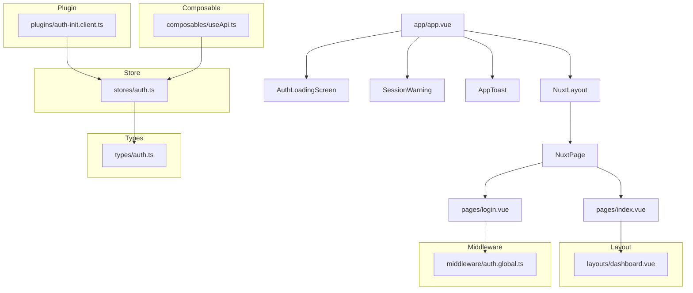
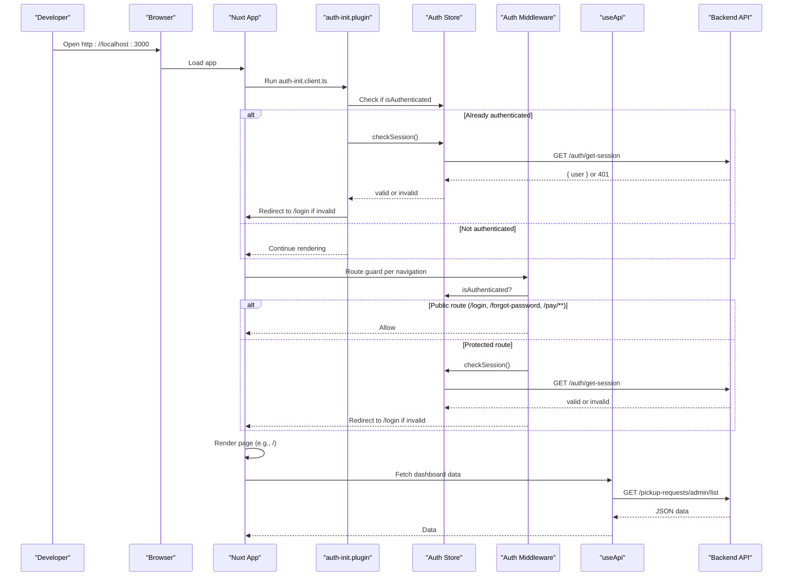
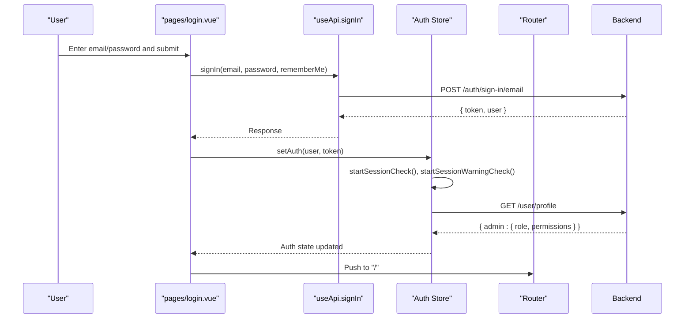
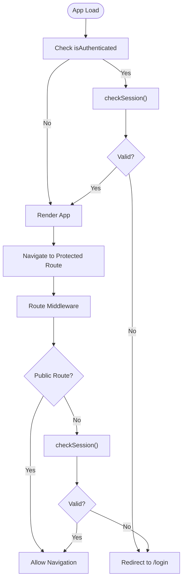
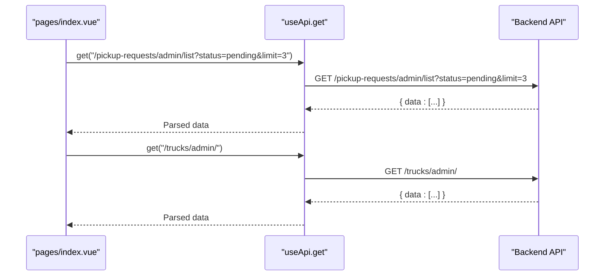
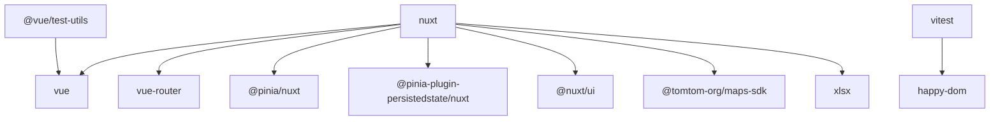

# Getting Started

<cite>
**Referenced Files in This Document**
- [README.md](file://README.md)
- [package.json](file://package.json)
- [nuxt.config.ts](file://nuxt.config.ts)
- [app/app.vue](file://app/app.vue)
- [app/layouts/dashboard.vue](file://app/layouts/dashboard.vue)
- [app/pages/index.vue](file://app/pages/index.vue)
- [app/pages/login.vue](file://app/pages/login.vue)
- [app/plugins/auth-init.client.ts](file://app/plugins/auth-init.client.ts)
- [app/middleware/auth.global.ts](file://app/middleware/auth.global.ts)
- [app/stores/auth.ts](file://app/stores/auth.ts)
- [app/composables/useApi.ts](file://app/composables/useApi.ts)
- [app/types/auth.ts](file://app/types/auth.ts)
- [vitest.config.ts](file://vitest.config.ts)
</cite>

## Table of Contents
1. Introduction
2. Project Structure
3. Core Components
4. Architecture Overview
5. Detailed Component Analysis
6. Dependency Analysis
7. Performance Considerations
8. Troubleshooting Guide
9. Conclusion

## Introduction
Lacarte Atlas Console is a waste collection logistics management dashboard built with Nuxt.js, Vue 3, and TypeScript. It provides an administrative interface for managing customers, drivers, trucks, pickups, billing, reports, and operational workflows. The application emphasizes secure authentication, role-based access, and a responsive dashboard layout with charts and data tables.

This guide helps you set up the project locally, understand its structure, and explore core features as a first-time developer.

## Project Structure
The project follows a standard Nuxt 3 app structure under the app directory:
- app/components: Reusable UI components (modals, headers, sidebars, toasts, guards)
- app/composables: Shared logic hooks (API client, error handling, permissions, toast notifications)
- app/layouts: Page layouts (dashboard shell and default)
- app/middleware: Global route guards (authentication and permissions)
- app/pages: Feature pages organized by domain (customers, drivers, pickups, trucks, management, reports, shop, support, tracking, settings)
- app/plugins: Client-side plugins (auth initialization, Pinia persistence)
- app/stores: State stores (authentication state)
- app/types: Shared TypeScript types (auth models)
- app/utils: Utilities and validation helpers
- public: Static assets served at runtime

**Diagram sources**
- [app/app.vue:1-33](file://app/app.vue#L1-L33)
- [app/layouts/dashboard.vue:1-25](file://app/layouts/dashboard.vue#L1-L25)
- [app/pages/index.vue:1-325](file://app/pages/index.vue#L1-L325)
- [app/pages/login.vue:1-167](file://app/pages/login.vue#L1-L167)
- [app/plugins/auth-init.client.ts:1-25](file://app/plugins/auth-init.client.ts#L1-L25)
- [app/middleware/auth.global.ts:1-32](file://app/middleware/auth.global.ts#L1-L32)
- [app/stores/auth.ts:1-230](file://app/stores/auth.ts#L1-L230)
- [app/composables/useApi.ts:1-91](file://app/composables/useApi.ts#L1-L91)
- [app/types/auth.ts:1-64](file://app/types/auth.ts#L1-L64)

**Section sources**
- [README.md:1-76](file://README.md#L1-L76)
- [nuxt.config.ts:1-46](file://nuxt.config.ts#L1-L46)
- [app/app.vue:1-33](file://app/app.vue#L1-L33)
- [app/layouts/dashboard.vue:1-25](file://app/layouts/dashboard.vue#L1-L25)
- [app/pages/index.vue:1-325](file://app/pages/index.vue#L1-L325)
- [app/pages/login.vue:1-167](file://app/pages/login.vue#L1-L167)
- [app/plugins/auth-init.client.ts:1-25](file://app/plugins/auth-init.client.ts#L1-L25)
- [app/middleware/auth.global.ts:1-32](file://app/middleware/auth.global.ts#L1-L32)
- [app/stores/auth.ts:1-230](file://app/stores/auth.ts#L1-L230)
- [app/composables/useApi.ts:1-91](file://app/composables/useApi.ts#L1-L91)
- [app/types/auth.ts:1-64](file://app/types/auth.ts#L1-L64)

## Core Components
- Authentication store: Manages user session, token, role/permissions, periodic session checks, and warnings.
- API composable: Centralized HTTP client that attaches auth headers, handles errors, and exposes typed helpers.
- Auth middleware: Protects routes, allows public paths, and validates sessions on navigation.
- Auth plugin: Initializes session check on app load and controls a loading screen while checking auth.
- Dashboard layout: Provides sidebar/header shell for authenticated pages.
- Login page: Handles sign-in flow and redirects to the dashboard upon success.
- Dashboard index page: Displays key metrics, charts, pending pickups, and active trucks.

Key responsibilities and interactions are illustrated below.

**Section sources**
- [app/stores/auth.ts:1-230](file://app/stores/auth.ts#L1-L230)
- [app/composables/useApi.ts:1-91](file://app/composables/useApi.ts#L1-L91)
- [app/middleware/auth.global.ts:1-32](file://app/middleware/auth.global.ts#L1-L32)
- [app/plugins/auth-init.client.ts:1-25](file://app/plugins/auth-init.client.ts#L1-L25)
- [app/layouts/dashboard.vue:1-25](file://app/layouts/dashboard.vue#L1-L25)
- [app/pages/login.vue:1-167](file://app/pages/login.vue#L1-L167)
- [app/pages/index.vue:1-325](file://app/pages/index.vue#L1-L325)

## Architecture Overview
High-level architecture shows how the app bootstraps, authenticates users, and renders protected routes.

**Diagram sources**
- [app/plugins/auth-init.client.ts:1-25](file://app/plugins/auth-init.client.ts#L1-L25)
- [app/middleware/auth.global.ts:1-32](file://app/middleware/auth.global.ts#L1-L32)
- [app/stores/auth.ts:1-230](file://app/stores/auth.ts#L1-L230)
- [app/composables/useApi.ts:1-91](file://app/composables/useApi.ts#L1-L91)
- [app/pages/index.vue:1-325](file://app/pages/index.vue#L1-L325)

## Detailed Component Analysis

### Environment Configuration
- Runtime configuration is defined centrally and exposed via useRuntimeConfig().
- Public keys include:
  - apiBase: Base URL for backend API calls. Defaults to a production endpoint when not provided.
  - tomtomApiKey: Key for map services.
- SSR rules disable server-side rendering for specific routes such as login, forgot-password, pay, and tracking.

Environment variables:
- NUXT_PUBLIC_API_BASE: Override the default API base URL.
- NUXT_PUBLIC_TOMTOM_API_KEY: Provide a TomTom Maps SDK API key.

How it works:
- nuxt.config.ts defines runtimeConfig.public and SSR route rules.
- Components and composables read config via useRuntimeConfig().public.apiBase.

**Section sources**
- [nuxt.config.ts:21-44](file://nuxt.config.ts#L21-L44)
- [app/composables/useApi.ts:4-20](file://app/composables/useApi.ts#L4-L20)
- [app/stores/auth.ts:19-25](file://app/stores/auth.ts#L19-L25)

### Dependencies Installation
Install dependencies using your preferred package manager. The repository includes scripts for build, dev, preview, and tests.

Recommended steps:
- Install dependencies
- Start development server
- Build for production
- Preview production build locally

For testing:
- Unit tests are configured with Vitest and happy-dom.

**Section sources**
- [README.md:5-76](file://README.md#L5-L76)
- [package.json:5-12](file://package.json#L5-L12)
- [vitest.config.ts:1-18](file://vitest.config.ts#L1-L18)

### Development Server Startup
Start the local development server to run the app at http://localhost:3000. Ensure environment variables are set if you need to override the API base URL or provide a map API key.

Tips:
- Use the same NUXT_PUBLIC_API_BASE used by the backend during development.
- If maps are required, set NUXT_PUBLIC_TOMTOM_API_KEY.

**Section sources**
- [README.md:23-39](file://README.md#L23-L39)
- [nuxt.config.ts:21-26](file://nuxt.config.ts#L21-L26)

### Basic Usage Examples
- Login: Navigate to /login, enter credentials, and submit. On success, you will be redirected to the dashboard.
- Dashboard: View stats, charts, pending pickups, and active trucks. Data is fetched from the backend via the API composable.
- Protected routes: Accessing protected pages without a valid session redirects to login.

Example flows:
- Sign-in sequence
- Session refresh and warning
- Dashboard data fetch

**Diagram sources**
- [app/pages/login.vue:48-64](file://app/pages/login.vue#L48-L64)
- [app/composables/useApi.ts:82-86](file://app/composables/useApi.ts#L82-L86)
- [app/stores/auth.ts:45-57](file://app/stores/auth.ts#L45-L57)
- [app/stores/auth.ts:15-43](file://app/stores/auth.ts#L15-L43)

**Diagram sources**
- [app/plugins/auth-init.client.ts:1-25](file://app/plugins/auth-init.client.ts#L1-L25)
- [app/middleware/auth.global.ts:1-32](file://app/middleware/auth.global.ts#L1-L32)
- [app/stores/auth.ts:90-120](file://app/stores/auth.ts#L90-L120)

**Diagram sources**
- [app/pages/index.vue:60-89](file://app/pages/index.vue#L60-L89)
- [app/composables/useApi.ts:71-72](file://app/composables/useApi.ts#L71-L72)

### First-Time Developer Onboarding Checklist
- Set environment variables:
  - NUXT_PUBLIC_API_BASE to point to your backend.
  - NUXT_PUBLIC_TOMTOM_API_KEY if you plan to use maps.
- Install dependencies and start the dev server.
- Log in with a valid account to access protected routes.
- Explore the dashboard and feature pages.
- Review the global middleware and auth plugin to understand protection and initialization.
- Use the API composable for all network requests to ensure consistent error handling and auth header injection.

**Section sources**
- [nuxt.config.ts:21-26](file://nuxt.config.ts#L21-L26)
- [README.md:5-39](file://README.md#L5-L39)
- [app/middleware/auth.global.ts:1-32](file://app/middleware/auth.global.ts#L1-L32)
- [app/plugins/auth-init.client.ts:1-25](file://app/plugins/auth-init.client.ts#L1-L25)
- [app/composables/useApi.ts:1-91](file://app/composables/useApi.ts#L1-L91)

## Dependency Analysis
Core runtime dependencies include Nuxt, Vue 3, Vue Router, Pinia, Nuxt UI, TomTom Maps SDK, and XLSX utilities. Dev dependencies include Vitest, happy-dom, and test utilities.

**Diagram sources**
- [package.json:14-31](file://package.json#L14-L31)

**Section sources**
- [package.json:1-33](file://package.json#L1-L33)

## Performance Considerations
- Prefer client-only rendering for interactive or auth-sensitive routes where appropriate.
- Keep API payloads minimal; leverage query parameters for filtering and pagination.
- Avoid heavy synchronous operations in composables; offload to async functions.
- Use memoization and computed properties for derived data in components.
- Optimize images and static assets; consider lazy-loading non-critical resources.

[No sources needed since this section provides general guidance]

## Troubleshooting Guide
Common issues and resolutions:
- 401 Unauthorized on API calls:
  - The API composable logs out and redirects to login automatically.
  - Ensure your session is valid and the backend is reachable.
- Session expires unexpectedly:
  - The store periodically checks the session and warns before expiry. Extend or re-login.
- Routes redirect to login unexpectedly:
  - Verify the route is not marked as public and that the session is valid.
- Map features not loading:
  - Confirm NUXT_PUBLIC_TOMTOM_API_KEY is set and correct.

Where to look:
- Auth store session checks and logout behavior.
- API composable error handling and 401 redirection.
- Global middleware route protection logic.
- Auth plugin initial session validation.

**Section sources**
- [app/composables/useApi.ts:39-44](file://app/composables/useApi.ts#L39-L44)
- [app/stores/auth.ts:122-174](file://app/stores/auth.ts#L122-L174)
- [app/middleware/auth.global.ts:15-31](file://app/middleware/auth.global.ts#L15-L31)
- [app/plugins/auth-init.client.ts:9-20](file://app/plugins/auth-init.client.ts#L9-L20)

## Conclusion
You now have the essentials to set up, run, and explore Lacarte Atlas Console. Focus on environment configuration, authentication flow, and the API composable to integrate new features safely. Use the dashboard as a starting point to understand data fetching patterns and component composition. For advanced usage, review the middleware and store to implement robust authorization and session management.

[No sources needed since this section summarizes without analyzing specific files]