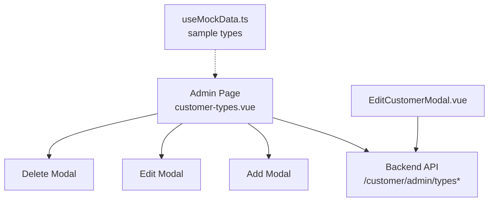
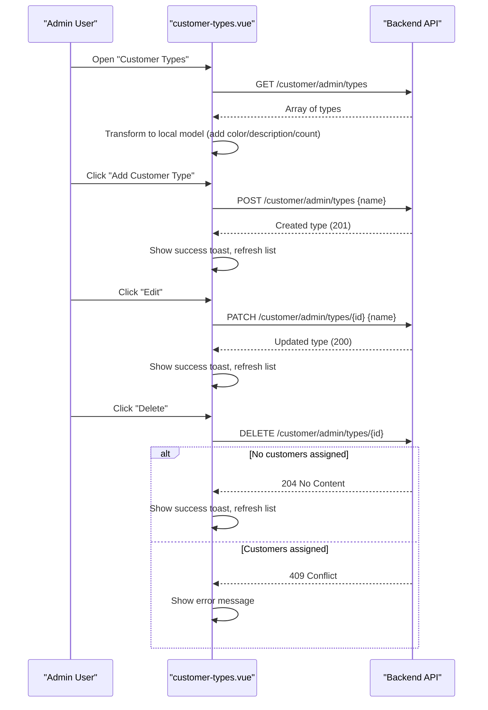
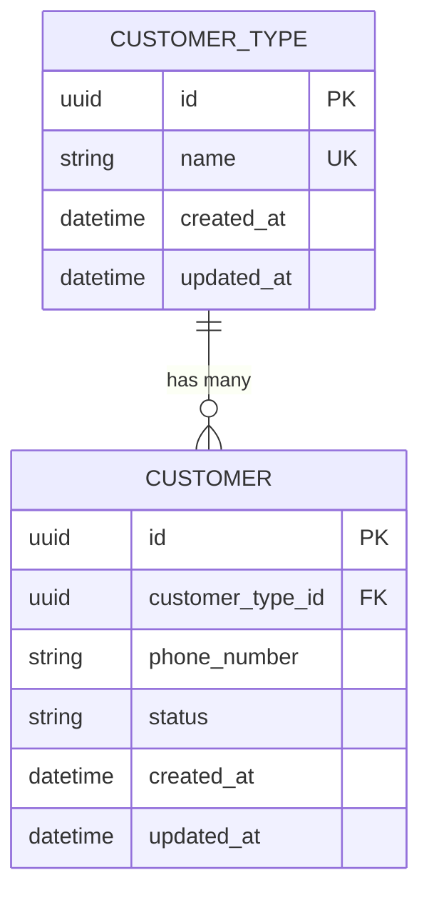
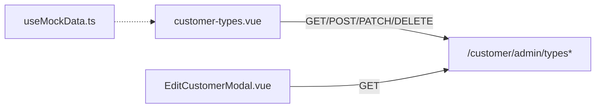

# Customer Types Management

<cite>
**Referenced Files in This Document**
- [customer-types.vue](file://app/pages/management/customer-types.vue)
- [api-1(6).yaml](file://api-1(6).yaml)
- [customer.ts](file://app/types/customer.ts)
- [EditCustomerModal.vue](file://app/components/EditCustomerModal.vue)
- [useMockData.ts](file://app/composables/useMockData.ts)
</cite>

## Table of Contents
1. [Introduction](#introduction)
2. [Project Structure](#project-structure)
3. [Core Components](#core-components)
4. [Architecture Overview](#architecture-overview)
5. [Detailed Component Analysis](#detailed-component-analysis)
6. [Dependency Analysis](#dependency-analysis)
7. [Performance Considerations](#performance-considerations)
8. [Troubleshooting Guide](#troubleshooting-guide)
9. [Conclusion](#conclusion)
10. [Appendices](#appendices)

## Introduction
This document explains the customer types management system, including how to configure and manage customer type classifications (create, edit, delete), the data model, validation rules, duplicate prevention, deletion constraints, API endpoints, error handling, and the relationship between customer types and customer records. It is intended for both technical and non-technical users.

## Project Structure
The customer types feature is implemented as a dedicated admin page with modal dialogs for create, edit, and delete operations. The backend contract is defined in an OpenAPI specification file. Other parts of the application consume the same list endpoint to populate dropdowns when editing or creating customers.

**Diagram sources**
- [customer-types.vue](file://app/pages/management/customer-types.vue)
- [api-1(6).yaml](file://api-1(6).yaml)
- [EditCustomerModal.vue](file://app/components/EditCustomerModal.vue)
- [useMockData.ts](file://app/composables/useMockData.ts)

**Section sources**
- [customer-types.vue](file://app/pages/management/customer-types.vue)
- [api-1(6).yaml](file://api-1(6).yaml)
- [EditCustomerModal.vue](file://app/components/EditCustomerModal.vue)
- [useMockData.ts](file://app/composables/useMockData.ts)

## Core Components
- Admin page for managing customer types:
  - Lists all types
  - Creates new types
  - Edits existing types (rename)
  - Deletes types (with constraints)
- API endpoints:
  - GET /customer/admin/types
  - POST /customer/admin/types
  - PATCH /customer/admin/types/{id}
  - DELETE /customer/admin/types/{id}
- Data model:
  - id (UUID)
  - name (string, unique)
  - createdAt, updatedAt (timestamps)
  - Optional server-side customerCount; client-side also tracks description and color for display
- Relationship:
  - Customers reference a customer type via customerTypeId
  - Deleting a type is blocked if any customers are still assigned to it

**Section sources**
- [customer-types.vue](file://app/pages/management/customer-types.vue)
- [api-1(6).yaml](file://api-1(6).yaml)
- [customer.ts](file://app/types/customer.ts)

## Architecture Overview
The frontend admin page orchestrates all CRUD operations against the backend API. On mount, it fetches the list of types and transforms the response to include client-only fields (description, color, customerCount). Create and update requests send only the name field. Delete requests are guarded by the presence of associated customers.

**Diagram sources**
- [customer-types.vue](file://app/pages/management/customer-types.vue)
- [api-1(6).yaml](file://api-1(6).yaml)

## Detailed Component Analysis

### Data Model
- Server-side fields:
  - id: UUID
  - name: string (required, unique)
  - createdAt: timestamp
  - updatedAt: timestamp
  - customerCount: optional number (may be returned by list endpoint)
- Client-side fields (for UI):
  - description: string (not persisted by this feature)
  - color: string (assigned cyclically from a palette)
  - customerCount: number (displayed count of associated customers)

Relationship to customers:
- A customer record contains a customerTypeId that references a customer type.
- Deleting a type is prevented if any customers reference it.

**Section sources**
- [customer-types.vue](file://app/pages/management/customer-types.vue)
- [api-1(6).yaml](file://api-1(6).yaml)
- [customer.ts](file://app/types/customer.ts)

### API Endpoints
- List types
  - Method: GET
  - Path: /customer/admin/types
  - Response: array of type items
- Create type
  - Method: POST
  - Path: /customer/admin/types
  - Request body: { name }
  - Success: 201 with created item
  - Duplicate: 409 Conflict
- Update type
  - Method: PATCH
  - Path: /customer/admin/types/{id}
  - Request body: { name }
  - Success: 200 with updated item
  - Duplicate: 409 Conflict
- Delete type
  - Method: DELETE
  - Path: /customer/admin/types/{id}
  - Success: 204 No Content
  - Blocked if in use: 409 Conflict

Notes:
- All endpoints require appropriate permissions.
- Name must be non-empty and within length limits.

**Section sources**
- [api-1(6).yaml](file://api-1(6).yaml)

### Validation Rules
- Name is required on create and update.
- Name uniqueness enforced server-side; duplicates return 409 Conflict.
- Name length constraints enforced server-side.
- Frontend shows user-friendly messages for duplicates and missing names.

**Section sources**
- [customer-types.vue](file://app/pages/management/customer-types.vue)
- [api-1(6).yaml](file://api-1(6).yaml)

### Deletion Constraints
- If any customers are still assigned to a type, deletion is blocked by the server (409 Conflict).
- The UI disables the Delete button when customerCount > 0 and informs the user.

**Section sources**
- [customer-types.vue](file://app/pages/management/customer-types.vue)
- [api-1(6).yaml](file://api-1(6).yaml)

### Example Categories
You can set up categories such as:
- Commercial: descriptive text about business clients; choose a distinct color
- Residential: descriptive text about individual homeowners; choose another color
- Industrial: descriptive text about industrial accounts; choose a third color
- Estate: descriptive text about estate properties; choose a fourth color

These examples illustrate typical naming and visual differentiation using colors.

[No sources needed since this section provides general guidance]

### API Usage Examples
- Create a new type
  - Endpoint: POST /customer/admin/types
  - Body: { "name": "Commercial" }
  - Expected: 201 Created
- Rename a type
  - Endpoint: PATCH /customer/admin/types/{id}
  - Body: { "name": "Residential" }
  - Expected: 200 OK
- Delete a type
  - Endpoint: DELETE /customer/admin/types/{id}
  - Expected: 204 No Content if no customers are assigned; otherwise 409 Conflict

**Section sources**
- [api-1(6).yaml](file://api-1(6).yaml)

### Error Handling
- Duplicate name errors:
  - Server returns 409 Conflict
  - Frontend detects duplicate-related messages and displays a clear error in the form
- Network or server errors:
  - Frontend catches exceptions and shows a generic error message
- Deletion blocked:
  - Server returns 409 Conflict when customers are still assigned
  - Frontend surfaces the error to the user

**Section sources**
- [customer-types.vue](file://app/pages/management/customer-types.vue)
- [api-1(6).yaml](file://api-1(6).yaml)

### Relationship Between Customer Types and Customer Records
- Each customer has a customerTypeId referencing a type.
- When editing a customer, the available types are loaded from the same list endpoint.
- Deleting a type is blocked if any customers reference it.

**Diagram sources**
- [api-1(6).yaml](file://api-1(6).yaml)
- [customer.ts](file://app/types/customer.ts)
- [EditCustomerModal.vue](file://app/components/EditCustomerModal.vue)

**Section sources**
- [customer.ts](file://app/types/customer.ts)
- [EditCustomerModal.vue](file://app/components/EditCustomerModal.vue)

## Dependency Analysis
- The admin page depends on:
  - API endpoints for listing, creating, updating, and deleting types
  - Local state for modals and forms
  - Toast notifications for feedback
- Other components depend on the list endpoint to populate dropdowns when assigning types to customers.

**Diagram sources**
- [customer-types.vue](file://app/pages/management/customer-types.vue)
- [EditCustomerModal.vue](file://app/components/EditCustomerModal.vue)
- [useMockData.ts](file://app/composables/useMockData.ts)

**Section sources**
- [customer-types.vue](file://app/pages/management/customer-types.vue)
- [EditCustomerModal.vue](file://app/components/EditCustomerModal.vue)
- [useMockData.ts](file://app/composables/useMockData.ts)

## Performance Considerations
- The list endpoint is called once on mount and after each mutation to keep the UI consistent.
- Colors are assigned locally to avoid extra network calls.
- Keep the number of types reasonable; pagination is not currently used for this endpoint.

[No sources needed since this section provides general guidance]

## Troubleshooting Guide
- Cannot create a type with an existing name:
  - Cause: Duplicate name
  - Action: Choose a different name
- Cannot delete a type:
  - Cause: One or more customers are still assigned to the type
  - Action: Reassign or remove those customers first
- UI shows generic error messages:
  - Check browser console logs for detailed error payloads
  - Verify network responses for 4xx/5xx statuses

**Section sources**
- [customer-types.vue](file://app/pages/management/customer-types.vue)
- [api-1(6).yaml](file://api-1(6).yaml)

## Conclusion
The customer types management system provides a straightforward way to classify customers through a small set of well-defined endpoints. The frontend enforces basic validations and presents clear feedback for duplicates and deletion constraints. Maintaining unique names and ensuring types are unassigned before deletion are key operational practices.

[No sources needed since this section summarizes without analyzing specific files]

## Appendices

### Configuration Steps
- Ensure you have the required permission to access the admin endpoints.
- Use the Add dialog to create new types with meaningful names.
- Use Edit to rename types when necessary.
- Use Delete only when no customers are assigned to the type.

[No sources needed since this section provides general guidance]