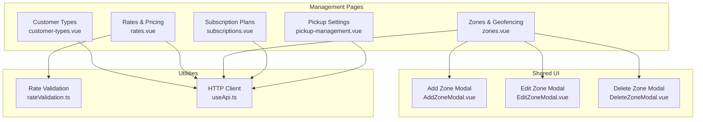
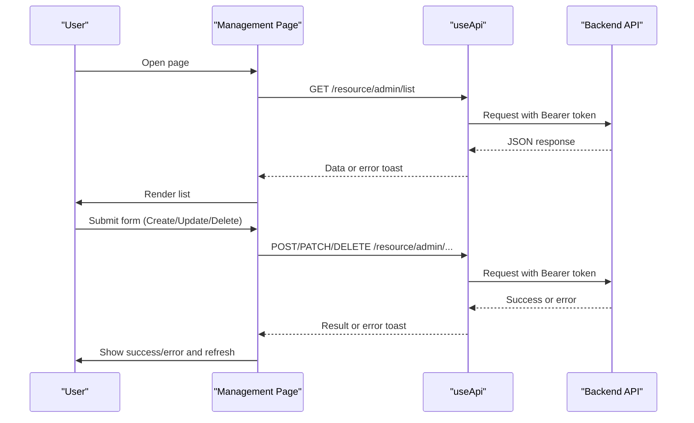
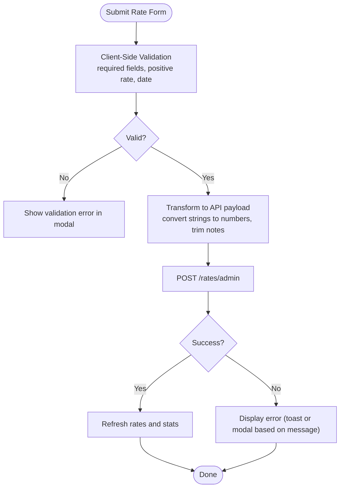
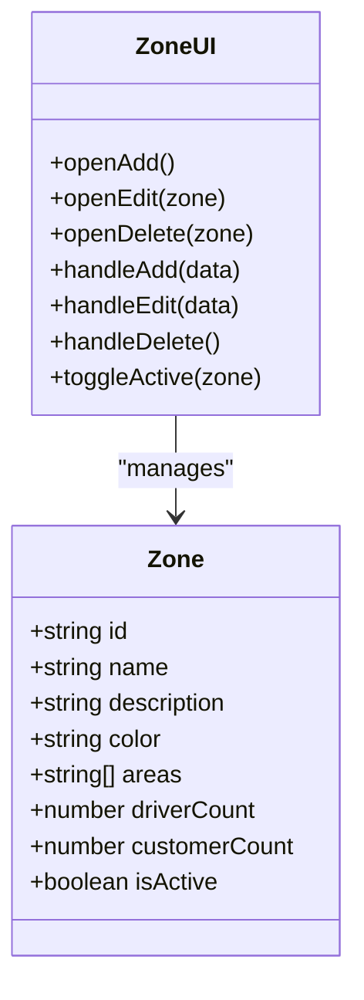
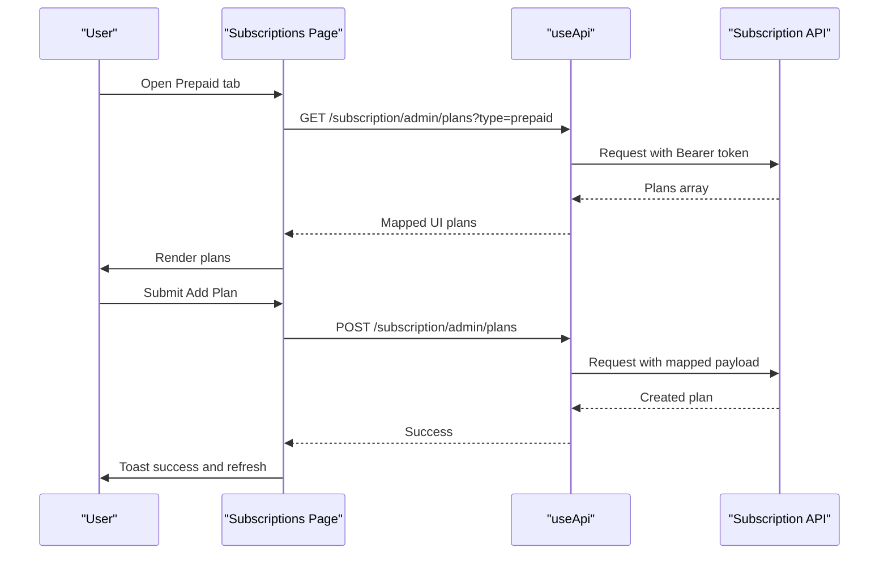
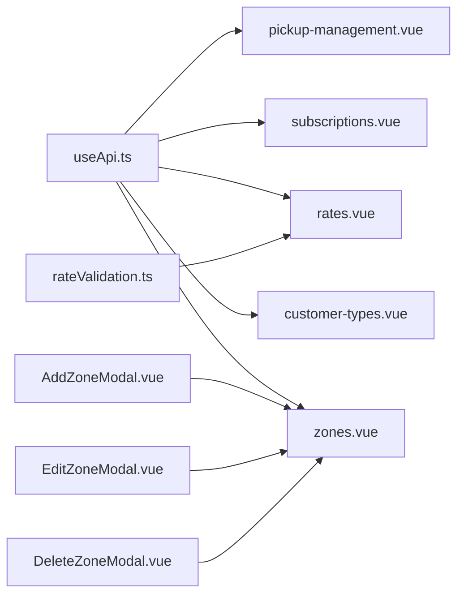

# Management Tools

<cite>
**Referenced Files in This Document**
- [customer-types.vue](file://app/pages/management/customer-types.vue)
- [rates.vue](file://app/pages/management/rates.vue)
- [zones.vue](file://app/pages/management/zones.vue)
- [subscriptions.vue](file://app/pages/management/subscriptions.vue)
- [pickup-management.vue](file://app/pages/management/pickup-management.vue)
- [rateValidation.ts](file://app/utils/rateValidation.ts)
- [AddZoneModal.vue](file://app/components/AddZoneModal.vue)
- [EditZoneModal.vue](file://app/components/EditZoneModal.vue)
- [DeleteZoneModal.vue](file://app/components/DeleteZoneModal.vue)
- [useApi.ts](file://app/composables/useApi.ts)
- [rates-create-payload.test.ts](file://app/pages/management/__tests__/rates-create-payload.test.ts)
- [subscriptions-payload.test.ts](file://app/pages/management/__tests__/subscriptions-payload.test.ts)
</cite>

## Table of Contents
1. [Introduction](#introduction)
2. [Project Structure](#project-structure)
3. [Core Components](#core-components)
4. [Architecture Overview](#architecture-overview)
5. [Detailed Component Analysis](#detailed-component-analysis)
6. [Dependency Analysis](#dependency-analysis)
7. [Performance Considerations](#performance-considerations)
8. [Troubleshooting Guide](#troubleshooting-guide)
9. [Conclusion](#conclusion)
10. [Appendices](#appendices)

## Introduction
This document explains the management tools suite for configuring customer types, managing rates and pricing, defining service zones with geofencing areas, administering subscription plans, and managing pickup-related settings (disposable types and estimated quantities). It covers data models, validation rules, business logic, API integration patterns, and concrete configuration examples. Where applicable, it also highlights bulk operations and import/export considerations.

## Project Structure
The management tools are implemented as Nuxt pages under app/pages/management, each owning its state, API calls, and modals. Shared utilities include rate validation and reusable modal components for zone management. The HTTP client composable centralizes authentication, error handling, and request/response normalization.

**Diagram sources**
- [customer-types.vue:1-454](file://app/pages/management/customer-types.vue#L1-L454)
- [rates.vue:1-800](file://app/pages/management/rates.vue#L1-L800)
- [zones.vue:1-360](file://app/pages/management/zones.vue#L1-L360)
- [subscriptions.vue:1-800](file://app/pages/management/subscriptions.vue#L1-L800)
- [pickup-management.vue:1-407](file://app/pages/management/pickup-management.vue#L1-L407)
- [rateValidation.ts:1-69](file://app/utils/rateValidation.ts#L1-L69)
- [AddZoneModal.vue:1-87](file://app/components/AddZoneModal.vue#L1-L87)
- [EditZoneModal.vue:1-105](file://app/components/EditZoneModal.vue#L1-L105)
- [DeleteZoneModal.vue:1-37](file://app/components/DeleteZoneModal.vue#L1-L37)
- [useApi.ts:1-91](file://app/composables/useApi.ts#L1-L91)

**Section sources**
- [customer-types.vue:1-454](file://app/pages/management/customer-types.vue#L1-L454)
- [rates.vue:1-800](file://app/pages/management/rates.vue#L1-L800)
- [zones.vue:1-360](file://app/pages/management/zones.vue#L1-L360)
- [subscriptions.vue:1-800](file://app/pages/management/subscriptions.vue#L1-L800)
- [pickup-management.vue:1-407](file://app/pages/management/pickup-management.vue#L1-L407)
- [rateValidation.ts:1-69](file://app/utils/rateValidation.ts#L1-L69)
- [AddZoneModal.vue:1-87](file://app/components/AddZoneModal.vue#L1-L87)
- [EditZoneModal.vue:1-105](file://app/components/EditZoneModal.vue#L1-L105)
- [DeleteZoneModal.vue:1-37](file://app/components/DeleteZoneModal.vue#L1-L37)
- [useApi.ts:1-91](file://app/composables/useApi.ts#L1-L91)

## Core Components
- Customer Types: Create, edit, delete classifications used to segment customers; supports color badges and counts.
- Rates & Pricing: Pay-as-you-go rates per customer type and optional estimated quantity tier; includes effective date and status computation.
- Zones & Geofencing: Define service zones with area tags; toggle active/inactive; view stats and manage CRUD.
- Subscription Plans: Prepaid/postpaid plan administration with billing cycles, feature quotas, and pricing.
- Pickup Management: Manage disposable item types and estimated quantity tiers used across the system.

Key shared behaviors:
- Centralized HTTP client with auth injection and standardized error handling.
- Consistent modal-driven forms for add/edit/delete flows.
- Client-side validation where applicable, with server-side enforcement.

**Section sources**
- [customer-types.vue:1-454](file://app/pages/management/customer-types.vue#L1-L454)
- [rates.vue:1-800](file://app/pages/management/rates.vue#L1-L800)
- [zones.vue:1-360](file://app/pages/management/zones.vue#L1-L360)
- [subscriptions.vue:1-800](file://app/pages/management/subscriptions.vue#L1-L800)
- [pickup-management.vue:1-407](file://app/pages/management/pickup-management.vue#L1-L407)
- [useApi.ts:1-91](file://app/composables/useApi.ts#L1-L91)

## Architecture Overview
All management pages follow a consistent pattern:
- Fetch reference data (e.g., customer types, quantities) and domain data (e.g., rates, plans, zones).
- Render lists with filters and pagination where needed.
- Use modals for create/update/delete operations.
- Call useApi methods that attach Authorization headers and handle errors uniformly.

**Diagram sources**
- [useApi.ts:1-91](file://app/composables/useApi.ts#L1-L91)
- [rates.vue:1-800](file://app/pages/management/rates.vue#L1-L800)
- [zones.vue:1-360](file://app/pages/management/zones.vue#L1-L360)
- [subscriptions.vue:1-800](file://app/pages/management/subscriptions.vue#L1-L800)
- [pickup-management.vue:1-407](file://app/pages/management/pickup-management.vue#L1-L407)

## Detailed Component Analysis

### Customer Type Configuration
Purpose:
- Classify customers into types for segmentation and downstream features (e.g., rate assignment).

Data model:
- Server entity fields include id, name, timestamps, and optional count.
- Client adds description and color for display purposes.

Business rules and validation:
- Name is required on create and update.
- Duplicate names are rejected by the server; client surfaces user-friendly messages.
- Deletion disabled when associated customerCount > 0.

API endpoints:
- GET /customer/admin/types
- POST /customer/admin/types
- PATCH /customer/admin/types/{id}
- DELETE /customer/admin/types/{id}

Example configuration steps:
- Add a new type: provide a unique name; optionally set a descriptive text and badge color.
- Edit an existing type: change name/description/color; ensure uniqueness.
- Delete a type: only if no customers are assigned.

Integration points:
- Used by Rate Management to scope pay-as-you-go pricing per customer type.

**Section sources**
- [customer-types.vue:1-454](file://app/pages/management/customer-types.vue#L1-L454)

### Rate Management and Pricing
Purpose:
- Configure pay-as-you-go pickup rates per customer type and optional estimated quantity tier.

Data model:
- Fields include id, customerTypeId, optional estimatedQuantityId, rate, effectiveDate, note, isActive, and timestamps.
- Status computed from isActive and effectiveDate relative to today.

Validation rules:
- For creation: customer type, estimated quantity, positive rate, and effective date are required.
- For editing: estimated quantity, positive rate, and effective date are required; customer type not re-required.
- Note trimming applied before submission.

API endpoints:
- GET /rates/admin
- GET /rates/admin/stats
- POST /rates/admin
- PATCH /rates/admin/{id}
- DELETE /rates/admin/{id}

Business logic:
- Effective date determines upcoming vs active status.
- Optional association to estimated quantity tiers allows granular pricing.
- Stats endpoint provides totals for dashboard metrics.

Example configuration steps:
- Create a rate: select a customer type, choose an estimated quantity tier (optional), set a positive rate, pick an effective date, and mark active.
- Update a rate: adjust rate, tier, date, or active flag.
- Delete a rate: remove outdated or incorrect entries.

Integration patterns:
- Uses centralized validation utility for consistent checks.
- Consumes customer types and estimated quantities via separate endpoints.

**Diagram sources**
- [rates.vue:1-800](file://app/pages/management/rates.vue#L1-L800)
- [rateValidation.ts:1-69](file://app/utils/rateValidation.ts#L1-L69)

**Section sources**
- [rates.vue:1-800](file://app/pages/management/rates.vue#L1-L800)
- [rateValidation.ts:1-69](file://app/utils/rateValidation.ts#L1-L69)
- [rates-create-payload.test.ts:1-192](file://app/pages/management/__tests__/rates-create-payload.test.ts#L1-L192)

### Zone Management and Geofencing
Purpose:
- Define service zones with descriptive areas/localities and control their active state.

Data model:
- Fields include id, name, description, color, areas (list of strings), driverCount, customerCount, isActive.

Validation rules:
- Name is required on create and edit.
- Areas are provided as newline-separated values and parsed into arrays.

API endpoints:
- GET /zone/admin/list
- GET /zone/admin/stats
- POST /zone/admin/
- PATCH /zone/admin/{id}
- PATCH /zone/admin/{id}/toggle
- DELETE /zone/admin/{id}

Business logic:
- Toggle active/inactive without full update.
- Deletion disabled when customerCount > 0.
- Search and filter by status supported.

Example configuration steps:
- Add a zone: enter name, description, one area per line, choose a color, and set active.
- Edit a zone: modify details or toggle active.
- Delete a zone: only if no customers are assigned.

Integration points:
- Provides foundational geography context for routing and reporting modules.

**Diagram sources**
- [zones.vue:1-360](file://app/pages/management/zones.vue#L1-L360)
- [AddZoneModal.vue:1-87](file://app/components/AddZoneModal.vue#L1-L87)
- [EditZoneModal.vue:1-105](file://app/components/EditZoneModal.vue#L1-L105)
- [DeleteZoneModal.vue:1-37](file://app/components/DeleteZoneModal.vue#L1-L37)

**Section sources**
- [zones.vue:1-360](file://app/pages/management/zones.vue#L1-L360)
- [AddZoneModal.vue:1-87](file://app/components/AddZoneModal.vue#L1-L87)
- [EditZoneModal.vue:1-105](file://app/components/EditZoneModal.vue#L1-L105)
- [DeleteZoneModal.vue:1-37](file://app/components/DeleteZoneModal.vue#L1-L37)

### Subscription Plan Administration
Purpose:
- Administer prepaid and postpaid subscription plans with billing cycles, feature quotas, and pricing.

Data model:
- UI Plan fields: id, name, description, billingType, billingCycle, pickupCount, binCount, price, color, subscriberCount, isActive.
- API Plan fields map to UI fields with different naming conventions.

Validation rules:
- Plan name required.
- Positive integer pickup and bin counts required.
- Non-negative price required.

API endpoints:
- GET /subscription/admin/plans?type=prepaid|postpaid
- GET /subscription/admin/stats?type=prepaid|postpaid
- POST /subscription/admin/plans
- PATCH /subscription/admin/plans/{id}
- DELETE /subscription/admin/plans/{id}
- PATCH /subscription/admin/plans/{id}/toggle

Business logic:
- Separate tabs for prepaid and postpaid plans.
- Toggle active status without full update.
- Deletion disabled when subscriberCount > 0.

Example configuration steps:
- Create a plan: choose billing type, set name, description, monthly/quarterly/yearly cycle, define pickups and bins, set price, choose color, and mark active.
- Edit a plan: adjust any field except billing type.
- Delete a plan: only if no subscribers are present.

Integration patterns:
- Payload mapping transforms UI fields to API field names consistently for both create and update.

**Diagram sources**
- [subscriptions.vue:1-800](file://app/pages/management/subscriptions.vue#L1-L800)
- [useApi.ts:1-91](file://app/composables/useApi.ts#L1-L91)
- [subscriptions-payload.test.ts:1-168](file://app/pages/management/__tests__/subscriptions-payload.test.ts#L1-L168)

**Section sources**
- [subscriptions.vue:1-800](file://app/pages/management/subscriptions.vue#L1-L800)
- [subscriptions-payload.test.ts:1-168](file://app/pages/management/__tests__/subscriptions-payload.test.ts#L1-L168)

### Pickup Management Settings
Purpose:
- Manage disposable item types and estimated quantity tiers used across the system (e.g., for rates and orders).

Data model:
- Disposable Type: id, name, description, icon, isActive, displayOrder, createdAt.
- Estimated Quantity: id, label, description, displayOrder, isActive, createdAt.

Validation rules:
- Name/label required on create and edit.
- Display order controls presentation sequence.

API endpoints:
- GET /disposable/item-types
- POST /disposable/item-types
- PATCH /disposable/item-types/{id}
- DELETE /disposable/item-types/{id}
- GET /disposable/quantities
- POST /disposable/quantities
- PATCH /disposable/quantities/{id}
- DELETE /disposable/quantities/{id}

Business logic:
- Two tabs: Disposable Types and Estimated Quantities.
- Each supports search, edit, and delete actions.

Example configuration steps:
- Add a disposable type: specify name, description, icon, order, and active state.
- Add an estimated quantity: specify label, description, order, and active state.
- Edit or delete items as needed.

Integration points:
- Estimated quantities are referenced by Rate Management to scope pricing.

**Section sources**
- [pickup-management.vue:1-407](file://app/pages/management/pickup-management.vue#L1-L407)

## Dependency Analysis
- All management pages depend on useApi for authenticated requests and unified error handling.
- Rate Management depends on rateValidation for consistent input validation and payload transformation.
- Zone Management uses dedicated modal components for add/edit/delete interactions.
- Subscriptions Management maps between UI and API field names to maintain compatibility.

**Diagram sources**
- [useApi.ts:1-91](file://app/composables/useApi.ts#L1-L91)
- [customer-types.vue:1-454](file://app/pages/management/customer-types.vue#L1-L454)
- [rates.vue:1-800](file://app/pages/management/rates.vue#L1-L800)
- [zones.vue:1-360](file://app/pages/management/zones.vue#L1-L360)
- [subscriptions.vue:1-800](file://app/pages/management/subscriptions.vue#L1-L800)
- [pickup-management.vue:1-407](file://app/pages/management/pickup-management.vue#L1-L407)
- [rateValidation.ts:1-69](file://app/utils/rateValidation.ts#L1-L69)
- [AddZoneModal.vue:1-87](file://app/components/AddZoneModal.vue#L1-L87)
- [EditZoneModal.vue:1-105](file://app/components/EditZoneModal.vue#L1-L105)
- [DeleteZoneModal.vue:1-37](file://app/components/DeleteZoneModal.vue#L1-L37)

**Section sources**
- [useApi.ts:1-91](file://app/composables/useApi.ts#L1-L91)
- [customer-types.vue:1-454](file://app/pages/management/customer-types.vue#L1-L454)
- [rates.vue:1-800](file://app/pages/management/rates.vue#L1-L800)
- [zones.vue:1-360](file://app/pages/management/zones.vue#L1-L360)
- [subscriptions.vue:1-800](file://app/pages/management/subscriptions.vue#L1-L800)
- [pickup-management.vue:1-407](file://app/pages/management/pickup-management.vue#L1-L407)
- [rateValidation.ts:1-69](file://app/utils/rateValidation.ts#L1-L69)
- [AddZoneModal.vue:1-87](file://app/components/AddZoneModal.vue#L1-L87)
- [EditZoneModal.vue:1-105](file://app/components/EditZoneModal.vue#L1-L105)
- [DeleteZoneModal.vue:1-37](file://app/components/DeleteZoneModal.vue#L1-L37)

## Performance Considerations
- Parallel fetching: On mount, pages fetch related datasets concurrently using Promise.all to reduce load time.
- Local filtering and pagination: Client-side filtering avoids extra network calls; pagination reduces DOM size for large lists.
- Minimal payloads: Only necessary fields are requested and transformed; numeric conversions happen locally.
- Error handling overhead: Centralized error handling prevents repeated try/catch blocks and standardizes user feedback.

[No sources needed since this section provides general guidance]

## Troubleshooting Guide
Common issues and resolutions:
- Authentication failures (401): useApi automatically logs out and redirects to login; re-authenticate and retry.
- Validation errors:
  - Rates: Ensure required fields are filled and rate is positive; check effective date format.
  - Subscriptions: Ensure positive integers for pickups/bins and non-negative price.
  - Zones: Ensure zone name is provided; parse areas correctly.
- Duplicate names:
  - Customer types and subscription plans enforce uniqueness; rename to a unique value.
- Deletion blocked:
  - If associated entities exist (customers, subscribers), deletion is disabled; remove dependencies first.

Operational tips:
- Inspect console logs for request paths and responses to diagnose API mismatches.
- Use raw request mode when custom error handling is needed (e.g., displaying validation errors in modals).

**Section sources**
- [useApi.ts:1-91](file://app/composables/useApi.ts#L1-L91)
- [rates.vue:1-800](file://app/pages/management/rates.vue#L1-L800)
- [subscriptions.vue:1-800](file://app/pages/management/subscriptions.vue#L1-L800)
- [zones.vue:1-360](file://app/pages/management/zones.vue#L1-L360)

## Conclusion
The management tools suite provides a cohesive interface for configuring core operational parameters: customer segmentation, pricing strategies, service zones, subscription offerings, and pickup-related settings. Consistent API integration, robust validation, and clear business rules enable reliable administration. Future enhancements can introduce bulk operations and import/export capabilities to streamline large-scale configuration changes.

[No sources needed since this section summarizes without analyzing specific files]

## Appendices

### API Endpoints Summary
- Customer Types
  - GET /customer/admin/types
  - POST /customer/admin/types
  - PATCH /customer/admin/types/{id}
  - DELETE /customer/admin/types/{id}
- Rates & Pricing
  - GET /rates/admin
  - GET /rates/admin/stats
  - POST /rates/admin
  - PATCH /rates/admin/{id}
  - DELETE /rates/admin/{id}
- Zones & Geofencing
  - GET /zone/admin/list
  - GET /zone/admin/stats
  - POST /zone/admin/
  - PATCH /zone/admin/{id}
  - PATCH /zone/admin/{id}/toggle
  - DELETE /zone/admin/{id}
- Subscription Plans
  - GET /subscription/admin/plans?type=prepaid|postpaid
  - GET /subscription/admin/stats?type=prepaid|postpaid
  - POST /subscription/admin/plans
  - PATCH /subscription/admin/plans/{id}
  - DELETE /subscription/admin/plans/{id}
  - PATCH /subscription/admin/plans/{id}/toggle
- Pickup Management
  - GET /disposable/item-types
  - POST /disposable/item-types
  - PATCH /disposable/item-types/{id}
  - DELETE /disposable/item-types/{id}
  - GET /disposable/quantities
  - POST /disposable/quantities
  - PATCH /disposable/quantities/{id}
  - DELETE /disposable/quantities/{id}

**Section sources**
- [customer-types.vue:1-454](file://app/pages/management/customer-types.vue#L1-L454)
- [rates.vue:1-800](file://app/pages/management/rates.vue#L1-L800)
- [zones.vue:1-360](file://app/pages/management/zones.vue#L1-L360)
- [subscriptions.vue:1-800](file://app/pages/management/subscriptions.vue#L1-L800)
- [pickup-management.vue:1-407](file://app/pages/management/pickup-management.vue#L1-L407)

### Data Import/Export and Bulk Operations
Current implementation focuses on single-entity CRUD operations via modals and direct API calls. There is no built-in bulk import/export UI in these pages. To support bulk operations:
- Extend pages with CSV/JSON upload handlers that call batch endpoints (if available) or iterate over rows to perform individual operations.
- Implement progress indicators and rollback strategies for failed rows.
- Add export functions to download current configurations as CSV/JSON for backup or migration.

[No sources needed since this section provides general guidance]