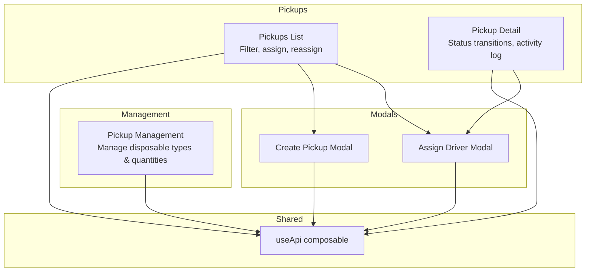
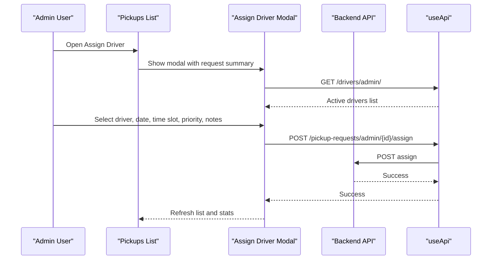
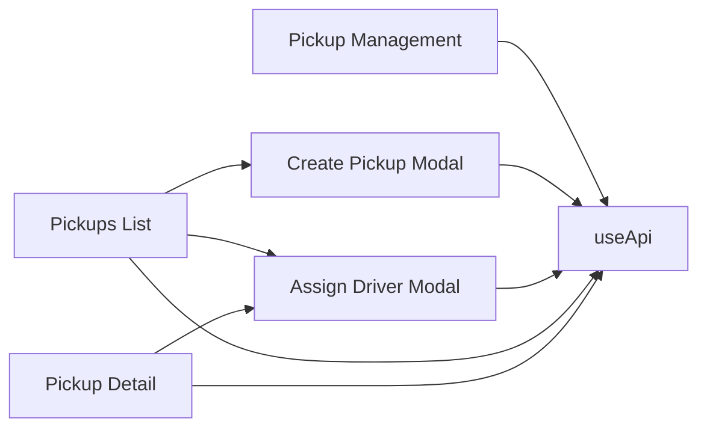

# Pickup Configuration & Rules

<cite>
**Referenced Files in This Document**
- [pickup-management.vue](file://app/pages/management/pickup-management.vue)
- [CreatePickupModal.vue](file://app/components/CreatePickupModal.vue)
- [AssignDriverModal.vue](file://app/components/AssignDriverModal.vue)
- [index.vue (Pickups list)](file://app/pages/pickups/index.vue)
- [id.vue (Pickup detail)](file://app/pages/pickups/[id].vue)
- [useApi.ts](file://app/composables/useApi.ts)
</cite>

## Table of Contents
1. [Introduction](#introduction)
2. [Project Structure](#project-structure)
3. [Core Components](#core-components)
4. [Architecture Overview](#architecture-overview)
5. [Detailed Component Analysis](#detailed-component-analysis)
6. [Dependency Analysis](#dependency-analysis)
7. [Performance Considerations](#performance-considerations)
8. [Troubleshooting Guide](#troubleshooting-guide)
9. [Conclusion](#conclusion)
10. [Appendices](#appendices)

## Introduction
This document explains the pickup configuration and rules management system as implemented in the console application. It focuses on how to configure pickup scheduling rules, frequency settings, operational constraints, and the data model used for pickup requests. It also documents integration points with the backend API, driver assignment workflows, and the impact of rules on customer experience, operational efficiency, and resource allocation. Where applicable, concrete examples are provided using UI flows and API endpoints exposed by the frontend.

## Project Structure
The pickup-related functionality is primarily implemented in the following pages and components:
- Management page for pickup reference data (disposable types and estimated quantities)
- Pickup request creation modal
- Driver assignment modal
- Pickup list and detail views
- Shared API composable for HTTP calls

**Diagram sources**
- [pickup-management.vue:1-407](file://app/pages/management/pickup-management.vue#L1-L407)
- [CreatePickupModal.vue:1-293](file://app/components/CreatePickupModal.vue#L1-L293)
- [AssignDriverModal.vue:1-222](file://app/components/AssignDriverModal.vue#L1-L222)
- [index.vue (Pickups list):1-567](file://app/pages/pickups/index.vue#L1-L567)
- [id.vue (Pickup detail):1-841](file://app/pages/pickups/[id].vue#L1-L841)
- [useApi.ts:1-91](file://app/composables/useApi.ts#L1-L91)

**Section sources**
- [pickup-management.vue:1-407](file://app/pages/management/pickup-management.vue#L1-L407)
- [CreatePickupModal.vue:1-293](file://app/components/CreatePickupModal.vue#L1-L293)
- [AssignDriverModal.vue:1-222](file://app/components/AssignDriverModal.vue#L1-L222)
- [index.vue (Pickups list):1-567](file://app/pages/pickups/index.vue#L1-L567)
- [id.vue (Pickup detail):1-841](file://app/pages/pickups/[id].vue#L1-L841)
- [useApi.ts:1-91](file://app/composables/useApi.ts#L1-L91)

## Core Components
- Pickup Management: Configures reference data that underpins pickup rules (disposable item types and estimated quantities). These define what can be picked up and how much, which influences capacity planning and SLAs.
- Create Pickup Modal: Captures a new pickup request including customer selection, item type, estimated quantity, preferred date, and notes. Validates required fields before submission.
- Assign Driver Modal: Allows assigning or reassigning a driver, selecting scheduled date/time slot, priority level, and admin notes. Supports time slot mapping to backend values.
- Pickups List: Displays all requests with filters (status and payment status), stats, and actions to create or assign drivers.
- Pickup Detail: Shows full request details, timeline, activity log, and supports status transitions (start trip, en route, picked up, complete, cancel) and reassignment.

Key responsibilities:
- Reference data management (types and quantities)
- Request creation and validation
- Assignment/reassignment workflow
- Status lifecycle management
- Activity tracking and auditability

**Section sources**
- [pickup-management.vue:1-407](file://app/pages/management/pickup-management.vue#L1-L407)
- [CreatePickupModal.vue:1-293](file://app/components/CreatePickupModal.vue#L1-L293)
- [AssignDriverModal.vue:1-222](file://app/components/AssignDriverModal.vue#L1-L222)
- [index.vue (Pickups list):1-567](file://app/pages/pickups/index.vue#L1-L567)
- [id.vue (Pickup detail):1-841](file://app/pages/pickups/[id].vue#L1-L841)

## Architecture Overview
The frontend orchestrates user interactions and communicates with backend APIs via a shared composable. The pickup rule surface includes:
- Time windows: Represented by time slots (morning, afternoon, evening) selected during assignment.
- Minimum requirements: Enforced via required fields (customer, item type, quantity, preferred date).
- Automated assignment criteria: Priority levels (low, normal, high, urgent) are captured; backend logic determines final assignment.

**Diagram sources**
- [index.vue (Pickups list):187-239](file://app/pages/pickups/index.vue#L187-L239)
- [AssignDriverModal.vue:34-56](file://app/components/AssignDriverModal.vue#L34-L56)
- [useApi.ts:1-91](file://app/composables/useApi.ts#L1-L91)

**Section sources**
- [index.vue (Pickups list):1-567](file://app/pages/pickups/index.vue#L1-L567)
- [AssignDriverModal.vue:1-222](file://app/components/AssignDriverModal.vue#L1-L222)
- [useApi.ts:1-91](file://app/composables/useApi.ts#L1-L91)

## Detailed Component Analysis

### Pickup Management (Reference Data)
Purpose:
- Manage “Disposable Types” and “Estimated Quantities,” which act as foundational rules for pickups.
- Each type defines what can be picked up; each quantity defines expected volume categories.

Key behaviors:
- Fetches and displays lists of types and quantities.
- Supports add/edit/delete operations with success feedback.
- Filters items by search text.

Operational constraints:
- Items have active/inactive states and display order, influencing availability and presentation.

Integration points:
- Endpoints:
  - GET /disposable/item-types
  - POST /disposable/item-types
  - PATCH /disposable/item-types/{id}
  - DELETE /disposable/item-types/{id}
  - GET /disposable/quantities
  - POST /disposable/quantities
  - PATCH /disposable/quantities/{id}
  - DELETE /disposable/quantities/{id}

Impact:
- Ensures consistent categorization and estimation across the system, improving routing accuracy and SLA adherence.

**Section sources**
- [pickup-management.vue:1-407](file://app/pages/management/pickup-management.vue#L1-L407)

### Create Pickup Modal
Purpose:
- Capture a new pickup request with validated inputs.

Data model fields:
- Customer ID (selected from paginated list)
- Disposable Item Type ID
- Estimated Quantity ID
- Preferred Pickup Date
- Additional Notes (optional, max length enforced)

Validation rules:
- Required: customer, item type, quantity, preferred date
- Optional: additional notes with character limit

Submission:
- Creates a pickup request via POST /pickup-requests/admin/ with paymentType set to subscription.

Customer selection:
- Paginates through customers to build a local list for fast filtering and selection.

**Section sources**
- [CreatePickupModal.vue:1-293](file://app/components/CreatePickupModal.vue#L1-L293)

### Assign Driver Modal
Purpose:
- Assign or reassign a driver to a pickup request.

Inputs:
- Driver selection (active or online drivers only)
- Scheduled date
- Scheduled time slot (mapped to morning/afternoon/evening)
- Priority level (low, normal, high, urgent)
- Admin notes (optional)

Assignment vs Reassignment:
- If no driver assigned yet: POST /pickup-requests/admin/{id}/assign with priorityLevel included.
- If already assigned: PATCH /pickup-requests/admin/{id}/reassign without priorityLevel.

Time slot mapping:
- UI labels map to backend values: morning, afternoon, evening.

**Section sources**
- [AssignDriverModal.vue:1-222](file://app/components/AssignDriverModal.vue#L1-L222)
- [index.vue (Pickups list):187-239](file://app/pages/pickups/index.vue#L187-L239)
- [id.vue (Pickup detail):381-431](file://app/pages/pickups/[id].vue#L381-L431)

### Pickups List
Features:
- Lists pickup requests with pagination.
- Filters by status and payment status.
- Displays stats (pending, assigned today, completed, unpaid).
- Actions: Create pickup, Assign/Reassign driver, View details.

Status handling:
- Visual badges for statuses: pending, assigned, truck_dispatched, en_route, picked_up, completed, cancelled.

Assignment flow:
- Opens Assign Driver modal for pending or assigned requests.

**Section sources**
- [index.vue (Pickups list):1-567](file://app/pages/pickups/index.vue#L1-L567)

### Pickup Detail
Features:
- Displays comprehensive request details, including customer info, assignment, and timeline.
- Activity log shows actor-driven events with timestamps.
- Status transitions: start trip, mark en route, mark picked up, complete, cancel.
- Reassign driver capability.

Timeline steps:
- Request Created
- Driver Assigned
- Trip Started
- Pickup Completed

Actions:
- Start Trip: PATCH /pickup-requests/admin/{id}/status with status truck_dispatched
- Mark En Route: PATCH ... status en_route
- Mark Picked Up: PATCH ... status picked_up
- Complete: PATCH ... status completed
- Cancel: PATCH ... status cancelled
- Reassign: same logic as list view (assign vs reassign)

**Section sources**
- [id.vue (Pickup detail):1-841](file://app/pages/pickups/[id].vue#L1-L841)

### API Composable
Responsibilities:
- Centralizes HTTP requests with authentication headers.
- Handles 401 unauthorized by logging out and redirecting.
- Wraps common methods (get, post, put, patch, del) with error handling and toast notifications.

Error handling:
- Throws descriptive errors on non-success responses.
- Logs detailed request/response metadata for debugging.

**Section sources**
- [useApi.ts:1-91](file://app/composables/useApi.ts#L1-L91)

## Dependency Analysis
The following diagram maps key dependencies between pages, modals, and the API layer.

**Diagram sources**
- [pickup-management.vue:1-407](file://app/pages/management/pickup-management.vue#L1-L407)
- [CreatePickupModal.vue:1-293](file://app/components/CreatePickupModal.vue#L1-L293)
- [AssignDriverModal.vue:1-222](file://app/components/AssignDriverModal.vue#L1-L222)
- [index.vue (Pickups list):1-567](file://app/pages/pickups/index.vue#L1-L567)
- [id.vue (Pickup detail):1-841](file://app/pages/pickups/[id].vue#L1-L841)
- [useApi.ts:1-91](file://app/composables/useApi.ts#L1-L91)

**Section sources**
- [pickup-management.vue:1-407](file://app/pages/management/pickup-management.vue#L1-L407)
- [CreatePickupModal.vue:1-293](file://app/components/CreatePickupModal.vue#L1-L293)
- [AssignDriverModal.vue:1-222](file://app/components/AssignDriverModal.vue#L1-L222)
- [index.vue (Pickups list):1-567](file://app/pages/pickups/index.vue#L1-L567)
- [id.vue (Pickup detail):1-841](file://app/pages/pickups/[id].vue#L1-L841)
- [useApi.ts:1-91](file://app/composables/useApi.ts#L1-L91)

## Performance Considerations
- Pagination for customer selection reduces payload size and improves responsiveness when building the dropdown list.
- Parallel fetching of options (customers, item types, quantities) accelerates modal initialization.
- Filtering and sorting are performed client-side on small datasets; ensure server-side filtering for large lists if needed.
- Avoid unnecessary re-renders by keeping computed properties minimal and leveraging reactive state efficiently.

[No sources needed since this section provides general guidance]

## Troubleshooting Guide
Common issues and resolutions:
- Unauthorized errors: The API composable logs out and redirects to login on 401. Ensure tokens are valid and sessions refreshed.
- Failed assignments: Check network logs and verify payload mapping for time slots and priority levels. Confirm driver IDs exist and are active.
- Missing reference data: Validate that disposable types and estimated quantities are active and available.
- Status transitions blocked: Verify current status allows the requested transition (e.g., cannot complete if not picked up).

**Section sources**
- [useApi.ts:39-58](file://app/composables/useApi.ts#L39-L58)
- [index.vue (Pickups list):187-239](file://app/pages/pickups/index.vue#L187-L239)
- [id.vue (Pickup detail):290-379](file://app/pages/pickups/[id].vue#L290-L379)

## Conclusion
The pickup configuration and rules management system centers around well-defined reference data (item types and quantities), robust request creation with validation, and flexible assignment workflows with clear status transitions. Time windows and priority levels provide operational control, while activity logs and timelines enhance transparency. The architecture leverages a shared API composable for consistent error handling and authentication, ensuring reliability across the pickup lifecycle.

[No sources needed since this section summarizes without analyzing specific files]

## Appendices

### Pickup Rule Data Model
- Time windows: Represented by time slots (morning, afternoon, evening) selected during assignment.
- Minimum requirements: Required fields include customer, item type, quantity, and preferred date.
- Automated assignment criteria: Priority levels (low, normal, high, urgent) are captured; backend algorithms determine final assignment.

Examples:
- Setting up a schedule: Choose a preferred date and time slot when creating or assigning a pickup.
- Defining SLAs: Use priority levels to influence service expectations and dispatch behavior.
- Configuring automated routing: Provide accurate item types and estimated quantities to improve routing decisions.

**Section sources**
- [CreatePickupModal.vue:121-152](file://app/components/CreatePickupModal.vue#L121-L152)
- [AssignDriverModal.vue:58-67](file://app/components/AssignDriverModal.vue#L58-L67)
- [index.vue (Pickups list):187-239](file://app/pages/pickups/index.vue#L187-L239)
- [id.vue (Pickup detail):381-431](file://app/pages/pickups/[id].vue#L381-L431)

### Integration Points with Backend
- Reference data:
  - GET /disposable/item-types
  - GET /disposable/quantities
- Pickup requests:
  - POST /pickup-requests/admin/
  - GET /pickup-requests/admin/list
  - GET /pickup-requests/admin/stats
  - GET /pickup-requests/admin/{id}
  - GET /pickup-requests/admin/{id}/activity-log
  - POST /pickup-requests/admin/{id}/assign
  - PATCH /pickup-requests/admin/{id}/reassign
  - PATCH /pickup-requests/admin/{id}/status
- Drivers:
  - GET /drivers/admin/

**Section sources**
- [pickup-management.vue:32-65](file://app/pages/management/pickup-management.vue#L32-L65)
- [CreatePickupModal.vue:75-118](file://app/components/CreatePickupModal.vue#L75-L118)
- [index.vue (Pickups list):87-136](file://app/pages/pickups/index.vue#L87-L136)
- [id.vue (Pickup detail):117-153](file://app/pages/pickups/[id].vue#L117-L153)
- [AssignDriverModal.vue:34-56](file://app/components/AssignDriverModal.vue#L34-L56)

### Operational Constraints and Validation
- Required fields enforced at creation and assignment stages.
- Character limits for notes.
- Active/inactive states for reference data affect availability.
- Time slot mapping ensures consistency between UI and backend.

**Section sources**
- [CreatePickupModal.vue:121-152](file://app/components/CreatePickupModal.vue#L121-L152)
- [pickup-management.vue:32-65](file://app/pages/management/pickup-management.vue#L32-L65)
- [index.vue (Pickups list):187-239](file://app/pages/pickups/index.vue#L187-L239)

### Impact on Customer Experience, Efficiency, and Resource Allocation
- Clear time windows and priorities improve predictability and satisfaction.
- Accurate item types and quantities enable better capacity planning and routing.
- Activity logs and timelines increase transparency and trust.

[No sources needed since this section provides general guidance]