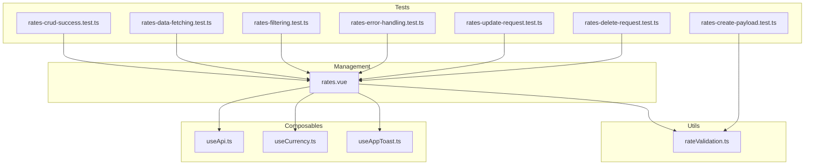
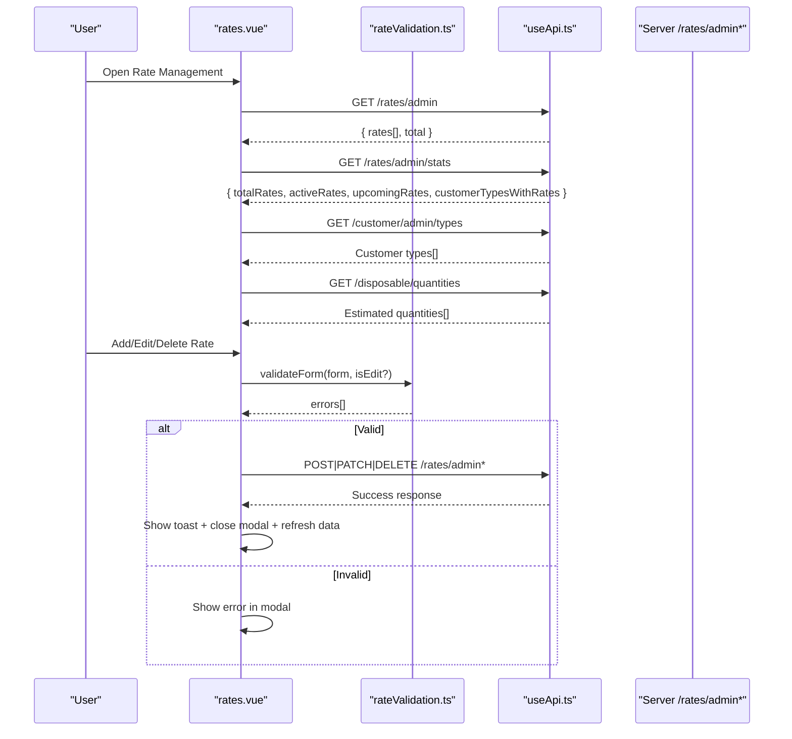
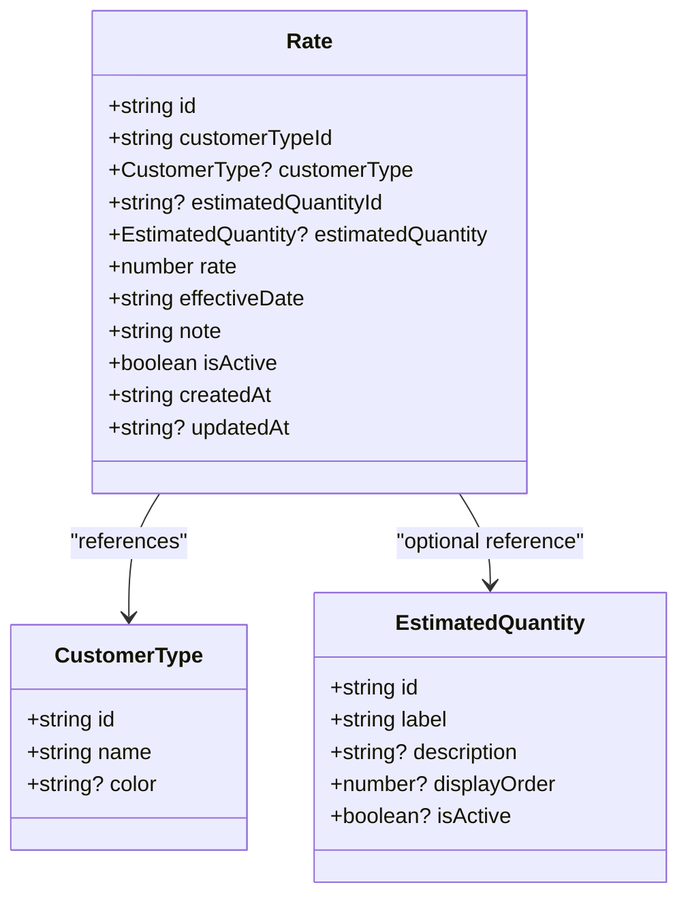
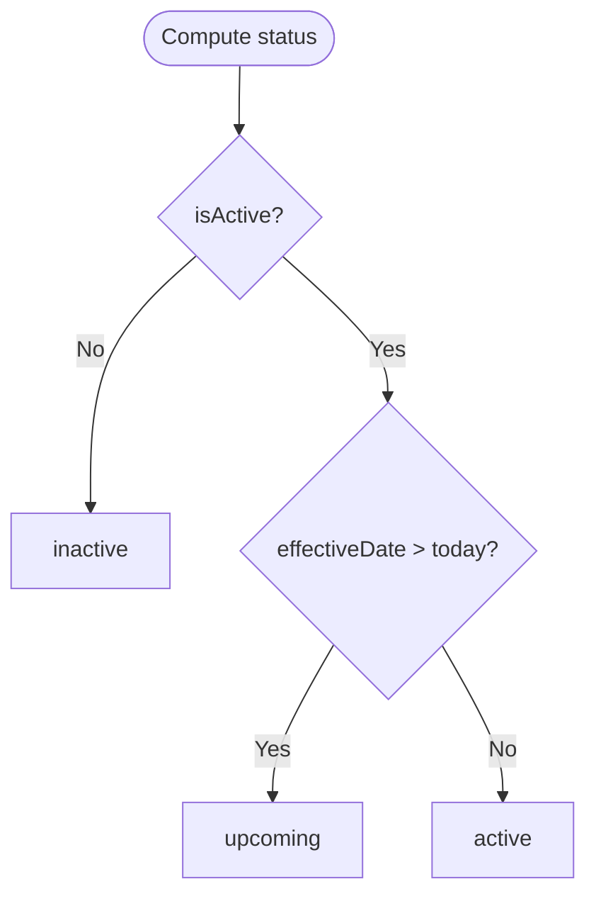
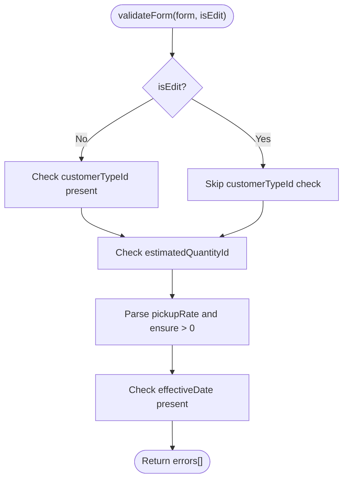
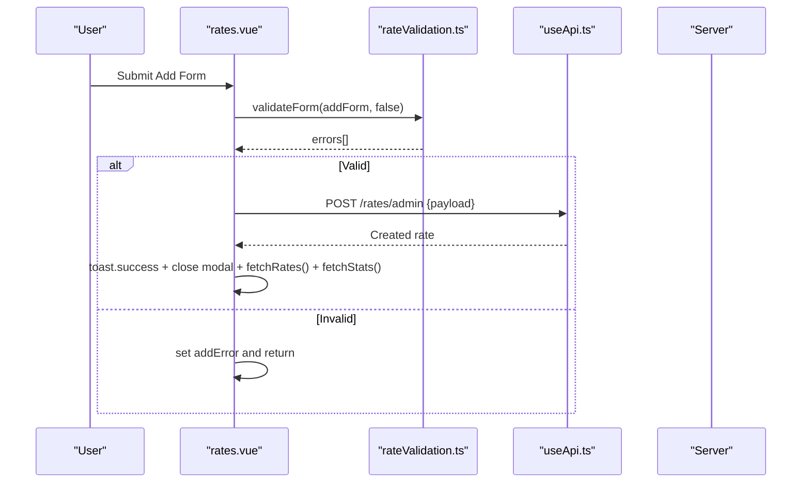
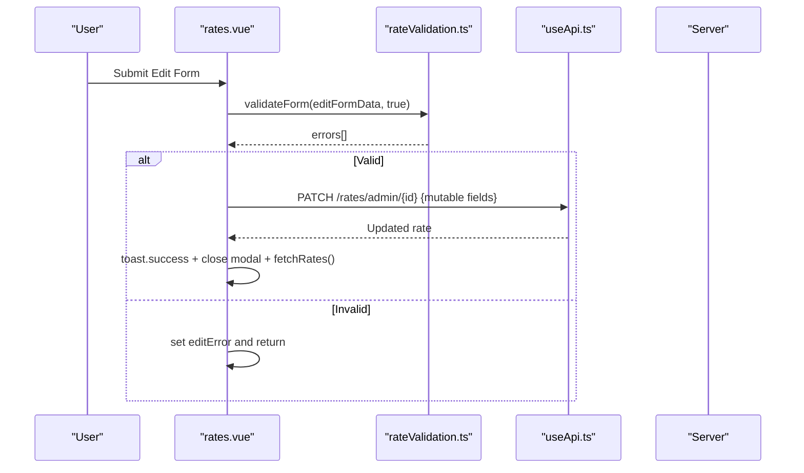
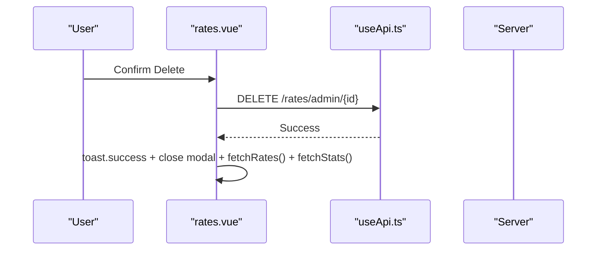
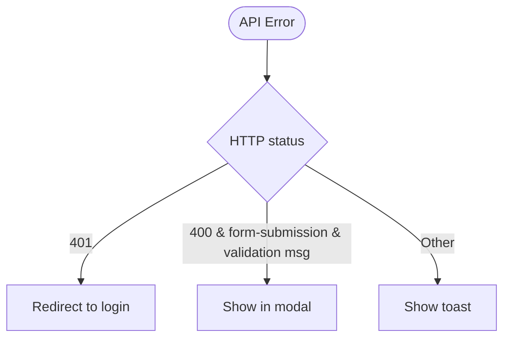
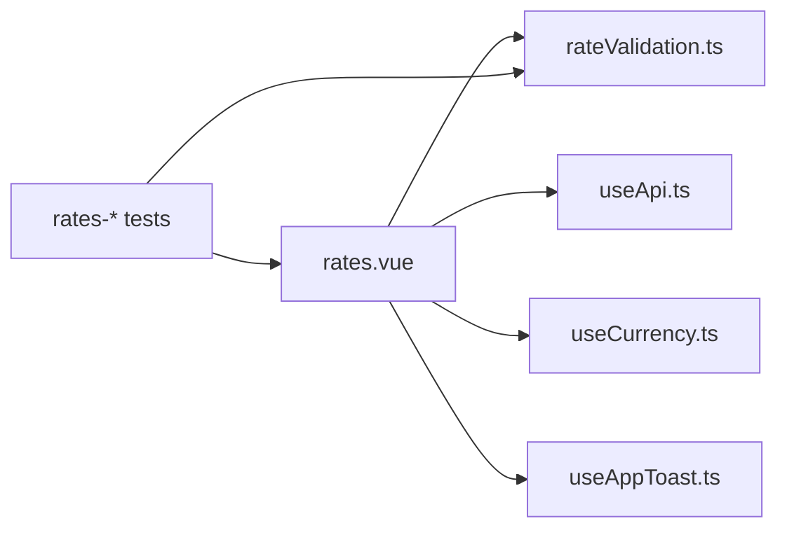

# Rates & Pricing Management

<cite>
**Referenced Files in This Document**
- [rates.vue](file://app/pages/management/rates.vue)
- [rateValidation.ts](file://app/utils/rateValidation.ts)
- [useApi.ts](file://app/composables/useApi.ts)
- [useCurrency.ts](file://app/composables/useCurrency.ts)
- [useAppToast.ts](file://app/composables/useToast.ts)
- [rates-create-payload.test.ts](file://app/pages/management/__tests__/rates-create-payload.test.ts)
- [rates-crud-success.test.ts](file://app/pages/management/__tests__/rates-crud-success.test.ts)
- [rates-data-fetching.test.ts](file://app/pages/management/__tests__/rates-data-fetching.test.ts)
- [rates-filtering.test.ts](file://app/pages/management/__tests__/rates-filtering.test.ts)
- [rates-error-handling.test.ts](file://app/pages/management/__tests__/rates-error-handling.test.ts)
- [rates-update-request.test.ts](file://app/pages/management/__tests__/rates-update-request.test.ts)
- [rates-delete-request.test.ts](file://app/pages/management/__tests__/rates-delete-request.test.ts)
</cite>

## Table of Contents
1. [Introduction](#introduction)
2. [Project Structure](#project-structure)
3. [Core Components](#core-components)
4. [Architecture Overview](#architecture-overview)
5. [Detailed Component Analysis](#detailed-component-analysis)
6. [Dependency Analysis](#dependency-analysis)
7. [Performance Considerations](#performance-considerations)
8. [Troubleshooting Guide](#troubleshooting-guide)
9. [Conclusion](#conclusion)
10. [Appendices](#appendices)

## Introduction
This document explains the rates and pricing management system for pay-as-you-go pickup rates. It covers how to configure pricing structures, rate calculations, and billing rules; the data model; validation rules; complete CRUD operations with success scenarios; data fetching patterns; filtering capabilities; payload creation; update and deletion workflows; error handling strategies; integration points with the API; and the testing approach that validates behavior across CRUD, data fetching, filtering, validation, and error scenarios.

## Project Structure
The rates feature is implemented as a single-page component under the management section, with shared utilities for validation and composables for API calls, currency formatting, and toast notifications. Tests are co-located next to the page to validate properties of the implementation.

**Diagram sources**
- [rates.vue:1-882](file://app/pages/management/rates.vue#L1-L882)
- [rateValidation.ts:1-69](file://app/utils/rateValidation.ts#L1-L69)
- [useApi.ts](file://app/composables/useApi.ts)
- [useCurrency.ts](file://app/composables/useCurrency.ts)
- [useAppToast.ts](file://app/composables/useToast.ts)
- [rates-create-payload.test.ts:1-192](file://app/pages/management/__tests__/rates-create-payload.test.ts#L1-L192)
- [rates-crud-success.test.ts:1-450](file://app/pages/management/__tests__/rates-crud-success.test.ts#L1-L450)
- [rates-data-fetching.test.ts:1-277](file://app/pages/management/__tests__/rates-data-fetching.test.ts#L1-L277)
- [rates-filtering.test.ts:1-444](file://app/pages/management/__tests__/rates-filtering.test.ts#L1-L444)
- [rates-error-handling.test.ts:1-433](file://app/pages/management/__tests__/rates-error-handling.test.ts#L1-L433)
- [rates-update-request.test.ts:1-188](file://app/pages/management/__tests__/rates-update-request.test.ts#L1-L188)
- [rates-delete-request.test.ts:1-130](file://app/pages/management/__tests__/rates-delete-request.test.ts#L1-L130)

**Section sources**
- [rates.vue:1-882](file://app/pages/management/rates.vue#L1-L882)
- [rateValidation.ts:1-69](file://app/utils/rateValidation.ts#L1-L69)

## Core Components
- Rate page (rates.vue): Implements UI state, data fetching, filtering, modals for add/edit/delete, and API interactions.
- Validation utility (rateValidation.ts): Provides form validation and payload transformation for create operations.
- Composables:
  - useApi: HTTP client wrapper used for GET/PATCH/DELETE requests and centralized error handling.
  - useCurrency: Currency formatter used to display amounts consistently.
  - useAppToast: Toast notification service for user feedback.

Key responsibilities:
- Fetch rates, stats, customer types, and estimated quantity tiers on mount.
- Filter by customer type and status (active/upcoming/inactive).
- Create, update, and delete rates via admin endpoints.
- Validate forms before submission and transform payloads for API consumption.
- Display success/error feedback and refresh relevant data after mutations.

**Section sources**
- [rates.vue:1-882](file://app/pages/management/rates.vue#L1-L882)
- [rateValidation.ts:1-69](file://app/utils/rateValidation.ts#L1-L69)
- [useApi.ts](file://app/composables/useApi.ts)
- [useCurrency.ts](file://app/composables/useCurrency.ts)
- [useAppToast.ts](file://app/composables/useToast.ts)

## Architecture Overview
The rates page orchestrates data flow between UI state, validation, and API endpoints. It uses composables for cross-cutting concerns like HTTP requests, currency formatting, and notifications.

**Diagram sources**
- [rates.vue:67-124](file://app/pages/management/rates.vue#L67-L124)
- [rates.vue:230-281](file://app/pages/management/rates.vue#L230-L281)
- [rates.vue:315-388](file://app/pages/management/rates.vue#L315-L388)
- [rates.vue:407-434](file://app/pages/management/rates.vue#L407-L434)
- [rateValidation.ts:27-68](file://app/utils/rateValidation.ts#L27-L68)

## Detailed Component Analysis

### Data Model and State
- Rate entity includes identifiers, associated customer type, optional estimated quantity tier, numeric rate value, effective date, note, active flag, timestamps, and optional server-provided status.
- The page maintains local lists for customer types and estimated quantities, plus computed filters and statistics.

**Diagram sources**
- [rates.vue:18-34](file://app/pages/management/rates.vue#L18-L34)

**Section sources**
- [rates.vue:18-34](file://app/pages/management/rates.vue#L18-L34)

### API Endpoints and Integration Points
- GET /rates/admin: Returns paginated or filtered list of rates and totals.
- GET /rates/admin/stats: Returns dashboard metrics.
- GET /customer/admin/types: Returns available customer types.
- GET /disposable/quantities: Returns active estimated quantity tiers.
- POST /rates/admin: Creates a new rate.
- PATCH /rates/admin/{id}: Updates an existing rate.
- DELETE /rates/admin/{id}: Deletes a rate.

Notes:
- The page uses useApi methods get, patch, del, and raw request for custom control over error handling.
- Error responses are handled centrally by useApi and useErrorHandler, while specific 400 validation messages during form submissions are surfaced in modals.

**Section sources**
- [rates.vue:67-124](file://app/pages/management/rates.vue#L67-L124)
- [rates.vue:134-173](file://app/pages/management/rates.vue#L134-L173)
- [rates.vue:230-281](file://app/pages/management/rates.vue#L230-L281)
- [rates.vue:315-388](file://app/pages/management/rates.vue#L315-L388)
- [rates.vue:407-434](file://app/pages/management/rates.vue#L407-L434)

### Filtering and Status Logic
- Filters:
  - By customer type: matches rate.customerTypeId against selected ID or shows all if “all”.
  - By status: computes status per rate using isActive and effectiveDate relative to today.
- Status computation:
  - inactive when isActive is false.
  - upcoming when isActive is true and effectiveDate is in the future.
  - active otherwise.

**Diagram sources**
- [rates.vue:175-185](file://app/pages/management/rates.vue#L175-L185)

**Section sources**
- [rates.vue:175-185](file://app/pages/management/rates.vue#L175-L185)
- [rates-filtering.test.ts:39-69](file://app/pages/management/__tests__/rates-filtering.test.ts#L39-L69)

### Validation Rules (rateValidation.ts)
- Required fields:
  - For create: customerTypeId, estimatedQuantityId, pickupRate (positive number), effectiveDate.
  - For edit: estimatedQuantityId, pickupRate (positive number), effectiveDate; customerTypeId not required.
- Output:
  - Array of human-readable error messages (empty if valid).
- Payload transformation:
  - Converts string inputs to appropriate types (e.g., numbers).
  - Trims notes.
  - Maps field names to API expectations.

**Diagram sources**
- [rateValidation.ts:27-52](file://app/utils/rateValidation.ts#L27-L52)

**Section sources**
- [rateValidation.ts:1-69](file://app/utils/rateValidation.ts#L1-L69)

### CRUD Operations and Success Scenarios

#### Create Rate
- Flow:
  - Client-side validation via validateForm.
  - Transform form to API payload via formToApiPayload.
  - POST to /rates/admin.
  - On success: show toast, close modal, refresh rates and stats.
  - On 400 validation error: surface message in modal; other errors via toast.

**Diagram sources**
- [rates.vue:230-281](file://app/pages/management/rates.vue#L230-L281)
- [rateValidation.ts:59-68](file://app/utils/rateValidation.ts#L59-L68)

**Section sources**
- [rates.vue:230-281](file://app/pages/management/rates.vue#L230-L281)
- [rates-create-payload.test.ts:1-192](file://app/pages/management/__tests__/rates-create-payload.test.ts#L1-L192)

#### Update Rate
- Flow:
  - Prepare edit form mapping (including temporary string fields).
  - Validate with validateForm(formData, true).
  - Build payload with only mutable fields (rate, estimatedQuantityId, effectiveDate, note, isActive).
  - PATCH /rates/admin/{id}.
  - On success: toast, close modal, refresh rates.

**Diagram sources**
- [rates.vue:315-388](file://app/pages/management/rates.vue#L315-L388)

**Section sources**
- [rates.vue:315-388](file://app/pages/management/rates.vue#L315-L388)
- [rates-update-request.test.ts:1-188](file://app/pages/management/__tests__/rates-update-request.test.ts#L1-L188)

#### Delete Rate
- Flow:
  - Confirm deletion.
  - DELETE /rates/admin/{id}.
  - On success: toast, close modal, refresh rates and stats.

**Diagram sources**
- [rates.vue:407-434](file://app/pages/management/rates.vue#L407-L434)

**Section sources**
- [rates.vue:407-434](file://app/pages/management/rates.vue#L407-L434)
- [rates-delete-request.test.ts:1-130](file://app/pages/management/__tests__/rates-delete-request.test.ts#L1-L130)

### Data Fetching Patterns
- Initial load:
  - Parallel fetches for rates, stats, customer types, and estimated quantities.
- Response normalization:
  - Handles both array and object-wrapped responses for customer types and quantities.
- Stats mapping:
  - Normalizes customerTypes vs customerTypesWithRates to a single count.

**Section sources**
- [rates.vue:67-124](file://app/pages/management/rates.vue#L67-L124)
- [rates.vue:134-173](file://app/pages/management/rates.vue#L134-L173)
- [rates-data-fetching.test.ts:1-277](file://app/pages/management/__tests__/rates-data-fetching.test.ts#L1-L277)

### Filtering Capabilities
- Type filter:
  - Matches rate.customerTypeId or shows all.
- Status filter:
  - Uses computed status based on isActive and effectiveDate.
- Combined filtering:
  - Applies both filters concurrently and displays result counts.

**Section sources**
- [rates.vue:181-185](file://app/pages/management/rates.vue#L181-L185)
- [rates-filtering.test.ts:71-136](file://app/pages/management/__tests__/rates-filtering.test.ts#L71-L136)
- [rates-filtering.test.ts:138-224](file://app/pages/management/__tests__/rates-filtering.test.ts#L138-L224)
- [rates-filtering.test.ts:226-330](file://app/pages/management/__tests__/rates-filtering.test.ts#L226-L330)
- [rates-filtering.test.ts:332-444](file://app/pages/management/__tests__/rates-filtering.test.ts#L332-L444)

### Error Handling Strategies
- 401 Unauthorized:
  - Redirects to login (handled by useApi).
- 400 Validation errors:
  - For form submissions: displayed in modal.
  - For non-form operations: shown via toast.
- 403/404/500 and network errors:
  - Shown via toast through useErrorHandler.

**Diagram sources**
- [rates.vue:230-281](file://app/pages/management/rates.vue#L230-L281)
- [rates.vue:315-388](file://app/pages/management/rates.vue#L315-L388)
- [rates-error-handling.test.ts:88-121](file://app/pages/management/__tests__/rates-error-handling.test.ts#L88-L121)

**Section sources**
- [rates-error-handling.test.ts:1-433](file://app/pages/management/__tests__/rates-error-handling.test.ts#L1-L433)

### Testing Approach
- Property-based tests validate:
  - Payload structure and transformations for create/update.
  - CRUD success flows (toast, modal closure, data refresh).
  - Data fetching completeness and rendering.
  - Filtering correctness (type/status and combined).
  - Validation completeness and failure/success handling.
  - HTTP error handling behaviors across operation types.

Examples covered:
- Create payload fields and types.
- Update payload excludes immutable fields and trims notes.
- Delete endpoint construction and method usage.
- Statistics and rate data rendering completeness.
- Filtering edge cases and counts.
- Error routing for 401/400/403/404/500/network.

**Section sources**
- [rates-create-payload.test.ts:1-192](file://app/pages/management/__tests__/rates-create-payload.test.ts#L1-L192)
- [rates-crud-success.test.ts:1-450](file://app/pages/management/__tests__/rates-crud-success.test.ts#L1-L450)
- [rates-data-fetching.test.ts:1-277](file://app/pages/management/__tests__/rates-data-fetching.test.ts#L1-L277)
- [rates-filtering.test.ts:1-444](file://app/pages/management/__tests__/rates-filtering.test.ts#L1-L444)
- [rates-error-handling.test.ts:1-433](file://app/pages/management/__tests__/rates-error-handling.test.ts#L1-L433)
- [rates-update-request.test.ts:1-188](file://app/pages/management/__tests__/rates-update-request.test.ts#L1-L188)
- [rates-delete-request.test.ts:1-130](file://app/pages/management/__tests__/rates-delete-request.test.ts#L1-L130)

## Dependency Analysis
- rates.vue depends on:
  - rateValidation.ts for validation and payload transformation.
  - useApi.ts for HTTP operations and centralized error handling.
  - useCurrency.ts for consistent amount formatting.
  - useAppToast.ts for user feedback.
- Tests depend on the same modules to assert behavior and contracts.

**Diagram sources**
- [rates.vue:1-882](file://app/pages/management/rates.vue#L1-L882)
- [rateValidation.ts:1-69](file://app/utils/rateValidation.ts#L1-L69)
- [useApi.ts](file://app/composables/useApi.ts)
- [useCurrency.ts](file://app/composables/useCurrency.ts)
- [useAppToast.ts](file://app/composables/useToast.ts)

**Section sources**
- [rates.vue:1-882](file://app/pages/management/rates.vue#L1-L882)
- [rateValidation.ts:1-69](file://app/utils/rateValidation.ts#L1-L69)

## Performance Considerations
- Parallel initialization:
  - Use Promise.all to fetch independent datasets (rates, stats, customer types, quantities) on mount to reduce perceived latency.
- Local filtering:
  - Client-side filtering avoids extra server round-trips for simple type/status filters.
- Minimal payload updates:
  - Update payloads include only mutable fields to minimize body size and potential conflicts.
- Efficient re-renders:
  - Keep computed filters lightweight; avoid unnecessary recomputation by relying on reactive refs and computed properties.

[No sources needed since this section provides general guidance]

## Troubleshooting Guide
Common issues and resolutions:
- Missing or invalid fields:
  - Ensure customerTypeId is provided for create; estimatedQuantityId, positive pickupRate, and effectiveDate are always required.
  - For edits, customerTypeId is not required.
- Unexpected payload format:
  - Verify field names and types match API expectations (e.g., numeric rate, ISO date strings, trimmed notes).
- Authentication failures:
  - 401 redirects to login; re-authenticate and retry.
- Server errors:
  - 403/404/500 and network errors appear as toasts; check backend logs and connectivity.

**Section sources**
- [rateValidation.ts:27-52](file://app/utils/rateValidation.ts#L27-L52)
- [rates-error-handling.test.ts:125-164](file://app/pages/management/__tests__/rates-error-handling.test.ts#L125-L164)

## Conclusion
The rates and pricing management system provides a robust, test-backed interface for managing pay-as-you-go pickup rates. It enforces clear validation rules, supports flexible filtering, and integrates cleanly with the backend via well-defined endpoints. The comprehensive property-based tests ensure reliability across CRUD operations, data fetching, filtering, validation, and error handling.

[No sources needed since this section summarizes without analyzing specific files]

## Appendices

### Configuration Examples and Best Practices
- Creating a base rate for a customer type:
  - Select a customer type, choose an estimated quantity tier (or leave blank for all), set a positive rate, effective date, optional note, and toggle active.
- Setting up tiered pricing:
  - Create multiple rates per customer type with different estimated quantity IDs to apply different rates per volume tier.
- Managing discounts:
  - Use notes to document discount rationale; maintain separate records per effective period to track changes over time.
- Updating existing rates:
  - Edit only mutable fields (rate, estimatedQuantityId, effectiveDate, note, isActive); customerTypeId remains unchanged.
- Deleting obsolete rates:
  - Confirm deletion; the system refreshes both list and stats automatically.

[No sources needed since this section provides general guidance]