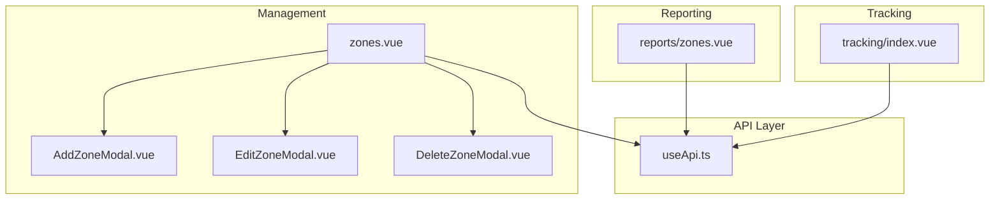
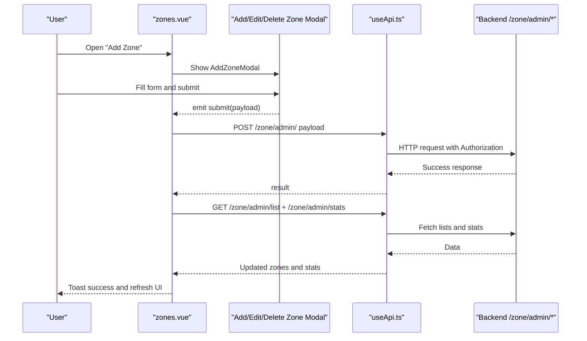
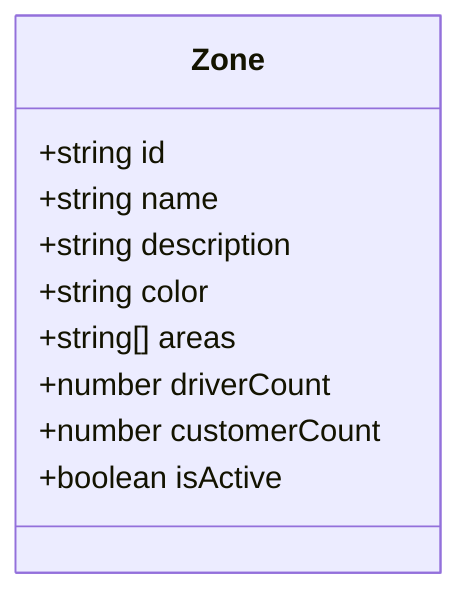
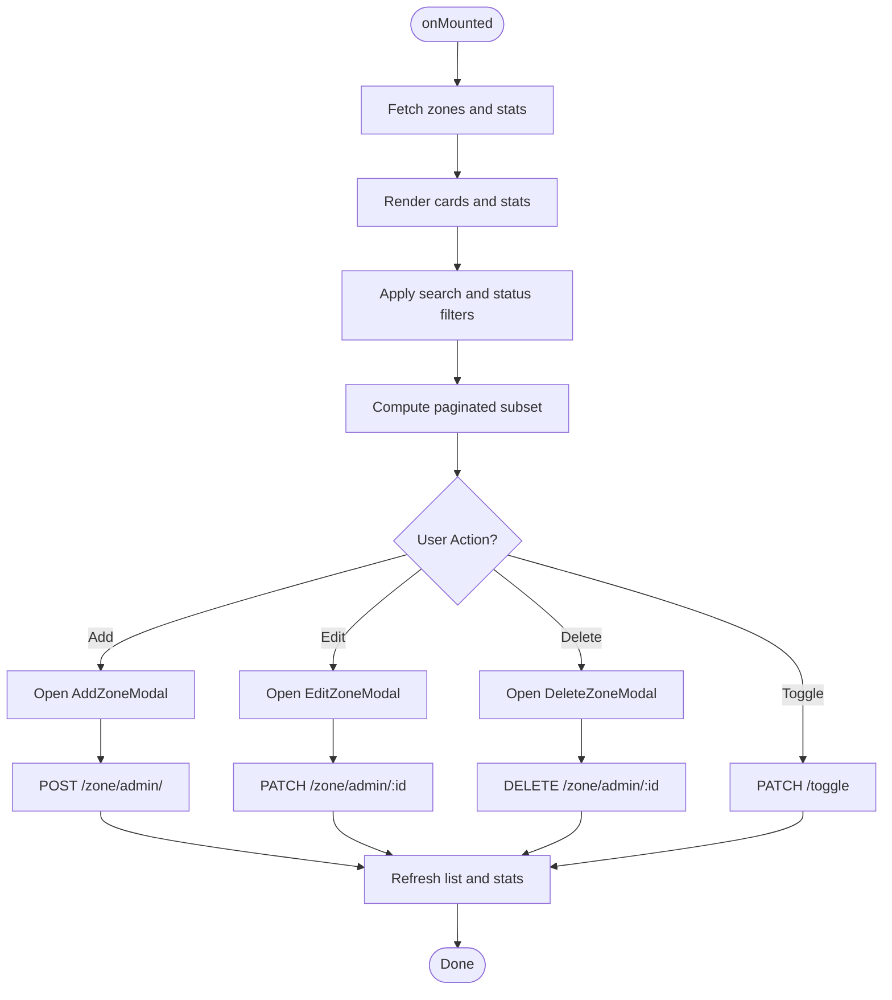
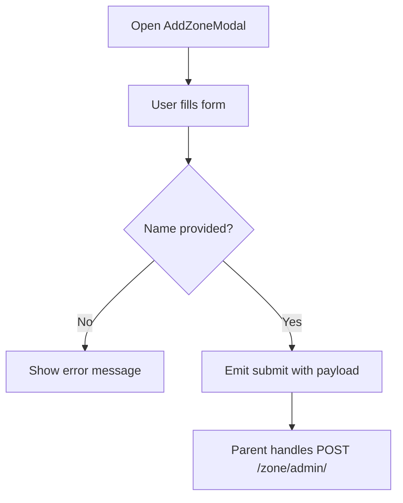
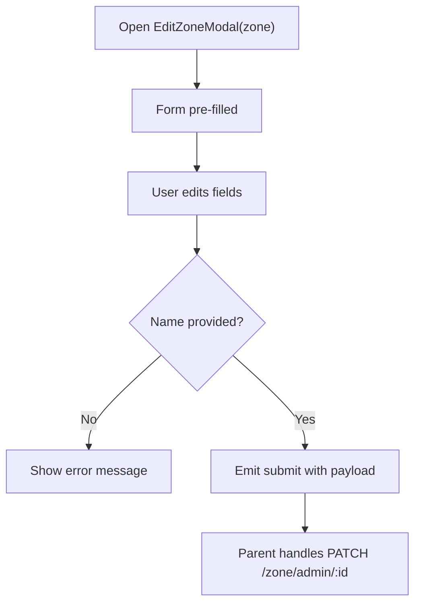
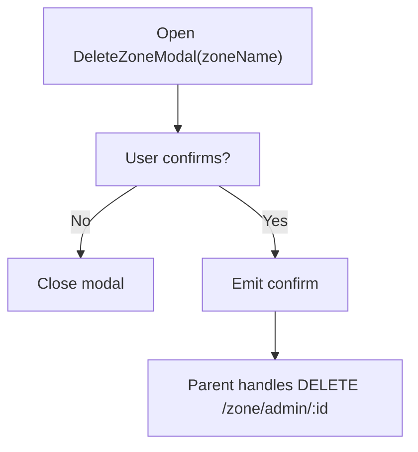
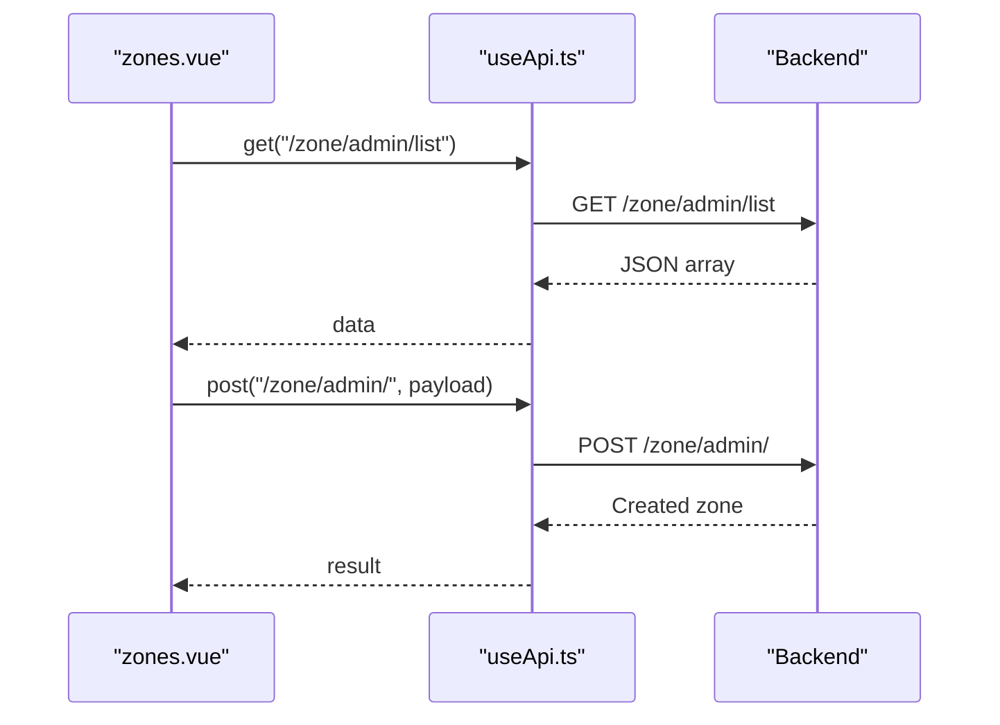
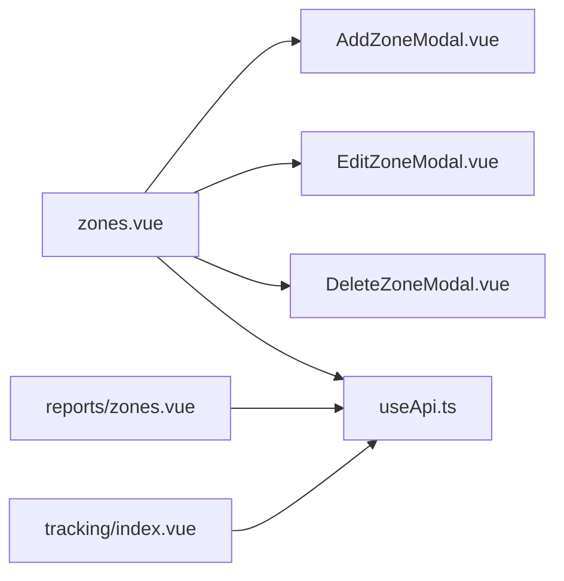

# Service Zones & Geofencing

<cite>
**Referenced Files in This Document**
- [zones.vue](file://app/pages/management/zones.vue)
- [AddZoneModal.vue](file://app/components/AddZoneModal.vue)
- [EditZoneModal.vue](file://app/components/EditZoneModal.vue)
- [DeleteZoneModal.vue](file://app/components/DeleteZoneModal.vue)
- [useApi.ts](file://app/composables/useApi.ts)
- [zones-report.vue](file://app/pages/reports/zones.vue)
- [tracking-index.vue](file://app/pages/tracking/index.vue)
</cite>

## Table of Contents
1. [Introduction](#introduction)
2. [Project Structure](#project-structure)
3. [Core Components](#core-components)
4. [Architecture Overview](#architecture-overview)
5. [Detailed Component Analysis](#detailed-component-analysis)
6. [Dependency Analysis](#dependency-analysis)
7. [Performance Considerations](#performance-considerations)
8. [Troubleshooting Guide](#troubleshooting-guide)
9. [Conclusion](#conclusion)
10. [Appendices](#appendices)

## Introduction
This document explains the service zones and geofencing management system implemented in the console application. It covers how to define geographic service areas, set up delivery zones, manage location-based restrictions, and understand the zone data model including boundaries, coverage areas, and associated settings. It also documents the modal components for adding, editing, and deleting zones, form validation, user interaction patterns, integration with the tracking system for route optimization and service area enforcement, and zone-based pricing implications and customer assignment logic.

## Project Structure
The zone management feature is centered around a dedicated page and three reusable modals:
- Management page for listing, filtering, and managing zones
- Add Zone modal for creating new zones
- Edit Zone modal for updating existing zones
- Delete Zone modal for removing zones

**Diagram sources**
- [zones.vue:1-360](file://app/pages/management/zones.vue#L1-L360)
- [AddZoneModal.vue:1-87](file://app/components/AddZoneModal.vue#L1-L87)
- [EditZoneModal.vue:1-105](file://app/components/EditZoneModal.vue#L1-L105)
- [DeleteZoneModal.vue:1-37](file://app/components/DeleteZoneModal.vue#L1-L37)
- [useApi.ts:1-91](file://app/composables/useApi.ts#L1-L91)
- [zones-report.vue:1-245](file://app/pages/reports/zones.vue#L1-L245)
- [tracking-index.vue:1-502](file://app/pages/tracking/index.vue#L1-L502)

**Section sources**
- [zones.vue:1-360](file://app/pages/management/zones.vue#L1-L360)
- [AddZoneModal.vue:1-87](file://app/components/AddZoneModal.vue#L1-L87)
- [EditZoneModal.vue:1-105](file://app/components/EditZoneModal.vue#L1-L105)
- [DeleteZoneModal.vue:1-37](file://app/components/DeleteZoneModal.vue#L1-L37)
- [useApi.ts:1-91](file://app/composables/useApi.ts#L1-L91)
- [zones-report.vue:1-245](file://app/pages/reports/zones.vue#L1-L245)
- [tracking-index.vue:1-502](file://app/pages/tracking/index.vue#L1-L502)

## Core Components
- Zone list and operations page: provides search, status filter, pagination, activation toggle, and CRUD via modals.
- Add Zone modal: collects name, description, color, areas (one per line), and active state; validates required fields before submission.
- Edit Zone modal: pre-populates from an existing zone, supports same fields and validation as add.
- Delete Zone modal: confirmation dialog for destructive action.
- API composable: centralized HTTP client with auth headers, error handling, and typed helpers.

Key responsibilities:
- UI orchestration and state management on the zones page
- Form input and validation within modals
- API calls for listing, stats, create, update, delete, and toggle status
- Error presentation via toast notifications

**Section sources**
- [zones.vue:22-145](file://app/pages/management/zones.vue#L22-L145)
- [AddZoneModal.vue:1-87](file://app/components/AddZoneModal.vue#L1-L87)
- [EditZoneModal.vue:1-105](file://app/components/EditZoneModal.vue#L1-L105)
- [DeleteZoneModal.vue:1-37](file://app/components/DeleteZoneModal.vue#L1-L37)
- [useApi.ts:1-91](file://app/composables/useApi.ts#L1-L91)

## Architecture Overview
The zone management follows a simple page-to-modal pattern backed by REST endpoints through a shared API composable. The reporting and tracking pages consume related data but are not directly coupled to zone creation/editing.

**Diagram sources**
- [zones.vue:84-95](file://app/pages/management/zones.vue#L84-L95)
- [AddZoneModal.vue:15-25](file://app/components/AddZoneModal.vue#L15-L25)
- [useApi.ts:69-89](file://app/composables/useApi.ts#L69-L89)

## Detailed Component Analysis

### Zone Data Model
The frontend represents a zone with the following properties:
- id: string
- name: string
- description: string
- color: string
- areas: string[]
- driverCount: number
- customerCount: number
- isActive: boolean

Coverage areas are represented as a list of strings (e.g., locality or neighborhood names). There is no polygon geometry stored in this view layer; boundary definitions are textual.

**Diagram sources**
- [zones.vue:4-13](file://app/pages/management/zones.vue#L4-L13)
- [EditZoneModal.vue:2-11](file://app/components/EditZoneModal.vue#L2-L11)

**Section sources**
- [zones.vue:4-13](file://app/pages/management/zones.vue#L4-L13)
- [EditZoneModal.vue:2-11](file://app/components/EditZoneModal.vue#L2-L11)

### Zone List Page (zones.vue)
Responsibilities:
- Fetches zone list and statistics on mount
- Provides search and status filters
- Paginates results locally
- Opens modals for add/edit/delete
- Toggles zone active/inactive status
- Displays counts for customers and drivers per zone

Key flows:
- Initialization: fetches both list and stats concurrently
- Filtering: computed filter based on search text and status
- Pagination: local slice based on current page and per-page size
- Actions: create, update, delete, toggle active

**Diagram sources**
- [zones.vue:47-51](file://app/pages/management/zones.vue#L47-L51)
- [zones.vue:56-72](file://app/pages/management/zones.vue#L56-L72)
- [zones.vue:84-145](file://app/pages/management/zones.vue#L84-L145)

**Section sources**
- [zones.vue:22-145](file://app/pages/management/zones.vue#L22-L145)

### Add Zone Modal (AddZoneModal.vue)
Behavior:
- Collects name, description, color, areas (one per line), and active state
- Validates that name is non-empty
- Emits submit event with normalized payload (areas split by newline and trimmed)

Validation rules:
- Name is required
- Areas are optional; empty lines are filtered out

User interactions:
- Close on backdrop click
- Submit triggers parent handler which posts to API

**Diagram sources**
- [AddZoneModal.vue:15-25](file://app/components/AddZoneModal.vue#L15-L25)

**Section sources**
- [AddZoneModal.vue:1-87](file://app/components/AddZoneModal.vue#L1-L87)

### Edit Zone Modal (EditZoneModal.vue)
Behavior:
- Pre-populates form from passed zone prop
- Same fields and validation as add modal
- Emits submit event with updated payload

User interactions:
- Close on backdrop click
- Save changes triggers parent handler which patches the zone

**Diagram sources**
- [EditZoneModal.vue:33-43](file://app/components/EditZoneModal.vue#L33-L43)

**Section sources**
- [EditZoneModal.vue:1-105](file://app/components/EditZoneModal.vue#L1-L105)

### Delete Zone Modal (DeleteZoneModal.vue)
Behavior:
- Confirms deletion with a warning
- Emits confirm when user proceeds

User interactions:
- Close on backdrop click
- Confirm triggers parent handler which deletes the zone

**Diagram sources**
- [DeleteZoneModal.vue:1-37](file://app/components/DeleteZoneModal.vue#L1-L37)

**Section sources**
- [DeleteZoneModal.vue:1-37](file://app/components/DeleteZoneModal.vue#L1-L37)

### API Integration (useApi.ts)
Responsibilities:
- Adds Authorization header if token present
- Builds full URL using runtime config base
- Handles 401 by logging out and redirecting
- Treats 200/201/204 as success
- Wraps common methods (get/post/put/patch/del) with error handling and toast titles

Integration points for zones:
- GET /zone/admin/list
- GET /zone/admin/stats
- POST /zone/admin/
- PATCH /zone/admin/:id
- PATCH /zone/admin/:id/toggle
- DELETE /zone/admin/:id

**Diagram sources**
- [useApi.ts:9-67](file://app/composables/useApi.ts#L9-L67)
- [zones.vue:37-45](file://app/pages/management/zones.vue#L37-L45)
- [zones.vue:84-95](file://app/pages/management/zones.vue#L84-L95)

**Section sources**
- [useApi.ts:1-91](file://app/composables/useApi.ts#L1-L91)
- [zones.vue:37-45](file://app/pages/management/zones.vue#L37-L45)
- [zones.vue:84-95](file://app/pages/management/zones.vue#L84-L95)

### Reporting and Analytics (reports/zones.vue)
Purpose:
- Visualizes zone performance metrics such as pickups, revenue, completion rate trends, and breakdown tables
- Uses static sample data for demonstration

Relationship to zones:
- Complements operational management with analytics
- Not directly tied to zone CRUD operations

**Section sources**
- [zones-report.vue:1-245](file://app/pages/reports/zones.vue#L1-L245)

### Tracking Integration (tracking/index.vue)
Purpose:
- Live map of drivers with real-time SSE updates
- Renders markers and popups for driver details

Relationship to zones:
- Can be used alongside zone management to visualize driver activity across service areas
- No direct coupling to zone boundaries in this implementation

**Section sources**
- [tracking-index.vue:1-502](file://app/pages/tracking/index.vue#L1-L502)

## Dependency Analysis
High-level dependencies:
- zones.vue depends on AddZoneModal, EditZoneModal, DeleteZoneModal, and useApi
- Modals depend on emitted events and props
- useApi depends on runtime configuration and auth store
- Reports and tracking pages are independent consumers of their own data streams

**Diagram sources**
- [zones.vue:1-360](file://app/pages/management/zones.vue#L1-L360)
- [AddZoneModal.vue:1-87](file://app/components/AddZoneModal.vue#L1-L87)
- [EditZoneModal.vue:1-105](file://app/components/EditZoneModal.vue#L1-L105)
- [DeleteZoneModal.vue:1-37](file://app/components/DeleteZoneModal.vue#L1-L37)
- [useApi.ts:1-91](file://app/composables/useApi.ts#L1-L91)
- [zones-report.vue:1-245](file://app/pages/reports/zones.vue#L1-L245)
- [tracking-index.vue:1-502](file://app/pages/tracking/index.vue#L1-L502)

**Section sources**
- [zones.vue:1-360](file://app/pages/management/zones.vue#L1-L360)
- [useApi.ts:1-91](file://app/composables/useApi.ts#L1-L91)

## Performance Considerations
- Local filtering and pagination reduce server load for small datasets
- Concurrent fetching of list and stats improves perceived performance
- Avoid unnecessary re-renders by keeping computed filters minimal
- For large zone lists, consider server-side pagination and search to improve scalability

[No sources needed since this section provides general guidance]

## Troubleshooting Guide
Common issues and resolutions:
- 401 Unauthorized: The API composable logs out and redirects to login automatically. Ensure the session is valid and tokens are present.
- Network errors: useApi wraps failures with descriptive messages and shows toasts. Check backend availability and CORS settings.
- Empty zone list: Verify the backend returns an array or compatible structure; the page normalizes various response shapes.
- Deletion disabled: If a zone has customers assigned, the delete button is disabled to prevent data integrity issues.

Operational tips:
- Use the status filter to quickly isolate inactive zones
- Search by zone name or area tags to locate specific zones
- After toggling active/inactive, verify the card badge reflects the change

**Section sources**
- [useApi.ts:39-58](file://app/composables/useApi.ts#L39-L58)
- [zones.vue:117-145](file://app/pages/management/zones.vue#L117-L145)

## Conclusion
The service zones and geofencing system provides a straightforward interface to define and manage service areas using textual coverage entries. While it does not include interactive polygon drawing in this implementation, it offers robust CRUD operations, filtering, and status management. The design cleanly separates UI concerns into modals and centralizes API interactions through a composable. Reporting and tracking modules complement operations by providing analytics and live visibility, respectively.

[No sources needed since this section summarizes without analyzing specific files]

## Appendices

### Zone API Endpoints Summary
- GET /zone/admin/list — Retrieve all zones
- GET /zone/admin/stats — Retrieve aggregate zone statistics
- POST /zone/admin/ — Create a new zone
- PATCH /zone/admin/:id — Update an existing zone
- PATCH /zone/admin/:id/toggle — Toggle zone active/inactive
- DELETE /zone/admin/:id — Delete a zone

Notes:
- All requests include Authorization header when available
- Responses are treated as JSON; success codes include 200, 201, 204

**Section sources**
- [zones.vue:37-45](file://app/pages/management/zones.vue#L37-L45)
- [zones.vue:84-145](file://app/pages/management/zones.vue#L84-L145)
- [useApi.ts:69-89](file://app/composables/useApi.ts#L69-L89)

### User Workflows

#### Creating a Service Zone
- Navigate to Zone Management
- Click “Add Zone”
- Enter zone name (required), optional description, color, and areas (one per line)
- Toggle active if desired
- Submit to create; success toast appears and list refreshes

**Section sources**
- [zones.vue:78-95](file://app/pages/management/zones.vue#L78-L95)
- [AddZoneModal.vue:15-25](file://app/components/AddZoneModal.vue#L15-L25)

#### Editing a Service Zone
- Click “Edit” on a zone card
- Modify fields as needed
- Save changes; success toast appears and list refreshes

**Section sources**
- [zones.vue:97-115](file://app/pages/management/zones.vue#L97-L115)
- [EditZoneModal.vue:33-43](file://app/components/EditZoneModal.vue#L33-L43)

#### Deleting a Service Zone
- Click “Delete” on a zone card (disabled if customers are assigned)
- Confirm deletion in the modal
- Zone removed and list refreshes

**Section sources**
- [zones.vue:117-133](file://app/pages/management/zones.vue#L117-L133)
- [DeleteZoneModal.vue:1-37](file://app/components/DeleteZoneModal.vue#L1-L37)

### Zone-Based Pricing and Customer Assignment Logic
- The zone model includes counts for customers and drivers, indicating association metadata
- The management page displays these counts per zone
- The delete operation is guarded against deletion when customers are assigned, implying assignment constraints
- Pricing-related features exist elsewhere in the application (e.g., rates management) but are not directly modeled in the zone entity here

**Section sources**
- [zones.vue:4-13](file://app/pages/management/zones.vue#L4-L13)
- [zones.vue:318-323](file://app/pages/management/zones.vue#L318-L323)