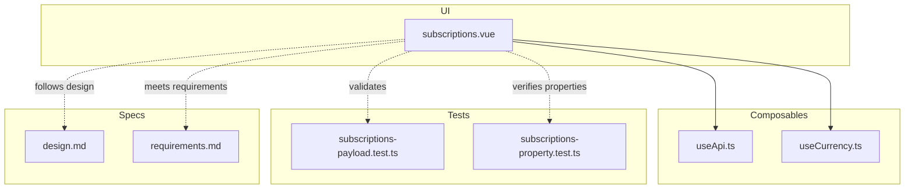
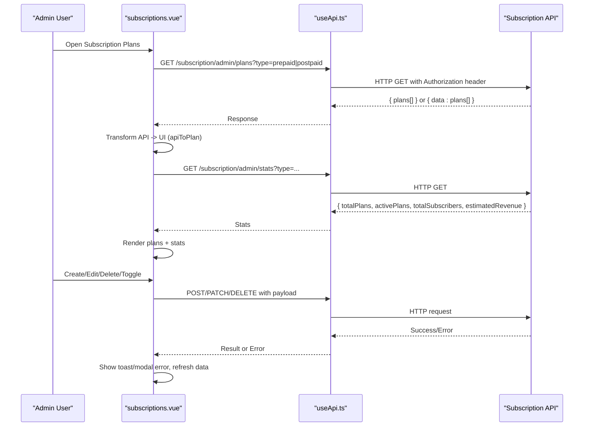
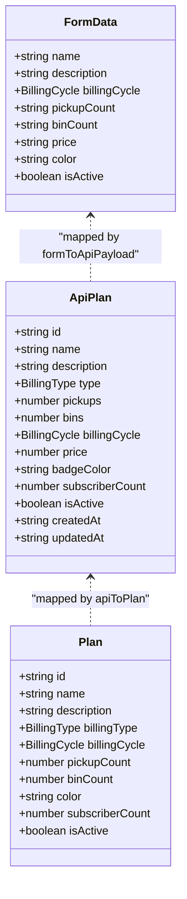
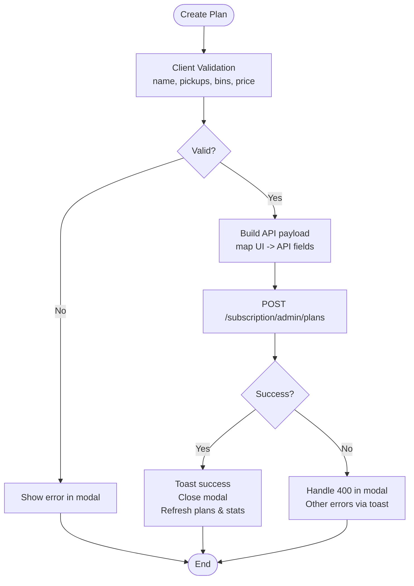
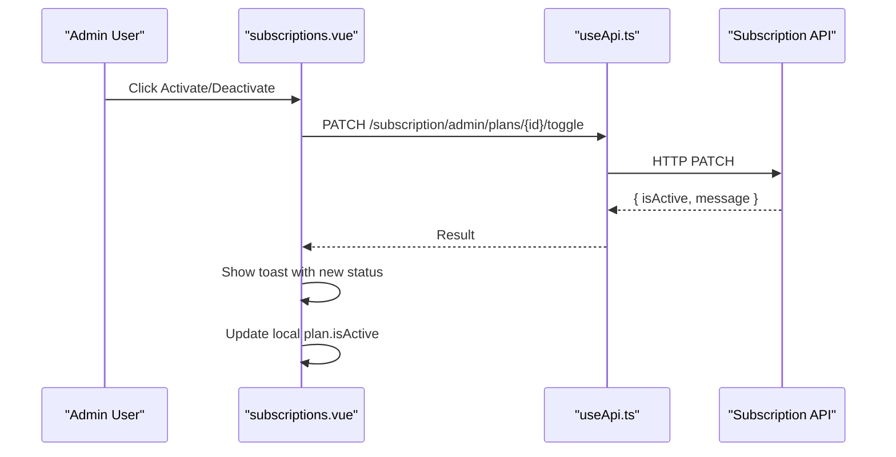
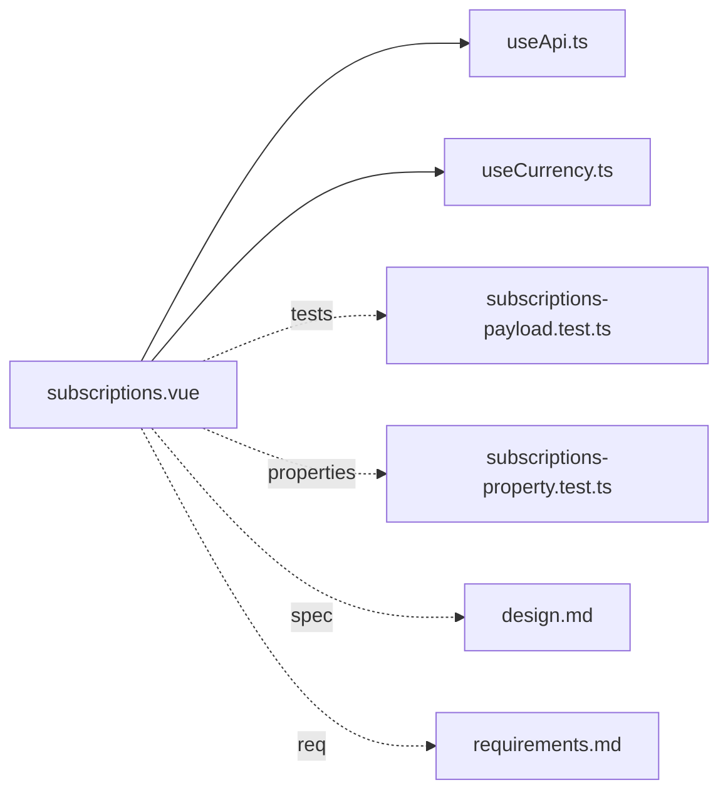

# Subscription Plans Administration

<cite>
**Referenced Files in This Document**
- [subscriptions.vue](file://app/pages/management/subscriptions.vue)
- [useApi.ts](file://app/composables/useApi.ts)
- [useCurrency.ts](file://app/composables/useCurrency.ts)
- [design.md](file://.kiro/specs/subscription-api-integration/design.md)
- [requirements.md](file://.kiro/specs/subscription-api-integration/requirements.md)
- [subscriptions-payload.test.ts](file://app/pages/management/__tests__/subscriptions-payload.test.ts)
- [subscriptions-property.test.ts](file://app/pages/management/__tests__/subscriptions-property.test.ts)
</cite>

## Table of Contents
1. [Introduction](#introduction)
2. [Project Structure](#project-structure)
3. [Core Components](#core-components)
4. [Architecture Overview](#architecture-overview)
5. [Detailed Component Analysis](#detailed-component-analysis)
6. [Dependency Analysis](#dependency-analysis)
7. [Performance Considerations](#performance-considerations)
8. [Troubleshooting Guide](#troubleshooting-guide)
9. [Conclusion](#conclusion)
10. [Appendices](#appendices)

## Introduction
This document explains the subscription plans administration system implemented in the console application. It covers how to configure subscription tiers, billing cycles, and plan features; the data model and payload structures used for API communication; concrete examples for creating different plans; testing strategy; integration points with customer management and billing systems; and workflows for activation/deactivation and historical plan management.

The system provides an admin UI to manage subscription plans (prepaid and postpaid), including creation, editing, deletion, and toggling active status. It integrates with backend endpoints via a typed HTTP composable and uses property-based tests to ensure correctness across inputs.

## Project Structure
The subscription plans feature is centered around a single Vue page that implements:
- Data fetching for plans and statistics
- CRUD operations (create, update, delete)
- Toggle active status
- Client-side validation and error handling
- UI modals for add/edit/delete flows

**Diagram sources**
- [subscriptions.vue:1-962](file://app/pages/management/subscriptions.vue#L1-L962)
- [useApi.ts:1-91](file://app/composables/useApi.ts#L1-L91)
- [useCurrency.ts:1-12](file://app/composables/useCurrency.ts#L1-L12)
- [subscriptions-payload.test.ts:1-168](file://app/pages/management/__tests__/subscriptions-payload.test.ts#L1-L168)
- [subscriptions-property.test.ts:1-1687](file://app/pages/management/__tests__/subscriptions-property.test.ts#L1-L1687)
- [design.md:1-865](file://.kiro/specs/subscription-api-integration/design.md#L1-L865)
- [requirements.md:132-143](file://.kiro/specs/subscription-api-integration/requirements.md#L132-L143)

**Section sources**
- [subscriptions.vue:1-962](file://app/pages/management/subscriptions.vue#L1-L962)
- [design.md:1-865](file://.kiro/specs/subscription-api-integration/design.md#L1-L865)

## Core Components
- Plan data model and form models:
  - UI Plan interface includes id, name, description, billingType, billingCycle, pickupCount, binCount, color, subscriberCount, isActive.
  - API Plan interface maps to server fields such as type, pickups, bins, badgeColor, createdAt, updatedAt.
  - FormData interface represents user input fields bound to forms.
- Data transformation utilities:
  - apiToPlan maps API response fields to UI fields.
  - formToApiPayload maps UI form fields to API request payloads.
- Validation logic:
  - validateForm enforces non-empty name, positive integer pick-ups and bins, and non-negative price.
- API integration:
  - useApi composable handles authentication headers, base URL, success/error responses, and wraps common HTTP methods.
- Currency formatting:
  - useCurrency formats amounts using GHS currency settings.

Key responsibilities:
- subscriptions.vue orchestrates state, lifecycle hooks, modal flows, and API calls.
- useApi.ts centralizes HTTP requests and error handling.
- Tests assert payload structure, field mappings, and property-level correctness.

**Section sources**
- [subscriptions.vue:1-130](file://app/pages/management/subscriptions.vue#L1-L130)
- [useApi.ts:1-91](file://app/composables/useApi.ts#L1-L91)
- [useCurrency.ts:1-12](file://app/composables/useCurrency.ts#L1-L12)
- [subscriptions-payload.test.ts:1-168](file://app/pages/management/__tests__/subscriptions-payload.test.ts#L1-L168)
- [subscriptions-property.test.ts:1-1687](file://app/pages/management/__tests__/subscriptions-property.test.ts#L1-L1687)

## Architecture Overview
The subscription administration flow connects the UI to backend endpoints through a typed HTTP layer. The page fetches plans and stats, transforms them into UI-friendly structures, and performs mutations with robust error handling.

**Diagram sources**
- [subscriptions.vue:153-248](file://app/pages/management/subscriptions.vue#L153-L248)
- [useApi.ts:1-91](file://app/composables/useApi.ts#L1-L91)
- [design.md:60-241](file://.kiro/specs/subscription-api-integration/design.md#L60-L241)

## Detailed Component Analysis

### Data Model and Field Mapping
- UI vs API mapping:
  - billingType ↔ type
  - pickupCount ↔ pickups
  - binCount ↔ bins
  - color ↔ badgeColor
- Additional server-only fields:
  - createdAt, updatedAt timestamps on API Plan.

**Diagram sources**
- [subscriptions.vue:1-130](file://app/pages/management/subscriptions.vue#L1-L130)
- [design.md:324-370](file://.kiro/specs/subscription-api-integration/design.md#L324-L370)

**Section sources**
- [subscriptions.vue:1-130](file://app/pages/management/subscriptions.vue#L1-L130)
- [design.md:324-370](file://.kiro/specs/subscription-api-integration/design.md#L324-L370)

### API Endpoints and Payloads
- List plans:
  - GET /subscription/admin/plans?type=prepaid|postpaid
  - Returns array of plans or wrapped object with plans/data.
- Statistics:
  - GET /subscription/admin/stats?type=prepaid|postpaid
  - Returns counts and estimated revenue.
- Create plan:
  - POST /subscription/admin/plans
  - Body includes name, description, type, pickups, bins, billingCycle, price, badgeColor, isActive.
- Update plan:
  - PATCH /subscription/admin/plans/{id}
  - Partial body with optional fields.
- Delete plan:
  - DELETE /subscription/admin/plans/{id}
  - Only allowed when subscriber count is zero.
- Toggle active:
  - PATCH /subscription/admin/plans/{id}/toggle
  - Returns new isActive status.

**Diagram sources**
- [subscriptions.vue:279-344](file://app/pages/management/subscriptions.vue#L279-L344)
- [design.md:112-148](file://.kiro/specs/subscription-api-integration/design.md#L112-L148)

**Section sources**
- [design.md:60-241](file://.kiro/specs/subscription-api-integration/design.md#L60-L241)
- [subscriptions.vue:279-344](file://app/pages/management/subscriptions.vue#L279-L344)

### Form Validation Rules
- Name must be non-empty after trimming.
- Pickups must be a positive integer.
- Bins must be a positive integer.
- Price must be a non-negative number.

Validation is enforced before any API call. Errors are surfaced in the modal for create/update flows.

**Section sources**
- [subscriptions.vue:77-107](file://app/pages/management/subscriptions.vue#L77-L107)
- [subscriptions-property.test.ts:156-321](file://app/pages/management/__tests__/subscriptions-property.test.ts#L156-L321)

### API Request Payload Structure
- Required fields include name, type, pickups, bins, billingCycle, price, badgeColor, isActive.
- Field mapping ensures UI names convert to API names consistently.
- Tests assert presence and correct mapping of all required fields.

**Section sources**
- [subscriptions-payload.test.ts:1-168](file://app/pages/management/__tests__/subscriptions-payload.test.ts#L1-L168)
- [subscriptions.vue:117-129](file://app/pages/management/subscriptions.vue#L117-L129)

### Creating Different Subscription Plans
Examples of plan configurations (conceptual):
- Basic plan:
  - Billing type: prepaid
  - Billing cycle: monthly
  - Features: limited pickups and bins
  - Price: low tier
- Premium plan:
  - Billing type: prepaid or postpaid
  - Billing cycle: quarterly
  - Features: moderate pickups and bins
  - Price: mid tier
- Enterprise plan:
  - Billing type: postpaid
  - Billing cycle: yearly
  - Features: high pickups and bins
  - Price: high tier

These examples illustrate varying features, pricing, and billing frequencies. Actual values are configured via the Add/Edit modals and persisted through the API.

[No sources needed since this section provides conceptual examples]

### Activation/Deactivation Workflow
- Toggle endpoint updates isActive status.
- On success, UI shows a contextual toast and updates local plan state immediately for responsiveness.
- Errors are handled automatically via the HTTP wrapper.

**Diagram sources**
- [subscriptions.vue:515-548](file://app/pages/management/subscriptions.vue#L515-L548)
- [design.md:221-241](file://.kiro/specs/subscription-api-integration/design.md#L221-L241)

**Section sources**
- [subscriptions.vue:515-548](file://app/pages/management/subscriptions.vue#L515-L548)
- [design.md:221-241](file://.kiro/specs/subscription-api-integration/design.md#L221-L241)

### Historical Plan Management
- API responses include createdAt and updatedAt timestamps for each plan.
- These fields enable auditing and history tracking at the data level.
- Future enhancements may include explicit audit logs and change history views.

**Section sources**
- [design.md:74-93](file://.kiro/specs/subscription-api-integration/design.md#L74-L93)
- [design.md:131-148](file://.kiro/specs/subscription-api-integration/design.md#L131-L148)

### Integration With Customer Management
- The subscription system manages plan definitions and availability.
- Customer management pages handle customer records and account states.
- Automatic plan assignment is not implemented in the current UI; it would require additional logic linking customers to selected plans during onboarding or provisioning.

[No sources needed since this section does not analyze specific files]

### Integration With Billing Systems
- Recurring payments are implied by billingCycle values (monthly, quarterly, yearly).
- The UI configures billing frequency and pricing per plan.
- Actual recurring payment orchestration is outside the scope of this UI and would integrate with a billing service based on plan configuration.

[No sources needed since this section does not analyze specific files]

## Dependency Analysis
The subscription page depends on composables for HTTP requests and currency formatting, and adheres to design specifications and requirements.

**Diagram sources**
- [subscriptions.vue:1-962](file://app/pages/management/subscriptions.vue#L1-L962)
- [useApi.ts:1-91](file://app/composables/useApi.ts#L1-L91)
- [useCurrency.ts:1-12](file://app/composables/useCurrency.ts#L1-L12)
- [subscriptions-payload.test.ts:1-168](file://app/pages/management/__tests__/subscriptions-payload.test.ts#L1-L168)
- [subscriptions-property.test.ts:1-1687](file://app/pages/management/__tests__/subscriptions-property.test.ts#L1-L1687)
- [design.md:1-865](file://.kiro/specs/subscription-api-integration/design.md#L1-L865)
- [requirements.md:132-143](file://.kiro/specs/subscription-api-integration/requirements.md#L132-L143)

**Section sources**
- [subscriptions.vue:1-962](file://app/pages/management/subscriptions.vue#L1-L962)
- [useApi.ts:1-91](file://app/composables/useApi.ts#L1-L91)
- [design.md:1-865](file://.kiro/specs/subscription-api-integration/design.md#L1-L865)

## Performance Considerations
- Parallel fetching of plans and statistics improves initial load time.
- Optimistic updates for toggle operations enhance UX by updating local state immediately.
- No caching is implemented in this phase; data is fetched fresh on each request.

[No sources needed since this section provides general guidance]

## Troubleshooting Guide
Common issues and resolutions:
- Duplicate plan name or invalid fields:
  - 400 validation errors are displayed within the modal for create/update flows.
- Unauthorized session:
  - 401 responses trigger automatic logout and redirect to login.
- Forbidden or not found:
  - 403/404 errors show error toasts via the error handler.
- Network failures:
  - Network errors display error toasts via the error handler.

Operational tips:
- Ensure the plan has zero subscribers before deleting.
- Verify billing type selection matches intended plan category.
- Confirm numeric inputs are valid integers where required.

**Section sources**
- [subscriptions.vue:279-344](file://app/pages/management/subscriptions.vue#L279-L344)
- [subscriptions.vue:372-449](file://app/pages/management/subscriptions.vue#L372-L449)
- [subscriptions.vue:475-505](file://app/pages/management/subscriptions.vue#L475-L505)
- [useApi.ts:39-58](file://app/composables/useApi.ts#L39-L58)
- [design.md:474-506](file://.kiro/specs/subscription-api-integration/design.md#L474-L506)

## Conclusion
The subscription plans administration system provides a comprehensive UI for managing plan tiers, billing cycles, and features. It integrates with backend APIs through a robust HTTP composable, enforces client-side validation, and employs property-based tests to guarantee correctness across inputs. While automatic plan assignment and recurring billing orchestration are not fully implemented in the UI, the system lays the groundwork for future integrations with customer management and billing services.

[No sources needed since this section summarizes without analyzing specific files]

## Appendices

### API Reference Summary
- GET /subscription/admin/plans?type=prepaid|postpaid
- GET /subscription/admin/stats?type=prepaid|postpaid
- POST /subscription/admin/plans
- PATCH /subscription/admin/plans/{id}
- DELETE /subscription/admin/plans/{id}
- PATCH /subscription/admin/plans/{id}/toggle

**Section sources**
- [design.md:60-241](file://.kiro/specs/subscription-api-integration/design.md#L60-L241)

### Testing Strategy Overview
- Property-based tests verify:
  - Plan data rendering completeness
  - Statistics rendering completeness
  - API request payload structure and field mappings
  - Form validation completeness and failure/success handling
  - CRUD success flows and data consistency
  - Delete and toggle operation correctness
  - Loading state management and HTTP error handling

**Section sources**
- [subscriptions-payload.test.ts:1-168](file://app/pages/management/__tests__/subscriptions-payload.test.ts#L1-L168)
- [subscriptions-property.test.ts:1-1687](file://app/pages/management/__tests__/subscriptions-property.test.ts#L1-L1687)
- [design.md:590-726](file://.kiro/specs/subscription-api-integration/design.md#L590-L726)