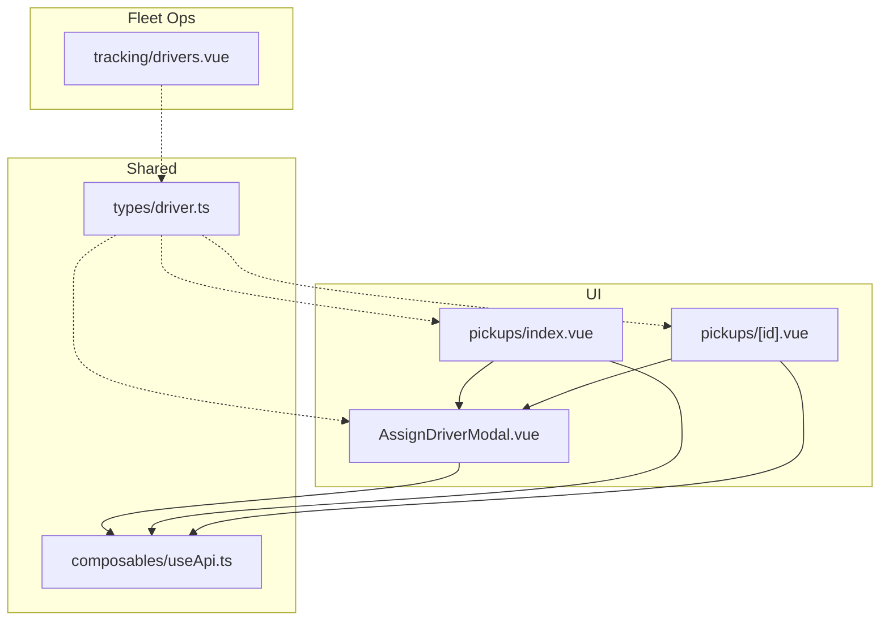
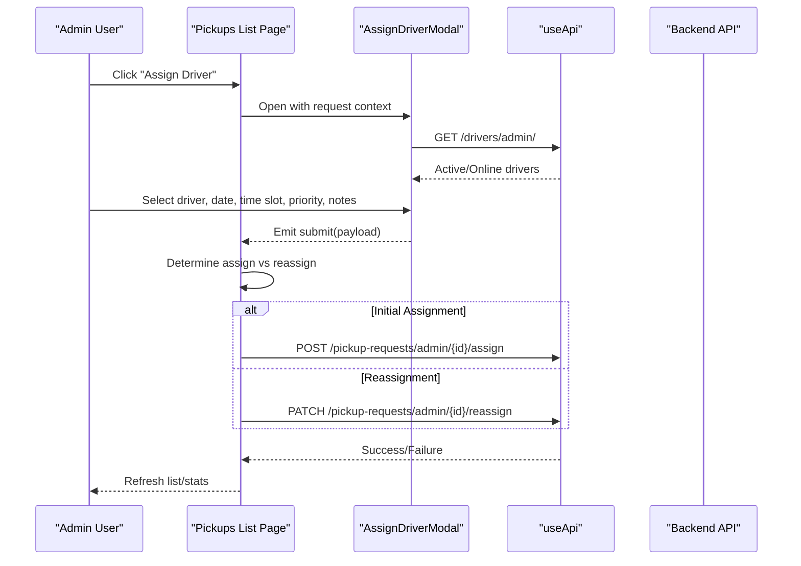
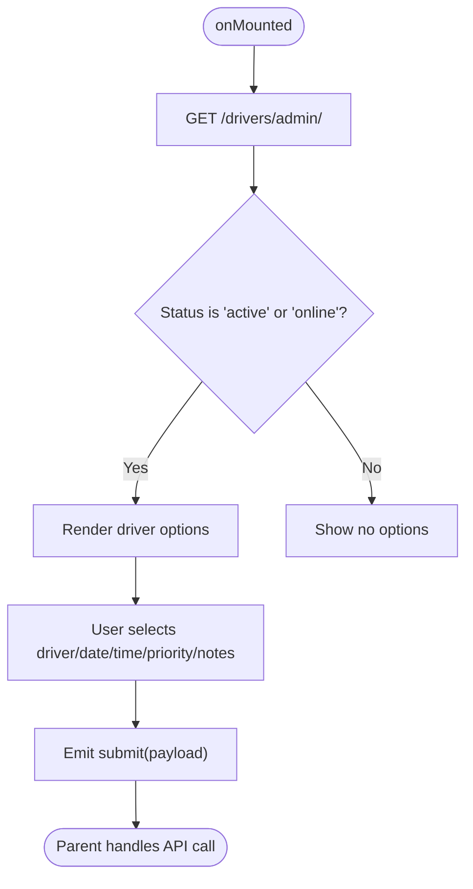
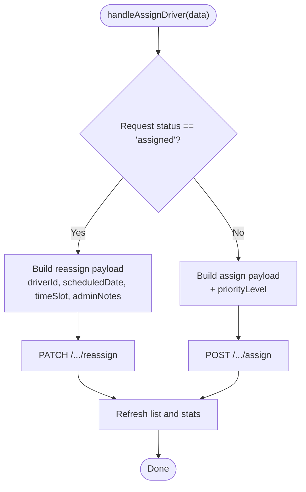
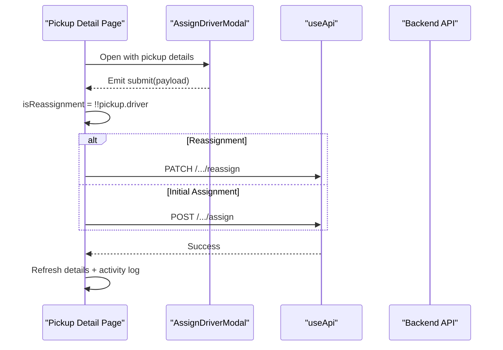
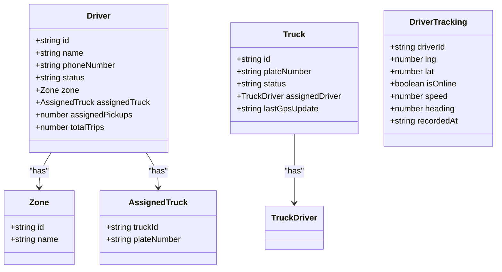
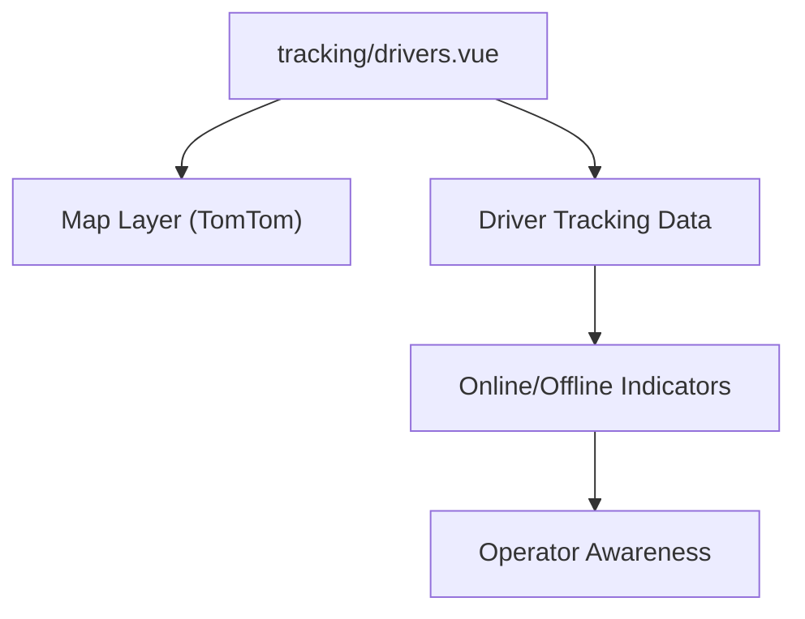
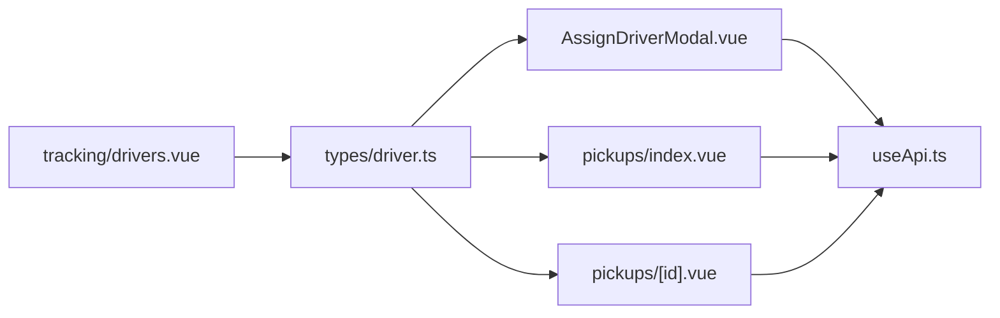

# Driver Assignment & Reassignment

<cite>
**Referenced Files in This Document**
- [AssignDriverModal.vue](file://app/components/AssignDriverModal.vue)
- [index.vue (Pickups List)](file://app/pages/pickups/index.vue)
- [id.vue (Pickup Detail)](file://app/pages/pickups/[id].vue)
- [driver.ts (Types)](file://app/types/driver.ts)
- [useApi.ts](file://app/composables/useApi.ts)
- [drivers.vue (Tracking)](file://app/pages/tracking/drivers.vue)
</cite>

## Table of Contents
1. Introduction
2. Project Structure
3. Core Components
4. Architecture Overview
5. Detailed Component Analysis
6. Dependency Analysis
7. Performance Considerations
8. Troubleshooting Guide
9. Conclusion

## Introduction
This document explains the driver assignment and reassignment system implemented in the console application. It covers:
- How drivers are selected and made available to operators
- How scheduling constraints (date/time slots) and priority levels are captured and applied
- The difference between initial assignment and reassignment flows, including API endpoints used
- Payment type handling (subscription vs pay-as-you-go) as surfaced in the UI
- Integration with fleet management (driver status, truck assignment, real-time tracking)
- Business rules reflected in the code for availability filtering and operational workflow

The goal is to provide both a high-level understanding and a code-mapped deep dive so that developers and operators can confidently use and extend the system.

## Project Structure
The assignment flow spans a reusable modal component and two pages that orchestrate the submission logic:
- AssignDriverModal: Presents request context, driver selection, time slot, priority, and admin notes
- Pickups list page: Opens the modal for pending requests; decides assign vs reassign based on current status
- Pickup detail page: Reuses the same modal for reassignment or initial assignment from the detail view
- Types: Shared TypeScript interfaces for drivers, trucks, and tracking data
- API composable: Centralized HTTP client with auth and error handling
- Tracking pages: Display online/offline status and movement for operational awareness

**Diagram sources**
- [AssignDriverModal.vue:1-222](file://app/components/AssignDriverModal.vue#L1-L222)
- [index.vue (Pickups List):187-239](file://app/pages/pickups/index.vue#L187-L239)
- [id.vue (Pickup Detail):381-431](file://app/pages/pickups/[id].vue#L381-L431)
- [driver.ts (Types):19-38](file://app/types/driver.ts#L19-L38)
- [useApi.ts:1-91](file://app/composables/useApi.ts#L1-L91)
- [drivers.vue (Tracking):102-266](file://app/pages/tracking/drivers.vue#L102-L266)

**Section sources**
- [AssignDriverModal.vue:1-222](file://app/components/AssignDriverModal.vue#L1-L222)
- [index.vue (Pickups List):187-239](file://app/pages/pickups/index.vue#L187-L239)
- [id.vue (Pickup Detail):381-431](file://app/pages/pickups/[id].vue#L381-L431)
- [driver.ts (Types):19-38](file://app/types/driver.ts#L19-L38)
- [useApi.ts:1-91](file://app/composables/useApi.ts#L1-L91)
- [drivers.vue (Tracking):102-266](file://app/pages/tracking/drivers.vue#L102-L266)

## Core Components
- AssignDriverModal
  - Displays pickup request summary (ID, customer, address, preferred date/time, bin type, payment type/detail, notes)
  - Loads active/online drivers via API
  - Captures scheduled date, time slot, priority level, and optional admin notes
  - Emits submit event with structured payload
- Pickups list page
  - Opens modal for pending requests
  - Determines if this is an initial assignment or reassignment based on request status
  - Calls appropriate endpoint (/assign or /reassign)
- Pickup detail page
  - Reuses the same modal for reassignment or initial assignment
  - Updates detail view and activity log after successful operation
- Types
  - Defines Driver, Truck, and DriverTracking structures used across components
- API composable
  - Adds Authorization header, handles 401 redirects, normalizes success/error responses
- Tracking pages
  - Visualize driver positions and online status to inform dispatch decisions

**Section sources**
- [AssignDriverModal.vue:15-74](file://app/components/AssignDriverModal.vue#L15-L74)
- [index.vue (Pickups List):187-239](file://app/pages/pickups/index.vue#L187-L239)
- [id.vue (Pickup Detail):381-431](file://app/pages/pickups/[id].vue#L381-L431)
- [driver.ts (Types):19-38](file://app/types/driver.ts#L19-L38)
- [useApi.ts:9-67](file://app/composables/useApi.ts#L9-L67)
- [drivers.vue (Tracking):102-266](file://app/pages/tracking/drivers.vue#L102-L266)

## Architecture Overview
The assignment flow is a coordinated sequence between UI components and backend endpoints. The modal collects inputs, while the parent pages decide whether to call the assign or reassign endpoint.

**Diagram sources**
- [index.vue (Pickups List):187-239](file://app/pages/pickups/index.vue#L187-L239)
- [AssignDriverModal.vue:35-56](file://app/components/AssignDriverModal.vue#L35-L56)
- [useApi.ts:70-80](file://app/composables/useApi.ts#L70-L80)

## Detailed Component Analysis

### AssignDriverModal Component
Responsibilities:
- Fetch and filter drivers by status (active or online)
- Present request summary fields including payment type badge
- Collect scheduling inputs (date, time slot), priority, and admin notes
- Emit a structured payload to the parent for submission

Key behaviors:
- Driver loading: fetches from /drivers/admin/, filters to active/online
- Time slots: Morning, Afternoon, Evening
- Priority levels: low, normal, high, urgent
- Payment type badge: Subscription vs One-time/Pay-as-you-go

**Diagram sources**
- [AssignDriverModal.vue:35-56](file://app/components/AssignDriverModal.vue#L35-L56)
- [AssignDriverModal.vue:58-74](file://app/components/AssignDriverModal.vue#L58-L74)
- [AssignDriverModal.vue:67-74](file://app/components/AssignDriverModal.vue#L67-L74)

**Section sources**
- [AssignDriverModal.vue:15-74](file://app/components/AssignDriverModal.vue#L15-L74)
- [AssignDriverModal.vue:35-56](file://app/components/AssignDriverModal.vue#L35-L56)
- [AssignDriverModal.vue:58-74](file://app/components/AssignDriverModal.vue#L58-L74)

### Pickups List Page: Initial Assignment vs Reassignment
Responsibilities:
- Open modal for pending requests
- Decide assign vs reassign based on request status
- Map user-friendly time slot labels to API values
- Call correct endpoint and refresh state

Decision logic:
- If status is assigned → reassign (PATCH)
- Otherwise → assign (POST)

Time slot mapping:
- Morning → morning
- Afternoon → afternoon
- Evening → evening

Payload differences:
- Assign includes priorityLevel
- Reassign does not include priorityLevel

**Diagram sources**
- [index.vue (Pickups List):187-239](file://app/pages/pickups/index.vue#L187-L239)

**Section sources**
- [index.vue (Pickups List):187-239](file://app/pages/pickups/index.vue#L187-L239)

### Pickup Detail Page: Reassignment Flow
Responsibilities:
- Reuse AssignDriverModal for reassignment or initial assignment
- Update detail view and activity log after success

Behavior:
- Determines reassignment by presence of driver on the pickup
- Uses same time slot mapping and endpoint selection as list page

**Diagram sources**
- [id.vue (Pickup Detail):381-431](file://app/pages/pickups/[id].vue#L381-L431)

**Section sources**
- [id.vue (Pickup Detail):381-431](file://app/pages/pickups/[id].vue#L381-L431)

### Data Models and Fleet Integration
- Driver model includes status, zone, assignedTruck, and performance counters
- Truck model includes assignedDriver and GPS-related fields
- DriverTracking supports real-time map visualization

**Diagram sources**
- [driver.ts (Types):19-38](file://app/types/driver.ts#L19-L38)
- [driver.ts (Types):60-80](file://app/types/driver.ts#L60-L80)
- [driver.ts (Types):82-91](file://app/types/driver.ts#L82-L91)

**Section sources**
- [driver.ts (Types):19-38](file://app/types/driver.ts#L19-L38)
- [driver.ts (Types):60-80](file://app/types/driver.ts#L60-L80)
- [driver.ts (Types):82-91](file://app/types/driver.ts#L82-L91)

### Real-Time Availability and Geographic Context
- Drivers’ online status and location are visualized in tracking pages
- Operators can use this information to make informed assignments and reassignments
- The modal currently filters drivers by status but does not compute proximity; geographic optimization is supported conceptually by the tracking layer

**Diagram sources**
- [drivers.vue (Tracking):102-266](file://app/pages/tracking/drivers.vue#L102-L266)

**Section sources**
- [drivers.vue (Tracking):102-266](file://app/pages/tracking/drivers.vue#L102-L266)

## Dependency Analysis
- AssignDriverModal depends on:
  - useApi for fetching drivers
  - Local reactive form state
  - Props for request context
- Pages depend on:
  - AssignDriverModal for input collection
  - useApi for assign/reassign calls
  - Local state for refreshing lists and stats
- Types drive consistency across components
- Tracking pages depend on external map SDK and driver tracking data

**Diagram sources**
- [AssignDriverModal.vue:35-56](file://app/components/AssignDriverModal.vue#L35-L56)
- [index.vue (Pickups List):187-239](file://app/pages/pickups/index.vue#L187-L239)
- [id.vue (Pickup Detail):381-431](file://app/pages/pickups/[id].vue#L381-L431)
- [driver.ts (Types):19-38](file://app/types/driver.ts#L19-L38)
- [useApi.ts:1-91](file://app/composables/useApi.ts#L1-L91)
- [drivers.vue (Tracking):102-266](file://app/pages/tracking/drivers.vue#L102-L266)

**Section sources**
- [AssignDriverModal.vue:35-56](file://app/components/AssignDriverModal.vue#L35-L56)
- [index.vue (Pickups List):187-239](file://app/pages/pickups/index.vue#L187-L239)
- [id.vue (Pickup Detail):381-431](file://app/pages/pickups/[id].vue#L381-L431)
- [driver.ts (Types):19-38](file://app/types/driver.ts#L19-L38)
- [useApi.ts:1-91](file://app/composables/useApi.ts#L1-L91)
- [drivers.vue (Tracking):102-266](file://app/pages/tracking/drivers.vue#L102-L266)

## Performance Considerations
- Driver list fetch occurs once per modal open; consider caching if frequently opened/closed
- Avoid redundant refetches by debouncing or memoizing where appropriate
- Use parallel refresh (e.g., list and stats) after successful operations to minimize perceived latency
- Keep modal payloads minimal; only send required fields per endpoint

[No sources needed since this section provides general guidance]

## Troubleshooting Guide
Common issues and resolutions:
- 401 Unauthorized: The API composable logs out and redirects to login when receiving 401. Ensure the session token is present and valid before assigning.
- Driver list empty: Confirm backend returns drivers with status active or online; otherwise the modal will show no options.
- Time slot mismatch: Verify the mapped value (morning/afternoon/evening) matches backend expectations.
- Endpoint confusion: Use POST /assign for initial assignment (includes priorityLevel); use PATCH /reassign for reassignment (no priorityLevel).
- State not refreshed: After successful assignment/reassignment, ensure the calling page refreshes its data and stats.

**Section sources**
- [useApi.ts:39-58](file://app/composables/useApi.ts#L39-L58)
- [AssignDriverModal.vue:35-56](file://app/components/AssignDriverModal.vue#L35-L56)
- [index.vue (Pickups List):187-239](file://app/pages/pickups/index.vue#L187-L239)
- [id.vue (Pickup Detail):381-431](file://app/pages/pickups/[id].vue#L381-L431)

## Conclusion
The driver assignment and reassignment system centers around a reusable modal that captures operator decisions and a pair of pages that route those decisions to the correct backend endpoints. Availability is filtered by driver status, scheduling constraints are captured via date and time slots, and priority levels are included during initial assignment. Payment type is surfaced in the UI to aid operator context. Fleet integration is provided through shared types and real-time tracking visuals, enabling informed dispatch and reassignment decisions.

[No sources needed since this section summarizes without analyzing specific files]