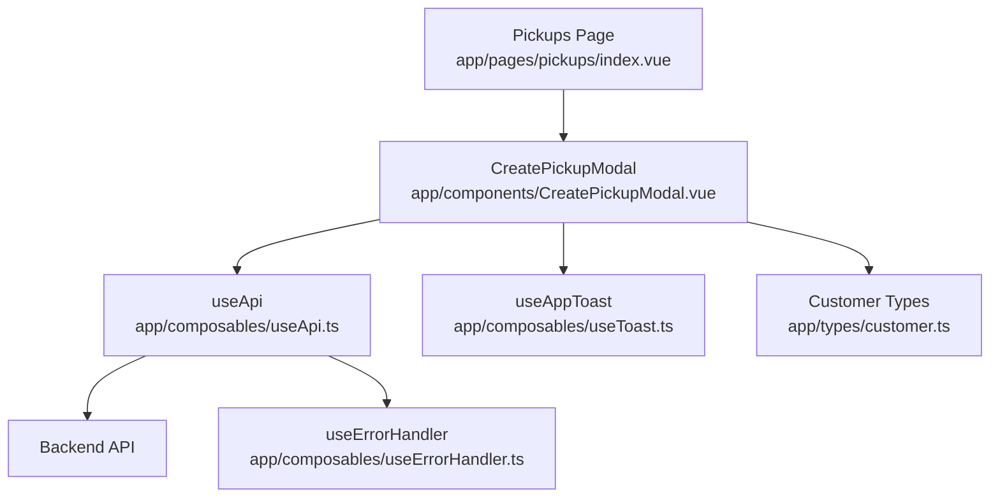
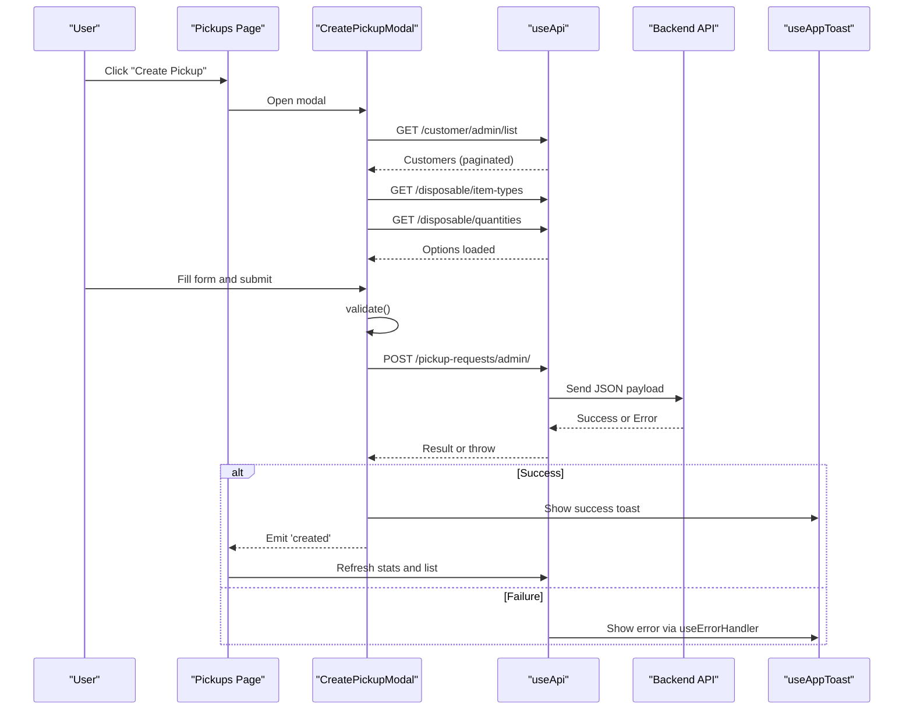
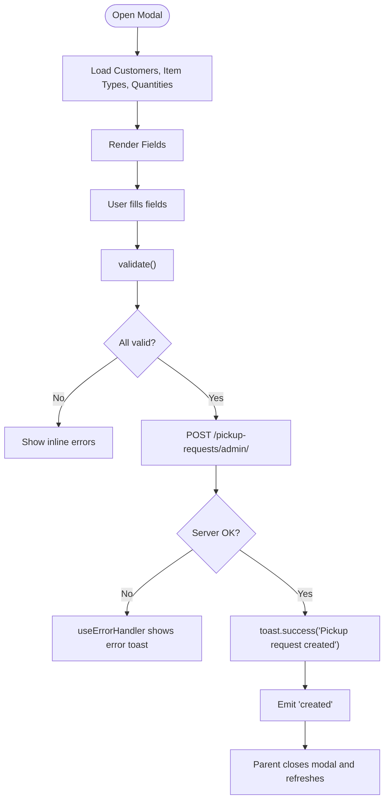
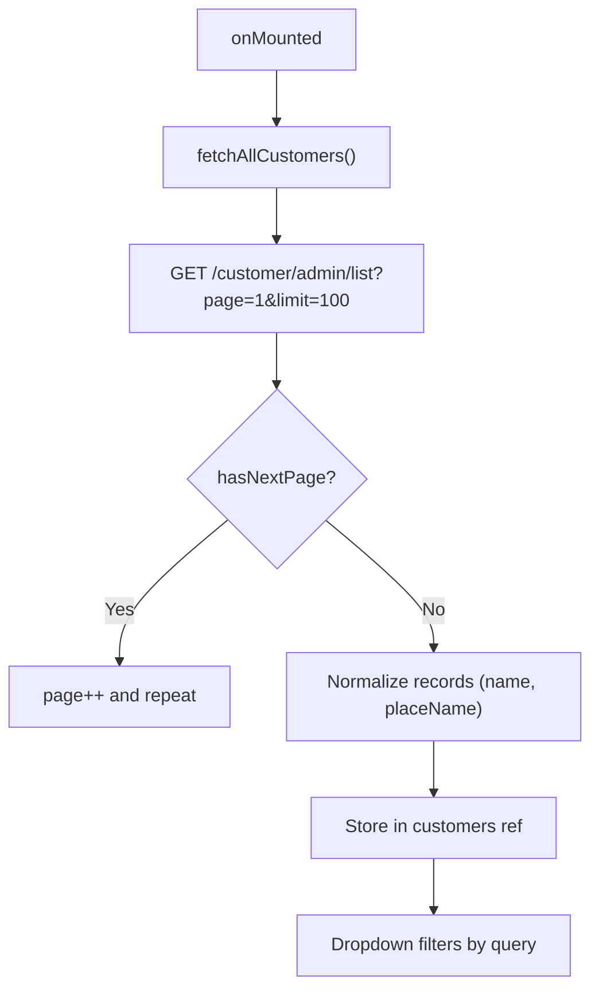
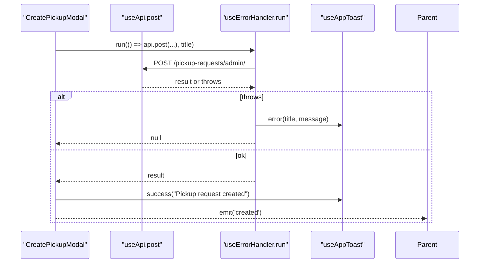
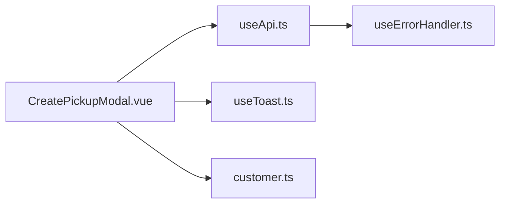

# Pickup Request Creation

<cite>
**Referenced Files in This Document**
- [CreatePickupModal.vue](file://app/components/CreatePickupModal.vue)
- [index.vue (Pickups page)](file://app/pages/pickups/index.vue)
- [useApi.ts](file://app/composables/useApi.ts)
- [useToast.ts](file://app/composables/useToast.ts)
- [useErrorHandler.ts](file://app/composables/useErrorHandler.ts)
- [customer.ts](file://app/types/customer.ts)
</cite>

## Table of Contents
1. [Introduction](#introduction)
2. [Project Structure](#project-structure)
3. [Core Components](#core-components)
4. [Architecture Overview](#architecture-overview)
5. [Detailed Component Analysis](#detailed-component-analysis)
6. [Dependency Analysis](#dependency-analysis)
7. [Performance Considerations](#performance-considerations)
8. [Troubleshooting Guide](#troubleshooting-guide)
9. [Conclusion](#conclusion)

## Introduction
This document explains the pickup request creation workflow with a focus on:
- Form validation rules and user feedback
- Customer selection process and search behavior
- Location-related data handling
- Data submission flow to the backend
- The CreatePickupModal component structure and fields
- Integration patterns with the customer management system
- Concrete examples for subscription-based pickups and one-time collections

The implementation centers on a modal form that collects required information, validates inputs, and posts a new pickup request via a centralized API client.

## Project Structure
Key files involved in the pickup request creation workflow:
- Modal component that renders the form and handles submission
- Parent page that opens the modal and refreshes state after creation
- Shared composables for API calls, error handling, and toast notifications
- Type definitions used across the application for customers and related entities

**Diagram sources**
- [index.vue (Pickups page):1-567](file://app/pages/pickups/index.vue#L1-L567)
- [CreatePickupModal.vue:1-293](file://app/components/CreatePickupModal.vue#L1-L293)
- [useApi.ts:1-91](file://app/composables/useApi.ts#L1-L91)
- [useToast.ts:1-37](file://app/composables/useToast.ts#L1-L37)
- [useErrorHandler.ts:1-29](file://app/composables/useErrorHandler.ts#L1-L29)
- [customer.ts:1-103](file://app/types/customer.ts#L1-L103)

**Section sources**
- [CreatePickupModal.vue:1-293](file://app/components/CreatePickupModal.vue#L1-L293)
- [index.vue (Pickups page):1-567](file://app/pages/pickups/index.vue#L1-L567)
- [useApi.ts:1-91](file://app/composables/useApi.ts#L1-L91)
- [useToast.ts:1-37](file://app/composables/useToast.ts#L1-L37)
- [useErrorHandler.ts:1-29](file://app/composables/useErrorHandler.ts#L1-L29)
- [customer.ts:1-103](file://app/types/customer.ts#L1-L103)

## Core Components
- CreatePickupModal: Renders the form, manages local state, performs validation, fetches dropdown options, and submits the request.
- Pickups Page: Opens the modal, listens for creation events, and refreshes stats and list after success.
- useApi: Centralized HTTP client with authentication headers, response parsing, and 401 handling.
- useErrorHandler: Wraps async operations to show toast errors and return null on failure.
- useAppToast: Provides success/error/info/warning toasts.
- customer.ts: Defines shared types for customers and related entities.

**Section sources**
- [CreatePickupModal.vue:1-293](file://app/components/CreatePickupModal.vue#L1-L293)
- [index.vue (Pickups page):1-567](file://app/pages/pickups/index.vue#L1-L567)
- [useApi.ts:1-91](file://app/composables/useApi.ts#L1-L91)
- [useErrorHandler.ts:1-29](file://app/composables/useErrorHandler.ts#L1-L29)
- [useToast.ts:1-37](file://app/composables/useToast.ts#L1-L37)
- [customer.ts:1-103](file://app/types/customer.ts#L1-L103)

## Architecture Overview
The pickup request creation follows a clear sequence from UI to backend:

**Diagram sources**
- [CreatePickupModal.vue:75-152](file://app/components/CreatePickupModal.vue#L75-L152)
- [index.vue (Pickups page):547-552](file://app/pages/pickups/index.vue#L547-L552)
- [useApi.ts:9-67](file://app/composables/useApi.ts#L9-L67)
- [useErrorHandler.ts:10-28](file://app/composables/useErrorHandler.ts#L10-L28)
- [useToast.ts:14-36](file://app/composables/useToast.ts#L14-L36)

## Detailed Component Analysis

### CreatePickupModal Component
Responsibilities:
- Load reference data (customers, disposable item types, estimated quantities)
- Provide searchable customer selection
- Validate form fields
- Submit the pickup request
- Provide user feedback via toasts and inline errors

Form fields and behavior:
- Customer: Searchable input with dropdown; filters by name, phone number, and place name; caps results to 50; clears selection if search text changes away from selected name.
- Disposable Item Type: Required select populated from backend.
- Estimated Quantity: Required select filtered to active items only.
- Preferred Pickup Date: Required date input.
- Additional Notes: Optional textarea with max length 500 and live character count.

Validation rules:
- Customer must be selected.
- Disposable item type must be selected.
- Estimated quantity must be selected.
- Preferred pickup date must be provided.
- Additional notes must not exceed 500 characters.

Submission payload:
- customerId
- disposableItemTypeId
- estimatedQuantityId
- preferredPickupDate
- paymentType: hardcoded to "subscription"
- additionalNotes (trimmed)

Error handling:
- Inline field-level errors are cleared before validation and shown when invalid.
- Network errors are handled by useErrorHandler which shows a toast and returns null.
- Successful creation triggers a success toast and emits an event to refresh parent state.

Integration points:
- Customer list endpoint is paginated and normalized to include top-level name and placeName for display.
- Dropdown options endpoints support both array and object responses.

**Diagram sources**
- [CreatePickupModal.vue:121-152](file://app/components/CreatePickupModal.vue#L121-L152)
- [CreatePickupModal.vue:75-119](file://app/components/CreatePickupModal.vue#L75-L119)
- [useErrorHandler.ts:10-28](file://app/composables/useErrorHandler.ts#L10-L28)
- [useToast.ts:14-36](file://app/composables/useToast.ts#L14-L36)

**Section sources**
- [CreatePickupModal.vue:1-293](file://app/components/CreatePickupModal.vue#L1-L293)

### Customer Selection Process
- On mount, the modal fetches all customers using pagination until hasNextPage is false.
- Each customer record is normalized so that name and placeName are available at the top level for consistent filtering and display.
- The search box filters by name, phone number, and place name, limiting results to 50.
- Selecting a customer updates the form.customerId and clears any existing field error.

**Diagram sources**
- [CreatePickupModal.vue:75-98](file://app/components/CreatePickupModal.vue#L75-L98)
- [CreatePickupModal.vue:58-73](file://app/components/CreatePickupModal.vue#L58-L73)

**Section sources**
- [CreatePickupModal.vue:75-98](file://app/components/CreatePickupModal.vue#L75-L98)
- [CreatePickupModal.vue:58-73](file://app/components/CreatePickupModal.vue#L58-L73)

### Location Validation and Data Handling
- The modal does not perform explicit location validation. It relies on the customer’s address/placeName being present in the customer record.
- During normalization, placeName is mapped from the customer’s address if missing, ensuring the dropdown can display location context.
- There is no geocoding or distance check in this component.

**Section sources**
- [CreatePickupModal.vue:87-91](file://app/components/CreatePickupModal.vue#L87-L91)
- [customer.ts:34-55](file://app/types/customer.ts#L34-L55)

### Data Submission Handling
- The submit function validates the form, sets submitting state, and posts to the admin endpoint.
- The paymentType is set to "subscription".
- On success, a success toast is shown and the parent is notified via the 'created' event to refresh data.
- Errors are surfaced through useErrorHandler, which displays a toast and returns null to callers.

**Diagram sources**
- [CreatePickupModal.vue:131-152](file://app/components/CreatePickupModal.vue#L131-L152)
- [useApi.ts:73-78](file://app/composables/useApi.ts#L73-L78)
- [useErrorHandler.ts:10-28](file://app/composables/useErrorHandler.ts#L10-L28)
- [useToast.ts:14-36](file://app/composables/useToast.ts#L14-L36)

**Section sources**
- [CreatePickupModal.vue:131-152](file://app/components/CreatePickupModal.vue#L131-L152)
- [useApi.ts:73-78](file://app/composables/useApi.ts#L73-L78)
- [useErrorHandler.ts:10-28](file://app/composables/useErrorHandler.ts#L10-L28)
- [useToast.ts:14-36](file://app/composables/useToast.ts#L14-L36)

### Parent Page Integration
- The Pickups page toggles the modal visibility and listens for the 'created' event.
- On 'created', it closes the modal and refreshes stats and the requests list to reflect the new pickup.

**Section sources**
- [index.vue (Pickups page):547-552](file://app/pages/pickups/index.vue#L547-L552)

## Dependency Analysis
- CreatePickupModal depends on:
  - useApi for network requests
  - useAppToast for user feedback
  - useErrorHandler for error wrapping
  - Reactive refs/computed for form state and filtering
- useApi depends on:
  - Runtime config for base URL
  - Auth store for token injection
  - Router for 401 redirects
  - useErrorHandler for consistent error handling
- Use of shared types ensures consistency between frontend models and backend responses.

**Diagram sources**
- [CreatePickupModal.vue:1-293](file://app/components/CreatePickupModal.vue#L1-L293)
- [useApi.ts:1-91](file://app/composables/useApi.ts#L1-L91)
- [useToast.ts:1-37](file://app/composables/useToast.ts#L1-L37)
- [useErrorHandler.ts:1-29](file://app/composables/useErrorHandler.ts#L1-L29)
- [customer.ts:1-103](file://app/types/customer.ts#L1-L103)

**Section sources**
- [CreatePickupModal.vue:1-293](file://app/components/CreatePickupModal.vue#L1-L293)
- [useApi.ts:1-91](file://app/composables/useApi.ts#L1-L91)
- [useToast.ts:1-37](file://app/composables/useToast.ts#L1-L37)
- [useErrorHandler.ts:1-29](file://app/composables/useErrorHandler.ts#L1-L29)
- [customer.ts:1-103](file://app/types/customer.ts#L1-L103)

## Performance Considerations
- Customer loading uses pagination with a fixed limit and loops until hasNextPage is false. For large datasets, consider:
  - Debouncing search input to reduce re-renders
  - Implementing server-side search instead of client-side filtering over all customers
  - Caching option lists (item types and quantities) to avoid repeated fetches
- The modal disables the submit button while submitting to prevent duplicate submissions.

[No sources needed since this section provides general guidance]

## Troubleshooting Guide
Common issues and resolutions:
- Customer not found in dropdown:
  - Ensure the customer exists and is returned by the list endpoint.
  - Check that normalization maps name and placeName correctly.
- Validation errors persist:
  - Confirm that selecting a customer clears the customerId error.
  - Verify that all required fields are filled before submission.
- Network failures:
  - useErrorHandler will show a toast with the provided title and error message.
  - Inspect console logs from useApi for status codes and payloads.
- 401 Unauthorized:
  - useApi automatically logs out and redirects to login on 401. Re-authenticate and retry.

**Section sources**
- [CreatePickupModal.vue:66-73](file://app/components/CreatePickupModal.vue#L66-L73)
- [CreatePickupModal.vue:121-129](file://app/components/CreatePickupModal.vue#L121-L129)
- [useApi.ts:39-44](file://app/composables/useApi.ts#L39-L44)
- [useErrorHandler.ts:10-28](file://app/composables/useErrorHandler.ts#L10-L28)

## Conclusion
The pickup request creation workflow is implemented as a focused modal with robust validation, clear user feedback, and reliable integration with the customer management system. While the current implementation hardcodes paymentType to "subscription", the same pattern can be extended to support one-time collections by adjusting the payload and UI accordingly.

[No sources needed since this section summarizes without analyzing specific files]

## Appendices

### Form Field Reference
- Customer: Searchable select; required; filters by name, phone, place name; normalizes name and placeName.
- Disposable Item Type: Required select; sourced from backend.
- Estimated Quantity: Required select; filtered to active entries.
- Preferred Pickup Date: Required date input.
- Additional Notes: Optional; max 500 characters; live counter.

**Section sources**
- [CreatePickupModal.vue:33-40](file://app/components/CreatePickupModal.vue#L33-L40)
- [CreatePickupModal.vue:121-129](file://app/components/CreatePickupModal.vue#L121-L129)

### API Endpoints Used
- GET /customer/admin/list?limit=&page=
- GET /disposable/item-types
- GET /disposable/quantities
- POST /pickup-requests/admin/

**Section sources**
- [CreatePickupModal.vue:75-119](file://app/components/CreatePickupModal.vue#L75-L119)
- [CreatePickupModal.vue:135-146](file://app/components/CreatePickupModal.vue#L135-L146)

### Example Scenarios

#### Subscription-Based Pickup
- Steps:
  - Open the modal from the Pickups page.
  - Search and select a customer.
  - Choose a disposable item type and estimated quantity.
  - Set preferred pickup date and optional notes.
  - Submit; on success, the modal closes and the list refreshes.
- Notes:
  - paymentType is set to "subscription" in the payload.

**Section sources**
- [CreatePickupModal.vue:135-146](file://app/components/CreatePickupModal.vue#L135-L146)
- [index.vue (Pickups page):547-552](file://app/pages/pickups/index.vue#L547-L552)

#### One-Time Collection (Conceptual Extension)
- To support one-time collections:
  - Add a paymentType selector to the modal (e.g., "subscription" vs "pay-as-you-go").
  - Update the submit payload to send the selected paymentType.
  - Optionally adjust validation or business logic based on paymentType.
- This would mirror the existing flow but allow dynamic paymentType selection.

[No sources needed since this scenario extends current behavior conceptually]